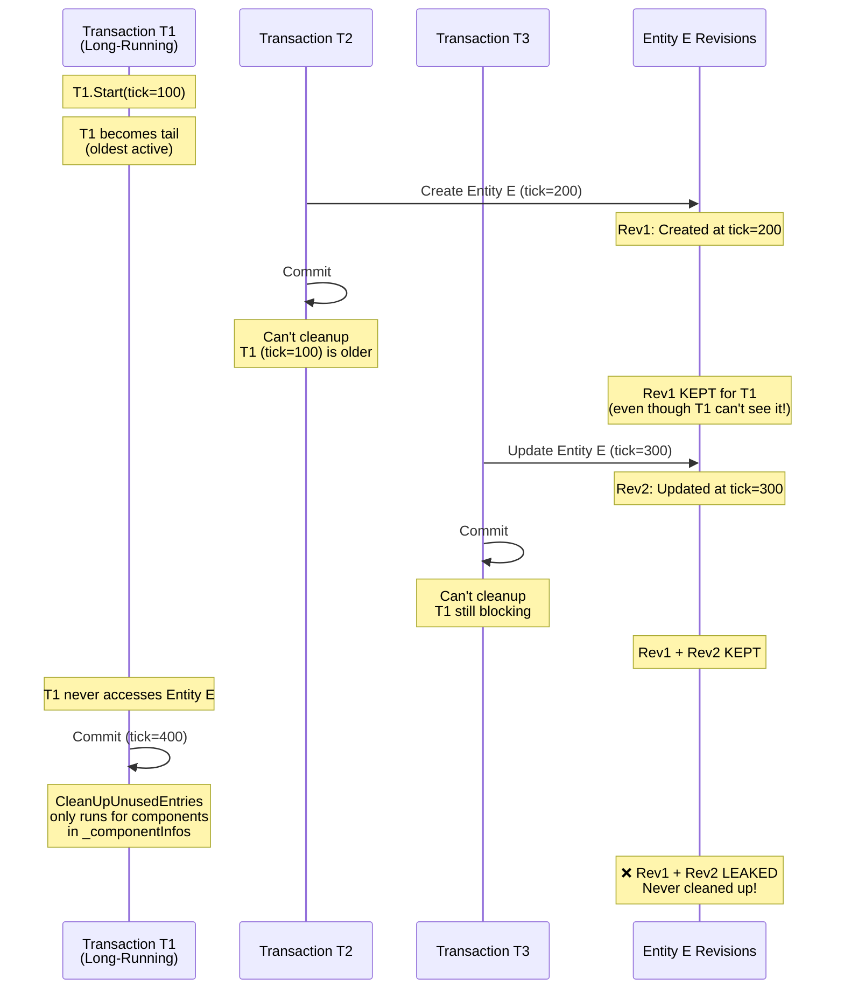
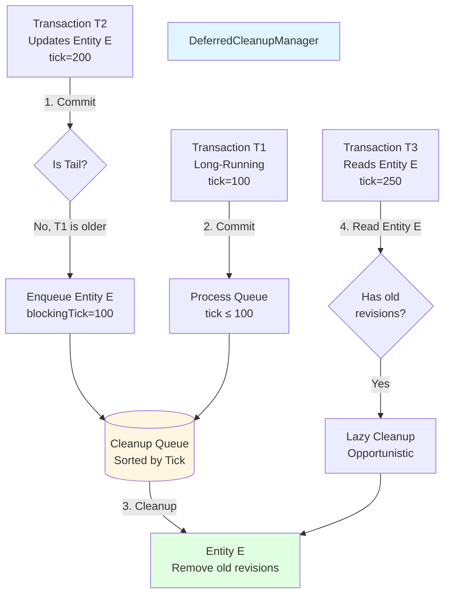
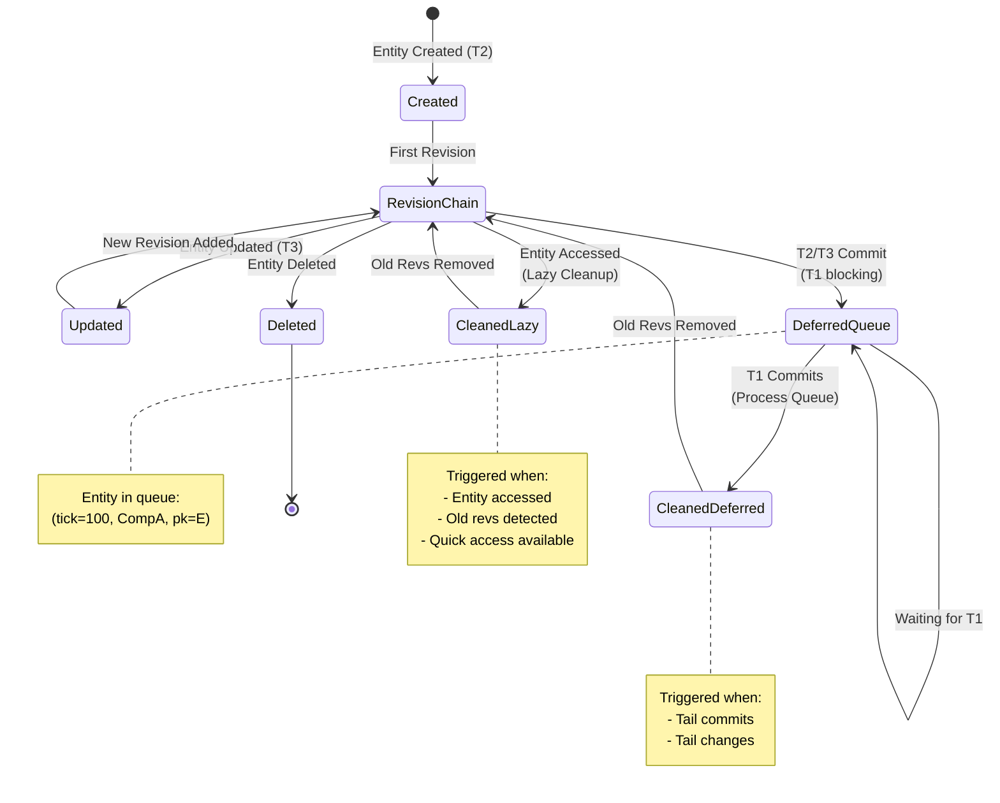
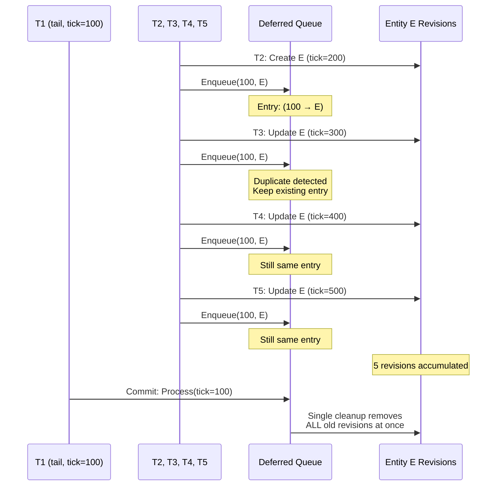
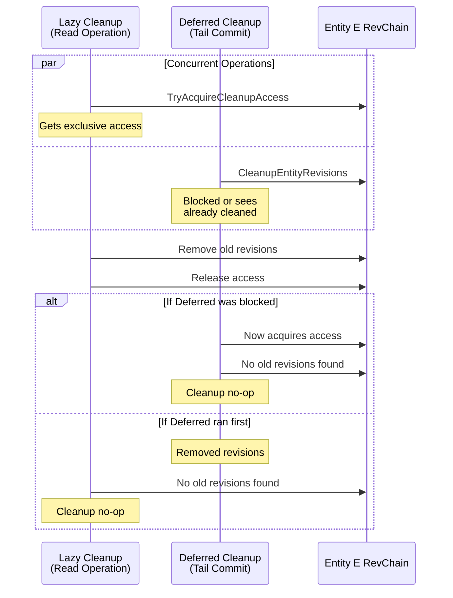

# Component Revision Deferred Cleanup

## Overview

This document describes a critical memory leak in the MVCC (Multi-Version Concurrency Control) implementation and proposes a hybrid solution combining deferred cleanup queues with lazy opportunistic cleanup.

**GitHub Issue:** #46
**Branch:** `fix/46-mvcc-revision-leak`
**Status**: Complete
**Target Implementation**: Typhon.Engine v1.x
**Related Components**: Transaction, TransactionChain, ComponentTable, MVCC

---

## Problem Statement

### The MVCC Revision Leak

The current MVCC implementation has a memory/storage leak when long-running transactions exist alongside concurrent write activity. Old component revisions accumulate indefinitely for entities that were modified during a long-running transaction's lifetime but were never accessed by that transaction.

### Concrete Example

Consider this timeline:



### Root Cause

The cleanup mechanism in `Transaction.Commit()` only iterates over components that the transaction actually touched:

```pseudocode
// Transaction.Commit() - current implementation
for each componentInfo in _componentInfos.Values:
    for each pk in componentInfo.CompRevInfoCache.Keys:
        CommitComponent(componentInfo, pk, ...)
        if isTail:
            CleanUpUnusedEntries(componentInfo, pk, ...)
```

**The Problem**:
- `_componentInfos` only contains components this transaction read/wrote
- `CompRevInfoCache` only contains entities this transaction accessed
- If T1 (the tail) never accessed Entity E, there's no entry to trigger cleanup
- Old revisions for E remain forever

### Severity & Impact

**Affected Workloads**:
- Long-running read transactions (analytics, reports, batch processing)
- High write activity on entities not accessed by long-running transactions
- Systems with many entities and continuous updates

**Consequences**:
- **Memory Leak**: Revision chains grow unbounded
- **Storage Leak**: Persistent database file size increases
- **Performance Degradation**: Longer revision chains slow down lookups
- **Cache Pollution**: Page cache filled with old revisions

---

## Proposed Solution: Hybrid Deferred + Lazy Cleanup

### Solution Overview

We implement a **two-pronged approach**:

1. **Deferred Cleanup Queue**: Track entities that need cleanup but are blocked by older transactions
2. **Lazy Opportunistic Cleanup**: Clean old revisions when entities are accessed

This provides:
- ✅ **Guaranteed eventual cleanup** (via queue processing)
- ✅ **Immediate cleanup for hot data** (via lazy cleanup)
- ✅ **Minimal overhead** (only track entities that actually need deferred cleanup)
- ✅ **No background threads** (all cleanup happens during normal operations)

### High-Level Architecture



---

## Design Details

### Data Structures

#### DeferredCleanupManager

```pseudocode
class DeferredCleanupManager:
    // Primary storage: Sorted by blocking tick for efficient range queries
    // Key: Tick of oldest transaction blocking cleanup
    // Value: List of entities that need cleanup once that tick completes
    private SortedDictionary<long, List<CleanupEntry>> _pendingCleanups

    // Reverse index: Fast lookup to avoid duplicates
    // Key: (ComponentTable, PrimaryKey)
    // Value: The blocking tick this entity is waiting for
    private Dictionary<(ComponentTable, long), long> _entityToBlockingTick

    // Thread safety
    private AccessControl _lock

    struct CleanupEntry:
        ComponentTable Table
        long PrimaryKey
```

**Design Rationale**:
- `SortedDictionary<long, ...>` enables efficient "get all entries where tick ≤ X"
- Reverse index provides O(1) duplicate detection
- `AccessControl` lock protects data structures (cleanup I/O happens outside lock)

### Core Operations

#### 1. Enqueue for Deferred Cleanup

Called when a non-tail transaction commits and can't clean up immediately.

```pseudocode
function Enqueue(blockingTick: long, table: ComponentTable, pk: long):
    acquire _lock:
        key = (table, pk)

        // Check if already queued
        if _entityToBlockingTick.contains(key):
            existingTick = _entityToBlockingTick[key]

            // Keep the OLDEST blocking tick
            // Cleanup should happen when the oldest blocker completes
            if blockingTick >= existingTick:
                return  // Already waiting for an older transaction

            // New blocking tick is older - migrate to new bucket
            RemoveFromList(existingTick, table, pk)

        // Add to appropriate tick bucket
        if not _pendingCleanups.contains(blockingTick):
            _pendingCleanups[blockingTick] = new List()

        _pendingCleanups[blockingTick].Add((table, pk))
        _entityToBlockingTick[key] = blockingTick

        // Optional: Monitor queue size
        if _entityToBlockingTick.Count > HighWaterMark:
            LogWarning("Deferred cleanup queue size exceeded threshold")
```

#### 2. Process Deferred Cleanups

Called when a tail transaction commits or when the tail changes.

```pseudocode
function ProcessDeferredCleanups(completedTick: long, nextMinTick: long, changeSet: ChangeSet):
    toCleanup = new List<CleanupEntry>()
    ticksToRemove = new List<long>()

    acquire _lock:
        // Collect all entries where blockingTick <= completedTick
        // Sorted order allows early termination
        for each (tick, entryList) in _pendingCleanups:
            if tick > completedTick:
                break  // No more relevant entries

            toCleanup.AddAll(entryList)
            ticksToRemove.Add(tick)

            // Remove from reverse lookup
            for each (table, pk) in entryList:
                _entityToBlockingTick.Remove((table, pk))

        // Remove processed tick buckets
        for each tick in ticksToRemove:
            _pendingCleanups.Remove(tick)

    // Perform cleanup OUTSIDE the lock (I/O operations)
    cleanedCount = 0
    for each (table, pk) in toCleanup:
        if CleanupEntityRevisions(table, pk, nextMinTick, changeSet):
            cleanedCount++

    return cleanedCount
```

#### 3. Cleanup Entity Revisions

The actual cleanup logic for a single entity's revision chain.

```pseudocode
function CleanupEntityRevisions(table: ComponentTable, pk: long,
                                 nextMinTick: long, changeSet: ChangeSet):
    // Get revision chain from primary key index
    indexAccessor = table.DefaultIndexSegment.CreateChunkAccessor(changeSet)

    if not table.PrimaryKeyIndex.TryGet(pk, out compRevFirstChunkId, indexAccessor):
        return false  // Entity deleted - nothing to cleanup

    revTableAccessor = table.CompRevTableSegment.CreateChunkAccessor(changeSet)

    // Read revision chain header
    header = ReadCompRevStorageHeader(compRevFirstChunkId, revTableAccessor)

    // Find revisions older than nextMinTick
    oldRevisionsCount = CountRevisionsOlderThan(header, nextMinTick, revTableAccessor)

    if oldRevisionsCount == 0:
        return false  // No cleanup needed

    // Remove old revisions from the chain
    // This may involve:
    // 1. Updating FirstItemIndex and FirstItemRevision
    // 2. Deallocating chunks if entire chunks are old
    // 3. Updating the circular buffer pointers
    RemoveOldRevisions(header, compRevFirstChunkId, oldRevisionsCount,
                       revTableAccessor, changeSet)

    return true
```

#### 4. Lazy Opportunistic Cleanup

Called during entity access (read/write operations).

```pseudocode
function GetCompRevInfoFromIndex(pk: long, componentInfo: ComponentInfo,
                                  tick: long, out compRevInfo: CompRevInfo):
    // ... existing logic to find the revision ...

    foundRevision = FindRevisionForTick(pk, tick, out compRevInfo)

    if foundRevision:
        // Opportunistic cleanup: check if old revisions exist
        if ShouldAttemptLazyCleanup(compRevInfo):
            minTick = _transactionChain.MinTick

            // Only cleanup if we can acquire exclusive access quickly
            if TryAcquireCleanupAccess(componentInfo, timeout=0):
                try:
                    CleanupOldRevisions(componentInfo, pk, minTick)
                finally:
                    ReleaseCleanupAccess(componentInfo)

    return foundRevision

function ShouldAttemptLazyCleanup(compRevInfo: CompRevInfo):
    // Heuristics to avoid cleanup overhead on every read
    header = compRevInfo.Header

    // Only attempt if chain has grown significantly
    if header.ItemCount < LazyCleanupThreshold:
        return false

    // Estimate age of oldest revision
    if EstimateOldestRevisionAge(header) < LazyCleanupMinAge:
        return false

    // Rate limiting: don't cleanup too frequently
    if TimeSinceLastLazyCleanup(compRevInfo) < LazyCleanupInterval:
        return false

    return true
```

---

## Integration Points

### 1. Transaction Commit - Enqueue Phase

When a **non-tail** transaction commits:

```pseudocode
// In Transaction.CommitComponent()
function CommitComponent(componentInfo: ComponentInfo, pk: long, ...):
    // ... existing commit logic ...

    // Write new revision, update indexes, etc.
    CommitRevisionToStorage(componentInfo, pk, ...)

    // Check if we're the tail
    isTail = (_transactionChain.Tail == this)

    if not isTail:
        // Can't cleanup now - enqueue for deferred cleanup
        tailTick = _transactionChain.Tail.TransactionTick
        _databaseEngine.DeferredCleanupManager.Enqueue(
            blockingTick: tailTick,
            table: componentInfo.ComponentTable,
            pk: pk
        )
    else:
        // We're the tail - can cleanup immediately
        CleanUpUnusedEntries(componentInfo, pk, ...)
```

### 2. Transaction Commit - Process Phase

When a **tail** transaction commits:

```pseudocode
// In Transaction.Commit()
function Commit():
    // Phase 1: Commit all changes
    for each componentInfo in _componentInfos.Values:
        for each pk in componentInfo.CompRevInfoCache.Keys:
            CommitComponent(componentInfo, pk, ...)

    // Phase 2: Process own cleanups (existing logic)
    isTail = (_transactionChain.Tail == this)
    if isTail:
        for each componentInfo in _componentInfos.Values:
            for each pk in componentInfo.CompRevInfoCache.Keys:
                CleanUpUnusedEntries(componentInfo, pk, ...)

    // Phase 3: Process deferred cleanups from OTHER transactions
    if isTail:
        nextMinTick = DetermineNextMinTick()
        cleanedCount = _databaseEngine.DeferredCleanupManager.ProcessDeferredCleanups(
            completedTick: this.TransactionTick,
            nextMinTick: nextMinTick,
            changeSet: _changeSet
        )

        if cleanedCount > 0:
            LogDebug("Deferred cleanup processed {count} entities", cleanedCount)

    // Phase 4: Remove from transaction chain
    _transactionChain.Remove(this)

    return true

function DetermineNextMinTick():
    // After we're removed, what's the new minimum tick?
    nextTail = this.Next
    if nextTail != null:
        return nextTail.TransactionTick
    else:
        // No more active transactions - can clean everything up to now
        return CurrentTick()
```

### 3. Transaction Chain - Tail Change Handling

When the tail is removed (commit, rollback, or dispose):

```pseudocode
// In TransactionChain.Remove()
function Remove(transaction: Transaction):
    acquire _chainLock:
        // ... existing removal logic ...

        wasTail = (transaction == _tail)

        // Update linked list
        if transaction.Previous != null:
            transaction.Previous.Next = transaction.Next

        if transaction.Next != null:
            transaction.Next.Previous = transaction.Previous

        // Update head/tail pointers
        if transaction == _head:
            _head = transaction.Previous

        if transaction == _tail:
            _tail = transaction.Next
            newTail = _tail
        else:
            newTail = null

    // If tail changed, trigger deferred cleanup processing
    if wasTail and newTail != null:
        nextMinTick = DetermineNextMinTickAfterRemoval(newTail)

        // Use a temporary ChangeSet for this cleanup operation
        using tempChangeSet = CreateChangeSetForCleanup():
            _databaseEngine.DeferredCleanupManager.ProcessDeferredCleanups(
                completedTick: transaction.TransactionTick,
                nextMinTick: nextMinTick,
                changeSet: tempChangeSet
            )
```

### 4. Entity Access - Lazy Cleanup

During normal entity reads:

```pseudocode
// In Transaction.ReadEntity() or similar access methods
function ReadEntity<T>(pk: long, out component: T):
    componentInfo = GetOrCreateComponentInfo<T>()

    // Get revision appropriate for this transaction's snapshot
    if GetCompRevInfoFromIndex(pk, componentInfo, this.TransactionTick, out revInfo):
        // Read component data
        component = ReadComponentData<T>(revInfo)

        // Lazy cleanup is already integrated in GetCompRevInfoFromIndex

        return true
    else:
        component = default
        return false
```

---

## Component Lifecycle Diagram



---

## Edge Cases and Considerations

### 1. Entity Deleted Before Deferred Cleanup

**Scenario**: Entity E is enqueued for cleanup, but is deleted before the tail transaction commits.

```pseudocode
function CleanupEntityRevisions(table: ComponentTable, pk: long, ...):
    if not table.PrimaryKeyIndex.TryGet(pk, out compRevFirstChunkId, ...):
        // Entity no longer exists - silently succeed
        // The deletion already cleaned up all revisions
        return false

    // Continue with normal cleanup
    ...
```

**Handling**:
- Cleanup operation detects missing entity and returns gracefully
- No error condition - deletion already achieved the cleanup goal
- Entry removed from queue during normal processing

### 2. Multiple Updates While Blocked

**Scenario**: Entity E is updated multiple times (T2, T3, T4, T5) while T1 is still active.



**Handling**:
- Enqueue operation checks for duplicates via `_entityToBlockingTick`
- Only one queue entry exists per entity regardless of update frequency
- When cleanup runs, it processes the entire revision chain at once
- All accumulated old revisions removed in single operation

### 3. Transaction Disposal Without Commit/Rollback

**Scenario**: T1 is disposed (garbage collected, exception, crash) without explicit commit or rollback.

```pseudocode
// In Transaction.Dispose()
function Dispose():
    if _isDisposed:
        return

    _isDisposed = true

    // If not committed or rolled back, treat as rollback
    if not _isCommitted and not _isRolledBack:
        Rollback()

    // Remove from chain - this triggers deferred cleanup if we were tail
    _transactionChain.Remove(this)

    // Cleanup resources
    _changeSet?.Dispose()
    ReturnToPool(this)
```

**Handling**:
- Disposal triggers chain removal
- Chain removal detects tail change and processes deferred cleanups
- No special case needed - same path as normal commit

### 4. Concurrent Tail Commits

**Scenario**: T1 (tail at tick=100) and T2 (tick=200) both commit concurrently. T1 should process cleanups for tick ≤ 100, T2 for tick ≤ 200.

```pseudocode
// Thread safety in ProcessDeferredCleanups
function ProcessDeferredCleanups(completedTick: long, ...):
    // Lock protects queue data structure access
    acquire _lock:
        for each (tick, entryList) in _pendingCleanups:
            if tick > completedTick:
                break  // Process only relevant entries
            ...
    // Lock released

    // Actual cleanup I/O happens outside lock
    for each entry in toCleanup:
        CleanupEntityRevisions(...)
```

**Handling**:
- Lock protects queue structure but doesn't cover cleanup I/O
- Each transaction processes only entries ≤ its own tick
- Sorted dictionary ensures correct partitioning
- Cleanup operations on different entities are independent and safe

### 5. Memory Pressure on Queue

**Scenario**: Extremely long-running transaction with millions of entity updates.

```pseudocode
function Enqueue(blockingTick: long, table: ComponentTable, pk: long):
    acquire _lock:
        // ... normal enqueue logic ...

        // Monitor queue size
        currentSize = _entityToBlockingTick.Count

        if currentSize > HighWaterMark:
            LogWarning("Deferred cleanup queue size {size} exceeds threshold {threshold}. " +
                      "Long-running transaction at tick {tick} blocking cleanup.",
                      currentSize, HighWaterMark, blockingTick)

            // Optional: Emit metric for monitoring
            EmitMetric("deferred_cleanup_queue_size", currentSize)

            // Optional: Trigger aggressive lazy cleanup
            if currentSize > CriticalThreshold:
                TriggerAggressiveLazyCleanup()
```

**Handling**:
- Monitor queue size and log warnings at thresholds
- Each entity appears only once in queue (no duplicates)
- Queue size bounded by number of distinct entities modified
- Monitoring allows operators to identify problematic long-running transactions
- Optional aggressive lazy cleanup as pressure relief valve

### 6. Race: Lazy Cleanup vs. Deferred Cleanup

**Scenario**: Entity E is both in deferred queue AND gets accessed (triggering lazy cleanup) concurrently.



**Handling**:
- Both operations use same underlying cleanup logic
- Access control ensures serialization at entity level
- Idempotent: Running cleanup twice is safe (second is no-op)
- No double-free or corruption possible

### 7. Cleanup During Snapshot Isolation Window

**Scenario**: T1 commits and triggers cleanup, but T2 (older snapshot) is still reading.

```pseudocode
function ProcessDeferredCleanups(completedTick: long, nextMinTick: long, ...):
    // nextMinTick is the tick of the NEXT oldest transaction after this one
    // This ensures we only clean revisions that NO active transaction can see

    for each (table, pk) in toCleanup:
        CleanupEntityRevisions(table, pk, nextMinTick, ...)

function CleanupEntityRevisions(..., nextMinTick: long, ...):
    // Only remove revisions with tick < nextMinTick
    // Any revision at or after nextMinTick might be visible to active transactions
    for each revision in revisionChain:
        if revision.Tick < nextMinTick:
            MarkForRemoval(revision)
        else:
            break  // Keep this and all newer revisions
```

**Handling**:
- Cleanup uses `nextMinTick` (next oldest transaction) as cutoff
- Never removes revisions visible to any active transaction
- Maintains MVCC snapshot isolation guarantees
- Safe even with concurrent reads

---

## Performance Characteristics

### Time Complexity

| Operation | Complexity | Notes |
|-----------|-----------|-------|
| Enqueue | O(log N) | SortedDictionary insert + Dictionary check |
| ProcessDeferredCleanups | O(M + K×R) | M = matching entries, K = entities to clean, R = avg revisions |
| LazyCleanup | O(R) | R = revisions in chain (typically small) |
| Duplicate Check | O(1) | Dictionary lookup |

### Space Complexity

| Structure | Size | Growth |
|-----------|------|--------|
| _pendingCleanups | O(E×T) | E = modified entities, T = distinct blocking ticks |
| _entityToBlockingTick | O(E) | E = modified entities (bounded by distinct entities) |

**Best Case**: Short-lived transactions → queue remains mostly empty
**Worst Case**: One very long transaction + continuous updates → queue size = distinct modified entities

### Memory Overhead

```pseudocode
// Per queue entry
Entry = ComponentTable reference (8 bytes)
      + PrimaryKey (8 bytes)
      + Tick (8 bytes)
      + Dictionary overhead (~24 bytes)
      ≈ 48 bytes per entry

// For 1 million distinct entities modified during long transaction
Queue Memory = 1M × 48 bytes ≈ 48 MB

// This is acceptable for the benefit gained
```

### Optimization Strategies

1. **Queue Size Limits**: Set `HighWaterMark` to trigger warnings
2. **Batch Processing**: Process deferred cleanups in configurable batch sizes
3. **Lazy Cleanup Rate Limiting**: Avoid cleanup overhead on every read
4. **Fast Path**: Skip queue operations when no older transactions exist

---

## Configuration and Tuning

### Configuration Parameters

```pseudocode
class DeferredCleanupOptions:
    // Queue management
    int HighWaterMark = 100_000           // Warn when queue exceeds this size
    int CriticalThreshold = 1_000_000     // Critical queue size

    // Lazy cleanup tuning
    int LazyCleanupThreshold = 10         // Min revisions before lazy cleanup
    TimeSpan LazyCleanupMinAge = 1.Second // Min age of oldest revision
    TimeSpan LazyCleanupInterval = 100.Milliseconds  // Rate limit per entity

    // Batch processing
    int MaxCleanupBatchSize = 1000        // Max entities to clean in one batch

    // Monitoring
    bool EnableMetrics = true              // Emit queue size metrics
    TimeSpan MetricsInterval = 1.Minute    // Metrics emission frequency
```

### Tuning Guidelines

**For OLTP Workloads** (short transactions, high throughput):
- Lower `LazyCleanupThreshold` (e.g., 5) for aggressive cleanup
- Lower `LazyCleanupInterval` for more frequent cleanup
- Higher `MaxCleanupBatchSize` to process queue quickly

**For OLAP Workloads** (long transactions, complex queries):
- Higher `HighWaterMark` to accommodate expected queue growth
- Higher `LazyCleanupThreshold` to avoid read overhead
- Lower `MaxCleanupBatchSize` to avoid commit latency spikes

**For Mixed Workloads**:
- Use default values
- Monitor queue size metrics to detect imbalance
- Adjust based on observed patterns

---

## Testing Strategy

### Unit Tests

```pseudocode
TestClass: DeferredCleanupManagerTests

Test: EnqueueAndProcessSingleEntry
    manager = new DeferredCleanupManager()
    manager.Enqueue(100, tableA, pk=1)

    processed = manager.ProcessDeferredCleanups(100, 200, changeSet)

    assert processed == 1
    assert queue is empty

Test: EnqueueDuplicate_KeepsOldestTick
    manager.Enqueue(100, tableA, pk=1)
    manager.Enqueue(200, tableA, pk=1)  // Same entity, newer tick

    assert queue has 1 entry at tick=100
    assert queue has 0 entries at tick=200

Test: EnqueueDuplicate_MigratesToOlderTick
    manager.Enqueue(200, tableA, pk=1)
    manager.Enqueue(100, tableA, pk=1)  // Same entity, older tick

    assert queue has 0 entries at tick=200
    assert queue has 1 entry at tick=100

Test: ProcessPartialQueue
    manager.Enqueue(100, tableA, pk=1)
    manager.Enqueue(200, tableA, pk=2)
    manager.Enqueue(300, tableA, pk=3)

    processed = manager.ProcessDeferredCleanups(200, 250, changeSet)

    assert processed == 2  // Only pk=1 and pk=2
    assert queue still has entry for tick=300

Test: ProcessEmpty_DeletedEntity
    manager.Enqueue(100, tableA, pk=999)
    DeleteEntity(tableA, pk=999)

    processed = manager.ProcessDeferredCleanups(100, 200, changeSet)

    assert processed == 0  // Entity doesn't exist, cleanup skipped
    assert no errors thrown
```

### Integration Tests

```pseudocode
TestClass: DeferredCleanupIntegrationTests

Test: LongRunningTransaction_AccumulatesRevisions_CleansOnCommit
    t1 = dbe.CreateTransaction()  // Long-running, tick=100

    // Create and update entity while T1 is active
    t2 = dbe.CreateTransaction()  // tick=200
    pk = t2.CreateEntity(new CompA { Value = 1 })
    t2.Commit()

    t3 = dbe.CreateTransaction()  // tick=300
    t3.UpdateEntity(pk, new CompA { Value = 2 })
    t3.Commit()

    // Verify revisions exist
    revCount = CountRevisions(tableA, pk)
    assert revCount == 2

    // Verify queue has entry
    assert queueSize == 1

    // T1 commits - should trigger cleanup
    t1.Commit()

    // Verify old revisions cleaned
    revCount = CountRevisions(tableA, pk)
    assert revCount == 1

    // Verify queue is empty
    assert queueSize == 0

Test: LazyCleanup_CleansOnAccess
    t1 = dbe.CreateTransaction()  // tick=100

    // Create entity with multiple revisions
    CreateMultipleRevisions(tableA, pk=1, count=20)

    t1.Commit()  // T1 becomes tail and commits

    // Create new transaction
    t2 = dbe.CreateTransaction()  // tick=1000

    // Access entity - should trigger lazy cleanup
    t2.ReadEntity(pk=1, out comp)

    // Verify old revisions cleaned
    revCount = CountRevisions(tableA, pk=1)
    assert revCount < 20

Test: ConcurrentCommits_ProcessCorrectEntries
    t1 = dbe.CreateTransaction()  // tick=100
    t2 = dbe.CreateTransaction()  // tick=200

    // Create entities updated during T1 and T2
    CreateAndUpdate(pk=1, duringTick=100)  // Should be cleaned when T1 commits
    CreateAndUpdate(pk=2, duringTick=200)  // Should be cleaned when T2 commits

    // Both commit concurrently
    Parallel.Invoke(
        () => t1.Commit(),
        () => t2.Commit()
    )

    // Verify correct cleanups occurred
    assert NoOldRevisions(pk=1)
    assert NoOldRevisions(pk=2)
    assert queueSize == 0
```

### Stress Tests

```pseudocode
Test: HighConcurrency_ManyTransactions_QueueStability
    longRunner = dbe.CreateTransaction()

    // Spawn 1000 concurrent transactions that create/update entities
    tasks = for i in 1..1000:
        Task.Run(() => {
            t = dbe.CreateTransaction()
            pk = t.CreateEntity(new CompA { Value = i })
            t.Commit()
        })

    Task.WaitAll(tasks)

    // Queue should have ~1000 entries
    assert queueSize > 900 and queueSize < 1100

    // Commit long runner
    longRunner.Commit()

    // Queue should be empty or nearly empty
    assert queueSize < 10

Test: VeryLongTransaction_MillionUpdates
    longRunner = dbe.CreateTransaction()

    // Create 1 million distinct entities
    for i in 1..1_000_000:
        t = dbe.CreateTransaction()
        t.CreateEntity(new CompA { Value = i })
        t.Commit()

    // Verify queue size is reasonable
    assert queueSize == 1_000_000
    assert queueMemory < 100_MB

    // Commit long runner
    StartTimer()
    longRunner.Commit()
    elapsed = StopTimer()

    // Cleanup should complete in reasonable time
    assert elapsed < 30.Seconds
    assert queueSize == 0
```

---

## Monitoring and Observability

### Metrics to Track

```pseudocode
class DeferredCleanupMetrics:
    // Queue metrics
    Gauge: deferred_cleanup_queue_size          // Current number of entries
    Gauge: deferred_cleanup_oldest_tick         // Oldest blocking tick in queue
    Counter: deferred_cleanup_enqueued_total    // Total enqueue operations
    Counter: deferred_cleanup_processed_total   // Total cleanup operations

    // Performance metrics
    Histogram: deferred_cleanup_batch_size      // Entities per cleanup batch
    Histogram: deferred_cleanup_duration_ms     // Time to process batch

    // Lazy cleanup metrics
    Counter: lazy_cleanup_triggered_total       // Lazy cleanups performed
    Counter: lazy_cleanup_skipped_total         // Lazy cleanups skipped (rate limit)

    // Health metrics
    Gauge: oldest_transaction_age_seconds       // Age of tail transaction
    Counter: cleanup_errors_total               // Cleanup operation errors
```

### Logging Strategy

```pseudocode
// Normal operation - DEBUG level
LogDebug("Enqueued entity for deferred cleanup: table={table}, pk={pk}, blockingTick={tick}")
LogDebug("Processed {count} deferred cleanups in {duration}ms")

// Important events - INFO level
LogInfo("Deferred cleanup queue size: {size} entries, oldest tick: {tick}")

// Warnings - WARN level
LogWarn("Deferred cleanup queue size {size} exceeds threshold {threshold}")
LogWarn("Long-running transaction at tick {tick} (age: {age}) blocking cleanup")

// Errors - ERROR level
LogError("Deferred cleanup failed for entity: table={table}, pk={pk}, error={error}")
LogError("Critical queue size {size} exceeded, performance may degrade")
```

---

## Future Enhancements

### 1. Adaptive Lazy Cleanup Thresholds

Dynamically adjust lazy cleanup parameters based on observed patterns:

```pseudocode
class AdaptiveCleanupTuner:
    function AdjustThresholds():
        if AverageQueueSize > Target:
            // Queue growing - increase lazy cleanup aggressiveness
            LazyCleanupThreshold -= 1
            LazyCleanupInterval -= 10ms
        else if AverageQueueSize < Target / 2:
            // Queue small - reduce lazy cleanup overhead
            LazyCleanupThreshold += 1
            LazyCleanupInterval += 10ms
```

### 2. Incremental Cleanup

For very large revision chains, clean incrementally to avoid latency spikes:

```pseudocode
function CleanupEntityRevisions_Incremental(..., maxRevisionsPerBatch: int):
    oldRevisions = FindOldRevisions(...)

    if oldRevisions.Count > maxRevisionsPerBatch:
        // Clean only a batch, re-enqueue for next cleanup pass
        RemoveRevisions(oldRevisions.Take(maxRevisionsPerBatch))
        Enqueue(blockingTick, table, pk)  // Re-enqueue for next pass
    else:
        RemoveRevisions(oldRevisions)
```

### 3. Priority Queue for Hot Entities

Prioritize cleanup of frequently accessed entities:

```pseudocode
class PriorityDeferredCleanupManager:
    SortedDictionary<long, PriorityQueue<CleanupEntry>> _pendingCleanups

    function Enqueue(blockingTick, table, pk, priority):
        // Priority based on access frequency
        _pendingCleanups[blockingTick].Enqueue(entry, priority)

    function ProcessDeferredCleanups(...):
        // Process high-priority entries first
        for each entry in queue.OrderByPriority():
            Cleanup(entry)
```

### 4. Partition-Level Cleanup Tracking

For very large databases, track cleanups per partition to reduce contention:

```pseudocode
class PartitionedDeferredCleanupManager:
    DeferredCleanupManager[] _partitions  // One per CPU core

    function Enqueue(blockingTick, table, pk):
        partition = Hash(table, pk) % _partitions.Length
        _partitions[partition].Enqueue(blockingTick, table, pk)

    function ProcessDeferredCleanups(...):
        // Process partitions in parallel
        Parallel.ForEach(_partitions, p => p.ProcessDeferredCleanups(...))
```

---

## Summary

### The Problem
Long-running transactions cause indefinite accumulation of component revisions for entities they never access, leading to memory and storage leaks.

### The Solution
**Hybrid Deferred + Lazy Cleanup**:
1. **Deferred Queue**: Tracks entities needing cleanup but blocked by older transactions
2. **Lazy Opportunistic**: Cleans old revisions when entities are accessed
3. **Guaranteed Cleanup**: When tail commits, processes all queued cleanups

### Key Benefits
- ✅ **No memory leaks**: All old revisions eventually cleaned
- ✅ **Low overhead**: Only tracks entities actually needing deferred cleanup
- ✅ **Fast hot path**: Frequently accessed entities cleaned immediately
- ✅ **MVCC safe**: Respects snapshot isolation guarantees
- ✅ **No background threads**: All cleanup during normal operations

### Implementation Scope
- **New Class**: `DeferredCleanupManager` (queue management)
- **Modified**: `Transaction.cs` (enqueue/process integration)
- **Modified**: `TransactionChain.cs` (tail change handling)
- **Modified**: `DatabaseEngine.cs` (manager instantiation)
- **Optional**: Lazy cleanup in `GetCompRevInfoFromIndex()`

### Performance Impact
- **Enqueue**: O(log N) - negligible on commit path
- **Process**: O(M + K×R) - one-time cost when tail commits
- **Memory**: ~48 bytes per distinct modified entity
- **Lazy**: O(R) - only when revisions exceed threshold

---

## Implementation Notes

Deviations and clarifications from the original design:

- **No per-entity timer for lazy cleanup rate limiting**: The design proposed `LazyCleanupMinAge` and `LazyCleanupInterval` timers. Implementation uses only the `ItemCount >= LazyCleanupThreshold` heuristic — timers add too much per-entity overhead for the benefit.
- **Lazy cleanup only for single-component `GetCompRevInfoFromIndex`**: The `AllowMultiple` component overload is not instrumented for lazy cleanup, since multi-component entities have different revision chain semantics.
- **Deferred cleanup on dispose handled in `Transaction.Dispose()`**: The design suggested handling tail change in `TransactionChain.Remove()`. Implementation processes deferred cleanups in `Dispose()` before `Remove()` is called, because `Remove()` lacks direct access to the `DatabaseEngine` and `ChangeSet` needed for cleanup.
- **TSN bit-packing safety**: `CleanUpUnusedEntriesCore` cutoff uses `MinTSN & ~1L` to account for 1-bit precision loss in `CompRevStorageElement.TSN` (bit 0 of `_packedTickLow` is shared with `IsolationFlag`). This prevents incorrectly removing the tail's own entries when the TSN is odd.
- **Logger shared from `DatabaseEngine`**: `DeferredCleanupManager` receives `ILogger<DatabaseEngine>` via constructor injection, sharing the engine's log category rather than creating a separate one.
