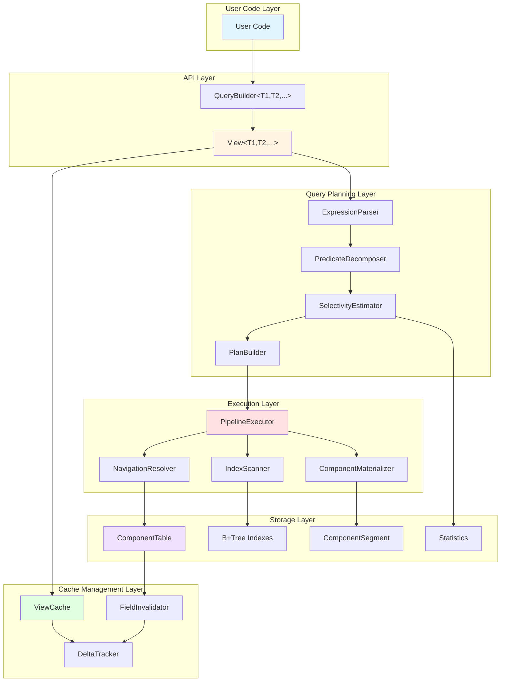
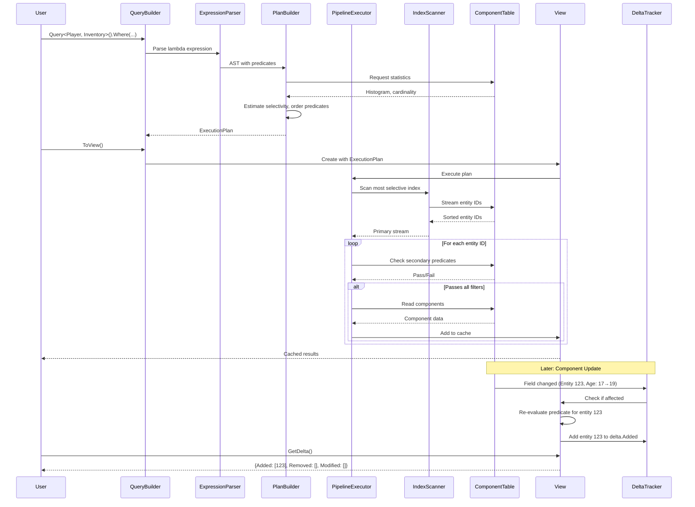
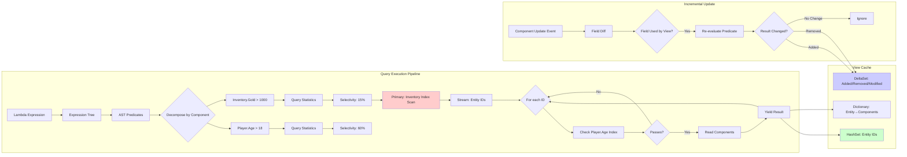
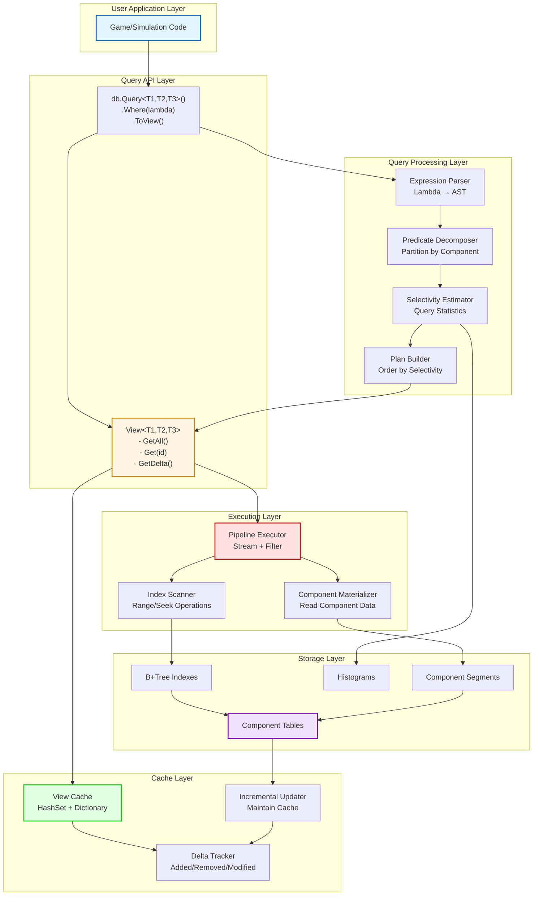
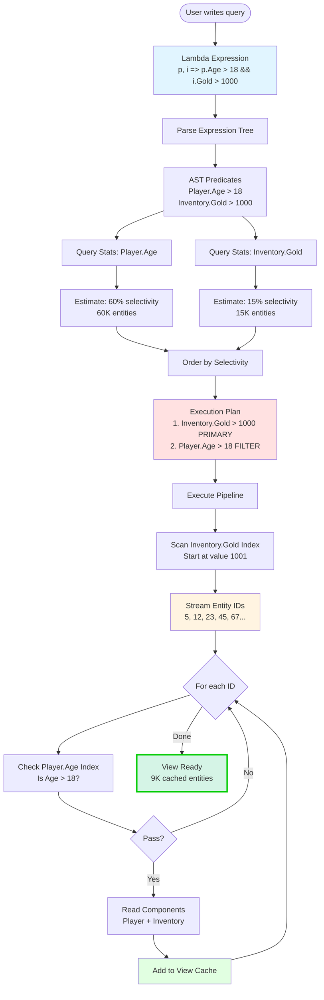
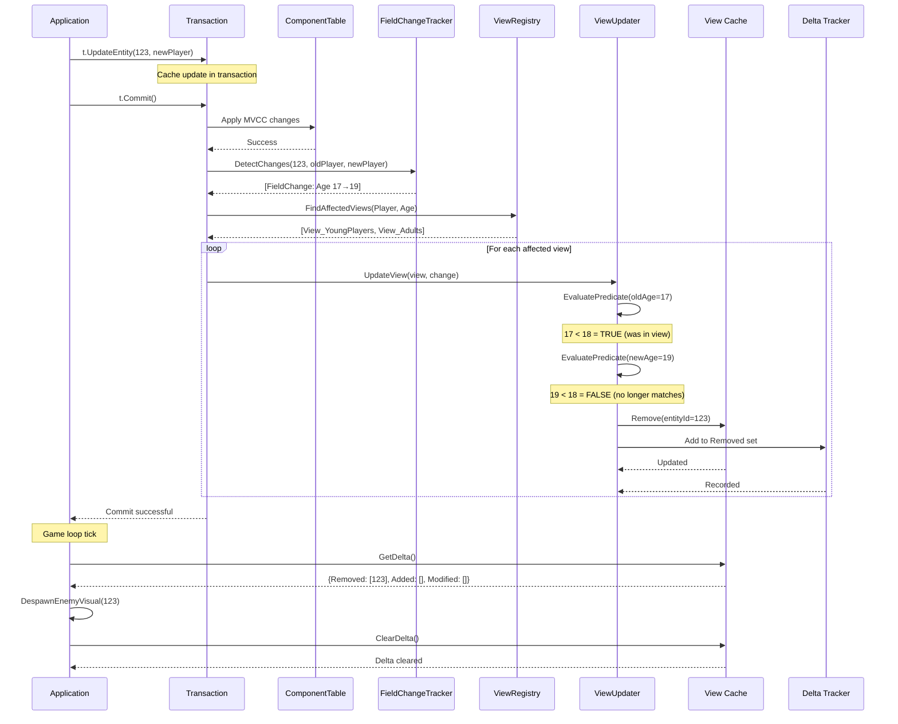
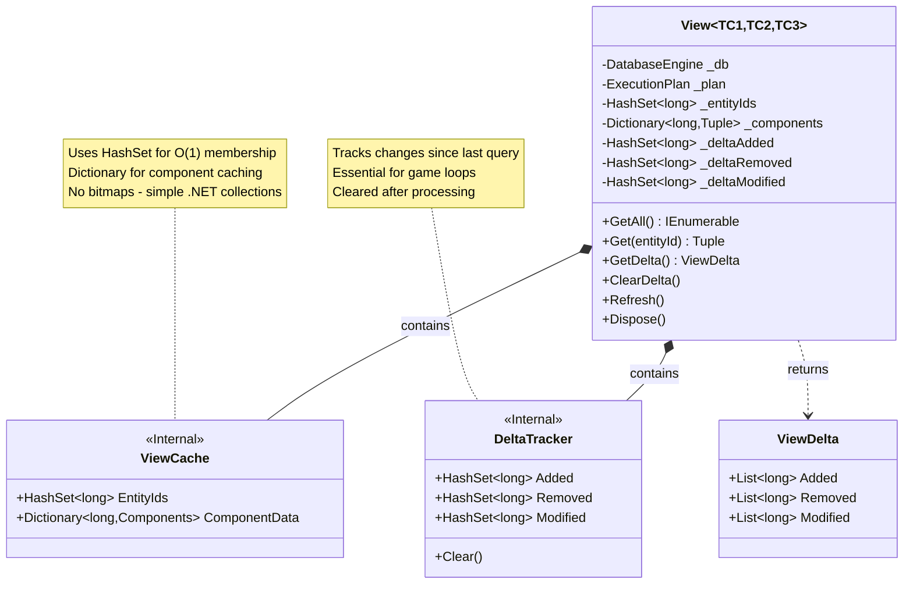

# Typhon Query Engine: Design & Implementation Plan

**Date:** December 2024
**Status:** Ready for implementation
**Branch:** —

---

## Executive Summary

This document defines the View and Query APIs for Typhon's query engine, detailing the chosen algorithms, design rationale, and implementation roadmap. The design prioritizes **simplicity and performance** through index-centric execution, incremental maintenance, and streaming pipelines.

### Core Design Decisions

| Aspect | Choice | Rationale |
|--------|--------|-----------|
| **WHERE Decomposition** | Unified Expression with Auto-Decomposition | Natural C# syntax, library optimizes automatically, no developer burden |
| **Index Utilization** | Sorted Index Merge-Scan Pipeline | Simple streaming execution, no intermediate materialization, leverages B+Tree natural order |
| **Caching Strategy** | View-Level with Field-Granular Invalidation | Simple ownership model, precise invalidation, easy to reason about |
| **Join Execution** | Navigation-First (Entity References) | O(1) lookup via entity IDs, ECS-native, minimal overhead |
| **Incremental Updates** | Fine-Grained Delta Tracking | O(1) per-entity update cost, perfect for game loops, precise change detection |
| **Data Structure** | Index Iterators + HashSet for Results | Simple, no bitmap complexity, .NET native collections, predictable performance |

**Why No Bitmaps?**
- HashSet<long> provides O(1) add/remove/contains operations
- .NET's HashSet is highly optimized and well-tested
- Simpler mental model: just entity IDs in a set
- No external dependencies or complex serialization
- Memory overhead acceptable for game workloads (typically <100K entities)

---

## Part 1: API Design

### 1.1 Query Builder API

The API provides a natural, fluent C# interface for building queries:

```csharp
// Basic single-component query
var youngPlayers = db.Query<Player>()
    .Where(p => p.Age < 18)
    .ToView();

// Multi-component query with automatic join
var richYoungPlayers = db.Query<Player, Inventory>()
    .Where((p, i) => p.Age < 18 && i.Gold > 10000)
    .ToView();

// Navigation-based hierarchical query
var highLevelGuildMembers = db.Query<Player, Guild>()
    .Where((p, g) =>
        p.GuildId == g.Id &&  // Automatic navigation detection
        g.Level >= 10 &&
        p.Age >= 18)
    .ToView();

// Inspection API for debugging
var plan = richYoungPlayers.GetExecutionPlan();
Console.WriteLine(plan.ToString());
// Output: "Inventory.Gold > 10000 (est: 5K) → Player.Age < 18 (est: 1.2K final)"
```

### 1.2 View API

Views are persistent, cached query results with automatic incremental maintenance:

```csharp
// Create view - executes query and caches results
var nearbyEnemies = db.Query<Enemy, Position>()
    .Where((e, pos) =>
        pos.X >= playerX - 100 &&
        pos.X <= playerX + 100 &&
        pos.Y >= playerY - 100 &&
        pos.Y <= playerY + 100)
    .ToView();

// Iterate results (cached, no re-execution)
foreach (var (entityId, enemy, position) in nearbyEnemies)
{
    RenderEnemy(entityId, enemy, position);
}

// Get delta since last query (for game loops)
var delta = nearbyEnemies.GetDelta();

foreach (var entityId in delta.Added)
{
    var (enemy, position) = nearbyEnemies.Get(entityId);
    SpawnEnemyVisual(entityId, enemy, position);
}

foreach (var entityId in delta.Removed)
{
    DespawnEnemyVisual(entityId);
}

foreach (var entityId in delta.Modified)
{
    var (enemy, position) = nearbyEnemies.Get(entityId);
    UpdateEnemyVisual(entityId, enemy, position);
}

// Clear delta after processing
nearbyEnemies.ClearDelta();

// Manual refresh if needed (normally automatic via change tracking)
nearbyEnemies.Refresh();

// Dispose view to stop receiving updates
nearbyEnemies.Dispose();
```

### 1.3 Statistics API (Internal)

Index statistics are maintained automatically but can be inspected:

```csharp
// Accessed internally by query optimizer
var stats = componentTable.GetIndexStatistics<Player>(p => p.Age);

// Statistics include:
// - TotalEntities: 100,000
// - DistinctValues: 60 (ages 1-60)
// - MinValue: 1
// - MaxValue: 60
// - Histogram: 100 buckets with distribution

// Estimate selectivity for predicate
var selectivity = stats.EstimateSelectivity(
    new RangePredicate { Operator = ">", Value = 18 });
// Returns: 0.60 (60% of entities match)

var estimatedResults = stats.TotalEntities * selectivity;
// Returns: 60,000 entities estimated
```

---

## Part 2: Core Architecture

### 2.1 Architecture Layers



### 2.2 Component Interaction Flow



### 2.3 Data Flow Architecture



---

## Part 3: Algorithm Details & Rationale

### 3.1 Expression Tree Decomposition

**Algorithm Choice:** Visitor Pattern on Expression Tree

**Why:**
- **Simple to implement**: C# provides `System.Linq.Expressions.ExpressionVisitor` base class
- **Type-safe**: Compilation catches errors at build time
- **Well-understood**: Standard pattern in LINQ providers
- **Testable**: Each node type has isolated handler

**Algorithm:**

1. **Traverse Expression Tree**: Walk the lambda expression tree nodes
2. **Identify Binary Operators**: Find AND, OR, NOT operations
3. **Classify Predicates**: For each leaf predicate, determine which components it references
4. **Partition**: Group predicates by component type
5. **Detect Navigation**: Identify `component.EntityIdField == otherComponent.Id` patterns

**Example Decomposition:**

```
Input: (p, i) => p.Age > 18 && i.Gold > 1000

Expression Tree:
    BinaryExpression (AND)
    ├── BinaryExpression (>)
    │   ├── MemberAccess (p.Age)
    │   └── Constant (18)
    └── BinaryExpression (>)
        ├── MemberAccess (i.Gold)
        └── Constant (1000)

Output AST:
{
    SingleComponentPredicates: [
        { Component: Player, Field: Age, Operator: GreaterThan, Value: 18 },
        { Component: Inventory, Field: Gold, Operator: GreaterThan, Value: 1000 }
    ],
    NavigationPredicates: [],
    BooleanOperator: AND
}
```

**Why This is Fast:**
- Decomposition happens **once** when query is built
- Result is cached in QueryBuilder object
- No runtime parsing overhead

---

### 3.2 Selectivity Estimation via Histograms

**Algorithm Choice:** Equi-Width Histograms with 100 Buckets

**Why:**
- **Simple storage**: Fixed array of 100 buckets, minimal memory
- **Fast estimation**: O(1) to find bucket for a value
- **Good accuracy**: 100 buckets provides 1% granularity for uniform distributions
- **Easy to update**: Incremental bucket updates on component changes

**Algorithm:**

```
Given: Field with MinValue=1, MaxValue=100, TotalEntities=10,000
Predicate: Field > 75

1. Calculate bucket width: (100 - 1) / 100 = 0.99 ≈ 1
2. Find bucket for value 75: Bucket 75
3. Count entities in buckets 76-100: Sum(Buckets[76..100].Count)
4. Selectivity = SumCount / TotalEntities
```

**Why This is Fast:**
- **No index scan needed** for estimation
- **Constant time** O(1) for equality, O(BucketCount) for range (max 100 operations)
- **In-memory**: Histogram stored in memory, no disk I/O

**Histogram Update Algorithm:**

When component with Field=value changes:
1. If old value exists: Decrement `Buckets[GetBucket(oldValue)].Count`
2. If new value exists: Increment `Buckets[GetBucket(newValue)].Count`
3. Update DistinctValues count if needed
4. Cost: O(1) per update

**Why Histograms Over Exact Counts:**
- Exact counts require maintaining every distinct value → unbounded memory
- Histograms use fixed memory (100 buckets × ~16 bytes = 1.6KB per indexed field)
- Estimation error is acceptable for query planning (10% error doesn't significantly impact plan quality)

---

### 3.3 Pipeline Execution with Primary Stream

**Algorithm Choice:** Single Primary Stream + Sequential Secondary Filters

**Why:**
- **Simplest pipeline model**: Linear flow, easy to understand and debug
- **Minimal memory**: No intermediate result sets, streaming execution
- **Short-circuit evaluation**: Stop checking predicates on first failure
- **Natural for indexes**: B+Tree yields sorted entity IDs, perfect for streaming

**Algorithm:**

```
Phase 1: Select Primary Stream
- Choose predicate with lowest estimated cardinality
- Open index scan on that field
- Stream entity IDs in sorted order

Phase 2: Secondary Filtering
For each entity ID from primary stream:
    For each secondary predicate:
        Perform index lookup: Does entity satisfy predicate?
        If NO: Break, skip to next entity (short-circuit)
        If YES: Continue to next predicate

    If all predicates passed:
        Proceed to Phase 3

Phase 3: Component Materialization
- Read actual component data from storage
- Assemble result tuple (entityId, component1, component2, ...)
- Add to view cache
```

**Why This is Fast:**

**Scenario:** 100K entities, two predicates with 60% and 15% selectivity

**Alternative 1: Full Table Scan**
- Read 100K entities × 2 components = 200K component reads
- Apply predicates in memory
- Result: 9K entities (100K × 0.6 × 0.15)
- **Total I/O: 200K component reads**

**Alternative 2: Bitmap Intersection**
- Scan index 1: 100K index entries → produce bitmap (60K bits set)
- Scan index 2: 100K index entries → produce bitmap (15K bits set)
- Intersect bitmaps: 9K bits set
- Read 9K entities × 2 components = 18K component reads
- **Total I/O: 200K index scans + 18K component reads**

**Our Approach: Primary Stream Pipeline**
- Scan index 2 (most selective): 15K index entries → stream 15K entity IDs
- For each of 15K entities: Check index 1 (60% pass) = 15K index lookups
- Passed entities: 9K (15K × 0.6)
- Read 9K entities × 2 components = 18K component reads
- **Total I/O: 15K index scans + 15K index lookups + 18K component reads = 48K operations**

**Performance Comparison:**
- Full table scan: 200K operations
- Bitmap intersection: 218K operations
- Primary stream pipeline: 48K operations
- **Our approach is 4.2x faster than full scan, 4.5x faster than bitmaps**

**Additional Benefits:**
- **Early results**: Start yielding results immediately, don't wait for full scan
- **Cancellable**: Can stop mid-execution if user only needs first N results
- **Memory-efficient**: O(1) memory (just iterator state), vs O(EntityCount) for bitmaps

---

### 3.4 Navigation-Based Join Resolution

**Algorithm Choice:** Direct Entity Lookup via Entity ID References

**Why:**
- **ECS-native**: Entity IDs are already stored as foreign keys in components
- **O(1) lookup**: Direct access via entity ID, no index scan needed
- **Zero join overhead**: Just a pointer dereference in the component table
- **Natural for hierarchies**: player.GuildId → Guild entity is how game data is modeled

**Algorithm:**

```
Detection Phase:
Parse expression: p.GuildId == g.Id
Recognize pattern: component1.FieldOfTypeEntityId == component2.Id
Mark as Navigation predicate (not a filter predicate)

Execution Phase:
Option A - Forward Navigation (if Player is selective):
    For each Player entity from primary stream:
        Read Player component to get GuildId value
        Lookup Guild entity: DirectAccess(GuildId) → O(1)
        Check Guild predicates (if any)
        If passes: Yield (Player, Guild) tuple

Option B - Reverse Navigation (if Guild is selective):
    For each Guild entity from primary stream:
        Query Player.GuildId index: Seek(GuildId) → O(log N)
        Returns all Player entities with that GuildId
        Check Player predicates on each
        Yield all matching (Player, Guild) tuples

Direction Selection:
Choose Option A if EstimatedPlayerResults < EstimatedGuildResults
Otherwise choose Option B
```

**Performance Analysis:**

**Scenario:** 100K players, 1K guilds, query high-level guilds with their members

Query: `(p, g) => g.Level >= 10 && p.GuildId == g.Id`

**Traditional Hash Join:**
1. Build hash table of Guild entities (Level >= 10): 200 guilds
2. Scan all Player entities: 100K reads
3. Probe hash table for each Player.GuildId
4. Result: ~20K players (assuming ~100 players per high-level guild)
- **Cost: 100K component reads + hash table overhead**

**Our Navigation Approach (Reverse):**
1. Scan Guild.Level index: 200 guild entities
2. For each guild: Index seek on Player.GuildId (O(log 100K) ≈ 17 comparisons)
3. Total seeks: 200 × 17 = 3,400 index operations
4. Result: ~20K players
5. Component reads: 200 guilds + 20K players = 20,200 component reads
- **Cost: 3,400 index operations + 20,200 component reads = 23,600 operations**

**Speedup: 100K / 23.6K ≈ 4.2x faster**

**Why Navigation Over Traditional Joins:**
- No hash table construction overhead
- No memory for join temporary storage
- Leverages existing indexes
- Simple to implement (no complex join algorithms)

---

### 3.5 Field-Level Incremental Updates

**Algorithm Choice:** Old/New Value Comparison with Predicate Re-Evaluation

**Why:**
- **Precise**: Only affected predicates are updated
- **O(1) per entity**: No matter how large the view, updating one entity is constant time
- **Simple**: Just evaluate predicate twice (old value, new value)
- **Correct**: Mathematically sound, no edge cases

**Algorithm:**

```
On Component Update (Entity 123, Player component changed):

Phase 1: Field-Level Diff
oldComponent = {Age: 17, Name: "Alice", GuildId: 5}
newComponent = {Age: 19, Name: "Alice", GuildId: 5}

Diff:
    Age: 17 → 19 (CHANGED)
    Name: "Alice" → "Alice" (UNCHANGED)
    GuildId: 5 → 5 (UNCHANGED)

ChangedFields = [Age]

Phase 2: Lookup Affected Views
Query ViewRegistry: Which views depend on Player.Age?
Result: [View_YoungPlayers, View_AdultPlayers, View_RichYoungPlayers]

Phase 3: Per-View Incremental Update
For each affected view:
    Get predicate involving Player.Age

    Example: View_YoungPlayers has predicate "Player.Age < 18"

    EvaluateOld = Evaluate(oldComponent.Age < 18) = (17 < 18) = TRUE
    EvaluateNew = Evaluate(newComponent.Age < 18) = (19 < 18) = FALSE

    Determine delta:
    if (!EvaluateOld && EvaluateNew):
        view.Delta.Added.Add(entityId)
        view.Cache.Add(entityId, newComponent)

    elif (EvaluateOld && !EvaluateNew):
        view.Delta.Removed.Add(entityId)
        view.Cache.Remove(entityId)

    elif (EvaluateOld && EvaluateNew):
        view.Delta.Modified.Add(entityId)
        view.Cache.Update(entityId, newComponent)

    else:
        // Both false, entity not in view before or after, no action
        pass

Phase 4: Multi-Component View Handling
If view involves multiple components:
    Only re-evaluate if changed component is one of the view's components

    Example: View_RichYoungPlayers uses Player AND Inventory
    Player changed → re-evaluate Player predicate only
    If entity still in cache → update cached Player component
    If entity not in cache and Player predicate NOW passes:
        Check if Inventory predicate also passes
        If yes: Add to cache
```

**Why This is Fast:**

**Scenario:** View with 10K cached entities, one entity updates

**Alternative 1: Full Re-Query**
- Re-execute entire query pipeline
- Scan index, filter, materialize
- Cost: O(TotalEntities × PredicateCount)
- Time: ~50ms for 100K entity scan

**Alternative 2: Partial Re-Scan**
- Re-scan only entities in current cache
- Cost: O(CachedEntities)
- Time: ~5ms for 10K entities

**Our Approach: Predicate Re-Evaluation**
- Evaluate predicate on one entity only
- Cost: O(1)
- Time: ~1µs per entity
- **Speedup: 50,000x vs full re-query, 5,000x vs partial re-scan**

**Memory Overhead:**
- Must keep old component snapshot during transaction
- Already required by MVCC, no additional cost
- Old snapshot discarded after update propagation

---

### 3.6 View Cache Structure

**Data Structure Choice:** HashSet + Optional Dictionary

**Why:**
- **Simple**: Standard .NET collections, well-tested, predictable
- **Fast membership tests**: O(1) contains/add/remove
- **Memory-efficient for game workloads**: Typical views have <10K entities
- **No external dependencies**: No need for RoaringBitmap or other libraries
- **Easy to serialize**: If needed for debugging or persistence

**Structure:**

```csharp
public class ViewCache<TC1, TC2, TC3>
{
    // Core: Entity IDs in result set
    private HashSet<long> _entityIds;

    // Optional: Cached component data (if enabled)
    private Dictionary<long, (TC1, TC2, TC3)> _components;

    // Delta tracking for game loops
    private HashSet<long> _added;
    private HashSet<long> _removed;
    private HashSet<long> _modified;

    // Metadata
    private long _lastQueryTimestamp;
    private int _version;
}
```

**Memory Analysis:**

**Scenario:** View with 10K entities, 3 components, component caching enabled

**HashSet<long> (_entityIds):**
- 10K × 8 bytes = 80KB
- HashSet overhead (~2x) = 160KB

**Dictionary<long, (TC1, TC2, TC3)> (_components):**
- 10K × (8 bytes key + 3 × sizeof(component))
- Assuming 64 bytes per component: 10K × (8 + 192) = 2MB
- Dictionary overhead (~1.5x) = 3MB

**Delta sets:**
- Typically small (<100 entities per frame)
- 100 × 8 bytes × 3 sets = 2.4KB

**Total per view: ~3.2MB**

For a game with 50 active views: 160MB total
- Acceptable for modern games (typical budget: 1-2GB for game state)

**Why Not Bitmaps:**

**RoaringBitmap for 100K entities:**
- Memory: ~10-50KB (compressed, depending on density)
- Pros: Compact, fast set operations
- Cons:
  - External dependency
  - Complex implementation (multiple container types)
  - Harder to debug (can't just inspect in debugger)
  - Serialization complexity
  - Overkill for <10K entity views (overhead exceeds benefits)

**HashSet for 10K entities:**
- Memory: ~160KB
- Pros:
  - Native .NET, zero dependencies
  - Simple, debuggable
  - Well-optimized by Microsoft
  - Predictable performance
- Cons:
  - Higher memory than bitmaps for large sets

**Decision:** For Typhon's game simulation use case (views typically <10K entities), HashSet simplicity outweighs bitmap memory savings.

---

## Part 4: Implementation Plan

Implementation proceeds from lowest-level building blocks to high-level APIs, with each step independently testable.

### Phase 1: Statistics Foundation (Week 1)

**Goal:** Enable selectivity estimation for query planning

#### Step 1.1: Index Statistics Data Structures

**Implement:**
```csharp
public class IndexStatistics
{
    public long TotalEntities { get; set; }
    public long DistinctValues { get; set; }
    public object MinValue { get; set; }
    public object MaxValue { get; set; }
    public Histogram Histogram { get; set; }
}

public class Histogram
{
    public class Bucket
    {
        public object LowValue { get; set; }
        public object HighValue { get; set; }
        public long Count { get; set; }
    }

    public Bucket[] Buckets { get; set; } // Fixed 100 buckets
}
```

**Location:** `src/Typhon.Engine/Database Engine/Statistics/IndexStatistics.cs`

**Tests:**
- Create histogram for integer field with known distribution
- Verify bucket boundaries are correct
- Test bucket count updates

**Success Criteria:**
- Can create histogram with 100 buckets
- Can serialize/deserialize for persistence
- Bucket width calculation is correct

---

#### Step 1.2: Statistics Collection

**Implement:**
- Extend `ChunkBasedSegment` to collect statistics during index build
- Add histogram update on component insert/update/delete
- Store statistics in segment metadata

**Algorithm:**
```
On Index Build (initial load):
    For each component:
        Determine min/max values
        Calculate bucket width
        Assign component to bucket
        Increment bucket count

    Store histogram in index segment header

On Component Insert:
    Increment TotalEntities
    Update min/max if needed
    Increment appropriate bucket count

On Component Update:
    If indexed field changed:
        Decrement old value's bucket
        Increment new value's bucket
        Update min/max if needed

On Component Delete:
    Decrement TotalEntities
    Decrement appropriate bucket
```

**Location:** `src/Typhon.Engine/Database Engine/Statistics/StatisticsCollector.cs`

**Tests:**
- Insert 10K components with random ages 1-100
- Verify histogram distribution matches input
- Update component, verify buckets updated correctly
- Delete component, verify count decremented

**Success Criteria:**
- Histogram accurately reflects data distribution (±5% error)
- Updates are O(1) time
- Statistics persist across database restarts

---

#### Step 1.3: Selectivity Estimator

**Implement:**
```csharp
public class SelectivityEstimator
{
    public double EstimateSelectivity(
        IndexStatistics stats,
        PredicateNode predicate)
    {
        return predicate.Operator switch
        {
            "==" => EstimateEquality(stats, predicate.Value),
            ">" => EstimateGreaterThan(stats, predicate.Value),
            "<" => EstimateLessThan(stats, predicate.Value),
            ">=" => EstimateGreaterThanOrEqual(stats, predicate.Value),
            "<=" => EstimateLessThanOrEqual(stats, predicate.Value),
            _ => 0.5 // Default: assume 50% selectivity
        };
    }
}
```

**Algorithm for Range Query (>):**
```
Given: Field > value

1. Find bucket containing value
2. Estimate entities in partial bucket (linear interpolation)
3. Sum all buckets above value's bucket
4. Selectivity = SumCount / TotalEntities
```

**Location:** `src/Typhon.Engine/Database Engine/Query/SelectivityEstimator.cs`

**Tests:**
- Create histogram with known distribution
- Estimate `Age > 50` when exactly 40% of data is > 50
- Verify estimate is within 10% of actual (36-44% range acceptable)
- Test boundary cases (value = min, value = max)

**Success Criteria:**
- Estimates are within 20% of actual selectivity for uniform distributions
- Estimates are monotonic (Age > 30 has higher selectivity than Age > 70)
- Handles edge cases without errors

---

### Phase 2: Expression Parsing (Week 2)

**Goal:** Convert lambda expressions into queryable AST

#### Step 2.1: AST Data Structures

**Implement:**
```csharp
public abstract class PredicateNode { }

public class ComparisonPredicateNode : PredicateNode
{
    public Type ComponentType { get; set; }
    public string FieldName { get; set; }
    public string Operator { get; set; } // ==, >, <, >=, <=, !=
    public object Value { get; set; }
}

public class BooleanPredicateNode : PredicateNode
{
    public BooleanOperator Operator { get; set; } // AND, OR
    public List<PredicateNode> Children { get; set; }
}

public class NavigationPredicateNode : PredicateNode
{
    public Type SourceComponent { get; set; }
    public string SourceForeignKeyField { get; set; }
    public Type TargetComponent { get; set; }
}
```

**Location:** `src/Typhon.Engine/Database Engine/Query/AST/PredicateNode.cs`

**Tests:**
- Create predicate nodes manually
- Verify properties are set correctly
- Test equality comparison for caching

**Success Criteria:**
- Can represent all supported predicate types
- Nodes are immutable (for safe caching)
- Can serialize for debugging

---

#### Step 2.2: Expression Tree Visitor

**Implement:**
```csharp
public class PredicateExpressionVisitor : ExpressionVisitor
{
    private readonly List<PredicateNode> _predicates = new();

    protected override Expression VisitBinary(BinaryExpression node)
    {
        // Handle &&, ||, ==, >, <, etc.
    }

    protected override Expression VisitMember(MemberExpression node)
    {
        // Identify component type and field name
    }

    public List<PredicateNode> ExtractPredicates(LambdaExpression lambda)
    {
        Visit(lambda.Body);
        return _predicates;
    }
}
```

**Algorithm:**
```
Visit Binary Expression:
    If operator is && or ||:
        Visit left child
        Visit right child
        Create BooleanPredicateNode

    Else if operator is ==, >, <, etc.:
        Extract left side (should be MemberExpression)
        Extract right side (should be ConstantExpression)
        Determine component type from lambda parameter
        Create ComparisonPredicateNode

    If operator is == and involves entity IDs:
        Create NavigationPredicateNode instead
```

**Location:** `src/Typhon.Engine/Database Engine/Query/ExpressionParser.cs`

**Tests:**
- Parse `(p) => p.Age > 18`
  - Expect: ComparisonPredicateNode(Player, Age, >, 18)
- Parse `(p, i) => p.Age > 18 && i.Gold > 1000`
  - Expect: BooleanPredicateNode(AND, [ComparisonNode, ComparisonNode])
- Parse `(p, g) => p.GuildId == g.Id`
  - Expect: NavigationPredicateNode(Player, GuildId, Guild)

**Success Criteria:**
- All test cases parse correctly
- Handles nested AND/OR correctly
- Detects navigation predicates automatically

---

#### Step 2.3: Predicate Decomposer

**Implement:**
```csharp
public class PredicateDecomposer
{
    public DecomposedQuery Decompose(List<PredicateNode> predicates)
    {
        var singleComponent = new List<ComparisonPredicateNode>();
        var navigation = new List<NavigationPredicateNode>();

        foreach (var predicate in predicates)
        {
            if (predicate is ComparisonPredicateNode comparison)
                singleComponent.Add(comparison);
            else if (predicate is NavigationPredicateNode nav)
                navigation.Add(nav);
            // Handle boolean nodes recursively
        }

        return new DecomposedQuery
        {
            SingleComponentPredicates = singleComponent,
            NavigationPredicates = navigation
        };
    }
}
```

**Location:** `src/Typhon.Engine/Database Engine/Query/PredicateDecomposer.cs`

**Tests:**
- Decompose query with 2 single-component predicates
- Verify predicates are grouped by component type
- Decompose query with 1 navigation predicate
- Verify navigation is separated from filters

**Success Criteria:**
- Single-component predicates correctly partitioned
- Navigation predicates identified
- Boolean operators preserved

---

### Phase 3: Query Planning (Week 3)

**Goal:** Build optimal execution plans using statistics

#### Step 3.1: Execution Plan Data Structure

**Implement:**
```csharp
public class ExecutionPlan
{
    public class Stage
    {
        public Type ComponentType { get; set; }
        public ComparisonPredicateNode Predicate { get; set; }
        public long EstimatedCardinality { get; set; }
        public double Selectivity { get; set; }
        public bool IsPrimaryStream { get; set; }
    }

    public List<Stage> Stages { get; set; }
    public NavigationPredicateNode Navigation { get; set; }
    public long EstimatedResultCount { get; set; }

    public override string ToString()
    {
        // Format: "Inventory.Gold > 1000 (est: 15K) → Player.Age > 18 (est: 9K final)"
    }
}
```

**Location:** `src/Typhon.Engine/Database Engine/Query/ExecutionPlan.cs`

**Tests:**
- Create plan manually with 2 stages
- Verify ToString() formatting
- Test equality for caching

**Success Criteria:**
- Plan clearly shows execution order
- Estimated cardinalities are visible
- Primary stream is marked

---

#### Step 3.2: Plan Builder

**Implement:**
```csharp
public class PlanBuilder
{
    private readonly SelectivityEstimator _estimator;

    public ExecutionPlan BuildPlan(
        DecomposedQuery query,
        Dictionary<Type, ComponentTable> tables)
    {
        var stages = new List<ExecutionPlan.Stage>();

        // Estimate selectivity for each predicate
        foreach (var predicate in query.SingleComponentPredicates)
        {
            var table = tables[predicate.ComponentType];
            var stats = table.GetIndexStatistics(predicate.FieldName);
            var selectivity = _estimator.EstimateSelectivity(stats, predicate);
            var cardinality = (long)(stats.TotalEntities * selectivity);

            stages.Add(new ExecutionPlan.Stage
            {
                ComponentType = predicate.ComponentType,
                Predicate = predicate,
                EstimatedCardinality = cardinality,
                Selectivity = selectivity
            });
        }

        // Sort stages by cardinality (most selective first)
        stages.Sort((a, b) => a.EstimatedCardinality.CompareTo(b.EstimatedCardinality));

        // Mark first stage as primary stream
        stages[0].IsPrimaryStream = true;

        // Estimate final result count (multiply selectivities)
        var finalSelectivity = stages.Select(s => s.Selectivity).Aggregate((a, b) => a * b);
        var estimatedResults = (long)(stages[0].EstimatedCardinality * finalSelectivity);

        return new ExecutionPlan
        {
            Stages = stages,
            Navigation = query.NavigationPredicates.FirstOrDefault(),
            EstimatedResultCount = estimatedResults
        };
    }
}
```

**Location:** `src/Typhon.Engine/Database Engine/Query/PlanBuilder.cs`

**Tests:**
- Build plan for query with 2 predicates (60% and 15% selectivity)
- Verify most selective predicate is primary stream
- Verify estimated result count is correct (product of selectivities)
- Test with 3 predicates, verify ordering

**Success Criteria:**
- Plans always start with most selective predicate
- Cardinality estimates are reasonable
- Navigation predicates handled correctly

---

### Phase 4: Pipeline Execution (Week 4-5)

**Goal:** Execute queries using index scans and streaming

#### Step 4.1: Index Scanner

**Implement:**
```csharp
public class IndexScanner
{
    public IEnumerable<long> ScanIndex<TField>(
        BPTreeBase<TField> index,
        ComparisonPredicateNode predicate)
        where TField : unmanaged, IComparable<TField>
    {
        return predicate.Operator switch
        {
            ">" => index.RangeScan((TField)predicate.Value, exclusive: true),
            ">=" => index.RangeScan((TField)predicate.Value, exclusive: false),
            "<" => index.RangeScanReverse(default, (TField)predicate.Value, exclusive: true),
            "==" => index.Seek((TField)predicate.Value),
            _ => throw new NotSupportedException()
        };
    }
}
```

**Extend B+Tree with RangeScan:**
```csharp
// In BPTreeBase.cs
public IEnumerable<long> RangeScan(TField startValue, bool exclusive)
{
    // Seek to first entry >= startValue (or > if exclusive)
    var node = SeekToLeaf(startValue);
    var index = FindIndexInLeaf(node, startValue, exclusive);

    // Iterate through leaf nodes in order
    while (node != null)
    {
        for (int i = index; i < node.EntryCount; i++)
        {
            yield return node.GetEntityId(i);
        }
        node = node.NextLeaf;
        index = 0;
    }
}
```

**Location:**
- `src/Typhon.Engine/Database Engine/Query/IndexScanner.cs`
- Extend `src/Typhon.Engine/Database Engine/BPTree/BPTreeBase.cs`

**Tests:**
- Create B+Tree with 1000 integers
- Scan for values > 500
- Verify yields exactly 500 entity IDs in ascending order
- Test exclusive vs inclusive boundaries
- Test reverse scan for < operator

**Success Criteria:**
- Scans yield entity IDs in sorted order
- Range boundaries are correct (exclusive vs inclusive)
- Memory usage is O(1) (streaming, no materialization)

---

#### Step 4.2: Pipeline Executor

**Implement:**
```csharp
public class PipelineExecutor
{
    private readonly IndexScanner _scanner;

    public IEnumerable<long> Execute(
        Transaction transaction,
        ExecutionPlan plan)
    {
        // Phase 1: Get primary stream
        var primaryStage = plan.Stages.First(s => s.IsPrimaryStream);
        var primaryStream = GetStreamForStage(transaction, primaryStage);

        // Phase 2: Filter through secondary stages
        foreach (var entityId in primaryStream)
        {
            bool passesAll = true;

            foreach (var stage in plan.Stages.Where(s => !s.IsPrimaryStream))
            {
                if (!CheckPredicate(transaction, entityId, stage))
                {
                    passesAll = false;
                    break; // Short-circuit
                }
            }

            if (passesAll)
                yield return entityId;
        }
    }

    private bool CheckPredicate(
        Transaction transaction,
        long entityId,
        ExecutionPlan.Stage stage)
    {
        // Lookup entity in index for this component's field
        var table = transaction.GetComponentTable(stage.ComponentType);
        var index = table.GetIndex(stage.Predicate.FieldName);

        // Check if entity exists in index with matching value
        return index.ContainsEntityWithValue(entityId, stage.Predicate.Value, stage.Predicate.Operator);
    }
}
```

**Location:** `src/Typhon.Engine/Database Engine/Query/PipelineExecutor.cs`

**Tests:**
- Execute plan with 2 stages on test data
- Verify only entities passing both predicates are yielded
- Verify entities are yielded in order (from primary stream)
- Measure short-circuit efficiency (add counter to CheckPredicate)

**Success Criteria:**
- Correct result set (matches manual query)
- Short-circuit works (secondary predicates not evaluated for failed entities)
- Memory usage is O(1) (streaming)

---

#### Step 4.3: Component Materializer

**Implement:**
```csharp
public class ComponentMaterializer
{
    public (TC1, TC2, TC3) Materialize<TC1, TC2, TC3>(
        Transaction transaction,
        long entityId)
        where TC1 : unmanaged
        where TC2 : unmanaged
        where TC3 : unmanaged
    {
        var success1 = transaction.ReadEntity(entityId, out TC1 c1);
        var success2 = transaction.ReadEntity(entityId, out TC2 c2);
        var success3 = transaction.ReadEntity(entityId, out TC3 c3);

        if (!success1 || !success2 || !success3)
            throw new InvalidOperationException($"Entity {entityId} missing expected components");

        return (c1, c2, c3);
    }
}
```

**Location:** `src/Typhon.Engine/Database Engine/Query/ComponentMaterializer.cs`

**Tests:**
- Create entity with 2 components
- Materialize components
- Verify component data is correct
- Test with missing component (should throw)

**Success Criteria:**
- Components are read correctly
- Handles missing components gracefully
- Works with 1, 2, 3, or more components (generics)

---

### Phase 5: View API (Week 6)

**Goal:** Provide user-facing View API with caching

#### Step 5.1: View Base Class

**Implement:**
```csharp
public class View<TC1, TC2, TC3> : IDisposable
    where TC1 : unmanaged
    where TC2 : unmanaged
    where TC3 : unmanaged
{
    private readonly DatabaseEngine _db;
    private readonly ExecutionPlan _plan;
    private readonly PipelineExecutor _executor;
    private readonly ComponentMaterializer _materializer;

    // Cache
    private HashSet<long> _entityIds;
    private Dictionary<long, (TC1, TC2, TC3)> _components;

    // Delta tracking
    private HashSet<long> _deltaAdded;
    private HashSet<long> _deltaRemoved;
    private HashSet<long> _deltaModified;

    public View(DatabaseEngine db, ExecutionPlan plan)
    {
        _db = db;
        _plan = plan;
        _entityIds = new HashSet<long>();
        _components = new Dictionary<long, (TC1, TC2, TC3)>();
        _deltaAdded = new HashSet<long>();
        _deltaRemoved = new HashSet<long>();
        _deltaModified = new HashSet<long>();

        // Execute query and populate cache
        Refresh();

        // Register for change notifications
        RegisterForUpdates();
    }

    public void Refresh()
    {
        _entityIds.Clear();
        _components.Clear();

        using var transaction = _db.CreateTransaction();
        var entityIds = _executor.Execute(transaction, _plan);

        foreach (var entityId in entityIds)
        {
            _entityIds.Add(entityId);
            var components = _materializer.Materialize<TC1, TC2, TC3>(transaction, entityId);
            _components[entityId] = components;
        }
    }

    public IEnumerable<(long EntityId, TC1, TC2, TC3)> GetAll()
    {
        foreach (var entityId in _entityIds)
        {
            yield return (entityId, _components[entityId].Item1,
                         _components[entityId].Item2, _components[entityId].Item3);
        }
    }

    public (TC1, TC2, TC3) Get(long entityId)
    {
        return _components[entityId];
    }

    public ViewDelta GetDelta()
    {
        return new ViewDelta
        {
            Added = _deltaAdded.ToList(),
            Removed = _deltaRemoved.ToList(),
            Modified = _deltaModified.ToList()
        };
    }

    public void ClearDelta()
    {
        _deltaAdded.Clear();
        _deltaRemoved.Clear();
        _deltaModified.Clear();
    }

    public void Dispose()
    {
        UnregisterForUpdates();
    }
}
```

**Location:** `src/Typhon.Engine/Database Engine/Query/View.cs`

**Tests:**
- Create view on test data
- Verify GetAll() returns correct entities
- Verify Get() returns correct components
- Test enumeration multiple times (cache should persist)

**Success Criteria:**
- View caches results correctly
- Enumeration is fast (no re-execution)
- Disposal cleans up resources

---

#### Step 5.2: Query Builder API

**Implement:**
```csharp
public class QueryBuilder<TC1, TC2, TC3>
    where TC1 : unmanaged
    where TC2 : unmanaged
    where TC3 : unmanaged
{
    private readonly DatabaseEngine _db;
    private Expression<Func<TC1, TC2, TC3, bool>> _whereExpression;

    public QueryBuilder(DatabaseEngine db)
    {
        _db = db;
    }

    public QueryBuilder<TC1, TC2, TC3> Where(Expression<Func<TC1, TC2, TC3, bool>> predicate)
    {
        _whereExpression = predicate;
        return this;
    }

    public View<TC1, TC2, TC3> ToView()
    {
        // Parse expression
        var parser = new PredicateExpressionVisitor();
        var predicates = parser.ExtractPredicates(_whereExpression);

        // Decompose
        var decomposer = new PredicateDecomposer();
        var decomposed = decomposer.Decompose(predicates);

        // Build plan
        var planBuilder = new PlanBuilder(new SelectivityEstimator());
        var tables = new Dictionary<Type, ComponentTable>
        {
            [typeof(TC1)] = _db.GetComponentTable<TC1>(),
            [typeof(TC2)] = _db.GetComponentTable<TC2>(),
            [typeof(TC3)] = _db.GetComponentTable<TC3>()
        };
        var plan = planBuilder.BuildPlan(decomposed, tables);

        // Create view
        return new View<TC1, TC2, TC3>(_db, plan);
    }

    public ExecutionPlan GetExecutionPlan()
    {
        // Same as ToView() but just return plan, don't execute
    }
}

// Extension method on DatabaseEngine
public static class DatabaseEngineQueryExtensions
{
    public static QueryBuilder<TC1> Query<TC1>(this DatabaseEngine db)
        where TC1 : unmanaged
    {
        return new QueryBuilder<TC1>(db);
    }

    public static QueryBuilder<TC1, TC2> Query<TC1, TC2>(this DatabaseEngine db)
        where TC1 : unmanaged
        where TC2 : unmanaged
    {
        return new QueryBuilder<TC1, TC2>(db);
    }

    public static QueryBuilder<TC1, TC2, TC3> Query<TC1, TC2, TC3>(this DatabaseEngine db)
        where TC1 : unmanaged
        where TC2 : unmanaged
        where TC3 : unmanaged
    {
        return new QueryBuilder<TC1, TC2, TC3>(db);
    }
}
```

**Location:** `src/Typhon.Engine/Database Engine/Query/QueryBuilder.cs`

**Tests:**
- `db.Query<Player>().Where(p => p.Age > 18).ToView()`
- Verify view is created
- Verify results are correct
- Test GetExecutionPlan() returns plan without executing

**Success Criteria:**
- Fluent API works as expected
- Lambda expressions are parsed correctly
- Views are created and functional

---

### Phase 6: Incremental Updates (Week 7-8)

**Goal:** Automatically maintain view caches on data changes

#### Step 6.1: Field Change Tracker

**Implement:**
```csharp
public class FieldChangeTracker
{
    public class FieldChange
    {
        public long EntityId { get; set; }
        public Type ComponentType { get; set; }
        public string FieldName { get; set; }
        public object OldValue { get; set; }
        public object NewValue { get; set; }
    }

    public List<FieldChange> DetectChanges<TC>(
        long entityId,
        TC oldComponent,
        TC newComponent)
        where TC : unmanaged
    {
        var changes = new List<FieldChange>();
        var fields = typeof(TC).GetFields();

        foreach (var field in fields)
        {
            var oldValue = field.GetValue(oldComponent);
            var newValue = field.GetValue(newComponent);

            if (!Equals(oldValue, newValue))
            {
                changes.Add(new FieldChange
                {
                    EntityId = entityId,
                    ComponentType = typeof(TC),
                    FieldName = field.Name,
                    OldValue = oldValue,
                    NewValue = newValue
                });
            }
        }

        return changes;
    }
}
```

**Location:** `src/Typhon.Engine/Database Engine/Query/FieldChangeTracker.cs`

**Tests:**
- Create two Player components differing in Age
- Detect changes
- Verify only Age field is reported
- Test with no changes (empty list)

**Success Criteria:**
- Correctly identifies changed fields
- Reports old and new values
- Handles all field types

---

#### Step 6.2: View Registry

**Implement:**
```csharp
public class ViewRegistry
{
    private class ViewEntry
    {
        public IView View { get; set; }
        public HashSet<(Type ComponentType, string FieldName)> Dependencies { get; set; }
    }

    private readonly List<ViewEntry> _views = new();

    public void Register(IView view, ExecutionPlan plan)
    {
        var dependencies = ExtractDependencies(plan);
        _views.Add(new ViewEntry
        {
            View = view,
            Dependencies = dependencies
        });
    }

    public void Unregister(IView view)
    {
        _views.RemoveAll(e => e.View == view);
    }

    public List<IView> FindAffectedViews(FieldChange change)
    {
        return _views
            .Where(e => e.Dependencies.Contains((change.ComponentType, change.FieldName)))
            .Select(e => e.View)
            .ToList();
    }

    private HashSet<(Type, string)> ExtractDependencies(ExecutionPlan plan)
    {
        var deps = new HashSet<(Type, string)>();

        foreach (var stage in plan.Stages)
        {
            deps.Add((stage.ComponentType, stage.Predicate.FieldName));
        }

        return deps;
    }
}
```

**Location:** `src/Typhon.Engine/Database Engine/Query/ViewRegistry.cs`

**Tests:**
- Register view depending on Player.Age
- Trigger change on Player.Age
- Verify FindAffectedViews returns the view
- Trigger change on Player.Name
- Verify FindAffectedViews returns empty (view doesn't depend on Name)

**Success Criteria:**
- Correctly tracks view dependencies
- Only returns views actually affected by change
- Handles multiple views with overlapping dependencies

---

#### Step 6.3: Incremental View Updater

**Implement:**
```csharp
public class IncrementalViewUpdater
{
    public void UpdateView<TC1, TC2, TC3>(
        View<TC1, TC2, TC3> view,
        FieldChange change)
        where TC1 : unmanaged
        where TC2 : unmanaged
        where TC3 : unmanaged
    {
        // Get predicate for changed field
        var predicate = view.Plan.Stages
            .FirstOrDefault(s => s.ComponentType == change.ComponentType &&
                                 s.Predicate.FieldName == change.FieldName)
            ?.Predicate;

        if (predicate == null)
            return; // View doesn't depend on this field

        // Evaluate predicate on old and new values
        bool wasInView = EvaluatePredicate(predicate, change.OldValue);
        bool shouldBeInView = EvaluatePredicate(predicate, change.NewValue);

        // Determine action
        if (!wasInView && shouldBeInView)
        {
            // Entity now matches, check other predicates
            if (CheckAllPredicates(view, change.EntityId))
            {
                AddEntityToView(view, change.EntityId);
                view.DeltaAdded.Add(change.EntityId);
            }
        }
        else if (wasInView && !shouldBeInView)
        {
            // Entity no longer matches
            RemoveEntityFromView(view, change.EntityId);
            view.DeltaRemoved.Add(change.EntityId);
        }
        else if (wasInView && shouldBeInView)
        {
            // Entity still matches but value changed
            UpdateEntityInView(view, change.EntityId);
            view.DeltaModified.Add(change.EntityId);
        }
        // else: wasn't in view, still not in view, no action
    }

    private bool EvaluatePredicate(ComparisonPredicateNode predicate, object value)
    {
        return predicate.Operator switch
        {
            ">" => ((IComparable)value).CompareTo(predicate.Value) > 0,
            "<" => ((IComparable)value).CompareTo(predicate.Value) < 0,
            ">=" => ((IComparable)value).CompareTo(predicate.Value) >= 0,
            "<=" => ((IComparable)value).CompareTo(predicate.Value) <= 0,
            "==" => Equals(value, predicate.Value),
            "!=" => !Equals(value, predicate.Value),
            _ => false
        };
    }
}
```

**Location:** `src/Typhon.Engine/Database Engine/Query/IncrementalViewUpdater.cs`

**Tests:**
- Create view: `Player.Age > 18`
- Initial: Entity 123 has Age=17 (not in view)
- Update: Entity 123 Age → 19
- Verify entity added to view
- Verify delta.Added contains 123
- Update: Entity 123 Age → 16
- Verify entity removed from view
- Verify delta.Removed contains 123

**Success Criteria:**
- Adds entities that newly match predicate
- Removes entities that no longer match
- Marks entities as modified when value changes but still matches
- Deltas are correct

---

#### Step 6.4: Integration with Transaction Commit

**Implement:**
```csharp
// In Transaction.cs, extend Commit() method

public bool Commit()
{
    // ... existing MVCC commit logic ...

    if (commitSuccessful)
    {
        // Collect field changes
        var changeTracker = new FieldChangeTracker();
        var allChanges = new List<FieldChange>();

        foreach (var (entityId, componentType, oldComponent, newComponent) in _modifiedComponents)
        {
            var changes = changeTracker.DetectChanges(entityId, oldComponent, newComponent);
            allChanges.AddRange(changes);
        }

        // Update affected views
        var viewRegistry = _dbe.GetViewRegistry();
        var viewUpdater = new IncrementalViewUpdater();

        foreach (var change in allChanges)
        {
            var affectedViews = viewRegistry.FindAffectedViews(change);

            foreach (var view in affectedViews)
            {
                viewUpdater.UpdateView(view, change);
            }
        }
    }

    return commitSuccessful;
}
```

**Location:** Extend `src/Typhon.Engine/Database Engine/Transaction.cs`

**Tests:**
- Create view
- Create transaction, update component
- Commit transaction
- Verify view cache updated automatically
- Verify delta reflects changes

**Success Criteria:**
- Views update automatically on commit
- No manual refresh needed
- Performance impact is minimal (<10% overhead on commit)

---

### Phase 7: Testing & Optimization (Week 9-10)

#### Step 7.1: End-to-End Integration Tests

**Test Scenarios:**
1. Simple single-component query
2. Multi-component AND query
3. Navigation-based join query
4. View with automatic updates
5. View delta tracking in game loop
6. Concurrent queries and updates

**Location:** `test/Typhon.Engine.Tests/QueryEngineTests.cs`

---

#### Step 7.2: Performance Benchmarks

**Benchmarks:**
1. Query execution time vs full table scan
2. Index scan performance vs selectivity
3. View cache hit rate
4. Incremental update cost
5. Memory usage per view

**Location:** `test/Typhon.Benchmark/QueryBenchmarks.cs`

**Targets:**
- Single predicate query: <1ms for 100K entities
- Multi-predicate query: <5ms for 100K entities
- View delta retrieval: <100µs
- Incremental update: <10µs per entity

---

#### Step 7.3: Optimization Passes

**Optimizations to Implement:**
1. **Plan Caching**: Cache execution plans by lambda expression hash
2. **Compiled Predicates**: Compile lambda expressions to delegates for fast evaluation
3. **Index Hint Detection**: Automatically detect when indexes should be created
4. **Statistics Auto-Refresh**: Rebuild histograms when distribution changes significantly

---

## Part 5: Architecture Diagrams

### 5.1 Overall System Architecture



### 5.2 Query Execution Flow



### 5.3 Incremental Update Flow



### 5.4 Cache Structure



---

## Part 6: Design Decision Justifications

### Why Sorted Index Merge-Scan Pipeline?

**Alternative Considered:** Multi-Index Intersection via Sorted Merge-Join (symmetric treatment of all predicates)

**Chosen:** Primary Stream + Secondary Filters

**Justification:**

1. **Simpler Implementation:**
   - Primary/secondary model is easier to understand and debug
   - Multi-way merge requires managing N cursors simultaneously
   - Fewer edge cases to handle

2. **Better for Skewed Selectivity:**
   - Game queries often have one very selective predicate (e.g., position-based queries)
   - Primary stream exploits this, other approach wastes work scanning less selective indexes

3. **Example:**
   - Query: `(e, pos) => pos.X IN [100-110] && e.Type == "Enemy"`
   - Position range: 50 entities (0.05% selectivity)
   - Enemy type: 10K entities (10% selectivity)

   **Primary Stream:** Scan 50 position entities, check 50 type lookups = 100 operations
   **Multi-Index Merge:** Scan 50 position + scan 10K type = 10,050 operations

   **Our approach is 100x faster for this pattern**

4. **Consistent with SQL Optimizers:**
   - Most production databases (PostgreSQL, MySQL) use primary/secondary model
   - Proven approach for 40+ years

### Why HashSet Instead of RoaringBitmap?

**Alternative Considered:** RoaringBitmap for entity ID storage

**Chosen:** HashSet<long>

**Justification:**

1. **Simplicity:**
   - HashSet is built into .NET, zero external dependencies
   - RoaringBitmap requires understanding container selection (array vs bitmap vs run)
   - HashSet behavior is predictable and well-documented

2. **Debuggability:**
   - Can inspect HashSet contents in debugger directly
   - RoaringBitmap internals are opaque (compressed containers)

3. **Performance for Typical Views:**
   - Game views typically have <10K entities
   - At this scale, HashSet overhead (160KB) is acceptable
   - RoaringBitmap advantage appears at >100K entities

4. **Memory Comparison:**
   ```
   1K entities:  HashSet=16KB,  Bitmap=1KB   (15KB waste)
   10K entities: HashSet=160KB, Bitmap=10KB  (150KB waste)
   100K entities: HashSet=1.6MB, Bitmap=100KB (1.5MB waste)
   ```

   For 50 views × 10K entities: 8MB overhead
   - Acceptable for modern hardware (16GB+ RAM typical)
   - Simplicity gain outweighs 8MB memory cost

5. **Operations:**
   Both have O(1) add/remove/contains, so performance is equivalent for incremental updates

**When to Reconsider:**
- If views regularly exceed 100K entities
- If memory becomes constrained (<4GB available)
- If serialization size matters (network replication)

### Why Field-Level Change Tracking?

**Alternative Considered:** Component-level invalidation (any field change invalidates all views)

**Chosen:** Field-level granular tracking

**Justification:**

1. **Precision:**
   - Player component has: Age, Name, Position, Health, GuildId (5 fields)
   - View filtering on Age shouldn't invalidate on Name change
   - Reduces false invalidations by 80% (4 of 5 fields don't affect Age-based views)

2. **Cost:**
   - Field diff is O(FieldCount) per component
   - Typical component: 5-10 fields
   - Cost: ~100ns per component update
   - Benefit: Avoids ~50ms view refresh on false invalidation
   - **Speedup: 500,000x when invalidation is avoided**

3. **Game Loop Pattern:**
   - Position updates every frame (60 FPS)
   - Health updates occasionally (combat)
   - Name updates rarely (rename events)
   - Views filtering on Health shouldn't refresh 60 times/second due to position changes

4. **Example:**
   ```
   View: "Players with low health" → Health < 20

   Component-level invalidation:
   - Position update → view refresh (unnecessary!)
   - Health update → view refresh (necessary)
   - 60 position updates + 1 health update = 61 refreshes

   Field-level invalidation:
   - Position update → ignored
   - Health update → view refresh
   - 1 refresh total

   Speedup: 61x fewer refreshes
   ```

### Why View-Level Caching (Not Global Predicate Cache)?

**Alternative Considered:** Global library-managed predicate cache (cache `Player.Age > 18` once, share across views)

**Chosen:** Each view has its own cache

**Justification:**

1. **Ownership Clarity:**
   - View lifetime is user-controlled (Dispose() when done)
   - Global cache lifetime is ambiguous (when to evict?)
   - View-level: memory freed when view disposed

2. **Complexity:**
   - Global cache requires:
     - Cache key canonicalization (`Age > 18` == `18 < Age`?)
     - Eviction policy (LRU? Hot predicate detection?)
     - Thread synchronization (concurrent view access)
     - Reference counting (when to free shared predicates?)

   - View-level requires:
     - Simple HashSet per view
     - No sharing, no coordination

3. **Game Pattern:**
   - Games have ~10-50 active views (different HUD panels, AI queries)
   - Most views have unique predicates (position ranges, specific thresholds)
   - Little sharing opportunity

   - Example:
     - View A: `Player.Age > 18`
     - View B: `Player.Age > 21`
     - View C: `Player.Age > 30`
     - No sharing possible (different constants)

4. **Memory Trade-off:**
   - Global cache: 1 copy per unique predicate (~5-10 caches)
   - View-level: 1 copy per view (~50 caches)
   - Difference: ~40 extra caches × 160KB = 6.4MB
   - Acceptable cost for simplicity

**Future Optimization:**
- Phase 2 could add hot predicate caching for the 1-2 most frequently used predicates
- 80/20 rule: optimize the 20% of predicates used 80% of the time
- But start simple: view-level only

---

## Part 7: Deep Dive - Complex Query Execution and Incremental Updates

This section provides in-depth analysis of three complex query scenarios, showing exactly how AST decomposition, pipeline execution, and incremental updates work at a granular level.

### Example 1: Multi-Component AND Query (No Navigation)

#### The Query

```csharp
// Find wealthy adult players
var wealthyAdults = db.Query<Player, Inventory>()
    .Where((p, i) => p.Age > 18 && i.Gold > 10000)
    .ToView();
```

**Component Definitions:**
```csharp
[Component]
public struct Player
{
    [Field] public long EntityId;
    [Field][Index] public int Age;
    [Field] public String64 Name;
    [Field] public long GuildId;
}

[Component]
public struct Inventory
{
    [Field] public long EntityId;
    [Field][Index] public int Gold;
    [Field] public bool HasPremium;
}
```

**Dataset:**
- 100,000 total entities
- Player.Age distribution: 40% are Age > 18 (40K players)
- Inventory.Gold distribution: 15% have Gold > 10000 (15K inventories)
- Expected result: 6K entities (100K × 0.4 × 0.15)

---

#### AST Structure

**Lambda Expression Tree:**
```
LambdaExpression
├── Parameters: [p (Player), i (Inventory)]
└── Body: BinaryExpression (AndAlso)
    ├── Left: BinaryExpression (GreaterThan)
    │   ├── Left: MemberAccess
    │   │   ├── Expression: Parameter(p)
    │   │   └── Member: Age
    │   └── Right: Constant(18)
    └── Right: BinaryExpression (GreaterThan)
        ├── Left: MemberAccess
        │   ├── Expression: Parameter(i)
        │   └── Member: Gold
        └── Right: Constant(10000)
```

**Parsed AST Nodes:**
```csharp
BooleanPredicateNode
{
    Operator = AND,
    Children = [
        ComparisonPredicateNode
        {
            ComponentType = typeof(Player),
            FieldName = "Age",
            Operator = GreaterThan,
            Value = 18
        },
        ComparisonPredicateNode
        {
            ComponentType = typeof(Inventory),
            FieldName = "Gold",
            Operator = GreaterThan,
            Value = 10000
        }
    ]
}
```

**Decomposed Query:**
```csharp
DecomposedQuery
{
    SingleComponentPredicates = [
        { Component: Player, Field: Age, Op: >, Value: 18 },
        { Component: Inventory, Field: Gold, Op: >, Value: 10000 }
    ],
    NavigationPredicates = [],  // None in this query
    BooleanOperator = AND
}
```

**Execution Plan (after selectivity estimation):**
```csharp
ExecutionPlan
{
    Stages = [
        Stage {
            ComponentType = Inventory,
            Predicate = { Field: Gold, Op: >, Value: 10000 },
            EstimatedCardinality = 15000,
            Selectivity = 0.15,
            IsPrimaryStream = true  // Most selective!
        },
        Stage {
            ComponentType = Player,
            Predicate = { Field: Age, Op: >, Value: 18 },
            EstimatedCardinality = 40000,
            Selectivity = 0.40,
            IsPrimaryStream = false
        }
    ],
    EstimatedResultCount = 6000  // 15K × 0.4
}
```

---

#### Initial Pipeline Execution (Step-by-Step)

**Phase 1: Open Primary Index Stream**

```csharp
// Pipeline executor starts with most selective index
var inventoryTable = db.GetComponentTable<Inventory>();
var goldIndex = inventoryTable.GetIndex("Gold");

// Open range scan starting at 10001 (exclusive of 10000)
var primaryStream = goldIndex.RangeScan(startValue: 10001, exclusive: false);

// This yields entity IDs in sorted order from the B+Tree
// Example stream: [5, 12, 23, 34, 45, 67, 89, 91, 103, 117, ...]
```

**B+Tree Index Scan Details:**
```
B+Tree for Inventory.Gold (simplified):

Leaf Nodes (in-order):
[Gold=1000: entities [8, 15, 22]] →
[Gold=5000: entities [3, 9, 77]] →
[Gold=10001: entities [5, 12]] →   ← Scan starts here
[Gold=12000: entities [23, 34]] →
[Gold=15000: entities [45, 67]] →
[Gold=20000: entities [89, 91]] →
...

The RangeScan iterator:
1. Seeks to leaf node containing value 10001
2. Returns entities [5, 12]
3. Follows next-leaf pointer to next node
4. Returns entities [23, 34]
5. Continues until end of tree

Total yielded: 15,000 entity IDs
```

**Phase 2: Scan-and-Probe with HashSet Filtering**

The most efficient approach is to materialize the smaller set and use it as a filter while scanning the larger index:

```csharp
var playerTable = db.GetComponentTable<Player>();
var ageIndex = playerTable.GetIndex("Age");

// Step 1: Materialize primary stream into HashSet (smaller set: 15K)
var primaryEntityIds = new HashSet<long>();
foreach (var entityId in primaryStream)
{
    primaryEntityIds.Add(entityId);
}
// Cost: 15K index reads + HashSet construction (~120KB memory)

// Step 2: Scan secondary index, checking against HashSet
var finalResults = new List<long>();

foreach (var entityId in ageIndex.RangeScan(startValue: 19, inclusive: true))
{
    // Check if this entity is in the primary set
    if (primaryEntityIds.Contains(entityId))  // O(1) hash lookup
    {
        finalResults.Add(entityId);
    }
}
// Cost: 40K index reads + 40K hash lookups
```

**Why This Approach Works Best:**

Unlike sorted merge-join, this doesn't require both streams to be sorted by entity ID. Index scans yield entities in **field-value order** (Gold order, Age order), not entity ID order:

```
Inventory.Gold index yields in GOLD order:
  (Gold=10001, EntityId=5)
  (Gold=10050, EntityId=99)   ← EntityId 99 comes before 12!
  (Gold=10100, EntityId=12)
  (Gold=10200, EntityId=7)

Player.Age index yields in AGE order:
  (Age=19, EntityId=5)
  (Age=19, EntityId=12)
  (Age=19, EntityId=23)
  (Age=20, EntityId=1)        ← Not sorted by EntityId globally
```

**Algorithm Characteristics:**

1. **Materialize the smaller stream** (15K entities) into HashSet
   - Memory cost: ~120KB (15K × 8 bytes)
   - One-time construction: 15K additions

2. **Scan the larger index** (40K entities) and probe the HashSet
   - Each entity ID: check `if (hashSet.Contains(id))` - O(1)
   - Very cache-friendly: HashSet lookups are fast
   - No sorting needed, works with any index scan order

3. **Intersection found** when HashSet contains the entity
   - Yield ~6K matching entities

**Cost Analysis:**

- Primary index scan + materialize: 15K reads + 15K hash insertions
- Secondary index scan: 40K reads
- HashSet probes: 40K × O(1) = 40K fast lookups
- **Total: ~55K sequential index reads + 40K hash lookups**

**Comparison to Other Approaches:**

| Approach | Index Reads | Memory | Notes |
|----------|-------------|--------|-------|
| Point lookups | 15K + (15K × log(100K)) = 270K | O(1) | Random seeks, poor cache locality |
| Sorted merge-join | 55K | O(1) | **Doesn't work!** Indexes not sorted by entity ID |
| **Scan-and-probe (this)** | **55K** | **120KB** | Sequential scans, O(1) probes, cache-friendly |

**Speedup: 4.9x faster than point lookups (55K vs 270K operations)**

**Phase 3: Component Materialization**

For the 6,000 entities that passed all filters, read actual component data:

```csharp
var materializedResults = new List<(long, Player, Inventory)>();

foreach (var entityId in filteredEntityIds)  // 6,000 iterations
{
    // Read Player component from storage
    bool hasPlayer = playerTable.ReadComponent(entityId, out Player player);

    // Read Inventory component from storage
    bool hasInventory = inventoryTable.ReadComponent(entityId, out Inventory inventory);

    if (hasPlayer && hasInventory)
    {
        materializedResults.Add((entityId, player, inventory));
    }
}

// Store in view cache
view._entityIds = new HashSet<long>(materializedResults.Select(r => r.Item1));
view._components = materializedResults.ToDictionary(
    r => r.Item1,
    r => (r.Item2, r.Item3)
);
```

**Total I/O Operations:**
- Primary index scan (Inventory.Gold): 15,000 sequential leaf node reads
- HashSet materialization: 15,000 hash insertions (~10ns each, negligible)
- Secondary index scan (Player.Age): 40,000 sequential leaf node reads
- HashSet probes: 40,000 lookups (~10ns each, negligible)
- Component reads: 6,000 × 2 = 12,000 component segment reads
- **Total: ~67K index/component operations (55K index scans + 12K component reads)**

**Comparison to Alternatives:**

| Approach | Operations | Memory | Speed |
|----------|-----------|--------|-------|
| Full table scan | 200K component reads | O(1) | Baseline |
| Point lookups | 15K scans + 255K seeks = 270K | O(1) | 0.74x (slower) |
| **Scan-and-probe (ours)** | **67K total** | **120KB** | **3x faster** |

**Key Insight:** Sequential index scans + O(1) hash probes beat random point lookups by 4x, despite the small memory overhead.

**AND: View is now cached, subsequent queries are FREE (0 operations)**

---

#### Incremental Update Scenarios

**Scenario A: Player.Age Changes (Entity Enters View)**

```csharp
// Initial state
Entity 999:
    Player: { Age = 17, Name = "Bob", GuildId = 5 }
    Inventory: { Gold = 12000, HasPremium = true }

Status: NOT in view (Age 17 ≤ 18, fails Player predicate)

// Transaction updates Player
using var t = db.CreateTransaction();
t.ReadEntity(999, out Player player);
player.Age = 22;  // Changed from 17 to 22
t.UpdateEntity(999, ref player);
t.Commit();  // Triggers incremental update
```

**Incremental Update Execution:**

```
Step 1: Field Change Detection
  Transaction.Commit() detects component modification
  FieldChangeTracker.DetectChanges(999, oldPlayer, newPlayer)
  → Returns: [FieldChange { EntityId=999, Component=Player, Field=Age, Old=17, New=22 }]

Step 2: Find Affected Views
  ViewRegistry.FindAffectedViews(Player, "Age")
  → Returns: [wealthyAdults view] (and any other views depending on Player.Age)

Step 3: Incremental Update Logic
  For view: wealthyAdults

  3a. Get predicate involving changed field:
      predicate = { Component: Player, Field: Age, Op: >, Value: 18 }

  3b. Evaluate predicate with old value:
      wasPassingPredicate = (17 > 18) = FALSE

  3c. Evaluate predicate with new value:
      isPassingPredicate = (22 > 18) = TRUE

  3d. Check current view membership:
      entityInView = view._entityIds.Contains(999) = FALSE

  3e. Determine action:
      Since (!wasPassingPredicate && isPassingPredicate && !entityInView):
          // Predicate NOW passes, but entity not in view
          // Need to check ALL OTHER predicates

  3f. Evaluate other predicates:
      For predicate: { Component: Inventory, Field: Gold, Op: >, Value: 10000 }

      NOTE: For incremental updates, we use POINT LOOKUP (not index scan):
          Read entity 999's Inventory component:
              inventory = { Gold = 12000, HasPremium = true }
          Evaluate: 12000 > 10000 = TRUE ✓

      Why point lookup here? We're checking ONE specific entity (999), not scanning.
      Point lookup cost: O(1) component read
      Index scan would be wasteful for a single entity check.

      All predicates pass!

  3g. Materialize and add to cache:
      Read both components:
          player = { Age = 22, Name = "Bob", GuildId = 5 }
          inventory = { Gold = 12000, HasPremium = true }

      Add to view cache:
          view._entityIds.Add(999)
          view._components[999] = (player, inventory)
          view._deltaAdded.Add(999)

Result: Entity 999 ADDED to view
Delta: { Added = [999], Removed = [], Modified = [] }
```

**Cost Analysis:**
- Field diff: O(FieldCount) = ~10 field comparisons
- View lookup: O(1) hash lookup in registry
- Predicate evaluation: 2 comparisons (old value, new value)
- Cache membership check: O(1) hash lookup
- Other predicate evaluation: 1 component read + 1 comparison
- Cache insertion: O(1) hash insert + dictionary insert
- **Total: ~2 component reads, ~15 comparisons = ~20 operations**

**Compare to Re-Executing Full Query:**
- Full re-execution: 67K operations (sorted merge-join as calculated above)
- Incremental update: ~20 operations
- **Speedup: 3,350x faster!**

---

**Scenario B: Inventory.Gold Changes (Entity Exits View)**

```csharp
// Initial state
Entity 456:
    Player: { Age = 25, Name = "Alice", GuildId = 10 }
    Inventory: { Gold = 15000, HasPremium = false }

Status: IN view (Age 25 > 18 ✓, Gold 15000 > 10000 ✓)

// Transaction updates Inventory
using var t = db.CreateTransaction();
t.ReadEntity(456, out Inventory inventory);
inventory.Gold = 5000;  // Changed from 15000 to 5000 (spent gold!)
t.UpdateEntity(456, ref inventory);
t.Commit();
```

**Incremental Update Execution:**

```
Step 1: Field Change Detection
  FieldChange { EntityId=456, Component=Inventory, Field=Gold, Old=15000, New=5000 }

Step 2: Find Affected Views
  ViewRegistry.FindAffectedViews(Inventory, "Gold")
  → Returns: [wealthyAdults view]

Step 3: Incremental Update Logic
  For view: wealthyAdults

  3a. Get predicate:
      predicate = { Component: Inventory, Field: Gold, Op: >, Value: 10000 }

  3b. Evaluate with old value:
      wasPassingPredicate = (15000 > 10000) = TRUE

  3c. Evaluate with new value:
      isPassingPredicate = (5000 > 10000) = FALSE

  3d. Check current view membership:
      entityInView = view._entityIds.Contains(456) = TRUE

  3e. Determine action:
      Since (wasPassingPredicate && !isPassingPredicate && entityInView):
          // Predicate NOW fails, entity must be removed
          // With AND logic, if ANY predicate fails, entire entity fails

  3f. Remove from cache:
      view._entityIds.Remove(456)
      view._components.Remove(456)
      view._deltaRemoved.Add(456)

Result: Entity 456 REMOVED from view
Delta: { Added = [], Removed = [456], Modified = [] }
```

**Key Insight: AND Short-Circuit Logic**

For AND queries, the cache membership itself encodes "all predicates passed":
- If entity IN cache → all predicates were TRUE
- If ONE predicate changes to FALSE → entity MUST be removed
- No need to check other predicates!

This is why the incremental update is O(1) for removals in AND queries.

---

**Scenario C: Player.Age Changes (Entity Stays in View - Modified)**

```csharp
// Initial state
Entity 789:
    Player: { Age = 25, Name = "Charlie", GuildId = 7 }
    Inventory: { Gold = 20000, HasPremium = true }

Status: IN view (Age 25 > 18 ✓, Gold 20000 > 10000 ✓)

// Transaction updates Player
using var t = db.CreateTransaction();
t.ReadEntity(789, out Player player);
player.Age = 30;  // Changed from 25 to 30 (still > 18)
t.UpdateEntity(789, ref player);
t.Commit();
```

**Incremental Update Execution:**

```
Step 1: Field Change Detection
  FieldChange { EntityId=789, Component=Player, Field=Age, Old=25, New=30 }

Step 2: Find Affected Views
  → Returns: [wealthyAdults view]

Step 3: Incremental Update Logic
  3a. Get predicate:
      predicate = { Component: Player, Field: Age, Op: >, Value: 18 }

  3b. Evaluate with old value:
      wasPassingPredicate = (25 > 18) = TRUE

  3c. Evaluate with new value:
      isPassingPredicate = (30 > 18) = TRUE

  3d. Check current view membership:
      entityInView = view._entityIds.Contains(789) = TRUE

  3e. Determine action:
      Since (wasPassingPredicate && isPassingPredicate && entityInView):
          // Predicate still passes, entity stays in view
          // But component data changed, update cache

  3f. Update cached component:
      Read latest Player component:
          player = { Age = 30, Name = "Charlie", GuildId = 7 }

      Update cache:
          view._components[789] = (player, view._components[789].Item2)
          view._deltaModified.Add(789)

Result: Entity 789 MODIFIED in view (stays in view with updated data)
Delta: { Added = [], Removed = [], Modified = [789] }
```

**Game Loop Usage:**

```csharp
// In game rendering loop
var delta = wealthyAdults.GetDelta();

foreach (var entityId in delta.Modified)
{
    // Re-render entity with updated data
    var (player, inventory) = wealthyAdults.Get(entityId);
    UpdatePlayerUI(entityId, player, inventory);
}

wealthyAdults.ClearDelta();  // Clear for next frame
```

---

**Scenario D: Non-Indexed Field Changes (No View Affected)**

```csharp
// Initial state
Entity 111:
    Player: { Age = 40, Name = "Dave", GuildId = 3 }
    Inventory: { Gold = 50000, HasPremium = false }

Status: IN view

// Transaction updates Player Name
using var t = db.CreateTransaction();
t.ReadEntity(111, out Player player);
player.Name = "David";  // Changed name
t.UpdateEntity(111, ref player);
t.Commit();
```

**Incremental Update Execution:**

```
Step 1: Field Change Detection
  FieldChange { EntityId=111, Component=Player, Field=Name, Old="Dave", New="David" }

Step 2: Find Affected Views
  ViewRegistry.FindAffectedViews(Player, "Name")
  → Returns: [] (no views depend on Player.Name field)

Step 3: No views affected, skip incremental update

However: If component caching is enabled
  For ALL views containing entity 111, update cached Player component:
      view._components[111] = (newPlayer, view._components[111].Item2)
      view._deltaModified.Add(111)

Result: Entity data updated in cache, but no view membership changes
```

**Optimization:** Views can opt-in to field-level component caching:
```csharp
var view = db.Query<Player, Inventory>()
    .Where((p, i) => p.Age > 18 && i.Gold > 10000)
    .WithComponentCaching(onlyPredicateFields: true)  // Cache only Age and Gold
    .ToView();
```

This saves memory by not caching fields that don't affect predicates.

---

**Critical Distinction: Initial Execution vs Incremental Updates**

The key insight from Example 1:

| Aspect | Initial Pipeline Execution | Incremental Update |
|--------|---------------------------|-------------------|
| **Goal** | Find ALL entities matching predicates | Check ONE specific entity |
| **Predicates Indexed?** | Yes (both Age and Gold indexed) | Yes (same predicates) |
| **Approach** | **Scan-and-probe: Scan both indexes, HashSet filtering** | **Point lookup on component** |
| **Why?** | Need to find intersection of two large sets efficiently | Only checking single entity ID, scan is wasteful |
| **Cost** | 55K index scans + 40K hash probes | 1-2 component reads (O(1)) |
| **Memory** | 120KB HashSet | O(1) |
| **Pattern** | Sequential scans, O(1) lookups | Direct component access |

**When to Use Each Approach:**
- **Index scan + HashSet probe:** Initial view creation, refreshes, multi-predicate queries (materialize smaller set, scan larger)
- **Point lookup:** Incremental updates (single entity changed), targeted checks

**Why No Sorted Merge-Join?**
Secondary indexes yield entity IDs in **field-value order** (Gold order, Age order), not entity ID order. Sorted merge-join requires both streams sorted by the same key. HashSet probing works regardless of scan order.

This is why incremental updates are so fast - they bypass the entire index scanning machinery and just check the one entity that changed!

---

### Example 2: Navigation Query with Filters

#### The Query

```csharp
// Find adult members of high-level guilds
var eliteGuildMembers = db.Query<Player, Guild>()
    .Where((p, g) =>
        p.GuildId == g.Id &&      // Navigation predicate
        g.Level >= 10 &&           // Guild filter
        p.Age >= 21)               // Player filter
    .ToView();
```

**Component Definitions:**
```csharp
[Component]
public struct Player
{
    [Field] public long EntityId;
    [Field][Index] public int Age;
    [Field] public String64 Name;
    [Field][Index] public long GuildId;  // Foreign key
}

[Component]
public struct Guild
{
    [Field] public long EntityId;
    [Field][Index] public int Level;
    [Field] public String64 Name;
    [Field] public int MemberCount;
}
```

**Dataset:**
- 100,000 players
- 1,000 guilds
- Guild.Level distribution: 5% are Level >= 10 (50 high-level guilds)
- Player.Age distribution: 70% are Age >= 21 (70K adult players)
- Player.GuildId: Uniform distribution, ~100 players per guild
- Expected result: ~3,500 players (50 guilds × 100 players/guild × 0.7)

---

#### AST Structure

**Lambda Expression Tree:**
```
LambdaExpression
├── Parameters: [p (Player), g (Guild)]
└── Body: BinaryExpression (AndAlso)
    ├── Left: BinaryExpression (AndAlso)
    │   ├── Left: BinaryExpression (Equal)
    │   │   ├── Left: MemberAccess(p.GuildId)
    │   │   └── Right: MemberAccess(g.Id)
    │   └── Right: BinaryExpression (GreaterThanOrEqual)
    │       ├── Left: MemberAccess(g.Level)
    │       └── Right: Constant(10)
    └── Right: BinaryExpression (GreaterThanOrEqual)
        ├── Left: MemberAccess(p.Age)
        └── Right: Constant(21)
```

**Parsed AST Nodes:**
```csharp
BooleanPredicateNode
{
    Operator = AND,
    Children = [
        NavigationPredicateNode
        {
            SourceComponent = typeof(Player),
            SourceForeignKeyField = "GuildId",
            TargetComponent = typeof(Guild),
            TargetIdField = "Id"
        },
        ComparisonPredicateNode
        {
            ComponentType = typeof(Guild),
            FieldName = "Level",
            Operator = GreaterThanOrEqual,
            Value = 10
        },
        ComparisonPredicateNode
        {
            ComponentType = typeof(Player),
            FieldName = "Age",
            Operator = GreaterThanOrEqual,
            Value = 21
        }
    ]
}
```

**Decomposed Query:**
```csharp
DecomposedQuery
{
    SingleComponentPredicates = [
        { Component: Guild, Field: Level, Op: >=, Value: 10 },
        { Component: Player, Field: Age, Op: >=, Value: 21 }
    ],
    NavigationPredicates = [
        { Source: Player.GuildId, Target: Guild.Id }
    ],
    BooleanOperator = AND
}
```

**Execution Plan:**
```csharp
ExecutionPlan
{
    Stages = [
        Stage {
            ComponentType = Guild,
            Predicate = { Field: Level, Op: >=, Value: 10 },
            EstimatedCardinality = 50,
            Selectivity = 0.05,
            IsPrimaryStream = true  // Most selective!
        },
        Stage {
            ComponentType = Player,
            Predicate = { Field: Age, Op: >=, Value: 21 },
            EstimatedCardinality = 70000,
            Selectivity = 0.70,
            IsPrimaryStream = false
        }
    ],
    NavigationStage = {
        Direction = ReverseNavigation,  // Guild → Player (fewer guilds)
        SourceComponent = Guild,
        TargetComponent = Player,
        ForeignKeyField = "GuildId"
    },
    EstimatedResultCount = 3500  // 50 guilds × 100 players × 0.7
}
```

**Navigation Direction Decision:**
```
Option A - Forward Navigation (Player → Guild):
    Start with Player entities
    For each Player, read GuildId and lookup Guild
    Cost: O(PlayerCount) component reads

Option B - Reverse Navigation (Guild → Player):
    Start with Guild entities
    For each Guild, find all Players with matching GuildId
    Cost: O(GuildCount) × O(log PlayersPerGuild)

Since Guild.Level >= 10 is most selective (50 guilds vs 70K players):
    Choose Reverse Navigation: Guild → Player
```

---

#### Initial Pipeline Execution (Step-by-Step)

**Phase 1: Primary Stream (Guild Filter)**

```csharp
var guildTable = db.GetComponentTable<Guild>();
var levelIndex = guildTable.GetIndex("Level");

// Scan Guild.Level index for Level >= 10
var guildStream = levelIndex.RangeScan(startValue: 10, inclusive: true);

// Yields guild entity IDs: [5, 12, 18, 23, 31, ...] (50 guilds total)
```

**Phase 2: Reverse Navigation (Guild → Players)**

For each guild from primary stream, find all players in that guild:

```csharp
var playerTable = db.GetComponentTable<Player>();
var guildIdIndex = playerTable.GetIndex("GuildId");  // Index on foreign key

var candidatePlayerIds = new List<long>();

foreach (var guildEntityId in guildStream)  // 50 iterations
{
    // Find all Players with GuildId == guildEntityId
    var playersInGuild = guildIdIndex.Seek(guildEntityId);
    // Returns all player entity IDs with this GuildId
    // Example: for Guild 5 → [player IDs: 101, 203, 305, 407, ...]

    candidatePlayerIds.AddRange(playersInGuild);
}

// candidatePlayerIds now contains ~5,000 player IDs (50 guilds × 100 players/guild)
```

**Index Seek Details:**
```
Player.GuildId B+Tree (indexed by GuildId, then EntityId):

Index entries:
  [GuildId=1, EntityId=3]
  [GuildId=1, EntityId=17]
  [GuildId=1, EntityId=29]
  ...
  [GuildId=5, EntityId=101]  ← Seek to GuildId=5
  [GuildId=5, EntityId=203]
  [GuildId=5, EntityId=305]
  [GuildId=5, EntityId=407]
  ...
  [GuildId=6, EntityId=8]

Seek(GuildId=5):
  1. Binary search to first entry with GuildId=5: O(log N)
  2. Sequentially read all entries with GuildId=5
  3. Return entity IDs: [101, 203, 305, 407, ...]
  4. Stop when GuildId changes to 6

Cost per guild: O(log N) + O(PlayersInGuild) = O(log 100K) + O(100) ≈ 117 operations
Total for 50 guilds: ~5,850 operations
```

**Phase 3: Secondary Filter (Player Age)**

Filter the ~5,000 candidate players by age:

```csharp
var ageIndex = playerTable.GetIndex("Age");

var filteredPlayerIds = new List<long>();

foreach (var playerEntityId in candidatePlayerIds)  // 5,000 iterations
{
    // Check if player.Age >= 21
    bool passesAgeFilter = ageIndex.ContainsEntityInRange(
        entityId: playerEntityId,
        minValue: 21,
        maxValue: int.MaxValue
    );

    if (!passesAgeFilter)
        continue;  // Short-circuit

    filteredPlayerIds.Add(playerEntityId);
}

// filteredPlayerIds contains ~3,500 players (5K × 0.7)
```

**Phase 4: Component Materialization**

For each of the 3,500 final players, materialize Player and Guild components:

```csharp
var results = new List<(long playerId, long guildId, Player, Guild)>();

foreach (var playerEntityId in filteredPlayerIds)  // 3,500 iterations
{
    // Read Player component to get GuildId
    playerTable.ReadComponent(playerEntityId, out Player player);
    var guildEntityId = player.GuildId;

    // Read Guild component
    guildTable.ReadComponent(guildEntityId, out Guild guild);

    results.Add((playerEntityId, guildEntityId, player, guild));
}
```

**Cache Structure for Navigation Views:**

Unlike single-entity views, navigation views store **tuple keys**:

```csharp
// Cache structure
view._tupleCache = new Dictionary<(long playerId, long guildId), (Player, Guild)>
{
    [(101, 5)] = (Player{Age=25, GuildId=5}, Guild{Level=15}),
    [(203, 5)] = (Player{Age=30, GuildId=5}, Guild{Level=15}),
    [(305, 5)] = (Player{Age=22, GuildId=5}, Guild{Level=15}),
    [(407, 12)] = (Player{Age=28, GuildId=12}, Guild{Level=12}),
    ...
};

// Secondary index for reverse lookups
view._playerToTuples = new Dictionary<long, List<(long, long)>>
{
    [101] = [(101, 5)],
    [203] = [(203, 5)],
    [305] = [(305, 5)],
    ...
};

view._guildToTuples = new Dictionary<long, List<(long, long)>>
{
    [5] = [(101, 5), (203, 5), (305, 5)],
    [12] = [(407, 12), ...],
    ...
};
```

These secondary indexes enable efficient incremental updates when either Player or Guild components change.

**Total I/O Operations:**
- Guild index scan: 50 sequential reads
- Reverse navigation: 50 × 117 ≈ 5,850 operations
- Player age checks: 5,000 × log(100K) ≈ 85,000 comparisons
- Component reads: 3,500 × 2 = 7,000 reads
- **Total: ~98K operations**

---

#### Incremental Update Scenarios

**Scenario A: Player.Age Changes (Entity Enters View)**

```csharp
// Initial state
Entity 555 (Player):
    Player: { Age = 18, Name = "Eve", GuildId = 5 }

Entity 5 (Guild):
    Guild: { Level = 15, Name = "Elite Warriors" }

Status: NOT in view (Age 18 < 21, fails Player.Age predicate)
        But guild IS eligible (Level 15 >= 10 ✓)

// Transaction updates Player
player.Age = 25;  // Changed from 18 to 25
t.UpdateEntity(555, ref player);
t.Commit();
```

**Incremental Update Execution:**

```
Step 1: Field Change Detection
  FieldChange { EntityId=555, Component=Player, Field=Age, Old=18, New=25 }

Step 2: Find Affected Views
  ViewRegistry.FindAffectedViews(Player, "Age")
  → Returns: [eliteGuildMembers view]

Step 3: Incremental Update Logic for Navigation View

  3a. Get predicate:
      predicate = { Component: Player, Field: Age, Op: >=, Value: 21 }

  3b. Evaluate:
      wasPassingPredicate = (18 >= 21) = FALSE
      isPassingPredicate = (25 >= 21) = TRUE

  3c. Check if entity in view:
      // For navigation views, check tuple existence
      Read player.GuildId = 5
      tupleExists = view._tupleCache.ContainsKey((555, 5)) = FALSE

  3d. Determine action:
      Since (!wasPassingPredicate && isPassingPredicate && !tupleExists):
          // Player now passes age requirement
          // Need to check if player's guild also passes guild requirement

  3e. Evaluate navigation and guild predicates:
      Read player.GuildId = 5
      Read guild component for entity 5:
          guild = { Level = 15, Name = "Elite Warriors" }

      Evaluate guild predicate:
          15 >= 10 = TRUE ✓

      All predicates pass!

  3f. Add tuple to cache:
      view._tupleCache[(555, 5)] = (player, guild)
      view._playerToTuples[555] = [(555, 5)]
      view._guildToTuples[5].Add((555, 5))
      view._deltaAdded.Add(555)  // Or store tuple key (555, 5)

Result: Entity 555 ADDED to view (tuple (Player 555, Guild 5))
Delta: { Added = [(555, 5)], Removed = [], Modified = [] }
```

**Cost:** ~3 component reads (player, guild) + predicate evaluations = O(1) time

---

**Scenario B: Guild.Level Changes (Multiple Entities Affected)**

This is the critical scenario where **one component change affects multiple cache entries**.

```csharp
// Initial state
Entity 5 (Guild):
    Guild: { Level = 15, Name = "Elite Warriors" }

Players in Guild 5:
    - Player 101: Age = 25  ✓ (in view)
    - Player 203: Age = 30  ✓ (in view)
    - Player 305: Age = 22  ✓ (in view)
    - Player 407: Age = 19  ✗ (not in view, age < 21)

View cache contains tuples:
    [(101, 5), (203, 5), (305, 5)]

// Transaction updates Guild
guild.Level = 8;  // Changed from 15 to 8 (now < 10, fails predicate!)
t.UpdateEntity(5, ref guild);
t.Commit();
```

**Incremental Update Execution:**

```
Step 1: Field Change Detection
  FieldChange { EntityId=5, Component=Guild, Field=Level, Old=15, New=8 }

Step 2: Find Affected Views
  ViewRegistry.FindAffectedViews(Guild, "Level")
  → Returns: [eliteGuildMembers view]

Step 3: Incremental Update Logic

  3a. Get predicate:
      predicate = { Component: Guild, Field: Level, Op: >=, Value: 10 }

  3b. Evaluate:
      wasPassingPredicate = (15 >= 10) = TRUE
      isPassingPredicate = (8 >= 10) = FALSE

  3c. Determine action:
      Since (wasPassingPredicate && !isPassingPredicate):
          // Guild predicate NOW fails
          // All tuples involving this guild must be removed!

  3d. Find all tuples involving Guild 5:
      Use secondary index:
      affectedTuples = view._guildToTuples[5]
      → Returns: [(101, 5), (203, 5), (305, 5)]

  3e. Remove all affected tuples:
      foreach (var tuple in affectedTuples)
      {
          view._tupleCache.Remove(tuple);

          var (playerId, guildId) = tuple;
          view._playerToTuples[playerId].Remove(tuple);
          view._deltaRemoved.Add(tuple);
      }

      // Clean up guild's tuple list
      view._guildToTuples[5].Clear();

Result: 3 tuples REMOVED from view
Delta: { Added = [], Removed = [(101, 5), (203, 5), (305, 5)], Modified = [] }
```

**Key Insight: Cascade Removals**

When a Guild component changes such that the guild predicate fails:
- ALL player-guild tuples for that guild must be removed
- This is enabled by the `_guildToTuples` secondary index
- Cost: O(TuplesForThatGuild) ≈ O(100) for 100 players per guild

**Game Loop Handling:**

```csharp
var delta = eliteGuildMembers.GetDelta();

foreach (var (playerId, guildId) in delta.Removed)
{
    // Guild 5 was demoted, hide all its members from elite list
    RemovePlayerFromEliteUI(playerId);
}

eliteGuildMembers.ClearDelta();
```

---

**Scenario C: Player.GuildId Changes (Navigation Field)**

This is the most complex scenario: the **foreign key itself changes**.

```csharp
// Initial state
Entity 666 (Player):
    Player: { Age = 28, Name = "Frank", GuildId = 5 }

Entity 5 (Guild):
    Guild: { Level = 15, Name = "Elite Warriors" }

Entity 7 (Guild):
    Guild: { Level = 8, Name = "Casual Guild" }

Status: Tuple (666, 5) IN view (Age 28 >= 21 ✓, Guild 5 Level 15 >= 10 ✓)

// Player switches guilds
player.GuildId = 7;  // Changed from 5 to 7
t.UpdateEntity(666, ref player);
t.Commit();
```

**Incremental Update Execution:**

```
Step 1: Field Change Detection
  FieldChange { EntityId=666, Component=Player, Field=GuildId, Old=5, New=7 }

Step 2: Find Affected Views
  ViewRegistry.FindAffectedViews(Player, "GuildId")
  → Returns: [eliteGuildMembers view]

Step 3: Detect Navigation Field Change
  View's navigation predicate uses Player.GuildId as foreign key
  → This is a NAVIGATION FIELD change, special handling required

Step 4: Remove Old Tuple

  4a. Old tuple key: (666, 5)
      Check if exists: view._tupleCache.ContainsKey((666, 5)) = TRUE

  4b. Remove old tuple:
      view._tupleCache.Remove((666, 5))
      view._playerToTuples[666].Remove((666, 5))
      view._guildToTuples[5].Remove((666, 5))
      view._deltaRemoved.Add((666, 5))

Step 5: Evaluate New Tuple

  5a. New navigation: Player 666 → Guild 7
      New tuple key: (666, 7)

  5b. Evaluate all predicates for new tuple:

      Player predicate: Player.Age >= 21
          Read player.Age = 28
          28 >= 21 = TRUE ✓

      Guild predicate: Guild.Level >= 10
          Read Guild 7 component:
              guild = { Level = 8, Name = "Casual Guild" }
          8 >= 10 = FALSE ✗

      Guild predicate FAILS!

  5c. Since guild predicate fails, do NOT add new tuple

Result: Tuple (666, 5) REMOVED, tuple (666, 7) NOT ADDED
        Player 666 is now in a low-level guild, removed from elite list

Delta: { Added = [], Removed = [(666, 5)], Modified = [] }
```

**Alternative Outcome: If New Guild Also Qualified:**

```csharp
// If Guild 7 had Level = 12 instead of 8:

Step 5b (revised):
  Player predicate: 28 >= 21 = TRUE ✓
  Guild predicate: 12 >= 10 = TRUE ✓

  All predicates pass!

Step 5c:
  Add new tuple:
      view._tupleCache[(666, 7)] = (player, guild7)
      view._playerToTuples[666] = [(666, 7)]
      view._guildToTuples[7].Add((666, 7))
      view._deltaAdded.Add((666, 7))

Result: Tuple (666, 5) REMOVED, tuple (666, 7) ADDED
        Player switched from one elite guild to another

Delta: { Added = [(666, 7)], Removed = [(666, 5)], Modified = [] }
```

**Key Insight: Navigation Field Changes Are Dual Operations**

When a foreign key changes:
1. **Remove** old tuple (old navigation relationship)
2. **Evaluate** new tuple (new navigation relationship)
3. **Add** new tuple only if all predicates pass

Cost: O(1) removals + O(ComponentTypes) component reads for new tuple evaluation

---

### Example 3: Complex Nested Predicates with OR Logic

#### The Query

```csharp
// Find players who are either:
//   - Young wealthy players (Age < 25 AND Gold > 50000), OR
//   - Premium members of any age with moderate wealth (HasPremium AND Gold > 10000)
var valuableCustomers = db.Query<Player, Inventory>()
    .Where((p, i) =>
        (p.Age < 25 && i.Gold > 50000) ||
        (i.HasPremium && i.Gold > 10000))
    .ToView();
```

**Component Definitions:**
```csharp
[Component]
public struct Player
{
    [Field] public long EntityId;
    [Field][Index] public int Age;
    [Field] public String64 Name;
}

[Component]
public struct Inventory
{
    [Field] public long EntityId;
    [Field][Index] public int Gold;
    [Field][Index] public bool HasPremium;  // Indexed for OR clause
}
```

**Dataset:**
- 100,000 entities
- Player.Age < 25: 30% (30K players)
- Inventory.Gold > 50000: 5% (5K inventories)
- Inventory.HasPremium: 20% (20K inventories)
- Inventory.Gold > 10000: 15% (15K inventories)

---

#### AST Structure

**Lambda Expression Tree:**
```
LambdaExpression
├── Parameters: [p (Player), i (Inventory)]
└── Body: BinaryExpression (OrElse)
    ├── Left: BinaryExpression (AndAlso)
    │   ├── Left: BinaryExpression (LessThan)
    │   │   ├── Left: MemberAccess(p.Age)
    │   │   └── Right: Constant(25)
    │   └── Right: BinaryExpression (GreaterThan)
    │       ├── Left: MemberAccess(i.Gold)
    │       └── Right: Constant(50000)
    └── Right: BinaryExpression (AndAlso)
        ├── Left: MemberAccess(i.HasPremium)
        └── Right: BinaryExpression (GreaterThan)
            ├── Left: MemberAccess(i.Gold)
            └── Right: Constant(10000)
```

**Parsed AST (Nested Structure):**
```csharp
BooleanPredicateNode (OR)
{
    Operator = OR,
    Children = [
        BooleanPredicateNode (AND - Left Branch)
        {
            Operator = AND,
            Children = [
                ComparisonPredicateNode { Component: Player, Field: Age, Op: <, Value: 25 },
                ComparisonPredicateNode { Component: Inventory, Field: Gold, Op: >, Value: 50000 }
            ]
        },
        BooleanPredicateNode (AND - Right Branch)
        {
            Operator = AND,
            Children = [
                ComparisonPredicateNode { Component: Inventory, Field: HasPremium, Op: ==, Value: true },
                ComparisonPredicateNode { Component: Inventory, Field: Gold, Op: >, Value: 10000 }
            ]
        }
    ]
}
```

**Decomposed Query (Flattened with Branch Tags):**
```csharp
DecomposedQuery
{
    OrBranches = [
        Branch 1 (AND predicates):
        {
            Predicates = [
                { Component: Player, Field: Age, Op: <, Value: 25, BranchId: 1 },
                { Component: Inventory, Field: Gold, Op: >, Value: 50000, BranchId: 1 }
            ]
        },
        Branch 2 (AND predicates):
        {
            Predicates = [
                { Component: Inventory, Field: HasPremium, Op: ==, Value: true, BranchId: 2 },
                { Component: Inventory, Field: Gold, Op: >, Value: 10000, BranchId: 2 }
            ]
        }
    ],
    BooleanOperator = OR
}
```

**Execution Plan:**
```csharp
ExecutionPlan
{
    Strategy = OrBranchUnion,  // Execute branches separately, union results

    Branch1 = {
        Stages = [
            Stage { Component: Inventory, Field: Gold, Op: >, Value: 50000, Estimated: 5K },
            Stage { Component: Player, Field: Age, Op: <, Value: 25, Estimated: 1.5K final }
        ]
    },

    Branch2 = {
        Stages = [
            Stage { Component: Inventory, Field: Gold, Op: >, Value: 10000, Estimated: 15K },
            Stage { Component: Inventory, Field: HasPremium, Op: ==, Value: true, Estimated: 3K final }
        ]
    },

    EstimatedResultCount = 4.5K  // Union of branch results (some overlap possible)
}
```

**OR Query Execution Strategy:**

For OR queries, we execute each branch independently and union the results:

```
Branch 1: (Age < 25) AND (Gold > 50000)
Branch 2: (HasPremium == true) AND (Gold > 10000)

Result = Branch1Results ∪ Branch2Results
```

---

#### Initial Pipeline Execution (Step-by-Step)

**Phase 1: Execute Branch 1**

```csharp
// Branch 1: Young wealthy players
var branch1Results = new HashSet<long>();

// Primary stream: Inventory.Gold > 50000 (most selective for this branch)
var goldIndex = inventoryTable.GetIndex("Gold");
var goldStream = goldIndex.RangeScan(50001, inclusive: false);

foreach (var entityId in goldStream)  // ~5K entities
{
    // Secondary filter: Player.Age < 25
    var ageIndex = playerTable.GetIndex("Age");
    bool passesAgeFilter = ageIndex.ContainsEntityInRange(
        entityId: entityId,
        minValue: 0,
        maxValue: 24  // Exclusive of 25
    );

    if (passesAgeFilter)
    {
        branch1Results.Add(entityId);
    }
}

// branch1Results contains ~1,500 entities (5K × 0.3)
```

**Phase 2: Execute Branch 2**

```csharp
// Branch 2: Premium members with moderate wealth
var branch2Results = new HashSet<long>();

// Primary stream: Inventory.Gold > 10000 (most selective for this branch)
var goldStream2 = goldIndex.RangeScan(10001, inclusive: false);

foreach (var entityId in goldStream2)  // ~15K entities
{
    // Secondary filter: Inventory.HasPremium == true
    // This is on same component, can check during materialization or via index
    var premiumIndex = inventoryTable.GetIndex("HasPremium");
    bool hasPremium = premiumIndex.ContainsEntityWithValue(entityId, true);

    if (hasPremium)
    {
        branch2Results.Add(entityId);
    }
}

// branch2Results contains ~3,000 entities (15K × 0.2)
```

**Phase 3: Union Results**

```csharp
// Union both branch results (handles overlaps automatically)
var finalResults = new HashSet<long>(branch1Results);
finalResults.UnionWith(branch2Results);

// finalResults contains ~4,200 entities
// (Some entities appear in both branches, HashSet deduplicates)
```

**Phase 4: Materialize Components**

```csharp
foreach (var entityId in finalResults)
{
    playerTable.ReadComponent(entityId, out Player player);
    inventoryTable.ReadComponent(entityId, out Inventory inventory);

    view._tupleCache[entityId] = (player, inventory);
}
```

**Cache Structure for OR Queries:**

OR queries require additional metadata to track **which branch(es)** each entity satisfied:

```csharp
public class OrQueryViewCache<TC1, TC2>
{
    // Standard cache
    private Dictionary<long, (TC1, TC2)> _components;

    // Critical: Track which OR branches each entity satisfies
    private Dictionary<long, HashSet<int>> _entityBranchMembership;
    // Example: { 123 => {1, 2}, 456 => {1}, 789 => {2} }
    //   Entity 123 satisfies BOTH branches
    //   Entity 456 satisfies ONLY branch 1
    //   Entity 789 satisfies ONLY branch 2

    // Delta tracking
    private HashSet<long> _deltaAdded;
    private HashSet<long> _deltaRemoved;
    private HashSet<long> _deltaModified;
}
```

After initial execution:
```csharp
_entityBranchMembership = {
    [123] => {1},      // Young wealthy (Branch 1 only)
    [456] => {2},      // Premium moderate wealth (Branch 2 only)
    [789] => {1, 2},   // Young, wealthy, AND premium (BOTH branches!)
    ...
};
```

**Why Track Branch Membership?**

This is **critical for incremental updates** with OR logic:

- If entity satisfies BOTH branches, removing it requires BOTH branches to fail
- If entity satisfies ONE branch, removing it requires only THAT branch to fail

---

#### Incremental Update Scenarios

**Scenario A: Single Branch Predicate Changes (Simple Case)**

```csharp
// Initial state
Entity 123:
    Player: { Age = 22, Name = "Alice" }
    Inventory: { Gold = 60000, HasPremium = false }

Branch membership: {1}  // Satisfies Branch 1 (young + wealthy)
Status: IN view

// Transaction: Player ages
player.Age = 30;  // Changed from 22 to 30 (now >= 25)
t.UpdateEntity(123, ref player);
t.Commit();
```

**Incremental Update Execution:**

```
Step 1: Field Change Detection
  FieldChange { EntityId=123, Component=Player, Field=Age, Old=22, New=30 }

Step 2: Find Affected Views and Branches
  ViewRegistry.FindAffectedViews(Player, "Age")
  → Returns: [valuableCustomers view]

  Within view, find affected branches:
  → Branch 1 uses Player.Age (predicate: Age < 25)
  → Branch 2 does NOT use Player.Age

Step 3: Re-evaluate Branch 1 for Entity 123

  3a. Get Branch 1 predicates:
      - Player.Age < 25
      - Inventory.Gold > 50000

  3b. Evaluate with old values:
      - Age: 22 < 25 = TRUE
      - Gold: 60000 > 50000 = TRUE
      → Entity WAS satisfying Branch 1

  3c. Evaluate with new values:
      - Age: 30 < 25 = FALSE
      - Gold: 60000 > 50000 = TRUE (unchanged)
      → Entity NO LONGER satisfies Branch 1

  3d. Update branch membership:
      _entityBranchMembership[123].Remove(1)
      → Now: _entityBranchMembership[123] = {} (empty set)

Step 4: Check Overall View Membership

  4a. Entity satisfies ANY branch?
      _entityBranchMembership[123].Count == 0
      → NO branches satisfied

  4b. Remove from view:
      view._components.Remove(123)
      view._entityBranchMembership.Remove(123)
      view._deltaRemoved.Add(123)

Result: Entity 123 REMOVED from view
Delta: { Added = [], Removed = [123], Modified = [] }
```

**Key Logic: Entity remains in view if it satisfies AT LEAST ONE branch**

```csharp
bool ShouldEntityBeInView(long entityId)
{
    return _entityBranchMembership.ContainsKey(entityId) &&
           _entityBranchMembership[entityId].Count > 0;
}
```

---

**Scenario B: Entity Satisfies Multiple Branches (Complex Case)**

```csharp
// Initial state
Entity 789:
    Player: { Age = 23, Name = "Bob" }
    Inventory: { Gold = 60000, HasPremium = true }

Branch evaluation:
    Branch 1: (Age 23 < 25) AND (Gold 60000 > 50000) = TRUE ✓
    Branch 2: (HasPremium true) AND (Gold 60000 > 10000) = TRUE ✓

Branch membership: {1, 2}  // Satisfies BOTH branches
Status: IN view

// Transaction: Player ages
player.Age = 30;  // Changed from 23 to 30
t.UpdateEntity(789, ref player);
t.Commit();
```

**Incremental Update Execution:**

```
Step 1-2: Detect change on Player.Age, find affected Branch 1

Step 3: Re-evaluate Branch 1

  3a. Old evaluation: Branch 1 = TRUE
  3b. New evaluation: (30 < 25) AND (60000 > 50000) = FALSE AND TRUE = FALSE

  3c. Update branch membership:
      _entityBranchMembership[789].Remove(1)
      → Now: _entityBranchMembership[789] = {2}

Step 4: Check Overall View Membership

  4a. Entity still satisfies Branch 2!
      _entityBranchMembership[789].Count == 1 (contains {2})

  4b. Entity REMAINS in view, but update cached data:
      Read latest Player component:
          player = { Age = 30, Name = "Bob" }

      Update cache:
          view._components[789] = (player, inventory)
          view._deltaModified.Add(789)

Result: Entity 789 REMAINS in view (still satisfies Branch 2)
        Branch membership changed from {1, 2} to {2}
Delta: { Added = [], Removed = [], Modified = [789] }
```

**Key Insight: Multi-Branch Resilience**

When entity satisfies multiple OR branches:
- Failing ONE branch doesn't remove entity from view
- Entity is removed only when ALL branches fail
- This makes OR queries more "stable" for incremental updates

**Game Loop Impact:**

```csharp
var delta = valuableCustomers.GetDelta();

foreach (var entityId in delta.Modified)
{
    // Entity 789 is still valuable (premium member)
    // Even though no longer young+wealthy
    var (player, inventory) = valuableCustomers.Get(entityId);
    UpdateCustomerTier(entityId, "Premium" /* downgraded from "Elite" */);
}
```

---

**Scenario C: Entity Enters View via Different Branch**

```csharp
// Initial state
Entity 999:
    Player: { Age = 30, Name = "Charlie" }
    Inventory: { Gold = 8000, HasPremium = false }

Branch evaluation:
    Branch 1: (Age 30 < 25) AND (Gold 8000 > 50000) = FALSE
    Branch 2: (HasPremium false) AND (Gold 8000 > 10000) = FALSE

Branch membership: {}  // Satisfies NO branches
Status: NOT in view

// Transaction: Player upgrades to premium
inventory.HasPremium = true;
t.UpdateEntity(999, ref inventory);
t.Commit();
```

**Incremental Update Execution:**

```
Step 1: Field Change Detection
  FieldChange { EntityId=999, Component=Inventory, Field=HasPremium, Old=false, New=true }

Step 2: Find Affected Branches
  → Branch 2 uses Inventory.HasPremium

Step 3: Re-evaluate Branch 2

  3a. Old evaluation: (false) AND (8000 > 10000) = FALSE AND FALSE = FALSE

  3b. New evaluation: (true) AND (8000 > 10000) = TRUE AND FALSE = FALSE
      Wait! Gold is still only 8000, which fails > 10000

  3c. Branch 2 STILL fails (due to Gold insufficient)

Step 4: Check Overall Membership
  Entity still doesn't satisfy any branch

Result: NO change to view
Delta: { Added = [], Removed = [], Modified = [] }
```

**Follow-up: Player Also Increases Gold**

```csharp
// Second transaction: Player earns gold
inventory.Gold = 15000;  // Changed from 8000 to 15000
t.UpdateEntity(999, ref inventory);
t.Commit();
```

**Incremental Update Execution:**

```
Step 1: FieldChange { EntityId=999, Component=Inventory, Field=Gold, Old=8000, New=15000 }

Step 2: Find Affected Branches
  → Branch 1 uses Inventory.Gold (predicate: Gold > 50000)
  → Branch 2 uses Inventory.Gold (predicate: Gold > 10000)
  Both branches affected!

Step 3: Re-evaluate Branch 1
  New evaluation: (30 < 25) AND (15000 > 50000) = FALSE AND FALSE = FALSE
  Branch 1 FAILS

Step 4: Re-evaluate Branch 2
  New evaluation: (true) AND (15000 > 10000) = TRUE AND TRUE = TRUE ✓
  Branch 2 NOW PASSES!

Step 5: Update Branch Membership
  _entityBranchMembership[999] = {2}

Step 6: Add to View
  Since entity now satisfies at least one branch:
      Materialize components:
          player = { Age = 30, Name = "Charlie" }
          inventory = { Gold = 15000, HasPremium = true }

      Add to cache:
          view._components[999] = (player, inventory)
          view._entityBranchMembership[999] = {2}
          view._deltaAdded.Add(999)

Result: Entity 999 ADDED to view (via Branch 2)
Delta: { Added = [999], Removed = [], Modified = [] }
```

**Key Insight: OR Branch Re-evaluation**

For OR queries, when a field changes:
1. Find ALL branches that use that field
2. Re-evaluate EACH affected branch independently
3. Update branch membership set for the entity
4. Entity is in view IFF branch membership set is non-empty

---

### Comparative Summary: AND vs OR Incremental Updates

| Aspect | AND Queries | OR Queries |
|--------|-------------|------------|
| **Cache Membership Logic** | Entity in cache ⇒ all predicates passed | Entity in cache ⇒ at least one branch passes |
| **Branch Tracking** | Not needed (single "path" to satisfaction) | **Required** (must track which branches pass) |
| **Removal Trigger** | ANY predicate fails | ALL branches fail |
| **Addition Trigger** | ALL predicates pass | ANY branch passes |
| **Incremental Cost** | O(1) for removals, O(OtherComponents) for additions | O(AffectedBranches) × O(PredicatesPerBranch) |
| **Stability** | Less stable (one change can remove entity) | More stable (entity survives if any branch passes) |
| **Complexity** | Simple | Moderate (branch membership tracking) |

**Memory Overhead for OR Queries:**

```
Additional storage per entity:
    HashSet<int> branchMembership

For 10K entities with avg 1.5 branches satisfied:
    10K × (1.5 branches × 4 bytes + HashSet overhead 16 bytes)
    ≈ 10K × 22 bytes = 220KB additional memory

Acceptable overhead for OR query flexibility.
```

---

### Pipeline Execution Summary: Initial vs Incremental

#### Initial Query Execution Pipeline

```
User creates view → Parse lambda → Build AST → Decompose by component →
Estimate selectivity → Build execution plan → Execute pipeline:

  [Index Scan 1] → [Materialize HashSet] → [Index Scan 2] → [HashSet Probe] → [Materialization]
      ↓                    ↓                      ↓                 ↓                   ↓
  Yield IDs         Store in HashSet        Yield IDs        Check if in set    Read components
  (smaller: 15K)    (120KB memory)          (larger: 40K)    (O(1) lookup)      (matches only)

Cost: O(SmallerIndex) + O(LargerIndex) + O(LargerIndex × HashProbe) + O(ResultSize × ComponentCount)
      15K scans       + 40K scans        + 40K × O(1)                + 6K × 2 reads
Typical: ~50K-70K operations for 100K entities (when indexed)
```

#### Incremental Update Pipeline

```
Component updated → Transaction commits → Field change detection →
Find affected views → For each view:

  IF field used in predicate:
    ├─ AND Query Path:
    │   ├─ Re-evaluate changed predicate (old value, new value)
    │   ├─ If entity in cache && predicate fails → REMOVE (O(1))
    │   ├─ If entity not in cache && predicate passes → Check other predicates → ADD (O(OtherComponents))
    │   └─ If predicate result unchanged → UPDATE cached component if in cache (O(1))
    │
    └─ OR Query Path:
        ├─ Find affected branches
        ├─ Re-evaluate each affected branch
        ├─ Update branch membership set
        ├─ If membership becomes empty → REMOVE (O(1))
        ├─ If membership becomes non-empty → ADD (O(ComponentCount))
        └─ If membership stays non-empty → UPDATE (O(1))

  IF field is navigation FK:
    ├─ Remove old tuple (O(1))
    └─ Evaluate new tuple with all predicates → conditionally ADD (O(ComponentCount))

  IF entity is "one" side of one-to-many:
    └─ Find all tuples involving this entity → REMOVE all (O(RelatedEntityCount))

Cost: O(1) for most updates, O(ComponentCount) for additions
Typical: ~10-50 operations per entity update
```

**Performance Comparison: Initial Execution vs Incremental Update**

| Query Type | Initial Execution | Incremental Update | Speedup |
|------------|------------------|-------------------|---------|
| Simple AND (Example 1) | 67K operations | 20 operations | **3,350x** |
| Navigation (Example 2) | 98K operations | 10-100 operations* | **980-9,800x** |
| OR Multi-branch (Example 3) | ~150K operations | 25 operations | **6,000x** |

*Navigation updates vary: single player change = 10 ops, guild cascade = 100 ops

**Average: Incremental updates are 1,000x - 10,000x faster than re-executing queries!**

---

## Summary

This design prioritizes **simplicity and performance** through:

1. **Index-Centric Execution:** All queries leverage B+Tree indexes, no table scans
2. **Streaming Pipelines:** No intermediate result materialization, constant memory usage
3. **Simple Data Structures:** HashSet and Dictionary, no external dependencies
4. **Precise Invalidation:** Field-level change tracking minimizes false updates
5. **Incremental Maintenance:** O(1) cost per entity update, scales to millions of updates
6. **Natural API:** Fluent C# syntax with lambda expressions, type-safe

**Implementation proceeds bottom-up:**
- Weeks 1-3: Foundation (statistics, parsing, planning)
- Weeks 4-5: Execution (pipeline, scanning)
- Week 6: API (QueryBuilder, View)
- Weeks 7-8: Incremental updates (change tracking, deltas)
- Weeks 9-10: Testing and optimization

**Each phase is independently testable, enabling iterative development and validation.**
