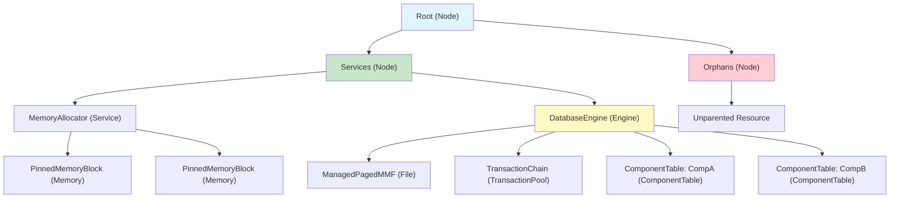
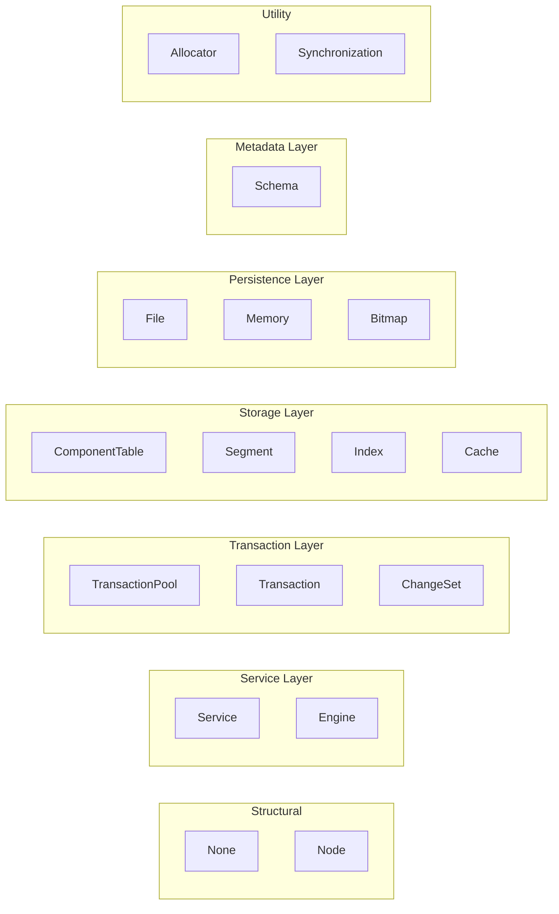
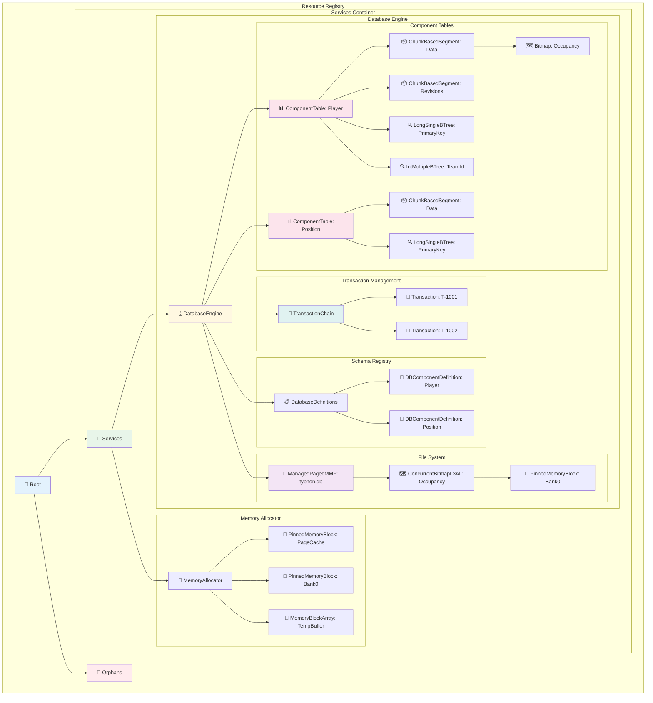
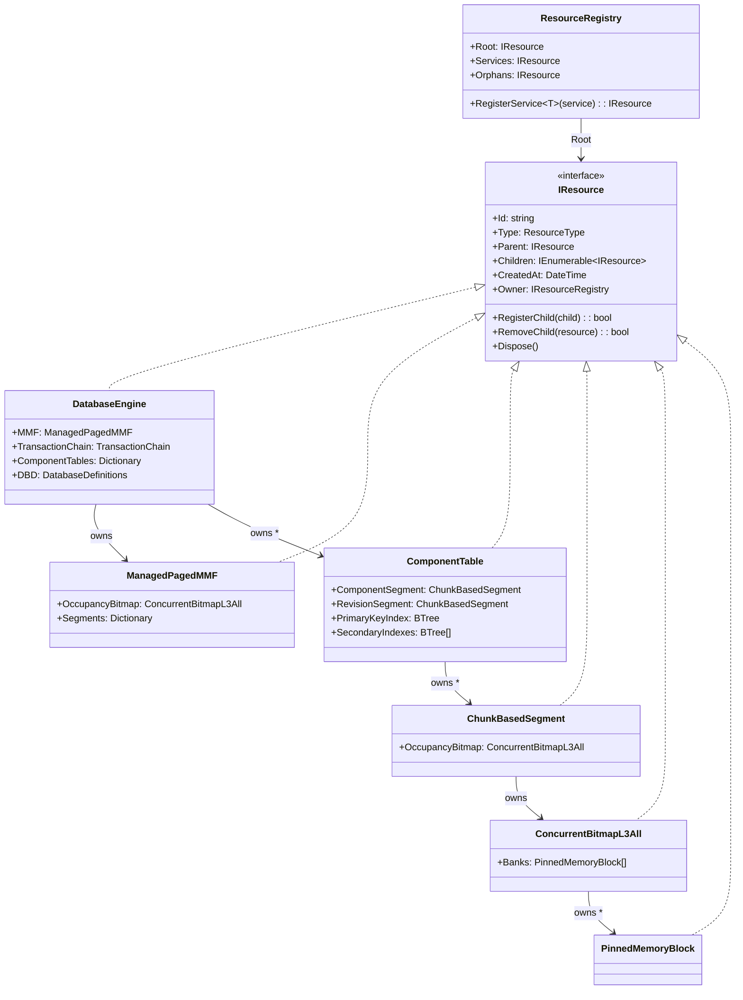
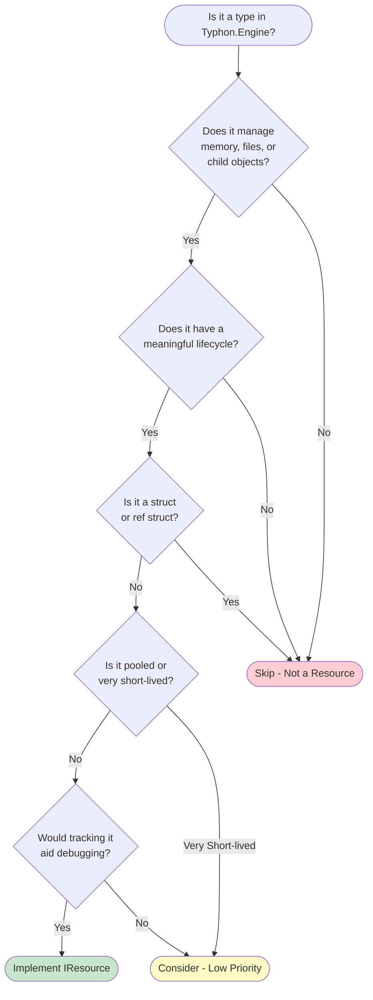
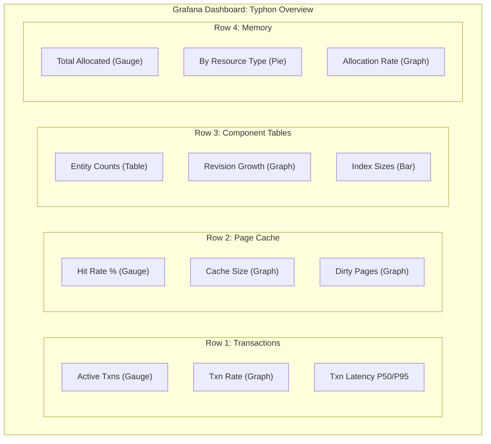
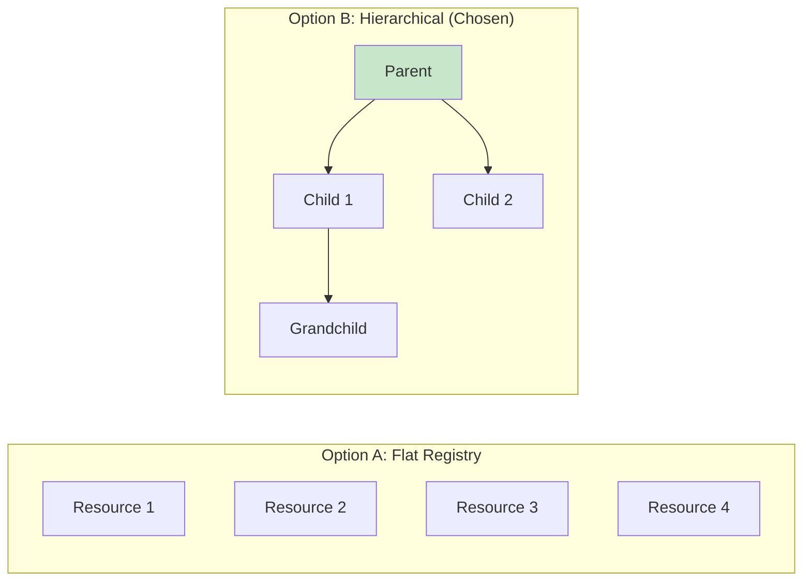
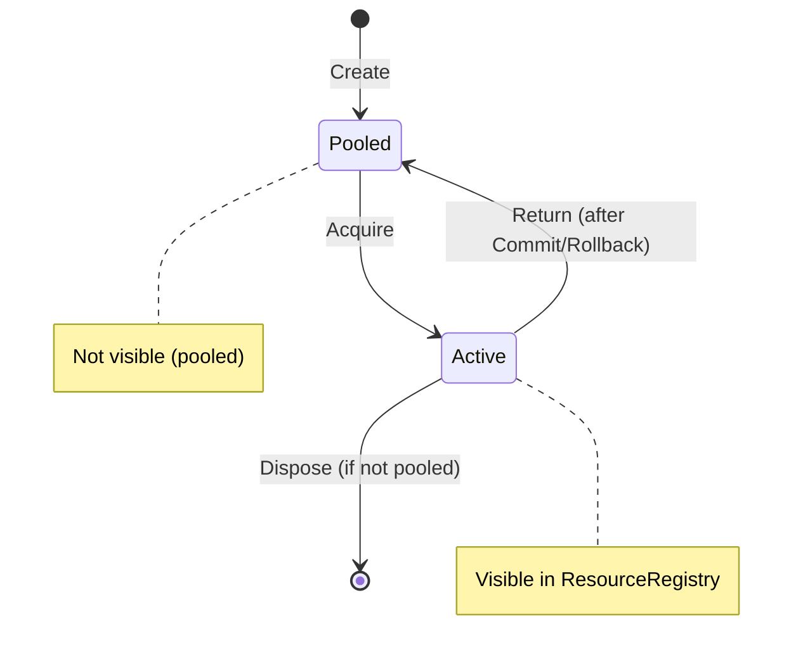

# Typhon Resource Registry System

**Date:** January 2026
**Status:** Ready for implementation
**Branch:** —

---

## Overview

The **Resource Registry** is a hierarchical tracking system for all managed resources in the Typhon database engine. It provides:

- **Lifecycle Management**: Track creation, ownership, and disposal of resources
- **Hierarchical Organization**: Parent-child relationships reflecting logical ownership
- **Debug Visibility**: Runtime introspection of system state
- **Telemetry Integration**: OpenTelemetry metrics export for monitoring

---

## Table of Contents

1. [Core Concepts](#1-core-concepts)
2. [ResourceType Enum](#2-resourcetype-enum)
3. [Resource Hierarchy](#3-resource-hierarchy)
4. [Type Inventory](#4-type-inventory)
5. [Implementation Patterns](#5-implementation-patterns)
6. [Integration Examples](#6-integration-examples)
7. [Telemetry & Metrics](#7-telemetry--metrics)
8. [Design Decisions](#8-design-decisions)
9. [Migration Guide](#9-migration-guide)

---

## 1. Core Concepts

### 1.1 What is a Resource?

A **Resource** is any object in Typhon that:
- Has a **lifecycle** (creation → usage → disposal)
- **Owns or manages** other objects, memory, or system handles
- Benefits from **visibility** during debugging or monitoring

### 1.2 The IResource Interface

```csharp
public interface IResource : IDisposable
{
    string Id { get; }                      // Unique identifier
    ResourceType Type { get; }              // Category of resource
    IResource Parent { get; }               // Owning resource (null for root)
    IEnumerable<IResource> Children { get; }// Owned resources
    DateTime CreatedAt { get; }             // Creation timestamp
    IResourceRegistry Owner { get; }        // Registry this belongs to

    bool RegisterChild(IResource child);    // Add child resource
    bool RemoveChild(IResource resource);   // Remove child resource
}
```

### 1.3 The Resource Registry

```csharp
public interface IResourceRegistry : IDisposable
{
    IResource Root { get; }      // Root of the resource tree
    IResource Services { get; }  // Container for top-level services
    IResource Orphans { get; }   // Container for unparented resources

    IResource RegisterService<T>(T service) where T : IResource;
}
```

### 1.4 Resource Tree Structure



---

## 2. ResourceType Enum

### 2.1 Current Definition (Incomplete)

```csharp
public enum ResourceType
{
    None,
    Node,            // Generic grouping node
    Service,         // Top-level services
    Memory,          // Memory blocks
    File,            // File handles
    Synchronization, // Locks (unused)
    Bitmap           // Hierarchical bitmaps
}
```

### 2.2 Proposed Extended Definition

```csharp
public enum ResourceType
{
    // ═══════════════════════════════════════════════════════════════
    // STRUCTURAL TYPES
    // ═══════════════════════════════════════════════════════════════

    /// <summary>No specific type assigned</summary>
    None = 0,

    /// <summary>Generic grouping node for hierarchy organization</summary>
    Node = 1,

    // ═══════════════════════════════════════════════════════════════
    // SERVICE LAYER
    // ═══════════════════════════════════════════════════════════════

    /// <summary>Top-level singleton services (MemoryAllocator, etc.)</summary>
    Service = 10,

    /// <summary>The main database engine instance</summary>
    Engine = 11,

    // ═══════════════════════════════════════════════════════════════
    // TRANSACTION LAYER
    // ═══════════════════════════════════════════════════════════════

    /// <summary>Transaction pool/chain managing active transactions</summary>
    TransactionPool = 20,

    /// <summary>Individual active transaction</summary>
    Transaction = 21,

    /// <summary>Pending changes within a transaction</summary>
    ChangeSet = 22,

    // ═══════════════════════════════════════════════════════════════
    // STORAGE LAYER
    // ═══════════════════════════════════════════════════════════════

    /// <summary>Per-component-type storage table</summary>
    ComponentTable = 30,

    /// <summary>Logical or chunk-based segment</summary>
    Segment = 31,

    /// <summary>B+Tree index structure</summary>
    Index = 32,

    /// <summary>Page cache subsystem</summary>
    Cache = 33,

    // ═══════════════════════════════════════════════════════════════
    // PERSISTENCE LAYER
    // ═══════════════════════════════════════════════════════════════

    /// <summary>Memory-mapped file or file handle</summary>
    File = 40,

    /// <summary>Memory block (pinned or array-backed)</summary>
    Memory = 41,

    /// <summary>Hierarchical bitmap for allocation tracking</summary>
    Bitmap = 42,

    // ═══════════════════════════════════════════════════════════════
    // METADATA LAYER
    // ═══════════════════════════════════════════════════════════════

    /// <summary>Schema definitions and metadata</summary>
    Schema = 50,

    // ═══════════════════════════════════════════════════════════════
    // UTILITY TYPES
    // ═══════════════════════════════════════════════════════════════

    /// <summary>Block allocator for fixed-size allocations</summary>
    Allocator = 60,

    /// <summary>Synchronization primitive (reader-writer lock, etc.)</summary>
    Synchronization = 61
}
```

### 2.3 ResourceType Hierarchy Diagram



---

## 3. Resource Hierarchy

### 3.1 Complete Resource Tree



### 3.2 Ownership Relationships



---

## 4. Type Inventory

### 4.1 Types That SHOULD Implement IResource

#### 4.1.1 Core Engine Layer

| Type | ResourceType | Parent | Children | Priority |
|------|--------------|--------|----------|----------|
| `DatabaseEngine` | `Engine` | Services | MMF, TransactionChain, ComponentTables[], DatabaseDefinitions | **P0** |
| `TransactionChain` | `TransactionPool` | DatabaseEngine | Transaction[] (active) | **P1** |
| `Transaction` | `Transaction` | TransactionChain | ChangeSet (optional) | **P2** |
| `DatabaseDefinitions` | `Schema` | DatabaseEngine | DBComponentDefinition[] | **P2** |
| `DBComponentDefinition` | `Schema` | DatabaseDefinitions | (leaf) | **P2** |

#### 4.1.2 Component Storage Layer

| Type | ResourceType | Parent | Children | Priority |
|------|--------------|--------|----------|----------|
| `ComponentTable` | `ComponentTable` | DatabaseEngine | All segments, indices | **P0** |

#### 4.1.3 Persistence Layer

| Type | ResourceType | Parent | Children | Priority |
|------|--------------|--------|----------|----------|
| `PagedMMF` | `File` | DatabaseEngine | PageCache memory | **P0** |
| `ManagedPagedMMF` | `File` | DatabaseEngine | OccupancyBitmap, LogicalSegments | **P0** |
| `LogicalSegment` | `Segment` | ManagedPagedMMF | (pages via parent) | **P1** |
| `ChunkBasedSegment` | `Segment` | ComponentTable | OccupancyBitmap | **P1** |
| `VariableSizedBufferSegmentBase` | `Segment` | ComponentTable | (leaf) | **P2** |
| `StringTableSegment` | `Segment` | ComponentTable | (leaf) | **P2** |
| `ChangeSet` | `ChangeSet` | Transaction | (leaf) | **P3** |

#### 4.1.4 Index Layer

| Type | ResourceType | Parent | Children | Priority |
|------|--------------|--------|----------|----------|
| `BTree<T>` (abstract) | `Index` | ComponentTable | NodeStorage segment | **P1** |
| `L16BTree`, `L32BTree`, `L64BTree`, `String64BTree` | `Index` | ComponentTable | (via base) | **P1** |
| All concrete BTrees (`LongSingleBTree`, etc.) | `Index` | ComponentTable | (via base) | **P1** |

#### 4.1.5 Memory Layer (Already Implemented ✅)

| Type | ResourceType | Parent | Children | Status |
|------|--------------|--------|----------|--------|
| `MemoryAllocator` | `Service` | Services | MemoryBlockBase[] | ✅ Done |
| `MemoryBlockBase` | `Memory` | Any | (leaf) | ✅ Done |
| `MemoryBlockArray` | `Memory` | Any | (leaf) | ✅ Done |
| `PinnedMemoryBlock` | `Memory` | Any | (leaf) | ✅ Done |

#### 4.1.6 Bitmap Layer (Partially Implemented)

| Type | ResourceType | Parent | Children | Status |
|------|--------------|--------|----------|--------|
| `ConcurrentBitmapL3All` | `Bitmap` | Any | PinnedMemoryBlock[] (banks) | ✅ Done |
| `ConcurrentBitmapL3Any` | `Bitmap` | Segment | PinnedMemoryBlock (if applicable) | Consider |

### 4.2 Types That Should NOT Implement IResource

| Type | Reason |
|------|--------|
| `PageAccessor` | Stack-allocated struct, scoped lifetime via `using` |
| `ChunkAccessor` | Stack-allocated ~1KB struct with inline MRU cache |
| `ComponentRevisionManager` | `ref struct`, transaction-scoped |
| `ComponentRevision` | `ref struct`, ephemeral |
| `RevisionEnumerator` | Scoped iteration utility |
| `RevisionWalker` | Scoped traversal utility |
| `AccessControl` | 8-byte struct embedded in other types |
| `AccessControlSmall` | 4-byte struct embedded in other types |
| `AdaptiveWaiter` | Utility with no state |
| `ConcurrentArray<T>` | Generic container, no specific lifecycle |
| `ConcurrentCollection<T>` | Generic container |
| `ComponentCollection<T>` | 4-byte struct (buffer ID reference) |
| `BitmapL3Any` | Simple utility class |
| `ConcurrentBitmap` | Simple single-level bitmap |

### 4.3 Decision Matrix



---

## 5. Implementation Patterns

### 5.1 Pattern 1: Service Base Class

Use for top-level singleton services that register under `Services`:

```csharp
public abstract class ServiceBase : IResource
{
    protected ServiceBase(string id, IResourceRegistry owner)
    {
        Id = id;
        Owner = owner;
        Parent = Owner.RegisterService(this);  // Auto-registers under Services
        CreatedAt = DateTime.UtcNow;
    }

    public abstract void Dispose();

    public string Id { get; }
    public ResourceType Type => ResourceType.Service;
    public IResource Parent { get; }
    public IEnumerable<IResource> Children => [];
    public DateTime CreatedAt { get; }
    public IResourceRegistry Owner { get; }

    public bool RegisterChild(IResource child) => throw new NotSupportedException();
    public bool RemoveChild(IResource resource) => throw new NotSupportedException();
}

// Usage:
public class MemoryAllocator : ServiceBase, IMemoryAllocator
{
    public MemoryAllocator(IResourceRegistry registry, MemoryAllocatorOptions options)
        : base(options?.Name ?? "MemoryAllocator", registry)
    {
        // Service is automatically registered
    }
}
```

### 5.2 Pattern 2: Standard Resource with Children

Use for resources that own other resources:

```csharp
public class DatabaseEngine : IResource, IDisposable
{
    private readonly ConcurrentDictionary<string, IResource> _children = new();

    public DatabaseEngine(IResourceRegistry registry, DatabaseEngineOptions options)
    {
        Id = options?.Name ?? "DatabaseEngine";
        Owner = registry;
        Parent = registry.RegisterService(this);
        CreatedAt = DateTime.UtcNow;

        // Create child resources, passing 'this' as parent
        MMF = new ManagedPagedMMF(this, mmfOptions);
        TransactionChain = new TransactionChain(this);
    }

    // IResource implementation
    public string Id { get; }
    public ResourceType Type => ResourceType.Engine;
    public IResource Parent { get; }
    public IEnumerable<IResource> Children => _children.Values;
    public DateTime CreatedAt { get; }
    public IResourceRegistry Owner { get; }

    public bool RegisterChild(IResource child)
    {
        return _children.TryAdd(child.Id, child);
    }

    public bool RemoveChild(IResource resource)
    {
        return _children.TryRemove(resource.Id, out _);
    }

    public void Dispose()
    {
        // Dispose children in reverse creation order (or specific order)
        foreach (var child in _children.Values.Reverse())
        {
            child.Dispose();
        }
        _children.Clear();

        Parent?.RemoveChild(this);
        GC.SuppressFinalize(this);
    }
}
```

### 5.3 Pattern 3: Leaf Resource (No Children)

Use for resources that don't own other resources:

```csharp
public class ChunkBasedSegment : LogicalSegment, IResource
{
    public ChunkBasedSegment(string id, IResource parent, /* other params */)
    {
        Id = id;
        Parent = parent ?? throw new ArgumentNullException(nameof(parent));
        Owner = parent.Owner;
        CreatedAt = DateTime.UtcNow;

        // Register with parent
        Parent.RegisterChild(this);

        // Create owned bitmap (it will register itself as our child)
        _occupancyBitmap = new ConcurrentBitmapL3All($"{id}_Occupancy", this, capacity);
    }

    // IResource implementation
    public string Id { get; }
    public ResourceType Type => ResourceType.Segment;
    public IResource Parent { get; }
    public IEnumerable<IResource> Children => [_occupancyBitmap];
    public DateTime CreatedAt { get; }
    public IResourceRegistry Owner { get; }

    public bool RegisterChild(IResource child) => false; // Managed internally
    public bool RemoveChild(IResource resource) => false;

    public override void Dispose()
    {
        _occupancyBitmap?.Dispose();
        Parent?.RemoveChild(this);
        base.Dispose();
    }
}
```

### 5.4 Pattern 4: Resource with Dynamic Children

Use when children are created/destroyed dynamically:

```csharp
public class TransactionChain : IResource
{
    private readonly ConcurrentDictionary<string, Transaction> _activeTransactions = new();

    public TransactionChain(IResource parent)
    {
        Id = "TransactionChain";
        Parent = parent;
        Owner = parent.Owner;
        CreatedAt = DateTime.UtcNow;
        Parent.RegisterChild(this);
    }

    public Transaction CreateTransaction()
    {
        var txn = new Transaction($"T-{Interlocked.Increment(ref _txnCounter)}", this);
        _activeTransactions.TryAdd(txn.Id, txn);
        return txn;
    }

    internal void ReturnTransaction(Transaction txn)
    {
        _activeTransactions.TryRemove(txn.Id, out _);
        // Return to pool...
    }

    // IResource
    public IEnumerable<IResource> Children => _activeTransactions.Values;

    public bool RegisterChild(IResource child)
    {
        if (child is Transaction txn)
            return _activeTransactions.TryAdd(txn.Id, txn);
        return false;
    }

    public bool RemoveChild(IResource resource)
    {
        if (resource is Transaction txn)
            return _activeTransactions.TryRemove(txn.Id, out _);
        return false;
    }
}
```

### 5.5 Pattern 5: Self-Registering Resource

Resources that register themselves with their parent:

```csharp
public class ConcurrentBitmapL3All : IResource
{
    public ConcurrentBitmapL3All(string id, IResource parent, int bankCapacity)
    {
        Id = id ?? Guid.NewGuid().ToString();
        Parent = parent ?? TyphonServices.ResourceRegistry.Orphans;  // Fallback to Orphans
        Owner = Parent.Owner;
        CreatedAt = DateTime.UtcNow;

        // Self-register with parent
        Parent.RegisterChild(this);

        // Create first bank (PinnedMemoryBlock registers itself with us)
        _banks = [new Bank(this, 0)];
    }

    // Bank creates PinnedMemoryBlock with 'this' as parent
    private class Bank : IDisposable
    {
        public Bank(ConcurrentBitmapL3All owner, int index)
        {
            var allocator = TyphonServices.MemoryAllocator;
            MemoryBlock = allocator.AllocatePinned($"Bank{index}", owner, size, zeroed: true, alignment: 64);
        }
    }

    public IEnumerable<IResource> Children => _banks.Select(b => b.MemoryBlock);
}
```

---

## 6. Integration Examples

### 6.1 DI Registration

```csharp
// In Startup.cs or Program.cs
public static IServiceCollection AddTyphon(this IServiceCollection services)
{
    // Register the resource registry as singleton
    services.AddSingleton<IResourceRegistry>(sp =>
    {
        var registry = new ResourceRegistry(new ResourceRegistryOptions { Name = "Typhon" });
        TyphonServices.Initialize(registry);
        return registry;
    });

    // Register MemoryAllocator (will auto-register as Service)
    services.AddSingleton<IMemoryAllocator>(sp =>
    {
        var registry = sp.GetRequiredService<IResourceRegistry>();
        return new MemoryAllocator(registry, new MemoryAllocatorOptions { Name = "DefaultAllocator" });
    });

    // Register DatabaseEngine
    services.AddSingleton<DatabaseEngine>(sp =>
    {
        var registry = sp.GetRequiredService<IResourceRegistry>();
        var mmf = new ManagedPagedMMF(/* options */);
        var logger = sp.GetRequiredService<ILogger<DatabaseEngine>>();
        return new DatabaseEngine(registry, new DatabaseEngineOptions(), mmf, logger);
    });

    return services;
}
```

### 6.2 Querying the Resource Tree

```csharp
public class ResourceInspector
{
    private readonly IResourceRegistry _registry;

    public ResourceInspector(IResourceRegistry registry)
    {
        _registry = registry;
    }

    /// <summary>
    /// Print the entire resource tree to console
    /// </summary>
    public void DumpTree()
    {
        PrintResource(_registry.Root, 0);
    }

    private void PrintResource(IResource resource, int depth)
    {
        var indent = new string(' ', depth * 2);
        var icon = GetIcon(resource.Type);
        Console.WriteLine($"{indent}{icon} {resource.Id} ({resource.Type})");

        foreach (var child in resource.Children)
        {
            PrintResource(child, depth + 1);
        }
    }

    private string GetIcon(ResourceType type) => type switch
    {
        ResourceType.Node => "📁",
        ResourceType.Service => "🔧",
        ResourceType.Engine => "🗄️",
        ResourceType.File => "📄",
        ResourceType.Memory => "💾",
        ResourceType.Bitmap => "🗺️",
        ResourceType.Segment => "📦",
        ResourceType.Index => "🔍",
        ResourceType.ComponentTable => "📊",
        ResourceType.Transaction => "📝",
        ResourceType.TransactionPool => "🔄",
        ResourceType.Schema => "📋",
        _ => "❓"
    };

    /// <summary>
    /// Find all resources of a specific type
    /// </summary>
    public IEnumerable<IResource> FindByType(ResourceType type)
    {
        return EnumerateAll(_registry.Root).Where(r => r.Type == type);
    }

    /// <summary>
    /// Find a resource by path (e.g., "Services/DatabaseEngine/ComponentTables/Player")
    /// </summary>
    public IResource FindByPath(string path)
    {
        var parts = path.Split('/');
        IResource current = _registry.Root;

        foreach (var part in parts)
        {
            current = current.Children.FirstOrDefault(c => c.Id == part);
            if (current == null) return null;
        }

        return current;
    }

    /// <summary>
    /// Get memory usage summary
    /// </summary>
    public (int count, long totalBytes) GetMemoryStats()
    {
        var memoryResources = FindByType(ResourceType.Memory)
            .OfType<IMemoryResource>()
            .ToList();

        return (memoryResources.Count, memoryResources.Sum(m => m.Size));
    }

    private IEnumerable<IResource> EnumerateAll(IResource root)
    {
        yield return root;
        foreach (var child in root.Children)
        {
            foreach (var descendant in EnumerateAll(child))
            {
                yield return descendant;
            }
        }
    }
}
```

### 6.3 Debug Snapshot Collection

```csharp
public interface IDebugPropertiesProvider
{
    Dictionary<string, Func<object>> DebugProperties { get; }
}

public static class ResourceExtensions
{
    /// <summary>
    /// Collect a snapshot of all debug properties from the resource tree
    /// </summary>
    public static Dictionary<string, Dictionary<string, object>> CollectDebugSnapshot(
        this IResourceRegistry registry)
    {
        var snapshot = new Dictionary<string, Dictionary<string, object>>();
        CollectFromResource(registry.Root, "", snapshot);
        return snapshot;
    }

    private static void CollectFromResource(
        IResource resource,
        string path,
        Dictionary<string, Dictionary<string, object>> snapshot)
    {
        var fullPath = string.IsNullOrEmpty(path) ? resource.Id : $"{path}/{resource.Id}";

        var properties = new Dictionary<string, object>
        {
            ["Type"] = resource.Type.ToString(),
            ["CreatedAt"] = resource.CreatedAt,
            ["ChildCount"] = resource.Children.Count()
        };

        // Add debug properties if available
        if (resource is IDebugPropertiesProvider provider)
        {
            foreach (var (key, getter) in provider.DebugProperties)
            {
                try
                {
                    properties[key] = getter();
                }
                catch (Exception ex)
                {
                    properties[key] = $"<error: {ex.Message}>";
                }
            }
        }

        snapshot[fullPath] = properties;

        foreach (var child in resource.Children)
        {
            CollectFromResource(child, fullPath, snapshot);
        }
    }
}

// Usage in a resource:
public class ComponentTable : IResource, IDebugPropertiesProvider
{
    public Dictionary<string, Func<object>> DebugProperties => new()
    {
        ["EntityCount"] = () => _primaryKeyIndex.Count,
        ["RevisionCount"] = () => _revisionSegment.AllocatedChunks,
        ["IndexCount"] = () => _secondaryIndexes.Count,
        ["SegmentPageCount"] = () => _componentSegment.PageCount
    };
}
```

### 6.4 Unit Test Example

```csharp
[TestFixture]
public class ResourceRegistryTests : TestBase
{
    [Test]
    public void DatabaseEngine_RegistersInResourceTree()
    {
        // Arrange
        var registry = ServiceProvider.GetRequiredService<IResourceRegistry>();
        var dbe = ServiceProvider.GetRequiredService<DatabaseEngine>();

        // Act
        dbe.RegisterComponent<TestComponent>();

        // Assert
        var engineResource = registry.Services.Children
            .FirstOrDefault(c => c.Type == ResourceType.Engine);

        Assert.That(engineResource, Is.Not.Null);
        Assert.That(engineResource.Id, Is.EqualTo("DatabaseEngine"));

        // Verify ComponentTable was registered
        var componentTables = engineResource.Children
            .Where(c => c.Type == ResourceType.ComponentTable)
            .ToList();

        Assert.That(componentTables, Has.Count.EqualTo(1));
        Assert.That(componentTables[0].Id, Does.Contain("TestComponent"));
    }

    [Test]
    public void Dispose_CascadesToAllChildren()
    {
        // Arrange
        var registry = new ResourceRegistry(new ResourceRegistryOptions { Name = "Test" });
        var node = new ResourceNode("TestNode", ResourceType.Node, registry.Root);
        var childNode = new ResourceNode("ChildNode", ResourceType.Node, node);

        // Act
        registry.Dispose();

        // Assert - both nodes should be disposed (Children cleared)
        Assert.That(registry.Root.Children, Is.Empty);
    }

    [Test]
    public void MemoryAllocation_TracksInRegistry()
    {
        // Arrange
        var registry = ServiceProvider.GetRequiredService<IResourceRegistry>();
        var allocator = ServiceProvider.GetRequiredService<IMemoryAllocator>();

        // Act
        var block = allocator.AllocatePinned("TestBlock", registry.Services, 1024);

        // Assert
        var memoryResources = registry.Services.Children
            .SelectMany(EnumerateAll)
            .Where(r => r.Type == ResourceType.Memory)
            .ToList();

        Assert.That(memoryResources, Has.Count.GreaterThanOrEqualTo(1));
        Assert.That(memoryResources.Any(m => m.Id == "TestBlock"), Is.True);

        // Cleanup
        block.Dispose();
    }

    private IEnumerable<IResource> EnumerateAll(IResource root)
    {
        yield return root;
        foreach (var child in root.Children.SelectMany(EnumerateAll))
            yield return child;
    }
}
```

---

## 7. Telemetry & Metrics

### 7.1 OpenTelemetry Integration

```csharp
public class DatabaseEngine : IResource, IDebugPropertiesProvider
{
    private readonly Meter _meter;
    private readonly Counter<long> _transactionCounter;
    private readonly ObservableGauge<int> _activeTransactionsGauge;

    public DatabaseEngine(IResourceRegistry registry, /* ... */)
    {
        // ... standard initialization ...

        // Create OpenTelemetry meter
        _meter = new Meter("Typhon.DatabaseEngine", "1.0.0");

        // Counter for total transactions
        _transactionCounter = _meter.CreateCounter<long>(
            "typhon.transactions.total",
            unit: "{transaction}",
            description: "Total number of transactions created");

        // Gauge for active transactions
        _activeTransactionsGauge = _meter.CreateObservableGauge(
            "typhon.transactions.active",
            () => TransactionChain.ActiveCount,
            unit: "{transaction}",
            description: "Number of currently active transactions");
    }

    public Transaction CreateTransaction()
    {
        _transactionCounter.Add(1);
        return TransactionChain.CreateTransaction(this);
    }

    // Debug properties for ResourceRegistry inspection
    public Dictionary<string, Func<object>> DebugProperties => new()
    {
        ["ActiveTransactions"] = () => TransactionChain.ActiveCount,
        ["MinTick"] = () => TransactionChain.MinTick,
        ["ComponentTableCount"] = () => _componentTableByType.Count
    };
}
```

### 7.2 Page Cache Metrics

```csharp
public partial class PagedMMF : IResource, IDebugPropertiesProvider
{
    private readonly Meter _meter;
    private readonly Counter<long> _cacheHits;
    private readonly Counter<long> _cacheMisses;
    private readonly Histogram<double> _pageLoadTime;
    private readonly ObservableGauge<int> _dirtyPagesGauge;

    public PagedMMF(IResource parent, PagedMMFOptions options)
    {
        // ... initialization ...

        _meter = new Meter("Typhon.PagedMMF", "1.0.0");

        _cacheHits = _meter.CreateCounter<long>("typhon.pagecache.hits");
        _cacheMisses = _meter.CreateCounter<long>("typhon.pagecache.misses");

        _pageLoadTime = _meter.CreateHistogram<double>(
            "typhon.pagecache.load_time",
            unit: "ms",
            description: "Time to load a page from disk");

        _dirtyPagesGauge = _meter.CreateObservableGauge(
            "typhon.pagecache.dirty_pages",
            () => CountDirtyPages());
    }

    public Dictionary<string, Func<object>> DebugProperties => new()
    {
        ["TotalPages"] = () => _header.PageCount,
        ["CachedPages"] = () => CountCachedPages(),
        ["DirtyPages"] = () => CountDirtyPages(),
        ["HitRate"] = () => CalculateHitRate(),
        ["FileSizeMB"] = () => _fileStream.Length / (1024.0 * 1024.0)
    };
}
```

### 7.3 Prometheus/Grafana Queries

```promql
# Active transactions over time
typhon_transactions_active

# Transaction rate (per second)
rate(typhon_transactions_total[1m])

# Page cache hit rate
sum(rate(typhon_pagecache_hits[5m])) /
(sum(rate(typhon_pagecache_hits[5m])) + sum(rate(typhon_pagecache_misses[5m])))

# P95 page load time
histogram_quantile(0.95, rate(typhon_pagecache_load_time_bucket[5m]))

# Entity count by component type
typhon_componenttable_entity_count{component_type=~".*"}

# Memory usage by resource type
sum by (resource_type) (typhon_memory_allocated_bytes)
```

### 7.4 Metrics Dashboard Layout



---

## 8. Design Decisions

### 8.1 Why Hierarchical Resources?



**Reasons for hierarchical design:**
1. **Natural ownership**: Resources naturally own other resources (DBE → ComponentTable → Segment)
2. **Cascade disposal**: Disposing parent disposes all children automatically
3. **Scoped queries**: "Find all segments under ComponentTable:Player"
4. **Debugging context**: See which parent created a leaked resource

### 8.2 Why Self-Registration?

Resources register themselves with their parent in their constructor:

```csharp
public ChunkBasedSegment(string id, IResource parent, ...)
{
    Parent = parent;
    Parent.RegisterChild(this);  // Self-registration
}
```

**Benefits:**
- Ensures every resource is tracked (can't forget to register)
- Parent-child relationship established atomically
- Simplifies factory patterns

**Alternative considered:** Factory-only creation
- Rejected because it adds ceremony and doesn't prevent leaks

### 8.3 Transaction Tracking Strategy

**Decision:** Track transactions as resources, but with awareness of pooling.



**Rationale:**
- Active transactions are important for debugging (who's holding locks?)
- Pooled transactions don't need visibility
- Overhead is acceptable since transaction count is bounded

### 8.4 Memory Overhead Analysis

| IResource Implementation | Memory Overhead |
|--------------------------|-----------------|
| `Id` (string) | ~40 bytes (typical) |
| `Parent` (reference) | 8 bytes |
| `Owner` (reference) | 8 bytes |
| `CreatedAt` (DateTime) | 8 bytes |
| `_children` (ConcurrentDictionary) | ~80 bytes empty |
| **Total** | **~144 bytes minimum** |

**Mitigation strategies:**
1. Don't track very short-lived objects (accessors, ref structs)
2. Use lightweight leaf pattern (no `_children` dictionary)
3. Consider conditional tracking (debug builds only) for high-frequency types

### 8.5 Thread Safety

All `IResource` implementations must be thread-safe:

| Operation | Thread Safety Mechanism |
|-----------|------------------------|
| `RegisterChild` | `ConcurrentDictionary.TryAdd` |
| `RemoveChild` | `ConcurrentDictionary.TryRemove` |
| `Children` enumeration | Snapshot via `.Values` |
| `Dispose` | Idempotent, removes from parent |

**Warning:** `Children` enumeration may see inconsistent state during concurrent modification. This is acceptable for debugging/monitoring but not for critical logic.

---

## 9. Migration Guide

### 9.1 Step 1: Add IResource to Existing Types

```csharp
// Before
public class ComponentTable : IDisposable
{
    public void Dispose() { /* ... */ }
}

// After
public class ComponentTable : IResource, IDisposable
{
    private readonly ConcurrentDictionary<string, IResource> _children = new();

    public ComponentTable(string name, IResource parent, /* ... */)
    {
        Id = name;
        Parent = parent ?? throw new ArgumentNullException(nameof(parent));
        Owner = parent.Owner;
        CreatedAt = DateTime.UtcNow;
        Parent.RegisterChild(this);

        // Existing initialization...
    }

    // IResource implementation
    public string Id { get; }
    public ResourceType Type => ResourceType.ComponentTable;
    public IResource Parent { get; }
    public IEnumerable<IResource> Children => _children.Values;
    public DateTime CreatedAt { get; }
    public IResourceRegistry Owner { get; }

    public bool RegisterChild(IResource child) => _children.TryAdd(child.Id, child);
    public bool RemoveChild(IResource resource) => _children.TryRemove(resource.Id, out _);

    public void Dispose()
    {
        // Dispose children first
        foreach (var child in _children.Values)
        {
            child.Dispose();
        }
        _children.Clear();

        // Remove from parent
        Parent?.RemoveChild(this);

        // Existing disposal logic...
        GC.SuppressFinalize(this);
    }
}
```

### 9.2 Step 2: Update Constructors to Accept Parent

```csharp
// Before
public ChunkBasedSegment(ManagedPagedMMF mmf, int chunkSize)

// After
public ChunkBasedSegment(string id, IResource parent, ManagedPagedMMF mmf, int chunkSize)
```

### 9.3 Step 3: Update Child Creation

```csharp
// Before
_componentSegment = new ChunkBasedSegment(MMF, componentSize);

// After
_componentSegment = new ChunkBasedSegment(
    $"{Id}_ComponentData",  // Descriptive ID
    this,                    // Parent is ComponentTable
    MMF,
    componentSize);
```

### 9.4 Step 4: Add Debug Properties (Optional)

```csharp
public class ComponentTable : IResource, IDebugPropertiesProvider
{
    public Dictionary<string, Func<object>> DebugProperties => new()
    {
        ["EntityCount"] = () => _primaryKeyIndex.Count,
        ["RevisionCount"] = () => _revisionSegment.AllocatedChunks,
        ["MemoryUsageMB"] = () => EstimateMemoryUsage() / (1024.0 * 1024.0)
    };
}
```

### 9.5 Migration Checklist

- [ ] Identify all types that should implement `IResource` (see Type Inventory)
- [ ] Add `IResource` interface to each type
- [ ] Update constructors to accept `IResource parent` parameter
- [ ] Implement self-registration in constructor
- [ ] Update `Dispose()` to cascade to children and remove from parent
- [ ] Update all call sites to pass parent reference
- [ ] Add unit tests for registration and disposal
- [ ] (Optional) Implement `IDebugPropertiesProvider`
- [ ] (Optional) Add OpenTelemetry metrics

---

## Appendix A: Quick Reference

### Resource Creation Pattern

```csharp
public class MyResource : IResource
{
    public MyResource(string id, IResource parent)
    {
        Id = id;
        Parent = parent ?? TyphonServices.ResourceRegistry.Orphans;
        Owner = Parent.Owner;
        CreatedAt = DateTime.UtcNow;
        Parent.RegisterChild(this);
    }
}
```

### Resource Disposal Pattern

```csharp
public void Dispose()
{
    if (_disposed) return;
    _disposed = true;

    // 1. Dispose children
    foreach (var child in Children.ToList())
        child.Dispose();

    // 2. Remove from parent
    Parent?.RemoveChild(this);

    // 3. Release own resources
    // ...

    GC.SuppressFinalize(this);
}
```

### Finding Resources

```csharp
// By type
var segments = registry.FindByType(ResourceType.Segment);

// By path
var player = registry.FindByPath("Services/DatabaseEngine/ComponentTables/Player");

// Memory stats
var (count, bytes) = new ResourceInspector(registry).GetMemoryStats();
```

---

## Appendix B: Glossary

| Term | Definition |
|------|------------|
| **Resource** | Any tracked object with lifecycle management |
| **ResourceRegistry** | Central registry holding the resource tree |
| **Parent** | The resource that owns/created this resource |
| **Children** | Resources owned by this resource |
| **Orphan** | Resource created without explicit parent (goes to Orphans node) |
| **Service** | Top-level singleton resource under Services node |
| **Cascade Disposal** | Disposing parent automatically disposes children |

---

*Document Version: 1.0*
*Last Updated: 2024*
*Author: Claude Code Analysis*
