# Component 1: Concurrency & Synchronization

> Foundation layer providing latches, deadlines, cancellation, and wait infrastructure for all concurrent access in Typhon.

---

## Overview

Every database operation that touches shared data needs synchronization. This component provides the low-level primitives that the Storage Engine, Data Engine, and higher layers build upon.

<a href="../assets/typhon-concurrency-overview.svg">
  
</a>
<sub>🔍 Click to open full size (Ctrl+Scroll to zoom) — For pan-zoom: open <code>claude/assets/viewer.html</code> in browser</sub>

---

## Sub-Components

| # | Name | Size | Purpose | Status |
|---|------|------|---------|--------|
| **1.1** | [Deadline](#11-deadline) | 8 bytes | Monotonic timeout tracking | ✅ Implemented |
| **1.2** | [Watchdog Thread](#12-watchdog-thread) | N/A | Background expiry monitoring | 🆕 New |
| **1.3** | [AccessControl](#13-accesscontrol) | 64-bit | Reader-writer lock with telemetry | ✅ Complete |
| **1.4** | [AccessControlSmall](#14-accesscontrolsmall) | 32-bit | Compact RW lock | ✅ Complete |
| **1.5** | [ResourceAccessControl](#15-resourceaccesscontrol) | 32-bit | 3-mode lifecycle lock | ✅ Implemented |
| **1.6** | [Cancellation Helpers](#16-cancellation-helpers) | N/A | Yield points, holdoff regions | 🔮 Future |
| **1.7** | [Epoch-Based Resource Protection](#17-epoch-based-resource-protection) | N/A | Page lifetime via epoch scopes | ✅ Complete |

---

## 1.1 Deadline

### Purpose

Represent a point in time for timeout expiration using **monotonic time** (not wall-clock). This avoids issues with NTP adjustments, daylight saving, or manual clock changes.

### Why Not DateTime.UtcNow?

```csharp
// PROBLEM: Wall-clock time can jump
var timeout = DateTime.UtcNow + TimeSpan.FromSeconds(5);
// NTP sync happens, clock jumps back 10 seconds
// Result: timeout is now 15 seconds in the future, not 5
```

### Design

```csharp
public readonly struct Deadline
{
    private readonly long _timestamp;  // Stopwatch.GetTimestamp() value

    // Construction
    public static Deadline FromTimeout(TimeSpan timeout);
    public static Deadline Infinite { get; }  // Never expires
    public static Deadline Now { get; }       // Already expired

    // Queries
    public bool IsExpired { get; }
    public bool IsInfinite { get; }
    public TimeSpan Remaining { get; }  // Clamped to Zero if expired

    // Composition
    public static Deadline Min(Deadline a, Deadline b);

    // Integration with .NET
    public CancellationToken ToCancellationToken();  // Via shared watchdog
}
```

### Overflow Handling

At 1 GHz tick frequency, `long.MaxValue` ≈ 292 years of ticks. Overflow during `now + timeout` is handled by clamping:

```csharp
public static Deadline FromTimeout(TimeSpan timeout)
{
    if (timeout == Timeout.InfiniteTimeSpan)
        return Infinite;

    long now = Stopwatch.GetTimestamp();
    long ticks = (long)(timeout.TotalSeconds * Stopwatch.Frequency);

    // Defensive: clamp on overflow
    if (ticks > long.MaxValue - now)
        return Infinite;

    return new Deadline(now + ticks);
}
```

### Code Location

`src/Typhon.Engine/Concurrency/Deadline.cs` ✅

---

## 1.2 Watchdog Thread

### Purpose

A single background thread that:
1. Monitors registered deadlines and triggers cancellation when they expire
2. Can be extended for other periodic tasks (health checks, metrics collection, etc.)

### Why Shared?

Creating a `CancellationTokenSource.CancelAfter()` for every deadline creates a timer per deadline. A shared watchdog:
- Reduces timer/thread overhead
- Centralizes timeout monitoring
- Provides a home for future background tasks

### Design

```csharp
internal static class DeadlineWatchdog
{
    // Register a deadline, get a CancellationToken that cancels when it expires
    public static CancellationToken Register(Deadline deadline);

    // For advanced use: callback instead of token
    public static IDisposable Register(Deadline deadline, Action onExpired);
}
```

### Implementation Notes

- Uses a priority queue sorted by expiration time
- Wakes up only when the soonest deadline is near (not polling)
- Thread-safe registration from any thread
- Lazy initialization (not started until first deadline registered)

### Code Location

`src/Typhon.Engine/Misc/DeadlineWatchdog.cs` *(to be created)*

---

## 1.3 AccessControl

### Purpose

64-bit reader-writer lock with:
- Shared (read) and Exclusive (write) modes
- Promotion from Shared to Exclusive
- Waiter tracking for fairness
- Runtime-configurable telemetry
- Deadline-based timeouts

### Current State

**Complete** - Full WaitContext support with monotonic Deadline and CancellationToken integration.

### Bit Layout (64-bit)

```
┌────────────────────────────────────────────────────────────────────────────┐
│                              64-bit State                                   │
├────────────────────────────────────────────────────────────────────────────┤
│ Bits 0-7    │ Shared counter (0-255 concurrent readers)                    │
│ Bits 8-15   │ Shared waiters count                                         │
│ Bits 16-23  │ Exclusive waiters count                                      │
│ Bits 24-31  │ Promoter waiters count                                       │
│ Bits 32-47  │ Thread ID of exclusive holder (truncated)                    │
│ Bits 48-49  │ State (Idle=0, Shared=1, Exclusive=2)                        │
│ Bits 50-63  │ Telemetry block ID (when enabled)                            │
└────────────────────────────────────────────────────────────────────────────┘
```

### API

```csharp
public struct AccessControl
{
    // Shared access (multiple concurrent)
    public bool EnterSharedAccess(ref WaitContext ctx, IContentionTarget target = null);
    public void ExitSharedAccess(IContentionTarget target = null);

    // Exclusive access (single holder)
    public bool TryEnterExclusiveAccess(IContentionTarget target = null);
    public bool EnterExclusiveAccess(ref WaitContext ctx, IContentionTarget target = null);
    public void ExitExclusiveAccess(IContentionTarget target = null);

    // Promotion (Shared → Exclusive)
    public bool TryPromoteToExclusiveAccess(ref WaitContext ctx, IContentionTarget target = null);
    public void DemoteFromExclusiveAccess(IContentionTarget target = null);

    // Lifecycle
    public void Reset();
}
```

### Telemetry

Controlled via `TelemetryConfig.AccessControl.Enabled` (static readonly bool, JIT-friendly):

```csharp
if (TelemetryConfig.AccessControl.Enabled)
{
    RecordContention(waitDuration, accessType);
}
```

### Fairness Protocol

AccessControl implements a **writer-preferring** fairness policy. The key decision point is in `EnterSharedAccess`:

```csharp
// From AccessControlImpl:
public bool CanShareStart => (_staging & (PromoterWaitersMask | ExclusiveWaitersMask)) == 0;
```

When `ExclusiveWaiters > 0` OR `PromoterWaiters > 0`, new Shared requests are **blocked** — they must wait until the pending writers have been served. This prevents writer starvation under read-heavy workloads (a common problem with reader-preferring locks like `ReaderWriterLockSlim` in default mode).

**Fairness model: "class of waiters", not strict FIFO**

Within a waiter class (all waiting exclusives, or all waiting sharers), there is no ordering guarantee — the first thread to win the CAS gets the lock. This is a deliberate trade-off:

| Policy | Throughput | Latency Variance | Starvation Risk |
|--------|-----------|-------------------|-----------------|
| **Strict FIFO** | Lower (queue overhead) | Low | None |
| **Class-of-waiters** (Typhon) | Higher (no queue) | Medium | Within-class only |
| **No fairness** | Highest | High | Readers starve writers |

The class-of-waiters approach is appropriate because:
1. Lock hold times are very short (~50-500ns for page latches)
2. Thread counts are bounded (game server with known thread count)
3. Under real contention, priority inversion is rare and short-lived

**How waiter tracking works** (from `LockData.WaitForIdleState`):

```
Thread wants Exclusive lock but state is Shared:
  1. Atomically increment ExclusiveWaiters (CAS on 64-bit state)
  2. Spin in loop, checking for IdleState
  3. When idle detected: decrement ExclusiveWaiters, re-attempt CAS
  4. If timeout/cancel: decrement waiter counter, return false
```

The waiter counters are visible to other threads via the same 64-bit atomic word — no separate synchronization is needed to communicate priority.

### Promotion Protocol

Promotion (Shared → Exclusive) allows a thread holding a Shared latch to upgrade to Exclusive without releasing and re-acquiring. This is critical for B+Tree operations that start with a read traversal and may need to write (e.g., insert causing a node split).

**Promotion condition** (from `AccessControlImpl`):

```csharp
public bool CanPromoteToExclusive => (_initial & SharedCounterMask) == 1;
```

Promotion succeeds only when the promoter is the **sole shared holder** (`SharedCounter == 1`). If other readers exist, the promoter must wait for them to exit.

**Deadlock prevention: single-promoter policy**

The `PromoterWaiters` counter in the 64-bit state tracks pending promoters. If two threads both hold Shared and both try to promote, they would deadlock (each waiting for the other to release Shared). Typhon prevents this by:

1. Only one promoter waits at a time — the `WaitForIdleState(WaitFor.Promote)` path increments `PromoterWaiters`, signaling to other would-be promoters that promotion is blocked
2. Timeout via `Deadline` (monotonic) — if promotion can't complete in time, the thread gives up and returns `false`
3. B+Tree latch-coupling pattern ensures only one thread per traversal path attempts promotion

**Promotion vs Release-and-Reacquire**:

| Approach | Risk | Cost |
|----------|------|------|
| **Promotion** | None (if single-promoter ensured) | One CAS attempt |
| **Release + Reacquire** | Another writer may interleave | Two state transitions + re-validation |

Promotion is preferred because it avoids the "check-then-act" race where another thread modifies the data between release and reacquire.

### Spin-Wait Strategy (AdaptiveWaiter)

The `AdaptiveWaiter` class provides a progressive spin-to-sleep strategy that adapts to contention duration:

```
Phase 1: Spin (65536 iterations)
  Thread.SpinWait(100)  — ~300-400 CPU cycles per call

Phase 2: Spin (32768 iterations) — threshold halved after first sleep
  Thread.SpinWait(100)

Phase 3: Spin (16384 iterations) — halved again
  ...

Phase N: Spin (10 iterations minimum)
  Thread.SpinWait(100)

Between phases: Thread.Sleep(100µs) — yields CPU, OS reschedules
```

**Key design decisions:**

| Parameter | Value | Rationale |
|-----------|-------|-----------|
| **Initial spin count** | 65536 | Most lock acquisitions complete within this window (~20-25µs of spinning) |
| **Halving policy** | `count >>= 1` | Exponential backoff — progressively less optimistic about fast resolution |
| **Minimum spins** | 10 | Always try a few spins before sleeping (avoid premature sleep for brief contention) |
| **Sleep duration** | 100µs | Below typical OS scheduler quantum (~1-15ms) — wakes quickly on unlock |
| **Single-core fallback** | Immediate sleep | Spinning on single-core is pointless (no other thread can release the lock) |

**Current usage**: `AccessControl` uses `SpinWait` with adaptive yielding. The implementation checks `WaitContext.ShouldStop` (which combines `Deadline.IsExpired` and `CancellationToken.IsCancellationRequested`) during spin loops to support timeout and cancellation.

**Comparison with .NET's SpinWait**:

| Feature | .NET `SpinWait` | Typhon `AdaptiveWaiter` |
|---------|-----------------|------------------------|
| Yield policy | `Thread.Yield()` then `Thread.Sleep(1)` | `Thread.Sleep(100µs)` |
| Adaptation | Per-spin (monotonic) | Per-wait-episode (halving) |
| CPU cost | Lower per spin | Higher per spin (100 iterations) |
| Wake latency | ~1ms (after Sleep(1)) | ~100µs |
| Best for | General .NET | Low-latency database (sub-ms wake) |

The 100µs sleep is chosen because Typhon targets sub-millisecond operations — waking from a 1ms or 15ms sleep would be unacceptable for page latch contention that typically resolves within a few microseconds.

### Deadlock Safety Argument

Typhon's lock architecture is designed to make deadlocks **impossible by construction**, not by runtime detection. The argument rests on three pillars:

**1. MVCC eliminates transaction-level deadlocks**

Traditional databases can deadlock when transactions hold row locks and wait for each other:
```
TX1: Lock(A), wait Lock(B)
TX2: Lock(B), wait Lock(A)  → DEADLOCK
```

Typhon's MVCC never holds locks between transactions. All reads are snapshot-consistent (no read locks), and writes create new revisions without locking existing ones. Conflict detection happens at commit time, not during execution.

**2. Page latches: strict top-down ordering (latch-coupling)**

B+Tree traversal uses the latch-coupling (crabbing) protocol:
```
Acquire latch on child → Release latch on parent → Descend
```

This enforces a strict top-to-bottom ordering: a thread holding a latch at level N never acquires a latch at level N+1 without first releasing N. Since the ordering is total (root → internal → leaf), circular dependencies are impossible.

**3. No cross-table latch holding**

Typhon's current design never holds latches in multiple `ComponentTable`s simultaneously. Each table has independent indexes, independent revision chains, and independent page allocations. A transaction processes one table at a time during its commit path.

**What could break this guarantee (future considerations):**

| Scenario | Risk | Mitigation |
|----------|------|------------|
| Cross-table indexes | Two tables' B+Trees accessed together | Enforce table ordering by ID |
| Parallel query execution | Multiple index scans concurrently | Lock hierarchy enforcement |
| Foreign key constraints | Cross-table validation | Validate after all writes (no latch holding) |

For now, the three-pillar argument holds. Deadlock detection is explicitly **not implemented** — it would add overhead for a scenario that cannot occur in the current architecture.

### Code Location

`src/Typhon.Engine/Concurrency/AccessControl.cs` and `AccessControl.LockData.cs`

---

## 1.4 AccessControlSmall

### Purpose

32-bit compact version of AccessControl for space-constrained scenarios (e.g., B+Tree node latches, per-page latches where thousands exist).

### Current State

**Complete** - Fully implemented with WaitContext/Deadline support and IContentionTarget telemetry.

### Bit Layout (32-bit)

```
┌────────────────────────────────────────────────────────────────────────────┐
│                              32-bit State                                   │
├────────────────────────────────────────────────────────────────────────────┤
│ Bits 0-15   │ Shared counter (0-65,535)                                    │
│ Bits 16-31  │ Thread ID (16 bits, max 65,535)                              │
└────────────────────────────────────────────────────────────────────────────┘
```

State is **implicit**: ThreadId≠0 means Exclusive held, Counter>0 means Shared held, both zero means Idle.

### Differences from AccessControl

| Aspect | AccessControl | AccessControlSmall |
|--------|------------------|-------------------|
| Size | 64-bit | 32-bit |
| Waiter tracking | Yes (fairness) | No (simpler spin) |
| Thread ID bits | 16 | 16 |
| Shared counter bits | 8 (max 255) | 16 (max 65,535) |
| Telemetry | IContentionTarget | IContentionTarget |
| Use case | General purpose | High-density (B+Tree, pages) |

### Code Location

`src/Typhon.Engine/Concurrency/AccessControlSmall.cs`

---

## 1.5 ResourceAccessControl

### Purpose

Specialized 32-bit lock for **resource lifecycle management** with three modes:

| Mode | Purpose | Concurrent With |
|------|---------|-----------------|
| **Accessing** | "I'm using this, don't destroy it" | Other Accessing, Modify |
| **Modify** | "I need exclusive modification rights" | Accessing only |
| **Destroy** | "I'm tearing this down" | Nothing (terminal) |

### Key Insight

Unlike traditional RW locks, **Modify is compatible with Accessing**. This is perfect for append-only structures like `ChainedBlockAllocator` where:
- Enumerators (Accessing) can continue while new blocks are appended (Modify)
- Only destruction is truly exclusive

### Current State

**Complete** - Full design doc at [ResourceAccessControl.md](../design/concurrency/ResourceAccessControl.md). Implemented with WaitContext/Deadline support and IContentionTarget telemetry.

### Bit Layout (32-bit)

```
┌────────────────────────────────────────────────────────────────────────────┐
│                              32-bit State                                   │
├────────────────────────────────────────────────────────────────────────────┤
│ Bits 0-7    │ Accessing count (0-255)                                      │
│ Bits 8-23   │ Modify holder Thread ID (16 bits, 0 = not held)              │
│ Bit 24      │ Modify pending flag (fairness)                               │
│ Bit 25      │ Destroy flag (terminal, never cleared)                       │
│ Bits 26-31  │ Reserved                                                     │
└────────────────────────────────────────────────────────────────────────────┘
```

### API

```csharp
public struct ResourceAccessControl
{
    // Accessing mode (multiple concurrent, prevents destruction)
    public bool TryEnterAccessing();
    public bool EnterAccessing(Deadline deadline, CancellationToken token = default);
    public void ExitAccessing();

    // Modify mode (single holder, compatible with Accessing)
    public bool TryEnterModify();
    public bool EnterModify(Deadline deadline, CancellationToken token = default);
    public void ExitModify();

    // Promotion (Accessing → Modify)
    public bool TryPromoteToModify(Deadline deadline, CancellationToken token = default);
    public void DemoteFromModify();

    // Destroy mode (terminal)
    public bool EnterDestroy(Deadline deadline, CancellationToken token = default);
    // No ExitDestroy - destruction is final
}
```

### Code Location

`src/Typhon.Engine/Concurrency/ResourceAccessControl.cs`

---

## 1.6 Cancellation Helpers

### Purpose

Higher-level cancellation patterns built on Deadline and CancellationToken:

- **Yield Points**: Safe places in long-running operations to check for cancellation
- **Holdoff Regions**: Temporarily defer cancellation during critical sections

### Current State

**Future** - Not yet designed. Will be needed when implementing the Execution System.

### Sketch

```csharp
// Yield point - check and throw if cancelled
public static void CheckCancellation(CancellationToken token)
{
    token.ThrowIfCancellationRequested();
}

// Holdoff region - defer cancellation
using (var holdoff = CancellationHoldoff.Begin())
{
    // Critical section - cancellation is deferred
    // (recorded but not acted upon until holdoff ends)
}
// Cancellation checked here, thrown if pending
```

---

## 1.7 Epoch-Based Resource Protection

### Purpose

Replace per-page reference counting with epoch-scoped page protection. Instead of incrementing/decrementing a counter on every page access (2N obligations for N page accesses), a single `EpochGuard` scope per transaction protects all pages accessed within that scope (2 obligations total).

### Core Types

| Type | Kind | Purpose |
|------|------|---------|
| `EpochManager` | class (singleton per DatabaseEngine) | Owns global epoch counter, thread registry, metrics |
| `EpochThreadRegistry` | class (internal) | Fixed 256-slot array of per-thread epoch pins (SOA layout) |
| `EpochGuard` | ref struct | RAII scope guard — enter on construction, advance epoch on outermost exit |
| `EpochSlotHandle` | CriticalFinalizerObject | Releases thread's slot on thread death via GC finalizer |

### How It Works

1. **Enter scope**: `EpochGuard.Enter(epochManager)` pins the current thread to the global epoch value
2. **Access pages**: `RequestPageEpoch()` stamps each page with `AccessEpoch = max(existing, globalEpoch)`
3. **Eviction check**: Clock-sweep skips pages where `AccessEpoch >= MinActiveEpoch` (any thread still in scope)
4. **Exit scope**: `EpochGuard.Dispose()` unpins the thread; outermost exit advances the global epoch via `Interlocked.Increment`

```csharp
// Typical usage (managed by Transaction)
using var guard = EpochGuard.Enter(epochManager);

// All page accesses within this scope are epoch-protected
pmmf.RequestPageEpoch(filePageIndex, epochManager.GlobalEpoch, out int memPageIndex);
byte* addr = pmmf.GetMemPageAddress(memPageIndex);

// Pages cannot be evicted while any EpochGuard referencing their epoch is active
```

### Nesting

`EpochGuard` supports nesting via depth tracking. Only the outermost scope advances the global epoch:

```
Thread enters scope (depth 0 → 1): pin to global epoch
  Thread enters nested scope (depth 1 → 2): no-op on pin
  Thread exits nested scope (depth 2 → 1): no-op on unpin
Thread exits outermost scope (depth 1 → 0): unpin, advance global epoch
```

Copy safety: depth validation in `UnpinCurrentThread` detects out-of-order disposal or accidental struct copies.

### Thread Registry (SOA Layout)

The `EpochThreadRegistry` uses Structure-of-Arrays for cache efficiency during `MinActiveEpoch` scans:

- **Hot**: `_pinnedEpochs[256]` (2KB = 32 cache lines) — scanned on every eviction check
- **Warm**: `_slotStates[256]`, `_depths[256]` — read/written on enter/exit
- **Cold**: `_ownerThreads[256]` — registration and liveness checks only

Slot allocation uses `[ThreadStatic]` for O(1) lookup after initial registration. Dead thread slots are reclaimed via `Thread.IsAlive` checks during `MinActiveEpoch` scans and `ClaimSlot` retries.

### Relationship to Other Primitives

| Primitive | Protects | Mechanism |
|-----------|----------|-----------|
| `EpochGuard` | **Page lifetime** — prevents eviction | Epoch tag on page vs MinActiveEpoch |
| `AccessControlSmall` | **Page exclusivity** — mutual exclusion for writes | Exclusive latch (`TryLatchPageExclusive`) |
| `AccessControl` | **B+Tree node concurrency** — reader-writer access | Shared/Exclusive latch per node |
| MVCC timestamps | **Revision visibility** — snapshot isolation | Transaction tick vs revision timestamps |

### Metrics

`EpochManager` implements `IResource` and `IMetricSource`:

| Metric | Type | Description |
|--------|------|-------------|
| `EpochAdvances` | Counter | Total outermost scope exits |
| `ScopeEnters` | Counter | Total scope entries (including nested) |
| Slot utilization | Gauge | Active slots / 256 max |
| `RegistryExhaustions` | Counter | ClaimSlot failures (should be 0) |

### Code Locations

- `src/Typhon.Engine/Concurrency/EpochManager.cs`
- `src/Typhon.Engine/Concurrency/EpochThreadRegistry.cs`
- `src/Typhon.Engine/Concurrency/EpochGuard.cs`

> See also: [ADR-033: Epoch-Based Page Eviction](../adr/033-epoch-based-page-eviction.md), [Design: epoch-resource-management](../archive/epoch-resource-management.md)

---

## Implementation Priority

```mermaid
gantt
    title Concurrency Implementation Order
    dateFormat X
    axisFormat %s

    section Foundation
    Deadline struct           :done, d1, 0, 1
    Watchdog thread          :d2, after d1, 1

    section Lock Primitives
    AccessControl update  :d3, after d2, 2
    AccessControlSmall update :d4, after d2, 1
    ResourceAccessControl    :d5, after d2, 2

    section Future
    Cancellation helpers     :d6, after d5, 1
```



**Order:**
1. **Deadline** - Everything else depends on it
2. **Watchdog Thread** - Needed for `ToCancellationToken()`
3. **AccessControl / AccessControlSmall / ResourceAccessControl** - Can be parallelized
4. **Cancellation Helpers** - Defer until Execution System work begins

---

## Testing Strategy

| Sub-Component | Test Focus |
|---------------|------------|
| Deadline | Overflow handling, `Remaining` accuracy, `ToCancellationToken` behavior |
| Watchdog | Multiple deadlines, cancellation timing, cleanup on disposal |
| AccessControl | Fairness (waiters get served), timeout expiry, telemetry recording |
| AccessControlSmall | Same as above, but stress high-density scenarios |
| ResourceAccessControl | Mode compatibility matrix, Destroy terminal behavior, promotion |

Existing tests in `test/Typhon.Engine.Tests/Misc/AccessControlTests.cs` provide a foundation.

---

## Design Decisions

| Question | Decision | Rationale |
|----------|----------|-----------|
| **Telemetry strategy** | Runtime via `IContentionTarget` callback | Optional telemetry without compile-time branching; callers pass `target` parameter to receive callbacks |
| **Overflow handling** | Clamp to `long.MaxValue` | At 1 GHz, overflow at ~292 years; defensive clamping is cheap insurance |
| **AccessControl migration** | Complete | Legacy `AccessControl` struct has been removed; current `AccessControl` is the 64-bit atomic version |
| **ResourceAccessControl timing** | Implement alongside Deadline | Design is ready; build on proper foundation from start |
| **ToCancellationToken** | Shared watchdog thread | Avoids timer-per-deadline overhead; watchdog will serve other future purposes |
| **Watchdog precision** | Millisecond-level | Fine for lock timeouts; easy to adjust frequency if needed |
| **Telemetry sink** | OpenTelemetry (Grafana LGTM for production) | Industry standard; see [Dashboard research](../research/Dashboard.md) |
| **Lock hierarchy** | Not enforced now | MVCC avoids transaction-level deadlocks; revisit when Query parallelism is implemented |

---

## Open Questions (Deferred)

1. **Lock hierarchy enforcement**: When implementing Query Engine parallelism, we may need to revisit lock ordering. Current MVCC model avoids the issue, but parallel query execution could change this. Design should not preclude future enforcement.
