# Component 2: Execution System

> Unit of Work lifecycle, transaction commit path, durability modes, timeout enforcement, cancellation, and background operations.

---

## Overview

The Execution System manages the lifecycle of user operations through the **Unit of Work** pattern. It provides the infrastructure for durability boundary control, the transaction commit path (including WAL serialization), timeout enforcement, cooperative cancellation, holdoff regions for critical sections, and background maintenance tasks.

<a href="../assets/typhon-execution-overview.svg">
  
</a>
<sub>🔍 Click to open full size (Ctrl+Scroll to zoom) — For pan-zoom: open <code>claude/assets/viewer.html</code> in browser</sub>

---

## Status: 🚧 Partially Implemented

The timeout/cancellation foundation (§2.4–§2.6) is implemented. The Unit of Work class (§2.1), durability modes (§2.3), WAL infrastructure (§2.7), and async integration (§2.8) remain to be built.

---

## Sub-Components

| # | Name | Purpose | Status |
|---|------|---------|--------|
| **2.1** | [Unit of Work](#21-unit-of-work) | Durability boundary, owns UnitOfWorkContext | 🆕 New |
| **2.2** | [Transaction Commit Path](#22-transaction-commit-path) | Epoch stamp, WAL serialization, durability decision | 🆕 New |
| **2.3** | [Durability Modes](#23-durability-modes) | Deferred / GroupCommit / Immediate + per-tx override | 🆕 New |
| **2.4** | [UnitOfWorkContext](#24-executioncontext) | Deadline, cancellation, holdoff state | ✅ Implemented |
| **2.5** | [Deadline Management](#25-deadline-management) | Monotonic time, timeout conversion | ✅ Implemented |
| **2.6** | [Cancellation & Holdoff](#26-cancellation--holdoff) | Cooperative cancellation, critical sections | ✅ Implemented |
| **2.7** | [Background Workers](#27-background-workers) | WAL Writer, Checkpoint Manager, Watchdog, GC | 🚧 Partial (Watchdog only) |
| **2.8** | [Async Integration](#28-async-integration-optional) | Optional async/await support via AsyncLocal | 🆕 New |
| **2.9** | [Work Scheduler](#29-work-scheduler-future) | Task queuing (deferred to post-1.0) | 🔮 Future |
| **3** | [Motivating Example](#3-motivating-example-player-commands) | Player Commands pattern - the WHY | 📖 Context |

---

## 2.1 Unit of Work

### Purpose

The Unit of Work (UoW) is the **durability boundary** for user operations. It allows batching multiple transactions for efficient persistence while maintaining atomicity guarantees on crash recovery. Each UoW is assigned an **epoch** from the UoW Registry, which stamps all revisions created within its scope.

### Design Rationale

**The Problem**: Per-transaction durability (FUA on every commit) is too slow for high-frequency operations like game server ticks:

```
1000 position updates × 15-85µs FUA = 15-85ms → Unacceptable for 16ms tick budget
1000 position updates + 1 FUA at tick end = ~15-85µs total → Acceptable
```

**The Solution**: User controls durability granularity via Unit of Work and DurabilityMode:

```csharp
// Game server tick - batch durability
using var uow = db.CreateUnitOfWork(DurabilityMode.Deferred);

foreach (var player in activePlayers)
{
    using var tx = uow.CreateTransaction();
    tx.UpdateComponent<Position>(player.Id, pos => ApplyMovement(pos));
    tx.Commit();  // ~1-2µs — WAL record buffered, NOT on disk
}

await uow.FlushAsync();  // Single FUA for all changes (~15-85µs)
```

### ACID Properties

| Property | Scope | Behavior |
|----------|-------|----------|
| **Atomicity** | Transaction | Individual transactions are atomic (rollback possible) |
| **Consistency** | Transaction | Constraints enforced per transaction |
| **Isolation** | Transaction | MVCC snapshot isolation per transaction |
| **Durability** | Unit of Work | Changes durable only after WAL flush (mode-dependent) |

### Crash Recovery Semantics

**Design Decision**: On crash, uncommitted Units of Work are **rolled back entirely** via the epoch registry. Their epoch is marked `Void`, making all stamped revisions instantly invisible.

```csharp
using var uow = db.CreateUnitOfWork(DurabilityMode.Deferred);

tx1.Commit();  // WAL record buffered (volatile)
tx2.Commit();  // WAL record buffered (volatile)
// CRASH HERE - WAL never flushed
tx3.Commit();  // Never reached
uow.Flush();   // Never reached

// On recovery:
//   Phase 1: Registry sees this epoch as Pending → marks Void
//   Result: all revisions with this epoch are invisible
//   Database state = before this UoW started
```

For the full recovery algorithm (registry scan + WAL replay + torn page repair), see [06-durability.md §6.7](06-durability.md#67-crash-recovery).

### Concurrency

**Design Decision**: Multiple Units of Work can be active concurrently on different threads.

```
Thread 1: UoW for zone A simulation    (epoch=42, Deferred)
Thread 2: UoW for zone B simulation    (epoch=43, Deferred)
Thread 3: UoW for player trades        (epoch=44, Immediate)
Thread 4: UoW for general requests     (epoch=45, GroupCommit)
```

Each UoW is isolated; they interact only through the underlying MVCC transaction isolation. However, they **share** several infrastructure resources (see below).

### UoW as Session Equivalent

Typhon is an **embedded database engine** — there is no client/server split, no TCP connections, no connection pool. The Unit of Work is the closest equivalent to a "session" or "connection" in traditional databases:

| Traditional DB | Typhon Equivalent | Lifetime |
|----------------|-------------------|----------|
| Connection | `DatabaseEngine` instance | Application lifetime |
| Session / SPID | `UnitOfWork` | One batch of related operations |
| Transaction | `Transaction` | One atomic operation |

**Lifetime patterns:**

| Pattern | UoW Lifetime | Typical Duration | Example |
|---------|-------------|------------------|---------|
| **Per-tick** | One game tick | 16ms (60fps) | Physics + AI + combat batch |
| **Per-request** | One HTTP/gRPC request | 10-500ms | REST endpoint handler |
| **Long-lived batch** | One import/migration | Seconds to minutes | Bulk entity creation |

**Transaction pooling lifecycle** (from `TransactionChain`):

```
CreateTransaction():
  → ExclusiveAccess on chain
  → Dequeue from pool (or allocate new if pool empty)
  → Init(dbe, Interlocked.Increment(nextFreeId))  // TSN assigned here
  → ExitExclusiveAccess
  → Return transaction

Transaction.Dispose():
  → Remove from chain (ExclusiveAccess)
  → If pool.Count < 16: Reset() + Enqueue back to pool
  → Update MinTSN if this was the Tail (oldest tx)
```

The pool holds up to 16 `Transaction` objects (pre-allocated at construction). Beyond 16 concurrent transactions, new objects are heap-allocated — the pool is a performance optimization, not a hard limit.

**TimeManager relationship**: `TimeManager.Singleton.ExecutionFrame` is an integer counter incremented by `BumpFrame()`. It provides the monotonically increasing TSN source for transactions (via `Interlocked.Increment` on `_nextFreeId`). TimeManager is orthogonal to UoW — it provides the clock, UoW provides the session boundary.

### Shared Resources & Contention

Although UoWs are logically isolated, their transactions share physical infrastructure:

| Resource | Access Pattern | Contention Model |
|----------|---------------|-----------------|
| **WAL ring buffer** | MPSC (lock-free) | CAS-based slot reservation; multiple producer threads never block each other unless buffer is full (back-pressure at 80% capacity) |
| **Page cache** | Per-page latch | Each page has its own `AccessControl`. Different pages are fully parallel. Same-page writes serialize via Exclusive latch. |
| **TransactionChain** | ExclusiveAccess | Brief lock for CreateTransaction/Remove. Duration: ~50-100ns (list manipulation only). |
| **Checkpoint Manager** | Atomic reads | Reads dirty page flags atomically. Acquires Shared latch per page during write-out (concurrent with readers, blocks writers). |
| **B+Tree indexes** | Per-node latch | Latch-coupling (crabbing): acquires child latch before releasing parent. Different subtrees are fully parallel. |

**Effective parallelism**: Two UoWs on different threads modifying *different* entities experience zero contention (different pages, different index subtrees). Contention only appears when:
1. Both modify the same page (same entity or adjacent entities in the same ChunkBasedSegment)
2. Both traverse the same B+Tree node (index hot spots)
3. WAL ring buffer is nearly full (back-pressure)

In typical game server workloads (entities distributed across zones/threads), cross-UoW contention is rare.

### Nesting

**Design Decision**: Units of Work are **flat, not nestable**. This is a conscious simplification.

```csharp
// NOT SUPPORTED:
using var outer = db.CreateUnitOfWork();
using var inner = db.CreateUnitOfWork();  // Error or creates independent UoW
```

If nested scopes are needed, the user should structure their code with a single UoW at the appropriate level.

### Design Sketch

```csharp
public sealed class UnitOfWork : IDisposable, IAsyncDisposable
{
    // Identity
    public ushort Epoch { get; }              // Allocated from UoW Registry

    // Owns the execution context
    public UnitOfWorkContext Context { get; }

    // Factory for transactions within this UoW
    public Transaction CreateTransaction();

    // Durability control
    public DurabilityMode DurabilityMode { get; }
    public void Flush();              // Block until all buffered WAL records are FUA'd
    public Task FlushAsync();         // Non-blocking variant

    // GroupCommit configuration
    public TimeSpan GroupCommitInterval { get; init; } = TimeSpan.FromMilliseconds(5);

    // Statistics
    public int TransactionCount { get; }
    public int PendingChanges { get; }

    // Lifecycle
    public void Dispose();            // If not flushed → changes are volatile (lost on crash)
    public ValueTask DisposeAsync();
}

public enum DurabilityMode
{
    Deferred,     // Flush only on explicit Flush()/FlushAsync()
    GroupCommit,  // WAL writer auto-flushes every N ms
    Immediate     // FUA on every tx.Commit()
}
```

### UoW Lifecycle

```
CreateUnitOfWork(mode)
  → Allocate epoch from UoW Registry (Pending)
  → Rent UnitOfWorkContext from pool
  → Return UoW

UoW in use:
  → CreateTransaction() → tx operations → tx.Commit()
  → Repeat for multiple transactions
  → All revisions stamped with UoW's epoch

Flush() / FlushAsync():
  → Signal WAL writer to flush all buffered records for this UoW
  → Wait for FUA confirmation
  → Registry: Pending → WalDurable

Dispose():
  → If flushed: normal cleanup
  → If NOT flushed: changes remain volatile (crash = rolled back)
  → Return UnitOfWorkContext to pool
  → Epoch eventually recycled when no active tx references it
```

### Epoch Recycling

Each UoW is assigned an epoch from a **fixed-size registry array** (see [06-durability.md §6.4](06-durability.md#64-uow-registry)). Epochs are a scarce resource — the registry has a bounded number of slots — so timely recycling is critical for sustained throughput.

**Epoch state machine:**

```
Pending ──→ WalDurable ──→ Committed ──→ Recyclable
   │                                          │
   │  (crash)                                 │
   └──→ Void ──→ Recyclable                  │
                                              ↓
                                    Slot reused by new UoW
```

| Transition | Trigger | Who |
|-----------|---------|-----|
| Pending → WalDurable | `uow.Flush()` or WAL writer completes FUA | WAL Writer thread |
| WalDurable → Committed | Checkpoint Manager flushes dirty pages + fsyncs data file | Checkpoint Manager |
| Committed → Recyclable | `TransactionChain.MinTSN` advances past all revisions stamped with this epoch | GC on transaction disposal |
| Pending → Void | Crash recovery finds epoch still Pending | Recovery algorithm |
| Void → Recyclable | Recovery completes | Recovery algorithm |

**The MinTSN condition** is the most subtle transition: an epoch can only be recycled when *no active transaction* can still observe its revisions. Since transactions use snapshot isolation (they see revisions with TSN ≤ their own), the epoch is safe to recycle once `MinTSN` (the oldest active transaction's TSN) exceeds all TSNs stamped by that epoch's transactions. This is analogous to PostgreSQL's `xmin` horizon driving tuple vacuuming.

**Consequences of stale epochs:**
- A fixed-size registry means stale epochs **block new UoW creation** (no free slots available). This is the engine's natural back-pressure mechanism.
- Stale epochs also increase crash recovery time: the registry scan must examine each slot, and pending/stale epochs require WAL segment retention.
- Long-running read-only transactions are the primary cause of epoch stall (they hold `MinTSN` low, preventing Committed → Recyclable transitions). This mirrors the "long transaction" problem in PostgreSQL's MVCC vacuum.

**Design rationale for fixed-size registry:**
- **Predictable memory**: Registry is a single cache-line-aligned array, no dynamic allocation
- **O(1) allocation**: Bitmap scan for free slot, no linked list traversal
- **Crash recovery**: Known bounded size → finite registry scan on startup
- **Back-pressure**: Natural throttling when workload exceeds durability bandwidth

### Long-Lived Deferred UoW: Crash & Recovery

A Deferred UoW that commits many transactions without calling `Flush()` has specific resource and recovery implications:

**Resource accumulation:**
- WAL segments accumulate on disk — they can't be recycled until the epoch reaches `WalDurable` → `Committed`
- The engine allocates new WAL segments dynamically and does **not** force-flush or abort the UoW
- The user bears the disk cost of their durability choice

**Sizing example:**
```
Long batch: 10,000 transactions × ~200 bytes WAL record = ~2 MB WAL retention
Extreme case: 1M transactions × 200 bytes = ~200 MB WAL retention
```

No engine-imposed cap exists — the user controls when to flush. If disk space is a concern, the user should periodically call `FlushAsync()` within long batches or use GroupCommit mode instead.

**On crash (epoch still Pending):**
1. Recovery scans the registry, finds this epoch as `Pending`
2. Epoch marked `Void` — all revisions stamped with it become instantly invisible
3. WAL replay skips voided epoch records (they are still on disk but semantically dead)
4. After recovery completes, WAL segments for voided epochs are recycled
5. Database state = as if this UoW never existed

**On crash (epoch WalDurable but not yet Committed):**
1. Recovery finds epoch as `WalDurable` — WAL records are intact
2. WAL replay re-applies all committed transactions from this epoch
3. Dirty pages are reconstructed from WAL records
4. Epoch transitions to `Committed` after checkpoint

This asymmetry — `Pending` means "discard everything" while `WalDurable` means "replay everything" — is what makes the Deferred/Immediate distinction a *durability* choice rather than a *consistency* choice. All modes provide the same ACID guarantees for committed, flushed transactions.

See [06-durability.md §6.1](06-durability.md#61-write-ahead-log-wal) for details on dynamic WAL segment allocation and recycling.

---

## 2.2 Transaction Commit Path

### Purpose

This section describes the hot path executed inside `tx.Commit()` — the sequence from conflict detection through WAL buffer serialization to the optional durability wait. Understanding this path explains *why* each durability mode has its specific latency characteristics.

### What Happens Inside tx.Commit()

```csharp
// High-level: what tx.Commit() does
// NOTE: The actual signature now supports deadline/cancellation propagation:
//   public bool Commit(ref UnitOfWorkContext ctx, ConcurrencyConflictHandler handler = null)
//   public bool Commit(ConcurrencyConflictHandler handler = null)  // backward-compatible wrapper
// The UnitOfWorkContext overload propagates deadlines to all internal lock acquisitions.
// The parameterless overload uses UnitOfWorkContext.FromTimeout(TimeoutOptions.Current.DefaultCommitTimeout).
public bool Commit(DurabilityOverride durability = DurabilityOverride.Default)
{
    // 0. Yield point: safe to cancel before any modifications (via UnitOfWorkContext)
    // ctx.ThrowIfCancelled();

    // 1. MVCC conflict detection (existing)
    if (!ResolveConflicts()) return false;

    // 2. Stamp epoch on all revision elements
    foreach (ref var rev in _pendingRevisions)
        rev.UowEpoch = _uow.Epoch;

    // 3. Serialize WAL record to ring buffer (~100-500ns)
    var lsn = _walWriter.SerializeToBuffer(BuildWalRecord());

    // 4. Durability decision
    var effectiveMode = durability == DurabilityOverride.Default
        ? _uow.DurabilityMode
        : DurabilityMode.Immediate;  // Override can only escalate

    if (effectiveMode == DurabilityMode.Immediate)
    {
        _walWriter.SignalFlush();     // Wake WAL writer thread
        _walWriter.WaitForLSN(lsn);  // Block until FUA complete (~15-85µs)
    }

    // 5. Record LSN for later WaitForDurability() calls
    _lastCommitLSN = lsn;

    return true;
}
```

The following diagram shows the complete data flow — from `CreateUnitOfWork()` through commit, WAL flush, and checkpoint — highlighting exactly which data structures change at each step:

<a href="../assets/typhon-uow-data-impact.svg">
  
</a>
<sub>🔍 Click to open full size (Ctrl+Scroll to zoom) — For pan-zoom: open <code>claude/assets/viewer.html</code> in browser</sub>

### Step-by-Step Breakdown

| Step | Operation | Cost | Notes |
|------|-----------|------|-------|
| 1 | Conflict detection | Variable | Compare revision indices, resolve conflicts |
| 2 | Epoch stamping | ~10-50ns | Set 2-byte epoch on each pending revision |
| 3 | WAL serialization | ~100-500ns | Write 32B header + payload to MPSC ring buffer |
| 4a | Durability check | ~1-3ns | One compare + branch |
| 4b | Signal + wait (Immediate only) | ~15-85µs | Wake WAL writer, block for FUA |

**Total commit latency:**
- Deferred / GroupCommit: ~1-2µs (steps 1-3, no wait)
- Immediate: ~15-85µs (steps 1-4b, includes FUA round-trip)

### DurabilityOverride Parameter

The `DurabilityOverride` parameter on `Commit()` allows escalating durability for a single transaction within an otherwise Deferred or GroupCommit UoW:

```csharp
public enum DurabilityOverride
{
    Default,    // Use UoW's DurabilityMode
    Immediate   // Force FUA for this specific commit (escalation only)
}
```

**Semantics:**
- Override can only **escalate** (Deferred → Immediate), never downgrade
- The WAL writer infrastructure already supports flush signaling (needed for Immediate-mode UoWs)
- Implementation cost: one additional `if` branch in the commit path

### WaitForDurability API

For GroupCommit users who need confirmation that a specific transaction is durable:

```csharp
// Transaction is committed (volatile), WAL record is in buffer
tx.Commit();  // Returns immediately (~1-2µs)

// Later, if we need to confirm durability:
await tx.WaitForDurability();  // Blocks until WAL flush includes this tx's LSN
// tx.Durability == DurabilityGuarantee.Durable
```

### DurabilityGuarantee (Per-Transaction State)

Each committed transaction tracks its current durability state. See [06-durability.md §6.5](06-durability.md#65-durability-modes) for the full `DurabilityGuarantee` enum definition and transitions:

```csharp
public enum DurabilityGuarantee
{
    Volatile,       // In-memory only — lost on crash
    Durable,        // WAL FUA complete — survives any crash
    Checkpointed    // Data pages flushed — WAL segment recyclable
}
```

---

## 2.3 Durability Modes

### Purpose

Typhon provides three durability modes at the UoW level, covering the full spectrum from fire-and-forget game ticks to fully synchronous financial trades. Each mode uses the **same commit infrastructure** (epoch stamp + WAL serialize) but differs in *when* the WAL writer flushes to stable media.

### Deferred Mode

Changes accumulate in the WAL buffer across multiple transactions. Durability is explicit — the user calls `Flush()` / `FlushAsync()` at the batch boundary.

```csharp
using var uow = db.CreateUnitOfWork(DurabilityMode.Deferred);

foreach (var player in activePlayers)
{
    using var tx = uow.CreateTransaction();
    UpdatePosition(tx, player);
    tx.Commit();  // ~1-2µs — WAL record buffered, NOT on disk
}

await uow.FlushAsync();  // ~15-85µs — one FUA write for all buffered records
```

**Characteristics:**
- Commit latency: ~1-2µs
- Data-at-risk window: until `Flush()` called
- Best for: game ticks, batch imports, simulation steps

### GroupCommit Mode

WAL records are buffered and flushed **periodically** by the WAL writer thread (every N ms). Provides near-instant commits with bounded data-at-risk.

```csharp
using var uow = db.CreateUnitOfWork(DurabilityMode.GroupCommit);
// Optional: uow.GroupCommitInterval = TimeSpan.FromMilliseconds(5);

using var tx = uow.CreateTransaction();
ExecutePlayerAction(tx, action);
tx.Commit();  // ~1-2µs — volatile initially, durable within 5-10ms

// Optional: wait for confirmation
await tx.WaitForDurability();  // Blocks until WAL flush includes this tx
```

**Characteristics:**
- Commit latency: ~1-2µs
- Data-at-risk window: ≤ GroupCommitInterval (default 5ms)
- Best for: general server workload, request handlers, moderate-risk operations
- WAL writer flushes on: timer expiry, buffer threshold, or explicit signal

### Immediate Mode

Every transaction commit triggers a WAL FUA write. The commit call blocks until the WAL record is on stable media.

```csharp
using var uow = db.CreateUnitOfWork(DurabilityMode.Immediate);

using var tx = uow.CreateTransaction();
ExecuteTrade(tx, alice, bob, item, gold);
tx.Commit();  // ~15-85µs — WAL write + FUA, durable on return
```

**Characteristics:**
- Commit latency: ~15-85µs (NVMe FUA round-trip)
- Data-at-risk window: zero
- Best for: financial trades, irreversible state changes, player purchases

### Per-Transaction DurabilityOverride

A UoW in Deferred or GroupCommit mode can override durability for specific critical transactions:

```csharp
using var uow = db.CreateUnitOfWork(DurabilityMode.Deferred);

// Fast batch
foreach (var mob in npcs)
{
    using var tx = uow.CreateTransaction();
    UpdateAI(tx, mob);
    tx.Commit();  // Volatile — fast
}

// One critical operation mid-batch
using (var tx = uow.CreateTransaction())
{
    ExecuteRareDrop(tx, player, legendaryItem);
    tx.Commit(DurabilityOverride.Immediate);  // Forces FUA for this tx only
}

await uow.FlushAsync();  // Flush remaining volatile records
```

**Override can only escalate** — there is no way to downgrade an Immediate UoW to Deferred for a single transaction. This prevents accidental data loss.

### Mode Comparison

| Mode | Commit Latency | Durable tx/s (single) | Durable tx/s (multi) | Data-at-Risk |
|------|---------------|----------------------|---------------------|--------------|
| **Deferred** | ~1-2 µs | N/A (batch) | N/A | Until Flush() |
| **GroupCommit (5ms)** | ~1-2 µs | ~200K+ | Millions | ≤ 5ms |
| **Immediate** | ~15-85 µs | ~12K-65K | ~12K-65K | Zero |

For detailed performance characteristics, WAL internals, and ring buffer design, see [06-durability.md §6.1](06-durability.md#61-write-ahead-log-wal) and [06-durability.md §6.5](06-durability.md#65-durability-modes).

For a visual overview of how data moves along both the WAL pipeline and the data page pipeline (and their interaction), see [06-durability.md — Persistence Map](06-durability.md#persistence-map-two-pipelines-to-disk).

### GroupCommit Interval Analysis

The default GroupCommit interval is **5ms**. This is not arbitrary — it sits at a specific point on the trade-off curve between FUA overhead and data-at-risk window.

**Trade-off curve:**

```
Interval:   1ms    2ms    5ms    10ms    50ms
            │      │      │       │       │
FUA cost:   High   Med    Low     V.Low   Negligible
            │      │      │       │       │
Data risk:  1ms    2ms    5ms     10ms    50ms
            │      │      │       │       │
FUA/sec:    1000   500    200     100     20
            │      │      │       │       │
Use case:   Finance General Games  Batch   Import
```

**Why 5ms is the default:**
1. **Below human perception** (~100ms): Players never perceive the durability delay
2. **Fits within one game tick**: At 60fps, a tick is 16.6ms — a 5ms flush fits comfortably within the budget without interfering with the next tick's processing
3. **Low FUA overhead**: 200 FUA operations/sec × ~50µs each = ~1% CPU overhead for I/O waits
4. **Acceptable risk for most workloads**: Losing ≤5ms of transactions on crash is tolerable for non-financial operations

**When to adjust:**

| Interval | Workload | Rationale |
|----------|----------|-----------|
| **2ms** | Financial, trading | Minimize data-at-risk for high-value operations |
| **5ms** | General game server | Balance between throughput and risk (default) |
| **10ms** | Batch-heavy, simulation | Maximize FUA batching efficiency |
| **16ms** | Match game tick rate | Align flush with game loop frequency |

**Interaction with buffer threshold**: Even within a GroupCommit interval, the WAL writer will flush early if the ring buffer exceeds 80% capacity. This prevents buffer exhaustion under bursty workloads — the interval is a *maximum* delay, not a guaranteed one.

This resolves [Open Question #4](#open-questions): 5ms is the correct default for Typhon's primary target workload (game servers at 60fps).

---

## 2.4 UnitOfWorkContext

### Purpose

UnitOfWorkContext carries runtime state through all operations within a Unit of Work: deadline, cancellation token, holdoff counter, UoW epoch, and wait state tracking.

### Design Rationale

**Why a dedicated context object?**

All major database engines have this pattern:
- SQL Server: `SOS_Task`
- PostgreSQL: `PGPROC`
- MySQL: `THD`

The context flows through the entire call stack, ensuring:
1. **Deadline propagation**: All operations share the same deadline (no accumulation problem)
2. **Unified cancellation**: Single cancellation token for the entire UoW
3. **Holdoff coordination**: Critical sections can defer cancellation checking
4. **Epoch access**: The UoW's epoch is available for stamping without indirection
5. **Diagnostics**: Wait state tracking for observability

### Lifetime & Allocation

> **⚠️ Implementation Note (2026-02):** The actual implementation (see [GitHub #42](https://github.com/nockawa/Typhon/issues/42)) chose a **24-byte struct** passed by `ref`, not a pooled class. This was a deliberate design revision — the struct avoids heap allocation entirely and enables zero-copy propagation through the call stack. The `CancellationToken` is stored by value (it's already a struct wrapping a reference). See `src/Typhon.Engine/Concurrency/UnitOfWorkContext.cs` for the implementation and [ADR-034](../adr/034-unitofworkcontext-struct-design.md) for the rationale.

**Original design decision** (pre-implementation):

| Factor | Decision | Rationale |
|--------|----------|-----------|
| **Struct vs Class** | ~~Class~~ → **Struct (24 bytes)** | CancellationToken is a value type; struct avoids GC entirely |
| **Pooled?** | ~~Yes~~ → **No (stack-allocated)** | Passed by ref, no heap allocation |
| **Lifetime** | Same as UoW (or standalone for backward-compatible Commit) | Created at operation start, flows through call stack by ref |

### Design Sketch (Original — see implementation note above)

```csharp
// ORIGINAL SKETCH (kept for architectural context):
public sealed class UnitOfWorkContext : IDisposable
{
    // Identity (for diagnostics)
    internal long UnitOfWorkId { get; }

    // Epoch (from owning UoW — avoids indirection on commit path)
    public ushort UowEpoch { get; internal set; }

    // Deadline (absolute, monotonic time)
    public Deadline Deadline { get; }
    public bool IsExpired => Deadline.IsExpired;
    public TimeSpan Remaining => Deadline.Remaining;

    // Cancellation (cooperative)
    public CancellationToken CancellationToken { get; }
    public bool IsCancellationRequested => CancellationToken.IsCancellationRequested;

    // Holdoff for critical sections (counter-based, allows nesting)
    public int HoldoffCount { get; private set; }
    public void BeginHoldoff() => HoldoffCount++;
    public void EndHoldoff() => HoldoffCount--;
    public bool IsInHoldoff => HoldoffCount > 0;

    // Yield point checking
    public void ThrowIfCancelled()
    {
        if (HoldoffCount > 0) return;  // Skip check in critical section

        if (Deadline.IsExpired)
            throw new TyphonTimeoutException(...);

        CancellationToken.ThrowIfCancellationRequested();
    }

    // Wait state tracking (for diagnostics)
    public string? CurrentWaitType { get; internal set; }
    public long WaitStartTicks { get; internal set; }

    // Scoped holdoff (RAII pattern)
    public HoldoffScope EnterHoldoff() => new HoldoffScope(this);
}

public readonly ref struct HoldoffScope
{
    private readonly UnitOfWorkContext _context;

    internal HoldoffScope(UnitOfWorkContext context)
    {
        _context = context;
        _context.BeginHoldoff();
    }

    public void Dispose() => _context.EndHoldoff();
}
```

### Context Propagation

UnitOfWorkContext flows implicitly through operations via the owning UnitOfWork and Transaction:

```csharp
// User code - context flows automatically
using var uow = db.CreateUnitOfWork(timeout: TimeSpan.FromSeconds(30));
using var tx = uow.CreateTransaction();

// tx.ReadEntity internally does:
//   var ctx = tx.UnitOfWork.Context;
//   ctx.ThrowIfCancelled();  // Yield point
//   ... perform read ...

tx.ReadEntity(entityId, out MyComponent comp);
```

### Pooling Integration

UnitOfWorkContext is pooled alongside UnitOfWork:

```csharp
internal class UnitOfWorkContextPool
{
    private readonly ConcurrentQueue<UnitOfWorkContext> _pool = new();

    public UnitOfWorkContext Rent(Deadline deadline, ushort epoch)
    {
        if (!_pool.TryDequeue(out var ctx))
            ctx = new UnitOfWorkContext();

        ctx.Initialize(deadline, epoch);
        return ctx;
    }

    public void Return(UnitOfWorkContext ctx)
    {
        ctx.Reset();
        _pool.Enqueue(ctx);
    }
}
```

### Pool Sizing & Exhaustion

The UnitOfWorkContext pool is an **unbounded `ConcurrentQueue`** — it allocates on-demand if the pool is empty, and never shrinks. This design has specific trade-offs:

| Property | Behavior | Rationale |
|----------|----------|-----------|
| **Initial size** | 0 (grows on demand) | Avoids paying for unused contexts at startup |
| **Hard cap** | None | Pool exhaustion is impossible — worst case is a heap allocation |
| **Shrinking** | Never | Avoids deallocation churn in bursty workloads |
| **Thread safety** | Lock-free (`ConcurrentQueue`) | No contention on Rent/Return |

**GC benefit**: The primary value of pooling UnitOfWorkContext is avoiding Gen0 GC pressure from its managed fields — specifically the `CancellationTokenSource` (which internally allocates a `Timer` and state objects). In a game server processing 1000+ transactions per tick, this avoids ~1000 CTS allocations per tick.

**Comparison with TransactionChain pool**: The transaction pool (in `TransactionChain`) uses a bounded `Queue<Transaction>` with `PoolMaxSize = 16` and `ExclusiveAccess` synchronization. The UnitOfWorkContext pool is simpler because contexts are higher-level (one per UoW, not one per transaction) and contention is inherently lower.

---

## 2.5 Deadline Management

### The Accumulation Problem

**Why absolute deadlines, not relative timeouts?**

With relative timeouts, each nested call gets a fresh timeout:

```
ExecuteQuery(30s timeout)
├── Parse(30s)           → Takes 1s
├── AcquireLocks(30s)    → Takes 25s
├── Execute(30s)         → Has fresh 30s, could take 30s more!
└── Total: Could be 90s, not 30s
```

With absolute deadlines, all operations share the same endpoint:

```
ExecuteQuery(deadline = now + 30s)
├── Parse(deadline)      → Remaining: 30s → Takes 1s
├── AcquireLocks(deadline) → Remaining: 29s → Takes 25s
├── Execute(deadline)    → Remaining: 4s → Must complete in 4s!
└── Total: Bounded by original 30s
```

### Deadline Struct

**Design Decision**: Use monotonic time (`Stopwatch.GetTimestamp()`), not wall-clock time.

```csharp
public readonly struct Deadline
{
    // Monotonic ticks from Stopwatch.GetTimestamp()
    private readonly long _ticks;

    // Sentinel values
    public static readonly Deadline Infinite = new(long.MaxValue);
    public static readonly Deadline Zero = new(0);  // Already expired

    // Factory - convert timeout to deadline ONCE at entry point
    public static Deadline FromTimeout(TimeSpan timeout)
    {
        if (timeout == Timeout.InfiniteTimeSpan)
            return Infinite;

        var ticks = Stopwatch.GetTimestamp() +
                    (long)(timeout.TotalSeconds * Stopwatch.Frequency);
        return new Deadline(ticks);
    }

    // Properties
    public bool IsExpired => !IsInfinite && Stopwatch.GetTimestamp() >= _ticks;
    public bool IsInfinite => _ticks == long.MaxValue;

    public TimeSpan Remaining
    {
        get
        {
            if (IsInfinite) return Timeout.InfiniteTimeSpan;
            var remaining = _ticks - Stopwatch.GetTimestamp();
            return remaining <= 0
                ? TimeSpan.Zero
                : TimeSpan.FromSeconds(remaining / (double)Stopwatch.Frequency);
        }
    }

    // For wait APIs that take milliseconds (-1 = infinite)
    public int RemainingMilliseconds
    {
        get
        {
            if (IsInfinite) return -1;
            var remaining = Remaining;
            return remaining <= TimeSpan.Zero ? 0 : (int)remaining.TotalMilliseconds;
        }
    }

    // Combine multiple deadline constraints
    public static Deadline Min(Deadline a, Deadline b)
        => a._ticks < b._ticks ? a : b;

    // Bridge to .NET CancellationToken
    public CancellationToken ToCancellationToken()
    {
        if (IsInfinite) return CancellationToken.None;
        if (IsExpired) return new CancellationToken(true);

        var cts = new CancellationTokenSource();
        cts.CancelAfter(Remaining);
        return cts.Token;
    }
}
```

### Why Monotonic Time?

| Clock Type | Problem |
|------------|---------|
| `DateTime.UtcNow` | Can jump backward (NTP sync) or forward (time correction) |
| `DateTime.Now` | Same issues plus DST transitions |
| `Stopwatch.GetTimestamp()` | Monotonic, high-resolution, suitable for timeouts |

### .NET Integration

Link deadlines to `CancellationToken` for compatibility with async APIs:

```csharp
public sealed class UnitOfWork
{
    private readonly CancellationTokenSource _cts;

    public UnitOfWork(TimeSpan timeout)
    {
        var deadline = Deadline.FromTimeout(timeout);
        _cts = new CancellationTokenSource();

        if (!deadline.IsInfinite)
            _cts.CancelAfter(deadline.Remaining);

        Context = new UnitOfWorkContext(deadline, _cts.Token);
    }
}
```

---

## 2.6 Cancellation & Holdoff

### Cooperative Cancellation Model

Typhon uses **cooperative cancellation**: operations check for cancellation at safe points rather than being forcibly interrupted.

**Why cooperative?**
- Forcible interruption can leave data structures in inconsistent state
- Database operations often have critical sections that must complete atomically
- .NET's CancellationToken pattern is cooperative by design

### Yield Points

Yield points are locations in code where it's safe to check for cancellation and abort:

| Location | Why Safe |
|----------|----------|
| Before lock acquisition | Haven't modified anything yet |
| Between row processing | Clean boundary, can stop iteration |
| After I/O wait | Natural pause point |
| Between query operators | Clean pipeline boundary |

```csharp
// Example: Row processing with yield points
public void ProcessRows(IEnumerable<Row> rows, UnitOfWorkContext ctx)
{
    int count = 0;
    foreach (var row in rows)
    {
        ProcessRow(row);

        // Yield point every 1000 rows
        if (++count % 1000 == 0)
            ctx.ThrowIfCancelled();
    }
}
```

### Holdoff Regions (Critical Sections)

**Problem**: Some operations cannot be safely interrupted mid-execution:

| Operation | Why Unsafe to Cancel |
|-----------|---------------------|
| Page write to disk | Partial write corrupts data |
| WAL flush | Incomplete log breaks recovery |
| Index split/merge | Corrupts index structure |
| Transaction commit | Partial commit violates atomicity |

**Solution**: Holdoff regions defer cancellation checking until the critical section completes.

```csharp
void FlushWAL(UnitOfWorkContext ctx)
{
    // Enter critical section - cancellation checks are skipped
    using (ctx.EnterHoldoff())
    {
        WriteLogRecords();
        FsyncLogFile();
        UpdateLogPointer();
    }
    // Exit critical section - next ThrowIfCancelled() will check
}
```

### Holdoff Implementation

Counter-based holdoff allows nesting:

```csharp
public void ThrowIfCancelled()
{
    // Skip check if in any holdoff region
    if (HoldoffCount > 0)
        return;

    if (Deadline.IsExpired)
        throw new TimeoutException("Operation deadline expired");

    CancellationToken.ThrowIfCancellationRequested();
}

// Nesting is supported
void OuterOperation(UnitOfWorkContext ctx)
{
    using (ctx.EnterHoldoff())  // HoldoffCount = 1
    {
        InnerOperation(ctx);
    }
    // HoldoffCount = 0, cancellation checked at next yield point
}

void InnerOperation(UnitOfWorkContext ctx)
{
    using (ctx.EnterHoldoff())  // HoldoffCount = 2
    {
        // ...
    }
    // HoldoffCount = 1, still in outer holdoff
}
```

### Timeout vs Cancellation Distinction

| Type | Trigger | Typical Response |
|------|---------|------------------|
| **Timeout** | Deadline exceeded | Log as warning, may retry |
| **Cancellation** | User requested (`CancellationToken.Cancel()`) | Clean abort, no retry |

They throw distinct exception types and can be caught separately:

```csharp
try
{
    ctx.ThrowIfCancelled();
}
catch (TyphonTimeoutException)
{
    // Deadline exceeded - log and potentially retry
    // TyphonTimeoutException is the base; LockTimeoutException and
    // TransactionTimeoutException are subclasses with richer context
    _logger.LogWarning("Operation timed out");
}
catch (OperationCanceledException)
{
    // User cancelled - clean abort
    _logger.LogInformation("Operation cancelled by user");
}
```

---

## 2.7 Background Workers

### Embedded Engine Perspective

Typhon is an **embedded database engine**, not a standalone server. This affects background worker design:

| Aspect | Standalone Server | Embedded Engine (Typhon) |
|--------|------------------|--------------------------|
| Thread ownership | Engine owns all threads | Host app controls threads |
| Always-on workers | Yes (dedicated processes) | Minimal, on-demand |
| Isolation | Process boundaries | Shares process with host |

### Worker Overview

| Worker | Purpose | Thread Model | Frequency |
|--------|---------|-------------|-----------|
| **WAL Writer** | Drain ring buffer, FUA write to WAL file | Dedicated thread | On signal / timer / threshold |
| **Checkpoint Manager** | Flush dirty pages, advance WAL checkpoint | Dedicated thread | Every 10s (configurable) |
| **DeadlineWatchdog** | Monitor deadlines, trigger cancellation | Dedicated thread | Continuous (timed wait) |
| **GCTrigger** | Signal MVCC revision cleanup | On transaction complete | Per-tx |

### WAL Writer Thread

The WAL writer is a **dedicated thread** consuming from the lock-free MPSC ring buffer. It is woken by:

1. **Immediate commit signal** — a transaction committed with Immediate mode or DurabilityOverride.Immediate
2. **GroupCommit timer** — periodic flush every N ms (default 5ms)
3. **Buffer threshold** — ring buffer exceeds 80% capacity (back-pressure prevention)
4. **Explicit Flush()** — user calls `uow.Flush()` / `uow.FlushAsync()`

```
WAL Writer Loop:
  → Wait for trigger (signal / timer / threshold)
  → Collect all pending records from ring buffer
  → Write batch to WAL file (single FUA I/O, O_DIRECT + O_DSYNC or WRITE_THROUGH)
  → On completion:
      Mark included transactions as Durable
      Signal any waiting Immediate callers
      Advance durable LSN watermark
```

**Thread model**: This is a dedicated thread (not from the .NET ThreadPool) to ensure predictable latency and avoid ThreadPool exhaustion under load.

For WAL record format, ring buffer internals, and FUA I/O details, see [06-durability.md §6.1](06-durability.md#61-write-ahead-log-wal).

### Checkpoint Manager

The Checkpoint Manager is a **dedicated background thread** that periodically persists dirty data pages to the data file, advancing the WAL checkpoint marker and enabling WAL segment recycling.

**Checkpoint triggers:**
- Timer: every 10s (configurable)
- WAL size: total WAL segments exceed threshold (reclaim disk space, bound recovery time)
- Dirty page count: exceeds configured threshold
- Explicit: `db.ForceCheckpoint()` or graceful shutdown

**Pipeline:**
1. Record checkpoint-start LSN
2. Write all dirty data pages to OS cache (compute + store page checksums)
3. `fsync` data file
4. Update registry: WalDurable epochs → Committed
5. Write checkpoint record to WAL
6. `fsync` registry
7. Advance checkpoint LSN in file header
8. Recycle old WAL segments

For detailed checkpoint pipeline steps and performance characteristics, see [06-durability.md §6.6](06-durability.md#66-checkpoint-pipeline).

### Worker Coordination

The WAL Writer and Checkpoint Manager are the two primary background workers. They operate on **different files** (WAL vs data file) and coordinate through **logical ordering**, not locks:

```
                    ┌─────────────────────────────────────────────┐
                    │              User Threads                   │
                    │  tx.Commit() → serialize to ring buffer     │
                    └─────────────────┬───────────────────────────┘
                                      │ (lock-free CAS)
                                      ↓
┌───────────────────────────────────────────────────────────────────┐
│  WAL Writer Thread                                                │
│  • Drains ring buffer                                             │
│  • Writes to WAL file (FUA)                                       │
│  • Advances DurableLSN watermark                                  │
│  • Signals waiting Immediate callers                              │
└───────────────────────────────────┬───────────────────────────────┘
                                    │ (reads DurableLSN atomically)
                                    ↓
┌───────────────────────────────────────────────────────────────────┐
│  Checkpoint Manager Thread                                        │
│  • Reads DurableLSN before starting                               │
│  • Only checkpoints pages with LSN ≤ DurableLSN                   │
│  • Writes to data file (fsync)                                    │
│  • Advances CheckpointLSN                                         │
│  • Transitions epochs: WalDurable → Committed                     │
└───────────────────────────────────────────────────────────────────┘
```

**Key invariant**: `CheckpointLSN ≤ DurableLSN ≤ CurrentLSN`. The Checkpoint Manager never reads ahead of what the WAL Writer has made durable. This means:
- No synchronization between the two threads is needed (just atomic reads of LSN watermarks)
- The WAL Writer can run at full speed without waiting for checkpoints
- The Checkpoint Manager can take its time — it's not on the critical path

**Shutdown sequence** (graceful):
1. Signal all background workers to stop accepting new work
2. Flush WAL Writer: drain ring buffer, final FUA write
3. Run final checkpoint: flush all dirty pages, fsync data file
4. Update registry: all WalDurable epochs → Committed
5. Close files

**Crash during shutdown**: If the process crashes during shutdown (between steps 2-5), recovery is identical to a normal crash — WAL replay from last checkpoint LSN. The shutdown sequence is purely an optimization to minimize recovery time on next startup.

**GC coordination**: Revision cleanup (`CleanUpUnusedEntries()`) runs inline on the user thread that disposes the oldest transaction — not on a background worker. This avoids adding another background thread and ensures GC pressure is proportional to transaction throughput. The trade-off is that the disposing thread pays the cleanup cost (~1-5µs for short chains, more for long revision histories).

### DeadlineWatchdog

The watchdog monitors registered deadlines and triggers cancellation when they expire:

```csharp
internal sealed class DeadlineWatchdog : IBackgroundWorker
{
    // Priority queue sorted by deadline
    private readonly PriorityQueue<WatchedDeadline, long> _deadlines = new();

    public CancellationToken Register(Deadline deadline)
    {
        if (deadline.IsInfinite)
            return CancellationToken.None;

        var cts = new CancellationTokenSource();
        lock (_deadlines)
        {
            _deadlines.Enqueue(
                new WatchedDeadline(deadline, cts),
                deadline.Ticks);
        }

        EnsureRunning();  // Lazy start
        return cts.Token;
    }

    private void WatchdogLoop()
    {
        while (!_shutdown)
        {
            WatchedDeadline? next;
            lock (_deadlines)
            {
                if (!_deadlines.TryPeek(out next, out _))
                {
                    // No deadlines to watch
                    Monitor.Wait(_deadlines, TimeSpan.FromSeconds(1));
                    continue;
                }
            }

            var remaining = next.Deadline.Remaining;
            if (remaining <= TimeSpan.Zero)
            {
                // Expired - trigger cancellation
                next.CancellationSource.Cancel();
                lock (_deadlines)
                    _deadlines.Dequeue();
            }
            else
            {
                // Wait until next deadline or new registration
                Thread.Sleep(Min(remaining, MaxSleepInterval));
            }
        }
    }
}
```

### Thread Model Summary

Typhon owns a small fixed set of threads. Host app threads interact with Typhon via UoW/Transaction APIs:

```
Host App Threads (user-controlled):
  ├── Game tick thread → UoW (Deferred) → tx.Commit() → serialize to ring buffer
  ├── Request handler → UoW (GroupCommit) → tx.Commit() → serialize to ring buffer
  └── Trade handler → UoW (Immediate) → tx.Commit() → serialize + signal + wait

Typhon-Owned Threads (dedicated):
  ├── WAL Writer → consume ring buffer → FUA write → signal waiters
  ├── Checkpoint Manager → dirty pages → fsync → advance LSN
  └── DeadlineWatchdog → monitor deadlines → cancel expired UoWs
```

### Future: Patate Integration

For ultra-low-latency parallel processing (see `claude/research/Patate.md`), Typhon will need dedicated worker pools with sub-microsecond synchronization. The Execution System must **not interfere** with Patate's spinning workers:

- Background workers should not compete for CPU cores with Patate
- Watchdog should use timed waits, not busy-spinning
- Work scheduler (when implemented) should be aware of Patate's thread affinity

This integration is deferred to post-1.0.

---

## 2.8 Async Integration (Optional)

### Purpose

Allow Unit of Work to span across `await` points, enabling idiomatic .NET async/await usage when user code needs to call external services (HTTP, gRPC, message queues) during a database operation.

### This Is Optional

**Important**: Async integration is **optional**. UoW works perfectly without it:

| Mode | When to Use | Context Flow |
|------|-------------|--------------|
| **Sync mode** | Tight game loop, no external I/O | Via UoW/Transaction references |
| **Async mode** | ASP.NET Core, external service calls | Via AsyncLocal + references |

The core UoW and Transaction APIs remain synchronous - only the UoW **creation** has a dual API.

### The Problem

Modern .NET server applications are built around `async/await`:

```csharp
// Typical ASP.NET Core pattern
app.MapPost("/trade", async (TradeRequest request) =>
{
    await ValidateWithComplianceServiceAsync(request);  // External HTTP call

    // Now we want to do database work...
    // But if UoW was created before the await, did the context flow?
});
```

Without async integration, developers must carefully manage context across await boundaries, which is error-prone.

### The Solution: Dual API Entry Point

```csharp
// Synchronous entry (game loop, no awaits expected)
using var uow = db.CreateUnitOfWork(timeout, durability);

// Async entry (ASP.NET Core, SignalR, external I/O expected)
await using var uow = await db.CreateUnitOfWorkAsync(timeout, durability);
```

After creation, **the API is identical**. The only difference is how `UnitOfWorkContext` flows:

| Entry Point | Context Flow Mechanism |
|-------------|------------------------|
| `CreateUnitOfWork()` | Only via UoW/Transaction references |
| `CreateUnitOfWorkAsync()` | Also via `AsyncLocal<UnitOfWorkContext>` |

### How AsyncLocal Works

.NET's `AsyncLocal<T>` automatically captures and restores values across `await` boundaries:

```csharp
// Inside Typhon (conceptual)
internal static class TyphonContext
{
    private static readonly AsyncLocal<UnitOfWorkContext?> _current = new();

    public static UnitOfWorkContext? Current
    {
        get => _current.Value;
        internal set => _current.Value = value;
    }
}

// CreateUnitOfWorkAsync sets the AsyncLocal
public static async ValueTask<UnitOfWork> CreateUnitOfWorkAsync(
    TimeSpan timeout,
    DurabilityMode durability = DurabilityMode.Deferred)
{
    var ctx = UnitOfWorkContextPool.Rent(Deadline.FromTimeout(timeout), durability);

    // Set ambient context for async flow
    TyphonContext.Current = ctx;

    return new UnitOfWork(ctx);
}
```

The context then flows automatically through async continuations:

```csharp
await using var uow = await db.CreateUnitOfWorkAsync(timeout);

await SomeExternalCallAsync();  // Context flows through
// ... even though we may be on a different thread now

using var tx = uow.CreateTransaction();  // Context still available
```

### Boundary Separation Principle

**Critical**: Async exists only at the **user boundary**. Typhon internals remain synchronous:

```
┌─────────────────────────────────────────────────────────────┐
│  User Layer (async-friendly)                                │
│  - UoW created with CreateUnitOfWorkAsync()                 │
│  - await allowed between operations                         │
│  - UnitOfWorkContext flows via AsyncLocal                   │
├─────────────────────────────────────────────────────────────┤
│  Typhon Public API                                          │
│  - Transaction methods: sync (fast, in-memory)              │
│  - tx.ReadEntity(), tx.UpdateComponent(), tx.Commit()       │
│  - Optional: FlushAsync() for async I/O                     │
├─────────────────────────────────────────────────────────────┤
│  Typhon Internals (sync, explicit parameter passing)        │
│  - NO AsyncLocal access in hot paths                        │
│  - UnitOfWorkContext passed as explicit parameter           │
│  - B+Tree, MVCC, page cache: all synchronous                │
│  - Zero AsyncLocal overhead in critical code                │
└─────────────────────────────────────────────────────────────┘
```

This means the ~50-100ns AsyncLocal overhead per await is paid at the **user level**, not in Typhon's microsecond-sensitive operations.

### Usage Example: ASP.NET Core Integration

```csharp
// Middleware creates UoW per request
public class TyphonUnitOfWorkMiddleware
{
    public async Task InvokeAsync(HttpContext context, TyphonDb db)
    {
        var timeout = TimeSpan.FromSeconds(30);

        await using var uow = await db.CreateUnitOfWorkAsync(timeout);

        // Link request cancellation to UoW
        using var linked = CancellationTokenSource.CreateLinkedTokenSource(
            context.RequestAborted,
            uow.CancellationToken);

        // Store for DI
        context.Features.Set<IUnitOfWork>(uow);

        try
        {
            await _next(context);

            // Success - make durable
            if (!uow.IsRolledBack)
                await uow.FlushAsync();
        }
        catch
        {
            // Exception - UoW not flushed = automatic rollback on crash
            throw;
        }
    }
}

// Controller - context flows automatically
[ApiController]
public class TradeController : ControllerBase
{
    [HttpPost]
    public async Task<IActionResult> ExecuteTrade(TradeRequest request)
    {
        var uow = HttpContext.Features.Get<IUnitOfWork>()!;

        // External validation (async)
        await _complianceService.ValidateAsync(request, uow.CancellationToken);

        // Database operations (sync - they're fast)
        using var tx = uow.CreateTransaction();
        tx.UpdateComponent<Inventory>(request.SellerId, inv => inv.RemoveItem(request.ItemId));
        tx.UpdateComponent<Inventory>(request.BuyerId, inv => inv.AddItem(request.ItemId));
        tx.Commit();

        return Ok();
    }
}
```

### CancellationToken Propagation

For deadline enforcement across async calls, pass the UoW's `CancellationToken`:

```csharp
await using var uow = await db.CreateUnitOfWorkAsync(
    timeout: TimeSpan.FromMilliseconds(500));

// External call respects UoW deadline
await httpClient.PostAsync(url, content, uow.CancellationToken);
// If deadline expires, this call is cancelled
```

This is idiomatic .NET - the same pattern ASP.NET Core uses with `HttpContext.RequestAborted`.

### When NOT to Use Async Mode

| Scenario | Use Sync Mode | Why |
|----------|---------------|-----|
| Tight game loop | Yes | No external I/O, every nanosecond counts |
| Patate parallel processing | Yes | Dedicated threads, no async/await |
| Batch operations | Yes | Process many items without await |
| Simple CRUD | Either | Performance difference negligible |

### Performance Characteristics

| Aspect | Sync Mode | Async Mode |
|--------|-----------|------------|
| UoW creation | ~100ns | ~150ns (sets AsyncLocal) |
| Per await | N/A | ~50-100ns (UnitOfWorkContext capture) |
| Transaction operations | Same | Same (sync internally) |
| Internal hot paths | Same | Same (no AsyncLocal access) |

The async overhead is isolated to user-level operations and does not affect Typhon's internal performance.

### Ambient Access: UnitOfWorkContext.Current

For deep call stacks where passing references is cumbersome, async mode enables ambient access:

```csharp
// Option A: Explicit passing (always works)
void ProcessOrder(UnitOfWork uow, Order order)
{
    var ctx = uow.Context;
    ctx.ThrowIfCancelled();
    // ...
}

// Option B: Ambient access (async mode only)
void ProcessOrder(Order order)
{
    var ctx = UnitOfWorkContext.Current;  // From AsyncLocal
    if (ctx != null)
        ctx.ThrowIfCancelled();
    // ...
}
```

**Recommendation**: Prefer explicit passing for clarity. Use ambient access sparingly, mainly for cross-cutting concerns like logging or diagnostics.

### Design Sketch

```csharp
public sealed class UnitOfWork : IDisposable, IAsyncDisposable
{
    private static readonly AsyncLocal<UnitOfWorkContext?> _ambient = new();

    // Sync creation (no AsyncLocal)
    public static UnitOfWork Create(TimeSpan timeout, DurabilityMode mode)
    {
        var ctx = UnitOfWorkContextPool.Rent(Deadline.FromTimeout(timeout), mode);
        return new UnitOfWork(ctx, ambient: false);
    }

    // Async creation (sets AsyncLocal)
    public static ValueTask<UnitOfWork> CreateAsync(TimeSpan timeout, DurabilityMode mode)
    {
        var ctx = UnitOfWorkContextPool.Rent(Deadline.FromTimeout(timeout), mode);
        _ambient.Value = ctx;
        return new ValueTask<UnitOfWork>(new UnitOfWork(ctx, ambient: true));
    }

    // Ambient access (null if not in async UoW)
    public static UnitOfWorkContext? Current => _ambient.Value;

    // Cleanup
    public void Dispose()
    {
        if (_ambient) _ambient.Value = null;
        UnitOfWorkContextPool.Return(_context);
    }

    public async ValueTask DisposeAsync()
    {
        if (_ambient) _ambient.Value = null;
        UnitOfWorkContextPool.Return(_context);
    }
}
```

### Related Documentation

For deeper exploration of async UoW design, including devil's advocate challenges and use cases beyond games, see: [claude/ideas/async-uow/](../ideas/async-uow/README.md)

---

## 2.9 Work Scheduler (Future)

### Status: 🔮 Deferred to Post-1.0

The Work Scheduler is not needed for the initial release. For 1.0:
- WAL writer and Checkpoint Manager are dedicated threads (not scheduled work)
- Async I/O completion uses .NET's built-in mechanisms
- No parallel query execution yet

### When Needed

Work Scheduler becomes necessary when:
1. **Parallel Query Execution** - Work stealing for query operators
2. **Complex Background Tasks** - Compaction, statistics collection
3. **I/O Completion Dispatch** - High-throughput async I/O patterns

### .NET Options Analysis

When implementing, consider these .NET options:

| Option | Pros | Cons | When to Use |
|--------|------|------|-------------|
| **.NET ThreadPool** | Zero overhead, well-tuned | No priority, no deadline | Simple async completion |
| **Channel\<WorkItem\>** | Backpressure, bounded queues | Single consumer typical | Producer-consumer patterns |
| **Custom Scheduler** | Full control, priority support | Complexity, maintenance | Latency-critical work |
| **Dedicated Threads** | Predictable latency | Resource overhead | Watchdog, critical workers |

**Recommendation**: Start with `Channel<WorkItem>` when needed, not a full custom scheduler.

---

## 3. Motivating Example: Player Commands

### Why Unit of Work Is Central to Typhon

Typhon is designed to power **game servers** — particularly MMORPGs with thousands of concurrent players. Understanding this primary use case makes the UoW design self-evident.

### Pattern 1: Game Server Tick (Deferred)

A game tick processes many entities with a single durability boundary. Losing a tick on crash is acceptable — the next tick will recalculate.

```csharp
void ProcessTick()
{
    using var uow = db.CreateUnitOfWork(
        timeout: TimeSpan.FromMilliseconds(16),  // 60 FPS budget
        durability: DurabilityMode.Deferred);

    ProcessPhysics(uow);   // Many small transactions
    ProcessAI(uow);        // Each tx: ~1-2µs commit
    ProcessCombat(uow);

    uow.Flush();  // One FUA for entire tick (~15-85µs)
    // All tick data now durable
}
```

**Crash behavior**: If crash occurs before `Flush()`, the entire tick is lost. Game state reverts to previous tick. Acceptable for physics/AI/combat updates.

### Pattern 2: Critical Trade (Immediate)

Real-value exchanges must be durable on return. The player receives confirmation only after the WAL flush.

```csharp
void ExecuteTrade(long sellerId, long buyerId, int itemId, int price)
{
    using var uow = db.CreateUnitOfWork(
        timeout: TimeSpan.FromSeconds(5),
        durability: DurabilityMode.Immediate);

    using var tx = uow.CreateTransaction();
    tx.UpdateComponent<Inventory>(sellerId, inv => inv.RemoveItem(itemId));
    tx.UpdateComponent<Inventory>(sellerId, inv => inv.Gold += price);
    tx.UpdateComponent<Inventory>(buyerId, inv => inv.AddItem(itemId));
    tx.UpdateComponent<Inventory>(buyerId, inv => inv.Gold -= price);
    tx.Commit();  // ~15-85µs — durable on return, no gold duplication on crash
}
```

**Crash behavior**: If crash occurs *during* commit (before FUA completes), the epoch is Pending in the registry → marked Void on recovery → trade never happened. If crash occurs *after* commit returns, the WAL record is durable → replayed on recovery → trade preserved.

### Pattern 3: General Server (GroupCommit)

For request-response workloads where 5-10ms of potential data loss on crash is acceptable.

```csharp
using var uow = db.CreateUnitOfWork(DurabilityMode.GroupCommit);
// GroupCommitInterval defaults to 5ms

using var tx = uow.CreateTransaction();
ExecutePlayerAction(tx, action);
tx.Commit();  // ~1-2µs — volatile initially, durable within 5ms

// Optional: if the response MUST confirm durability
await tx.WaitForDurability();
SendResponse(player, "Action confirmed (durable)");
```

**Crash behavior**: At most 5ms of committed transactions are lost. The WAL writer thread flushes automatically on its timer.

### Pattern 4: Mixed Workload (DurabilityOverride)

A batch of routine updates with one critical operation embedded.

```csharp
using var uow = db.CreateUnitOfWork(DurabilityMode.Deferred);

// Fast batch of NPC AI updates
foreach (var mob in npcs)
{
    using var tx = uow.CreateTransaction();
    UpdateAI(tx, mob);
    tx.Commit();  // ~1-2µs, volatile
}

// One critical mid-batch: legendary item drop
using (var tx = uow.CreateTransaction())
{
    ExecuteRareDrop(tx, player, legendaryItem);
    tx.Commit(DurabilityOverride.Immediate);  // Forces FUA for this tx only (~15-85µs)
    // This specific drop is now crash-safe
}

// Continue fast batch
foreach (var effect in visualEffects)
{
    using var tx = uow.CreateTransaction();
    UpdateVisualEffect(tx, effect);
    tx.Commit();  // Back to volatile
}

await uow.FlushAsync();  // Flush remaining volatile records
```

**Crash behavior**: The legendary item drop is durable immediately (survives crash). The NPC/effect updates are only durable after `FlushAsync()` completes.

### Crash Recovery Overview

All crash scenarios are resolved through the combination of the UoW Registry and WAL:

| Crash Point | Registry State | Recovery Action | Result |
|-------------|---------------|-----------------|--------|
| Before WAL flush | Pending | Void epoch | Changes invisible |
| After WAL flush, before checkpoint | WalDurable | WAL replay | Changes restored |
| During checkpoint | WalDurable | WAL replay + torn page repair | Changes restored |
| After checkpoint | Committed | No action needed | Already on data pages |

For the full recovery algorithm, see [06-durability.md §6.7](06-durability.md#67-crash-recovery).

### Different Durability for Different Commands

| Command Type | Durability | Rationale |
|-------------|------------|-----------|
| Trade items | **Immediate** | Real value exchanged, must survive crash |
| Purchase from shop | **Immediate** | May involve real money |
| Move position | **Deferred** | Can batch with tick, position will update again |
| Attack enemy | **Deferred** | Damage can be recalculated |
| Join guild | **Immediate** or **Override** | Important social state |
| Pick up loot | **Deferred** or **Override** (rare items) | Depends on value |
| General requests | **GroupCommit** | Bounded risk, high throughput |

### Timeout Is User Experience

The timeout isn't just a technical limit — it's a **user experience decision**:

> "How long should this player wait before we tell them something went wrong?"

For a responsive feel, this should be short. If the database can't complete the operation in time, it's better to fail fast and let the player retry than to leave them staring at a frozen screen.

The UoW timeout flows through to all database operations (UnitOfWorkContext), ensuring no individual lock wait or I/O operation exceeds the player's patience.

---

## What Exists Today

### Current Codebase State

| Component | Status | Location | Notes |
|-----------|--------|----------|-------|
| **Unit of Work** | ❌ Missing | - | To be implemented (Tier 4) |
| **UnitOfWorkContext** | ✅ Implemented | `Concurrency/UnitOfWorkContext.cs` | 24-byte struct: Deadline + CancellationToken + EpochId + holdoff |
| **WaitContext** | ✅ Implemented | `Concurrency/WaitContext.cs` | 16-byte struct: Deadline + CancellationToken, used by all lock primitives |
| **Deadline** | ✅ Implemented | `Concurrency/Deadline.cs` | Monotonic time via `Stopwatch.GetTimestamp()` |
| **DeadlineWatchdog** | ✅ Implemented | `Concurrency/DeadlineWatchdog.cs` | 200Hz via shared timer, fires CancellationTokens |
| **High-Res Timer** | ✅ Implemented | `Concurrency/Timer/` | Base + dedicated + shared timer services |
| **Yield Points** | ✅ Implemented | `Transaction.cs`, `BTree.cs`, `RevisionWalker.cs` | `ThrowIfCancelled()` at safe locations |
| **Holdoff Regions** | ✅ Implemented | `Transaction.cs`, `BTree.NodeWrapper.cs` | Counter-based nesting, RAII via `EnterHoldoff()` |
| **Transaction API** | ✅ Implemented | `Transaction.cs` | `Commit(ref UnitOfWorkContext)` + backward-compatible wrapper |
| **WAL Writer** | ❌ Missing | - | To be implemented (see [06-durability.md](06-durability.md)) |
| **Checkpoint Manager** | ❌ Missing | - | To be implemented (see [06-durability.md](06-durability.md)) |
| **Timeout in locks** | ✅ Complete | `AccessControl.LockData.cs` | Migrated to monotonic `Deadline` (was `DateTime.UtcNow`) |
| **AdaptiveWaiter** | ✅ Complete | `Misc/AdaptiveWaiter.cs` | Integrated with WaitContext/Deadline |
| **TimeManager** | ⚠️ Minimal | `TimeManager.cs` | Just frame counter, not real time management |
| **Async I/O hooks** | ⚠️ Prepared | `PagedMMF.cs` | File opened async, completion handling incomplete |

### Migration Path

**Step 1**: ✅ Implement `Deadline` struct with monotonic time — [#36](https://github.com/nockawa/Typhon/issues/36)

**Step 2**: ✅ Update `AccessControl.LockData` to use `Deadline` + `WaitContext` — [#36](https://github.com/nockawa/Typhon/issues/36)

**Step 3**: ✅ Implement high-resolution timer infrastructure — [#76](https://github.com/nockawa/Typhon/issues/76)

**Step 4**: ✅ Implement `UnitOfWorkContext` as 24-byte struct (not pooled class) — [#42](https://github.com/nockawa/Typhon/issues/42)

**Step 5**: ✅ Implement `DeadlineWatchdog` with 200Hz shared timer — [#43](https://github.com/nockawa/Typhon/issues/43)

**Step 6**: ✅ Implement yield points and holdoff regions — [#44](https://github.com/nockawa/Typhon/issues/44)

**Step 7**: ✅ Wire `UnitOfWorkContext` into Transaction API — [#45](https://github.com/nockawa/Typhon/issues/45)

**Step 8**: ❌ Implement `UnitOfWork` wrapping Transaction creation — Tier 4

**Step 9**: ❌ Implement WAL Writer + ring buffer (see [06-durability.md §6.1](06-durability.md#61-write-ahead-log-wal))

**Step 10**: ❌ Implement Checkpoint Manager (see [06-durability.md §6.6](06-durability.md#66-checkpoint-pipeline))

---

## Dependencies

### Requires (from other components)

| Component | What's Needed |
|-----------|---------------|
| **1. Concurrency** | Deadline struct (could be here or there) |
| **6. Durability** | WAL Writer, Checkpoint Manager, UoW Registry, Page Checksums |

### Provides (to other components)

| Component | What's Provided |
|-----------|-----------------|
| **3. Storage** | Async I/O scheduling (future), checkpoint coordination |
| **4. Data** | UnitOfWork, Transaction timeout enforcement, epoch stamping |
| **6. Durability** | UoW lifecycle (epoch allocation, flush triggers) |
| **8. Observability** | Wait state tracking for diagnostics |

---

## Implementation Priority

```mermaid
gantt
    title Execution System Implementation Order
    dateFormat X
    axisFormat %s

    section Foundation
    Deadline struct (monotonic)     :d1, 0, 1

    section Core
    UnitOfWorkContext (pooled)       :d2, after d1, 1
    Holdoff regions                 :d3, after d2, 1

    section Durability (shared w/ 06)
    WAL Writer + Ring Buffer        :d4, after d2, 2
    UoW Registry                    :d5, after d4, 1

    section Integration
    UnitOfWork                      :d6, after d5, 1
    Transaction integration         :d7, after d6, 1
    AccessControl migration         :d8, after d1, 1
    Checkpoint Manager              :d9, after d7, 2

    section Background
    DeadlineWatchdog               :d10, after d7, 1

    section Future (post-1.0)
    Work Scheduler                 :d11, after d10, 2
    Patate integration             :d12, after d11, 2
```



**Order:**
1. **Deadline struct** - Foundation for all time-based operations
2. **UnitOfWorkContext** - Carries deadline/cancellation/epoch through operations
3. **Holdoff regions** - Critical section support
4. **WAL Writer + Ring Buffer** - Durability backbone (shared with 06)
5. **UoW Registry** - Epoch allocation and tracking
6. **UnitOfWork** - User-facing durability boundary
7. **Transaction integration** - Wire context, epoch stamping, WAL serialization
8. **AccessControl migration** - Fix wall-clock time issue
9. **Checkpoint Manager** - Background dirty page persistence
10. **DeadlineWatchdog** - Background deadline monitoring

---

## Code Locations

| Component | Location | Status |
|-----------|----------|--------|
| Deadline | `src/Typhon.Engine/Concurrency/Deadline.cs` | ✅ |
| WaitContext | `src/Typhon.Engine/Concurrency/WaitContext.cs` | ✅ |
| UnitOfWorkContext | `src/Typhon.Engine/Concurrency/UnitOfWorkContext.cs` | ✅ |
| DeadlineWatchdog | `src/Typhon.Engine/Concurrency/DeadlineWatchdog.cs` | ✅ |
| HighResolutionTimerServiceBase | `src/Typhon.Engine/Concurrency/Timer/HighResolutionTimerServiceBase.cs` | ✅ |
| HighResolutionTimerService | `src/Typhon.Engine/Concurrency/Timer/HighResolutionTimerService.cs` | ✅ |
| HighResolutionSharedTimerService | `src/Typhon.Engine/Concurrency/Timer/HighResolutionSharedTimerService.cs` | ✅ |
| UnitOfWork | `src/Typhon.Engine/Execution/UnitOfWork.cs` | ❌ Planned |
| WAL Writer | `src/Typhon.Engine/Durability/WalWriter.cs` | ❌ Planned |
| Checkpoint Manager | `src/Typhon.Engine/Durability/CheckpointManager.cs` | ❌ Planned |
| UoW Registry | `src/Typhon.Engine/Durability/UowRegistry.cs` | ❌ Planned |
| Work Scheduler | `src/Typhon.Engine/Execution/WorkScheduler.cs` | 🔮 Future |

---

## Design Decisions Summary

| Question | Decision | Rationale |
|----------|----------|-----------|
| **UoW durability** | Three modes (Deferred/GroupCommit/Immediate) | Covers all workload types: games → financial |
| **Per-tx override** | DurabilityOverride.Immediate on Commit() | Near-zero cost, reuses WAL writer signal/wait |
| **UoW nesting** | Not supported (flat only) | Simplicity, avoid complexity |
| **UoW concurrency** | Multiple concurrent UoWs allowed | Multi-threaded game servers |
| **Crash recovery** | Epoch voiding via registry + WAL replay | Instant init + data repair |
| **UnitOfWorkContext allocation** | ~~Pooled class~~ → 24-byte struct passed by ref | CancellationToken is a value type; struct avoids GC entirely, zero-copy via ref ([ADR-034](../adr/034-unitofworkcontext-struct-design.md)) |
| **UnitOfWorkContext epoch** | Carried in context | Avoids indirection on commit hot path |
| **Transaction API** | `Commit(ref UnitOfWorkContext)` + backward-compatible wrapper | Deadline propagates to all lock acquisitions; existing code unchanged |
| **Deadline time source** | Monotonic (`Stopwatch`) | Immune to clock adjustments |
| **Cancellation model** | Cooperative with holdoff | Safe abort at yield points |
| **Holdoff implementation** | Counter-based + scoped | Allows nesting, RAII cleanup |
| **Background workers** | WAL Writer + Checkpoint + Watchdog + GC | Minimal dedicated threads |
| **WAL writer thread** | Dedicated (not ThreadPool) | Predictable latency, no pool exhaustion |
| **Async integration** | Optional, dual API | Sync for tight loops, async for external I/O |
| **AsyncLocal scope** | User boundary only | No overhead in Typhon internals |
| **Work scheduler** | Deferred to post-1.0 | Not needed for initial release |

---

## Open Questions

1. **UoW timeout inheritance?** - If user creates UoW with 30s timeout, should individual transactions be able to specify shorter (but not longer) timeouts?

2. **Diagnostics integration** - How should wait state tracking integrate with .NET diagnostics (EventSource, DiagnosticSource)?

3. **Parent-child UoW coordination?** - When spawning independent UoWs on other threads, should there be a mechanism to link CancellationTokens (parent cancellation propagates to children)? This would be task coordination, not transaction nesting.

4. **GroupCommit default interval?** - 5ms or 10ms? Lower = less risk, higher = better throughput. Currently defaulting to 5ms.
