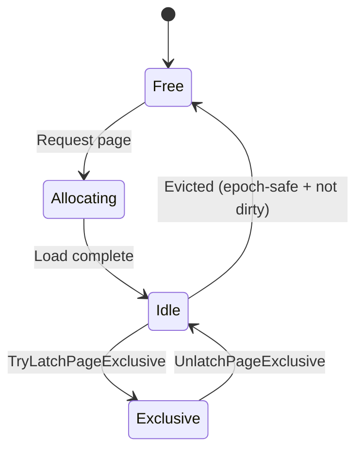

# Component 3: Storage Engine

> Persistence layer providing memory-mapped file I/O, page caching, and segment abstractions for all data storage in Typhon.

---

## Overview

The Storage Engine is the foundation for all persistent data in Typhon. It provides a sophisticated page-based abstraction over memory-mapped files, with a clock-sweep cache, async I/O, and multiple segment types for different data patterns.

<a href="../assets/typhon-storage-overview.svg">
  
</a>
<sub>D2 source: <code>assets/src/typhon-storage-overview.d2</code> — open <code>assets/viewer.html</code> for interactive pan-zoom</sub>

---

## Sub-Components

| # | Name | Purpose | Status |
|---|------|---------|--------|
| **3.1** | [PagedMMF](#31-pagedmmf) | Core memory-mapped file manager with page cache | ✅ Solid |
| **3.2** | [ManagedPagedMMF](#32-managedpagedmmf) | Page allocation and occupancy tracking | ✅ Solid |
| **3.3** | [LogicalSegment](#33-logicalsegment) | Multi-page directory abstraction | ✅ Solid |
| **3.4** | [ChunkBasedSegment](#34-chunkbasedsegment) | Fixed-size chunk allocation | ✅ Solid |
| **3.5** | [EpochChunkAccessor](#35-epochchunkaccessor) | Epoch-protected SIMD-optimized chunk cache | ✅ Solid |
| **3.7** | [VariableSizedBufferSegment](#37-variablebuffersegment) | Variable-size buffer storage | ✅ Solid |
| **3.8** | [StringTableSegment](#38-stringtablesegment) | UTF-8 string storage | ✅ Solid |
| **3.9** | [Error Handling](#39-error-handling) | I/O error behavior and recovery | ⚠️ Basic |
| **3.10** | [Compression](#310-compression-future) | Page compression strategy | 📐 Future |

---

## 3.1 PagedMMF

### Purpose

Core memory-mapped file manager handling:
- Page cache with clock-sweep eviction
- Async read/write I/O operations
- Page state machine (Free → Allocating → Idle ↔ Exclusive)
- Epoch-based page eviction protection
- Database file lifecycle (create, open, close)

### Page Cache Architecture

```
┌─────────────────────────────────────────────────────────────────────────┐
│                         Page Cache (Default: 2MB)                       │
├─────────────────────────────────────────────────────────────────────────┤
│  GCHandle-pinned byte array (prevents GC moves)                         │
│  256 pages × 8192 bytes = 2,097,152 bytes                               │
├─────────────────────────────────────────────────────────────────────────┤
│  PageInfo[256] - metadata for each cached page:                         │
│    - State (Free/Allocating/Idle/Exclusive)                             │
│    - FilePageIndex (which file page is cached here)                     │
│    - ClockSweepCounter (0-5, for eviction)                              │
│    - DirtyCounter (pending writes)                                      │
│    - AccessEpoch (epoch tag for eviction protection)                    │
│    - IOReadTask (async load operation)                                  │
└─────────────────────────────────────────────────────────────────────────┘
```

### Clock-Sweep Eviction Algorithm

The cache uses a clock-sweep (second-chance) algorithm:

```csharp
// Simplified algorithm
while (true)
{
    var pageInfo = _pageInfos[_clockHand];

    if (pageInfo.State == PageState.Idle && pageInfo.ClockSweepCounter == 0)
    {
        // Evict this page
        return _clockHand;
    }

    if (pageInfo.ClockSweepCounter > 0)
        pageInfo.ClockSweepCounter--;  // Give it another chance

    _clockHand = (_clockHand + 1) % _cacheSize;
}
```

**Key properties:**
- Counter range: 0-5 (capped to prevent single page dominating)
- Increment on access, decrement on scan
- Page evicted when counter reaches 0

### Clock-Sweep Behavioral Details

**Scan Frequency:**
Clock-sweep runs **on-demand** — triggered only when a new page slot is needed and no free slots exist. Each `GetOrLoadPage` call:
1. First checks for an existing free slot (O(1) lookup)
2. Only invokes clock-sweep when cache is full and page isn't already cached

This lazy approach means hot workloads fitting within cache size never pay clock-sweep overhead.

**Hot Page Protection:**
The counter cap of 5 means a frequently-accessed page can "survive" up to 5 complete clock sweeps before becoming evictable. This provides **temporal locality protection** without manual priority tuning.

```
Page access pattern → Counter behavior:
  Single access      → Counter = 1 (survives 1 sweep)
  Frequent access    → Counter = 5 (survives 5 sweeps)
  Long idle period   → Counter decrements each sweep → eventually evictable
```

**No Priority Classes:**
Unlike some databases (e.g., SQL Server's buffer pool with dedicated slots for system pages), Typhon treats all pages equally. This simplicity works well for game workloads where access patterns are more uniform — B+Tree root pages naturally stay hot via repeated access, not artificial priority.

**Fallback Loop:**
If the first pass finds no evictable pages (all counters > 0), a second pass ignores the counter and evicts the first `Idle` page encountered. This prevents deadlock but indicates cache pressure.

**Comparison with Other Databases:**

| Database | Algorithm | Hot Page Protection |
|----------|-----------|---------------------|
| **Typhon** | Clock-sweep, counter 0-5 | Counter cap, survives N sweeps |
| **PostgreSQL** | Clock-sweep, usage count | Similar approach, different cap |
| **SQL Server** | LRU with buffer pool extensions | Hot pages in dedicated region |
| **MySQL InnoDB** | Young/old sublist LRU | Midpoint insertion, age tracking |

### Page States



**4 states** (simplified from the original 6 by removing `Shared` and `IdleAndDirty`):

| State | Meaning |
|-------|---------|
| `Free` | Page slot not allocated in cache |
| `Allocating` | Being loaded from disk |
| `Idle` | Loaded in cache, protected from eviction by epoch tag and/or `DirtyCounter > 0` |
| `Exclusive` | Exclusively latched for writes |

**Eviction predicate:** A page in `Idle` state can be evicted only when:
```
(DirtyCounter == 0) AND (AccessEpoch < MinActiveEpoch)
```

The `AccessEpoch` is stamped when a page is accessed via `RequestPageEpoch()`. Pages accessed within an active `EpochGuard` scope cannot be evicted — their epoch tag is >= the minimum active epoch across all threads. This replaces the old per-page reference counting (`ConcurrentSharedCounter`).

Dirty pages (those with `DirtyCounter > 0`) stay in `Idle` state and are tracked by the dirty counter rather than a separate `IdleAndDirty` state. They cannot be evicted until flushed to disk.

### Async I/O

```csharp
// Reads use RandomAccess.ReadAsync
var task = RandomAccess.ReadAsync(_fileHandle, buffer, pageOffset);
pageInfo.IOReadTask = task;

// RequestPageEpoch waits for I/O completion inline
var ioTask = pi.IOReadTask;
if (ioTask != null && !ioTask.IsCompletedSuccessfully)
{
    ioTask.GetAwaiter().GetResult();
    pi.ResetIOCompletionTask();
}

// Writes batch contiguous pages
foreach (var contiguousGroup in changeSet.GroupContiguous())
{
    await RandomAccess.WriteAsync(_fileHandle, groupBuffer, groupOffset);
}
```

### Code Location

`src/Typhon.Engine/Persistence Layer/PagedMMF.cs` (~1,035 lines)

---

## 3.2 ManagedPagedMMF

### Purpose

Extends PagedMMF with page allocation management:
- Occupancy bitmap tracking (which pages are in use)
- Root file header management
- Higher-level allocation APIs

### File Layout

```
┌─────────────────────────────────────────────────────────────────────────┐
│ Page 0: Root File Header                                                │
├─────────────────────────────────────────────────────────────────────────┤
│   Offset 0:    RootFileHeader (192 bytes)                               │
│   Offset 192:  Reserved (8000 bytes)                                    │
├─────────────────────────────────────────────────────────────────────────┤
│ Pages 1-3: Occupancy Bitmap Segment                                     │
├─────────────────────────────────────────────────────────────────────────┤
│   Tracks which pages are allocated/free                                 │
│   3-level hierarchy for fast allocation                                 │
├─────────────────────────────────────────────────────────────────────────┤
│ Pages 4+: User Data Pages                                               │
├─────────────────────────────────────────────────────────────────────────┤
│   Segments, chunks, indexes, components...                              │
└─────────────────────────────────────────────────────────────────────────┘
```

### API

```csharp
public class ManagedPagedMMF : PagedMMF
{
    // Allocate a new page
    public int AllocatePage();

    // Free a page
    public void FreePage(int pageIndex);

    // Check if page is allocated
    public bool IsPageAllocated(int pageIndex);

    // Access root header
    public ref RootFileHeader RootHeader { get; }
}
```

### Code Location

`src/Typhon.Engine/Persistence Layer/ManagedPagedMMF.cs` (~378 lines)

---

## 3.3 LogicalSegment

### Purpose

Multi-page abstraction that presents a contiguous index space across multiple physical pages. Uses a directory structure to map logical indices to physical pages.

### Directory Structure

```
┌─────────────────────────────────────────────────────────────────────────┐
│ Root Page (First page of segment)                                        │
├─────────────────────────────────────────────────────────────────────────┤
│   Index Section: 500 entries × 4 bytes = 2000 bytes                     │
│   Data Section:  6000 bytes available                                   │
├─────────────────────────────────────────────────────────────────────────┤
│ Overflow Pages (When > 500 indices needed)                               │
├─────────────────────────────────────────────────────────────────────────┤
│   Index Section: 2000 entries × 4 bytes = 8000 bytes                    │
│   Data Section:  0 bytes (indices only)                                 │
└─────────────────────────────────────────────────────────────────────────┘
```

### Usage Pattern

```csharp
// Create segment
var segment = new LogicalSegment(mmf, segmentIndex);

// Get page by logical index
var pageAccessor = segment.GetPage(logicalIndex);

// Grow segment (add new page)
var newPageIndex = segment.GrowSegment();
```

### Code Location

`src/Typhon.Engine/Persistence Layer/LogicalSegment.cs` (~431 lines)

---

## 3.4 ChunkBasedSegment

### Purpose

Extends LogicalSegment to provide fixed-size chunk allocation within pages. Uses 3-level occupancy bitmaps for fast allocation.

### Chunk Layout

```
┌─────────────────────────────────────────────────────────────────────────┐
│ Page Structure                                                           │
├─────────────────────────────────────────────────────────────────────────┤
│   PageBaseHeader:  64 bytes                                             │
│   PageMetadata:    128 bytes (occupancy bitmaps)                        │
│   PageRawData:     8000 bytes (chunks)                                  │
├─────────────────────────────────────────────────────────────────────────┤
│ Chunk Allocation                                                         │
├─────────────────────────────────────────────────────────────────────────┤
│   Chunks per page = 8000 / chunkSize                                    │
│   Example: 64-byte chunks = 125 chunks per page                         │
└─────────────────────────────────────────────────────────────────────────┘
```

### Magic Multiplier Fast Division

Computing `chunkIndex / chunksPerPage` is expensive (~20-80 cycles). The segment uses a magic multiplier trick:

```csharp
// Precomputed at segment creation
_divMagic = (0x1_0000_0000UL + (uint)_otherChunkCount - 1) / (uint)_otherChunkCount;

// Fast division (~3-4 cycles)
public (int pageIndex, int slotIndex) GetChunkLocation(int chunkIndex)
{
    var adjusted = chunkIndex - _rootChunkCount;
    var pageIndex = (int)((adjusted * _divMagic) >> 32);
    var slotIndex = adjusted - (pageIndex * _otherChunkCount);
    return (pageIndex + 1, slotIndex);
}
```

### Auto-Growth

When `AllocateChunk()` or `AllocateChunks()` cannot satisfy a request (bitmap full), the segment **automatically grows** by allocating new pages from the `ManagedPagedMMF`. Growth continues until the segment reaches its maximum page count. When auto-growth is exhausted (maximum pages reached), the allocation methods throw `ResourceExhaustedException` with the segment's current and maximum chunk counts. See [10-errors.md §10.1](10-errors.md#101-exception-hierarchy) for the exception hierarchy.

### Code Location

`src/Typhon.Engine/Storage/Segments/ChunkBasedSegment.cs`

---

## 3.5 EpochChunkAccessor

### Purpose

Epoch-protected, SIMD-optimized chunk accessor with 16-slot cache. This is a **critical hot path** component that replaced the legacy `PageAccessor` and `ChunkAccessor` types. It uses epoch-based page protection instead of per-page reference counting.

**Key design changes from the legacy types:**
- No `PageAccessor` intermediary — raw pointer arithmetic via `GetMemPageAddress()`
- No per-slot pinning/unpinning — epoch scope protects all accessed pages
- No "all slots pinned" failure mode — clock-hand eviction always succeeds
- SOA layout (~280 bytes) instead of interleaved AOS layout (~1KB)
- Must always be passed by **ref** (enforced by Roslyn analyzer TYPHON001)

### Three-Tier Lookup

1. **MRU Check** — Most recently used slot (single comparison, ~3-4 cycles)
2. **SIMD Search** — Vector256 parallel search of all 16 slots (~10-15 cycles)
3. **Clock-Hand Eviction** — Replace next non-MRU slot on miss (no pinning to skip)

### SOA Cache Structure

```csharp
// Hot: SIMD searchable page indices (1 cache line)
private fixed int _pageIndices[16];           // 64 bytes

// Hot: raw data addresses for direct pointer arithmetic (2 cache lines)
private fixed long _baseAddresses[16];        // 128 bytes

// Warm: memory page indices for ChangeSet dirty tracking (1 cache line)
private fixed int _memPageIndices[16];        // 64 bytes

// Control: dirty bitmask, clock hand, MRU slot, used count
private ushort _dirtyFlags;                   // 2 bytes (1 bit per slot)
```

### SIMD Search Implementation

```csharp
fixed (int* indices = _pageIndices)
{
    var target = Vector256.Create(pageIndex);

    // Search first 8 slots
    var v0 = Vector256.Load(indices);
    var mask0 = Vector256.Equals(v0, target).ExtractMostSignificantBits();
    if (mask0 != 0) return BitOperations.TrailingZeroCount(mask0);

    // Search second 8 slots
    var v1 = Vector256.Load(indices + 8);
    var mask1 = Vector256.Equals(v1, target).ExtractMostSignificantBits();
    if (mask1 != 0) return 8 + BitOperations.TrailingZeroCount(mask1);
}
```

### Usage

```csharp
// Always within an EpochGuard scope (managed by Transaction)
var guard = EpochGuard.Enter(epochManager);

// Create accessor
var accessor = segment.CreateEpochChunkAccessor(changeSet);

// Read chunk (direct reference — no handle/pin needed)
ref var node = ref accessor.GetChunk<BTreeNode>(chunkId);

// Write chunk (marks page dirty)
ref var data = ref accessor.GetChunk<MyComponent>(chunkId, dirty: true);

// Exclusive latch for writes (decoupled from lifetime)
pagedMMF.TryLatchPageExclusive(memPageIndex);
// ... write ...
pagedMMF.UnlatchPageExclusive(memPageIndex);

// Flush dirty pages to ChangeSet
accessor.CommitChanges();
accessor.Dispose();  // Final dirty flush, no page release needed

guard.Dispose();  // Exit epoch scope, advance global epoch
```

### Performance

| Operation | Cycles (Approx) |
|-----------|-----------------|
| MRU hit | 3-4 |
| SIMD hit | 10-15 |
| Cache miss + load | ~25 (excl. I/O) |
| Epoch enter/exit | ~5ns |

### Code Location

`src/Typhon.Engine/Storage/Segments/EpochChunkAccessor.cs` (~350 lines)

---

## 3.7 VariableSizedBufferSegment

### Purpose

Stores variable-size buffers of uniform element types. Used for multi-value index entries and other variable-length data.

### Features

- Linked chunk chains for buffers exceeding chunk size
- Reference counting for shared buffers
- Lazy cleanup of freed chunks
- Automatic chunk deallocation

### Code Location

`src/Typhon.Engine/Persistence Layer/VariableSizedBufferSegment.cs` (~388 lines)

---

## 3.8 StringTableSegment

### Purpose

UTF-8 string storage across chunks using linked chunks for long strings.

### Features

- Store/load/delete operations
- Linked chunks for strings exceeding chunk size
- Efficient encoding/decoding

### Code Location

`src/Typhon.Engine/Persistence Layer/StringTableSegment.cs` (~111 lines)

---

## 3.9 Error Handling

### Current Behavior

The storage engine provides **basic error propagation** without sophisticated retry or recovery logic:

| Failure Type | Current Behavior | Impact |
|--------------|------------------|--------|
| **Read failure** | `IOException` propagated to caller | Transaction aborts |
| **Write failure** | `IOException` propagated to caller | Transaction aborts |
| **Partial write** | WAL-based recovery repairs on restart | Data consistency preserved |
| **Disk full** | `IOException` propagated | Transaction aborts |
| **File corruption** | CRC32C mismatch detected on read | Page rejected (see §3.10) |

**Why No Retry Logic:**
For game/simulation workloads, I/O failures are **rare and typically unrecoverable** (disk failure, NVMe queue full). Retrying adds latency to the happy path without improving reliability. The WAL provides the safety net — on restart, uncommitted changes are rolled back, committed changes are replayed.

### Partial Write Protection

The WAL design (see [06-durability.md §6.1](06-durability.md#61-wal-write-ahead-log)) ensures data integrity:

1. **WAL record written with FUA** — survives crash before data page write
2. **Data page written** — may be torn if crash occurs mid-write
3. **On recovery** — WAL replay detects torn pages via CRC32C, re-applies clean data

This "write-ahead" pattern means partial writes to data pages are **always recoverable** from the WAL.

### Future Enhancements

| Enhancement | Description | When Needed |
|-------------|-------------|-------------|
| **Retry with backoff** | Exponential backoff for transient errors | Cloud/network storage |
| **Read-only escalation** | Switch to read-only mode on persistent write failures | High-availability deployments |
| **Redundant writes** | Write to multiple storage targets | Mission-critical systems |
| **Bad block tracking** | Maintain list of known-bad sectors | Long-running deployments |

---

## 3.10 Compression (Future)

### Current Status: No Compression

Typhon v1.0 does **not compress data** — pages are stored as-is on disk. This is a deliberate decision for the initial release:

**Why No Compression (Yet):**

| Factor | Compression Impact | Decision |
|--------|-------------------|----------|
| **Read latency** | +1-5µs per page (LZ4 decompression) | Conflicts with microsecond target |
| **Write latency** | +2-10µs per page (LZ4 compression) | Acceptable for batch workloads |
| **Complexity** | Additional code paths, edge cases | Prioritize correctness first |
| **Game workloads** | Small components (~64-256 bytes) | Low compression ratio expected |

For game/simulation components (position, velocity, health), the data is already compact and entropy is high — compression ratios would be poor (1.1-1.3x) while adding measurable latency.

### Architectural Fit

When compression is added, it will slot between `PagedMMF` and the OS file layer:

```
┌─────────────────────────────────────────────────────────────────┐
│                    ChunkBasedSegment                            │
│                         ↓                                       │
│                    PagedMMF (page cache)                        │
│                         ↓                                       │
│              ┌─────────────────────────┐                        │
│              │  CompressionAdapter     │  ← Future layer        │
│              │  (LZ4 compress/decomp)  │                        │
│              └─────────────────────────┘                        │
│                         ↓                                       │
│                  OS File I/O                                    │
└─────────────────────────────────────────────────────────────────┘
```

The adapter would:
1. Compress pages before writing to disk
2. Decompress pages after reading from disk
3. Maintain mapping of logical page → compressed block(s)

### Where Compression Makes Sense

| Use Case | Recommended | Rationale |
|----------|-------------|-----------|
| **Real-time game state** | ❌ No | Latency-sensitive, poor ratio |
| **Cold historical data** | ✅ Yes | Rarely accessed, storage savings |
| **Backups / snapshots** | ✅ Yes | Offline operation, size matters |
| **String-heavy tables** | ✅ Yes | High compression ratio (3-5x) |
| **B+Tree key prefixes** | ✅ Yes | Delta encoding for sorted keys |

### Reference: Other Databases

| Database | Compression Strategy |
|----------|---------------------|
| **RocksDB** | Per-block LZ4/Snappy/Zstd; configurable per column family |
| **SQL Server** | Row-level and page-level compression; CPU/size trade-off |
| **PostgreSQL** | TOAST for large values; no native page compression |
| **SQLite** | No built-in compression; VFS extension possible |

**Key Insight:** Databases targeting OLTP (SQL Server, PostgreSQL) typically compress cold/large data only. Typhon will follow this pattern — keep hot data uncompressed, compress during archival/backup.

---

## Page Structure

All pages share a common structure:

```
┌─────────────────────────────────────────────────────────────────────────┐
│                        Page (8192 bytes total)                           │
├─────────────────────────────────────────────────────────────────────────┤
│ Offset 0-63:     PageBaseHeader (64 bytes)                              │
│   - Flags, BlockType, FormatRevision                                    │
│   - ChangeRevision (incremented on each write)                          │
│   - PageIndex (for validation)                                          │
│   - CRC32C (checksum of page content, verified on read)                 │
├─────────────────────────────────────────────────────────────────────────┤
│ Offset 64-191:   PageMetadata (128 bytes)                               │
│   - Occupancy bitmaps for chunk-based segments                          │
│   - Segment-specific metadata                                           │
├─────────────────────────────────────────────────────────────────────────┤
│ Offset 192-8191: PageRawData (8000 bytes)                               │
│   - Actual payload data                                                 │
│   - Segment type determines interpretation                              │
└─────────────────────────────────────────────────────────────────────────┘
```

---

## Configuration

### PagedMMFOptions

```csharp
public class PagedMMFOptions
{
    // Cache size (default: 256 pages = 2MB)
    public int PageCacheSize { get; set; } = 256;

    // Enable async I/O (default: true)
    public bool UseAsyncIO { get; set; } = true;

    // File creation options
    public FileMode FileMode { get; set; } = FileMode.OpenOrCreate;
}
```

---

## Key Optimizations

| Optimization | Description | Impact |
|--------------|-------------|--------|
| **GCHandle Pinning** | Page cache never moves in memory | Enables safe pointer arithmetic |
| **Epoch Protection** | 2 obligations per transaction instead of 2N | Eliminates per-page ref-count overhead |
| **Clock-Sweep** | Adaptive cache eviction | Prevents thrashing, respects access patterns |
| **Magic Multiplier** | Replace division with multiply+shift | 3-4 cycles vs 20-80 cycles |
| **SIMD Search** | Vector256 parallel slot comparison | 16 comparisons in ~2 instructions |
| **SOA Layout** | Cache-line-aligned accessor fields | 3 cache lines vs 5+ for hot path |
| **Contiguous Writes** | Batch adjacent dirty pages | Reduces I/O operations |
| **Lazy Dirty Tracking** | Defer writes until eviction | Reduces unnecessary I/O |
| **Sequential Allocation** | Prefer adjacent memory pages | Better cache locality |

---

## Testing

Tests located in `test/Typhon.Engine.Tests/`:

| Test Class | Focus |
|------------|-------|
| `PagedMMFTests` | Cache eviction, I/O operations, epoch-based state transitions |
| `ManagedPagedMMFTests` | Page allocation, occupancy tracking |
| `LogicalSegmentTests` | Directory structure, overflow handling |
| `ChunkBasedSegmentTests` | Chunk allocation, bitmap operations |
| `EpochChunkAccessorTests` | SIMD lookup, dirty tracking, epoch protection |
| `EpochPageCacheTests` | Epoch-based eviction, dirty page handling |
| `EpochManagerTests` | Scope management, thread registry, MinActiveEpoch |

---

## Current State

The Storage Engine is **mature and well-optimized**. Key areas:

| Aspect | Status | Notes |
|--------|--------|-------|
| Core I/O | ✅ Solid | Memory-mapped files, async read/write |
| Page Cache | ✅ Solid | Clock-sweep, configurable size |
| Segments | ✅ Solid | Logical, chunk-based, variable, string |
| Concurrency | ✅ Solid | Epoch-based protection, exclusive page latching |
| Performance | ✅ Solid | SIMD, magic multiplier, lazy dirty |
| Error Handling | ⚠️ Minimal | Basic corruption detection only |
| Page Checksums | 📐 Designed | CRC32C in PageBaseHeader, verified on read. See [06-durability.md §6.6](06-durability.md#66-checkpoint-manager) |
| Recovery | 📐 Designed | WAL-based crash recovery designed in [06-durability.md §6.7](06-durability.md#67-crash-recovery) |

### Future Improvements

1. **WAL Integration** — Designed in [06-durability.md §6.1](06-durability.md#61-wal-write-ahead-log). The WAL Writer thread will consume from an MPSC ring buffer and issue FUA writes to a dedicated WAL file.
2. **Checkpointing** — Designed in [06-durability.md §6.6](06-durability.md#66-checkpoint-manager). The Checkpoint Manager is the sole owner of data page fsync — no other component fsyncs the data file.
3. **CRC32C Page Checksums** — PageBaseHeader will include a CRC32C field computed over page content, verified on every read. Uses hardware-accelerated CRC32C intrinsics (see [11-utilities.md P.1](11-utilities.md#p1-crc32c)).
4. **Metrics** — Page hit/miss ratios, I/O latencies, dirty page count. See [09-observability.md](09-observability.md) for planned metrics.

---

## Design Decisions

| Question | Decision | Rationale |
|----------|----------|-----------|
| **Page size** | 8192 bytes | Balance between overhead and granularity; matches common OS page sizes |
| **Cache algorithm** | Clock-sweep | Simple, effective, low overhead; adapts to access patterns |
| **Counter cap** | 5 | Prevents single hot page from dominating cache |
| **Epoch-based protection** | Yes | Replaces per-page ref-counting; 2 obligations per tx vs 2N. See [ADR-033](../adr/033-epoch-based-page-eviction.md) |
| **SIMD in hot path** | Yes | EpochChunkAccessor is called millions of times; worth the complexity |
| **Async I/O** | Yes | Non-blocking reads improve throughput under load |
| **Pinned memory** | Yes | Required for safe pointer arithmetic in unsafe code |
