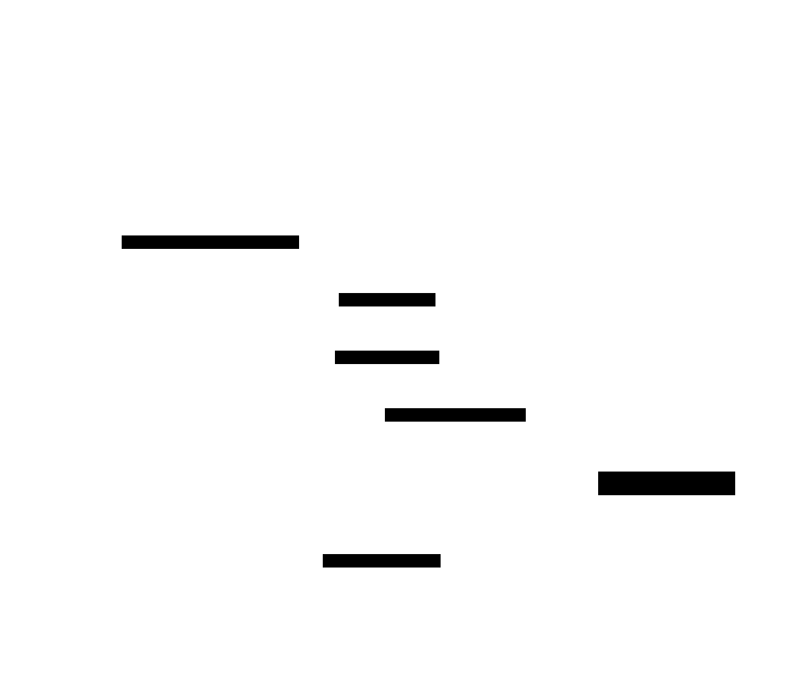
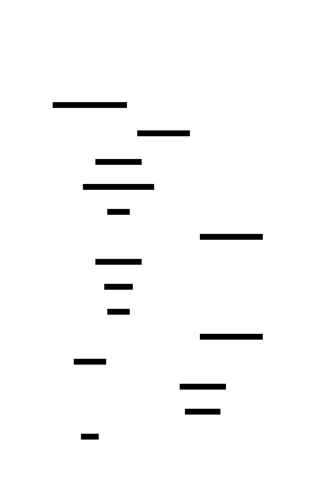
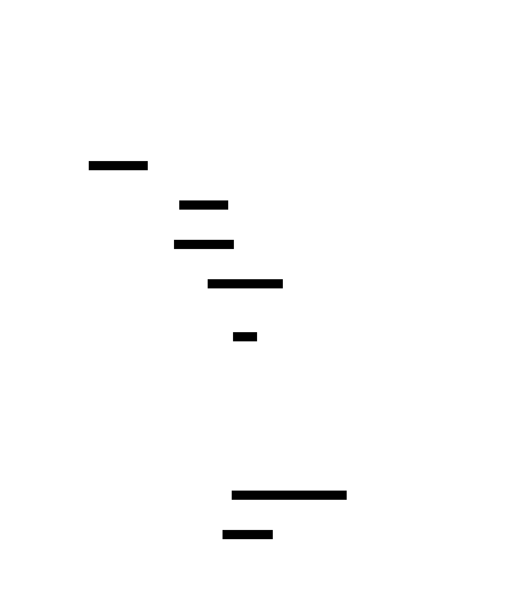

# Component 4: Data Engine

> Core database logic providing schema management, component tables, B+Tree indexes, MVCC transactions, and revision chains.

---

## Overview

The Data Engine is the heart of Typhon, implementing the ECS-inspired data model with full ACID transaction support. It builds on the Storage Engine to provide typed component storage, automatic indexing, and multi-version concurrency control.

The API follows a three-tier hierarchy: **DatabaseEngine** (setup/schema) → **UnitOfWork** (runtime/durability) → **Transaction** (MVCC operations). This ensures explicit durability decisions and clean separation of concerns.

<a href="../assets/typhon-data-engine-overview.svg">
  
</a>
<sub>🔍 Click to open full size — D2 source: <code>assets/src/typhon-data-engine-overview.d2</code> — open <code>assets/viewer.html</code> for interactive pan-zoom</sub>

---

## Sub-Components

| # | Name | Purpose | Status |
|---|------|---------|--------|
| **4.1** | [DatabaseEngine](#41-databaseengine) | Top-level setup, component registration | ✅ Solid |
| **4.2** | [UnitOfWork](#42-unitofwork) | Durability boundary, transaction factory | 📐 Designed |
| **4.3** | [Transaction](#43-transaction) | MVCC operations, snapshot isolation | ✅ Solid |
| **4.4** | [TransactionChain](#44-transactionchain) | Active transaction tracking, pooling | ✅ Solid |
| **4.5** | [ComponentTable](#45-componenttable) | Per-component storage and indexes | ✅ Solid |
| **4.6** | [Revision Chains](#46-revision-chains) | MVCC history management | ✅ Solid |
| **4.7** | [B+Tree Indexes](#47-btree-indexes) | Fast key-value lookups | ✅ Solid |
| **4.8** | [Schema System](#48-schema-system) | Component/field/index metadata | ✅ Solid |

---

## 4.1 DatabaseEngine

### Purpose

Top-level API for **setup and configuration**:
- Registers component types and creates ComponentTables
- Owns the TransactionChain and ManagedPagedMMF
- Manages system schema persistence
- Creates UnitOfWork instances for runtime operations

### API

```csharp
public class DatabaseEngine : IDisposable
{
    // Component registration (startup only)
    public void RegisterComponent<T>() where T : unmanaged;

    // Runtime: create UnitOfWork for transactional work
    public UnitOfWork CreateUnitOfWork(
        TimeSpan timeout,
        DurabilityMode durability = DurabilityMode.Deferred);

    // Primary key generation
    public long GeneratePrimaryKey();

    // Access internals
    public DatabaseDefinitions DBD { get; }
    public ManagedPagedMMF MMF { get; }
    public TransactionChain TransactionChain { get; }
}
```

### Component Registration Flow

<a href="../assets/typhon-data-registration-flow.svg">
  
</a>
<sub>D2 source: <code>assets/src/typhon-data-registration-flow.d2</code></sub>

### Code Location

`src/Typhon.Engine/Database Engine/DatabaseEngine.cs`

---

## 4.2 UnitOfWork

### Purpose

The **durability boundary** for all transactional work. A UoW:
- Defines how durable its transactions' commits are
- Creates transactions (which inherit the UoW's epoch)
- Controls when buffered WAL records are fsynced
- Owns an epoch identifier for crash recovery grouping

All transactions must be created from a UnitOfWork — there is no direct `DatabaseEngine.CreateTransaction()` API.

### API

```csharp
public sealed class UnitOfWork : IDisposable, IAsyncDisposable
{
    public UnitOfWorkContext Context { get; }
    public DurabilityMode DurabilityMode { get; }
    public ushort Epoch { get; }  // Allocated from UoW Registry

    // Factory for transactions
    public Transaction CreateTransaction();

    // Durability control
    public void Flush();              // Block until all buffered WAL records are FUA'd
    public Task FlushAsync();         // Non-blocking variant

    // GroupCommit configuration
    public TimeSpan GroupCommitInterval { get; init; } = TimeSpan.FromMilliseconds(5);

    // Statistics
    public int TransactionCount { get; }
    public int PendingChanges { get; }

    // Lifecycle
    public void Dispose();            // If not flushed → changes are volatile
    public ValueTask DisposeAsync();
}
```

### Durability Modes

| Mode | Behavior | Latency | Use Case |
|------|----------|---------|----------|
| **Deferred** | WAL records buffered; durable only on explicit `Flush()`/`FlushAsync()` | ~0.1–1µs per commit | Game ticks, batch updates |
| **GroupCommit** | WAL writer auto-flushes every N ms | 5–10ms | General server workload |
| **Immediate** | FUA on every `tx.Commit()` | ~15–85µs per commit | Financial, trades, critical state |

```csharp
public enum DurabilityMode
{
    Deferred,     // Flush only on explicit Flush()/FlushAsync()
    GroupCommit,  // WAL writer auto-flushes every N ms
    Immediate     // FUA on every tx.Commit()
}
```

### DurabilityOverride

Individual transactions can **escalate** (but never downgrade) their durability:

```csharp
public enum DurabilityOverride
{
    Default,    // Use UoW's DurabilityMode
    Immediate   // Force FUA for this specific commit
}
```

### UoW Lifecycle

<a href="../assets/typhon-data-uow-lifecycle.svg">
  
</a>
<sub>D2 source: <code>assets/src/typhon-data-uow-lifecycle.d2</code></sub>

> **Key rule**: If a UoW is disposed without flushing, its changes exist in the page cache (visible to subsequent reads) but are **volatile** — a crash will void the epoch and roll back all changes. See [06-durability.md §6.7](06-durability.md#67-crash-recovery) for recovery semantics.

### Cross-References

- Durability mode details and guarantees → [02-execution.md §2.3](02-execution.md#23-durability-modes)
- WAL record format and ring buffer → [06-durability.md §6.1](06-durability.md#61-wal-write-ahead-log)
- Epoch visibility rules → [06-durability.md §6.8](06-durability.md#68-epoch-visibility)

---

## 4.3 Transaction

### Purpose

Implements MVCC snapshot isolation with optimistic concurrency control:
- Each transaction sees a consistent snapshot from its creation time
- Changes are cached locally until commit
- Conflict detection at commit time
- Supports read-your-own-writes

### Transaction Sequence Number (TSN)

Every transaction has a unique 48-bit TSN:

```csharp
public readonly struct TSN
{
    // 48-bit value, incremented atomically per transaction
    // At 1M transactions/second, lasts ~8,900 years
    private readonly long _value;
}
```

### Operations

```csharp
public class Transaction : IDisposable
{
    // Create entities (1-3 components)
    public long CreateEntity<T>(ref T component);
    public long CreateEntity<T1, T2>(ref T1 c1, ref T2 c2);
    public long CreateEntity<T1, T2, T3>(ref T1 c1, ref T2 c2, ref T3 c3);

    // Attach additional component to existing entity
    public void CreateComponent<T>(long entityId, ref T component);

    // Read
    public bool ReadEntity<T>(long entityId, out T component);

    // Update
    public void UpdateEntity<T>(long entityId, T component);

    // Delete
    public bool DeleteEntity<T>(long entityId);

    // Index access
    public IIndex<TKey> GetIndex<TComponent, TKey>(string fieldName);

    // Commit with optional durability escalation
    public bool Commit(DurabilityOverride durability = DurabilityOverride.Default);

    // Rollback
    public void Rollback();

    // Wait for this transaction's WAL record to be durable (GroupCommit users)
    public Task WaitForDurability();
}
```

### Commit Path

What happens inside `tx.Commit()`:

```csharp
public bool Commit(DurabilityOverride durability = DurabilityOverride.Default)
{
    // 1. MVCC conflict detection
    if (!ResolveConflicts()) return false;

    // 2. Apply cached changes to ComponentTable
    //    (ComponentTable stamps UowEpoch on each revision — see §4.5)
    ApplyChangesToStorage();

    // 3. Serialize WAL record to ring buffer (~100-500ns)
    var lsn = _walWriter.SerializeToBuffer(BuildWalRecord());

    // 4. Durability decision
    var effectiveMode = durability == DurabilityOverride.Default
        ? _uow.DurabilityMode
        : DurabilityMode.Immediate;  // Override can only escalate

    if (effectiveMode == DurabilityMode.Immediate)
    {
        _walWriter.SignalFlush();     // Wake WAL writer thread
        _walWriter.WaitForLSN(lsn);  // Block until FUA complete
    }

    return true;
}
```

> **Important**: `tx.Commit()` never fsyncs data pages. Data pages are written to the OS page cache (via `WriteAsync`) and persisted later by the Checkpoint Manager. The WAL is the source of truth for durability. See [06-durability.md — Persistence Map](06-durability.md#persistence-map-two-pipelines-to-disk) for the full picture.

### Snapshot Isolation

<a href="../assets/typhon-data-snapshot-isolation.svg">
  
</a>
<sub>D2 source: <code>assets/src/typhon-data-snapshot-isolation.d2</code></sub>

### Conflict Detection

At commit time, the transaction checks if any component it modified was also modified by another committed transaction:

```csharp
// Conflict detection
if (revInfo.LastCommitRevisionIndex >= curRevisionIndex)
{
    // Another transaction committed since we read
    // Options:
    // 1. Default: Last write wins (copy our data forward)
    // 2. Custom: Call ConcurrencyConflictHandler
}
```

### Code Location

`src/Typhon.Engine/Database Engine/Transaction.cs` (~1,540 lines)

---

## 4.4 TransactionChain

### Purpose

Doubly-linked list managing all active transactions:
- Tracks Head (newest) and Tail (oldest) transactions
- Maintains MinTSN for garbage collection
- Implements transaction pooling (max 16)

### Structure

```
┌─────────────────────────────────────────────────────────────────────────┐
│                        TransactionChain                                 │
├─────────────────────────────────────────────────────────────────────────┤
│   Head ──────────────────────────────────────────────────────── Tail    │
│    │                                                              │     │
│    ▼                                                              ▼     │
│  [T100] ◄──► [T99] ◄──► [T98] ◄──► [T97] ◄──► [T96] ◄──► [T95]          │
│  newest                                                      oldest     │
├─────────────────────────────────────────────────────────────────────────┤
│   MinTSN = 95 (for GC: revisions with TSN < 95 can be cleaned)          │
│   Pool: [T94, T93, T92, ...] (up to 16 reusable transactions)           │
└─────────────────────────────────────────────────────────────────────────┘
```

### Garbage Collection

When the oldest transaction completes:

```csharp
// Transaction disposal triggers cleanup
public void Dispose()
{
    if (this == _chain.Tail)
    {
        // I'm the oldest - trigger GC
        CleanUpUnusedEntries();
    }
    _chain.Remove(this);
}
```

### Pool Sizing & Exhaustion

The transaction pool is a `Queue<Transaction>` with `PoolMaxSize = 16`, pre-allocated at `TransactionChain` construction. This is a **soft limit**, not a hard cap:

| Scenario | Behavior |
|----------|----------|
| Pool has available transaction | Dequeue + `Reset()` + `Init()` (~50ns) |
| Pool empty (> 16 concurrent) | `new Transaction()` heap-allocated (~200ns + GC pressure) |
| Transaction disposed, pool < 16 | `Reset()` + Enqueue back to pool |
| Transaction disposed, pool = 16 | Object abandoned to GC |

There is no exhaustion scenario — the pool is purely a performance optimization to avoid Gen0 GC pressure from the `Transaction` object and its internal dictionaries. Under normal game server workloads (1-4 concurrent transactions per thread), the pool is never exceeded.

### Code Location

`src/Typhon.Engine/Database Engine/TransactionChain.cs`

---

## 4.5 ComponentTable

### Purpose

Per-component-type storage managing:
- Component data segments
- Revision chain segments
- Primary key and secondary indexes
- **Epoch stamping**: Each new revision is stamped with the owning UoW's epoch at write time

### Epoch Stamping

When a transaction writes a component (create/update/delete), the ComponentTable stamps the UoW's epoch on the new revision element:

```csharp
// Inside ComponentTable — when creating a new revision
public void WriteRevision(TSN tsn, int componentChunkId, ushort uowEpoch)
{
    var element = new CompRevStorageElement
    {
        ComponentChunkId = componentChunkId,
        TSN = tsn,
        UowEpoch = uowEpoch,      // Stamped here, at write time
        IsolationFlag = true       // Hidden until commit
    };
    AddToRevisionChain(element);
}
```

This means the ComponentTable is UoW-aware — it receives the epoch from the Transaction (which inherits it from its UoW). During crash recovery, the Checkpoint Manager uses epochs to identify which revisions belong to uncommitted UoWs and must be voided.

### Multi-Component Atomicity

A single `tx.Commit()` can modify components across multiple ComponentTables (e.g., update both `Position` and `Health` on the same entity, or move items between two players' `Inventory` components). All changes share:

1. **Same epoch stamp** — all new revisions get the UoW's epoch, so crash recovery voids all-or-nothing
2. **Same TSN** — all revisions are stamped with the committing transaction's TSN, so they become visible atomically to subsequent transactions
3. **Single WAL record** — all cross-table changes are serialized into one WAL record, ensuring all-or-nothing replay on recovery

This provides cross-component atomicity without requiring cross-table locks — the MVCC epoch/TSN mechanism handles visibility, and the single WAL record handles durability. The only serialization point is the MPSC ring buffer slot reservation (one CAS per commit, regardless of how many tables are touched).

### Structure

```
┌─────────────────────────────────────────────────────────────────────────┐
│                    ComponentTable<PlayerComponent>                      │
├─────────────────────────────────────────────────────────────────────────┤
│   DBComponentDefinition ──► Schema metadata                             │
├─────────────────────────────────────────────────────────────────────────┤
│   ComponentSegment (ChunkBasedSegment)                                  │
│     └── Stores actual PlayerComponent structs                           │
├─────────────────────────────────────────────────────────────────────────┤
│   CompRevTableSegment (ChunkBasedSegment)                               │
│     └── Stores revision chains (MVCC history)                           │
├─────────────────────────────────────────────────────────────────────────┤
│   PrimaryKeyIndex (L64BTree)                                            │
│     └── Maps EntityID (long) → RevisionChain first chunk                │
├─────────────────────────────────────────────────────────────────────────┤
│   Secondary Indexes                                                     │
│     ├── L32BTree for int PlayerId field                                 │
│     ├── String64BTree for String64 Name field                           │
│     └── ...                                                             │
└─────────────────────────────────────────────────────────────────────────┘
```

### Storage Sizing

```csharp
// Per-component overhead calculation
ComponentStorageSize = sizeof(T);                    // Raw component
ComponentOverhead = 4 * MultipleIndicesCount;        // Element IDs for multi-value indexes
ComponentTotalSize = ComponentStorageSize + ComponentOverhead;
```

### Code Location

`src/Typhon.Engine/Database Engine/ComponentTable.cs`

---

## 4.6 Revision Chains

### Purpose

Stores MVCC history for each entity-component pair as a circular buffer of revisions.

### Structure

```
┌─────────────────────────────────────────────────────────────────────────┐
│                      CompRevStorageHeader (58 bytes)                    │
├─────────────────────────────────────────────────────────────────────────┤
│   NextChunkId       : Linked list to next chunk                         │
│   FirstItemRevision : Base revision number                              │
│   FirstItemIndex    : Start position in circular buffer                 │
│   ItemCount         : Total revisions in chain                          │
│   ChainLength       : Number of chunks                                  │
│   LastCommitRevision: For conflict detection                            │
│   AccessControlSmall: Thread-safe lock                                  │
├─────────────────────────────────────────────────────────────────────────┤
│                  CompRevStorageElement (12 bytes, Pack=2)               │
├─────────────────────────────────────────────────────────────────────────┤
│   Logical fields:                                                       │
│     ComponentChunkId  : 32 bits (0 = deleted)                           │
│     TSN               : 47 bits (transaction sequence number)           │
│     IsolationFlag     : 1 bit (hides uncommitted revisions)             │
│     UowEpoch          : 16 bits (owning UoW's epoch)                    │
│                                                                         │
│   Physical layout (3 fields, 12 bytes):                                 │
│     _componentChunkId : int    (4 bytes)                                │
│     _packedTickHigh   : uint   (4 bytes) ─┐ TSN high 32 bits            │
│     _packedTickLow    : ushort (2 bytes) ─┘ TSN low 15 bits + 1-bit IF  │
│     _uowEpoch         : ushort (2 bytes)   UoW epoch                    │
└─────────────────────────────────────────────────────────────────────────┘
```

> **Note**: TSN (47 bits) and IsolationFlag (1 bit) are **packed** into the same 6-byte storage (`_packedTickHigh` + `_packedTickLow`). IsolationFlag occupies the lowest bit of `_packedTickLow`; the remaining 15 bits store the low portion of TSN. This keeps the struct at an **even 12 bytes** (was 10 bytes before `UowEpoch` was added). See [ADR-027](../adr/027-even-sized-hot-path-structs.md) for sizing rationale and [06-durability.md §6.7](06-durability.md#67-crash-recovery) for epoch-based recovery.

### Circular Buffer Layout

```
Root Chunk (64 bytes):
  ┌────────────────────────────────────────────────────────────────────┐
  │ Header (58 bytes) │ Element[0] │ ... (remaining space)             │
  └────────────────────────────────────────────────────────────────────┘

Overflow Chunks (64 bytes each):
  ┌────────────────────────────────────────────────────────────────────┐
  │ NextPtr (4 bytes) │ Element[0] │ Element[1] │ ... │ Element[N]     │
  └────────────────────────────────────────────────────────────────────┘
```

### Revision Reading

```csharp
// Find visible revision for transaction
public bool TryGetRevision(long entityId, TSN snapshotTSN, out CompRevStorageElement revision)
{
    foreach (var rev in WalkRevisions(entityId))
    {
        // Skip uncommitted revisions from other transactions
        if (rev.IsolationFlag && rev.TSN != currentTransactionTSN)
            continue;

        // Find most recent revision visible to our snapshot
        if (rev.TSN <= snapshotTSN)
        {
            revision = rev;
            return rev.ComponentChunkId != 0;  // 0 = deleted
        }
    }
    return false;
}
```

### Code Location

`src/Typhon.Engine/Database Engine/ComponentRevision/`

---

## 4.7 B+Tree Indexes

### Purpose

Persistent B+Tree indexes for fast key-value lookups. Four variants optimized for different key sizes.

### Variants

| Variant | Key Size | Keys/Node | Use Cases |
|---------|----------|-----------|-----------|
| **L16BTree** | 16-bit | 8 | Byte, Short, UShort |
| **L32BTree** | 32-bit | 6 | Int, UInt, Float |
| **L64BTree** | 64-bit | 4 | Long, ULong, Double |
| **String64BTree** | 64-byte | 4 | String64 |

### Node Structure (64 bytes, cache-aligned)

```
┌─────────────────────────────────────────────────────────────────────────┐
│                        B+Tree Node (64 bytes)                           │
├─────────────────────────────────────────────────────────────────────────┤
│   Control (4 bytes)                                                     │
│     ├── Ownership bit (lock)                                            │
│     ├── StateFlags (15 bits)                                            │
│     ├── Start (8 bits) - circular buffer start                          │
│     └── Count (8 bits) - number of entries                              │
├─────────────────────────────────────────────────────────────────────────┤
│   PrevChunk (4 bytes) - doubly-linked sibling                           │
│   NextChunk (4 bytes) - doubly-linked sibling                           │
│   LeftValue (4 bytes) - leftmost child for internal nodes               │
├─────────────────────────────────────────────────────────────────────────┤
│   Keys[N] - sorted key array                                            │
│   Values[N] - parallel value array (chunk IDs or buffer refs)           │
└─────────────────────────────────────────────────────────────────────────┘
```

### Single vs Multiple

**Single-Value Index** (unique):
```csharp
[Index]  // One entity per key value
public int PlayerId;

// Storage: Key → ChunkId directly
```

**Multi-Value Index** (non-unique):
```csharp
[Index(AllowMultiple = true)]  // Multiple entities per key value
public float PositionX;

// Storage: Key → BufferRef → VariableSizedBuffer of ChunkIds
```

### Operations

```csharp
public interface IBTree<TKey>
{
    // Lookup
    bool TryGet(TKey key, out int value);

    // Iteration
    IEnumerable<(TKey Key, int Value)> Enumerate();

    // Modification (internal, called by Transaction)
    void Insert(TKey key, int value);
    void Remove(TKey key);
}
```

### Index Maintenance Timing (Known Limitation)

Secondary indexes are currently updated **during the commit path**, not during the transaction body. This creates a gap in "read-your-own-writes" semantics:

```
tx.CreateEntity<Player>(ref player);       // Player added to component segment
                                            // Index NOT yet updated

tx.GetIndex<Player, int>("PlayerId")       // Will NOT find the new entity
    .TryGet(player.PlayerId, out var id);  // Returns false ← SURPRISING

tx.Commit();                                // Index updated HERE
                                            // (B+Tree insert for each indexed field)
```

**This is a limitation, not a design choice.** Users reasonably expect that index queries within a transaction reflect their own uncommitted changes — the same way component reads do via the transaction cache.

**Current workaround:** Track entity IDs directly rather than relying on index lookups for just-created entities.

### Planned Fix: Transaction-Local Index Overlay

The recommended solution is a **per-transaction index overlay** that shadows the persistent B+Tree:

```
┌───────────────────────────────────────────────────────────────────┐
│  tx.GetIndex<Player, int>("PlayerId").Get(123)                    │
│                         │                                         │
│                         ▼                                         │
│  ┌─────────────────────────────────────────────────────────────┐  │
│  │  TransactionIndexOverlay (per-tx, in-memory)                │  │
│  │    _additions: { 123 → [entityId_A, entityId_B] }           │  │
│  │    _removals:  { (456, entityId_C) }                        │  │
│  └─────────────────────────────────────────────────────────────┘  │
│                         │                                         │
│                         ▼  merge results                          │
│  ┌─────────────────────────────────────────────────────────────┐  │
│  │  Persistent B+Tree (committed data only)                    │  │
│  └─────────────────────────────────────────────────────────────┘  │
└───────────────────────────────────────────────────────────────────┘
```

**How it works:**
1. On `CreateEntity` / `UpdateEntity`: record index key changes in the overlay (`_additions`, `_removals`)
2. On `GetIndex().Get(key)`: merge persistent B+Tree results with overlay
3. On `Commit()`: flush overlay to persistent B+Tree (current behavior)
4. On `Rollback()` / `Dispose()`: discard overlay (no cleanup needed)

**Why this approach (vs alternatives):**

| Approach | Rollback Cost | Write Amplification | Read-Your-Own-Writes |
|----------|---------------|---------------------|----------------------|
| **Current (commit-time)** | None | 1 write per field | ❌ No |
| **Immediate B+Tree update** | Must undo B+Tree changes | N writes if field updated N times | ✅ Yes |
| **Overlay (recommended)** | Discard dictionary | 1 write per field | ✅ Yes |

The overlay provides full read-your-own-writes semantics with the same rollback simplicity as the current approach. Memory overhead is minimal — a typical transaction touches 1-100 entities, so the overlay is a small dictionary.

**Implementation notes:**
- For point lookups (90%+ of game workloads): O(1) dictionary lookup + O(log n) B+Tree lookup
- For range queries: overlay must be sorted on-demand, or we accept that range queries only see committed data (document as known limitation)
- Overlay is per-index, not per-transaction, so memory scales with indexed fields touched

This is tracked for post-1.0 implementation. See also the transaction cache for component data (`_componentInfos` in `Transaction.cs`) which already provides this pattern for component reads.

### Code Location

`src/Typhon.Engine/Database Engine/BPTree/`

---

## 4.8 Schema System

### Purpose

Runtime metadata for component definitions, fields, and indexes.

### Attributes

```csharp
// Mark struct as a database component
[Component("Game.Player", revision: 1, allowMultiple: false)]
public struct PlayerComponent
{
    // Mark field for storage
    [Field(fieldId: 1, name: "Health")]
    public float Health;

    // Mark field for indexing
    [Field(fieldId: 2, name: "AccountId")]
    [Index]
    public int AccountId;

    // Multi-value index (non-unique)
    [Field(fieldId: 3, name: "GuildId")]
    [Index(AllowMultiple = true)]
    public int GuildId;
}
```

### DBComponentDefinition

```csharp
public class DBComponentDefinition
{
    public string Name { get; }           // "Game.Player"
    public int Revision { get; }          // 1
    public bool AllowMultiple { get; }    // Can entity have multiple?

    public Dictionary<string, DBFieldDefinition> FieldsByName { get; }

    public int ComponentStorageSize { get; }      // sizeof(T)
    public int ComponentStorageTotalSize { get; } // + overhead
    public int IndicesCount { get; }
    public int MultipleIndicesCount { get; }
}
```

### Field Types

```csharp
public enum FieldType
{
    // Integers
    Boolean, Byte, Short, Int, Long,
    UByte, UShort, UInt, ULong,

    // Floats
    Float, Double,

    // Text
    Char, String64, String1024, String, Variant,

    // Vectors (2D/3D/4D, Float/Double)
    Point2F, Point2D, Point3F, Point3D, Point4F, Point4D,

    // Quaternions
    QuaternionF, QuaternionD,

    // Complex
    Collection, Component
}
```

### Code Location

`src/Typhon.Engine/Database Engine/Schema/`

---

## 4.9 GC & Space Reclamation

### Purpose

MVCC creates multiple revisions for each entity-component pair. Without garbage collection, revision chains would grow unboundedly, consuming disk space and slowing reads (which walk the chain to find the visible revision). GC reclaims storage from revisions that are no longer visible to any active transaction.

### Trigger: MinTSN Advancement

GC is triggered **inline** when the oldest active transaction is disposed. This is the `TransactionChain.Tail` — when it completes, `MinTSN` advances to the next transaction's TSN:

```csharp
// Simplified from TransactionChain.Remove()
if (removed == Tail)
{
    Tail = removed.Next;
    MinTSN = Tail?.TSN ?? 0;

    // Trigger cleanup — revisions older than the new MinTSN are now invisible
    // to ALL remaining transactions (they all have TSN > new MinTSN)
    CleanUpUnusedEntries(nextMinTSN: Tail?.Next?.TSN ?? NextFreeId);
}
```

**Key insight**: Only the transaction that *was* the oldest can trigger GC. All other transaction disposals don't advance MinTSN and therefore can't free any revisions.

### Cleanup Mechanism

`ComponentRevisionManager.CleanUpUnusedEntries()` walks the revision chain and removes entries with `TSN < nextMinTSN`:

```
Before cleanup (MinTSN advanced to 98):
  [TSN=101] → [TSN=100] → [TSN=99] → [TSN=95] → [TSN=90]
                                         ↑              ↑
                                   last visible    can be freed

After cleanup:
  [TSN=101] → [TSN=100] → [TSN=99]
  (TSN=95 and TSN=90 freed — their component chunks returned to allocator)
```

**Process detail:**
1. Walk revision chain from newest to oldest
2. For each revision with `TSN < nextMinTSN`: free its component chunk via the allocator bitmap
3. Build temp buffer (stack-allocated, 64 bytes) with retained revisions only
4. Overwrite first chunk in-place with compacted data
5. Free any overflow chunks that are now empty
6. If ALL revisions are deleted (tombstone passed MinTSN): return `true` to signal entity removal

### Circular Buffer Reclamation

Revision chains use a circular buffer within fixed-size chunks. As old revisions are freed, the buffer effectively shifts:

```
Chunk (64 bytes):
  ┌──────────────────────────────────────────────────────────────────┐
  │ Header │ [freed] [freed] [Rev99] [Rev100] [Rev101] [empty]       │
  └──────────────────────────────────────────────────────────────────┘
                              ↑ FirstItemIndex advances here

After compaction:
  ┌──────────────────────────────────────────────────────────────────┐
  │ Header │ [Rev99] [Rev100] [Rev101] [empty] [empty] [empty]       │
  └──────────────────────────────────────────────────────────────────┘
            ↑ Reset to 0
```

If a chain shrinks enough that overflow chunks become empty, those chunks are freed and returned to the `ChunkBasedSegment`'s 3-level occupancy bitmap for reuse.

### Tombstone Handling

Deleted entities retain a **tombstone revision** (one with `ComponentChunkId == 0`) in the chain. This is necessary because:
1. Active transactions with `TSN > delete_TSN` need to see "entity deleted" (not "entity never existed")
2. Active transactions with `TSN < delete_TSN` need to see the pre-deletion value

The tombstone is freed only when `MinTSN` advances past the delete TSN — meaning no transaction can ever observe the entity again. At that point, the primary key index entry can also be removed.

### Bitmap-Based Space Reuse

Freed component chunks and revision chunks are tracked via the 3-level occupancy bitmap in `ChunkBasedSegment`:

```
Level 0: Per-page bitmap (8000 bytes / chunkSize bits)
Level 1: Per-segment bitmap (aggregates L0 pages)
Level 2: Global bitmap (aggregates L1 segments)

On free: clear bit at all 3 levels
On allocate: scan L2 → L1 → L0, find first unset bit
```

This gives O(1) allocation amortized (the 3-level structure avoids scanning thousands of pages). Freed space is immediately available to the next allocation — no compaction pass is needed.

### Epoch Interaction

Revisions can only be GC'd if their epoch has reached `Committed` state:
- **Pending/WalDurable epoch**: Revisions may need to be voided on crash recovery → cannot be freed yet
- **Committed epoch**: Data is on stable media → revision is safe to reclaim once MinTSN allows

This adds a second condition to GC eligibility: `TSN < MinTSN` AND `epoch == Committed`. In practice, epochs advance quickly (checkpoint every ~10s), so this rarely delays GC.

### Performance Characteristics

| Aspect | Cost | When |
|--------|------|------|
| **GC trigger check** | ~5ns | Every transaction disposal |
| **Short chain cleanup** (1-3 revisions) | ~1-5µs | Only when tail transaction disposes |
| **Long chain cleanup** (100+ revisions) | ~50-200µs | Rare (requires long-lived entity with many updates) |
| **Bitmap update** | ~10-50ns per freed chunk | Per freed revision |

**Design trade-off**: GC runs inline on the user thread that disposes the oldest transaction. This means one user thread occasionally pays the cleanup cost. The alternative (background GC thread) would add complexity and a synchronization point. For Typhon's target workload (short-lived transactions, bounded revision chains), inline GC is appropriate.

### Future: Background GC

For workloads with very long revision chains (e.g., entities updated thousands of times while a long-running read transaction holds MinTSN low), a background GC thread could amortize cleanup cost:
- Scan ComponentTables for chains exceeding a length threshold
- Compact chains during low-activity periods
- Must coordinate with MinTSN to avoid freeing visible revisions

This is deferred to post-1.0 — the current inline approach handles game server workloads well.

---

## MVCC Deep Dive

### Read Path

<a href="../assets/typhon-data-mvcc-read.svg">
  
</a>
<sub>D2 source: <code>assets/src/typhon-data-mvcc-read.d2</code></sub>

### Write Path

<a href="../assets/typhon-data-mvcc-write.svg">
  
</a>
<sub>D2 source: <code>assets/src/typhon-data-mvcc-write.d2</code></sub>

### Conflict Resolution

```csharp
public enum ConcurrencyConflictResult
{
    Resolved,    // Handler merged changes, proceed
    Rollback,    // Abort the transaction
    Skip         // Skip this component, continue with others
}

public delegate ConcurrencyConflictResult ConcurrencyConflictHandler<T>(
    long entityId,
    ref T localValue,      // What we wanted to write
    ref T committedValue,  // What was committed by other TX
    ref T mergedValue      // Output: merged result
);
```

### Why "Last Write Wins" Is the Default

The default conflict resolution ("last write wins") may seem dangerous, but it is **correct** for Typhon's primary workload:

| Component Type | Why Latest Value Is Truth |
|---------------|--------------------------|
| Position/Velocity | Physics simulation continuously overwrites — latest is always correct |
| Health/Mana | Damage/healing effects produce authoritative new values |
| AI State | State machine transitions are deterministic — latest state is current |
| Visual effects | Cosmetic data, no consistency requirement |

**When custom handlers are needed:**

| Component Type | Conflict Strategy | Why |
|---------------|-------------------|-----|
| Inventory (add/remove) | Merge: union of additions, reject if item removed | Items can't be duplicated or lost |
| Currency (gold) | Merge: apply deltas, not absolute values | Concurrent spending must be additive |
| Set membership (guild) | Merge: CRDTs or application logic | Concurrent join/leave is valid |
| Counters (kills, XP) | Merge: sum of increments | Concurrent increments are all valid |

The `ConcurrencyConflictHandler<T>` delegate receives all four versions (read, committed, local, merged) so the handler can implement any merge strategy without re-reading from storage.

---

## Performance Characteristics

| Operation | Complexity | Notes |
|-----------|------------|-------|
| CreateEntity | O(log n) per index | B+Tree insertions |
| ReadEntity | O(log n) + O(k) | PK lookup + revision walk (k = chain length) |
| UpdateEntity | O(1) | Cached until commit |
| Commit | O(m log n) + WAL | m = modified entities, n = index size, + ring buffer serialize |
| Index Lookup | O(log n) | B+Tree search |

### Memory Efficiency

- **64-byte chunks**: Cache-line aligned for optimal access
- **Packed bit fields**: RevisionElement is 12 bytes (TSN + epoch + flags)
- **Transaction pooling**: Up to 16 reusable transaction objects
- **Zero-copy reads**: Components returned by reference where possible
- **WAL ring buffer**: Lock-free MPSC, no allocation in commit path

---

## Usage Examples

### Pattern 1: Game Server Tick (Deferred)

```csharp
void ProcessTick()
{
    using var uow = db.CreateUnitOfWork(
        timeout: TimeSpan.FromMilliseconds(16),
        durability: DurabilityMode.Deferred);

    ProcessPhysics(uow);
    ProcessAI(uow);
    ProcessCombat(uow);

    await uow.FlushAsync();  // One FUA for entire tick
}
```

### Pattern 2: Critical Trade (Immediate)

```csharp
void ExecuteTrade(long fromPlayer, long toPlayer, int itemId, int gold)
{
    using var uow = db.CreateUnitOfWork(
        timeout: TimeSpan.FromSeconds(5),
        durability: DurabilityMode.Immediate);

    using var tx = uow.CreateTransaction();
    // ... transfer items/gold ...
    tx.Commit();  // Durable on return (~15-85µs)
}
```

### Pattern 3: General Server (GroupCommit)

```csharp
using var uow = db.CreateUnitOfWork(DurabilityMode.GroupCommit);

using var tx = uow.CreateTransaction();
ExecutePlayerAction(tx, action);
tx.Commit();  // Volatile initially, durable within 5-10ms

// Optional: wait for confirmation before responding to client
await tx.WaitForDurability();
```

### Pattern 4: Mixed Workload (DurabilityOverride)

```csharp
using var uow = db.CreateUnitOfWork(DurabilityMode.Deferred);

// Fast batch of AI updates
foreach (var mob in npcs)
{
    using var tx = uow.CreateTransaction();
    UpdateAI(tx, mob);
    tx.Commit();  // Volatile (Deferred mode)
}

// One critical drop mid-batch
using (var tx = uow.CreateTransaction())
{
    ExecuteRareDrop(tx, player, item);
    tx.Commit(DurabilityOverride.Immediate);  // FUA for this tx only
}

await uow.FlushAsync();  // Flush remaining AI updates
```

---

## Current State

| Aspect | Status | Notes |
|--------|--------|-------|
| MVCC Transactions | ✅ Solid | Snapshot isolation, optimistic concurrency |
| B+Tree Indexes | ✅ Solid | All 4 variants, single + multi-value |
| Revision Chains | ✅ Solid | Circular buffer, garbage collection |
| Schema System | ✅ Solid | Attribute-based, runtime reflection |
| Conflict Handling | ✅ Solid | Default + custom handlers |
| UnitOfWork | 📐 Designed | API defined, not yet implemented |
| WAL Integration | 📐 Designed | Commit path with ring buffer serialization |
| Multi-Component | ⚠️ Known Issue | AllowMultiple cleanup has edge case |
| Schema Evolution | 🔮 Future | Version migration not implemented |

### Known Limitations

1. **Index Read-Your-Own-Writes**: Secondary index queries within a transaction do **not** reflect uncommitted changes from that transaction. Component reads work (via transaction cache), but index lookups only see committed data. Fix planned: transaction-local index overlay. See [§4.7 Index Maintenance Timing](#index-maintenance-timing-known-limitation).

2. **AllowMultiple Cleanup**: When cleaning up deleted AllowMultiple components, entries remain in primary key index (marked as deleted). Workaround exists but proper cleanup needs implementation.

3. **TSN Rollover**: At 1M transactions/second, TSN exhausts in ~8,900 years. Warning logged at 1 << 46 but no rollover logic.

4. **Schema Loading**: Database file loading stub exists but not fully implemented.

---

## Design Decisions

| Question | Decision | Rationale |
|----------|----------|-----------|
| **API hierarchy** | DatabaseEngine → UoW → Tx | Forces explicit durability decisions; clean separation of setup vs runtime |
| **Epoch stamping** | In ComponentTable at write time | Each revision gets epoch immediately; CT is UoW-aware |
| **Concurrency model** | Optimistic MVCC | High read throughput, no reader blocking |
| **Chunk size** | 64 bytes | Cache-line aligned, fits B+Tree node |
| **Revision storage** | Circular buffer | Efficient GC, bounded memory per entity |
| **Index variants** | 4 sizes (16/32/64/String64) | Optimize storage per key type |
| **Transaction pooling** | Max 16 | Balance memory vs allocation overhead |
| **Conflict default** | Last write wins | Simple, predictable; custom available |
| **No direct CreateTransaction()** | Removed from DatabaseEngine | All work must go through UoW for durability control |

---

## Cross-References

| Topic | Document |
|-------|----------|
| Durability modes, commit path details | [02-execution.md §2.2–2.3](02-execution.md#22-transaction-commit-path) |
| WAL format, ring buffer, FUA semantics | [06-durability.md §6.1](06-durability.md#61-wal-write-ahead-log) |
| Crash recovery, epoch voiding | [06-durability.md §6.7](06-durability.md#67-crash-recovery) |
| Persistence Map (two pipelines) | [06-durability.md — Persistence Map](06-durability.md#persistence-map-two-pipelines-to-disk) |
| Checkpoint Manager (data page fsync) | [06-durability.md §6.6](06-durability.md#66-checkpoint-manager) |
| Background workers (WAL Writer, Checkpoint) | [02-execution.md §2.7](02-execution.md#27-background-workers) |
