# Component 5: Query Engine

> Query parsing, filtering (WHERE), Views, incremental maintenance, and navigation-based joins.

---

## Overview

The Query Engine provides a fluent C# API for building queries over components, with automatic execution planning, index utilization, and incremental view maintenance. It builds on the Data Engine's B+Tree indexes and MVCC transactions.

<a href="../assets/typhon-query-overview.svg">
  
</a>
<sub>D2 source: <code>assets/src/typhon-query-overview.d2</code> — open <code>assets/viewer.html</code> for interactive pan-zoom</sub>

---

## Status: 🆕 New (📐 Designed)

The Query Engine has a complete design but is not yet implemented. Full design document: [QueryEngine.md](../design/QueryEngine.md)

---

## Sub-Components

| # | Name | Purpose | Status |
|---|------|---------|--------|
| **5.1** | [Query Builder API](#51-query-builder-api) | Fluent C# query construction | 📐 Designed |
| **5.2** | [Expression Parser](#52-expression-parser) | Lambda → AST decomposition | 📐 Designed |
| **5.3** | [Selectivity Estimator](#53-selectivity-estimator) | Histogram-based cost estimation | 📐 Designed |
| **5.4** | [Pipeline Executor](#54-pipeline-executor) | Streaming query execution | 📐 Designed |
| **5.5** | [View Cache](#55-view-cache) | Cached query results | 📐 Designed |
| **5.6** | [Delta Tracker](#56-delta-tracker) | Incremental maintenance | 📐 Designed |

---

## 5.1 Query Builder API

### Purpose

Provide a natural, fluent C# interface for building queries with compile-time type safety.

### API Examples

```csharp
// Basic single-component query
var youngPlayers = db.Query<Player>()
    .Where(p => p.Age < 18)
    .ToView();

// Multi-component query with automatic join
var richYoungPlayers = db.Query<Player, Inventory>()
    .Where((p, i) => p.Age < 18 && i.Gold > 10000)
    .ToView();

// Navigation-based hierarchical query
var highLevelGuildMembers = db.Query<Player, Guild>()
    .Where((p, g) =>
        p.GuildId == g.Id &&     // Automatic navigation detection
        g.Level >= 10 &&
        p.Age >= 18)
    .ToView();

// Inspect execution plan
var plan = richYoungPlayers.GetExecutionPlan();
Console.WriteLine(plan.ToString());
// Output: "Inventory.Gold > 10000 (est: 5K) → Player.Age < 18 (est: 1.2K final)"
```

### Design

```csharp
public class QueryBuilder<T1> where T1 : unmanaged
{
    // Filter
    public QueryBuilder<T1> Where(Expression<Func<T1, bool>> predicate);

    // Materialize as view
    public View<T1> ToView();

    // Immediate execution (no caching)
    public IEnumerable<(long EntityId, T1 Component)> Execute();
}

public class QueryBuilder<T1, T2> where T1 : unmanaged where T2 : unmanaged
{
    public QueryBuilder<T1, T2> Where(Expression<Func<T1, T2, bool>> predicate);
    public View<T1, T2> ToView();
    public IEnumerable<(long EntityId, T1 C1, T2 C2)> Execute();
}

// Up to QueryBuilder<T1, T2, T3> for 3-component queries
```

---

## 5.2 Expression Parser

### Purpose

Parse C# lambda expressions into an AST of predicates, grouped by component type.

### Expression Decomposition

```
Input: (p, i) => p.Age > 18 && i.Gold > 1000

Expression Tree:
    BinaryExpression (AND)
    ├── BinaryExpression (>)
    │   ├── MemberAccess (p.Age)
    │   └── Constant (18)
    └── BinaryExpression (>)
        ├── MemberAccess (i.Gold)
        └── Constant (1000)

Output AST:
{
    SingleComponentPredicates: [
        { Component: Player, Field: Age, Operator: GreaterThan, Value: 18 },
        { Component: Inventory, Field: Gold, Operator: GreaterThan, Value: 1000 }
    ],
    NavigationPredicates: [],
    BooleanOperator: AND
}
```

### Navigation Detection

The parser recognizes entity ID references as navigation joins:

```csharp
// Pattern: component.EntityIdField == otherComponent.Id
p.GuildId == g.Id  // Detected as navigation, not filter
```

---

## 5.3 Selectivity Estimator

### Purpose

Estimate how selective each predicate is using histograms, enabling the optimizer to order predicates efficiently.

### Histogram Design

| Property | Value |
|----------|-------|
| **Type** | Equi-width |
| **Buckets** | 100 |
| **Memory** | ~1.6KB per indexed field |
| **Update** | O(1) on component change |

### Estimation Example

```
Given: Field Age, Min=1, Max=100, Total=10,000 entities
Predicate: Age > 75

1. Find bucket for 75: Bucket 75
2. Sum entities in buckets 76-100
3. Selectivity = Sum / Total = 25%
4. Estimated results = 10,000 × 0.25 = 2,500
```

---

## 5.4 Pipeline Executor

### Purpose

Execute queries using a streaming pipeline, starting with the most selective predicate.

### Algorithm

<a href="../assets/typhon-query-pipeline.svg">
  
</a>
<sub>D2 source: <code>assets/src/typhon-query-pipeline.d2</code> — open <code>assets/viewer.html</code> for interactive pan-zoom</sub>

### Why Primary Stream Pipeline?

| Approach | Operations (100K entities, 60% + 15% selectivity) |
|----------|---------------------------------------------------|
| Full table scan | 200K component reads |
| Bitmap intersection | 218K operations |
| **Primary stream pipeline** | **48K operations** |

The pipeline approach is **4-5x faster** because:
- Starts with most selective index (15K entities, not 100K)
- Short-circuits on first failed predicate
- No intermediate result sets
- Early results (streaming)

---

## 5.5 View Cache

### Purpose

Cache query results for repeated access and incremental maintenance.

### Structure

```csharp
public class ViewCache<TC1, TC2>
{
    // Core: Entity IDs in result set
    private HashSet<long> _entityIds;

    // Optional: Cached component data
    private Dictionary<long, (TC1, TC2)> _components;

    // Delta tracking for game loops
    private HashSet<long> _added;
    private HashSet<long> _removed;
    private HashSet<long> _modified;
}
```

### Memory Analysis

| Element | Size (10K entities, 3 components @ 64 bytes each) |
|---------|---------------------------------------------------|
| HashSet<long> | ~160KB |
| Dictionary components | ~3MB |
| Delta sets | ~2.4KB |
| **Total per view** | **~3.2MB** |

For 50 active views: ~160MB (acceptable for games with 1-2GB budget).

---

## 5.6 Delta Tracker

### Purpose

Track changes since last query for efficient game loop updates.

### API

```csharp
// Get changes since last query
var delta = nearbyEnemies.GetDelta();

foreach (var entityId in delta.Added)
    SpawnEnemyVisual(entityId);

foreach (var entityId in delta.Removed)
    DespawnEnemyVisual(entityId);

foreach (var entityId in delta.Modified)
    UpdateEnemyVisual(entityId);

// Clear after processing
nearbyEnemies.ClearDelta();
```

### Incremental Update Algorithm

```
On Component Update (Entity 123, Player.Age: 17 → 19):

1. Field Diff
   ChangedFields = [Age]

2. Find Affected Views
   Views using Player.Age: [View_YoungPlayers, View_AdultPlayers]

3. Per-View Update
   View_YoungPlayers predicate: Age < 18

   EvaluateOld = (17 < 18) = TRUE
   EvaluateNew = (19 < 18) = FALSE

   Result: Entity REMOVED from view
   → delta.Removed.Add(123)
   → cache.Remove(123)
```

### Performance

| Approach | Cost | Time (10K entity view) |
|----------|------|------------------------|
| Full re-query | O(TotalEntities) | ~50ms |
| Partial re-scan | O(CachedEntities) | ~5ms |
| **Predicate re-eval** | **O(1)** | **~1µs** |

Incremental updates are **50,000x faster** than full re-query.

---

## Navigation Joins

### Purpose

Join components using entity ID references (foreign keys) with O(1) lookup.

### Detection

```csharp
// This expression:
.Where((p, g) => p.GuildId == g.Id && g.Level >= 10)

// Parsed as:
// - Navigation: p.GuildId → g.Id
// - Filter on Guild: Level >= 10
```

### Execution Strategy

```mermaid
flowchart LR
    subgraph Forward["Forward Navigation<br/>(if Player selective)"]
        P1[Player entities] --> P2[Read GuildId]
        P2 --> P3[O(1) Guild lookup]
        P3 --> P4[Check Guild predicates]
    end

    subgraph Reverse["Reverse Navigation<br/>(if Guild selective)"]
        G1[Guild entities] --> G2[Index seek<br/>Player.GuildId]
        G2 --> G3[Multiple Players]
        G3 --> G4[Check Player predicates]
    end
```

### Performance Example

Query: High-level guild members (100K players, 1K guilds, 200 high-level guilds)

| Approach | Operations |
|----------|------------|
| Traditional hash join | 100K component reads |
| **Navigation (reverse)** | **23.6K operations** |

**4.2x faster** by starting from guilds and navigating to players.

---

## Core Design Decisions

| Decision | Choice | Rationale |
|----------|--------|-----------|
| **WHERE decomposition** | Unified Expression + Auto-Decomposition | Natural C# syntax, library optimizes |
| **Index utilization** | Sorted Index Merge-Scan Pipeline | Streaming, no intermediate materialization |
| **Data structure** | HashSet + Dictionary | Simple, .NET native, O(1) operations |
| **Join execution** | Navigation-First (Entity References) | O(1) lookup, ECS-native |
| **Incremental updates** | Field-granular delta tracking | O(1) per-entity update cost |
| **Caching** | View-level | Simple ownership, easy to reason about |

---

## Implementation Priority

```mermaid
gantt
    title Query Engine Implementation Order
    dateFormat X
    axisFormat %s

    section Foundation
    Expression Parser        :d1, 0, 2
    Predicate Types         :d2, 0, 1

    section Statistics
    Histogram Structure     :d3, after d1, 1
    Selectivity Estimator   :d4, after d3, 1

    section Execution
    Pipeline Executor       :d5, after d4, 2
    Index Scanner           :d6, after d4, 1
    Navigation Resolver     :d7, after d6, 1

    section Views
    View Cache              :d8, after d5, 1
    Delta Tracker           :d9, after d8, 1
    Field Invalidator       :d10, after d9, 1
```



**Order:**
1. **Expression Parser** - Foundation for query building
2. **Histogram/Selectivity** - Required for optimization
3. **Pipeline Executor** - Core execution engine
4. **View Cache + Delta** - Incremental maintenance

---

## Code Locations (Planned)

| Component | Planned Location |
|-----------|------------------|
| QueryBuilder | `src/Typhon.Engine/Query/QueryBuilder.cs` |
| ExpressionParser | `src/Typhon.Engine/Query/ExpressionParser.cs` |
| PlanBuilder | `src/Typhon.Engine/Query/PlanBuilder.cs` |
| PipelineExecutor | `src/Typhon.Engine/Query/PipelineExecutor.cs` |
| ViewCache | `src/Typhon.Engine/Query/ViewCache.cs` |
| DeltaTracker | `src/Typhon.Engine/Query/DeltaTracker.cs` |

---

## Open Questions

1. **Parallel execution?** - Current design is single-threaded. Future work may add parallel scans for large result sets.

2. **Complex predicates?** - OR predicates and nested expressions add complexity. Current design focuses on AND-chains with index support.

3. **View persistence?** - Should views survive restarts? Current design assumes transient views.

---

## See Also

- [Full Query Engine Design](../design/QueryEngine.md) - Complete design document with all algorithm details
- [Data Engine](./04-data.md) - B+Tree indexes and MVCC that the Query Engine builds on
