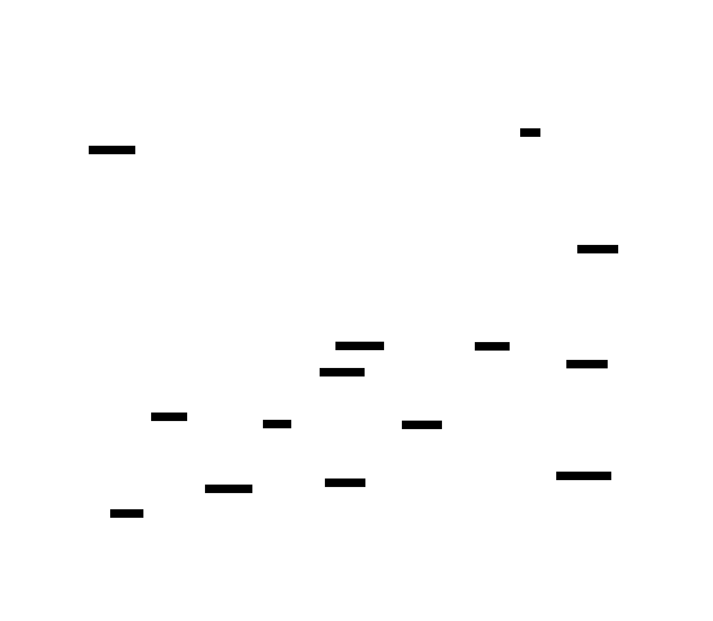

# Component 6: Durability & Recovery

> Crash-safe persistence via WAL + UoW ID-based tracking, decoupled async flush, page checksums, and consistent recovery.

---

## Overview

Typhon's durability model combines two complementary mechanisms:

1. **Write-Ahead Log (WAL):** The durability backbone. Every committed change is sequentially written to a dedicated WAL file with FUA (Force Unit Access) guarantees before being considered durable. This enables torn page repair and provable crash recovery.

2. **UoW Registry:** The visibility and fast-recovery layer. Each revision is stamped with a UoW ID, and the registry tracks which UoWs are committed. UoW state transitions are recorded as WAL records (WAL is the authority); the registry pages in the data file are a checkpoint cache that accelerates recovery.

Together, they provide: instant in-memory commits, configurable durability guarantees (from fully async to per-transaction durable), torn page detection and repair, and sub-100ms crash recovery.

<a href="../assets/typhon-durability-overview.svg">
  
</a>
<sub>🔍 Click to open full size (Ctrl+Scroll to zoom) — For pan-zoom: open <code>claude/assets/viewer.html</code> in browser</sub>

---

## Status: 🆕 New (Designed, Not Yet Implemented)

This component does not yet exist in the codebase. The design is finalized based on I/O pipeline research (see [IO-Pipeline-Crash-Semantics.md](../research/IO-Pipeline-Crash-Semantics.md)) and analysis of torn page risks on consumer NVMe hardware.

---

## Sub-Components

| # | Name | Purpose | Status |
|---|------|---------|--------|
| **6.1** | [Write-Ahead Log (WAL)](#61-write-ahead-log-wal) | Sequential durable record of all changes | 🆕 New |
| **6.2** | [Page Checksums](#62-page-checksums) | Torn write detection via CRC32C | 🆕 New |
| **6.3** | [UoW ID Stamping](#63-uow-id-stamping) | Tag each revision with its owning UoW's ID | 🆕 New |
| **6.4** | [UoW Registry](#64-uow-registry) | Track pending/committed UoW status | 🆕 New |
| **6.5** | [Durability Modes](#65-durability-modes) | User-controlled durability granularity | 🆕 New |
| **6.6** | [Checkpoint Pipeline](#66-checkpoint-pipeline) | Background data page persistence + WAL recycling | 🆕 New |
| **6.7** | [Crash Recovery](#67-crash-recovery) | Registry scan + WAL replay + torn page repair | 🆕 New |
| **6.8** | [Visibility & Isolation](#68-visibility--isolation) | UoW-aware read path for pending UoWs | 🆕 New |

---

## Core Principles

1. **Commit = instant** (~1-2µs). Changes are in-memory, visible via MVCC. No disk I/O on the commit path (except WAL serialization to buffer).
2. **Durability = WAL.** A change is durable when its WAL record reaches stable media (FUA). Not before.
3. **User controls the tradeoff.** `DurabilityMode` (Deferred / GroupCommit / Immediate) determines when WAL flush occurs.
4. **Torn pages are detectable and repairable.** Page checksums detect corruption; WAL full-page images enable repair.
5. **Recovery = O(registry checkpoint) + O(WAL delta).** Read registry checkpoint (<2ms), replay WAL since last checkpoint (10-50ms typical). Registry pages are disposable — rebuild from WAL if torn.
6. **UoW IDs = visibility, not durability.** The UoW ID system controls what data is visible to which transactions, independent of whether it's durable.

---

## Persistence Map: Two Pipelines to Disk

Data reaches stable media through **two independent pipelines**. Understanding their interaction is key to reasoning about crash safety.

### The Two Pipelines

| Pipeline | Source | Destination | Trigger | I/O Type | Purpose |
|----------|--------|-------------|---------|----------|---------|
| **WAL pipeline** | Ring buffer (memory) | WAL file (disk) | Immediate commit / GroupCommit timer / Flush() / back-pressure | FUA (single write, guaranteed durable) | Makes data *recoverable* after crash |
| **Data page pipeline** | Page cache (memory) | Data file (disk) | Checkpoint Manager (timer / WAL threshold / explicit) | Buffered write + fsync | Makes data *directly readable* without WAL replay |

### State Matrix: Where Is My Data?

Each committed transaction's data exists somewhere along both pipelines. This matrix shows every possible combination:

| | **Data pages: In memory only** | **Data pages: On disk (checkpointed)** |
|---|---|---|
| **WAL: In ring buffer only** | **Volatile** — Lost on crash. Normal state for Deferred/GroupCommit immediately after `tx.Commit()`. | Impossible — checkpoint requires WalDurable first. |
| **WAL: On WAL file (FUA'd)** | **Durable** — Survives crash via WAL replay. WAL segments cannot be recycled yet. | **Checkpointed** — Survives crash directly from data pages. WAL segments recyclable. |
| **WAL: Recycled** | Impossible — WAL only recycled after checkpoint. | **Steady state** — Data lives on data pages, WAL space reclaimed. |

### What Moves Data Along Each Pipeline?

**WAL pipeline (ring buffer → WAL file):**

| Action | Who Triggers It | When |
|--------|----------------|------|
| `tx.Commit()` with Immediate mode | User (via DurabilityMode) | Every commit |
| `tx.Commit(DurabilityOverride.Immediate)` | User (per-tx escalation) | Specific critical commit |
| GroupCommit timer fires | WAL writer thread (automatic) | Every 5-10ms |
| `uow.Flush()` / `uow.FlushAsync()` | User (explicit) | Batch boundary |
| Ring buffer back-pressure (>80% full) | WAL writer thread (automatic) | Under high commit load |

**Data page pipeline (page cache → data file):**

| Action | Who Triggers It | When |
|--------|----------------|------|
| Checkpoint timer fires | Checkpoint Manager (automatic) | Every 10s (configurable) |
| WAL segment threshold exceeded | Checkpoint Manager (automatic) | WAL growing too large |
| Dirty page count threshold | Checkpoint Manager (automatic) | Memory pressure |
| `db.ForceCheckpoint()` | User (explicit) | On demand |
| Graceful shutdown | Engine (automatic) | Process exit |

### Typical Lifecycle of a Transaction's Data

```
tx.Commit() [Deferred mode]
  │
  ├─ Immediately: data in ring buffer + page cache (VOLATILE)
  │
  ├─ On Flush() or back-pressure: ring buffer → WAL file (FUA)
  │   └─ Now DURABLE (survives crash via WAL replay)
  │
  ├─ On next checkpoint: page cache → data file (fsync)
  │   └─ Now CHECKPOINTED (survives crash directly, WAL recyclable)
  │
  └─ After checkpoint: WAL segment recycled → STEADY STATE
```

### Key Insight: The Pipelines Are Decoupled

- A transaction can be **Durable** (on WAL) without being **Checkpointed** (on data pages) — this is the normal state between WAL flush and next checkpoint.
- The Checkpoint Manager doesn't add durability — it moves data from "durable via WAL" to "durable on data pages" so WAL segments can be recycled.
- The user only controls the **WAL pipeline** timing (via DurabilityMode/Flush). The data page pipeline is fully automatic (Checkpoint Manager).

---

## 6.1 Write-Ahead Log (WAL)

### Purpose

The WAL is the single source of durability truth. Every mutation (create, update, delete) is serialized to the WAL before it can be considered crash-safe. The WAL provides:

- **Durability guarantee:** FUA writes ensure records survive any crash
- **Torn page repair:** Full page images in WAL allow reconstruction of corrupted data pages
- **Atomicity:** Multi-component transactions are atomic because the WAL record is written atomically
- **Future extensibility:** WAL streaming enables replication (future)

### WAL Record Structure

```csharp
[StructLayout(LayoutKind.Sequential, Pack = 4)]
struct WalRecordHeader  // 32 bytes
{
    public long LSN;               // 8B - Log Sequence Number (monotonic, never reused)
    public long TransactionTSN;    // 8B - Transaction timestamp (links to MVCC)
    public ushort UowId;           // 2B - Links to UoW registry
    public ushort ComponentTypeId; // 2B - Which component table
    public int EntityId;           // 4B - Which entity (primary key)
    public ushort PayloadLength;   // 2B - Bytes of component data following header
    public byte OperationType;     // 1B - Create=1, Update=2, Delete=3
    public byte Flags;             // 1B - FullPageImage=0x01, GroupCommitEnd=0x02
    public uint Checksum;          // 4B - CRC32C of header + payload
}
// Followed by: [PayloadLength bytes of component data (blittable struct)]
// If Flags.FullPageImage: followed by [8192 bytes of full page content]
```

### Full-Page Images (FPI)

When a data page is modified for the **first time since the last checkpoint**, the WAL record includes a full 8KB copy of the page (the before-image). This enables torn page repair:

```csharp
bool needsFPI = !_pagesWrittenSinceCheckpoint.Contains(pageIndex);
if (needsFPI)
{
    record.Flags |= WalFlags.FullPageImage;
    // Append: 32B header + component payload + 8192B page image
    _pagesWrittenSinceCheckpoint.Add(pageIndex);
}
```

**Cost:** One extra 8KB write per page per checkpoint cycle. For a workload that touches 1000 pages between checkpoints: ~8MB of FPI data in WAL. At NVMe sequential write speeds (2+ GB/s), this adds <4ms to the checkpoint window.

### WAL File Configuration

| Platform | File Flags | Effect |
|----------|-----------|--------|
| **Windows** | `FILE_FLAG_NO_BUFFERING \| FILE_FLAG_WRITE_THROUGH` | Direct I/O + FUA per write |
| **Linux** | `O_DIRECT \| O_DSYNC` | Direct I/O + data-only sync (FUA via NVMe driver) |

```csharp
// Cross-platform WAL file opening
#if WINDOWS
const FileOptions NoBuffering = (FileOptions)0x20000000; // FILE_FLAG_NO_BUFFERING
var walHandle = File.OpenHandle(walPath, FileMode.OpenOrCreate,
    FileAccess.ReadWrite, FileShare.Read,
    FileOptions.Asynchronous | NoBuffering | FileOptions.WriteThrough);
#elif LINUX
// P/Invoke: open(path, O_RDWR | O_CREAT | O_DIRECT | O_DSYNC, 0644)
var walHandle = PlatformIO.OpenDirectDsync(walPath);
#endif
```

### WAL Buffer and Writer Thread

```
Commit Thread(s):                    WAL Writer Thread (dedicated):

tx.Commit()                          Loop:
  → Serialize record to ring buffer    → Wait for trigger:
  → [If Immediate: signal writer]         - Immediate commit signal, OR
  → [Return to caller]                    - GroupCommit timer (5-10ms), OR
                                           - Buffer threshold (e.g. 256KB), OR
                                           - Explicit Flush() call
                                       → Collect all pending records from ring buffer
                                       → Write batch to WAL file (single FUA I/O)
                                       → On completion:
                                           Mark all included txs as Durable
                                           Signal any waiting Immediate callers
                                           Advance durable LSN watermark
```

**Ring buffer design:**
- Lock-free MPSC (Multi-Producer, Single-Consumer) ring buffer
- Producers (commit threads) write records via `Interlocked.CompareExchange` on write pointer
- Consumer (WAL writer) reads all available records in batch
- Buffer size: 1-4 MB (holds thousands of records between flushes)

### WAL Segments and Recycling

| Parameter | Default | Notes |
|-----------|---------|-------|
| Segment size | 4 MB | Pre-allocated, avoids file growth during operation |
| Initial segments | 4 | Pre-allocated at database creation |
| Segment header | 64 bytes | Segment number, first/last LSN, creation timestamp |
| Records per segment | ~20K-80K | At 50-200 bytes average record size |

Segments are recycled (not deleted) after the checkpoint advances past their last LSN:

```
WAL Segment 1: [LSN 1000 ... LSN 25000]  ← Checkpointed, recyclable
WAL Segment 2: [LSN 25001 ... LSN 50000] ← Checkpointed, recyclable
WAL Segment 3: [LSN 50001 ... LSN 62000] ← Active, partially written
WAL Segment 4: [empty, pre-allocated]     ← Next segment
```

### Dynamic Segment Allocation

WAL segments are allocated dynamically as needed. If pending UoWs prevent segment recycling (e.g., a long-lived Deferred UoW that hasn't called `Flush()`), the WAL writer allocates new segments on demand:

```
Scenario: Long-lived Deferred UoW, 10,000 tx/s, ~132 bytes/record

WAL growth: ~1.3 MB/s → one new 4MB segment every ~3 seconds
After 60s without Flush(): ~20 MB of WAL (5 segments)
After 10 min without Flush(): ~780 MB of WAL (~195 segments)
```

**This is by design.** The engine does not force-flush a user's UoW or silently promote its durability. The user chose Deferred mode, meaning "I control when `Flush()` happens." The WAL grows to accommodate that choice. Consequences:

- **Disk usage**: WAL file grows until the UoW is flushed (then checkpoint recycles old segments)
- **Recovery time**: WAL replay covers everything since last checkpoint — longer WAL = longer replay
- **No data loss risk**: The ring buffer drains to WAL file via back-pressure regardless; only WAL *file* space grows
- **No silent behavior changes**: The engine never force-flushes, force-checkpoints, or aborts a UoW behind the user's back

Once the user calls `Flush()`, the UoW transitions to `WalDurable`, the next checkpoint can advance it to `Committed`, and all accumulated segments become recyclable.

**Segment allocation strategy:**
- New segments are pre-allocated (fallocate/SetFileValidData) to avoid file growth stalls during FUA writes
- Allocation happens when the current segment is ~75% full (ahead of actual need)
- Recycled segments are reused before allocating new ones
- On graceful shutdown, excess segments can be truncated to reclaim disk space

### WAL Performance Characteristics

| Metric | Value | Notes |
|--------|-------|-------|
| Single record write (FUA) | 10-80 µs | NVMe FUA latency, varies by drive/size |
| Group commit batch (FUA) | 10-80 µs | Same FUA cost regardless of batch size (up to segment) |
| Amortized per-tx (GroupCommit) | 1-5 µs | FUA cost / number of txs in batch |
| Sequential throughput | 500 MB/s - 2 GB/s | NVMe sequential write with FUA |
| Max durable tx/s (Immediate) | 12K-100K | Limited by FUA round-trip |
| Max durable tx/s (GroupCommit, 5ms) | Millions | Limited by CPU serialization speed |

---

## 6.2 Page Checksums

### Purpose

Detect torn writes — partial page writes caused by power loss where the first 4KB of an 8KB page is new data but the second 4KB is old data (or vice versa). Without checksums, torn pages cause **silent data corruption**.

### Why This Is Mandatory (Not Future)

From the I/O pipeline research:

- Typhon's 8KB pages span **two 4KB logical blocks** on NVMe drives
- Consumer NVMe drives have AWUPF = 1 LBA (4KB) — 8KB writes are **NOT atomic**
- A torn page after a committed checkpoint is **undetectable** without checksums
- A torn page is **unrepairable** without WAL full-page images
- Both mechanisms (detection + repair) are needed for correctness

### Page Header Extension

```csharp
[StructLayout(LayoutKind.Sequential)]
struct PageBaseHeader  // Existing 64-byte header
{
    public int PageIndex;           // 4B
    public int ChangeRevision;      // 4B
    // ... existing fields ...

    // NEW: Checksum fields (using reserved space in existing header)
    public uint PageChecksum;       // 4B - CRC32C of page content (bytes 64..8191)
    public uint ChecksumEpoch;      // 4B - Checkpoint epoch when checksum was computed
}
```

### Checksum Algorithm: CRC32C

| Algorithm | Throughput (x86 SSE4.2) | Quality | Choice |
|-----------|------------------------|---------|--------|
| CRC32C | ~20 GB/s (hardware intrinsic) | Good collision resistance | **Selected** |
| xxHash32 | ~10 GB/s | Slightly better distribution | Alternative |
| xxHash64 | ~15 GB/s | Overkill for 8KB pages | Rejected |

CRC32C is chosen because:
- Hardware-accelerated via `Sse42.Crc32` / `Arm.Crc32` intrinsics on all modern CPUs
- 8KB page checksum: **~0.4 µs** (negligible vs. I/O latency)
- Used by PostgreSQL, RocksDB, ext4, Btrfs for page/block checksums

### Implementation

```csharp
[MethodImpl(MethodImplOptions.AggressiveInlining)]
static uint ComputePageChecksum(ReadOnlySpan<byte> page)
{
    // Checksum covers bytes 64..8191 (skip header where checksum lives)
    var data = page.Slice(PageHeaderSize);
    return Crc32C.Compute(data);  // Hardware-accelerated
}

// On page flush (before writing to disk):
void PreparePageForFlush(Span<byte> page)
{
    ref var header = ref MemoryMarshal.AsRef<PageBaseHeader>(page);
    header.PageChecksum = ComputePageChecksum(page);
    header.ChecksumEpoch = _currentCheckpointEpoch;
}

// On page load (after reading from disk):
bool VerifyPageChecksum(ReadOnlySpan<byte> page)
{
    ref readonly var header = ref MemoryMarshal.AsRef<PageBaseHeader>(page);
    var computed = ComputePageChecksum(page);
    return computed == header.PageChecksum;
}
```

### Checksum Verification Points

| When | Action on Mismatch |
|------|-------------------|
| Page load from disk (cold read) | Log warning, attempt WAL repair, fail if unrepairable |
| Crash recovery scan | Identify torn pages, repair from WAL FPI |
| Background scrub (optional, future) | Detect latent bit-rot, repair from WAL/backup |

### Torn Page Repair Flow

```
Page load → Checksum mismatch detected!
  → Find most recent WAL FPI for this page
  → If FPI exists and FPI checksum valid:
      → Overwrite page with FPI content ✓ (repaired)
      → Re-apply any WAL records after the FPI
  → If no FPI available:
      → Page belongs to a pre-checkpoint epoch
      → Mark page as corrupt, log critical error
      → If page contains non-committed data: void the UoW (safe)
      → If page contains committed data: DATA LOSS (should not happen with proper checkpointing)
```

---

## 6.3 UoW ID Stamping

### Purpose

Every revision created within a Unit of Work is stamped with a 2-byte **UoW ID** value. This provides:
- **Visibility control:** Unflushed UoW data is invisible to external transactions
- **Fast crash recovery:** Void pending UoW IDs instantly without scanning data pages
- **UoW grouping:** Multiple transactions within one UoW share a UoW ID

### Data Structure Change

```csharp
[StructLayout(LayoutKind.Sequential, Pack = 2)]
internal struct CompRevStorageElement  // Was 10 bytes, now 12 bytes (see ADR-027)
{
    public int ComponentChunkId;       // 4 bytes - chunk containing component data
    private uint _packedTickHigh;      // 4 bytes - TSN high bits
    private ushort _packedTickLow;     // 2 bytes - full 16 bits of TSN (bit 0 freed)
    private ushort _packedUowId;       // 2 bytes - bits 0-14: UoW ID, bit 15: IsolationFlag
}
```

### How It Works

When a transaction commits, the revision element is stamped:

```csharp
// In Transaction.CommitComponent():
element.UowId = CurrentUow.UowId;  // Stamp with UoW's ID
element.IsolationFlag = false;         // Visible within UoW scope
```

### UoW ID Lifecycle

| Value | Meaning |
|-------|---------|
| `0` | Legacy / no-UoW (always visible, for backward compatibility) |
| `1–32767` | Valid UoW ID assigned by UoW Registry |

UoW IDs are recycled when the UoW's `MaxTSN < TransactionChain.MinTSN` (no active transaction can reference it).

### Storage Impact

+2 bytes per revision (10 → 12 bytes). This is a **20% size increase** per revision element but acceptable given:
- Revisions are typically short-lived (GC'd after older transactions complete)
- 12 bytes maintains good alignment (divisible by 4)
- The UoW ID enables O(1) crash recovery without full-database scanning

---

## 6.4 UoW Registry

### Purpose

A growing logical segment tracking the status of all active and recently-completed Units of Work. The WAL is the authority for UoW state transitions; the registry pages are a checkpoint cache. Combined, they provide:
- **Fast crash recovery:** Read registry checkpoint (baseline) + replay WAL delta since last checkpoint
- **Visibility control:** Committed bitmap for MVCC read filtering (crash-recovery fallback, not hot path)
- **Checkpoint coordination:** Registry marks UoWs as committed when their data pages are checkpointed

### Data Structures

```csharp
// No separate header struct — the root page's usable space is entirely UowRegistryEntry[150].
// The allocation bitmap and committed bitmap are in-memory only (rebuilt from entry states on startup).
// Metadata (max allocated ID, high water mark, etc.) can be stored in the LogicalSegment's
// standard root page header or derived from the entry array on startup.

// Registry Entry (40 bytes each, slot index = UoW ID)
// Padded to 40 bytes: divides evenly into root (6000/40=150) and overflow (8000/40=200) pages
struct UowRegistryEntry
{
    UowStatus Status;             // Free=0, Pending=1, WalDurable=2, Committed=3, Void=4
    byte Reserved;
    short Reserved2;
    int TransactionCount;         // Number of transactions committed in this UoW
    long CreatedTicks;            // Stopwatch ticks at creation
    long CommittedTicks;          // Stopwatch ticks at WAL flush (0 if not yet)
    long MaxTSN;                  // Highest TSN — for GC: MinTSN > MaxTSN → recyclable
    long Reserved3;               // Future use (e.g., MinTSN for precise CommittedBeforeTSN)
}

enum UowStatus : byte
{
    Free = 0,        // Slot available for reuse
    Pending = 1,     // UoW created, WAL records being written
    WalDurable = 2,  // All WAL records flushed (FUA complete), data pages not yet checkpointed
    Committed = 3,   // Data pages checkpointed, WAL can be recycled for this UoW
    Void = 4         // Rolled back or recovered from crash
}
```

### Status Transitions

```
Pending → WalDurable → Committed → Free
    ↓
   Void → Free (after GC)
```

| Transition | Trigger | Meaning |
|-----------|---------|---------|
| Free → Pending | `CreateUnitOfWork()` | UoW started, UoW ID allocated (in-memory), "UoW Created" WAL record flushed via group commit |
| Pending → WalDurable | WAL flush completes for all UoW records | Changes survive any crash (via WAL replay) |
| WalDurable → Committed | Checkpoint writes data pages + fsync | Data pages match WAL, WAL segment recyclable |
| Pending → Void | Crash recovery | UoW was in-flight at crash time |
| Void/Committed → Free | UoW GC (no active tx references it) | Slot recycled |

### Storage: Flat Array in Growing Logical Segment

The registry is stored as a **flat array** in a growing `LogicalSegment` — not chunks. Each entry is addressed directly by slot index (= UoW ID). No page headers, no overflow chains, no chunk metadata.

```
Root page:     entries[  0 .. 149]     150 × 40 = 6000 bytes (exact fit)
Overflow 0:    entries[150 .. 349]     200 × 40 = 8000 bytes (exact fit)
Overflow 1:    entries[350 .. 549]     200 × 40 = 8000 bytes (exact fit)
...
```

Pages are allocated on demand: unit tests creating 1-5 UoWs use just 1 page (8 KB). Production at full capacity: ~164 pages (~1.3 MB). `Free = 0` ensures fresh pages are automatically all-Free entries.

### Durability: WAL-Based (No Per-Allocation FUA)

The registry pages are a **checkpoint cache**, not the durable source of truth. UoW state transitions are recorded as WAL records and flushed via the WAL's existing group commit mechanism. No blocking FUA on registry pages.

- **UoW creation:** "UoW Created" WAL record written to ring buffer → flushed via group commit (amortized across batch).
- **Checkpoint:** Registry pages written to `ManagedMMF` during regular checkpoints alongside other dirty data pages — one `fsync` for all.
- **Recovery:** Read checkpoint baseline + replay WAL delta since last checkpoint. If registry pages are torn, rebuild entirely from WAL (slower recovery, never data loss).

This eliminates the per-allocation FUA bottleneck (~15-85µs each) and reuses the WAL's existing durability infrastructure.

### Entry Lifecycle

<a href="../assets/typhon-uow-registry-lifecycle.svg">
  
</a>
<sub>🔍 Click to open full size (Ctrl+Scroll to zoom) — For pan-zoom: open <code>claude/assets/viewer.html</code> in browser</sub>

#### Normal Path: Free → Pending → WalDurable → Committed → Free

1. **Free → Pending:** `AllocateUowId()` claims a free slot via allocation bitmap scan (`BitOperations.TrailingZeroCount`). The entry's `State = Pending` is set in-memory and a "UoW Created" WAL record is written to the ring buffer. The WAL group flush makes this durable — batched with other pending writes. No FUA on registry pages. The critical invariant is preserved: the WAL record must be durable before any revision references this UoW ID. `CreatedTicks` is set, other fields zeroed.

2. **Pending → WalDurable:** All WAL records for this UoW have been flushed via FUA. The UoW's changes now survive any crash — WAL replay can recover them. This transition is triggered by `uow.Flush()` / `uow.FlushAsync()`, the GroupCommit timer, or `DurabilityOverride.Immediate` on individual transactions.

3. **WalDurable → Committed:** The Checkpoint Manager has written all dirty data pages for this UoW to the data file and called `fsync`. The data is now directly readable from data pages without WAL replay. WAL segments covering this UoW are now eligible for recycling. The committed bitmap bit is set atomically (in-memory).

4. **Committed → Free:** GC condition — `TransactionChain.MinTSN > entry.MaxTSN`. This means no active transaction could possibly reference any revision stamped with this UoW ID. The slot is recycled: committed bitmap bit cleared, allocation bitmap bit set. The entry's fields are zeroed.

#### Crash Recovery Path: Pending → Void → Free

5. **Pending → Void:** On startup after a crash, any entry still in `Pending` state means the UoW was in-flight when the crash happened. Its WAL records (if any) may be partial or absent. Recovery sets `State = Void`, making all revisions with this UoW ID instantly invisible — the committed bitmap bit stays unset, so `IsCommitted(uowId)` returns `false`.

6. **Void → Free:** Same GC condition as Committed → Free. Once no active transaction can reference the voided UoW's revisions, the slot is recycled. The voided revisions themselves get cleaned up by `DeferredCleanupManager` during normal revision chain GC — they are physically present but invisible until cleanup removes them.

#### Key Properties

- **`Free = 0` default:** Zeroed memory (fresh pages) is automatically `Free`. No explicit initialization needed. Growing segment pages require no initialization.
- **WAL-based durability:** No blocking FUA on registry pages. UoW state transitions are WAL records, flushed via group commit. Registry pages are a checkpoint cache — written during regular checkpoints, disposable if torn.
- **Recovery:** Read checkpoint baseline + replay WAL delta. If registry pages are corrupted, rebuild entirely from WAL (slower, never data loss). No FPI needed for registry pages.
- **Two in-memory bitmaps:** The *allocation bitmap* (`ulong[512]`, 32,768 bits) tracks Free slots for O(1) allocation. The *committed bitmap* (`ulong[512]`, 32,768 bits) is a **crash-recovery fallback** — it filters ghost revisions from voided UoWs. Both are rebuilt from entry states on startup.
- **CommittedBeforeTSN:** A `long` value that enables zero-overhead visibility checks during normal operation. Set to `long.MaxValue` when no Void entries exist (all reads bypass the committed bitmap). Set to `0` after crash recovery while voided entries are being cleaned up (all reads fall through to the bitmap). See [§6.8 Visibility & Isolation](#68-visibility--isolation) for the full two-tier architecture.

---

## 6.5 Durability Modes

### Purpose

Allow users to control the trade-off between commit latency and crash safety. Typhon provides three modes at the UoW level, plus a per-transaction override for mixed workloads.

### Available Modes

| Mode | Commit Latency | WAL Behavior | Data-at-Risk Window | Use Case |
|------|---------------|--------------|---------------------|----------|
| **Deferred** | ~1-2 µs | Buffered, flushed on `Flush()` | Until `Flush()` called | Game ticks, bulk imports |
| **GroupCommit** | ~1-2 µs | Buffered, flushed every N ms | ≤ N ms (configurable) | General server workload |
| **Immediate** | ~15-85 µs | FUA on every `tx.Commit()` | Zero | Financial trades, critical state |

### Deferred Mode

Changes accumulate in the WAL buffer across multiple transactions. A single `Flush()` persists everything with one FUA write.

```csharp
// Game server tick — many transactions, one WAL flush
using var uow = db.CreateUnitOfWork(DurabilityMode.Deferred);

foreach (var player in activePlayers)
{
    using var tx = uow.CreateTransaction();
    UpdatePosition(tx, player);
    tx.Commit();  // ~1-2µs — WAL record buffered, NOT on disk
    // tx.Durability == DurabilityGuarantee.Volatile
}

await uow.FlushAsync();  // ~15-85µs — one FUA write for all records
// All transactions: DurabilityGuarantee.Durable
```

**Best for:** Workloads where losing a batch is acceptable (game ticks, simulation steps, batch ETL). The batch boundary is the natural durability boundary.

### GroupCommit Mode

WAL records are buffered and flushed periodically by the WAL writer thread. Provides near-instant commits with bounded data-at-risk.

```csharp
// General server workload — bounded risk, high throughput
using var uow = db.CreateUnitOfWork(DurabilityMode.GroupCommit);
// Optional: uow.GroupCommitInterval = TimeSpan.FromMilliseconds(5);

using var tx = uow.CreateTransaction();
ExecutePlayerAction(tx, action);
tx.Commit();  // ~1-2µs — WAL record buffered
// tx.Durability == DurabilityGuarantee.Volatile (initially)

// WAL writer flushes every 5-10ms automatically
// Transaction becomes Durable asynchronously

// If you need to wait for durability confirmation:
await tx.WaitForDurability();  // Blocks until WAL flush includes this tx
// tx.Durability == DurabilityGuarantee.Durable
```

**Best for:** Server workloads where 5-10ms of potential data loss on crash is acceptable. Provides the best throughput-to-durability ratio.

### Immediate Mode

Every transaction commit triggers a WAL FUA write. The commit call blocks until the WAL record is on stable media.

```csharp
// Critical operation — must survive any crash
using var uow = db.CreateUnitOfWork(DurabilityMode.Immediate);

using var tx = uow.CreateTransaction();
ExecuteTrade(tx, alice, bob, item, gold);
tx.Commit();  // ~15-85µs — WAL write + FUA, durable on return
// tx.Durability == DurabilityGuarantee.Durable (guaranteed)
```

**Best for:** Operations where data loss is unacceptable — financial transactions, irreversible state changes, player purchases.

### Per-Transaction Override (Mixed Workloads)

A UoW in Deferred or GroupCommit mode can override durability for specific critical transactions:

```csharp
using var uow = db.CreateUnitOfWork(DurabilityMode.Deferred);

// Fast batch of non-critical updates
foreach (var mob in npcs)
{
    using var tx = uow.CreateTransaction();
    UpdateAI(tx, mob);
    tx.Commit();  // Volatile — fast
}

// One critical operation mid-batch
using (var tx = uow.CreateTransaction())
{
    ExecuteRareDropLoot(tx, player, legendaryItem);
    tx.Commit(DurabilityOverride.Immediate);  // Forces WAL FUA for this tx
    // tx.Durability == DurabilityGuarantee.Durable
}

// Continue fast batch
foreach (var effect in visualEffects)
{
    using var tx = uow.CreateTransaction();
    UpdateEffect(tx, effect);
    tx.Commit();  // Back to volatile
}

await uow.FlushAsync();  // Flush remaining volatile records
```

### Durability Guarantee (Per-Transaction State)

```csharp
public enum DurabilityGuarantee
{
    /// <summary>
    /// Committed in-memory. Visible to other transactions via MVCC.
    /// NOT durable — lost on any crash.
    /// </summary>
    Volatile,

    /// <summary>
    /// WAL record is on stable media (FUA completed).
    /// Survives process crash, OS crash, and power loss.
    /// Can be replayed from WAL during recovery.
    /// </summary>
    Durable,

    /// <summary>
    /// Data pages have been checkpointed to the data file.
    /// WAL segments containing this transaction can be recycled.
    /// </summary>
    Checkpointed
}
```

### Performance Comparison

| Mode | Commit Latency | Durable tx/s (single thread) | Durable tx/s (multi-thread) |
|------|---------------|-----------------------------|-----------------------------|
| **Deferred** | ~1-2 µs | N/A (batch-durable) | N/A |
| **GroupCommit (5ms)** | ~1-2 µs | ~200K+ (amortized) | Millions (shared flush) |
| **Immediate** | ~15-85 µs | ~12K-65K | ~12K-65K (FUA-limited) |
| **Registry-only (old design)** | ~100-400 µs (immediate) | ~2.5K-10K | Same |

The WAL-based Immediate mode is **5-40x faster** than the old registry-only immediate flush (which required writing all dirty data pages + 2 fsyncs).

---

## 6.6 Checkpoint Pipeline

### Purpose

The checkpoint pipeline periodically writes dirty data pages to the data file, advancing the WAL checkpoint marker and enabling WAL segment recycling. This is the background process that moves data from "WAL-durable" to "fully checkpointed."

### Pipeline Steps

<a href="../assets/typhon-checkpoint-pipeline.svg">
  
</a>
<sub>🔍 Click to open full size (Ctrl+Scroll to zoom) — For pan-zoom: open <code>claude/assets/viewer.html</code> in browser</sub>

### Checkpoint Frequency Trade-offs

| Interval | WAL Size Between Checkpoints | Recovery Replay Time | Data Pages Per Flush |
|----------|------------------------------|---------------------|---------------------|
| 5s | ~2-10 MB | ~5-25 ms | Fewer (faster flush) |
| 10s (default) | ~5-20 MB | ~10-50 ms | Moderate |
| 30s | ~15-60 MB | ~30-150 ms | More (batch efficiency) |
| 60s | ~30-120 MB | ~60-300 ms | Maximum batch |

**Default: 10 seconds** — balances WAL size, recovery time, and checkpoint overhead.

### Checkpoint Triggers

| Trigger | Condition | Reason |
|---------|-----------|--------|
| Timer | Every 10s (configurable) | Bounded recovery time |
| WAL size | Total WAL segments exceed threshold (configurable) | Reclaim disk space, bound recovery replay time |
| Dirty pages | Dirty page count > threshold | Memory pressure |
| Explicit | `db.ForceCheckpoint()` | User/admin request |
| Shutdown | Graceful shutdown | Clean state for fast restart |

### Sequential Allocation Benefit

Typhon's storage engine allocates pages sequentially when possible. This means checkpoint writes are often **contiguous**, reducing the fsync cost dramatically:

| Page Locality | fsync Cost (100 pages) | Reason |
|---------------|----------------------|--------|
| Sequential (contiguous) | ~500 µs | Single large sequential I/O |
| Random (scattered) | ~2.8 ms | Multiple small random I/Os |

The checkpoint pipeline benefits directly from the storage engine's sequential allocation strategy.

---

## 6.7 Crash Recovery

### Purpose

On startup after a crash, restore the database to a consistent state using the UoW registry and WAL.

### Recovery Algorithm

```csharp
void RecoverFromCrash()
{
    // Phase 1: Registry reconstruction — checkpoint baseline + WAL delta
    var registry = LoadRegistryFromCheckpoint();  // Read registry pages from ManagedMMF
    if (!registry.ChecksumsValid)
        registry = new EmptyRegistry();            // Torn pages? Rebuild entirely from WAL

    // Replay WAL registry records to bring checkpoint baseline up to date
    var checkpointLSN = ReadCheckpointLSN();
    var walRecords = ReadWalFrom(checkpointLSN);

    foreach (var record in walRecords.Where(r => r.IsRegistryRecord))
    {
        // Apply UoW state transitions: Created → Pending, WalDurable, Committed, etc.
        registry.ApplyStateTransition(record);
    }

    // Void any UoWs that were Pending at crash time
    foreach (ref var entry in registry.Entries)
    {
        if (entry.Status == UowStatus.Pending)
        {
            entry.Status = UowStatus.Void;
            // Revisions with this UoW ID become invisible immediately
        }
    }
    RebuildBitmaps(registry);  // allocation + committed bitmaps

    // Phase 2: WAL data replay — O(WAL since last checkpoint), 10-50ms typical
    foreach (var record in walRecords.Where(r => r.IsDataRecord))
    {
        // Skip records for voided UoW IDs (handled in Phase 1)
        if (IsVoidedUow(record.UowId)) continue;

        // Replay committed records that may not be in data pages yet
        ReplayWalRecord(record);
    }

    // Phase 3: Torn page repair
    foreach (var pageIndex in GetAllDataPages())
    {
        if (!VerifyPageChecksum(pageIndex))
        {
            // Page is torn — find FPI in WAL
            var fpi = FindFullPageImage(walRecords, pageIndex);
            if (fpi != null)
            {
                RestorePageFromFPI(pageIndex, fpi);
                ReplaySubsequentRecords(pageIndex, fpi.LSN, walRecords);
                // Page repaired ✓
            }
            else
            {
                // No FPI — page was checkpointed before corruption
                LogCritical($"Torn page {pageIndex} with no FPI — voiding affected UoW");
                VoidUowForPage(pageIndex);
            }
        }
    }

    // Phase 4: Persist recovery state (write registry to checkpoint cache)
    registry.WriteToSegment();   // Written to ManagedMMF, will be fsync'd at next checkpoint

    // Phase 5: Database is ready
    // - Registry reconstructed from checkpoint + WAL delta
    // - Voided UoW IDs are invisible via committed bitmap
    // - CommittedBeforeTSN = 0 (Void entries exist) — bitmap handles all reads
    // - WAL-durable but uncheckpointed data has been replayed
    // - Torn pages have been repaired
}
```

### Recovery Time

| Phase | Time | Depends On |
|-------|------|-----------|
| Phase 1: Registry reconstruction | < 2 ms | Checkpoint pages + WAL registry delta (small) |
| Phase 2: WAL data replay | 10-50 ms | Data records since last checkpoint (10s default) |
| Phase 3: Torn page repair | 0-10 ms | Number of torn pages (rare, typically 0-1) |
| Phase 4: Persist | < 1 ms | Write registry to checkpoint cache |
| **Total** | **~15-60 ms** | Dominated by WAL data replay |

### Crash Scenarios

**Scenario 1: Crash during UoW operations (before any WAL flush)**
```
Timeline:
  UoW created → "UoW Created" WAL record in ring buffer (not flushed)
  tx1.Commit() → WAL record buffered (not flushed)
  tx2.Commit() → WAL record buffered (not flushed)
  [CRASH]

Recovery:
  Phase 1: Registry checkpoint has no entry for this UoW (created after checkpoint)
           WAL has no flushed records for this UoW → entry doesn't exist
  Phase 2: No data records to replay
  Result: Database state = before UoW started ✓ (UoW never existed)
```

**Scenario 2: Crash after WAL flush, before checkpoint**
```
Timeline:
  UoW operations complete
  WAL flush (FUA) succeeds → UoW = WalDurable
  [CRASH before checkpoint]

Recovery:
  Phase 1: Registry → WalDurable (not voided — WAL records exist)
  Phase 2: Replay WAL records for this UoW → apply to data pages
  Result: UoW fully recovered from WAL ✓
```

**Scenario 3: Crash during checkpoint (data pages partially written)**
```
Timeline:
  Checkpoint starts
  Some data pages written, some not
  [CRASH during fsync or before registry update]

Recovery:
  Phase 1: Registry still shows WalDurable (not yet Committed)
  Phase 2: Replay WAL — re-applies all changes from checkpoint LSN
  Phase 3: Checksum finds torn pages → repairs from WAL FPI
  Result: All data pages consistent ✓
```

**Scenario 4: Torn page on committed data (the critical case)**
```
Timeline:
  UoW-1 fully committed (checkpointed, data pages on disk)
  UoW-2 modifies page B (same page as UoW-1 used)
  UoW-2 WAL flush succeeds → WalDurable
  [POWER LOSS during UoW-2 data page write → page B torn]

Recovery:
  Phase 1: Registry → UoW-1 Committed, UoW-2 WalDurable
  Phase 3: Checksum detects page B is torn
  Phase 3: Find FPI for page B in WAL → UoW-2 recorded the FPI
  Phase 3: Restore page B from FPI, replay UoW-2 WAL records
  Result: Page B correctly reflects UoW-2 data ✓
```

### Why Both Registry AND WAL Are Needed

| Mechanism | Provides |
|-----------|----------|
| **WAL alone** | Full replay capability, torn page repair, UoW state transitions. Authority for durability. Recovery requires reading WAL from last checkpoint. |
| **Registry checkpoint alone** | Fast recovery baseline (which UoWs exist and their states). But CANNOT repair torn pages or recover uncheckpointed data. Disposable if corrupted. |
| **WAL + Registry checkpoint** | WAL provides authoritative durability. Registry checkpoint accelerates recovery (baseline state, minimal WAL delta). Torn registry pages → fall back to WAL-only rebuild. |

---

## 6.8 Visibility & Isolation

### Purpose

The UoW ID system integrates with MVCC reads to handle two distinct concerns:

1. **Transaction isolation** (normal operation): The `IsolationFlag` per revision controls whether a transaction's uncommitted writes are visible to other readers. This is the only visibility mechanism needed during normal operation.
2. **Ghost revision filtering** (crash recovery): After a crash, some revisions may be physically present on disk but belong to voided UoWs. The `CommittedBeforeTSN` + committed bitmap mechanism filters these out.

**Key design principle:** During normal operation, the UoW state (Pending/WalDurable/Committed) is about **durability**, not **visibility**. A revision from a Pending UoW is fully visible — the user chose `DurabilityMode.Deferred`, accepting the crash-loss tradeoff. This is what makes "Commit = instant (~1-2µs)" possible.

### Two-Tier Visibility Architecture

The read path uses two tiers that separate performance from crash-recovery correctness:

- **Tier 1 — CommittedBeforeTSN:** A single `long` threshold maintained by the registry. Any revision with `TSN < CommittedBeforeTSN` is guaranteed from a committed UoW. During normal operation, `CommittedBeforeTSN = long.MaxValue` → this tier handles 100% of reads with zero bitmap overhead.
- **Tier 2 — Committed Bitmap:** A per-UoW-ID bitmap (`ulong[512]`, 4KB, L1-resident). Only activated after crash recovery while voided UoW entries exist (`CommittedBeforeTSN = 0`). Goes cold once voided entries are cleaned up.

### Visibility Check (Hot Path)

```csharp
[MethodImpl(MethodImplOptions.AggressiveInlining)]
bool IsVisible(ref CompRevStorageElement rev, long readerTSN, ushort readerUowId)
{
    // ── Layer 1: Transaction Isolation ──────────────────────────────
    // IsolationFlag = 1 → transaction hasn't committed yet.
    // Only same UoW can see its own in-progress revisions.
    if (rev.IsolationFlag)
        return rev.UowId == readerUowId;

    // ── Layer 2: CommittedBeforeTSN Fast Path ───────────────────────
    // Normal operation: _committedBeforeTSN = long.MaxValue → ALWAYS succeeds.
    // Post-crash: _committedBeforeTSN = 0 → NEVER succeeds → falls through.
    if (rev.TSN < _committedBeforeTSN)
        return rev.TSN <= readerTSN;

    // ── Layer 3: UoW Identity ───────────────────────────────────────
    var uowId = rev.UowId;
    if (uowId == 0) return rev.TSN <= readerTSN;   // Legacy: always committed
    if (uowId == readerUowId) return true;          // Same UoW: read-your-writes

    // ── Layer 4: Committed Bitmap (crash-recovery fallback) ─────────
    // Only reached post-crash while voided UoWs exist.
    // Returns false for voided UoW IDs → ghost revisions invisible.
    return _uowRegistry.IsCommitted(uowId) && rev.TSN <= readerTSN;
}
```

### CommittedBeforeTSN — Visibility Horizon

`CommittedBeforeTSN` enables **zero-overhead visibility** during normal operation by bypassing the committed bitmap entirely:

| Engine State | Value | Read Path Effect |
|---|---|---|
| **Normal operation** (no Void entries) | `long.MaxValue` | Layer 2 always succeeds. Bitmap never touched. |
| **After crash** (Void entries exist) | `0` | Layer 2 always fails. All reads use bitmap. |
| **Void entries cleaned up** | `long.MaxValue` | Back to normal. Bitmap goes cold. |

**Why this works during normal operation:** `IsolationFlag` handles per-transaction visibility. The UoW's durability state is irrelevant for reads. No ghost revisions exist (they only appear after crashes). UoW ID reuse (ABA problem) is safe because the fast path uses TSN comparison, not the bitmap — old revisions from recycled UoW IDs are visible via `rev.TSN < long.MaxValue`.

**Why `0` after crash:** Ghost revisions may be on disk (pages flushed before crash, UoW voided on recovery). Their `IsolationFlag = 0` (transaction committed pre-crash), so Layer 1 can't filter them. Setting `CommittedBeforeTSN = 0` forces all reads through the bitmap (Layer 4), which returns false for voided UoW IDs.

See the [UoW design doc §6](../design/unit-of-work.md#committedbeforetsn--visibility-horizon) for the full CommittedBeforeTSN specification including ABA problem analysis, startup computation, and future enhancements.

### Performance Characteristics

| Case | Cost | Frequency | When |
|------|------|-----------|------|
| Layer 1: `IsolationFlag` | 1 bit test (~1 cycle) | Every read | Always |
| Layer 2: `CommittedBeforeTSN` | 1 compare (~1 cycle) | Every committed read | Always (succeeds during normal operation) |
| Layer 3: UoW identity | 1-2 compares | Rare | Only post-crash |
| Layer 4: Bitmap lookup | ~5-10 cycles | Rare | Only post-crash while Void entries exist |

**Normal operation total: 2 cycles** (Layer 1 + Layer 2). The bitmap is never touched.

### Intra-UoW Visibility

Transactions within the same UoW can see each other's committed changes:

```csharp
using var uow = db.CreateUnitOfWork(DurabilityMode.Deferred);

using (var tx1 = uow.CreateTransaction())
{
    tx1.CreateEntity(ref player);  // Entity 100, uowId=42
    tx1.Commit();                  // IsolationFlag cleared → revision visible
}

using (var tx2 = uow.CreateTransaction())
{
    // tx2 has readerUowId=42, matches revision's uowId=42
    // Layer 2 succeeds (CommittedBeforeTSN = long.MaxValue) → visible
    tx2.ReadEntity(100, out var p);  // Visible!
    tx2.Commit();
}
```

### Ghost Revisions — Why the Bitmap Exists

Ghost revisions are revisions physically present on disk but logically invalid. They appear when:

1. A UoW creates transactions that commit (clearing IsolationFlag)
2. The page cache flushes dirty pages to disk (normal background I/O, unrelated to UoW durability)
3. A crash occurs before the UoW reaches WalDurable/Committed state
4. Recovery voids the UoW, but the revision is on disk with `IsolationFlag = 0`

Without the bitmap, the read path would see `IsolationFlag = 0` and treat the ghost as committed data. The bitmap (activated via `CommittedBeforeTSN = 0`) returns false for voided UoW IDs, correctly filtering ghosts.

**Ghost revisions are cleaned up** by `DeferredCleanupManager` during normal revision chain GC as `MinTSN` advances. Once all ghost revisions are removed and Void entries transition to Free, `CommittedBeforeTSN` returns to `long.MaxValue` and the bitmap goes cold.

---

## Integration with Other Components

### With Execution System (02-execution.md)

The Unit of Work from the Execution System owns the durability boundary:

```
ExecutionSystem.UnitOfWork
  ├── UnitOfWorkContext (deadline, cancellation)
  ├── Transaction[] (MVCC operations)
  ├── DurabilityMode → Controls WAL flush behavior
  └── DurabilityOverride → Per-tx override (optional)
```

### With Storage Engine (03-storage.md)

| Storage Feature | Durability Usage |
|----------------|-----------------|
| ChangeSet tracking | Identifies dirty pages for checkpoint |
| Page cache (Idle + DirtyCounter > 0) | Pages awaiting checkpoint |
| Contiguous write batching | Efficient checkpoint fsync |
| ManagedPagedMMF allocation | Registry segment, WAL segment pages |
| PageBaseHeader reserved bytes | Page checksum storage |

### With Data Engine (04-data.md)

| Data Feature | Durability Integration |
|-------------|----------------------|
| CompRevStorageElement | +2 bytes for `_packedUowId` field |
| Transaction.Commit | Stamps UoW ID + serializes WAL record |
| ComponentRevisionManager | UoW-aware GC (void UoW cleanup) |

---

## Files to Create/Modify (Implementation Plan)

| File | Change | Phase |
|------|--------|-------|
| **NEW** `WalWriter.cs` | WAL writer thread, ring buffer, FUA I/O | Phase 1 |
| **NEW** `WalRecord.cs` | WAL record structures, serialization | Phase 1 |
| **NEW** `WalSegment.cs` | WAL segment management, recycling | Phase 1 |
| **NEW** `PlatformIO.cs` | Cross-platform P/Invoke (O_DIRECT, fdatasync, etc.) | Phase 1 |
| `PageBaseHeader` (in PagedMMF.cs) | Add `PageChecksum` + `ChecksumEpoch` fields | Phase 1 |
| `PagedMMF.cs` | Checksum compute on flush, verify on load | Phase 1 |
| `CompRevStorageElement` (in ComponentTable.cs) | Add `_packedUowId` field (+2 bytes) | Phase 2 |
| `Transaction.cs` | Stamp UoW ID + serialize WAL record in `Commit()` | Phase 2 |
| **NEW** `UowRegistry.cs` | Registry segment management | Phase 2 |
| `ManagedPagedMMF.cs` | Add registry segment to `RootFileHeader` | Phase 2 |
| **NEW** `UnitOfWork.cs` | UoW lifecycle, durability mode, flush API | Phase 3 |
| **NEW** `CheckpointManager.cs` | Background checkpoint logic | Phase 3 |
| `DatabaseEngine.cs` | UoW creation, WAL/checkpoint coordination | Phase 3 |
| **NEW** `CrashRecovery.cs` | Recovery: registry scan + WAL replay + torn page repair | Phase 4 |
| `ComponentRevisionManager.cs` | UoW-aware GC in `CleanUpUnusedEntries` | Phase 4 |

### Implementation Phases

```mermaid
gantt
    title Durability Implementation Order
    dateFormat X
    axisFormat %s

    section Phase 1: WAL + Checksums
    PlatformIO (P/Invoke layer)              :p1a, 0, 1
    WalRecord structures                      :p1b, after p1a, 1
    WalSegment management                     :p1c, after p1b, 1
    WalWriter thread + ring buffer            :p1d, after p1c, 2
    Page checksum compute/verify              :p1e, after p1a, 2

    section Phase 2: UoW ID + Registry
    Add UowId to CompRevStorageElement        :p2a, after p1d, 1
    Stamp UoW ID + WAL record in Commit       :p2b, after p2a, 1
    UowRegistry segment                       :p2c, after p2b, 2

    section Phase 3: UoW + Checkpoint
    UnitOfWork class + DurabilityMode         :p3a, after p2c, 2
    CheckpointManager                         :p3b, after p3a, 2
    DatabaseEngine integration                :p3c, after p3b, 1

    section Phase 4: Recovery + Cleanup
    CrashRecovery (registry + WAL replay)     :p4a, after p3c, 2
    Torn page repair (FPI)                    :p4b, after p4a, 1
    UoW-aware GC                              :p4c, after p4b, 1
    Crash injection testing                   :p4d, after p4c, 2
```



---

## Performance Characteristics

| Operation | Cost | Notes |
|-----------|------|-------|
| Transaction commit (Deferred) | ~1-2 µs | Serialize to ring buffer only |
| Transaction commit (GroupCommit) | ~1-2 µs | Same as Deferred (flush is async) |
| Transaction commit (Immediate) | ~15-85 µs | WAL write + FUA round-trip |
| WAL group flush | ~15-85 µs total | One FUA for entire batch |
| WAL group flush (amortized per-tx) | ~1-5 µs | FUA cost / batch size |
| Page checksum compute (8KB) | ~0.4 µs | CRC32C with SSE4.2 hardware |
| Page checksum verify (8KB) | ~0.4 µs | Same |
| Checkpoint (100 sequential pages) | ~500 µs | Batch write + fsync |
| Checkpoint (100 random pages) | ~2.8 ms | Multiple I/Os + fsync |
| UoW creation (AllocateUowId) | ~0.1 µs + amortized FUA | In-memory alloc + WAL record via group commit |
| Recovery Phase 1 (registry) | < 2 ms | Checkpoint pages + WAL registry delta |
| Recovery Phase 2 (WAL replay) | 10-50 ms | 10s of WAL records |
| Recovery Phase 3 (torn repair) | 0-10 ms | Rare (0-1 pages typically) |
| Read path (normal operation) | 2 compares (~1-2 cycles) | IsolationFlag + TSN; CommittedBeforeTSN = long.MaxValue bypasses bitmap |
| Read path (post-crash, pre-GC) | + bitmap lookup (~5-10 cycles) | CommittedBeforeTSN = 0 forces bitmap fallback until void entries are GC'd |

---

## Risks and Mitigations

| Risk | Mitigation |
|------|------------|
| WAL write stall (NVMe latency spike) | Timeout + fallback to buffered (degrade gracefully) |
| WAL growth (long-lived Deferred UoW) | Dynamic segment allocation; segments recycled after Flush() + checkpoint; user bears disk cost of their durability choice |
| Ring buffer overflow (commits faster than WAL flush) | Back-pressure: block commit threads until space available |
| UoW ID exhaustion (32,768 max) | GC recycles committed UoW IDs; 4096 concurrent far beyond typical |
| Registry corruption | CRC32C checksum on registry page; WAL contains registry state |
| Torn WAL record | WAL record has CRC32C — partial record detected, truncated on recovery |
| CRC32C collision (false positive checksum) | 1 in 4 billion chance per page read; acceptable for 8KB pages |
| O_DIRECT alignment issues | NativeMemory.AlignedAlloc(4096); validated at startup |
| Linux ThreadPool exhaustion (fake async) | Dedicated I/O thread for WAL writer (not ThreadPool) |

---

## Design Decisions

| Question | Decision | Rationale |
|----------|----------|-----------|
| **Durability mechanism** | WAL (authority) + UoW Registry (checkpoint cache) | WAL provides repair + UoW state transitions; registry checkpoint accelerates recovery |
| **Checksum algorithm** | CRC32C | Hardware-accelerated (~0.4µs/8KB), proven in databases |
| **Checksum scope** | Mandatory (Phase 1) | Torn pages are undetectable without; consumer NVMe AWUPF=4KB |
| **WAL record format** | Fixed header (32B) + variable payload | Minimal overhead, supports CRC32C verification |
| **Full-page images** | First modification per page per checkpoint | Enables torn page repair without double-write buffer |
| **WAL file I/O** | O_DIRECT + O_DSYNC (Linux) / NO_BUFFERING + WRITE_THROUGH (Windows) | Per-write durability via FUA, bypasses OS cache |
| **WAL segment strategy** | Dynamic allocation, recycled after checkpoint | No forced flush or abort; user bears disk cost of long-lived Deferred UoWs |
| **Commit buffer** | Lock-free MPSC ring buffer | Zero-allocation commits, minimal contention |
| **Checkpoint interval** | 10s default (configurable) | Balance WAL size vs recovery time |
| **Durability modes** | Three (Deferred/GroupCommit/Immediate) + per-tx override | Covers all workload types: games → financial |
| **UoW ID size** | 15 bits (packed in `ushort` with IsolationFlag) | 32,768 values, recycled via GC, minimal per-revision overhead |
| **Registry storage** | Flat array in growing `LogicalSegment`, 40-byte entries | 150/root + 200/overflow (exact fit). No chunks. 1 page for tests, ~1.3MB at max capacity |
| **Registry durability** | WAL-based (no per-allocation FUA) | UoW creation = WAL record, flushed via group commit. Registry pages = checkpoint cache, disposable if torn |
| **Visibility architecture** | Two-tier: IsolationFlag (per-tx) + CommittedBeforeTSN (global horizon) | Normal reads never touch the bitmap; crash-recovery reads use bitmap as fallback |
| **CommittedBeforeTSN** | `long.MaxValue` normal, `0` post-crash, `long.MaxValue` after void GC | Solves ABA problem of UoW ID reuse; binary approach (no MinTSN stored in entry) |
| **Committed bitmap role** | Crash-recovery fallback only | NOT on normal read path; filters ghost revisions from voided UoWs after crash |
| **Bitmap caching** | Thread-local, refresh per-transaction | Amortizes bitmap read cost during post-crash window, acceptable staleness |
| **Point-in-time recovery** | Not supported (WAL recycled after checkpoint) | Acceptable for embedded game databases; future option |
| **WAL-based replication** | Deferred to future | Architecture supports it (WAL streaming), not needed for v1 |

---

## Open Questions (For Implementation Phase)

1. **Ring buffer size**: How large should the WAL ring buffer be? 1MB handles ~5000-20000 records. Should it be configurable?

2. ~~**GroupCommit interval**~~: **Resolved** — 5ms is the default. Fits within one game tick (16ms at 60fps), below human perception, ~1% CPU overhead from FUA waits. Configurable via `UnitOfWork.GroupCommitInterval`. See [02-execution.md §2.3](02-execution.md#23-durability-modes) for the full trade-off analysis.

3. **WAL initial segment count**: Pre-allocate N segments at database creation (default 4 = 16MB). Should be configurable for workloads that expect large bursts.

4. **FPI threshold**: Should FPI be written for every first-modification, or only for pages that haven't been checkpointed in the last N seconds? (Reduces WAL size at cost of repair capability window.)

5. **Checkpoint parallelism**: Can dirty page writes overlap with the next transaction batch? (Yes, but requires careful LSN tracking.)

6. **WAL compression**: Compress WAL records? LZ4 is fast (~4 GB/s) but adds latency. Probably not worth it for small records. Consider for FPI (8KB pages).

7. **Registry overflow**: When should the system allocate additional registry pages vs. blocking new UoW creation?

8. **Graceful degradation**: If WAL write fails (disk full, I/O error), should commits fail or degrade to volatile? Configurable policy.

---

## Design History

The final design (WAL + UoW Registry + Checksums) was selected after evaluating multiple approaches:

| Approach | Key Idea | Why Not Chosen (Alone) |
|----------|----------|----------------------|
| A: Registry only | Registry tracks pending/committed UoWs | Cannot repair torn pages; cannot recover uncheckpointed data |
| B: WAL only | Full write-ahead logging | Recovery requires full WAL scan (no instant init) |
| C: Double-write buffer | Write pages to reserved area first, then final location | 2x write amplification; no replay capability |
| D: Copy-on-Write (COW) | Never overwrite pages | Complex space management; doesn't fit Typhon's architecture |
| E: Registry + Checksums (no WAL) | Detect torn pages, void affected UoWs | Detects but cannot REPAIR torn pages; committed data lost |

**Winner: WAL + UoW Registry + Checksums** — combines:
- WAL: durability authority for all state transitions (data + UoW registry) + torn page repair + replay capability
- UoW Registry: checkpoint cache for fast recovery + in-memory visibility bitmaps (crash-recovery fallback)
- Checksums: torn page detection at the point of read

Each mechanism is insufficient alone; together they provide complete crash safety with minimal performance overhead.

---

## Comparison: Old Design vs New Design

| Aspect | Old (Registry-Only) | New (WAL + UoW Registry) |
|--------|-------------------|-------------------|
| Commit latency (deferred) | ~1 µs | ~1-2 µs |
| Commit latency (immediate) | 100-400 µs (2 fsyncs) | 15-85 µs (1 FUA) |
| Torn page detection | None (deferred "Future") | CRC32C on every page (Phase 1) |
| Torn page repair | Impossible | WAL full-page images |
| Data corruption risk | HIGH on consumer NVMe | None |
| Recovery time | <1 ms | 15-60 ms (registry + WAL tail) |
| Point-in-time recovery | Not possible | Architecturally possible (future) |
| Replication support | Requires new mechanism | WAL streaming (natural fit, future) |
| Implementation complexity | Moderate | Moderate-High |
| GroupCommit mode | Not available | ~1-2 µs commit, 5-10ms durability |
| Per-tx override | Not available | Mix Deferred + Immediate in one UoW |
