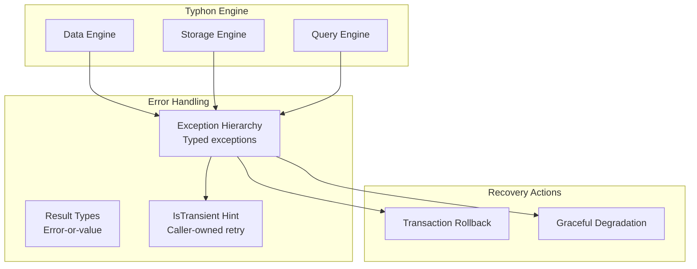

# Component 10: Error Handling & Resilience

> Consistent error model, exception hierarchy, and resilience patterns.

---

## Overview

The Error Handling component provides a unified approach to errors across Typhon, ensuring consistent behavior, useful diagnostics, and appropriate recovery strategies.



---

## Status: ✅ Implemented

The error handling system is fully implemented (Issue #36, completed). Research ([ErrorFoundationTimeoutActivation.md](../research/timeout/ErrorFoundationTimeoutActivation.md)) produced 12 design decisions. Four design documents ([reference/errors/](../reference/errors/)) cover the exception hierarchy (#37), deadline propagation (#38), exhaustion policy (#39), and Result types (#40). All sub-issues are closed and verified with tests.

---

## Sub-Components

| # | Name | Purpose | Status |
|---|------|---------|--------|
| **10.1** | [Exception Hierarchy](#101-exception-hierarchy) | Typed exceptions for different failures | ✅ Implemented (#37) |
| **10.2** | [Error Codes & Classification](#102-error-codes--classification) | Numeric codes by subsystem range | ✅ Implemented (#37) |
| **10.3** | [Recovery Strategies](#103-recovery-strategies) | Handling and retry patterns | ✅ Implemented (#38, #39) |

---

## 10.1 Exception Hierarchy

### Purpose

Provide a clear hierarchy of exceptions that callers can catch and handle appropriately.

### Proposed Hierarchy

> **Tier 1** classes (Issue #36) are marked with ★. Other classes are defined but reserved for later tiers.

```
TyphonException (base) ★
├── TyphonTimeoutException ★              catch (TyphonTimeoutException) → all timeouts
│   ├── LockTimeoutException ★            Tier 1 — lock acquisition timeout
│   ├── TransactionTimeoutException ★     Tier 1 class — throw sites activated in Tier 2
│   └── QueryTimeoutException             (reserved — Tier 7)
├── StorageException ★
│   ├── PageNotFoundException             (reserved)
│   ├── DiskIOException                   (reserved)
│   ├── CorruptionException ★             Tier 1
│   └── CapacityExceededException         (reserved)
├── ResourceExhaustedException ★          Tier 1 — re-parented directly under TyphonException
├── TransactionException                  (reserved — Tier 2+)
│   ├── TransactionConflictException
│   ├── TransactionAbortedException
│   └── TransactionStateException
├── ComponentException                    (reserved — Tier 3)
│   ├── ComponentNotFoundException
│   ├── ComponentSchemaException
│   └── ComponentValidationException
├── IndexException                        (reserved — Tier 4)
│   ├── IndexKeyNotFoundException
│   ├── DuplicateKeyException
│   └── IndexCorruptionException
├── QueryException                        (reserved — Tier 5)
│   ├── InvalidPredicateException
│   └── ViewExpiredException
├── DurabilityException                   (reserved — Tier 7)
│   ├── WalWriteException
│   ├── WalCorruptionException
│   ├── CheckpointFailedException
│   └── EpochVoidedException
└── ResourceException                     (reserved — added when DeadlockDetectedException arrives)
    └── DeadlockDetectedException
```

**Key Tier 1 design decisions** (see [research doc](../research/timeout/ErrorFoundationTimeoutActivation.md)):
- `TyphonTimeoutException` intermediate enables `catch (TyphonTimeoutException)` for all timeout types (D10)
- `ResourceExhaustedException` re-parented directly under `TyphonException`, no `ResourceException` intermediate in Tier 1 (D2)
- `LockTimeoutException` moved from `ResourceException` to `TyphonTimeoutException` (D10)
- No `Context` dictionary on base class — each subclass defines typed properties (D8)

### Base Exception

```csharp
public class TyphonException : Exception
{
    // Error code for programmatic handling
    public TyphonErrorCode ErrorCode { get; }

    // Is this error transient (might succeed on retry)?
    // Default: false — subclasses opt in explicitly via override.
    // TyphonTimeoutException → true, ResourceExhaustedException → true
    public virtual bool IsTransient => false;

    // No Context dictionary — each subclass defines typed properties (D8):
    //   LockTimeoutException → string ResourceName, TimeSpan WaitDuration
    //   ResourceExhaustedException → string ResourcePath, ResourceType, long CurrentUsage, long Limit
    //   CorruptionException → string ComponentName, int PageIndex

    // No ErrorCategory enum — the type hierarchy IS the classification (D1).
    // Callers catch specific types: catch (TyphonTimeoutException), catch (StorageException), etc.

    public TyphonException(TyphonErrorCode errorCode, string message)
        : base(message)
    {
        ErrorCode = errorCode;
    }

    public TyphonException(TyphonErrorCode errorCode, string message, Exception innerException)
        : base(message, innerException)
    {
        ErrorCode = errorCode;
    }
}
```

---

## 10.2 Error Codes & Classification

### Purpose

Provide numeric error codes organized by subsystem range for programmatic handling, logging, and metrics grouping. The exception type hierarchy provides classification — no separate `ErrorCategory` enum exists.

### Classification via Type Hierarchy

Instead of an `ErrorCategory` enum, the exception hierarchy itself provides classification:

| Catch Pattern | What It Catches | Typical Response |
|---------------|-----------------|------------------|
| `catch (TyphonTimeoutException)` | All timeouts (lock, transaction, query) | Caller retry (IsTransient = true) |
| `catch (StorageException)` | I/O, corruption, capacity | Log, alert if corruption |
| `catch (ResourceExhaustedException)` | Resource limits exceeded | Wait or fail (IsTransient = true) |
| `catch (TyphonException)` | Any engine error | Generic handler |

### Error Codes

```csharp
public enum TyphonErrorCode
{
    // Transaction errors (1xxx)
    TransactionConflict = 1001,
    TransactionTimeout = 1002,
    TransactionAborted = 1003,
    TransactionInvalidState = 1004,

    // Storage errors (2xxx)
    PageNotFound = 2001,
    DiskIOError = 2002,
    DataCorruption = 2003,
    StorageCapacityExceeded = 2004,

    // Component errors (3xxx)
    ComponentNotFound = 3001,
    ComponentSchemaInvalid = 3002,
    ComponentValidationFailed = 3003,

    // Index errors (4xxx)
    IndexKeyNotFound = 4001,
    DuplicateKey = 4002,
    IndexCorruption = 4003,

    // Query errors (5xxx)
    InvalidPredicate = 5001,
    QueryTimeout = 5002,
    ViewExpired = 5003,

    // Resource errors (6xxx)
    ResourceExhausted = 6001,
    DeadlockDetected = 6002,
    LockTimeout = 6003,

    // Durability errors (7xxx)
    WalWriteFailed = 7001,
    WalCorruption = 7002,
    CheckpointFailed = 7003,
    EpochVoided = 7004,
    RingBufferFull = 7005,
    WalSegmentExhausted = 7006,
}
```

---

## 10.3 Recovery Strategies

### Purpose

Define how errors are classified, escalated, and handled. The engine's role is to **throw structured exceptions** with enough information for callers to make retry decisions. The engine does **not** provide built-in retry loops.

### Design Principle: Throw, Don't Retry

The engine follows a strict separation of concerns:

- **Engine internals** throw `TyphonException` subclasses with `IsTransient` and `ErrorCode`. They never retry transaction-level operations.
- **Micro-retries** (spin-waits, page eviction loops) exist inside the engine for resource-level contention, bounded by `WaitContext` deadlines. These are safe because they retry *before* any mutation occurs.
- **Transaction-level retry** is the **caller's responsibility**. Only the caller knows their full state: external side effects, allocated resources, ordering dependencies. A generic retry wrapper cannot safely undo effects outside the transaction scope.

### Why Not a Built-In Retry Loop?

A generic `ExecuteWithRetry(Func<Transaction, T>)` helper assumes the lambda is pure — that rolling back the transaction resets *all* state. This is often false:

```csharp
// UNSAFE to auto-retry: external side effect before the failure point
ExecuteWithRetry(tx =>
{
    var id = tx.CreateEntity(ref player);
    networkLayer.BroadcastSpawn(id);     // already sent on attempt 1!
    tx.CreateEntity(ref inventory);       // ← timeout here
    // Retry: different entity ID, BroadcastSpawn fires again
});

// UNSAFE to auto-retry: caller state not reset by tx rollback
var slot = AllocateSlot();               // finite resource
ExecuteWithRetry(tx =>
{
    tx.CreateEntity(ref new SlotComp { SlotId = slot });  // ← conflict
    // Retry: slot already consumed, but lambda doesn't re-allocate
});
```

For a sample retry pattern the caller can adapt to their own needs, see [Appendix: Retry Pattern](#appendix-retry-pattern) at the end of this document.

### IsTransient: Information, Not Automation

`IsTransient` is a **hint** on the exception telling callers "this failure is temporary — retrying might succeed." The caller uses it to make their own decision:

```csharp
int attempts = 0;
while (true)
{
    try
    {
        using var tx = dbe.CreateQuickTransaction();
        var id = tx.CreateEntity(ref comp);
        tx.Commit();
        // Side effects AFTER commit — safe, won't re-execute on retry
        networkLayer.BroadcastSpawn(id);
        break;
    }
    catch (TyphonException ex) when (ex.IsTransient && ++attempts < 3)
    {
        // Caller controls what to undo and how long to wait
        Thread.Sleep(50 * attempts);
    }
}
```

The caller decides:
- Whether to retry at all (check `IsTransient`)
- How many attempts (their policy, not the engine's)
- What side effects to undo between retries (only they know)
- When to place side effects (after commit, not before)

### Two Levels of Retry in Typhon

| Level | Where | Mechanism | Example |
|-------|-------|-----------|---------|
| **Micro-retry** | Inside engine | `ExhaustionPolicy` + `WaitContext` | Page cache eviction loop, lock spin-wait |
| **Transaction retry** | Caller / UoW | Caller's own loop using `IsTransient` | Conflict retry, lock timeout retry |

Micro-retries are safe because they operate before mutations. Transaction retries require caller involvement because the caller owns external state.

### Error Escalation

<a href="../assets/typhon-error-escalation.svg">
  
</a>
<sub>D2 source: <code>assets/src/typhon-error-escalation.d2</code> — open <code>assets/viewer.html</code> for interactive pan-zoom</sub>

---

## Exception Usage Guidelines

### When to Throw

| Scenario | Exception | Rationale |
|----------|-----------|-----------|
| Entity not found | `ComponentNotFoundException` | Caller should handle missing data |
| Concurrent modification | `TransactionConflictException` | Caller should retry |
| Disk full | `CapacityExceededException` | Resource limit hit |
| Invalid schema | `ComponentSchemaException` | Configuration error |
| WAL write I/O failure | `WalWriteException` | Transient — retry, escalate to shutdown |
| Ring buffer full | `RingBufferFullException` | Back-pressure — wait or fail transaction |
| Epoch voided on recovery | `EpochVoidedException` | Informational — rolled back uncommitted UoW |
| Internal bug | `TyphonException` | Log and investigate |

### When NOT to Throw

| Scenario | Alternative | Rationale |
|----------|-------------|-----------|
| Expected empty result | Return `false` or empty | Normal operation |
| Timeout with fallback | Return `default` | Graceful degradation |
| Expected lookup miss | Return `Result<TValue, TStatus>` | Avoid exception overhead (see below) |

### Result Types for Hot Paths

For performance-critical paths, use `Result<TValue, TStatus>` instead of exceptions. The struct carries a value on success or a status code on failure — zero heap allocation in either case.

**Design principle:** Each subsystem defines its own `TStatus` enum with only the failure modes that method can produce. This makes the method signature self-documenting — the caller knows exactly what outcomes are possible without reading external documentation. Actual errors (corruption, I/O failure) remain exceptions; `Result` only handles expected, non-error outcomes.

```csharp
// ── Core struct ─────────────────────────────────────────────
// Convention: Success = 0 in all status enums
[StructLayout(LayoutKind.Sequential)]
public readonly struct Result<TValue, TStatus>
    where TValue : unmanaged
    where TStatus : unmanaged, Enum
{
    public readonly TValue Value;
    public readonly TStatus Status;

    // Constructor: success (status defaults to 0)
    public Result(TValue value) { Value = value; Status = default; }

    // Constructor: failure
    public Result(TStatus status) { Value = default; Status = status; }

    // Constructor: explicit both
    public Result(TValue value, TStatus status) { Value = value; Status = status; }

    public bool IsSuccess => Unsafe.As<TStatus, byte>(ref Unsafe.AsRef(in Status)) == 0;
    public bool IsFailure => !IsSuccess;
}

// ── Per-subsystem status enums ──────────────────────────────

public enum BTreeLookupStatus : byte
{
    Success = 0,
    NotFound = 1,
}

public enum RevisionReadStatus : byte
{
    Success = 0,
    NotFound = 1,          // entity never existed
    SnapshotInvisible = 2, // exists but created/modified after our snapshot
    Deleted = 3,           // tombstoned
}
```

**Design choice: public readonly fields, not validated properties.** The `Value` field is accessed directly after an `IsSuccess` check — no throwing getter, no branch overhead on the hot path. Callers must check `IsSuccess` before accessing `Value` (same discipline as `Nullable<T>`). This avoids adding a branch to every value access in tight loops. See [reference/errors/04-result-type.md](../reference/errors/04-result-type.md) for benchmark validation.

**Method signatures are the documentation:**

```csharp
// Caller sees exactly two outcomes (B+Tree always stores int chunk IDs)
Result<int, BTreeLookupStatus> TryGet(TKey key, ref ChunkAccessor accessor);

// Caller sees four outcomes — all specific to MVCC revision reads
Result<ComponentInfoBase.CompRevInfo, RevisionReadStatus> GetCompRevInfoFromIndex(
    long pk, ComponentInfoSingle info, long tick);
```

**Note:** Chunk access (`ChunkBasedSegment.GetChunkLocation`) is pure arithmetic — bounds violations are hard errors (corruption/programming bug), not expected outcomes. It remains an exception, not a `Result`.

**Usage:**

```csharp
var result = GetCompRevInfoFromIndex(pk, info, tick);
if (result.IsSuccess)
{
    var compRevInfo = result.Value;  // direct field access — no throwing getter
    // ... use compRevInfo
}
else
{
    switch (result.Status)
    {
        case RevisionReadStatus.NotFound:
            break; // entity never existed
        case RevisionReadStatus.SnapshotInvisible:
            break; // exists but not in our snapshot
        case RevisionReadStatus.Deleted:
            break; // tombstoned
    }
}
```

**Struct sizes** (all cache-friendly, per [ADR-027](../adr/027-even-sized-hot-path-structs.md)):

| Result Type | Value Size | Status | Padded Total |
|------------|-----------|--------|-------------|
| `Result<int, BTreeLookupStatus>` | 4 | 1 | 8 bytes |
| `Result<CompRevInfo, RevisionReadStatus>` | varies | 1 | varies |

---

## Logging Integration

All exceptions should be logged with context:

```csharp
try
{
    // Operation
}
catch (TyphonException ex)
{
    _logger.LogError(ex,
        "Operation failed: {ErrorCode} IsTransient={IsTransient}",
        ex.ErrorCode,
        ex.IsTransient);

    if (ex is CorruptionException)
    {
        // Alert operations team
        _alertService.RaiseAlert(AlertLevel.Critical, ex);
    }

    throw;
}
```

---

## Code Locations

| Component | Location | Status |
|-----------|----------|--------|
| Exception Hierarchy | `src/Typhon.Engine/Errors/` (TyphonException, LockTimeoutException, etc.) | ✅ Exists |
| Error Codes | `src/Typhon.Engine/Errors/TyphonErrorCode.cs` | ✅ Exists |
| ThrowHelper | `src/Typhon.Engine/Errors/ThrowHelper.cs` | ✅ Exists |
| Result Types | `src/Typhon.Engine/Errors/Result.cs` | ✅ Exists |
| BTreeLookupStatus | `src/Typhon.Engine/Data/Index/BTreeLookupStatus.cs` | ✅ Exists |
| RevisionReadStatus | `src/Typhon.Engine/Data/Revision/RevisionReadStatus.cs` | ✅ Exists |
| TimeoutOptions | `src/Typhon.Engine/Concurrency/TimeoutOptions.cs` | ✅ Exists |
| WaitContext | `src/Typhon.Engine/Concurrency/WaitContext.cs` | ✅ Exists |
| ExhaustionPolicy | `src/Typhon.Engine/Resources/ExhaustionPolicy.cs` | ✅ Exists |
| ResourceExhaustedException | `src/Typhon.Engine/Resources/ResourceExhaustedException.cs` | ✅ Exists |

---

## Design Decisions

| Question | Decision | Rationale |
|----------|----------|-----------|
| **Exception vs Result** | Exceptions for errors, Result for hot paths | Balance clarity with performance |
| **Hierarchy depth** | 2-3 levels | Enough specificity, not overwhelming |
| **Error codes** | Numeric by category | Easy logging, metrics grouping |
| **Retry ownership** | Caller, not engine | Engine throws; only the caller knows their side effects and can retry safely |

---

## Open Questions

1. ~~**Structured error responses?** - Should we have a `TyphonError` type for non-exception error handling?~~ **Closed: `Result<TValue, TStatus>` fills this role.** For hot-path methods, `Result` carries a status enum instead of throwing. See §10.1 "Result Types for Hot Paths".

2. ~~**Circuit breaker?** - Should we implement circuit breaker for repeated failures?~~ **Closed: No — not in the engine.** Typhon's internal failures are either self-resolving at microsecond scale (lock contention, resolved by `ExhaustionPolicy` + `WaitContext`) or fatal (corruption, disk failure → escalation to shutdown). Circuit breaker targets a middle ground ("dependency might recover in seconds") that doesn't exist inside an embedded engine. Circuit-breaking callers would actually prevent recovery by stopping the operations that free resources. Application-level circuit breaker (game server wrapping Typhon) is a valid pattern but is the caller's concern.

3. **Error telemetry?** - How detailed should error metrics be?

---

## Appendix: Retry Pattern

> **Note:** This is a **sample pattern** for application developers, not an engine-provided API. It is included here as a reference for callers who want a reusable retry helper for simple, pure-transaction workloads.

### When This Pattern Is Safe

The `ExecuteWithRetry` pattern below works **only** when:
- The lambda contains **only** Typhon transaction operations (no external side effects)
- Or all side effects are **idempotent** (safe to repeat)
- Or side effects are placed **after** `Commit()` (never re-executed on retry)

### IRetryPolicy Interface

```csharp
// Application-side interface — NOT part of Typhon.Engine
public interface IRetryPolicy
{
    bool ShouldRetry(TyphonException ex, int attemptNumber);
    TimeSpan GetDelay(int attemptNumber);
    int MaxAttempts { get; }
}

public class ExponentialBackoffPolicy : IRetryPolicy
{
    public int MaxAttempts { get; } = 3;
    public TimeSpan BaseDelay { get; } = TimeSpan.FromMilliseconds(50);

    public bool ShouldRetry(TyphonException ex, int attempt)
        => ex.IsTransient && attempt < MaxAttempts;

    public TimeSpan GetDelay(int attempt)
        => BaseDelay * Math.Pow(2, attempt - 1);
}
```

### ExecuteWithRetry Helper

```csharp
// Application-side helper — NOT part of Typhon.Engine
public T ExecuteWithRetry<T>(
    DatabaseEngine dbe,
    Func<Transaction, T> operation,
    IRetryPolicy policy)
{
    int attempt = 0;
    while (true)
    {
        attempt++;
        using var tx = dbe.CreateQuickTransaction();

        try
        {
            var result = operation(tx);
            tx.Commit();
            return result;
        }
        catch (TyphonException ex) when (policy.ShouldRetry(ex, attempt))
        {
            // Transaction rolled back by using-disposal.
            // Wait, then loop creates a fresh transaction.
            Thread.Sleep(policy.GetDelay(attempt));
        }
        // If ShouldRetry returns false, exception propagates — escalation.
    }
}
```

### Limitations

This helper **cannot** safely handle:
- External side effects (network calls, file writes, in-memory cache updates) performed inside the lambda before the failure point
- Caller-owned state (allocated slots, counters, IDs) that isn't reset by transaction rollback
- Non-idempotent operations where the retry would produce different results

For these cases, write a manual retry loop where you control undo logic between attempts. See §10.3 "IsTransient: Information, Not Automation" for the recommended manual pattern.
