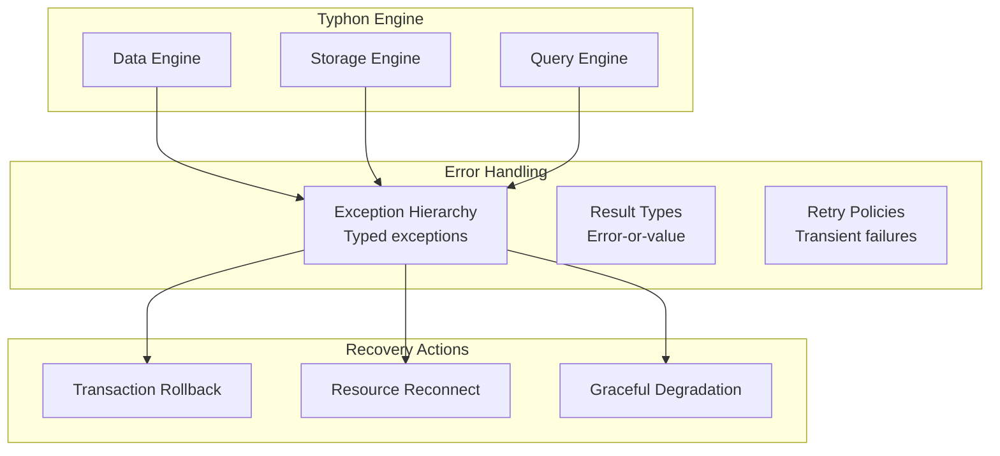

# Component 10: Error Handling & Resilience

> Consistent error model, exception hierarchy, and resilience patterns.

---

## Overview

The Error Handling component provides a unified approach to errors across Typhon, ensuring consistent behavior, useful diagnostics, and appropriate recovery strategies.



---

## Status: ⚠️ Scattered

Error handling exists throughout the codebase but lacks a unified approach. Exceptions are thrown but not organized into a coherent hierarchy.

---

## Sub-Components

| # | Name | Purpose | Status |
|---|------|---------|--------|
| **10.1** | [Exception Hierarchy](#101-exception-hierarchy) | Typed exceptions for different failures | ⚠️ Scattered |
| **10.2** | [Error Categories](#102-error-categories) | Classification of error types | 🆕 New |
| **10.3** | [Recovery Strategies](#103-recovery-strategies) | Handling and retry patterns | 🆕 New |

---

## 10.1 Exception Hierarchy

### Purpose

Provide a clear hierarchy of exceptions that callers can catch and handle appropriately.

### Proposed Hierarchy

```
TyphonException (base)
├── TransactionException
│   ├── TransactionConflictException
│   ├── TransactionTimeoutException
│   ├── TransactionAbortedException
│   └── TransactionStateException
├── StorageException
│   ├── PageNotFoundException
│   ├── DiskIOException
│   ├── CorruptionException
│   └── CapacityExceededException
├── ComponentException
│   ├── ComponentNotFoundException
│   ├── ComponentSchemaException
│   └── ComponentValidationException
├── IndexException
│   ├── IndexKeyNotFoundException
│   ├── DuplicateKeyException
│   └── IndexCorruptionException
├── QueryException
│   ├── InvalidPredicateException
│   ├── QueryTimeoutException
│   └── ViewExpiredException
├── DurabilityException
│   ├── WalWriteException
│   ├── WalCorruptionException
│   ├── CheckpointFailedException
│   └── EpochVoidedException
└── ResourceException
    ├── ResourceExhaustedException
    ├── DeadlockDetectedException
    └── LockTimeoutException
```

### Base Exception

```csharp
public class TyphonException : Exception
{
    // Error code for programmatic handling
    public TyphonErrorCode ErrorCode { get; }

    // Category for logging/metrics
    public ErrorCategory Category { get; }

    // Is this error transient (might succeed on retry)?
    public bool IsTransient { get; }

    // Additional context
    public IReadOnlyDictionary<string, object> Context { get; }

    public TyphonException(
        string message,
        TyphonErrorCode code,
        Exception? innerException = null)
        : base(message, innerException)
    {
        ErrorCode = code;
        Category = code.GetCategory();
        IsTransient = code.IsTransient();
    }
}
```

---

## 10.2 Error Categories

### Purpose

Classify errors to enable consistent handling and metrics.

### Categories

| Category | Description | Typical Response |
|----------|-------------|------------------|
| **Transient** | Temporary failures, retry may succeed | Automatic retry |
| **Conflict** | Concurrent modification conflicts | Transaction retry |
| **Resource** | Resource limits exceeded | Wait or fail |
| **Validation** | Invalid input or state | Report to caller |
| **Corruption** | Data integrity failure | Alert, stop |
| **Durability** | WAL/checkpoint failures | Retry or shutdown |
| **Configuration** | Setup/config problems | Fix and restart |
| **Internal** | Bugs, unexpected states | Log, report |

### Error Codes

```csharp
public enum TyphonErrorCode
{
    // Transaction errors (1xxx)
    TransactionConflict = 1001,
    TransactionTimeout = 1002,
    TransactionAborted = 1003,
    TransactionInvalidState = 1004,

    // Storage errors (2xxx)
    PageNotFound = 2001,
    DiskIOError = 2002,
    DataCorruption = 2003,
    StorageCapacityExceeded = 2004,

    // Component errors (3xxx)
    ComponentNotFound = 3001,
    ComponentSchemaInvalid = 3002,
    ComponentValidationFailed = 3003,

    // Index errors (4xxx)
    IndexKeyNotFound = 4001,
    DuplicateKey = 4002,
    IndexCorruption = 4003,

    // Query errors (5xxx)
    InvalidPredicate = 5001,
    QueryTimeout = 5002,
    ViewExpired = 5003,

    // Resource errors (6xxx)
    ResourceExhausted = 6001,
    DeadlockDetected = 6002,
    LockTimeout = 6003,

    // Durability errors (7xxx)
    WalWriteFailed = 7001,
    WalCorruption = 7002,
    CheckpointFailed = 7003,
    EpochVoided = 7004,
    RingBufferFull = 7005,
    WalSegmentExhausted = 7006,
}
```

---

## 10.3 Recovery Strategies

### Purpose

Define how to handle errors at different levels.

### Transient Error Retry

```csharp
public interface IRetryPolicy
{
    // Should we retry this error?
    bool ShouldRetry(TyphonException ex, int attemptNumber);

    // How long to wait before retry?
    TimeSpan GetDelay(int attemptNumber);

    // Max attempts
    int MaxAttempts { get; }
}

public class ExponentialBackoffPolicy : IRetryPolicy
{
    public int MaxAttempts { get; } = 3;
    public TimeSpan BaseDelay { get; } = TimeSpan.FromMilliseconds(100);

    public bool ShouldRetry(TyphonException ex, int attempt)
        => ex.IsTransient && attempt < MaxAttempts;

    public TimeSpan GetDelay(int attempt)
        => BaseDelay * Math.Pow(2, attempt - 1);
}
```

### Transaction Retry Pattern

```csharp
public async Task<T> ExecuteWithRetryAsync<T>(
    Func<Transaction, T> operation,
    IRetryPolicy policy)
{
    int attempt = 0;
    while (true)
    {
        attempt++;
        using var tx = _db.CreateTransaction();

        try
        {
            var result = operation(tx);
            tx.Commit();
            return result;
        }
        catch (TransactionConflictException ex) when (policy.ShouldRetry(ex, attempt))
        {
            // Rollback happens on dispose
            await Task.Delay(policy.GetDelay(attempt));
        }
    }
}
```

### Error Escalation

<a href="../assets/typhon-error-escalation.svg">
  
</a>
<sub>D2 source: <code>assets/src/typhon-error-escalation.d2</code> — open <code>assets/viewer.html</code> for interactive pan-zoom</sub>

---

## Exception Usage Guidelines

### When to Throw

| Scenario | Exception | Rationale |
|----------|-----------|-----------|
| Entity not found | `ComponentNotFoundException` | Caller should handle missing data |
| Concurrent modification | `TransactionConflictException` | Caller should retry |
| Disk full | `CapacityExceededException` | Resource limit hit |
| Invalid schema | `ComponentSchemaException` | Configuration error |
| WAL write I/O failure | `WalWriteException` | Transient — retry, escalate to shutdown |
| Ring buffer full | `RingBufferFullException` | Back-pressure — wait or fail transaction |
| Epoch voided on recovery | `EpochVoidedException` | Informational — rolled back uncommitted UoW |
| Internal bug | `TyphonException` (Internal) | Log and investigate |

### When NOT to Throw

| Scenario | Alternative | Rationale |
|----------|-------------|-----------|
| Expected empty result | Return `false` or empty | Normal operation |
| Timeout with fallback | Return `default` | Graceful degradation |
| Validation in hot path | Return `Result<T>` | Avoid exception overhead |

### Result Types for Hot Paths

```csharp
// For performance-critical paths, avoid exceptions
public readonly struct Result<T>
{
    public bool IsSuccess { get; }
    public T Value { get; }
    public TyphonError Error { get; }

    public static Result<T> Success(T value) => new(true, value, default);
    public static Result<T> Failure(TyphonError error) => new(false, default, error);
}

// Usage
public Result<PlayerComponent> TryReadPlayer(long entityId)
{
    if (!_table.TryGetRevision(entityId, out var revision))
        return Result<PlayerComponent>.Failure(TyphonError.NotFound);

    return Result<PlayerComponent>.Success(ReadComponent(revision));
}
```

---

## Logging Integration

All exceptions should be logged with context:

```csharp
try
{
    // Operation
}
catch (TyphonException ex)
{
    _logger.LogError(ex,
        "Operation failed: {ErrorCode} {Category}. Context: {@Context}",
        ex.ErrorCode,
        ex.Category,
        ex.Context);

    if (ex.Category == ErrorCategory.Corruption)
    {
        // Alert operations team
        _alertService.RaiseAlert(AlertLevel.Critical, ex);
    }

    throw;
}
```

---

## Code Locations (Planned)

| Component | Planned Location |
|-----------|------------------|
| Exception Hierarchy | `src/Typhon.Engine/Errors/Exceptions/` |
| Error Codes | `src/Typhon.Engine/Errors/TyphonErrorCode.cs` |
| Retry Policies | `src/Typhon.Engine/Errors/RetryPolicies/` |
| Result Types | `src/Typhon.Engine/Errors/Result.cs` |

---

## Design Decisions

| Question | Decision | Rationale |
|----------|----------|-----------|
| **Exception vs Result** | Exceptions for errors, Result for hot paths | Balance clarity with performance |
| **Hierarchy depth** | 2-3 levels | Enough specificity, not overwhelming |
| **Error codes** | Numeric by category | Easy logging, metrics grouping |
| **Retry policy** | Exponential backoff | Industry standard for transient errors |

---

## Open Questions

1. **Structured error responses?** - Should we have a `TyphonError` type for non-exception error handling?

2. **Circuit breaker?** - Should we implement circuit breaker for repeated failures?

3. **Error telemetry?** - How detailed should error metrics be?
