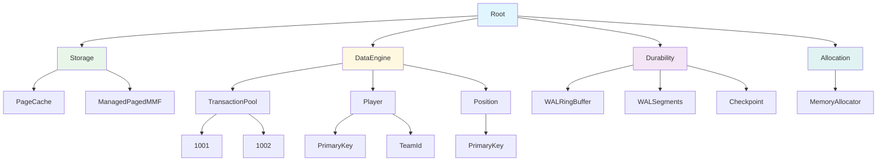
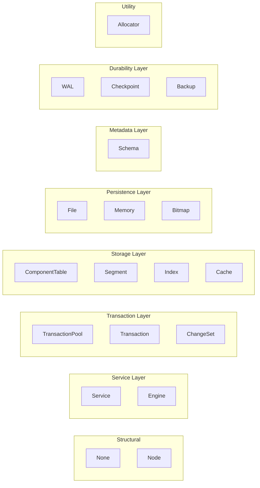
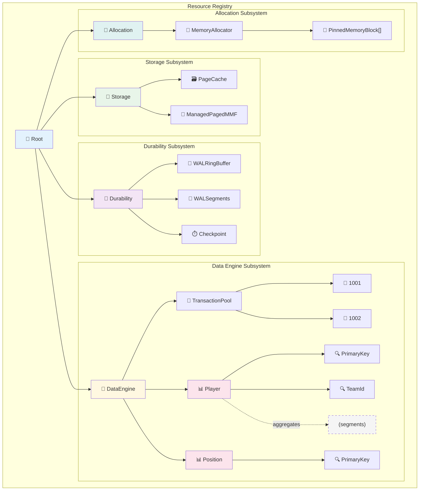
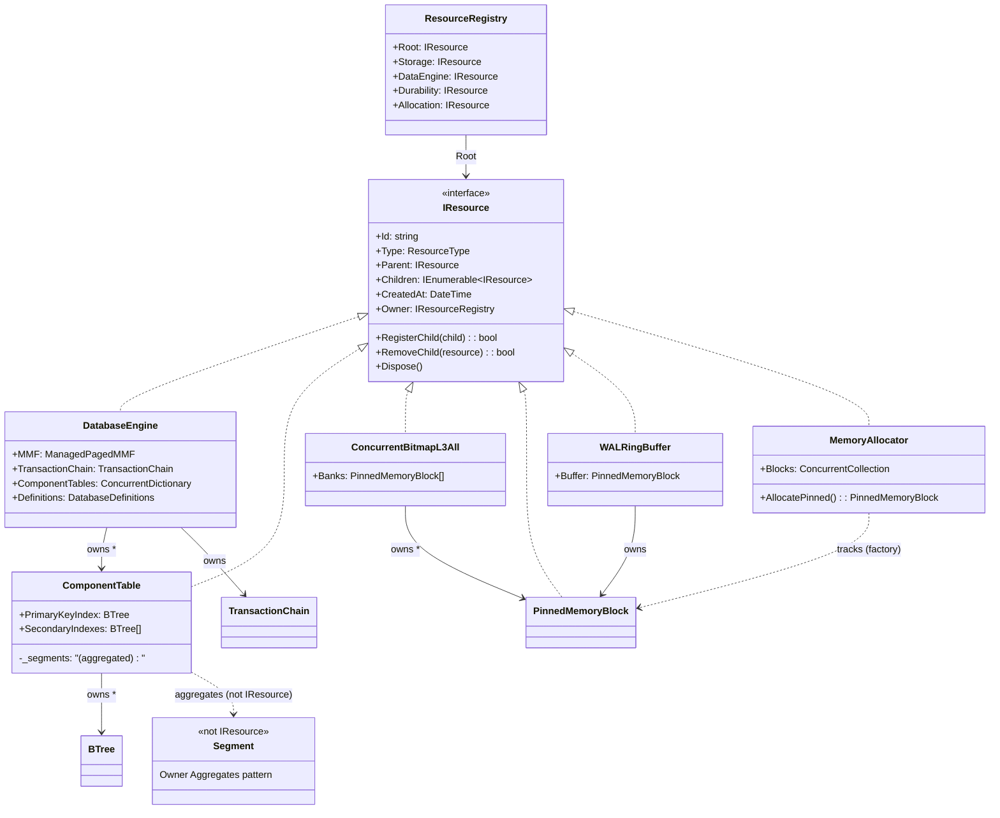
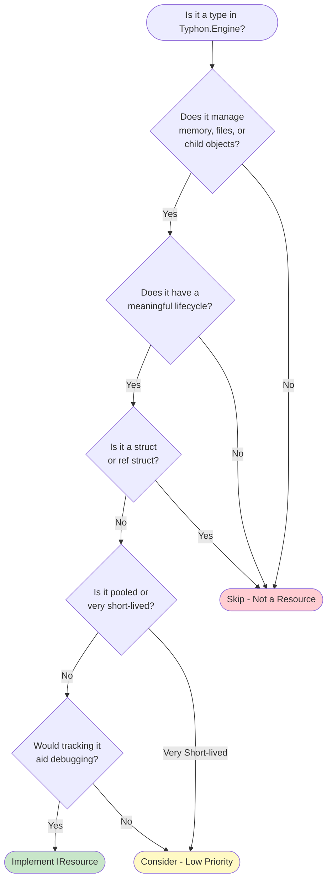
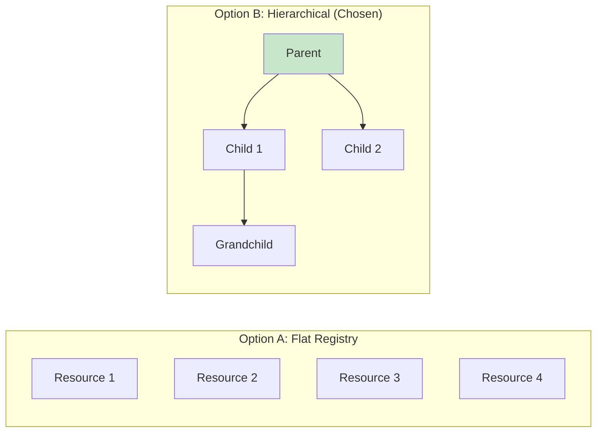
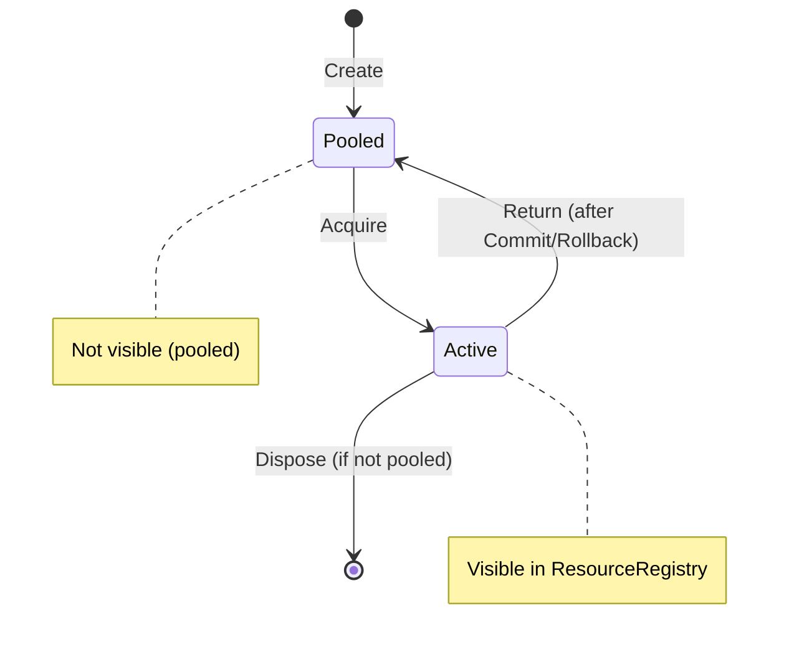

# 01 — Resource Registry & Tree Structure

> **Part of the [Resource System Design](README.md) series**

**Date:** January 2026
**Status:** Ready for implementation

---

## Overview

The **Resource Registry** is a hierarchical tracking system for all managed resources in the Typhon database engine. It provides:

- **Lifecycle Management**: Track creation, ownership, and disposal of resources
- **Hierarchical Organization**: Parent-child relationships reflecting logical ownership
- **Debug Visibility**: Runtime introspection of system state
- **Metric Integration**: Foundation for resource metrics (see [03-metric-source.md](03-metric-source.md))

> 💡 **Quick start:** For usage patterns and code examples, see [02-registry-examples.md](02-registry-examples.md).

---

## Table of Contents

1. [Core Concepts](#1-core-concepts)
2. [ResourceType Enum](#2-resourcetype-enum)
3. [Resource Hierarchy](#3-resource-hierarchy)
4. [Type Inventory](#4-type-inventory)
5. [Implementation Patterns](#5-implementation-patterns)
6. [Integration Examples](#6-integration-examples)
7. [Design Decisions](#7-design-decisions)
8. [Migration Guide](#8-migration-guide)

## Related Documents

| Document | Relationship |
|----------|--------------|
| [03-metric-source.md](03-metric-source.md) | How nodes report metrics via `IMetricSource` |
| [04-metric-kinds.md](04-metric-kinds.md) | The 6 metric types nodes can expose |
| [05-granularity-strategy.md](05-granularity-strategy.md) | What gets a node vs aggregated |
| [06-snapshot-api.md](06-snapshot-api.md) | Reading metrics from the tree |
| [08-observability-bridge.md](08-observability-bridge.md) | OTel export from resource metrics |

---

## 1. Core Concepts

### 1.1 What is a Resource?

A **Resource** is any object in Typhon that:
- Has a **lifecycle** (creation → usage → disposal)
- **Owns or manages** other objects, memory, or system handles
- Benefits from **visibility** during debugging or monitoring

### 1.2 The IResource Interface

```csharp
public interface IResource : IDisposable
{
    string Id { get; }                      // Unique identifier
    ResourceType Type { get; }              // Category of resource
    IResource Parent { get; }               // Owning resource (null for root)
    IEnumerable<IResource> Children { get; }// Owned resources
    DateTime CreatedAt { get; }             // Creation timestamp
    IResourceRegistry Owner { get; }        // Registry this belongs to

    bool RegisterChild(IResource child);    // Add child resource
    bool RemoveChild(IResource resource);   // Remove child resource
}
```

### 1.3 The Resource Registry

```csharp
public interface IResourceRegistry : IDisposable
{
    IResource Root { get; }      // Root of the resource tree

    // Subsystem grouping nodes (created automatically)
    IResource Storage { get; }      // PageCache, Segments
    IResource DataEngine { get; }   // Transactions, ComponentTables
    IResource Durability { get; }   // WAL, Checkpoint
    IResource Allocation { get; }   // MemoryAllocator, Bitmaps
}
```

> **Design decision:** No `Orphans` container. Resources must have an explicit parent — if `parent` is null, the constructor throws `ArgumentNullException`. This fails fast and surfaces bugs at the call site.

> **Scope:** One `IResourceRegistry` per process. Multiple `DatabaseEngine` instances are siblings under the same registry.

### 1.4 Resource Tree Structure



> **ID naming convention:** IDs are just names (`Player`, `PrimaryKey`, `1001`). Type information comes from the `ResourceType` property. This keeps paths clean and navigable: `DataEngine/Player/PrimaryKey`.
>
> **Note:** Segments (ComponentSegment, etc.) are NOT graph nodes — they follow the Owner Aggregates pattern. See [05-granularity-strategy.md](05-granularity-strategy.md).

---

## 2. ResourceType Enum

### 2.1 Legacy Definition (Reference Only)

> **Note:** This was the original incomplete definition. See §2.2 for the complete definition to implement.

```csharp
// OLD — do not use
public enum ResourceType
{
    None,
    Node,            // Generic grouping node
    Service,         // Top-level services
    Memory,          // Memory blocks
    File,            // File handles
    Synchronization, // Locks (removed — unused)
    Bitmap           // Hierarchical bitmaps
}
```

### 2.2 Complete Definition (Implement This)

```csharp
public enum ResourceType
{
    // ═══════════════════════════════════════════════════════════════
    // STRUCTURAL TYPES
    // ═══════════════════════════════════════════════════════════════

    /// <summary>No specific type assigned</summary>
    None = 0,

    /// <summary>Generic grouping node for hierarchy organization</summary>
    Node = 1,

    // ═══════════════════════════════════════════════════════════════
    // SERVICE LAYER
    // ═══════════════════════════════════════════════════════════════

    /// <summary>Top-level singleton services (MemoryAllocator, etc.)</summary>
    Service = 10,

    /// <summary>The main database engine instance</summary>
    Engine = 11,

    // ═══════════════════════════════════════════════════════════════
    // TRANSACTION LAYER
    // ═══════════════════════════════════════════════════════════════

    /// <summary>Transaction pool/chain managing active transactions</summary>
    TransactionPool = 20,

    /// <summary>Individual active transaction</summary>
    Transaction = 21,

    /// <summary>Pending changes within a transaction</summary>
    ChangeSet = 22,

    // ═══════════════════════════════════════════════════════════════
    // STORAGE LAYER
    // ═══════════════════════════════════════════════════════════════

    /// <summary>Per-component-type storage table</summary>
    ComponentTable = 30,

    /// <summary>Logical or chunk-based segment</summary>
    Segment = 31,

    /// <summary>B+Tree index structure</summary>
    Index = 32,

    /// <summary>Page cache subsystem</summary>
    Cache = 33,

    // ═══════════════════════════════════════════════════════════════
    // PERSISTENCE LAYER
    // ═══════════════════════════════════════════════════════════════

    /// <summary>Memory-mapped file or file handle</summary>
    File = 40,

    /// <summary>Memory block (pinned or array-backed)</summary>
    Memory = 41,

    /// <summary>Hierarchical bitmap for allocation tracking</summary>
    Bitmap = 42,

    // ═══════════════════════════════════════════════════════════════
    // METADATA LAYER
    // ═══════════════════════════════════════════════════════════════

    /// <summary>Schema definitions and metadata</summary>
    Schema = 50,

    // ═══════════════════════════════════════════════════════════════
    // UTILITY TYPES
    // ═══════════════════════════════════════════════════════════════

    /// <summary>Block allocator for fixed-size allocations</summary>
    Allocator = 60,

    // ═══════════════════════════════════════════════════════════════
    // DURABILITY LAYER
    // ═══════════════════════════════════════════════════════════════

    /// <summary>Write-ahead log resources (ring buffer, segments)</summary>
    WAL = 70,

    /// <summary>Checkpoint subsystem</summary>
    Checkpoint = 71,

    /// <summary>Backup/restore resources (shadow buffer, snapshot store)</summary>
    Backup = 72
}
```

### 2.3 ResourceType Hierarchy Diagram



---

## 3. Resource Hierarchy

### 3.1 Complete Resource Tree



> **Note:** Segments are shown with dashed border — they follow the **Owner Aggregates** pattern (NOT graph nodes). See [05-granularity-strategy.md](05-granularity-strategy.md). Memory blocks appear under their **consumer/owner**, not under `MemoryAllocator`.

### 3.2 Ownership Relationships

Every resource has **exactly one parent** (no orphans) and ownership is **strictly hierarchical** — the tree is acyclic with single-point-of-ownership. Disposing a parent cascades disposal to all children depth-first.

#### Subsystem-Level Ownership

| Owner | Owns | ResourceType | Relationship | Lifecycle |
|-------|------|--------------|--------------|-----------|
| **Root** | Storage, DataEngine, Durability, Allocation | `Node` | Structural | Fixed at registry startup |
| **Storage** | PagedMMF, ManagedPagedMMF | `File` | Composition | Created at engine init |
| **DataEngine** | DatabaseEngine(s) | `Engine` | Composition | Created at engine init |
| **Durability** | WALRingBuffer, WALSegments, Checkpoint | `WAL`, `Checkpoint` | Composition | Created at engine init |
| **Allocation** | MemoryAllocator, ConcurrentBitmapL3All | `Service`, `Bitmap` | Composition | Created at engine init |

#### Engine-Level Ownership

| Owner | Owns | ResourceType | Relationship | Lifecycle |
|-------|------|--------------|--------------|-----------|
| **DatabaseEngine** | ManagedPagedMMF | `File` | Composition | Tied to engine lifetime |
| **DatabaseEngine** | TransactionChain | `TransactionPool` | Composition | Tied to engine lifetime |
| **DatabaseEngine** | ComponentTable[] | `ComponentTable` | Dynamic | Created per `RegisterComponent<T>()` |
| **DatabaseEngine** | DatabaseDefinitions | `Schema` | Composition | Tied to engine lifetime |
| **TransactionChain** | Transaction[] (active) | `Transaction` | Dynamic (pooled) | Appear on `CreateTransaction()`, disappear on `Commit()`/`Rollback()` |
| **DatabaseDefinitions** | DBComponentDefinition[] | `Schema` | Dynamic | Created per registered component type |

#### Component Storage Ownership

| Owner | Owns | ResourceType | Relationship | Lifecycle |
|-------|------|--------------|--------------|-----------|
| **ComponentTable** | PrimaryKeyIndex | `Index` | Composition | Tied to table lifetime |
| **ComponentTable** | SecondaryIndex[] | `Index` | Dynamic | One per `[Index]`-annotated field |
| **ComponentTable** | Segments | *(not IResource)* | **Aggregation** | Owner Aggregates pattern — metrics via `IMetricSource` |

#### Memory Ownership

| Owner | Owns | ResourceType | Relationship | Lifecycle |
|-------|------|--------------|--------------|-----------|
| **MemoryAllocator** | *(tracks all blocks)* | — | Factory tracking | Allocator is factory; blocks register with their **consumer** parent |
| **Any IResource** (consumer) | PinnedMemoryBlock | `Memory` | Composition | Consumer owns the block; allocator only tracks it |
| **Any IResource** (consumer) | MemoryBlockArray | `Memory` | Composition | Same dual-ownership pattern as PinnedMemoryBlock |
| **ConcurrentBitmapL3All** | PinnedMemoryBlock[] (banks) | `Memory` | Composition | One block per bank; bitmap is the consumer/parent |

> **Dual ownership (Memory blocks):** Memory blocks have a special pattern — they hold references to both their **parent** (for tree structure) and their **allocator** (for lifetime tracking). On disposal, the block calls both `Parent.RemoveChild(this)` and `Allocator.Remove(this)`. The tree reflects *usage* hierarchy, not allocation origin.

#### Ownership Invariants

| Rule | Enforcement | Rationale |
|------|-------------|-----------|
| Every resource has exactly one Parent | Constructor throws `ArgumentNullException` on null | Single point of ownership, no orphans |
| Parent holds reference to all Children | `RegisterChild()` in constructor | Tree navigable parent → children |
| Child holds reference to Parent | `IResource.Parent` property (immutable after construction) | Tree navigable child → parent |
| Owner inherited from Parent | `Owner = Parent.Owner` in constructor | Single registry per tree |
| Disposal cascades depth-first | `Dispose()` iterates children before self-cleanup | Complete resource cleanup |

#### Class Diagram



---

## 4. Type Inventory

### 4.1 Types That SHOULD Implement IResource

#### 4.1.1 Core Engine Layer

| Type | ResourceType | Parent | Children | Priority |
|------|--------------|--------|----------|----------|
| `DatabaseEngine` | `Engine` | Services | MMF, TransactionChain, ComponentTables[] | **P0** |
| `TransactionChain` | `TransactionPool` | DatabaseEngine | (leaf — transactions are Owner Aggregated) | **P1** |

#### 4.1.2 Component Storage Layer

| Type | ResourceType | Parent | Children | Priority |
|------|--------------|--------|----------|----------|
| `ComponentTable` | `ComponentTable` | DatabaseEngine | All segments, indices | **P0** |

#### 4.1.3 Persistence Layer

| Type | ResourceType | Parent | Children | Priority |
|------|--------------|--------|----------|----------|
| `PagedMMF` | `File` | DatabaseEngine | PageCache memory | **P0** |
| `ManagedPagedMMF` | `File` | DatabaseEngine | OccupancyBitmap | **P0** |

> **Note:** Segments (LogicalSegment, ChunkBasedSegment, etc.) do NOT implement IResource. They follow the **Owner Aggregates** pattern — see [05-granularity-strategy.md](05-granularity-strategy.md). ComponentTable aggregates segment metrics via `IMetricSource` and provides drill-down via `IDebugPropertiesProvider`.

#### 4.1.4 Index Layer

| Type | ResourceType | Parent | Children | Priority |
|------|--------------|--------|----------|----------|
| `BTree<T>` (abstract) | `Index` | ComponentTable | NodeStorage segment | **P1** |
| `L16BTree`, `L32BTree`, `L64BTree`, `String64BTree` | `Index` | ComponentTable | (via base) | **P1** |
| All concrete BTrees (`LongSingleBTree`, etc.) | `Index` | ComponentTable | (via base) | **P1** |

#### 4.1.5 Memory Layer (Already Implemented ✅)

| Type | ResourceType | Parent | Children | Status |
|------|--------------|--------|----------|--------|
| `MemoryAllocator` | `Service` | Services | MemoryBlockBase[] | ✅ Done |
| `MemoryBlockBase` | `Memory` | Any | (leaf) | ✅ Done |
| `MemoryBlockArray` | `Memory` | Any | (leaf) | ✅ Done |
| `PinnedMemoryBlock` | `Memory` | Any | (leaf) | ✅ Done |

#### 4.1.6 Bitmap Layer (Partially Implemented)

| Type | ResourceType | Parent | Children | Status |
|------|--------------|--------|----------|--------|
| `ConcurrentBitmapL3All` | `Bitmap` | Any | PinnedMemoryBlock[] (banks) | ✅ Done |
| `ConcurrentBitmapL3Any` | `Bitmap` | Segment | PinnedMemoryBlock (if applicable) | Consider |

### 4.2 Types That Should NOT Implement IResource

| Type | Reason |
|------|--------|
| **Pooled / short-lived (Owner Aggregates)** | |
| `Transaction` | Pooled, microsecond-to-millisecond lifetime. Hot-path `RegisterChild`/`RemoveChild` overhead not justified. `TransactionChain` exposes diagnostics (active count, contention) via `IDebugPropertiesProvider` instead. |
| `ChangeSet` | Ephemeral, transaction-scoped. Even shorter-lived than Transaction. No diagnostic value as a tree node. |
| **Static metadata** | |
| `DatabaseDefinitions` | Static registry of schemas, created once at startup. No managed resources, no lifecycle. `DatabaseEngine` exposes schema count and names via `IDebugPropertiesProvider`. |
| `DBComponentDefinition` | Immutable schema metadata per component type. Pure data, no resources to track. |
| **Segments (Owner Aggregates)** | |
| `LogicalSegment` | Owner Aggregates — ComponentTable aggregates via `IMetricSource` |
| `ChunkBasedSegment` | Owner Aggregates — see [05-granularity-strategy.md](05-granularity-strategy.md) |
| `VariableSizedBufferSegmentBase` | Owner Aggregates — drill-down via `IDebugPropertiesProvider` |
| `StringTableSegment` | Owner Aggregates |
| **Stack-allocated / ref structs** | |
| `ChunkAccessor` | Stack-allocated ~303B ref struct with SOA layout and SIMD search |
| `ComponentRevisionManager` | `ref struct`, transaction-scoped |
| `ComponentRevision` | `ref struct`, ephemeral |
| `RevisionEnumerator` | Scoped iteration utility |
| `RevisionWalker` | Scoped traversal utility |
| **Embedded primitives** | |
| `AccessControl` | 8-byte struct embedded in other types |
| `AccessControlSmall` | 4-byte struct embedded in other types |
| `AdaptiveWaiter` | Utility with no state |
| **Generic containers** | |
| `ConcurrentArray<T>` | Generic container, no specific lifecycle |
| `ConcurrentCollection<T>` | Generic container |
| `ComponentCollection<T>` | 4-byte struct (buffer ID reference) |
| `BitmapL3Any` | Simple utility class |
| `ConcurrentBitmap` | Simple single-level bitmap |

### 4.3 Decision Matrix



---

## 5. Implementation Patterns

### 5.1 Pattern 1: Service Base Class

Use for top-level singleton services that register under `Services`:

```csharp
public abstract class ServiceBase : IResource
{
    protected ServiceBase(string id, IResourceRegistry owner)
    {
        Id = id;
        Owner = owner;
        Parent = Owner.RegisterService(this);  // Auto-registers under Services
        CreatedAt = DateTime.UtcNow;
    }

    public abstract void Dispose();

    public string Id { get; }
    public ResourceType Type => ResourceType.Service;
    public IResource Parent { get; }
    public IEnumerable<IResource> Children => [];
    public DateTime CreatedAt { get; }
    public IResourceRegistry Owner { get; }

    public bool RegisterChild(IResource child) => throw new NotSupportedException();
    public bool RemoveChild(IResource resource) => throw new NotSupportedException();
}

// Usage:
public class MemoryAllocator : ServiceBase, IMemoryAllocator
{
    public MemoryAllocator(IResourceRegistry registry, MemoryAllocatorOptions options)
        : base(options?.Name ?? "MemoryAllocator", registry)
    {
        // Service is automatically registered
    }
}
```

### 5.2 Pattern 2: Standard Resource with Children

Use for resources that own other resources:

```csharp
public class DatabaseEngine : IResource, IDisposable
{
    private readonly ConcurrentDictionary<string, IResource> _children = new();

    public DatabaseEngine(IResourceRegistry registry, DatabaseEngineOptions options)
    {
        Id = options?.Name ?? "DatabaseEngine";
        Owner = registry;
        Parent = registry.RegisterService(this);
        CreatedAt = DateTime.UtcNow;

        // Create child resources, passing 'this' as parent
        MMF = new ManagedPagedMMF(this, mmfOptions);
        TransactionChain = new TransactionChain(this);
    }

    // IResource implementation
    public string Id { get; }
    public ResourceType Type => ResourceType.Engine;
    public IResource Parent { get; }
    public IEnumerable<IResource> Children => _children.Values;
    public DateTime CreatedAt { get; }
    public IResourceRegistry Owner { get; }

    public bool RegisterChild(IResource child)
    {
        return _children.TryAdd(child.Id, child);
    }

    public bool RemoveChild(IResource resource)
    {
        return _children.TryRemove(resource.Id, out _);
    }

    public void Dispose()
    {
        // Dispose children in reverse creation order (or specific order)
        foreach (var child in _children.Values.Reverse())
        {
            child.Dispose();
        }
        _children.Clear();

        Parent?.RemoveChild(this);
        GC.SuppressFinalize(this);
    }
}
```

### 5.3 Pattern 3: Leaf Resource (No Children)

Use for resources that don't own other resources:

```csharp
public class ChunkBasedSegment : LogicalSegment, IResource
{
    public ChunkBasedSegment(string id, IResource parent, /* other params */)
    {
        Id = id;
        Parent = parent ?? throw new ArgumentNullException(nameof(parent));
        Owner = parent.Owner;
        CreatedAt = DateTime.UtcNow;

        // Register with parent
        Parent.RegisterChild(this);

        // Create owned bitmap (it will register itself as our child)
        _occupancyBitmap = new ConcurrentBitmapL3All($"{id}_Occupancy", this, capacity);
    }

    // IResource implementation
    public string Id { get; }
    public ResourceType Type => ResourceType.Segment;
    public IResource Parent { get; }
    public IEnumerable<IResource> Children => [_occupancyBitmap];
    public DateTime CreatedAt { get; }
    public IResourceRegistry Owner { get; }

    public bool RegisterChild(IResource child) => false; // Managed internally
    public bool RemoveChild(IResource resource) => false;

    public override void Dispose()
    {
        _occupancyBitmap?.Dispose();
        Parent?.RemoveChild(this);
        base.Dispose();
    }
}
```

### 5.4 Pattern 4: Resource with Dynamic Children

Use when children are created/destroyed dynamically:

```csharp
public class TransactionChain : IResource
{
    private readonly ConcurrentDictionary<string, Transaction> _activeTransactions = new();

    public TransactionChain(IResource parent)
    {
        Id = "TransactionChain";
        Parent = parent;
        Owner = parent.Owner;
        CreatedAt = DateTime.UtcNow;
        Parent.RegisterChild(this);
    }

    public Transaction CreateTransaction()
    {
        var txn = new Transaction($"T-{Interlocked.Increment(ref _txnCounter)}", this);
        _activeTransactions.TryAdd(txn.Id, txn);
        return txn;
    }

    internal void ReturnTransaction(Transaction txn)
    {
        _activeTransactions.TryRemove(txn.Id, out _);
        // Return to pool...
    }

    // IResource
    public IEnumerable<IResource> Children => _activeTransactions.Values;

    public bool RegisterChild(IResource child)
    {
        if (child is Transaction txn)
            return _activeTransactions.TryAdd(txn.Id, txn);
        return false;
    }

    public bool RemoveChild(IResource resource)
    {
        if (resource is Transaction txn)
            return _activeTransactions.TryRemove(txn.Id, out _);
        return false;
    }
}
```

### 5.5 Pattern 5: Self-Registering Resource

Resources that register themselves with their parent:

```csharp
public class ConcurrentBitmapL3All : IResource
{
    public ConcurrentBitmapL3All(string id, IResource parent, int bankCapacity)
    {
        // Fail fast — no orphans, explicit parent required
        Id = id ?? throw new ArgumentNullException(nameof(id));
        Parent = parent ?? throw new ArgumentNullException(nameof(parent),
            "Resources must have an explicit parent.");
        Owner = Parent.Owner;
        CreatedAt = DateTime.UtcNow;

        // Self-register with parent
        Parent.RegisterChild(this);

        // Create first bank (PinnedMemoryBlock registers itself with us)
        _banks = [new Bank(this, 0)];
    }

    // Bank creates PinnedMemoryBlock with 'this' as parent
    private class Bank : IDisposable
    {
        public Bank(ConcurrentBitmapL3All owner, int index)
        {
            // Memory blocks are owned by their consumer, not the allocator
            var allocator = owner.Owner.Allocation.Children
                .OfType<IMemoryAllocator>().First();
            MemoryBlock = allocator.AllocatePinned($"Bank{index}", owner, size, zeroed: true, alignment: 64);
        }
    }

    public IEnumerable<IResource> Children => _banks.Select(b => b.MemoryBlock);
}
```

> **Note:** Resources are always created with explicit parents. There is no Orphans container — if parent is null, the constructor throws immediately. This surfaces bugs at the exact call site where the fix is needed.

---

## 6. Integration Examples

### 6.1 DI Registration

```csharp
// In Startup.cs or Program.cs
public static IServiceCollection AddTyphon(this IServiceCollection services)
{
    // Register the resource registry as singleton (one per process)
    services.AddSingleton<IResourceRegistry>(sp =>
    {
        return new ResourceRegistry(new ResourceRegistryOptions { Name = "Typhon" });
        // Note: No static accessor — use DI everywhere
    });

    // Register MemoryAllocator (registers under Allocation subsystem)
    services.AddSingleton<IMemoryAllocator>(sp =>
    {
        var registry = sp.GetRequiredService<IResourceRegistry>();
        return new MemoryAllocator("MemoryAllocator", registry.Allocation,
            new MemoryAllocatorOptions());
    });

    // Register DatabaseEngine components under their subsystems
    services.AddSingleton<DatabaseEngine>(sp =>
    {
        var registry = sp.GetRequiredService<IResourceRegistry>();
        var logger = sp.GetRequiredService<ILogger<DatabaseEngine>>();

        // Components register under appropriate subsystems:
        // - PageCache → registry.Storage
        // - TransactionPool → registry.DataEngine
        // - WAL → registry.Durability
        return new DatabaseEngine(registry, new DatabaseEngineOptions(), logger);
    });

    return services;
}
```

### 6.2 Querying the Resource Tree

```csharp
public class ResourceInspector
{
    private readonly IResourceRegistry _registry;

    public ResourceInspector(IResourceRegistry registry)
    {
        _registry = registry;
    }

    /// <summary>
    /// Print the entire resource tree to console
    /// </summary>
    public void DumpTree()
    {
        PrintResource(_registry.Root, 0);
    }

    private void PrintResource(IResource resource, int depth)
    {
        var indent = new string(' ', depth * 2);
        var icon = GetIcon(resource.Type);
        Console.WriteLine($"{indent}{icon} {resource.Id} ({resource.Type})");

        foreach (var child in resource.Children)
        {
            PrintResource(child, depth + 1);
        }
    }

    private string GetIcon(ResourceType type) => type switch
    {
        ResourceType.Node => "📁",
        ResourceType.Service => "🔧",
        ResourceType.Engine => "🗄️",
        ResourceType.File => "📄",
        ResourceType.Memory => "💾",
        ResourceType.Bitmap => "🗺️",
        ResourceType.Segment => "📦",
        ResourceType.Index => "🔍",
        ResourceType.ComponentTable => "📊",
        ResourceType.Transaction => "📝",
        ResourceType.TransactionPool => "🔄",
        ResourceType.Schema => "📋",
        ResourceType.Cache => "🗃️",
        ResourceType.WAL => "🔄",
        ResourceType.Checkpoint => "⏱️",
        ResourceType.Backup => "💾",
        ResourceType.Allocator => "🔧",
        _ => "❓"
    };

    /// <summary>
    /// Find all resources of a specific type
    /// </summary>
    public IEnumerable<IResource> FindByType(ResourceType type)
    {
        return EnumerateAll(_registry.Root).Where(r => r.Type == type);
    }

    /// <summary>
    /// Find a resource by path (e.g., "Services/DatabaseEngine/ComponentTables/Player")
    /// </summary>
    public IResource FindByPath(string path)
    {
        var parts = path.Split('/');
        IResource current = _registry.Root;

        foreach (var part in parts)
        {
            current = current.Children.FirstOrDefault(c => c.Id == part);
            if (current == null) return null;
        }

        return current;
    }

    /// <summary>
    /// Get memory usage summary
    /// </summary>
    public (int count, long totalBytes) GetMemoryStats()
    {
        var memoryResources = FindByType(ResourceType.Memory)
            .OfType<IMemoryResource>()
            .ToList();

        return (memoryResources.Count, memoryResources.Sum(m => m.Size));
    }

    private IEnumerable<IResource> EnumerateAll(IResource root)
    {
        yield return root;
        foreach (var child in root.Children)
        {
            foreach (var descendant in EnumerateAll(child))
            {
                yield return descendant;
            }
        }
    }
}
```

### 6.3 Debug Snapshot Collection

```csharp
public interface IDebugPropertiesProvider
{
    /// <summary>
    /// Returns debug properties for diagnostic inspection.
    /// Called infrequently (debugging, snapshots) — not on hot path.
    /// </summary>
    IReadOnlyDictionary<string, object> GetDebugProperties();
}

public static class ResourceExtensions
{
    /// <summary>
    /// Collect a snapshot of all debug properties from the resource tree
    /// </summary>
    public static Dictionary<string, Dictionary<string, object>> CollectDebugSnapshot(
        this IResourceRegistry registry)
    {
        var snapshot = new Dictionary<string, Dictionary<string, object>>();
        CollectFromResource(registry.Root, "", snapshot);
        return snapshot;
    }

    private static void CollectFromResource(
        IResource resource,
        string path,
        Dictionary<string, Dictionary<string, object>> snapshot)
    {
        var fullPath = string.IsNullOrEmpty(path) ? resource.Id : $"{path}/{resource.Id}";

        var properties = new Dictionary<string, object>
        {
            ["Type"] = resource.Type.ToString(),
            ["CreatedAt"] = resource.CreatedAt,
            ["ChildCount"] = resource.Children.Count()
        };

        // Add debug properties if available
        if (resource is IDebugPropertiesProvider provider)
        {
            try
            {
                foreach (var (key, value) in provider.GetDebugProperties())
                {
                    properties[key] = value;
                }
            }
            catch (Exception ex)
            {
                properties["_debugPropertiesError"] = ex.Message;
            }
        }

        snapshot[fullPath] = properties;

        foreach (var child in resource.Children)
        {
            CollectFromResource(child, fullPath, snapshot);
        }
    }
}

// Usage in a resource:
public class ComponentTable : IResource, IDebugPropertiesProvider
{
    public IReadOnlyDictionary<string, object> GetDebugProperties()
    {
        return new Dictionary<string, object>
        {
            ["EntityCount"] = _primaryKeyIndex.Count,
            ["RevisionCount"] = _revisionSegment.AllocatedChunks,
            ["IndexCount"] = _secondaryIndexes.Count,
            ["SegmentPageCount"] = _componentSegment.PageCount
        };
    }
}
```

### 6.4 Unit Test Example

```csharp
[TestFixture]
public class ResourceRegistryTests : TestBase
{
    [Test]
    public void ComponentTable_RegistersUnderDataEngine()
    {
        // Arrange
        var registry = ServiceProvider.GetRequiredService<IResourceRegistry>();
        var dbe = ServiceProvider.GetRequiredService<DatabaseEngine>();

        // Act
        dbe.RegisterComponent<TestComponent>();

        // Assert — ComponentTable appears under DataEngine subsystem
        var componentTables = registry.DataEngine.Children
            .Where(c => c.Type == ResourceType.ComponentTable)
            .ToList();

        Assert.That(componentTables, Has.Count.EqualTo(1));
        Assert.That(componentTables[0].Id, Is.EqualTo("TestComponent")); // Name only, no type prefix

        // Verify path is clean
        var player = registry.FindByPath("DataEngine/TestComponent");
        Assert.That(player, Is.Not.Null);
    }

    [Test]
    public void Dispose_CascadesToAllChildren()
    {
        // Arrange
        var registry = new ResourceRegistry(new ResourceRegistryOptions { Name = "Test" });
        var node = new ResourceNode("TestNode", ResourceType.Node, registry.DataEngine);
        var childNode = new ResourceNode("ChildNode", ResourceType.Node, node);

        // Act
        registry.Dispose();

        // Assert - both nodes should be disposed (Children cleared)
        Assert.That(registry.Root.Children, Is.Empty);
    }

    [Test]
    public void MemoryAllocation_TracksUnderOwner()
    {
        // Arrange
        var registry = ServiceProvider.GetRequiredService<IResourceRegistry>();
        var allocator = ServiceProvider.GetRequiredService<IMemoryAllocator>();

        // Create a parent resource to own the memory block
        var owner = new ResourceNode("TestOwner", ResourceType.Node, registry.Allocation);

        // Act — memory block is owned by consumer, not allocator
        var block = allocator.AllocatePinned("TestBlock", owner, 1024);

        // Assert — block appears under owner, not under MemoryAllocator
        Assert.That(owner.Children.Any(c => c.Id == "TestBlock"), Is.True);

        // Cleanup
        block.Dispose();
        owner.Dispose();
    }

    [Test]
    public void NullParent_ThrowsArgumentNullException()
    {
        // Resources must have explicit parent — no Orphans fallback
        Assert.Throws<ArgumentNullException>(() =>
            new ResourceNode("Test", ResourceType.Node, null));
    }

    private IEnumerable<IResource> EnumerateAll(IResource root)
    {
        yield return root;
        foreach (var child in root.Children.SelectMany(EnumerateAll))
            yield return child;
    }
}
```

---

## 7. Design Decisions

### 7.1 Why Hierarchical Resources?



**Reasons for hierarchical design:**
1. **Natural ownership**: Resources naturally own other resources (DBE → ComponentTable → Segment)
2. **Cascade disposal**: Disposing parent disposes all children automatically
3. **Scoped queries**: "Find all segments under ComponentTable:Player"
4. **Debugging context**: See which parent created a leaked resource

### 7.2 Why Self-Registration?

Resources register themselves with their parent in their constructor:

```csharp
public ChunkBasedSegment(string id, IResource parent, ...)
{
    Parent = parent;
    Parent.RegisterChild(this);  // Self-registration
}
```

**Benefits:**
- Ensures every resource is tracked (can't forget to register)
- Parent-child relationship established atomically
- Simplifies factory patterns

**Alternative considered:** Factory-only creation
- Rejected because it adds ceremony and doesn't prevent leaks

### 7.3 Transaction Tracking Strategy

**Decision:** Track transactions as resources, but with awareness of pooling.



**Rationale:**
- Active transactions are important for debugging (who's holding locks?)
- Pooled transactions don't need visibility
- Overhead is acceptable since transaction count is bounded

### 7.4 Memory Overhead Analysis

| IResource Implementation | Memory Overhead |
|--------------------------|-----------------|
| `Id` (string) | ~40 bytes (typical) |
| `Parent` (reference) | 8 bytes |
| `Owner` (reference) | 8 bytes |
| `CreatedAt` (DateTime) | 8 bytes |
| `_children` (ConcurrentDictionary) | ~80 bytes empty |
| **Total** | **~144 bytes minimum** |

**Mitigation strategies:**
1. Don't track very short-lived objects (accessors, ref structs)
2. Use lightweight leaf pattern (no `_children` dictionary)
3. Consider conditional tracking (debug builds only) for high-frequency types

### 7.5 Thread Safety

All `IResource` implementations must be thread-safe:

| Operation | Thread Safety Mechanism |
|-----------|------------------------|
| `RegisterChild` | `ConcurrentDictionary.TryAdd` |
| `RemoveChild` | `ConcurrentDictionary.TryRemove` |
| `Children` enumeration | Snapshot via `.Values` |
| `Dispose` | Idempotent, removes from parent |

**Warning:** `Children` enumeration may see inconsistent state during concurrent modification. This is acceptable for debugging/monitoring but not for critical logic.

### 7.6 Additional Design Decisions

| Question | Decision | Rationale |
|----------|----------|-----------|
| **Orphans container?** | No — fail fast | Null parent throws `ArgumentNullException`. Surfaces bugs at exact call site. |
| **Static accessor?** | No — DI only | Better testability, supports multiple engines, explicit dependencies. |
| **ID naming** | Name only | Type info from `ResourceType` property. Clean paths like `DataEngine/Player`. |
| **Memory block ownership** | Under consumer | Allocator is a factory; consumer owns the block. Tree reflects usage hierarchy. |
| **Disposal errors** | Log and continue | Don't abort on child failure. Ensures all children get disposal attempt. |
| **Transaction visibility** | Active only | Appear on `CreateTransaction()`, disappear on `Commit()`/`Rollback()`. Pooled = invisible. |
| **Registry scope** | One per process | Multiple engines are siblings under same registry. Simpler design. |
| **Tree structure** | Subsystem grouping | Storage, DataEngine, Durability, Allocation. Enables scoped queries. |

---

## 8. Migration Guide

### 8.1 Step 1: Add IResource to Existing Types

```csharp
// Before
public class ComponentTable : IDisposable
{
    public void Dispose() { /* ... */ }
}

// After
public class ComponentTable : IResource, IDisposable
{
    private readonly ConcurrentDictionary<string, IResource> _children = new();

    public ComponentTable(string name, IResource parent, /* ... */)
    {
        Id = name;
        Parent = parent ?? throw new ArgumentNullException(nameof(parent));
        Owner = parent.Owner;
        CreatedAt = DateTime.UtcNow;
        Parent.RegisterChild(this);

        // Existing initialization...
    }

    // IResource implementation
    public string Id { get; }
    public ResourceType Type => ResourceType.ComponentTable;
    public IResource Parent { get; }
    public IEnumerable<IResource> Children => _children.Values;
    public DateTime CreatedAt { get; }
    public IResourceRegistry Owner { get; }

    public bool RegisterChild(IResource child) => _children.TryAdd(child.Id, child);
    public bool RemoveChild(IResource resource) => _children.TryRemove(resource.Id, out _);

    public void Dispose()
    {
        // Dispose children first
        foreach (var child in _children.Values)
        {
            child.Dispose();
        }
        _children.Clear();

        // Remove from parent
        Parent?.RemoveChild(this);

        // Existing disposal logic...
        GC.SuppressFinalize(this);
    }
}
```

### 8.2 Step 2: Update Constructors to Accept Parent

```csharp
// Before
public ChunkBasedSegment(ManagedPagedMMF mmf, int chunkSize)

// After
public ChunkBasedSegment(string id, IResource parent, ManagedPagedMMF mmf, int chunkSize)
```

### 8.3 Step 3: Update Child Creation

```csharp
// Before
_componentSegment = new ChunkBasedSegment(MMF, componentSize);

// After
_componentSegment = new ChunkBasedSegment(
    $"{Id}_ComponentData",  // Descriptive ID
    this,                    // Parent is ComponentTable
    MMF,
    componentSize);
```

### 8.4 Step 4: Add Debug Properties (Optional)

```csharp
public class ComponentTable : IResource, IDebugPropertiesProvider
{
    public IReadOnlyDictionary<string, object> GetDebugProperties()
    {
        return new Dictionary<string, object>
        {
            ["EntityCount"] = _primaryKeyIndex.Count,
            ["RevisionCount"] = _revisionSegment.AllocatedChunks,
            ["MemoryUsageMB"] = EstimateMemoryUsage() / (1024.0 * 1024.0)
        };
    }
}
```

### 8.5 Migration Checklist

- [ ] Identify all types that should implement `IResource` (see Type Inventory)
- [ ] Add `IResource` interface to each type
- [ ] Update constructors to accept `IResource parent` parameter
- [ ] Implement self-registration in constructor
- [ ] Update `Dispose()` to cascade to children and remove from parent
- [ ] Update all call sites to pass parent reference
- [ ] Add unit tests for registration and disposal
- [ ] (Optional) Implement `IDebugPropertiesProvider`
- [ ] (Optional) Add OpenTelemetry metrics

---

## Appendix A: Quick Reference

### Resource Creation Pattern

```csharp
public class MyResource : IResource
{
    public MyResource(string id, IResource parent)
    {
        // Fail fast — explicit parent required
        Id = id ?? throw new ArgumentNullException(nameof(id));
        Parent = parent ?? throw new ArgumentNullException(nameof(parent),
            "Resources must have an explicit parent.");
        Owner = Parent.Owner;
        CreatedAt = DateTime.UtcNow;
        Parent.RegisterChild(this);
    }
}
```

### Resource Disposal Pattern

```csharp
public void Dispose()
{
    if (_disposed) return;
    _disposed = true;

    // 1. Dispose children — log and continue on errors
    foreach (var child in Children.ToList())
    {
        try
        {
            child.Dispose();
        }
        catch (Exception ex)
        {
            // Log but don't abort — ensure all children get disposal attempt
            _logger?.LogError(ex, "Failed to dispose child {ChildId}", child.Id);
        }
    }

    // 2. Remove from parent
    Parent?.RemoveChild(this);

    // 3. Release own resources
    // ...

    GC.SuppressFinalize(this);
}
```

> **Error handling:** If a child's `Dispose()` throws, we log the error and continue disposing remaining children. This ensures cleanup is as complete as possible.

### Finding Resources

```csharp
// By type
var segments = registry.FindByType(ResourceType.Segment);

// By path (clean names, not type prefixes)
var player = registry.FindByPath("DataEngine/Player");
var primaryKey = registry.FindByPath("DataEngine/Player/PrimaryKey");
var walRing = registry.FindByPath("Durability/WAL/RingBuffer");

// Memory stats
var (count, bytes) = new ResourceInspector(registry).GetMemoryStats();
```

---

## Appendix B: Glossary

| Term | Definition |
|------|------------|
| **Resource** | Any tracked object with lifecycle management |
| **ResourceRegistry** | Central registry holding the resource tree (one per process) |
| **Parent** | The resource that owns/created this resource (required, cannot be null) |
| **Children** | Resources owned by this resource |
| **Subsystem** | Top-level grouping node (Storage, DataEngine, Durability, Allocation) |
| **Cascade Disposal** | Disposing parent automatically disposes children |
| **Name-only ID** | Resource IDs are just names; type info comes from `ResourceType` property |
| **Fail Fast** | No Orphans fallback — null parent throws `ArgumentNullException` immediately |

---

*Document Version: 3.1*
*Last Updated: January 2026*
*Part of the Resource System Design series*

**Change History:**
- v3.1: Aligned segments with Owner Aggregates pattern (per 05-granularity-strategy.md). Segments no longer implement IResource.
- v3.0: Resolved 10 open design questions (subsystem grouping, no Orphans, name-only IDs, etc.)
- v2.0: Migrated to resources/ directory, removed telemetry section
- v1.0: Initial design
