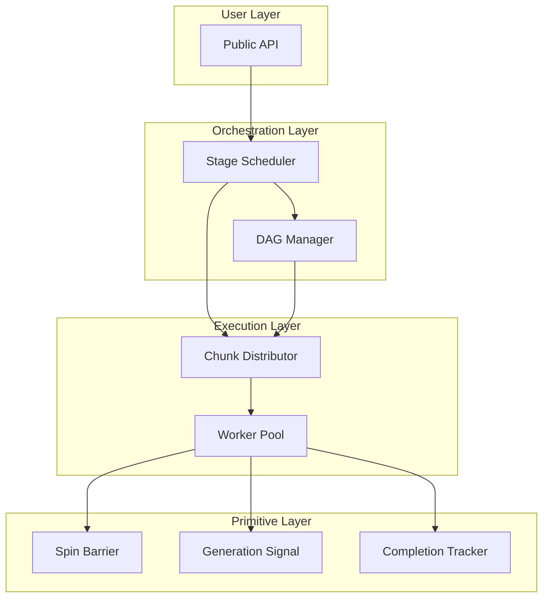
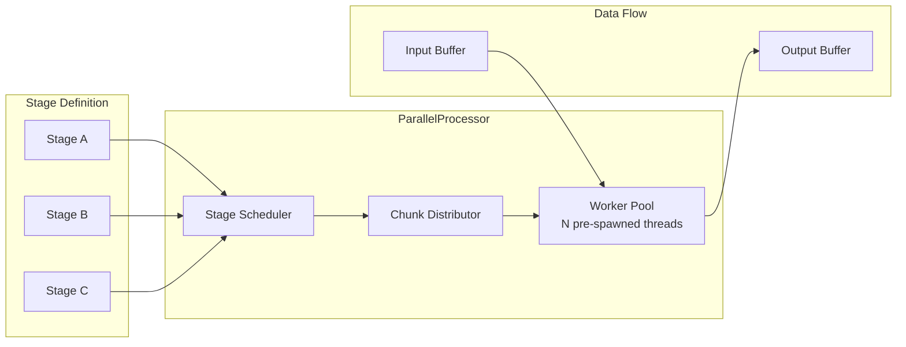
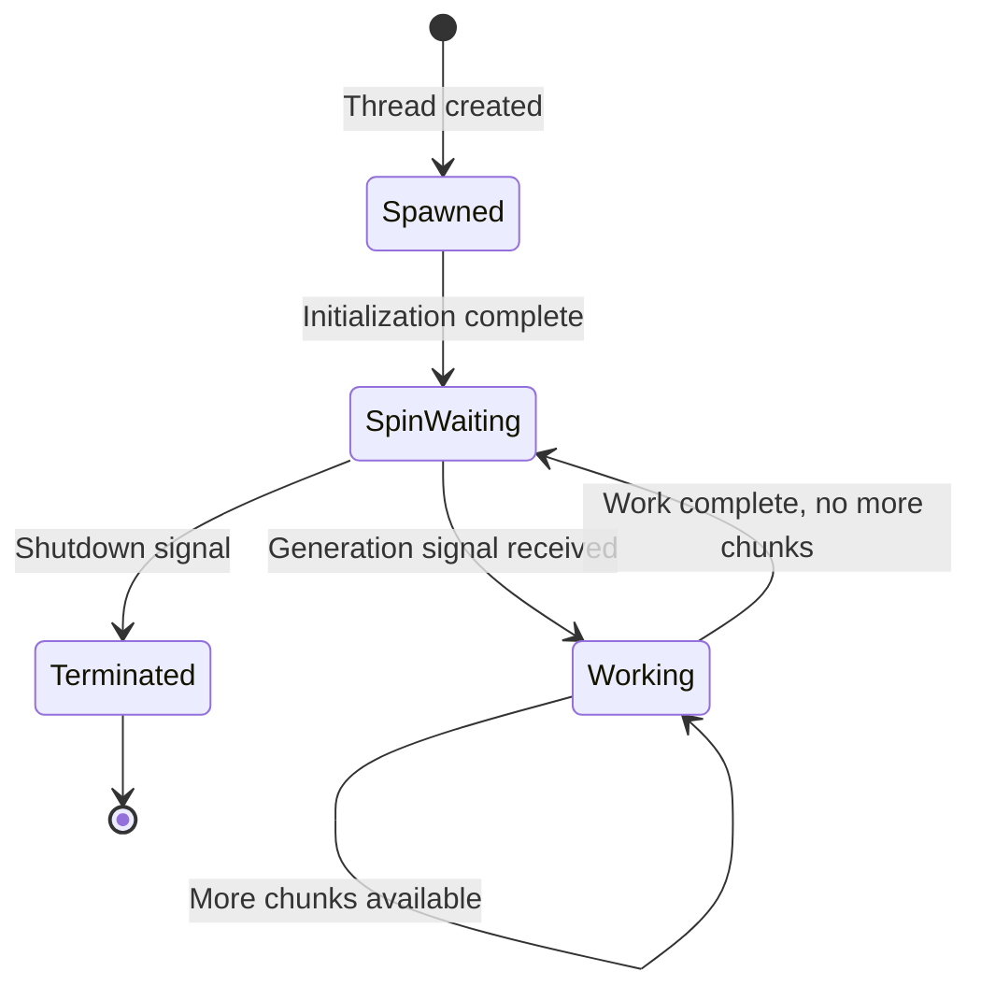
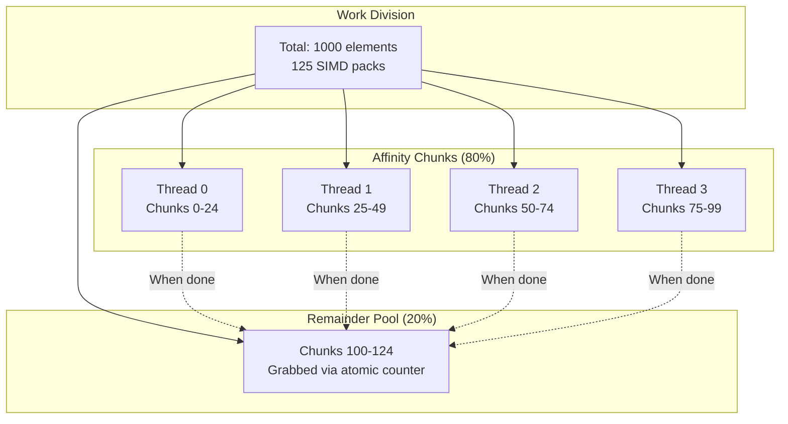
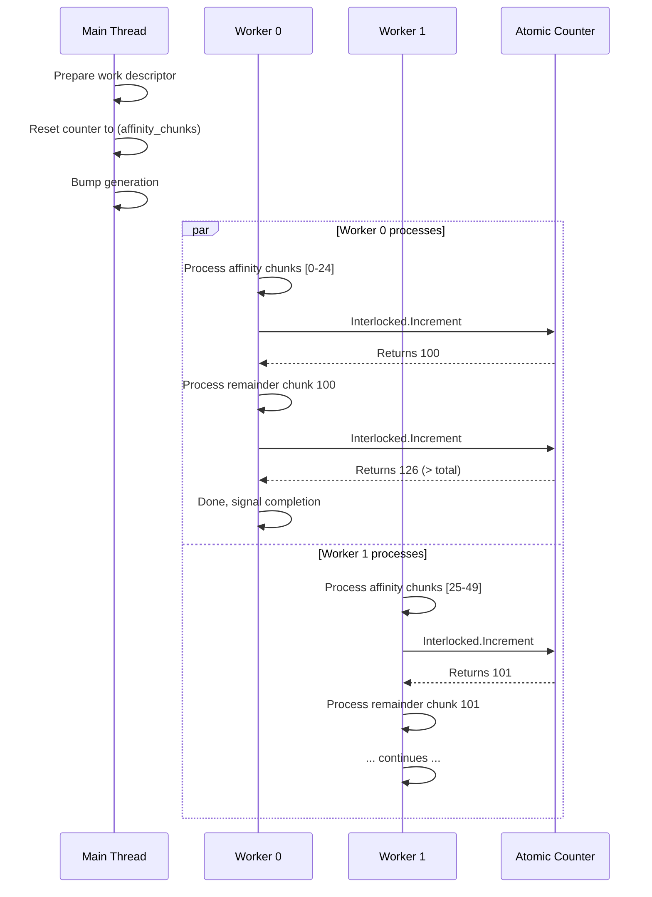
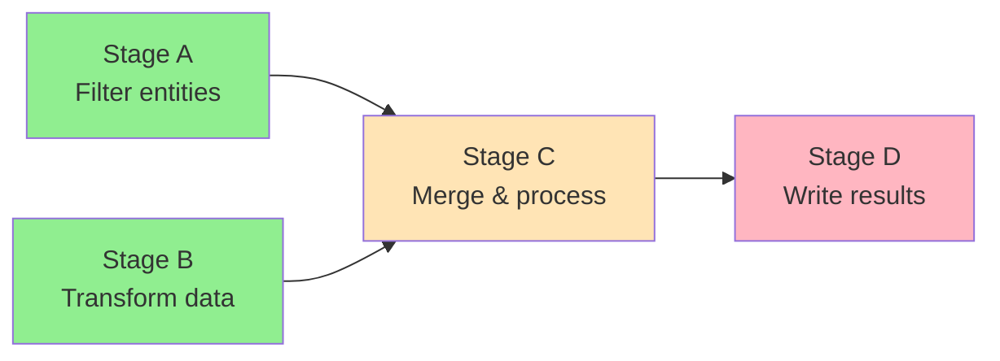
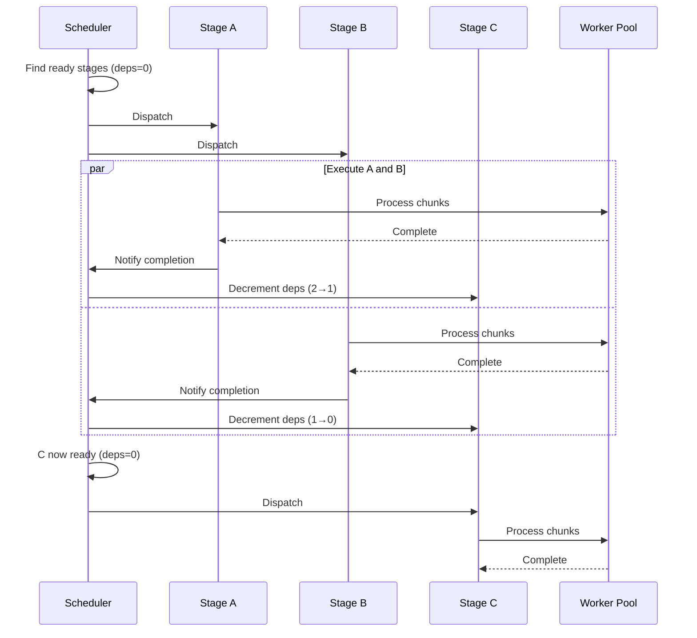
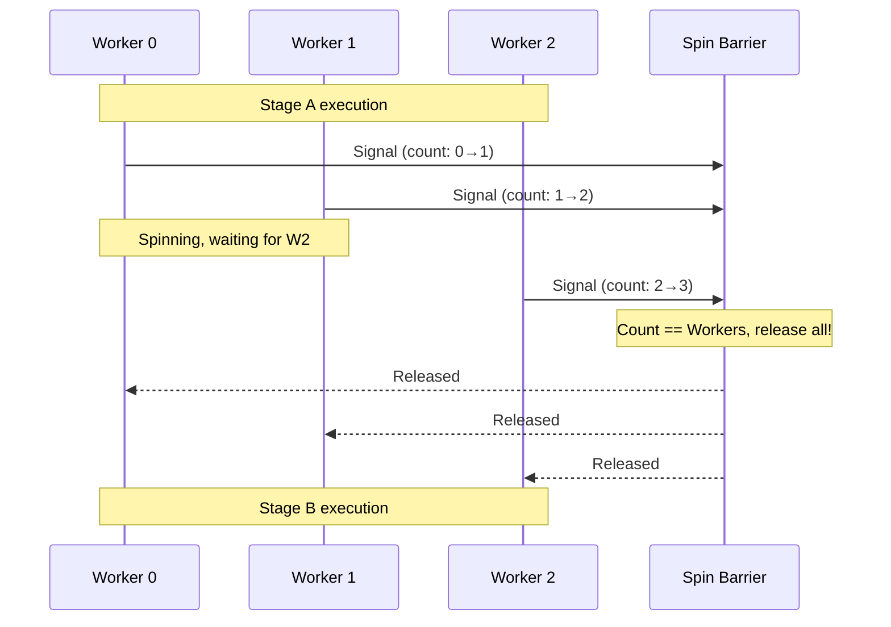
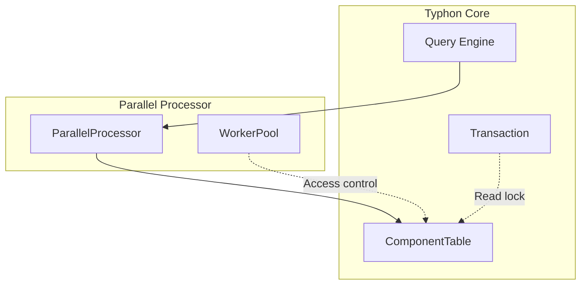

# 🥔 Ultra-Low Latency Parallel Processing - Architecture Deep Dive 🥔

**Date:** 2026-01-16
**Parent Document:** [Patate.md](Patate.md)

---

## Overview

This document provides a detailed architectural design for the recommended parallel processing solution: **Hybrid Affinity + Chunked Atomic Counter with DAG Scheduling**.

The architecture consists of four major subsystems:



---

## System Architecture

### High-Level Component Diagram



### Component Responsibilities

| Component | Responsibility |
|-----------|----------------|
| **Worker Pool** | Manages pre-spawned threads, handles wake/sleep cycles |
| **Stage Scheduler** | Tracks dependencies, determines which stages are ready |
| **Chunk Distributor** | Divides work into chunks, assigns to workers |
| **Spin Barrier** | Synchronizes workers between stages |
| **Generation Signal** | Low-latency wake mechanism for workers |
| **Completion Tracker** | Detects when all workers finish current work |

---

## Worker Pool Design

### Thread Lifecycle



### Worker States

| State | Description | CPU Usage | Transition Trigger |
|-------|-------------|-----------|-------------------|
| **SpinWaiting** | Actively polling generation counter | High (intentional) | Generation counter changes |
| **Working** | Processing chunks | High (productive) | No more chunks available |
| **Terminated** | Thread exiting | None | Shutdown flag set |

### Wake Mechanism: Generation Counter

Workers detect new work by monitoring a generation counter:

```
Main Thread                         Worker Thread
─────────────                       ─────────────
                                    lastGen = 0

                                    while (running):
1. Prepare work descriptor              │
2. Memory barrier (release)             │
3. generation = 1  ─────────────────►   if (generation != lastGen):
                                            lastGen = generation
                                            DoWork()
```

**Why Generation Counter vs Event:**

| Mechanism | Wake Latency | CPU While Waiting |
|-----------|--------------|-------------------|
| ManualResetEvent | 1-15 µs | Zero (kernel wait) |
| Generation Counter | 50-200 ns | High (spinning) |

For sub-microsecond response, spinning is mandatory. The generation counter approach:
- Avoids kernel transitions entirely
- Single cache line shared between main and workers
- Monotonically increasing prevents ABA problems

### Thread Affinity Considerations

Workers should ideally be pinned to specific CPU cores to:
- Maximize cache locality (thread always uses same L1/L2)
- Avoid migration overhead
- Predictable performance

However, Windows thread affinity has caveats:
- May interfere with OS scheduler optimizations
- Can cause issues with hyperthreading siblings
- **Recommendation:** Make affinity optional/configurable

---

## Chunk Distribution Strategy

### The Hybrid Approach



### Why 80/20 Split?

The affinity/remainder ratio balances two concerns:

| Concern | Favors More Affinity | Favors More Remainder |
|---------|---------------------|----------------------|
| Synchronization overhead | ✓ (less contention) | |
| Cache efficiency | ✓ (predictable access) | |
| Load balancing | | ✓ (handles variance) |
| Work stealing benefit | | ✓ (fast threads help slow) |

**Empirical guideline:** 80% affinity / 20% remainder works well for mostly-uniform work with occasional variance.

### Chunk Sizing

Chunk size affects multiple trade-offs:

```
Smaller chunks (8 elements = 1 SIMD pack):
├── Pro: Better load balancing
├── Pro: Lower memory per chunk
├── Con: More atomic operations
└── Con: Less cache prefetch benefit

Larger chunks (64 elements = 8 SIMD packs):
├── Pro: Fewer atomic operations
├── Pro: Better cache prefetch
├── Con: Worse load balancing
└── Con: More wasted work at boundaries
```

**Recommended chunk sizes:**

| Element Count | Recommended Chunk Size | Chunks |
|---------------|------------------------|--------|
| 1,000 | 32 elements | 32 chunks |
| 10,000 | 64 elements | 156 chunks |
| 100,000 | 128 elements | 781 chunks |

Rule of thumb: Target 4-8 chunks per worker for good balance.

### Work Distribution Flow



---

## Stage Dependency Management

### DAG Representation

Stages form a directed acyclic graph (DAG) where edges represent dependencies:



**Legend:**
- 🟢 Green: Ready to execute (no pending dependencies)
- 🟡 Orange: Waiting for dependencies
- 🔴 Pink: Not yet scheduled

### Dependency Tracking

Each stage maintains:
- **Predecessor count:** How many stages must complete before this one can start
- **Successor list:** Which stages to notify when this one completes

```
Stage C:
├── Predecessor count: 2 (A and B)
├── Successors: [D]
└── State: Waiting

When A completes:
├── Atomically decrement C's predecessor count: 2 → 1
└── C still waiting (count > 0)

When B completes:
├── Atomically decrement C's predecessor count: 1 → 0
└── C is now ready! Schedule for execution.
```

### Stage Execution Flow



### Concurrent Stage Execution

Independent stages (no dependency relationship) can execute simultaneously:

```mermaid
gantt
    title Stage Execution Timeline
    dateFormat X
    axisFormat %s

    section Stage A
    Execute    :a, 0, 100

    section Stage B
    Execute    :b, 0, 80

    section Stage C
    Wait for A,B    :crit, c1, 0, 100
    Execute         :c2, 100, 150

    section Stage D
    Wait for C    :crit, d1, 0, 150
    Execute       :d2, 150, 180
```



Stages A and B run in parallel (no dependencies between them). Stage C waits for both, then executes. Stage D waits for C.

---

## Synchronization Between Stages

### Spin Barrier Design

Between stages, all workers must synchronize to ensure:
1. All writes from previous stage are visible
2. No worker starts next stage until all are ready



### Barrier vs Per-Stage Completion

Two patterns for stage transitions:

**Pattern A: Reusable Barrier**
```
Stage A → Barrier → Stage B → Barrier → Stage C
```
- Single barrier instance, reset between stages
- Workers stay active throughout pipeline

**Pattern B: Per-Stage Completion + Re-dispatch**
```
Stage A → Complete → Dispatch Stage B → Complete → Dispatch Stage C
```
- Main thread coordinates between stages
- Workers return to spin-wait between stages

**Recommendation:** Pattern A for linear pipelines (lower latency), Pattern B for complex DAGs (more flexibility).

---

## API Design

### Stage Definition

```csharp
// Define a processing stage
var filterStage = processor.DefineStage<Entity, bool>(
    name: "FilterEntities",
    processor: FilterKernel.Execute  // SIMD-accelerated function pointer
);

var transformStage = processor.DefineStage<Entity, TransformedData>(
    name: "Transform",
    processor: TransformKernel.Execute,
    dependsOn: filterStage
);

var writeStage = processor.DefineStage<TransformedData, ComponentD>(
    name: "WriteResults",
    processor: WriteKernel.Execute,
    dependsOn: transformStage
);
```

### Pipeline Definition

```csharp
// Build a reusable pipeline
var pipeline = processor.BuildPipeline(
    finalStage: writeStage,  // Automatically includes all dependencies
    options: new PipelineOptions
    {
        ChunkSize = 64,
        AffinityRatio = 0.8f,
        EnableTelemetry = false
    }
);
```

### Execution

```csharp
// Synchronous execution (blocks until complete)
pipeline.Execute(inputBuffer, outputBuffer);

// Asynchronous execution (returns immediately)
var completion = pipeline.ExecuteAsync(inputBuffer, outputBuffer);
// ... do other work ...
completion.Wait();  // Or: await completion.AsTask();
```

### Typhon Query Integration

```csharp
// Query entities with specific components
var query = database.Query<CompA, CompB, CompC>()
    .Where((a, b, c) => a.IsActive && b.Value > threshold);

// Process matching entities in parallel
processor.ExecuteQuery(
    query,
    (ReadOnlySpan<CompA> a, ReadOnlySpan<CompB> b, ReadOnlySpan<CompC> c,
     Span<CompD> result) =>
    {
        // SIMD kernel: processes 8 entities at once
        SimdOps.Process(a, b, c, result);
    }
);
```

---

## Spin-Wait Strategy Analysis

### The Question

Should workers use `Thread.SpinWait()`, custom spinning with `pause` instruction, or a hybrid approach?

### Option A: Thread.SpinWait()

`Thread.SpinWait(int iterations)` internally:
1. For small iteration counts: executes `pause` instructions (or `yield` on ARM)
2. For larger counts: may call `Thread.Sleep(0)` or `Thread.Yield()`

**Pros:**
- Built-in, well-tested
- Adapts to CPU architecture
- Yields to other threads after extended spinning

**Cons:**
- Unpredictable latency at transition points
- May yield when we want to keep spinning
- Black-box behavior makes tuning difficult

### Option B: Custom Spin with `pause`

Direct use of `pause` instruction (via `Interlocked.MemoryBarrierProcessWide()` or intrinsics):

```
loop:
    load generation
    compare with expected
    if equal: pause; jump loop
    else: proceed to work
```

**Pros:**
- Predictable, consistent latency
- No unexpected yields
- CPU-efficient (reduces power, avoids memory bus saturation)

**Cons:**
- Requires architecture-specific handling (x86 vs ARM)
- No automatic backoff under extended contention
- Can starve other threads indefinitely

### Option C: Adaptive Hybrid (Recommended)

A custom implementation that combines both approaches:

```
Phase 1 (0-1000 iterations): Pure spinning with pause
    - Lowest latency for quick wake-up
    - Typical case: work arrives within ~500 iterations

Phase 2 (1000-10000 iterations): SpinWait with increasing yields
    - Gradual backoff
    - Gives other threads a chance

Phase 3 (10000+ iterations): Exponential backoff
    - Longer pauses between checks
    - Assumes no work coming soon
    - Preserves CPU for other processes
```

### Recommendation

**Use Adaptive Hybrid** with the following parameters:

| Phase | Iterations | Behavior | Rationale |
|-------|------------|----------|-----------|
| 1 | 0-500 | `pause` only | Sub-µs latency for normal case |
| 2 | 500-5000 | `SpinWait(1-10)` | Graceful backoff |
| 3 | 5000+ | `SpinWait(20)` + occasional `Sleep(0)` | Prevent CPU starvation |

This provides:
- **Best-case latency:** ~50-200 ns (during phase 1)
- **Fairness:** Other threads get CPU time after ~5000 iterations (~5-10 µs)
- **Efficiency:** Reduced power consumption during extended waits

The `AdaptiveWaiter` primitive (see [Primitives document](Patate-Primitives.md)) encapsulates this strategy.

---

## Performance Characteristics

### Expected Latencies

| Operation | Latency |
|-----------|---------|
| Worker wake (from spin-wait) | 50-200 ns |
| Chunk grab (atomic increment) | 10-50 ns |
| Spin barrier (all workers) | 100-400 ns |
| Stage transition | 200-600 ns |
| Completion detection | 50-150 ns |

### Throughput Model

For N elements, P workers, C chunk size, S stages:

```
Total time ≈ (N × T_element) / P + S × T_stage_overhead

Where:
- T_element: Per-element processing time
- T_stage_overhead: ~200-600 ns per stage
```

**Example:** 10,000 elements, 32 workers, 100 ns/element, 3 stages:

```
Compute: (10000 × 100ns) / 32 = 31.25 µs
Overhead: 3 × 400ns = 1.2 µs
Total: ~32.5 µs

Sequential would be: 10000 × 100ns = 1000 µs
Speedup: 1000 / 32.5 ≈ 30x
```

### Minimum Element Threshold

Parallelization only helps above a certain element count:

```
Break-even: (N × T) / P + overhead = N × T
Solving: N = (P × overhead) / (T × (P - 1))

For P=32, overhead=500ns, T=100ns:
N = (32 × 500) / (100 × 31) = ~5 elements per worker
Minimum N = 5 × 32 = ~160 elements
```

**Recommendation:** Set minimum threshold at 200 elements. Below that, use single-threaded SIMD only.

---

## Error Handling Considerations

While the user specified no error handling, we should document behavior for defensive coding:

| Scenario | Behavior |
|----------|----------|
| Worker throws exception | Undefined (exception escapes, may crash) |
| Invalid chunk index | Undefined (out-of-bounds access) |
| Null processor delegate | Undefined (null reference) |
| Buffer size mismatch | Undefined (may corrupt memory) |

**Production hardening** (if added later):
- Debug-only assertions for parameter validation
- Optional exception capture with `AggregateException`
- Telemetry hooks for monitoring worker health

---

## Integration Points

### With Typhon Components



### With AccessControl Primitives

- `NewAccessControl` / `AccessControlSmall` for protecting shared stage buffers
- Workers acquire shared read access to input buffers
- Workers acquire exclusive write access to output buffer sections (disjoint, no actual contention)

---

## Future Considerations

### Potential Enhancements

1. **Dynamic worker scaling:** Add/remove workers based on workload
2. **Priority stages:** Some stages get more workers than others
3. **Speculative execution:** Start likely-next stages before dependencies complete
4. **Memory prefetching:** Hint next chunk to CPU prefetcher
5. **Telemetry integration:** Track per-stage latencies, worker utilization

### Known Limitations

1. **No preemption:** Long-running elements block entire worker
2. **Fixed chunk size:** Cannot adapt to variable-length elements
3. **Homogeneous workers:** All workers assumed equal capability
4. **Single pipeline:** Cannot run multiple pipelines simultaneously (would require separate worker pools)
