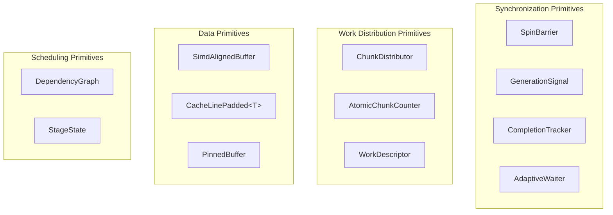
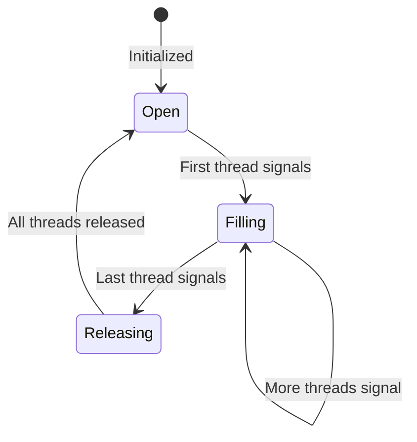
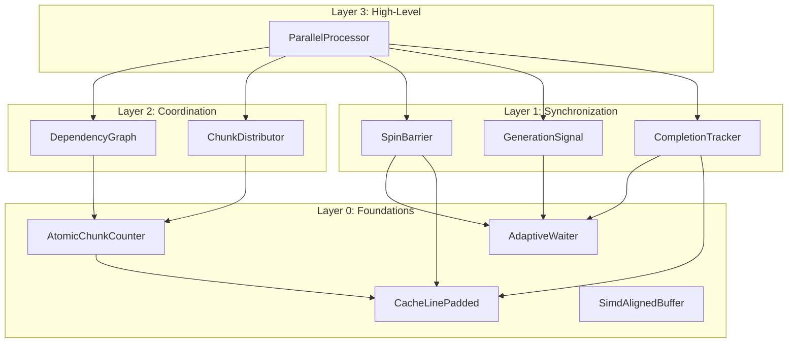

# 🥔 Ultra-Low Latency Parallel Processing - Custom Primitives Toolbox 🥔

**Date:** 2026-01-16
**Parent Document:** [Patate.md](Patate.md)

---

## Overview

This document catalogs the custom primitive types required to build the ultra-low latency parallel processing system. These primitives form a reusable "toolbox" that can be leveraged across Typhon for any scenario requiring sub-microsecond synchronization.

### Primitive Categories



---

## Synchronization Primitives

### 1. SpinBarrier

**Purpose:** Synchronize N threads at a rendezvous point with minimal latency. All threads must arrive before any can proceed.

**Characteristics:**

| Property | Value |
|----------|-------|
| Size | 16 bytes (padded to cache line optional) |
| Latency | 100-400 ns for all threads to synchronize |
| Threads | Fixed at construction, immutable |
| Reusable | Yes, automatically resets after each use |

**State Machine:**



**Key Design Decisions:**

1. **Generation-based release:** Uses a generation counter to release waiting threads. Avoids the "thundering herd" problem of multiple event signals.

2. **No kernel involvement:** Pure user-space spinning. Never blocks in kernel.

3. **Automatic reset:** After all threads pass, barrier resets for next use. No manual reset required.

**API Surface:**

```csharp
public struct SpinBarrier
{
    // Constructor
    public SpinBarrier(int participantCount);

    // Signal arrival and wait for others
    public void SignalAndWait();

    // Signal arrival and wait with cancellation support
    public bool SignalAndWait(CancellationToken token);

    // Current phase number (for debugging)
    public long CurrentPhase { get; }
}
```

**Usage Pattern:**

```csharp
var barrier = new SpinBarrier(workerCount);

// In each worker:
void WorkerLoop()
{
    while (running)
    {
        ProcessStageA();
        barrier.SignalAndWait();  // All workers sync here

        ProcessStageB();
        barrier.SignalAndWait();  // And here
    }
}
```

---

### 2. GenerationSignal

**Purpose:** Ultra-low latency signal from one thread (producer) to multiple threads (consumers). Used to wake workers when new work arrives.

**Characteristics:**

| Property | Value |
|----------|-------|
| Size | 8 bytes (single long) |
| Signal latency | 10-30 ns |
| Wake latency | 50-200 ns (depends on consumer spin rate) |
| Pattern | Single-producer, multi-consumer |

**How It Works:**

```
Producer                              Consumers
────────                              ─────────
                                      lastSeen = 0

                                      while (generation == lastSeen):
1. Prepare work                           SpinWait()
2. Memory barrier
3. generation++  ──────────────────►  generation changed!
                                      lastSeen = generation
                                      DoWork()
```

**Key Design Decisions:**

1. **Monotonic counter:** Never wraps (64-bit), prevents ABA problems.

2. **Single cache line:** Generation counter fits in one cache line, minimizing coherency traffic.

3. **Volatile semantics:** Ensures visibility across cores without explicit barriers on read.

**API Surface:**

```csharp
public struct GenerationSignal
{
    // Signal all waiters
    public void Signal();

    // Wait for signal (returns new generation)
    public long Wait(long lastSeenGeneration);

    // Wait with adaptive spinning
    public long Wait(long lastSeenGeneration, AdaptiveWaiter waiter);

    // Current generation
    public long Current { get; }
}
```

---

### 3. CompletionTracker

**Purpose:** Track how many workers have completed their current work unit. Used to detect when all workers are done.

**Characteristics:**

| Property | Value |
|----------|-------|
| Size | 16 bytes |
| Signal latency | 10-20 ns per worker |
| Detection latency | 50-100 ns (spin check) |
| Pattern | Multi-producer (workers), single-consumer (coordinator) |

**How It Works:**

```
Workers                               Coordinator
───────                               ───────────
                                      expected = workerCount

Worker 0: done, increment counter
Worker 1: done, increment counter     while (counter < expected):
Worker 2: done, increment counter         SpinWait()
...                                   All done!
Worker N: done, counter == expected
```

**Key Design Decisions:**

1. **Atomic increment:** Each worker atomically increments completion counter.

2. **No per-worker tracking:** Simple counter, not a bitmap. Sufficient for our use case.

3. **Resettable:** Coordinator resets to 0 between work units.

**API Surface:**

```csharp
public struct CompletionTracker
{
    // Constructor
    public CompletionTracker(int expectedCount);

    // Worker signals completion
    public void SignalComplete();

    // Check if all complete (non-blocking)
    public bool IsComplete { get; }

    // Wait for all to complete
    public void WaitForCompletion();

    // Wait with adaptive waiter
    public void WaitForCompletion(AdaptiveWaiter waiter);

    // Reset for next use
    public void Reset();
}
```

---

### 4. AdaptiveWaiter

**Purpose:** Encapsulates the spin-wait strategy with adaptive backoff. Balances low latency with CPU efficiency.

**Characteristics:**

| Property | Value |
|----------|-------|
| Size | 8 bytes |
| Phase 1 (spinning) | 0-500 iterations, ~50-200 ns total |
| Phase 2 (yielding) | 500-5000 iterations, ~1-10 µs total |
| Phase 3 (sleeping) | 5000+ iterations, backs off exponentially |

**Phase Behavior:**

```mermaid
graph LR
    subgraph "Phase 1: Pure Spin"
        P1[0-500 iterations<br/>pause instruction only<br/>~50-200 ns]
    end

    subgraph "Phase 2: Yielding"
        P2[500-5000 iterations<br/>SpinWait with yields<br/>~1-10 µs]
    end

    subgraph "Phase 3: Backing Off"
        P3[5000+ iterations<br/>Sleep(0) occasionally<br/>Exponential backoff]
    end

    P1 -->|500 iterations| P2
    P2 -->|5000 iterations| P3
```

**Key Design Decisions:**

1. **No allocation:** Struct type, all state in fields.

2. **Resettable:** Can reset iteration count for new wait.

3. **Configurable thresholds:** Phase boundaries can be tuned.

**API Surface:**

```csharp
public struct AdaptiveWaiter
{
    // Default thresholds
    public AdaptiveWaiter();

    // Custom thresholds
    public AdaptiveWaiter(int phase1Limit, int phase2Limit);

    // Perform one wait iteration
    public void SpinOnce();

    // Reset for new wait
    public void Reset();

    // Current iteration count
    public int Iterations { get; }

    // Current phase (1, 2, or 3)
    public int Phase { get; }
}
```

**Usage Pattern:**

```csharp
var waiter = new AdaptiveWaiter();

while (!condition)
{
    waiter.SpinOnce();
}

waiter.Reset();  // Ready for next wait
```

---

## Work Distribution Primitives

### 5. ChunkDistributor

**Purpose:** Manages the division of work into chunks and their assignment to workers. Implements the hybrid affinity + atomic counter strategy.

**Characteristics:**

| Property | Value |
|----------|-------|
| Size | 64 bytes (cache-line aligned) |
| Affinity grab | 0 ns (pre-computed) |
| Remainder grab | 10-50 ns (atomic increment) |
| Supports | Variable chunk counts per invocation |

**Work Division Model:**

```
Total chunks: 100
Affinity ratio: 80%
Workers: 4

Affinity assignment:
  Worker 0: chunks 0-19   (20 chunks)
  Worker 1: chunks 20-39  (20 chunks)
  Worker 2: chunks 40-59  (20 chunks)
  Worker 3: chunks 60-79  (20 chunks)

Remainder pool:
  Chunks 80-99 (20 chunks)
  Grabbed via atomic counter
```

**API Surface:**

```csharp
public struct ChunkDistributor
{
    // Setup for new work
    public void Setup(int totalChunks, int chunkSize, float affinityRatio);

    // Get affinity range for worker (called once at start)
    public (int Start, int End) GetAffinityRange(int workerId, int totalWorkers);

    // Grab next remainder chunk (returns -1 if none left)
    public int GrabRemainderChunk();

    // Reset for next invocation
    public void Reset();

    // Stats
    public int TotalChunks { get; }
    public int AffinityChunks { get; }
    public int RemainderChunks { get; }
}
```

---

### 6. AtomicChunkCounter

**Purpose:** Lock-free counter for grabbing work chunks. Optimized for low contention with cache-line padding.

**Characteristics:**

| Property | Value |
|----------|-------|
| Size | 64 bytes (padded) |
| Increment latency | 10-20 ns (uncontended) |
| Increment latency | 50-200 ns (contended, 32 threads) |

**Key Design Decisions:**

1. **Cache-line isolation:** Counter padded to prevent false sharing with adjacent data.

2. **No overflow check:** Assumes caller tracks when to stop grabbing.

3. **Relaxed memory ordering:** Uses `Interlocked.Increment` which provides acquire-release semantics.

**API Surface:**

```csharp
[StructLayout(LayoutKind.Explicit, Size = 64)]
public struct AtomicChunkCounter
{
    // Atomically increment and return previous value
    public int GrabNext();

    // Current value (for debugging)
    public int Current { get; }

    // Reset to specific value
    public void Reset(int startValue = 0);
}
```

---

### 7. WorkDescriptor

**Purpose:** Describes a unit of work to be processed. Passed from coordinator to workers.

**Characteristics:**

| Property | Value |
|----------|-------|
| Size | 48 bytes |
| Contents | Input/output pointers, processor delegate, chunk info |
| Lifetime | Valid for duration of one Execute call |

**Structure:**

```
WorkDescriptor:
├── InputPtr        : void*   (pointer to input buffer)
├── OutputPtr       : void*   (pointer to output buffer)
├── ElementCount    : int     (total elements)
├── ChunkSize       : int     (elements per chunk)
├── ProcessorPtr    : void*   (function pointer to SIMD kernel)
├── StageId         : int     (for debugging/telemetry)
└── Reserved        : padding (alignment)
```

**API Surface:**

```csharp
public unsafe struct WorkDescriptor
{
    public void* InputPtr;
    public void* OutputPtr;
    public int ElementCount;
    public int ChunkSize;
    public delegate*<void*, void*, int, void> Processor;
    public int StageId;

    // Helpers
    public int ChunkCount => (ElementCount + ChunkSize - 1) / ChunkSize;

    // Get pointers for specific chunk
    public (void* Input, void* Output, int Length) GetChunk(int chunkIndex, int elementSize);
}
```

---

## Data Primitives

### 8. SimdAlignedBuffer\<T\>

**Purpose:** Buffer with guaranteed SIMD-friendly alignment (32 or 64 bytes) and padding for safe vector operations.

**Characteristics:**

| Property | Value |
|----------|-------|
| Alignment | 32 bytes (AVX2) or 64 bytes (AVX-512) |
| Padding | Extra elements at end for safe SIMD overread |
| Poolable | Yes, can be returned to memory pool |

**Why Alignment Matters:**

```
Unaligned access (address not multiple of 32):
├── May cross cache line boundary
├── 2x memory transactions
└── ~2-5 ns penalty per access

Aligned access (address is multiple of 32):
├── Single cache line
├── Single memory transaction
└── Optimal performance
```

**API Surface:**

```csharp
public unsafe struct SimdAlignedBuffer<T> where T : unmanaged
{
    // Create with specific capacity and alignment
    public SimdAlignedBuffer(int capacity, int alignment = 32);

    // Span access
    public Span<T> Span { get; }
    public ReadOnlySpan<T> ReadOnlySpan { get; }

    // Raw pointer (for interop)
    public T* Ptr { get; }

    // Capacity (may be larger than requested due to padding)
    public int Capacity { get; }

    // Dispose/return to pool
    public void Dispose();
}
```

---

### 9. CacheLinePadded\<T\>

**Purpose:** Wraps a value type with padding to prevent false sharing between threads.

**Characteristics:**

| Property | Value |
|----------|-------|
| Size | 64 bytes (one cache line) |
| Padding | Before and after value |
| Use case | Counters, flags shared between threads |

**False Sharing Problem:**

```
Without padding:
┌────────────────────────────────────────────────────┐
│ Cache Line (64 bytes)                              │
│ [Counter0][Counter1][Counter2][Counter3]...        │
└────────────────────────────────────────────────────┘
Thread 0 writes Counter0 → Invalidates entire line
Thread 1 reads Counter1  → Cache miss! Refetch line

With padding:
┌─────────────────────┐ ┌─────────────────────┐
│ Cache Line 0        │ │ Cache Line 1        │
│ [Counter0][Padding] │ │ [Counter1][Padding] │
└─────────────────────┘ └─────────────────────┘
Thread 0 writes Counter0 → Only Line 0 invalidated
Thread 1 reads Counter1  → Line 1 still valid
```

**API Surface:**

```csharp
[StructLayout(LayoutKind.Explicit, Size = 64)]
public struct CacheLinePadded<T> where T : unmanaged
{
    [FieldOffset(24)]  // Centered in cache line
    public T Value;

    // Implicit conversion
    public static implicit operator T(CacheLinePadded<T> padded) => padded.Value;
}
```

---

### 10. PinnedBuffer\<T\>

**Purpose:** Buffer pinned in memory to prevent GC relocation. Safe to pass pointers to native code or hold across async boundaries.

**Characteristics:**

| Property | Value |
|----------|-------|
| Pinning | GCHandle.Alloc with Pinned type |
| Lifetime | Until explicitly freed |
| Use case | Long-lived buffers, native interop |

**When to Use:**

- Worker thread stack buffers → Use `stackalloc` instead (cheaper)
- Temporary processing buffers → Use `ArrayPool` + `fixed` (cheaper)
- Persistent shared buffers → Use `PinnedBuffer` (this primitive)

**API Surface:**

```csharp
public struct PinnedBuffer<T> : IDisposable where T : unmanaged
{
    // Create pinned buffer
    public PinnedBuffer(int length);

    // Access
    public Span<T> Span { get; }
    public unsafe T* Ptr { get; }
    public int Length { get; }

    // Must call to unpin
    public void Dispose();
}
```

---

## Scheduling Primitives

### 11. DependencyGraph

**Purpose:** Represents the DAG of stage dependencies. Tracks which stages are ready to execute.

**Characteristics:**

| Property | Value |
|----------|-------|
| Size | ~100 bytes + per-stage data |
| Max stages | Configurable (default 64) |
| Thread-safe | Yes, for concurrent completion notifications |

**Internal Representation:**

```
Stages array:
├── Stage 0: deps=0, successors=[2]      ← Ready
├── Stage 1: deps=0, successors=[2]      ← Ready
├── Stage 2: deps=2, successors=[3]      ← Waiting
└── Stage 3: deps=1, successors=[]       ← Waiting

Execution order:
1. Execute 0 and 1 (parallel, deps=0)
2. When 0 completes: decrement 2's deps (2→1)
3. When 1 completes: decrement 2's deps (1→0) → Stage 2 ready
4. Execute 2
5. When 2 completes: decrement 3's deps (1→0) → Stage 3 ready
6. Execute 3
```

**API Surface:**

```csharp
public class DependencyGraph
{
    // Build graph
    public int AddStage(string name);
    public void AddDependency(int fromStage, int toStage);
    public void Seal();  // Finalize, compute initial ready set

    // Execution
    public IEnumerable<int> GetReadyStages();
    public void MarkComplete(int stageId);  // Thread-safe

    // Query
    public bool IsComplete { get; }
    public int StageCount { get; }

    // Reset for re-execution
    public void Reset();
}
```

---

### 12. StageState

**Purpose:** Holds per-stage execution state including work descriptor, completion tracking, and timing.

**Characteristics:**

| Property | Value |
|----------|-------|
| Size | 128 bytes (2 cache lines) |
| Contents | Work descriptor, completion tracker, timing |
| Alignment | Cache-line aligned |

**Structure:**

```
StageState:
├── WorkDescriptor     : 48 bytes
├── CompletionTracker  : 16 bytes
├── StartTimestamp     : 8 bytes
├── EndTimestamp       : 8 bytes
├── DependencyCount    : 4 bytes (atomic)
├── Status             : 4 bytes (enum)
└── Padding            : 40 bytes
```

**API Surface:**

```csharp
public struct StageState
{
    public WorkDescriptor Work;
    public CompletionTracker Completion;
    public long StartTicks;
    public long EndTicks;
    public int RemainingDependencies;
    public StageStatus Status;

    // Helpers
    public TimeSpan Elapsed => TimeSpan.FromTicks(EndTicks - StartTicks);
    public bool IsReady => RemainingDependencies == 0 && Status == StageStatus.Pending;
}

public enum StageStatus : int
{
    Pending = 0,
    Running = 1,
    Complete = 2
}
```

---

## Primitive Dependencies



---

## Implementation Priority

### Phase 1: Core Foundations
1. **AdaptiveWaiter** - Used by all other synchronization primitives
2. **CacheLinePadded\<T\>** - Prevents false sharing
3. **AtomicChunkCounter** - Basic work grabbing

### Phase 2: Synchronization
4. **GenerationSignal** - Worker wake mechanism
5. **CompletionTracker** - Work completion detection
6. **SpinBarrier** - Stage synchronization

### Phase 3: Work Management
7. **WorkDescriptor** - Work unit description
8. **ChunkDistributor** - Hybrid work distribution
9. **SimdAlignedBuffer\<T\>** - SIMD-friendly storage

### Phase 4: Scheduling
10. **StageState** - Per-stage tracking
11. **DependencyGraph** - DAG management
12. **PinnedBuffer\<T\>** - Long-lived buffers

---

## Testing Strategy

Each primitive should have:

1. **Unit tests:** Basic functionality, edge cases
2. **Concurrency tests:** Multiple threads exercising the primitive
3. **Stress tests:** High contention, rapid cycling
4. **Latency benchmarks:** Measure overhead in isolation

Use `[CancelAfter]` on all tests to prevent deadlocks from hanging the test suite (as done with `AccessControlSmallTests`).

---

## Relationship to Existing Typhon Primitives

| New Primitive | Existing Typhon Analog | Relationship |
|---------------|------------------------|--------------|
| AdaptiveWaiter | `AdaptiveWaiter` (if exists) | May already exist, reuse |
| SpinBarrier | None | New |
| GenerationSignal | None | New |
| CompletionTracker | None | New |
| CacheLinePadded | May exist in collections | Check `Typhon.Engine.Collections` |
| AtomicChunkCounter | None | New, simpler than bitmap |
| SimdAlignedBuffer | `ChunkBasedSegment` | Different purpose, both use aligned storage |

The new primitives complement existing Typhon infrastructure. They should:
- Use `AccessControlSmall` / `NewAccessControl` when reader-writer semantics needed
- Integrate with existing memory pooling if available
- Follow Typhon's blittable struct patterns for zero-allocation
