# Part 1: Complete Taxonomy of Database Timeouts

> **Series**: Database Engine Timeout Internals  
> **Document**: 1 of 7  
> **Focus**: Exhaustive classification of every timeout type in database engines

---

## 1.1 Overview

Database engines manage dozens of distinct timeout scenarios across multiple architectural layers. Understanding this complete taxonomy is essential before diving into implementation details, because:

1. **Different timeouts have different owners** - some are client-controlled, some server-controlled, some are internal heuristics
2. **Timeouts interact with each other** - a lock timeout might be bounded by a command timeout
3. **Failure modes differ** - some timeouts cause graceful errors, others cause connection drops
4. **Monitoring differs** - each timeout type appears in different diagnostic views

---

## 1.2 Architectural Layer Model

```mermaid
flowchart TB
    subgraph Layer7["Layer 7: Resource Governance"]
        RG1[CPU Time Limits]
        RG2[Memory Grant Timeout]
        RG3[Parallel Worker Timeout]
        RG4[External Script Timeout]
    end
    
    subgraph Layer6["Layer 6: Background Operations"]
        BG1[Recovery Timeout]
        BG2[Backup Timeout]
        BG3[Replication Timeout]
        BG4[Statistics Timeout]
        BG5[Maintenance Timeout]
    end
    
    subgraph Layer5["Layer 5: I/O Operations"]
        IO1[Disk Read Timeout]
        IO2[Disk Write Timeout]
        IO3[Log Write Timeout]
        IO4[Checkpoint Timeout]
        IO5[Buffer Wait Timeout]
    end
    
    subgraph Layer4["Layer 4: Transaction Management"]
        TX1[Transaction Lifetime]
        TX2[Commit Timeout]
        TX3[Rollback Budget]
        TX4[2PC Timeout]
        TX5[Distributed TX Timeout]
    end
    
    subgraph Layer3["Layer 3: Locking & Concurrency"]
        LK1[Lock Wait Timeout]
        LK2[Latch Wait Timeout]
        LK3[Deadlock Detection]
        LK4[Lock Escalation]
        LK5[Spinlock Backoff]
    end
    
    subgraph Layer2["Layer 2: Command Execution"]
        CMD1[Command Timeout]
        CMD2[Parse Timeout]
        CMD3[Optimization Timeout]
        CMD4[Execution Timeout]
        CMD5[Statement Timeout]
    end
    
    subgraph Layer1["Layer 1: Connection Management"]
        CN1[Connection Timeout]
        CN2[Login Timeout]
        CN3[Idle Timeout]
        CN4[Keep-Alive Timeout]
        CN5[Network I/O Timeout]
    end
    
    Layer1 --> Layer2 --> Layer3 --> Layer4 --> Layer5 --> Layer6 --> Layer7
```

---

## 1.3 Layer 1: Connection Management Timeouts

These timeouts govern the lifecycle of database connections from establishment to termination.

### 1.3.1 Connection Establishment Timeout

**What it controls**: The time allowed to establish a new TCP connection and complete the initial protocol handshake (before authentication).

**Typical flow**:
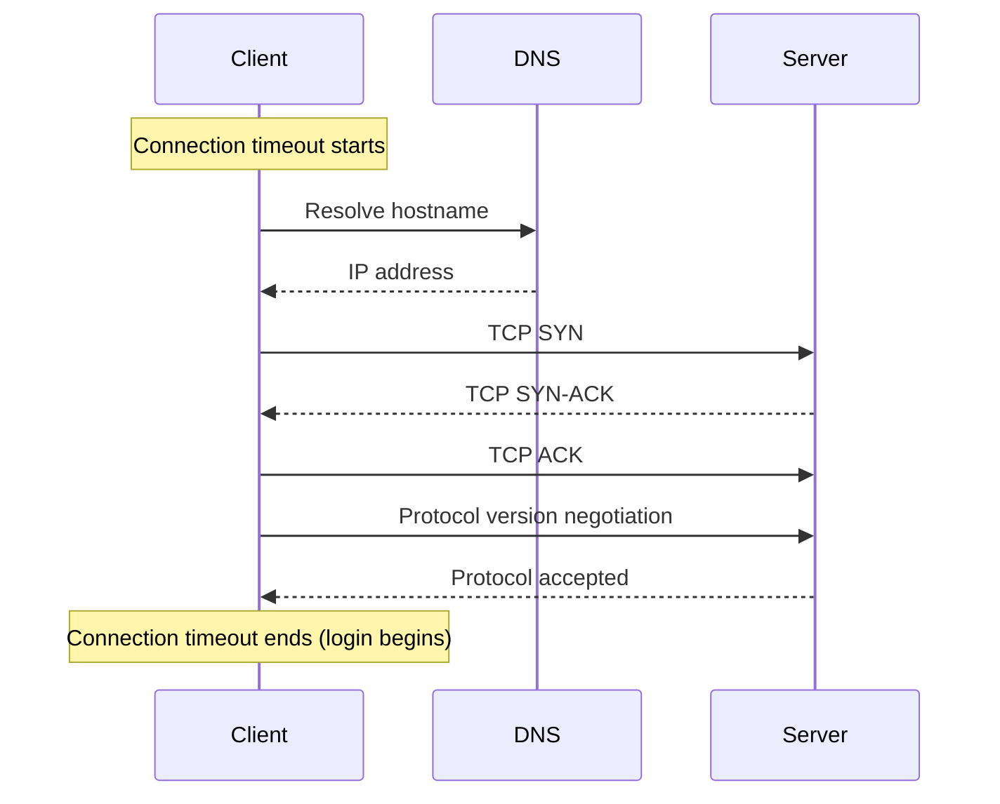

**Who controls it**: Client driver (e.g., `SqlConnection.ConnectionTimeout`, Npgsql `Timeout`, MySQL Connector `ConnectionTimeout`)

**What happens on timeout**: 
- Connection attempt is abandoned
- No server resources consumed (connection never fully established)
- Client receives connection timeout exception

**Engine-specific details**:

| Engine | Setting | Default | Notes |
|--------|---------|---------|-------|
| SQL Server | `Connect Timeout` in connection string | 15s | Includes DNS resolution |
| PostgreSQL | `connect_timeout` libpq parameter | 0 (OS default) | Per-host when multiple hosts specified |
| MySQL | `connect_timeout` server + client | 10s | Server-side also enforces |

### 1.3.2 Login/Authentication Timeout

**What it controls**: Time allowed for the authentication handshake after TCP connection is established. Includes credential verification, SSL/TLS negotiation, and session initialization.

**Typical flow**:
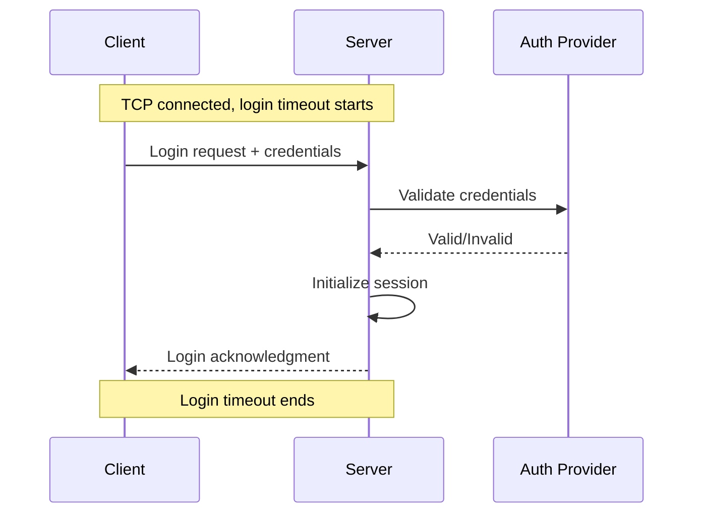

**Security implications**: Short login timeouts help prevent:
- Brute force attacks (limits attempts per time unit)
- Connection exhaustion attacks
- Slow authentication DoS

**Engine-specific details**:

| Engine | Setting | Default | Notes |
|--------|---------|---------|-------|
| SQL Server | Part of `Connect Timeout` | 15s | Single timeout covers connect + login |
| PostgreSQL | `authentication_timeout` | 60s | Server-side enforcement |
| MySQL | `connect_timeout` | 10s | Covers handshake + auth |

### 1.3.3 Idle Connection Timeout

**What it controls**: Maximum time a connection can remain open without any activity before the server closes it.

**Purpose**:
- Reclaim server resources (memory, file handles, connection slots)
- Clean up abandoned connections (client crashed without closing)
- Security (prevent session hijacking of long-idle sessions)

**Detection mechanism**:
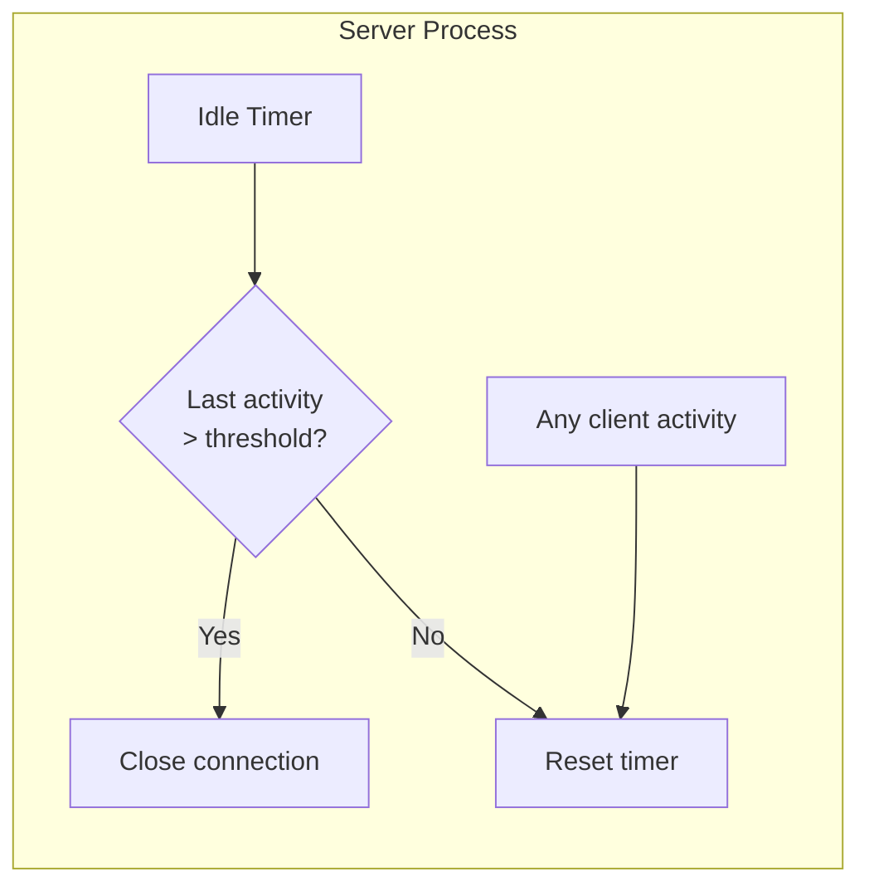

**Engine-specific details**:

| Engine | Setting | Default | Notes |
|--------|---------|---------|-------|
| SQL Server | No built-in idle timeout | N/A | Use connection pooling or Resource Governor |
| PostgreSQL | `idle_session_timeout` (v14+) | 0 (disabled) | Kills truly idle sessions |
| MySQL | `wait_timeout` / `interactive_timeout` | 28800s (8h) | Different for interactive vs non-interactive |

### 1.3.4 Keep-Alive Timeout

**What it controls**: TCP-level mechanism to detect dead connections (client crashed, network partitioned) even when no application-level activity occurs.

**How it works**:
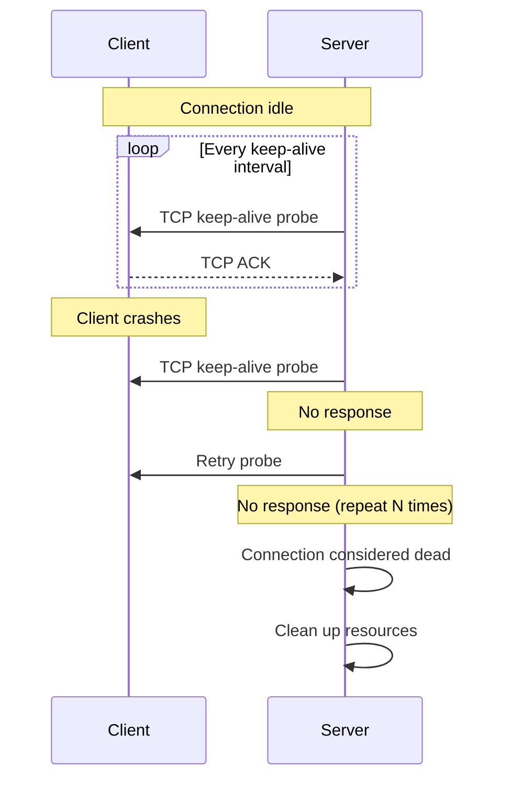

**Three parameters**:
1. **Idle time**: How long before first probe (e.g., 2 hours)
2. **Interval**: Time between probes (e.g., 75 seconds)
3. **Count**: Probes before declaring dead (e.g., 9)

**Engine-specific details**:

| Engine | Settings | Defaults |
|--------|----------|----------|
| SQL Server | Uses Windows TCP settings | OS defaults |
| PostgreSQL | `tcp_keepalives_idle`, `tcp_keepalives_interval`, `tcp_keepalives_count` | OS defaults (can override) |
| MySQL | OS-level only | OS defaults |

### 1.3.5 Network Read/Write Timeout

**What it controls**: Maximum time to wait for a network I/O operation to complete after it has started.

**Read timeout**: Waiting for data from client (next command, parameter data, etc.)
**Write timeout**: Waiting for send buffer to drain (sending results to client)

**Why these exist**:
- Slow clients shouldn't block server resources indefinitely
- Network issues should fail fast rather than hang
- Different from idle timeout: measures active I/O, not absence of activity

**Engine-specific details**:

| Engine | Read Setting | Write Setting | Defaults |
|--------|--------------|---------------|----------|
| SQL Server | Internal, not configurable | Internal | Based on socket options |
| PostgreSQL | OS socket timeout | OS socket timeout | OS defaults |
| MySQL | `net_read_timeout` | `net_write_timeout` | 30s / 60s |

---

## 1.4 Layer 2: Command/Query Execution Timeouts

These timeouts govern individual SQL statements or batches.

### 1.4.1 Command Timeout (Overall Query Budget)

**What it controls**: Total wall-clock time allowed for a command (query/batch) to execute, from submission to completion.

**This is the most commonly used timeout** and typically the one developers think of when discussing "query timeout."

**Scope**: Encompasses all phases:
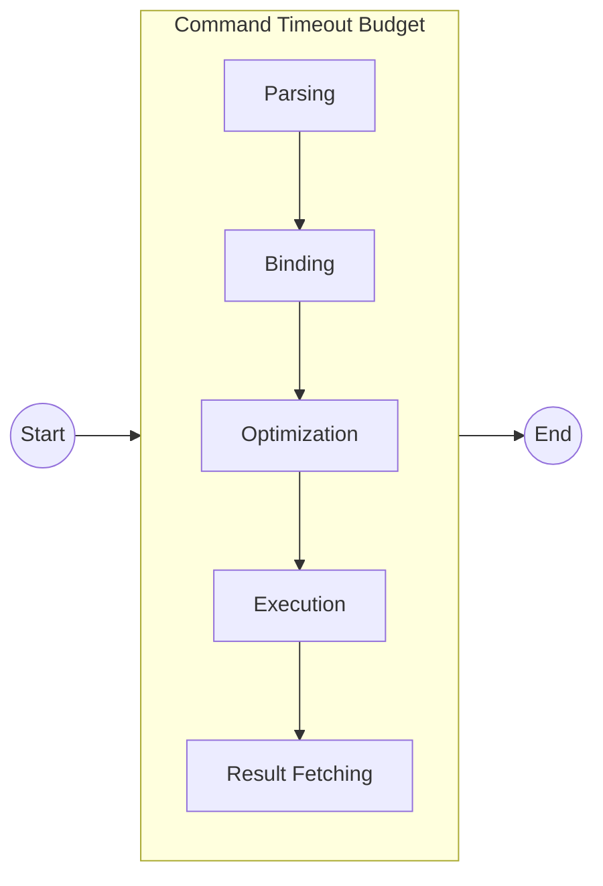

**Who controls it**: Client application via driver setting (e.g., `SqlCommand.CommandTimeout`)

**Engine-specific details**:

| Engine | Client Setting | Server Enforcement | Default |
|--------|----------------|-------------------|---------|
| SQL Server | `CommandTimeout` | Server respects client attention signal | 30s |
| PostgreSQL | Client-side only (or `statement_timeout`) | `statement_timeout` if set | 0 (none) |
| MySQL | Client-side only (or `max_execution_time`) | `max_execution_time` for SELECT | 0 (none) |

**Critical distinction**: Client-side vs server-side enforcement

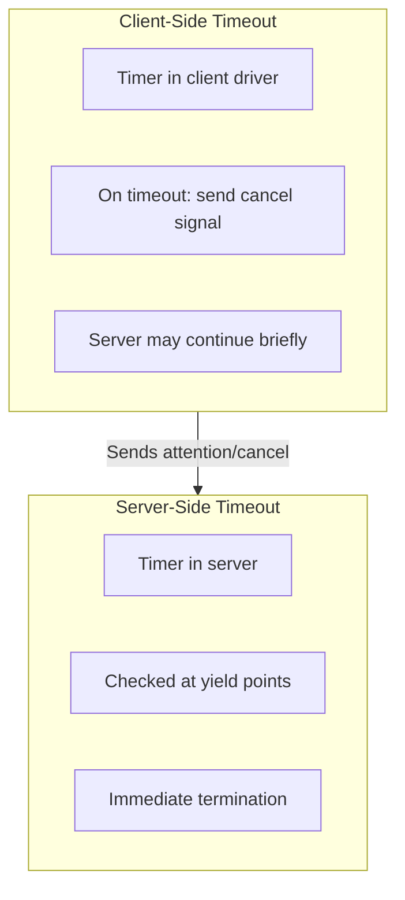

### 1.4.2 Parse Timeout

**What it controls**: Maximum time allowed for SQL text parsing (lexical analysis, syntax validation, AST construction).

**Rarely configurable**: Most engines don't expose this because:
- Parsing is typically fast (milliseconds)
- Parsing is CPU-bound with predictable performance
- Extremely long parse times indicate pathological queries

**When it matters**:
- Very long SQL statements (generated by ORMs)
- Deeply nested expressions
- Large IN lists

**Engine behavior**:

| Engine | Behavior |
|--------|----------|
| SQL Server | No explicit parse timeout; bounded by command timeout |
| PostgreSQL | No explicit parse timeout; bounded by statement_timeout |
| MySQL | No explicit parse timeout; bounded by max_execution_time |

### 1.4.3 Query Optimization Timeout

**What it controls**: Maximum time/effort the optimizer spends searching for the best execution plan.

**This is NOT a hard timeout** in most engines - it's a heuristic that limits optimization effort based on:
- Estimated query cost
- Number of tables joined
- Plan alternatives explored

**Why it's complex**:
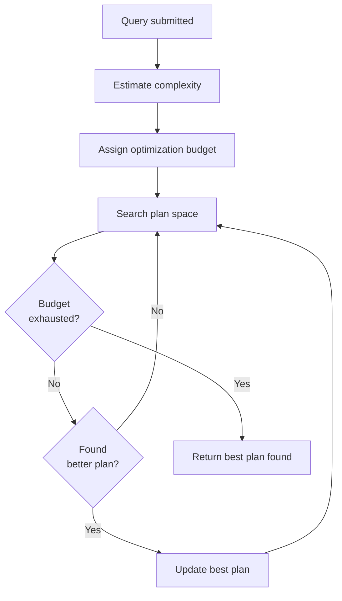

**Engine-specific details**:

| Engine | Mechanism | Configuration |
|--------|-----------|---------------|
| SQL Server | Cost-based timeout + plan quality gates | `query optimizer hotfixes`, trace flags |
| PostgreSQL | `geqo_threshold` for genetic optimizer | `geqo` settings, `from_collapse_limit` |
| MySQL | `optimizer_search_depth` | Limits join order permutations |

### 1.4.4 Execution Timeout

**What it controls**: Time allowed for the actual plan execution phase (reading data, computing results, returning rows).

**Usually not separate**: Most engines don't distinguish execution timeout from command timeout. The command timeout budget is shared across all phases.

**Exception - SQL Server Resource Governor**: Can set CPU time limits specifically for execution:
```
CREATE WORKLOAD GROUP expensive_queries
WITH (REQUEST_MAX_CPU_TIME_SEC = 30);
```

### 1.4.5 Statement Timeout (PostgreSQL Specialty)

**What it controls**: Per-statement time limit, server-enforced. Unlike client command timeout, this is set via SQL and enforced by the server.

**Key difference from command timeout**:
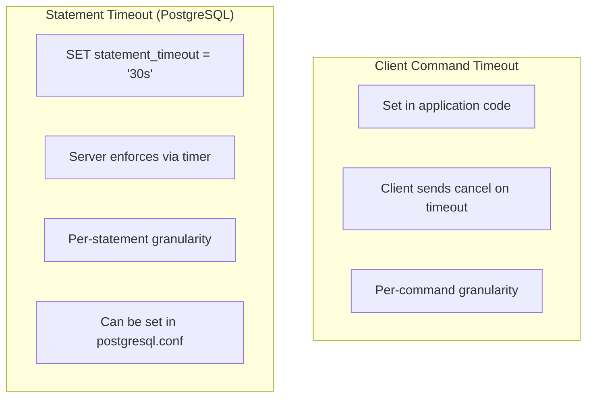

**PostgreSQL implementation**:
- Uses `SIGALRM` timer
- Timer starts at statement begin
- On expiry, sets `QueryCancelPending` flag
- `CHECK_FOR_INTERRUPTS()` checks flag and throws error

---

## 1.5 Layer 3: Locking and Concurrency Timeouts

These timeouts control how long operations wait to acquire locks on database resources.

### 1.5.1 Lock Wait Timeout

**What it controls**: Maximum time a transaction will wait to acquire a lock on a database resource (row, page, table, etc.) when that resource is held by another transaction.

**This is distinct from deadlock detection**: Lock timeout fires even when there's no deadlock - just contention.

**Lock wait flow**:
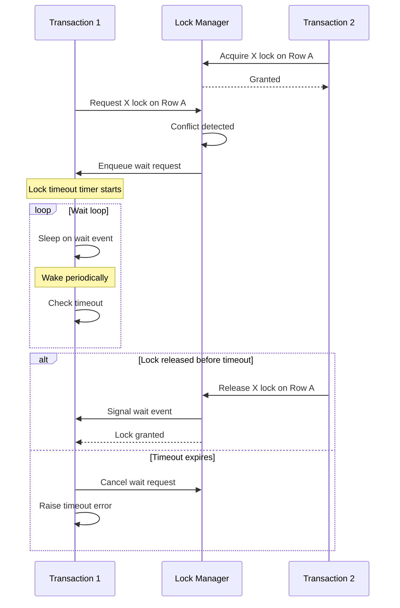

**Engine-specific details**:

| Engine | Setting | Default | Scope |
|--------|---------|---------|-------|
| SQL Server | `SET LOCK_TIMEOUT` | -1 (infinite) | Session |
| PostgreSQL | `SET lock_timeout` | 0 (disabled) | Session |
| MySQL/InnoDB | `innodb_lock_wait_timeout` | 50s | Session/Global |

**Special values**:
- **-1 or 0 (infinite)**: Wait forever (until deadlock or command timeout)
- **0 (SQL Server)**: `NOWAIT` - immediate failure if lock not available

### 1.5.2 Latch Wait Timeout

**What it controls**: Wait time for internal memory structure latches (not user-visible locks).

**Latches vs Locks**:
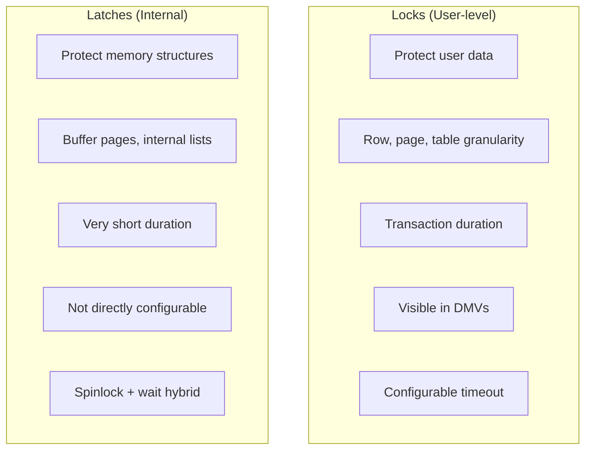

**Latch types** (SQL Server example):
- `PAGELATCH_*`: Buffer pool page access
- `PAGEIOLATCH_*`: Page being read from disk
- `ACCESS_METHODS_*`: Index structure traversal
- `LOG_MANAGER`: Transaction log access

**Timeout behavior**: Latches typically don't have configurable timeouts - they're expected to be held briefly. Long latch waits indicate system problems.

### 1.5.3 Deadlock Detection Interval

**What it controls**: How frequently the engine checks for deadlock cycles among waiting transactions.

**Deadlock detection algorithm**:
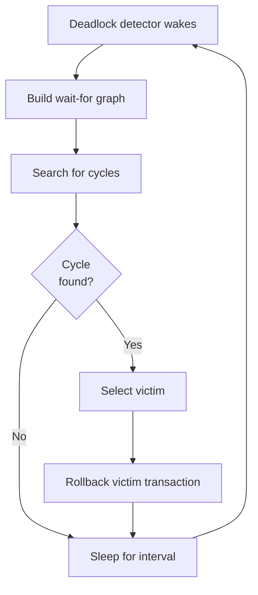

**Trade-offs**:
- **Shorter interval**: Faster deadlock resolution, higher CPU overhead
- **Longer interval**: Lower overhead, longer waits before resolution

**Engine-specific details**:

| Engine | Setting | Default | Notes |
|--------|---------|---------|-------|
| SQL Server | Not directly configurable | ~5 seconds | Adaptive based on deadlock frequency |
| PostgreSQL | `deadlock_timeout` | 1 second | Time before checking for deadlock |
| MySQL/InnoDB | `innodb_deadlock_detect` | ON | Can disable entirely for high-contention |

### 1.5.4 Lock Escalation Timeout

**What it controls**: The decision point for escalating many fine-grained locks to a coarser-grained lock.

**Escalation example**:
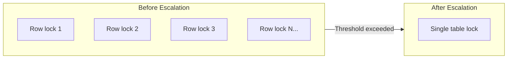

**Not typically time-based**: Lock escalation usually triggers based on:
- Number of locks held (e.g., 5000 locks per table in SQL Server)
- Memory pressure in lock manager
- Percentage of table locked

### 1.5.5 Spinlock Backoff

**What it controls**: How long a thread spins (busy-waits) on a CPU before yielding when waiting for a very short-term lock.

**Spinlock vs sleep**:
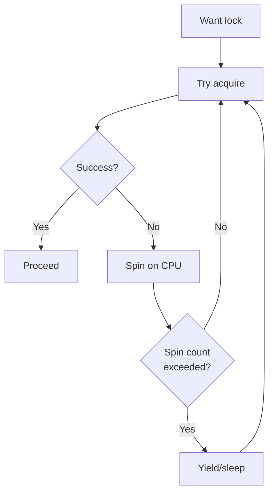

**Why spinlocks exist**: For very short critical sections, the cost of sleeping (context switch, kernel transition) exceeds the expected wait time.

**Engine-specific details**:

| Engine | Mechanism | Tuning |
|--------|-----------|--------|
| SQL Server | Adaptive spinlock | Trace flags, SPINLOCK_BACKOFF |
| PostgreSQL | `SpinLockAcquire` with configurable spins | `NUM_SPINLOCK_SEMAPHORES` |
| MySQL/InnoDB | `innodb_spin_wait_delay` | Microseconds between spins |

---

## 1.6 Layer 4: Transaction Management Timeouts

These timeouts govern transaction lifecycle and distributed transaction coordination.

### 1.6.1 Transaction Lifetime Timeout

**What it controls**: Maximum total duration of a transaction from BEGIN to COMMIT/ROLLBACK.

**Why it matters**:
- Long transactions hold locks, blocking others
- Long transactions accumulate undo log space
- Long transactions can cause replication lag

**Engine-specific details**:

| Engine | Setting | Default | Notes |
|--------|---------|---------|-------|
| SQL Server | No built-in | N/A | Use application-level or Resource Governor |
| PostgreSQL | `idle_in_transaction_session_timeout`, `transaction_timeout` (v17+) | 0 (disabled) | Separate idle vs active |
| MySQL | No built-in | N/A | Application responsibility |

### 1.6.2 Commit Timeout

**What it controls**: Time allowed for the commit operation itself to complete.

**Commit operations**:


**Usually not configurable**: Commit must succeed for durability guarantees. However, distributed commits have explicit timeouts.

### 1.6.3 Rollback Budget

**What it controls**: Time allocated for rolling back a transaction (undoing changes).

**Critical point**: Rollback typically **must complete** - there's no timeout that can interrupt it because partial rollback would leave the database inconsistent.

**Rollback scenarios**:
- Explicit ROLLBACK command
- Implicit rollback on error
- Crash recovery rollback
- Deadlock victim rollback

### 1.6.4 Two-Phase Commit (2PC) Timeout

**What it controls**: Timeouts for distributed transaction coordination across multiple databases.

**2PC phases with timeouts**:
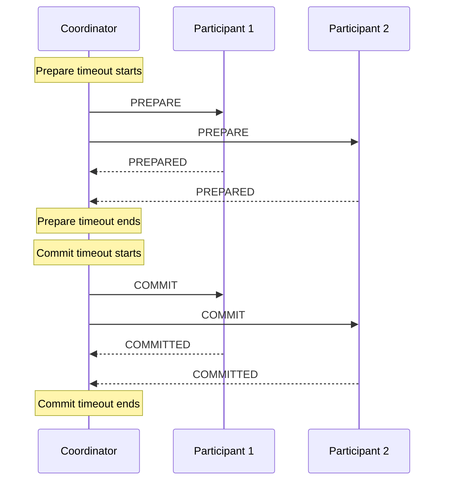

**Engine-specific details**:

| Engine | Prepare Timeout | Commit Timeout |
|--------|-----------------|----------------|
| SQL Server (DTC) | Configurable in DTC | Configurable in DTC |
| PostgreSQL | `max_prepared_transaction_age` (manual) | N/A |
| MySQL/XA | Application-controlled | Application-controlled |

### 1.6.5 Distributed Transaction Timeout

**What it controls**: Overall timeout for transactions spanning multiple databases or resource managers.

**Coordinated by**: Transaction coordinator (MS DTC, application server, etc.)

---

## 1.7 Layer 5: I/O Operation Timeouts

These timeouts govern physical storage operations.

### 1.7.1 Disk Read Timeout

**What it controls**: Maximum wait time for reading a page from storage into buffer pool.

**Read path**:
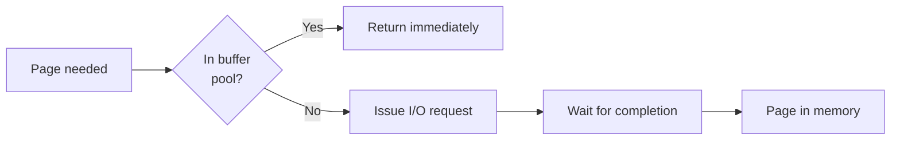

**Typically OS-level**: Database engines usually rely on operating system I/O timeouts rather than implementing their own.

**What affects read timeout**:
- Storage device response time
- I/O queue depth
- RAID controller caching
- SAN/cloud storage latency

### 1.7.2 Disk Write Timeout

**What it controls**: Maximum wait time for writing a page from buffer pool to storage.

**Write scenarios**:
- Checkpoint writes (background)
- Lazy writes (background, memory pressure)
- Eager writes (immediate, for some operations)

### 1.7.3 Log Write Timeout

**What it controls**: Maximum wait time for flushing transaction log records to durable storage.

**Critical path**: Log writes are on the commit path - they directly affect transaction throughput.

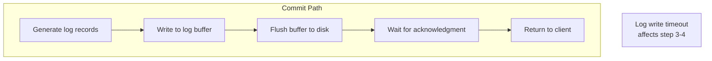

### 1.7.4 Checkpoint Timeout

**What it controls**: Interval between checkpoints and/or maximum checkpoint duration.

**Checkpoint purpose**:
- Limit recovery time after crash
- Reclaim transaction log space
- Ensure data durability

**Engine-specific details**:

| Engine | Interval Setting | Duration Limit |
|--------|------------------|----------------|
| SQL Server | `recovery interval` | Indirect (target recovery time) |
| PostgreSQL | `checkpoint_timeout` | `checkpoint_completion_target` |
| MySQL/InnoDB | `innodb_log_checkpoint_every` (internal) | Adaptive |

### 1.7.5 Buffer Wait Timeout

**What it controls**: Maximum time to wait for a free buffer page when the buffer pool is under memory pressure.

**Buffer acquisition flow**:
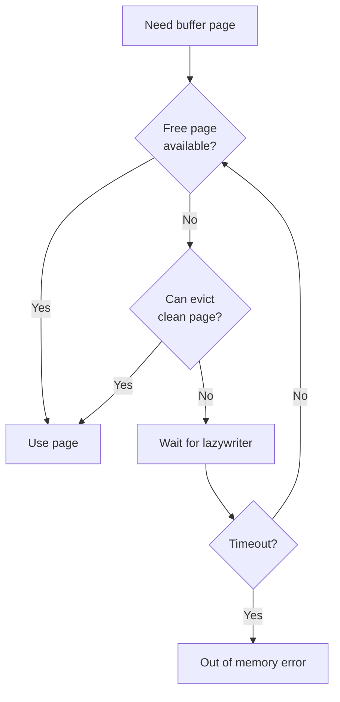

---

## 1.8 Layer 6: Background Operation Timeouts

These timeouts govern maintenance and background processes.

### 1.8.1 Recovery Timeout

**What it controls**: Crash recovery operations after server restart.

**Critical**: Recovery typically **cannot timeout** - it must complete to ensure database consistency. However, some engines allow:
- Progress monitoring
- Partial database availability
- Recovery throttling

### 1.8.2 Backup Timeout

**What it controls**: Maximum duration for backup operations.

**Usually administrative**: Operators set backup timeouts based on:
- Backup window requirements
- Storage system performance
- Network bandwidth (for remote backups)

### 1.8.3 Replication Timeout

**What it controls**: Various timeouts in replication scenarios.

**Types of replication timeouts**:
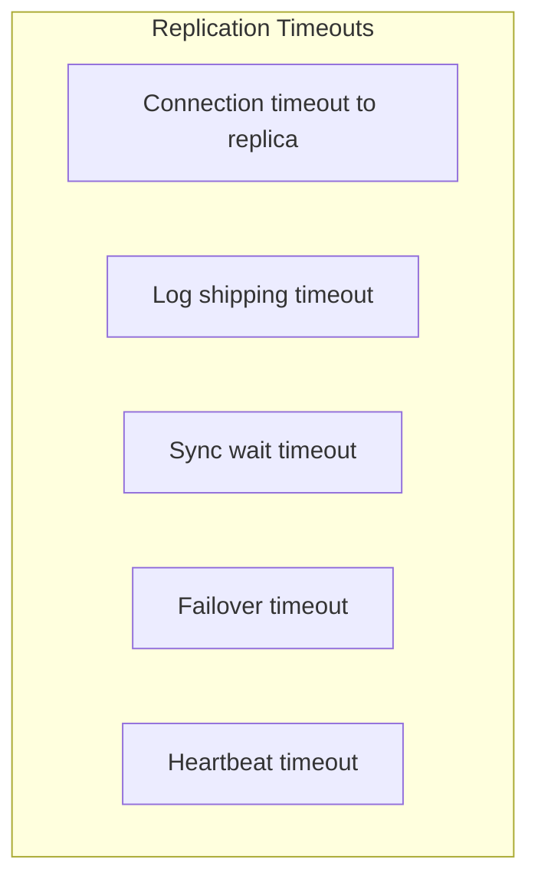

### 1.8.4 Statistics Collection Timeout

**What it controls**: Time budget for automatic statistics updates.

**Trade-offs**:
- Complete statistics improve query plans
- Long-running stats updates can block queries
- Sampling strategies balance accuracy vs speed

### 1.8.5 Index Maintenance Timeout

**What it controls**: Budget for online index operations (rebuild, reorganize).

**Online index operations**: Allow concurrent access but may need to timeout to avoid blocking production workloads.

---

## 1.9 Layer 7: Resource Governance Timeouts

These timeouts enforce resource limits beyond simple duration.

### 1.9.1 CPU Time Limit

**What it controls**: Maximum CPU time (not wall-clock time) a query can consume.

**Distinction**:
```
Wall-clock time: 60 seconds (includes I/O waits, lock waits)
CPU time:        10 seconds (actual CPU usage)
```

**SQL Server Resource Governor example**:
```
CREATE WORKLOAD GROUP limited
WITH (REQUEST_MAX_CPU_TIME_SEC = 30);
```

### 1.9.2 Memory Grant Timeout

**What it controls**: Maximum time a query waits for memory grant before starting execution.

**Memory grant flow**:
```mermaid
flowchart TB
    COMPILE[Query compiled] --> REQUEST[Request memory grant]
    REQUEST --> AVAILABLE{Memory<br/>available?}
    AVAILABLE -->|Yes| EXECUTE[Execute query]
    AVAILABLE -->|No| QUEUE[Queue request]
    QUEUE --> WAIT[Wait]
    WAIT --> TIMEOUT{Timeout?}
    TIMEOUT -->|No| AVAILABLE
    TIMEOUT -->|Yes| FAIL[Query fails or<br/>executes with less]
```

**Engine-specific details**:

| Engine | Setting | Behavior |
|--------|---------|----------|
| SQL Server | `query wait` option, Resource Governor | Configurable timeout |
| PostgreSQL | `work_mem` (no waiting, just uses less) | No explicit timeout |
| MySQL | `max_join_size`, `tmp_table_size` | Limits, not timeouts |

### 1.9.3 Parallel Worker Timeout

**What it controls**: Time to wait for parallel worker threads during parallel query execution.

**Parallel execution**:
```mermaid
flowchart TB
    COORD[Coordinator thread] --> SPAWN[Spawn worker threads]
    SPAWN --> WAIT{Workers<br/>available?}
    WAIT -->|Yes| EXECUTE[Parallel execution]
    WAIT -->|No, timeout| SERIAL[Serial execution]
```

### 1.9.4 External Script Timeout

**What it controls**: Execution time for external languages (R, Python, Java) integrated with the database.

**SQL Server example**:
```
EXEC sp_execute_external_script
    @language = N'Python',
    @script = N'...',
    @timeout = 600;  -- 10 minutes
```

---

## 1.10 Timeout Interaction Matrix

Understanding how timeouts interact is crucial:

```mermaid
flowchart TB
    CMD[Command Timeout<br/>30s] --> LOCK[Lock Timeout<br/>10s]
    CMD --> EXEC[Execution Time]
    
    LOCK --> |"Bounded by"| CMD
    EXEC --> |"Bounded by"| CMD
    
    TX[Transaction Timeout<br/>60s] --> CMD
    CMD --> |"Bounded by"| TX
    
    DTC[Distributed TX Timeout<br/>120s] --> TX
    TX --> |"Bounded by"| DTC
```

**Key interactions**:

| Outer Timeout | Inner Timeout | Relationship |
|---------------|---------------|--------------|
| Transaction timeout | Command timeout | Command bounded by transaction |
| Command timeout | Lock timeout | Lock bounded by command |
| Command timeout | Execution phases | All phases share command budget |
| Distributed TX timeout | Local TX timeout | Local bounded by distributed |
| Statement timeout | Lock timeout | Lock bounded by statement |

---

## 1.11 Summary: Complete Timeout Catalog

| Layer | Timeout | Typical Default | Primary Controller |
|-------|---------|-----------------|-------------------|
| Connection | Connection | 15-30s | Client |
| Connection | Login | 60s | Server |
| Connection | Idle | 8h | Server |
| Connection | Keep-alive | OS | OS/Server |
| Connection | Network I/O | 30-60s | Server |
| Command | Command | 30s | Client |
| Command | Parse | None | Internal |
| Command | Optimization | Heuristic | Internal |
| Command | Execution | Shared | Command budget |
| Command | Statement | 0 (disabled) | Session |
| Locking | Lock wait | 50s or infinite | Session |
| Locking | Latch | None | Internal |
| Locking | Deadlock detection | 1-5s | Server |
| Locking | Spinlock | Microseconds | Internal |
| Transaction | Transaction | None | Application |
| Transaction | Commit | None | Internal |
| Transaction | 2PC | 60s | Coordinator |
| I/O | Disk read | OS | OS |
| I/O | Disk write | OS | OS |
| I/O | Log write | None | Internal |
| I/O | Checkpoint | 1-5 min | Server |
| Background | Recovery | None (must complete) | Internal |
| Background | Backup | Administrative | Admin |
| Background | Replication | Varies | Config |
| Resource Gov | CPU time | None or configured | Server |
| Resource Gov | Memory grant | 25x cost or -1 | Server |
| Resource Gov | Parallel workers | 0 (none) | Internal |

---

**Next**: [Part 2: Fundamental Design Patterns](./02-design-patterns.md) - TimeSpan vs Deadline, Execution Context, and Timeout Check Strategies
