# Part 2: Fundamental Design Patterns

> **Series**: Database Engine Timeout Internals  
> **Document**: 2 of 7  
> **Focus**: Core architectural patterns for timeout management in database engines

---

## 2.1 The Fundamental Design Choice: Relative TimeSpan vs Absolute Deadline

This is the most critical architectural decision in timeout handling. Every database engine must choose how to represent "when should this operation give up?"

### 2.1.1 Approach 1: Relative TimeSpan

**Definition**: Each operation receives a duration representing how long IT should wait, independent of how much time parent operations have already consumed.

**API signature pattern**:
```csharp
// Relative TimeSpan approach
bool TryAcquireLock(LockResource resource, TimeSpan timeout);
void ExecuteQuery(string sql, TimeSpan timeout);
Task<int> ReadPageAsync(PageId page, TimeSpan timeout);
```

**Visual representation**:
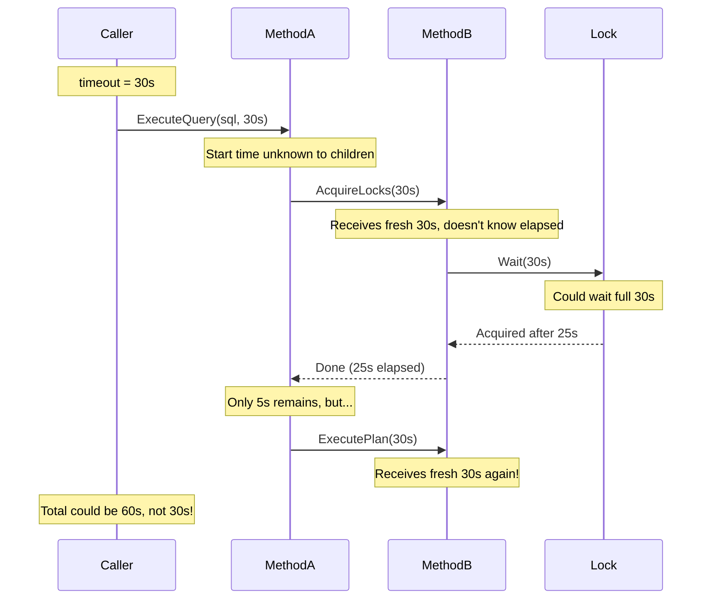

**The accumulation problem**:
```
Given: CommandTimeout = 30 seconds

ExecuteQuery(30s)
├── Parse(30s)           → Takes 1s, OK
├── Optimize(30s)        → Takes 2s, OK  
├── AcquireLocks(30s)    → Takes 25s, OK (but 28s elapsed!)
├── Execute(30s)         → Has full 30s budget, could take 30s more
└── ReturnResults(30s)   → Has full 30s budget, could take 30s more

Worst case total: 1 + 2 + 30 + 30 + 30 = 93 seconds (not 30!)
```

### 2.1.2 Approach 2: Absolute Deadline

**Definition**: An absolute point in time is computed ONCE at the entry point, then passed through all nested operations. Each operation calculates its remaining time from the shared deadline.

**API signature pattern**:
```csharp
// Absolute Deadline approach
bool TryAcquireLock(LockResource resource, Deadline deadline);
void ExecuteQuery(string sql, Deadline deadline);
Task<int> ReadPageAsync(PageId page, Deadline deadline);

// Alternative: Deadline embedded in context
bool TryAcquireLock(LockResource resource, ExecutionContext ctx);
```

**Visual representation**:
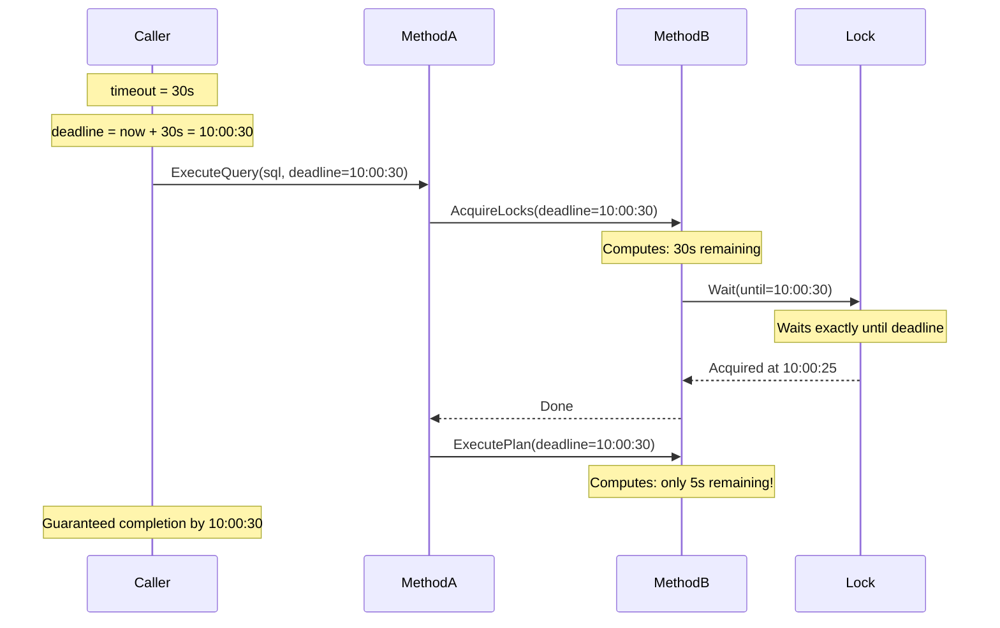

**Natural bound enforcement**:
```
Given: Deadline = 10:00:30

ExecuteQuery(deadline)
├── Parse(deadline)         → Remaining: 30s → Takes 1s
├── Optimize(deadline)      → Remaining: 29s → Takes 2s  
├── AcquireLocks(deadline)  → Remaining: 27s → Takes 25s
├── Execute(deadline)       → Remaining: 2s  → Must complete in 2s!
└── Timeout!

Total: Exactly bounded by original 30 seconds
```

### 2.1.3 Comparative Analysis

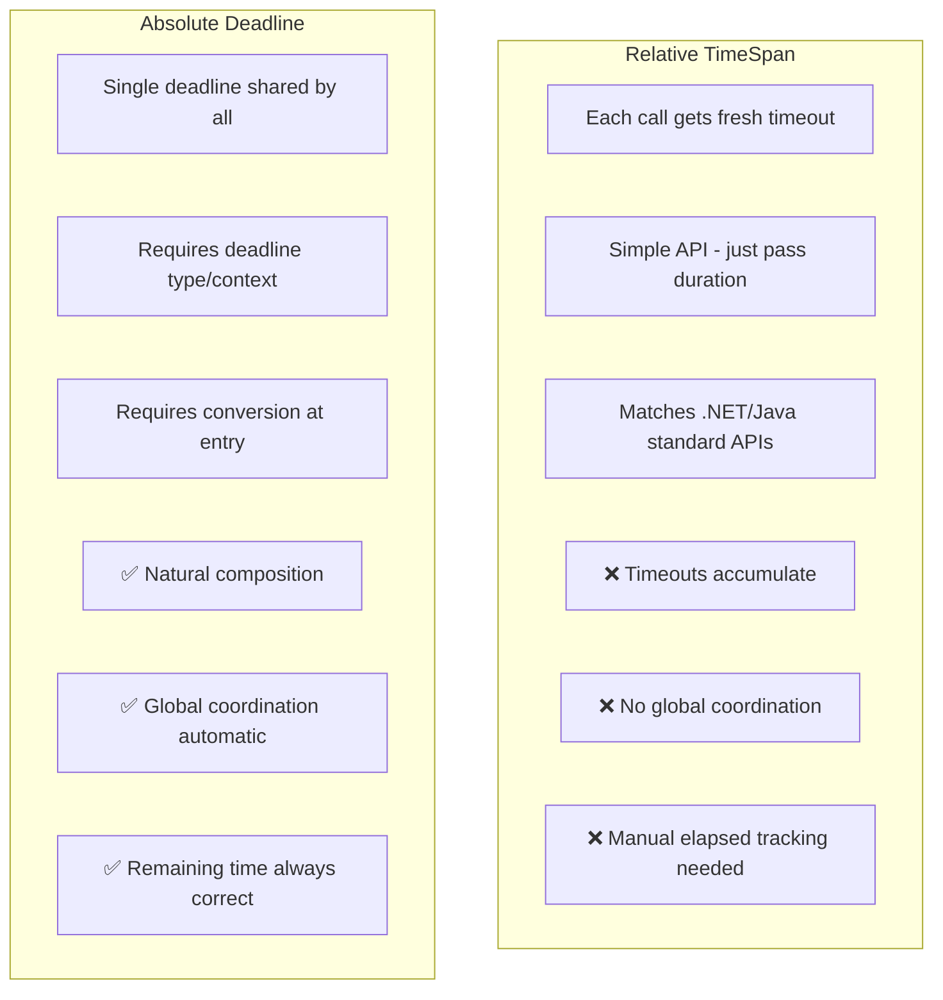

**Detailed comparison**:

| Aspect | Relative TimeSpan | Absolute Deadline |
|--------|-------------------|-------------------|
| **Semantic clarity** | "Wait this long" | "Complete by this time" |
| **Composability** | ❌ Poor - accumulates | ✅ Excellent - naturally bounds |
| **API complexity** | ✅ Simple - matches standard APIs | ⚠️ Requires custom type |
| **Entry point work** | ✅ None | ⚠️ Must convert to deadline |
| **Thread handoff** | ❌ Complex - track elapsed | ✅ Simple - pass deadline |
| **Distributed systems** | ❌ Hard to coordinate | ✅ Can serialize deadline |
| **Clock sensitivity** | ⚠️ Cumulative drift | ⚠️ Single reference (use monotonic) |
| **Debugging** | ❌ "Which call took too long?" | ✅ Clear: deadline vs actual |
| **Precision** | ❌ Small drift each call | ✅ Single reference point |

### 2.1.4 What Database Engines Actually Use

**All major database engines use the Absolute Deadline approach internally**, even though their public APIs may accept relative timeouts:

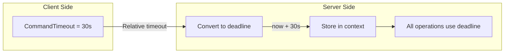

| Engine | Public API | Internal Implementation |
|--------|-----------|------------------------|
| SQL Server | `CommandTimeout` (seconds) | Absolute ticks in `SOS_Task` |
| PostgreSQL | `statement_timeout` (ms) | SIGALRM timer at absolute time |
| MySQL | `max_execution_time` (ms) | Absolute timestamp in `THD` |

---

## 2.2 The Deadline Data Structure

### 2.2.1 Core Requirements

A deadline type must support:

1. **Creation from relative timeout**: `Deadline.FromTimeout(TimeSpan timeout)`
2. **Remaining time calculation**: `deadline.Remaining` → `TimeSpan`
3. **Expiry check**: `deadline.IsExpired` → `bool`
4. **Infinite representation**: `Deadline.Infinite` (no timeout)
5. **Minimum of deadlines**: `Deadline.Min(a, b)` (for combining constraints)
6. **Conversion to wait APIs**: `deadline.RemainingMilliseconds` → `int`

### 2.2.2 Structure Definition

```csharp
/// <summary>
/// Immutable deadline representing an absolute point in time.
/// This is the conceptual structure used by database engines.
/// </summary>
public readonly struct Deadline
{
    // Internal representation: ticks from monotonic clock source
    // Using long allows ~292 million years of range at 100ns precision
    private readonly long _ticks;
    
    // Sentinel values
    public static readonly Deadline Infinite;   // _ticks = long.MaxValue
    public static readonly Deadline Zero;       // _ticks = 0 (already expired)
    
    // Factory methods
    public static Deadline FromTimeout(TimeSpan timeout);
    public static Deadline FromMilliseconds(int ms);
    public static Deadline Min(Deadline a, Deadline b);
    
    // Properties
    public bool IsExpired { get; }          // Current time >= deadline
    public bool IsInfinite { get; }         // No timeout
    public TimeSpan Remaining { get; }      // Time until deadline
    public int RemainingMilliseconds { get; } // For Wait APIs (-1 = infinite)
    
    // Operations
    public void ThrowIfExpired(string operation);
    public CancellationToken ToCancellationToken();
}
```

### 2.2.3 Monotonic Time Considerations

**Critical**: Deadlines should use **monotonic time**, not wall-clock time:

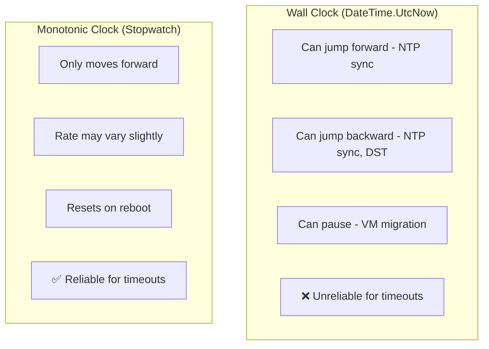

**Platform-specific monotonic sources**:

| Platform | API | Resolution | Notes |
|----------|-----|------------|-------|
| Windows | `QueryPerformanceCounter` | ~100ns | Invariant TSC on modern CPUs |
| Linux | `clock_gettime(CLOCK_MONOTONIC)` | ~1ns | Kernel-maintained |
| .NET | `Stopwatch.GetTimestamp()` | Platform-dependent | Wraps OS monotonic clock |
| SQL Server | `SOS_GetCpuTicks()` | High resolution | SQLOS abstraction |

### 2.2.4 Handling Multiple Deadline Sources

Operations often have multiple timeout constraints. The effective deadline is the **minimum** of all applicable deadlines:

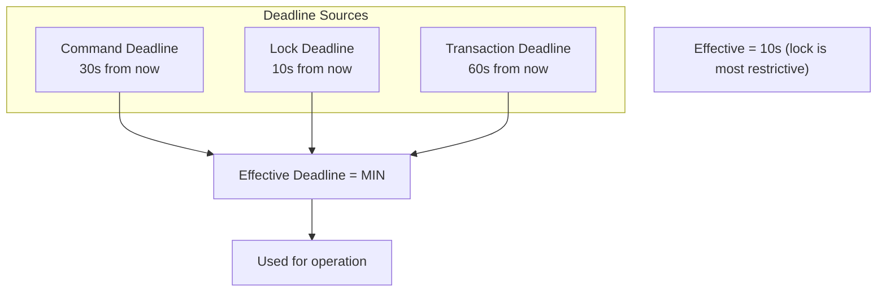

**In database engines**:

| Engine | How Multiple Deadlines Are Combined |
|--------|-------------------------------------|
| SQL Server | `MIN(command_deadline, lock_deadline, resource_governor_deadline)` |
| PostgreSQL | Separate timers; first to fire wins |
| MySQL/InnoDB | Checked independently; first exceeded triggers error |

---

## 2.3 The Execution Context Pattern

### 2.3.1 What Is an Execution Context?

An **execution context** is a data structure that flows through all operations for a single request/command. It carries:

1. **Identity**: Session ID, transaction ID, statement ID
2. **Deadlines**: Command deadline, lock deadline, transaction deadline
3. **Cancellation state**: Flags indicating cancel requested
4. **Wait state**: Current wait type, resource, statistics
5. **Resource tracking**: CPU time, memory, rows processed

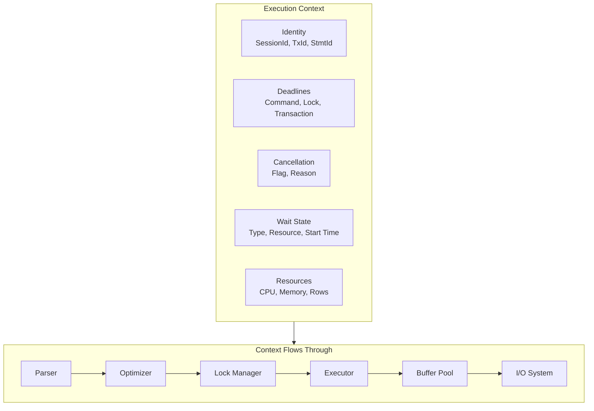

### 2.3.2 SQL Server: SOS_Task

```cpp
// Simplified structure based on SQL Server's actual SOS_Task
struct SOS_Task
{
    // Identity
    USHORT          spid;                    // Session ID
    UINT            request_id;              // Request within session
    ULONG64         transaction_id;          // Current transaction
    
    // Deadlines (stored as absolute QPC ticks)
    LONG64          command_deadline;        // From CommandTimeout
    INT             lock_timeout_ms;         // Setting (converted to deadline per lock)
    LONG64          resource_governor_deadline; // CPU time limit
    
    // Cancellation
    volatile LONG   attention_flag;          // Client cancel received
    volatile LONG   kill_flag;               // KILL command received
    UINT            abort_reason;            // Why cancelled
    
    // Wait state
    HANDLE          wait_event;              // Windows event for blocking
    CHAR*           wait_type;               // Current wait type name
    CHAR*           wait_resource;           // Resource description
    LONG64          wait_start_ticks;        // When wait began
    
    // Resource tracking
    LONG64          cpu_ticks_consumed;      // For Resource Governor
    ULONG64         memory_grant_kb;         // Query memory
    LONG64          rows_returned;           // For SET ROWCOUNT
    
    // Scheduler affinity
    SOS_Scheduler*  scheduler;               // Owning scheduler
    SOS_Worker*     worker;                  // Current worker thread
};
```

### 2.3.3 PostgreSQL: PGPROC

```c
// Simplified structure based on PostgreSQL's PGPROC (src/include/storage/proc.h)
typedef struct PGPROC
{
    // Identity
    int             pid;                     // Process ID
    BackendId       backendId;               // Backend slot
    TransactionId   xid;                     // Current transaction
    
    // Timeout settings (intervals, not deadlines - timer-based)
    int             statement_timeout_ms;    // SET statement_timeout
    int             lock_timeout_ms;         // SET lock_timeout  
    int             idle_tx_timeout_ms;      // SET idle_in_transaction_session_timeout
    
    // Interrupt flags (set by signal handlers)
    volatile sig_atomic_t QueryCancelPending;
    volatile sig_atomic_t ProcDiePending;
    volatile sig_atomic_t ClientConnectionLost;
    volatile sig_atomic_t IdleInTransactionSessionTimeoutPending;
    
    // Interrupt control
    volatile uint32 InterruptHoldoffCount;   // Defer interrupts
    volatile uint32 CritSectionCount;        // In critical section
    
    // Wait state (for pg_stat_activity)
    uint32          wait_event_info;         // Encoded wait type + event
    
    // Latch for inter-process signaling
    Latch           procLatch;               // Wakeup mechanism
    
    // Lock state
    LOCK*           waitLock;                // Lock we're waiting for
    LOCKMODE        waitLockMode;            // Mode requested
    PROC_QUEUE*     waitProcLock;            // Queue we're in
} PGPROC;
```

### 2.3.4 MySQL: THD

```cpp
// Simplified structure based on MySQL's THD (sql/sql_class.h)
class THD
{
public:
    // Identity
    my_thread_id    thread_id;               // Connection ID
    ulonglong       query_id;                // Current query
    
    // Timeout settings
    ulong           lock_wait_timeout;       // innodb_lock_wait_timeout  
    ulong           net_read_timeout;        // net_read_timeout
    ulong           net_write_timeout;       // net_write_timeout
    ulonglong       max_execution_time;      // max_execution_time (ms)
    
    // Kill state
    std::atomic<killed_state> killed;        // KILL command state
    
    // Current state (for SHOW PROCESSLIST)
    const char*     proc_info;               // Current operation
    char*           query_string;            // Current query text
    
    // Transaction
    THD_TRANS       transaction;             // Transaction state
    
    // Timer for max_execution_time
    THD_timer_info* timer;                   // Timer handle
    
    // Statistics
    ulonglong       start_utime;             // Query start time
    ulonglong       cpu_time;                // CPU time used
};
```

### 2.3.5 Context Propagation Patterns

**Pattern 1: Explicit Parameter**
```csharp
// Context passed as explicit parameter
void ExecuteQuery(string sql, ExecutionContext ctx)
{
    ctx.CheckCancellation();
    Parse(sql, ctx);
    Optimize(sql, ctx);
    Execute(plan, ctx);
}
```

**Pattern 2: Thread-Local / Ambient Context**
```csharp
// Context accessed via ambient (thread-local or AsyncLocal)
void ExecuteQuery(string sql)
{
    var ctx = ExecutionContext.Current;  // Thread-local access
    ctx.CheckCancellation();
    Parse(sql);     // Parse accesses ExecutionContext.Current internally
    Optimize(sql);
    Execute(plan);
}
```

**Pattern 3: Hybrid (Most Common)**
```csharp
// Public APIs take context explicitly; internal code may use ambient
public void ExecuteQuery(string sql, ExecutionContext ctx)
{
    using (ctx.MakeAmbient())  // Sets ExecutionContext.Current
    {
        InternalParse(sql);    // Uses ExecutionContext.Current
        InternalOptimize(sql);
        InternalExecute(plan);
    }
}
```

**What database engines use**:

| Engine | Propagation Pattern |
|--------|---------------------|
| SQL Server | Hybrid - `SOS_Task` passed explicitly to major subsystems, accessed via scheduler for others |
| PostgreSQL | Process-local globals - `MyProc` is a global pointer to current `PGPROC` |
| MySQL | Thread-local - `current_thd` macro accesses thread-local `THD*` |

---

## 2.4 Timeout Checking Strategies

### 2.4.1 Strategy 1: Synchronous Polling at Yield Points

**Concept**: Insert timeout checks at "safe" locations in the code where it's OK to abort.

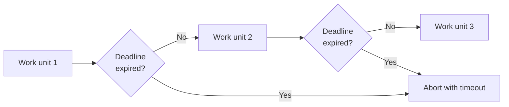

**Yield point locations**:

| Location | Why It's Safe |
|----------|---------------|
| After processing N rows | Between logical units of work |
| Before acquiring lock | Can abandon cleanly |
| After I/O completion | Natural pause point |
| Loop iteration boundaries | Easy to stop and roll back |
| Between query plan operators | Clean boundaries |

**Checking logic** (conceptual):
```csharp
void CheckTimeoutAtYieldPoint(ExecutionContext ctx)
{
    // Check 1: Explicit cancellation (cheap volatile read)
    if (ctx.CancellationRequested)
        throw new OperationCancelledException(ctx.CancellationReason);
    
    // Check 2: Deadline expiry (clock read - slightly more expensive)
    if (ctx.Deadline.IsExpired)
    {
        ctx.SetCancellation(CancellationReason.Timeout);
        throw new TimeoutException("Operation deadline expired");
    }
}
```

**Pros and cons**:
- ✅ Simple implementation
- ✅ Low overhead (just a few comparisons)
- ✅ Deterministic abort points
- ❌ Cannot interrupt blocking system calls
- ❌ Granularity limited by yield point frequency

### 2.4.2 Strategy 2: Asynchronous Watchdog Thread

**Concept**: A dedicated thread monitors all active operations and signals those that exceed their deadline.

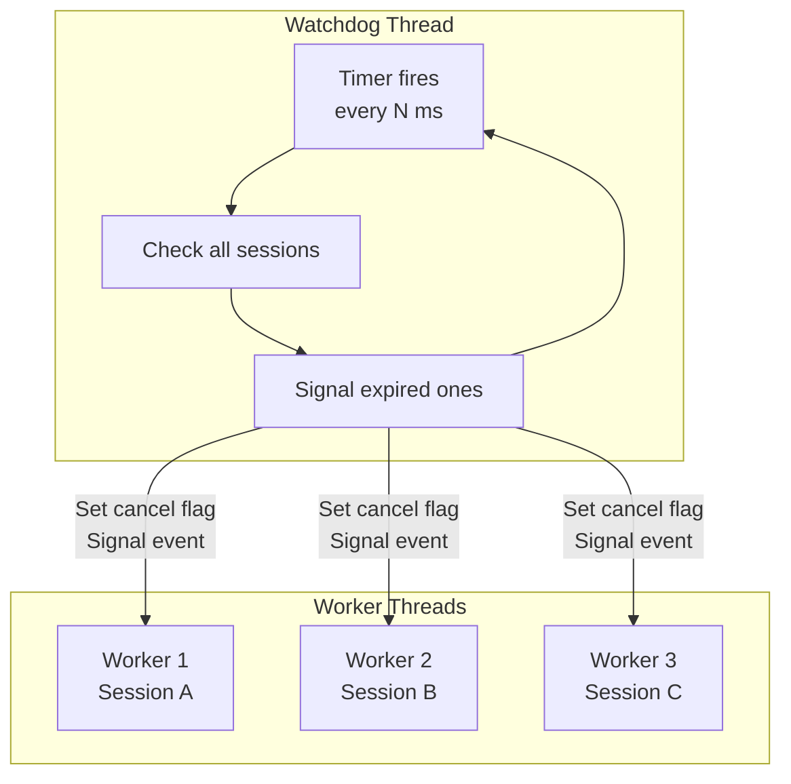

**Watchdog logic** (conceptual):
```csharp
void WatchdogThread()
{
    while (!shutdown)
    {
        Sleep(watchdogInterval);  // e.g., 500ms
        
        foreach (var ctx in activeContexts)
        {
            if (ctx.Deadline.IsExpired && !ctx.CancellationRequested)
            {
                // Mark for cancellation
                ctx.SetCancellation(CancellationReason.Timeout);
                
                // Wake up if blocked
                if (ctx.IsWaiting)
                {
                    SignalEvent(ctx.WaitEvent);
                }
            }
        }
    }
}
```

**Pros and cons**:
- ✅ Can interrupt blocked threads (via event signaling)
- ✅ Consistent timeout resolution
- ✅ Single centralized checker
- ❌ Additional thread overhead
- ❌ Resolution limited by watchdog interval
- ❌ Synchronization complexity

### 2.4.3 Strategy 3: Signal-Based (POSIX)

**Concept**: Use operating system signals (SIGALRM) with timers to interrupt operations.

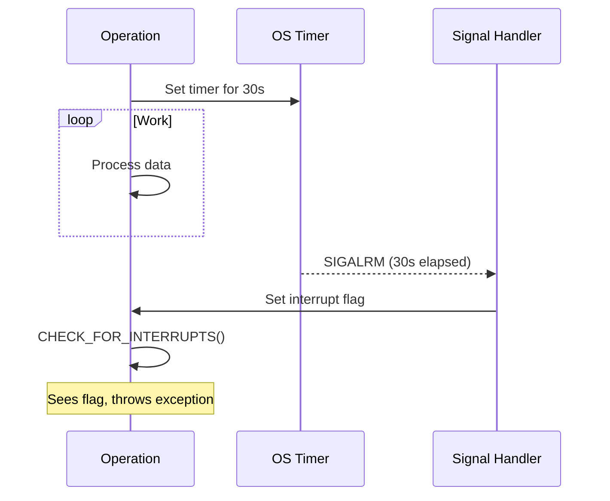

**Used by**: PostgreSQL (process-per-connection model makes signals practical)

**Signal handler** (conceptual):
```c
void handle_sig_alarm(int sig)
{
    // Signal handler context - very limited operations allowed!
    // Can only set volatile flags and call async-signal-safe functions
    
    InterruptPending = true;
    QueryCancelPending = true;
    
    // Wake up if sleeping on latch
    SetLatch(&MyProc->procLatch);
}
```

**Pros and cons**:
- ✅ Can interrupt blocking system calls (with SA_RESTART handling)
- ✅ OS-level precision
- ✅ No additional threads
- ❌ Complex signal safety requirements
- ❌ Only one SIGALRM timer per process
- ❌ Not suitable for thread-per-connection models

### 2.4.4 Strategy 4: Cooperative with Timed Waits

**Concept**: All blocking operations use timed waits, allowing periodic deadline checks.

```mermaid
flowchart TB
    WANT[Want to wait] --> CALC[Calculate: min(remaining_deadline, max_wait)]
    CALC --> WAIT[Timed wait]
    WAIT --> RESULT{Result?}
    RESULT -->|"Signaled"| DONE[Proceed]
    RESULT -->|"Timeout"| CHECK{Deadline<br/>expired?}
    CHECK -->|"No"| CALC
    CHECK -->|"Yes"| ABORT[Timeout error]
```

**Example** (lock wait with periodic checks):
```csharp
WaitResult WaitForLock(Lock lock, Deadline deadline)
{
    const int MaxWaitMs = 1000;  // Wake up at least every second
    
    while (true)
    {
        int remainingMs = deadline.RemainingMilliseconds;
        if (remainingMs == 0)
            return WaitResult.Timeout;
        
        int waitMs = Math.Min(remainingMs, MaxWaitMs);
        
        var result = lock.WaitEvent.Wait(waitMs);
        
        if (result == EventResult.Signaled)
        {
            if (lock.TryAcquire())
                return WaitResult.Acquired;
            // Spurious wakeup, continue waiting
        }
        
        // Check for external cancellation
        if (cancellationRequested)
            return WaitResult.Cancelled;
    }
}
```

**Used by**: InnoDB lock waits (1-second check interval)

**Pros and cons**:
- ✅ Works in any threading model
- ✅ Simple to implement
- ✅ Can check for multiple conditions
- ❌ Resolution limited by max wait interval
- ❌ More complex wait loop logic

### 2.4.5 Strategy 5: Hybrid Approach (What Engines Actually Use)

**Real database engines combine multiple strategies**:

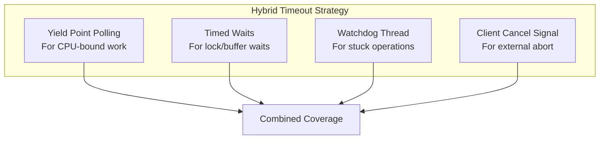

**How each engine combines strategies**:

| Engine | CPU-Bound | Lock Waits | I/O Waits | External Cancel |
|--------|-----------|------------|-----------|-----------------|
| SQL Server | Yield polling | Timed wait | Async I/O with timeout | TDS Attention signal |
| PostgreSQL | CHECK_FOR_INTERRUPTS | Timed latch wait + SIGALRM | OS with signal | Cancel key via new connection |
| MySQL/InnoDB | killed flag polling | Timed wait (1s) | OS-level | KILL command |

---

## 2.5 Cancellation Propagation

### 2.5.1 The Cancellation Pipeline

When a timeout occurs (or client cancels), the cancellation must propagate through the entire operation stack:

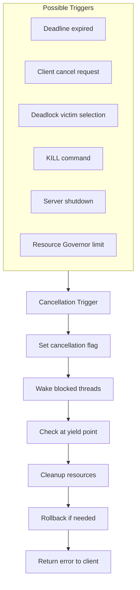

### 2.5.2 Cancellation Points

**Critical insight**: Cancellation can only happen at "safe" points where partial work can be cleanly abandoned or rolled back.

**Safe cancellation points**:

| Point | Why Safe |
|-------|----------|
| Between SQL statements in batch | Complete statement executed |
| At row boundaries during fetch | Partial results OK |
| Before lock acquisition | Haven't modified anything |
| During I/O wait (before completion) | Can abandon the wait |
| At operator boundaries in query plan | Clean state |

**Unsafe points** (cancellation deferred):

| Point | Why Unsafe |
|-------|------------|
| During page write to disk | Would corrupt data |
| During log flush | Would lose durability |
| During index split | Would corrupt index |
| During lock table modification | Would corrupt lock state |
| During recovery | Must complete for consistency |

### 2.5.3 Holdoff Regions

Database engines use "holdoff" counters to defer cancellation checks in critical sections:

```csharp
// Pattern: Holdoff region
void CriticalOperation(ExecutionContext ctx)
{
    ctx.BeginHoldoff();  // Increment holdoff counter
    try
    {
        // Cancellation checks are skipped in this region
        ModifyInternalStructure();
        WriteLogRecord();
        FlushPage();
    }
    finally
    {
        ctx.EndHoldoff();  // Decrement holdoff counter
        // Cancellation will be checked at next yield point
    }
}

void CheckCancellation(ExecutionContext ctx)
{
    // Skip check if in holdoff region
    if (ctx.HoldoffCount > 0)
        return;
    
    if (ctx.CancellationRequested)
        throw new OperationCancelledException();
}
```

**PostgreSQL example**:
```c
// From src/include/miscadmin.h
#define HOLD_INTERRUPTS()  (InterruptHoldoffCount++)
#define RESUME_INTERRUPTS() (InterruptHoldoffCount--)

#define CHECK_FOR_INTERRUPTS() \
    do { \
        if (InterruptHoldoffCount == 0 && CritSectionCount == 0 && \
            (InterruptPending)) \
            ProcessInterrupts(); \
    } while (0)
```

---

## 2.6 Wait Infrastructure

### 2.6.1 The Wait Event Abstraction

All database engines need a mechanism for threads to block efficiently while remaining responsive to cancellation:

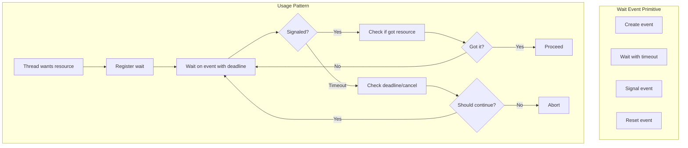

### 2.6.2 Platform-Specific Primitives

| Platform | Primitive | Notes |
|----------|-----------|-------|
| Windows | `HANDLE` (Event) | `WaitForSingleObject`, `SetEvent` |
| Linux | eventfd / futex | `epoll_wait`, `write` to wake |
| POSIX | pthread_cond_t | `pthread_cond_timedwait`, `pthread_cond_signal` |
| PostgreSQL | Latch | Abstraction over self-pipe, eventfd, or Win32 event |
| SQL Server | SOS_Event | SQLOS abstraction over Windows events |
| MySQL | os_event_t | InnoDB abstraction |

### 2.6.3 Wait State Tracking

For diagnostics (like `sys.dm_exec_requests` or `pg_stat_activity`), engines track current wait state:

```csharp
// Conceptual wait tracking
struct WaitInfo
{
    string WaitType;        // "LCK_M_X", "PAGEIOLATCH_SH", etc.
    string WaitResource;    // "RID: 5:1:100:0", "PAGE: 5:1:1234"
    long   WaitStartTicks;  // When wait began
    long   WaitDurationMs;  // Computed: now - start
}

void BeginWait(ExecutionContext ctx, WaitType type, string resource)
{
    ctx.CurrentWait = new WaitInfo
    {
        WaitType = type.Name,
        WaitResource = resource,
        WaitStartTicks = GetCurrentTicks()
    };
}

void EndWait(ExecutionContext ctx)
{
    // Record wait statistics
    var duration = GetCurrentTicks() - ctx.CurrentWait.WaitStartTicks;
    WaitStatistics.Record(ctx.CurrentWait.WaitType, duration);
    
    ctx.CurrentWait = null;
}
```

---

## 2.7 Key Design Principles Summary

### 2.7.1 The Five Essential Patterns

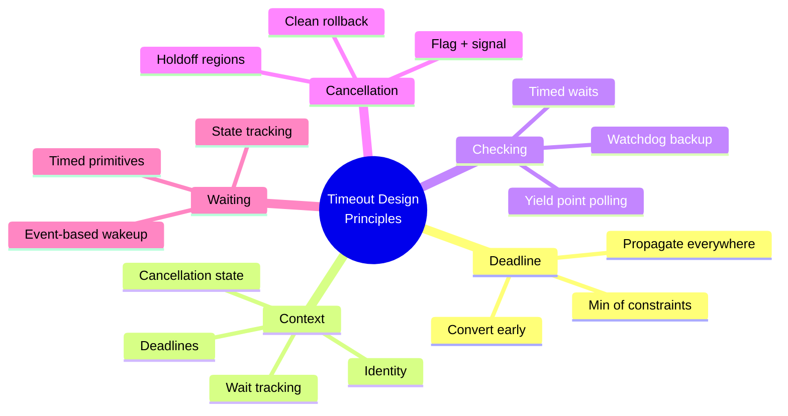

### 2.7.2 Do's and Don'ts

| ✅ Do | ❌ Don't |
|------|---------|
| Convert timeout to deadline once at entry | Pass relative timeout through call stack |
| Use monotonic time for deadline | Use wall-clock time (can jump) |
| Check deadline at yield points | Check deadline on every line |
| Use timed waits with max intervals | Use infinite waits |
| Propagate deadline via context | Compute new deadline at each level |
| Track wait state for diagnostics | Hide wait information |
| Use holdoff for critical sections | Allow cancel during structure modification |
| Signal + flag for cancellation | Just set flag (may not wake blocked thread) |

---

**Next**: [Part 3: SQL Server Internals](./03-sql-server-internals.md) - Deep dive into SQLOS, SOS_Task, and SQL Server's timeout implementation
