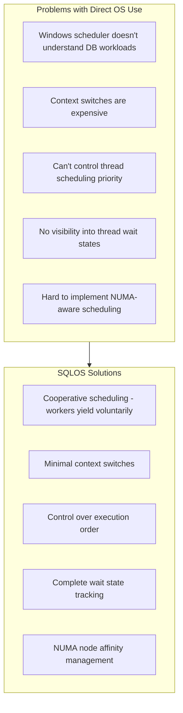
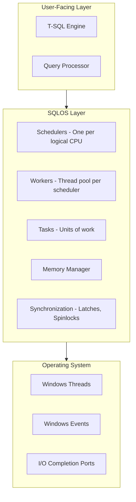
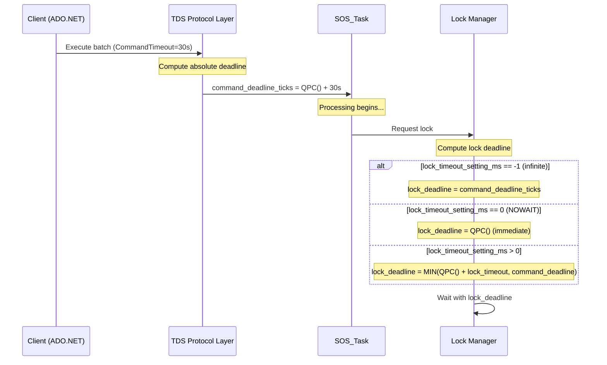
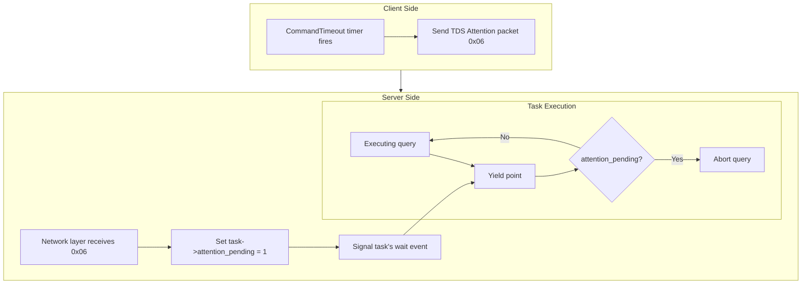
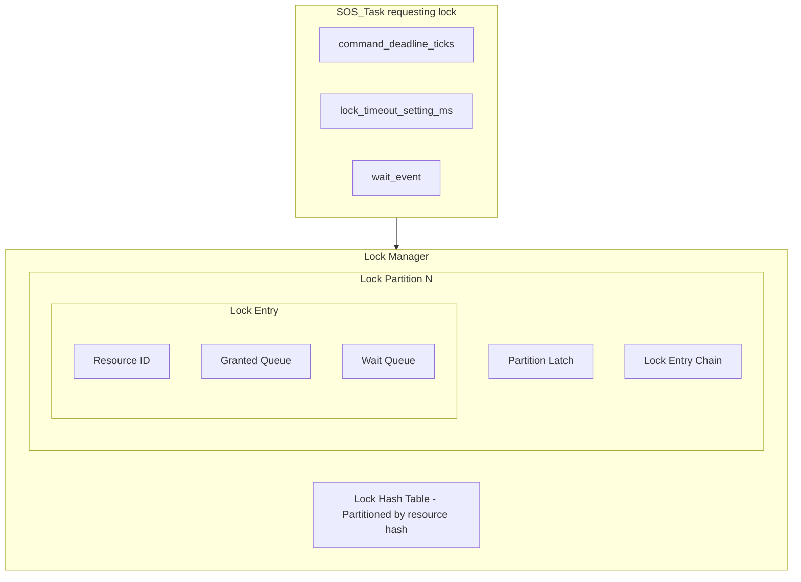
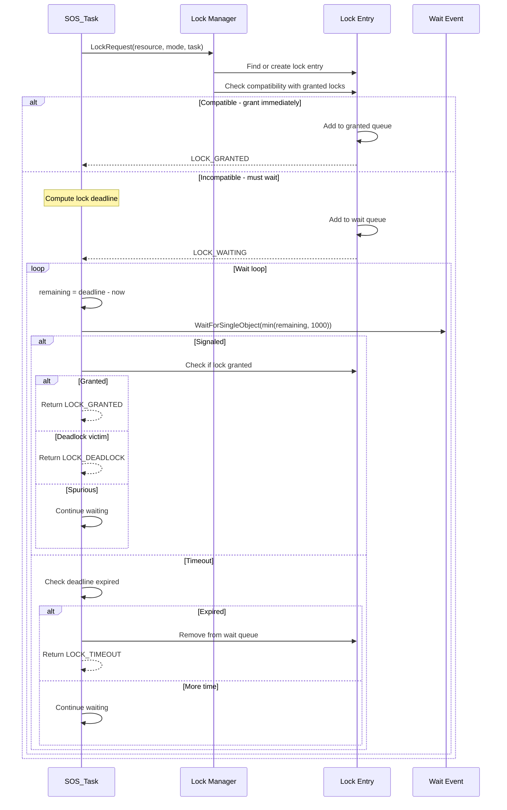
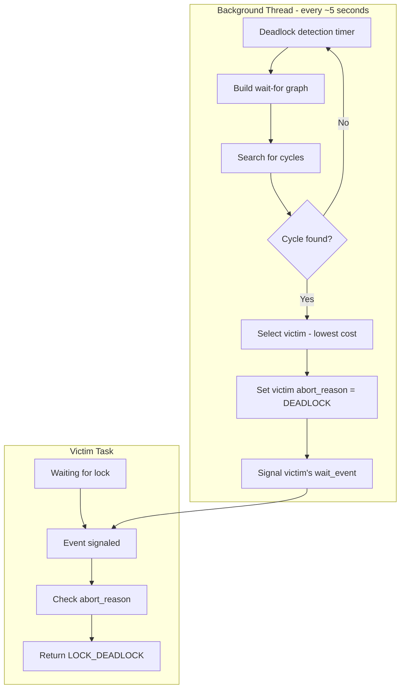
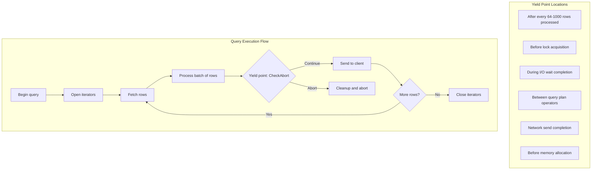
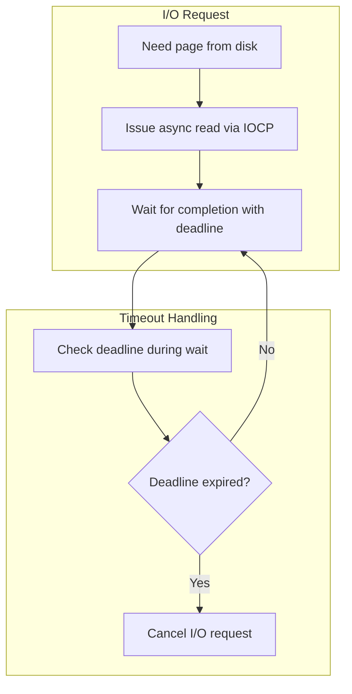
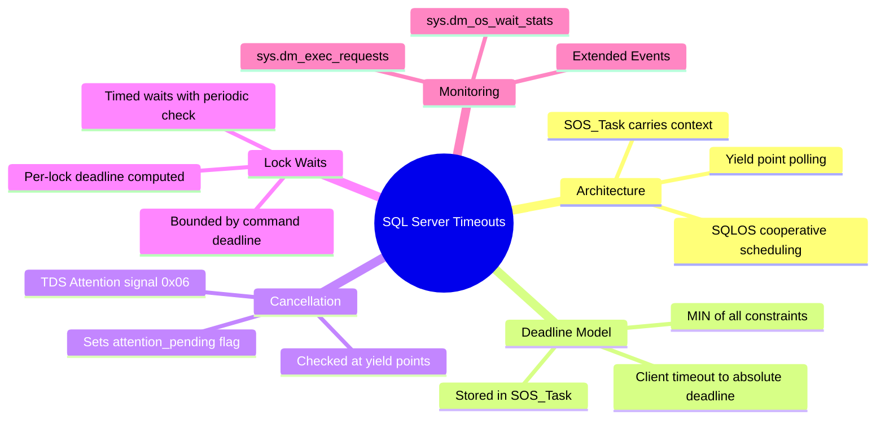

# Part 3: SQL Server Internals

> **Series**: Database Engine Timeout Internals  
> **Document**: 3 of 7  
> **Focus**: Deep dive into SQL Server's SQLOS, SOS_Task, and timeout implementation

---

## 3.1 SQLOS Architecture Overview

SQL Server implements its own operating system layer called **SQLOS** (SQL Server Operating System) that abstracts platform-specific details and provides cooperative scheduling.

### 3.1.1 Why SQLOS Exists



### 3.1.2 SQLOS Layer Stack



### 3.1.3 Key SQLOS Components for Timeout Handling

| Component | Role | Timeout Relevance |
|-----------|------|-------------------|
| **SOS_Scheduler** | Manages one logical CPU | Tracks runnable/running tasks |
| **SOS_Worker** | Wraps a Windows thread | Executes tasks |
| **SOS_Task** | Unit of work (one per request) | **Carries timeout/deadline state** |
| **SOS_WaitInfo** | Wait tracking | Records wait types and durations |
| **SOS_Event** | Signaling primitive | Used for timed waits |

---

## 3.2 SOS_Task: The Timeout Context Carrier

### 3.2.1 Structure Definition

```cpp
// Conceptual structure based on reverse engineering and documentation
struct SOS_Task
{
    // ═══════════════════════════════════════════════════════════════════════
    // IDENTITY
    // ═══════════════════════════════════════════════════════════════════════
    
    USHORT              session_id;           // SPID (sys.dm_exec_sessions)
    UINT32              request_id;           // Request within session
    UINT64              batch_id;             // Batch being executed
    UINT64              transaction_id;       // sys_xact_id
    
    // ═══════════════════════════════════════════════════════════════════════
    // DEADLINE STATE (all stored as absolute QPC ticks)
    // ═══════════════════════════════════════════════════════════════════════
    
    LONG64              command_deadline_ticks;    // From CommandTimeout, INFINITE = LLONG_MAX
    INT32               lock_timeout_setting_ms;   // SET LOCK_TIMEOUT: -1=infinite, 0=NOWAIT, >0=ms
    LONG64              query_governor_deadline_cpu_ticks;  // Resource Governor CPU limit
    
    // ═══════════════════════════════════════════════════════════════════════
    // CANCELLATION FLAGS (volatile for cross-thread visibility)
    // ═══════════════════════════════════════════════════════════════════════
    
    volatile LONG       attention_pending;     // Set by TDS layer when client sends 0x06
    volatile LONG       kill_pending;          // Set by KILL <spid> command
    UINT32              abort_reason;          // ABORT_ATTENTION, ABORT_KILL, ABORT_TIMEOUT, etc.
    
    // ═══════════════════════════════════════════════════════════════════════
    // WAIT STATE
    // ═══════════════════════════════════════════════════════════════════════
    
    HANDLE              wait_event;            // Windows event for blocking waits
    SOS_WaitInfo*       current_wait;          // For DMV reporting
    
    // ═══════════════════════════════════════════════════════════════════════
    // RESOURCE TRACKING
    // ═══════════════════════════════════════════════════════════════════════
    
    LONG64              cpu_ticks_consumed;    // For Resource Governor
    UINT64              memory_grant_kb;       // Query memory
    LONG64              rows_returned;         // For SET ROWCOUNT
    
    // ═══════════════════════════════════════════════════════════════════════
    // SCHEDULER LINKAGE
    // ═══════════════════════════════════════════════════════════════════════
    
    SOS_Scheduler*      owning_scheduler;
    SOS_Worker*         owning_worker;
    SOS_Task*           next_task;            // Linked list in scheduler
};

struct SOS_WaitInfo
{
    CHAR*               wait_type;            // "LCK_M_X", "PAGEIOLATCH_SH", etc.
    CHAR*               wait_resource;        // Resource description  
    LONG64              wait_start_ticks;     // QPC when wait began
    UINT32              wait_duration_ms;     // Computed on demand
    SOS_Task*           blocking_task;        // Who's blocking us (if lock wait)
};
```

### 3.2.2 Deadline Computation Flow



### 3.2.3 Effective Deadline Formula

```
effective_deadline = MIN(
    command_deadline_ticks,        // Client's CommandTimeout
    computed_lock_deadline,        // Current lock operation (if waiting)
    query_governor_cpu_deadline,   // Resource Governor CPU limit
    distributed_tx_deadline        // If in distributed transaction
)
```

---

## 3.3 TDS Protocol and Client Timeout Handling

### 3.3.1 The TDS Attention Mechanism

SQL Server uses the TDS (Tabular Data Stream) protocol. Client timeout cancellation works via the **Attention** signal:



**Key insight**: The client doesn't enforce the timeout directly - it sends a signal asking the server to abort. The server aborts at the next safe yield point.

### 3.3.2 CheckAbort: The Core Cancellation Check

```cpp
// Conceptual implementation - called at every yield point
void SOS_Task::CheckAbort()
{
    // Check 1: Client attention received (TDS cancel)
    if (InterlockedCompareExchange(&attention_pending, 0, 1) == 1)
    {
        abort_reason = ABORT_ATTENTION;
        RaiseAbortException();
    }
    
    // Check 2: KILL command received
    if (InterlockedCompareExchange(&kill_pending, 0, 1) == 1)
    {
        abort_reason = ABORT_KILL;
        RaiseAbortException();
    }
    
    // Check 3: Command deadline exceeded
    if (command_deadline_ticks != LLONG_MAX)
    {
        LONG64 now = QueryPerformanceCounter();
        if (now >= command_deadline_ticks)
        {
            abort_reason = ABORT_TIMEOUT;
            RaiseAbortException();
        }
    }
    
    // Check 4: Resource Governor CPU limit
    if (query_governor_deadline_cpu_ticks != LLONG_MAX)
    {
        if (cpu_ticks_consumed >= query_governor_deadline_cpu_ticks)
        {
            abort_reason = ABORT_RESOURCE_GOVERNOR;
            RaiseAbortException();
        }
    }
}
```

---

## 3.4 Lock Manager Timeout Implementation

### 3.4.1 Lock Manager Architecture



### 3.4.2 Lock Deadline Computation

```cpp
LONG64 ComputeLockDeadline(SOS_Task* task)
{
    LONG64 now = QueryPerformanceCounter();
    LONG64 qpc_freq = QueryPerformanceFrequency();
    
    INT32 lock_timeout_ms = task->lock_timeout_setting_ms;
    
    if (lock_timeout_ms == -1)
    {
        // Infinite lock timeout - bounded only by command deadline
        return task->command_deadline_ticks;
    }
    else if (lock_timeout_ms == 0)
    {
        // NOWAIT - immediate timeout (already expired)
        return now;
    }
    else
    {
        // Specific timeout - compute deadline
        LONG64 lock_deadline = now + (lock_timeout_ms * qpc_freq / 1000);
        
        // Bound by command deadline
        return min(lock_deadline, task->command_deadline_ticks);
    }
}
```

### 3.4.3 Lock Wait Flow



### 3.4.4 Deadlock Detection Integration



---

## 3.5 Query Execution Yield Points

### 3.5.1 Where Yield Points Occur

SQL Server checks for timeout/cancellation at specific safe locations:



### 3.5.2 Row Processing with Yield

```cpp
void ProcessRowBatch(SOS_Task* task, RowBatch* batch)
{
    const int YIELD_INTERVAL = 64;  // Check every 64 rows
    
    for (int i = 0; i < batch->row_count; i++)
    {
        ProcessSingleRow(batch->rows[i]);
        
        // Yield point: check cancellation periodically
        if ((i & (YIELD_INTERVAL - 1)) == 0)
        {
            task->CheckAbort();  // May throw
            
            // Also yield to scheduler if quantum exceeded (~4ms)
            if (ShouldYieldScheduler())
            {
                SOS_Scheduler::Yield();
            }
        }
    }
}
```

### 3.5.3 Cooperative Scheduling and Yield

SQLOS uses cooperative scheduling - yield also triggers CheckAbort:

```cpp
void SOS_Scheduler::Yield()
{
    SOS_Task* current = GetCurrentTask();
    
    // Check for abort conditions
    current->CheckAbort();
    
    // Yield to scheduler if other tasks waiting
    if (runnable_queue.HasTasks())
    {
        runnable_queue.Enqueue(current);
        SOS_Task* next = runnable_queue.Dequeue();
        SwitchTo(next);
    }
}
```

---

## 3.6 I/O Wait Timeout Handling

### 3.6.1 Asynchronous I/O with Deadline



### 3.6.2 Page Read with Deadline

```cpp
HRESULT ReadPageWithDeadline(SOS_Task* task, PageID page, void* buffer)
{
    // Issue asynchronous read
    OVERLAPPED overlapped = {0};
    overlapped.hEvent = task->wait_event;
    
    ReadFile(file_handle, buffer, PAGE_SIZE, NULL, &overlapped);
    
    // Record wait state for DMVs
    task->current_wait = CreateWaitInfo("PAGEIOLATCH_SH", page.ToString());
    
    while (true)
    {
        INT32 remaining_ms = TicksToMs(task->command_deadline_ticks - QPC());
        
        if (remaining_ms <= 0)
        {
            CancelIoEx(file_handle, &overlapped);
            return E_TIMEOUT;
        }
        
        // Wait with periodic wakeup to check cancellation
        DWORD result = WaitForSingleObject(task->wait_event, min(remaining_ms, 1000));
        
        task->CheckAbort();  // May throw
        
        if (result == WAIT_OBJECT_0)
        {
            DWORD bytes_read;
            if (GetOverlappedResult(file_handle, &overlapped, &bytes_read, FALSE))
                return S_OK;
            return E_FAIL;
        }
    }
}
```

---

## 3.7 Resource Governor CPU Limits

### 3.7.1 CPU Time vs Wall-Clock Time

| Scenario | Wall-Clock Time | CPU Time |
|----------|-----------------|----------|
| Waiting for lock (10s) | 10s | 0s |
| Waiting for I/O (5s) | 5s | 0s |
| CPU processing (3s) | 3s | 3s |
| **Total** | **18s** | **3s** |

Resource Governor's `REQUEST_MAX_CPU_TIME_SEC` limits only CPU time, not wall-clock time.

### 3.7.2 CPU Time Enforcement

```cpp
void CheckResourceGovernorLimits(SOS_Task* task)
{
    if (task->query_governor_deadline_cpu_ticks == LLONG_MAX)
        return;  // No limit
    
    // Update CPU ticks consumed
    LONG64 current_cpu = GetThreadCpuTicks();
    task->cpu_ticks_consumed = current_cpu - task->cpu_ticks_start;
    
    // Check against limit
    if (task->cpu_ticks_consumed >= task->query_governor_deadline_cpu_ticks)
    {
        task->abort_reason = ABORT_RESOURCE_GOVERNOR;
        RaiseAbortException();
    }
}
```

---

## 3.8 Monitoring and Diagnostics

### 3.8.1 Key DMVs for Timeout Analysis

```sql
-- Current requests with wait info
SELECT session_id, status, command, wait_type, wait_time,
       wait_resource, cpu_time, total_elapsed_time
FROM sys.dm_exec_requests
WHERE session_id > 50;

-- Accumulated wait statistics  
SELECT wait_type, waiting_tasks_count, wait_time_ms, max_wait_time_ms
FROM sys.dm_os_wait_stats
WHERE wait_type LIKE 'LCK%' OR wait_type LIKE 'PAGEIOLATCH%'
ORDER BY wait_time_ms DESC;

-- Blocking chains
SELECT blocked.session_id, blocked.wait_type, blocked.wait_time,
       blocked.blocking_session_id, blocked.wait_resource
FROM sys.dm_exec_requests blocked
WHERE blocked.blocking_session_id IS NOT NULL;
```

### 3.8.2 Extended Events for Timeout Monitoring

```sql
CREATE EVENT SESSION [TimeoutMonitoring] ON SERVER
ADD EVENT sqlserver.lock_timeout,
ADD EVENT sqlserver.lock_deadlock,
ADD EVENT sqlserver.attention
ADD TARGET package0.event_file(SET filename=N'Timeouts.xel');
```

---

## 3.9 Configuration Summary

| Setting | Scope | Default | Where Set |
|---------|-------|---------|-----------|
| `CommandTimeout` | Command | 30s | ADO.NET SqlCommand |
| `Connect Timeout` | Connection | 15s | Connection string |
| `LOCK_TIMEOUT` | Session | -1 (∞) | `SET LOCK_TIMEOUT` |
| `query wait` | Server | -1 | `sp_configure` |
| `REQUEST_MAX_CPU_TIME_SEC` | Workload Group | 0 (∞) | Resource Governor |

---

## 3.10 Key Takeaways



---

**Next**: [Part 4: PostgreSQL Internals](./04-postgresql-internals.md)
