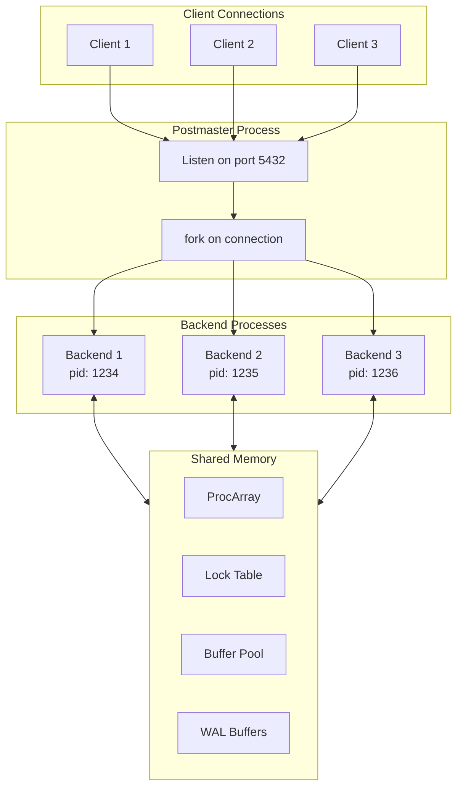
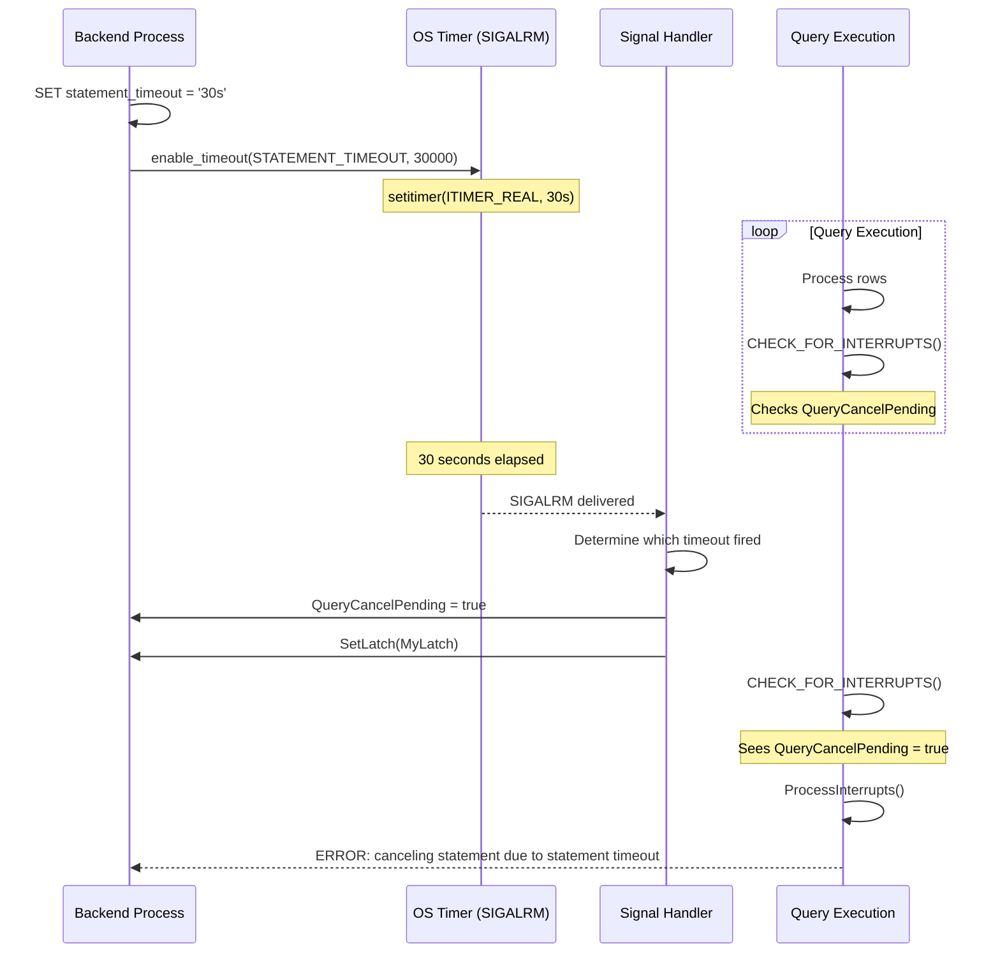
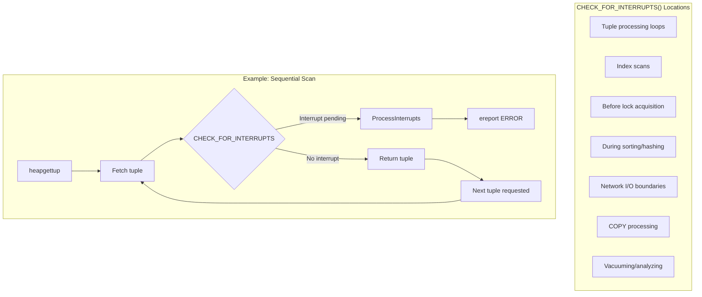
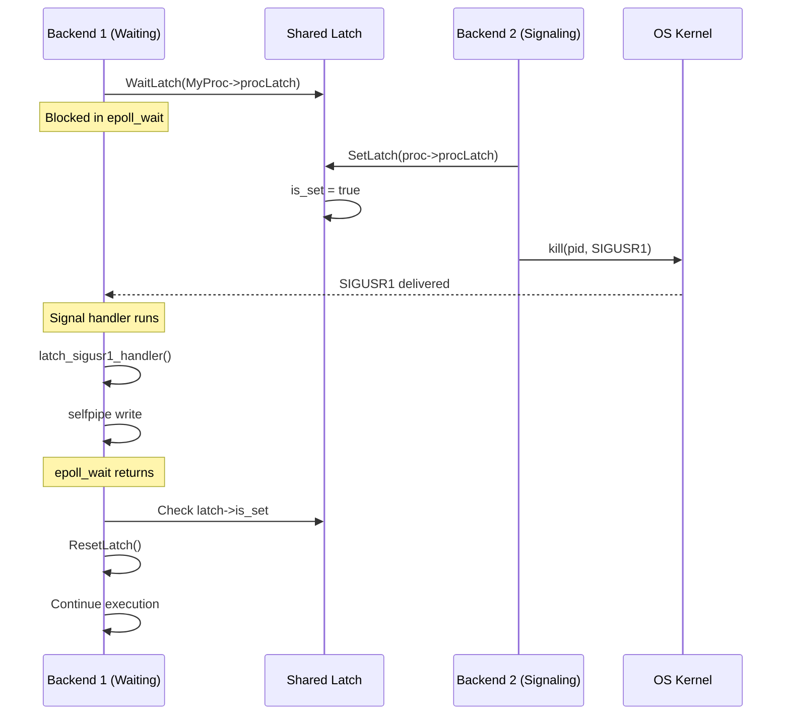
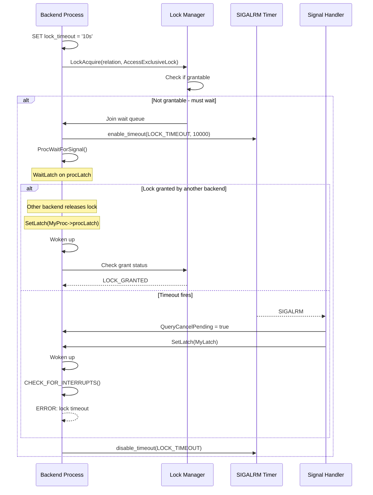
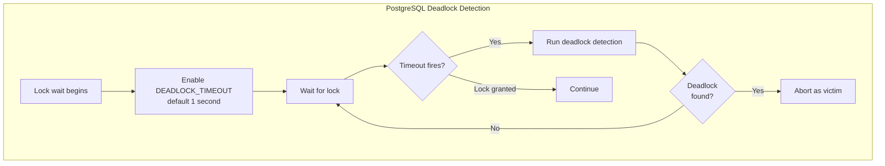
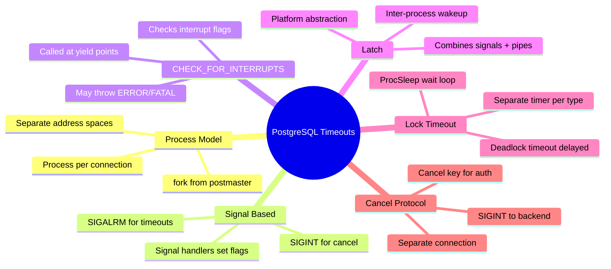

# Part 4: PostgreSQL Internals

> **Series**: Database Engine Timeout Internals  
> **Document**: 4 of 7  
> **Focus**: PostgreSQL's signal-based timeout architecture, PGPROC, and CHECK_FOR_INTERRUPTS

---

## 4.1 PostgreSQL Process Model

### 4.1.1 Process-Per-Connection Architecture

Unlike SQL Server's thread-per-connection model, PostgreSQL uses a **process-per-connection** model:



### 4.1.2 Implications for Timeout Handling

| Aspect | Thread Model (SQL Server) | Process Model (PostgreSQL) |
|--------|---------------------------|---------------------------|
| **Timeout signal** | Shared memory flags + events | POSIX signals (SIGALRM, SIGINT) |
| **Context access** | Thread-local or passed | Process-global pointers |
| **Cancel mechanism** | In-process flag set | Signal from another process |
| **Coordination** | Shared memory only | Signals + shared memory |
| **Isolation** | Shared address space | Separate address spaces |

---

## 4.2 PGPROC: The Process Context Structure

### 4.2.1 Structure Definition

```c
// Simplified from src/include/storage/proc.h
typedef struct PGPROC
{
    // ═══════════════════════════════════════════════════════════════════════
    // IDENTITY
    // ═══════════════════════════════════════════════════════════════════════
    
    int             pid;                    // OS process ID
    int             pgprocno;               // Index in ProcGlobal->allProcs
    BackendId       backendId;              // Backend ID (1-based)
    
    LocalTransactionId lxid;                // Local transaction ID
    TransactionId   xid;                    // Current top-level xact ID
    TransactionId   xmin;                   // Oldest xact ID this backend cares about
    
    // ═══════════════════════════════════════════════════════════════════════
    // TIMEOUT SETTINGS (intervals in milliseconds, NOT deadlines)
    // ═══════════════════════════════════════════════════════════════════════
    
    // These are the timeout SETTINGS, not computed deadlines
    // PostgreSQL uses timers, not deadline passing
    
    // statement_timeout: SET statement_timeout = '30s'
    // lock_timeout: SET lock_timeout = '10s'
    // idle_in_transaction_session_timeout
    // transaction_timeout (PostgreSQL 17+)
    
    // ═══════════════════════════════════════════════════════════════════════
    // INTERRUPT FLAGS (set by signal handlers)
    // ═══════════════════════════════════════════════════════════════════════
    
    // sig_atomic_t is guaranteed atomic for signal handler access
    volatile sig_atomic_t QueryCancelPending;    // Cancel requested
    volatile sig_atomic_t ProcDiePending;         // Terminate requested
    volatile sig_atomic_t ClientConnectionLost;   // Client gone
    volatile sig_atomic_t IdleInTransactionSessionTimeoutPending;
    volatile sig_atomic_t TransactionTimeoutPending;
    volatile sig_atomic_t IdleSessionTimeoutPending;
    
    // Interrupt control
    volatile uint32 InterruptHoldoffCount;        // Defer interrupt processing
    volatile uint32 CritSectionCount;             // In critical section
    
    // ═══════════════════════════════════════════════════════════════════════
    // WAIT STATE (for pg_stat_activity)
    // ═══════════════════════════════════════════════════════════════════════
    
    uint32          wait_event_info;        // Encoded: class << 24 | event
    
    // ═══════════════════════════════════════════════════════════════════════
    // LATCH (inter-process signaling primitive)
    // ═══════════════════════════════════════════════════════════════════════
    
    Latch           procLatch;              // For wakeup signaling
    
    // ═══════════════════════════════════════════════════════════════════════
    // LOCK WAIT STATE
    // ═══════════════════════════════════════════════════════════════════════
    
    LOCK*           waitLock;               // Lock we're waiting for
    PROCLOCK*       waitProcLock;           // Associated PROCLOCK
    LOCKMODE        waitLockMode;           // Mode requested
    LOCKMASK        heldLocks;              // Bitmask of held lock modes
    
    // ═══════════════════════════════════════════════════════════════════════
    // DEADLOCK DETECTION
    // ═══════════════════════════════════════════════════════════════════════
    
    SHM_QUEUE       links;                  // Wait queue linkage
    PGPROC*         lockGroupLeader;        // For parallel query
    dlist_head      lockGroupMembers;       // Parallel workers
    
} PGPROC;
```

### 4.2.2 Global Pointers

PostgreSQL uses global pointers for fast access:

```c
// Process-global pointers (src/backend/storage/lmgr/proc.c)
PGPROC*         MyProc = NULL;          // This backend's PGPROC
PGPROC*         MyProcGlobal = NULL;    // For auxiliary processes
```

---

## 4.3 Signal-Based Timeout Architecture

### 4.3.1 The Signal Flow

PostgreSQL uses POSIX signals for timeout notification:



### 4.3.2 Timeout Type Registry

PostgreSQL maintains a registry of timeout types:

```c
// From src/include/utils/timeout.h
typedef enum TimeoutId
{
    // Predefined timeout types
    DEADLOCK_TIMEOUT,           // Deadlock detection delay
    STATEMENT_TIMEOUT,          // SET statement_timeout
    LOCK_TIMEOUT,               // SET lock_timeout
    IDLE_IN_TRANSACTION_SESSION_TIMEOUT,
    IDLE_SESSION_TIMEOUT,
    TRANSACTION_TIMEOUT,        // PostgreSQL 17+
    CLIENT_CONNECTION_CHECK_TIMEOUT,
    STANDBY_DEADLOCK_TIMEOUT,
    STANDBY_TIMEOUT,
    STANDBY_LOCK_TIMEOUT,
    
    // User-defined timeouts
    MAX_TIMEOUTS = 16
} TimeoutId;

typedef struct timeout_params
{
    TimeoutId       id;
    TimestampTz     fin_time;           // Absolute finish time
    timeout_handler_proc handler;       // Callback function
    bool            indicator;          // Set to true when fires
} timeout_params;
```

### 4.3.3 Timer Management

```c
// Conceptual timer management
void enable_timeout(TimeoutId id, int timeout_ms)
{
    TimestampTz now = GetCurrentTimestamp();
    TimestampTz fin_time = TimestampTzPlusMilliseconds(now, timeout_ms);
    
    // Register the timeout
    timeout_params* param = &all_timeouts[id];
    param->fin_time = fin_time;
    param->indicator = false;
    
    // Reschedule SIGALRM for earliest timeout
    schedule_sigalrm();
}

void disable_timeout(TimeoutId id)
{
    all_timeouts[id].fin_time = INVALID_TIMESTAMP;
    schedule_sigalrm();  // Reschedule for next earliest
}

void schedule_sigalrm()
{
    // Find earliest pending timeout
    TimestampTz earliest = find_earliest_timeout();
    
    if (earliest == INVALID_TIMESTAMP)
    {
        // No timeouts pending - cancel timer
        setitimer(ITIMER_REAL, &zero_interval, NULL);
    }
    else
    {
        // Set timer for earliest timeout
        long secs = ...; // compute from earliest
        setitimer(ITIMER_REAL, &interval, NULL);
    }
}
```

---

## 4.4 CHECK_FOR_INTERRUPTS: The Core Mechanism

### 4.4.1 Macro Definition

```c
// From src/include/miscadmin.h
#define CHECK_FOR_INTERRUPTS() \
do { \
    if (unlikely(InterruptPending)) \
        ProcessInterrupts(); \
} while(0)

// InterruptPending is a macro that checks multiple flags
#define InterruptPending \
    (QueryCancelPending || ProcDiePending || \
     IdleInTransactionSessionTimeoutPending || \
     IdleSessionTimeoutPending || TransactionTimeoutPending || ...)
```

### 4.4.2 ProcessInterrupts Implementation

```c
// Simplified from src/backend/tcop/postgres.c
void ProcessInterrupts(void)
{
    // Don't process if in holdoff region
    if (InterruptHoldoffCount > 0 || CritSectionCount > 0)
        return;
    
    // Clear pending flag (will be set again if needed)
    InterruptPending = false;
    
    // Check each interrupt type in priority order
    
    if (ProcDiePending)
    {
        ProcDiePending = false;
        ereport(FATAL,
            (errcode(ERRCODE_ADMIN_SHUTDOWN),
             errmsg("terminating connection due to administrator command")));
    }
    
    if (ClientConnectionLost)
    {
        // Handle based on transaction state
        if (IsTransactionOrTransactionBlock())
        {
            ereport(FATAL,
                (errcode(ERRCODE_CONNECTION_FAILURE),
                 errmsg("connection to client lost")));
        }
        // Otherwise just note it and continue
    }
    
    if (QueryCancelPending)
    {
        QueryCancelPending = false;
        
        // Different messages based on source
        if (cancel_from_timeout)
        {
            ereport(ERROR,
                (errcode(ERRCODE_QUERY_CANCELED),
                 errmsg("canceling statement due to statement timeout")));
        }
        else
        {
            ereport(ERROR,
                (errcode(ERRCODE_QUERY_CANCELED),
                 errmsg("canceling statement due to user request")));
        }
    }
    
    if (TransactionTimeoutPending)
    {
        TransactionTimeoutPending = false;
        ereport(ERROR,
            (errcode(ERRCODE_QUERY_CANCELED),
             errmsg("canceling statement due to transaction timeout")));
    }
    
    if (IdleInTransactionSessionTimeoutPending)
    {
        IdleInTransactionSessionTimeoutPending = false;
        ereport(FATAL,
            (errcode(ERRCODE_IDLE_IN_TRANSACTION_SESSION_TIMEOUT),
             errmsg("terminating connection due to idle-in-transaction timeout")));
    }
}
```

### 4.4.3 CHECK_FOR_INTERRUPTS Placement



---

## 4.5 Latch: The Inter-Process Signaling Primitive

### 4.5.1 What Is a Latch?

A **Latch** is PostgreSQL's abstraction for waiting with the ability to be woken by:
1. Another process setting the latch
2. A signal (SIGALRM, SIGINT)
3. A timeout
4. Socket activity

```c
// From src/include/storage/latch.h
typedef struct Latch
{
    sig_atomic_t    is_set;         // Set when latch is signaled
    bool            is_shared;      // In shared memory?
    int             owner_pid;      // Process that owns this latch
#ifdef WIN32
    HANDLE          event;          // Windows event handle
#endif
} Latch;

// Wait multiplexing flags
#define WL_LATCH_SET         (1 << 0)
#define WL_SOCKET_READABLE   (1 << 1)
#define WL_SOCKET_WRITEABLE  (1 << 2)
#define WL_TIMEOUT           (1 << 3)
#define WL_POSTMASTER_DEATH  (1 << 4)
#define WL_EXIT_ON_PM_DEATH  (1 << 5)
```

### 4.5.2 WaitLatch Implementation

```c
int WaitLatch(Latch* latch, int wakeEvents, long timeout_ms, uint32 wait_event_info)
{
    // Record wait state for pg_stat_activity
    pgstat_report_wait_start(wait_event_info);
    
    int result = 0;
    
    // Compute absolute deadline if timeout specified
    TimestampTz deadline = 0;
    if (wakeEvents & WL_TIMEOUT)
        deadline = GetCurrentTimestamp() + timeout_ms * 1000;
    
    while (result == 0)
    {
        // Check if latch already set
        if ((wakeEvents & WL_LATCH_SET) && latch->is_set)
        {
            result = WL_LATCH_SET;
            break;
        }
        
        // Calculate remaining timeout
        long remaining_ms = -1;
        if (wakeEvents & WL_TIMEOUT)
        {
            TimestampTz now = GetCurrentTimestamp();
            if (now >= deadline)
            {
                result = WL_TIMEOUT;
                break;
            }
            remaining_ms = (deadline - now) / 1000;
        }
        
        // Platform-specific wait
        // Linux: epoll_wait on self-pipe + optional socket
        // Windows: WaitForMultipleObjects
        result = WaitLatchInternal(latch, wakeEvents, remaining_ms);
        
        // Handle signals that may have arrived
        CHECK_FOR_INTERRUPTS();
    }
    
    pgstat_report_wait_end();
    return result;
}
```

### 4.5.3 Latch Signaling Between Processes



---

## 4.6 Lock Timeout Implementation

### 4.6.1 Lock Acquisition with Timeout



### 4.6.2 ProcSleep: The Lock Wait Function

```c
// Simplified from src/backend/storage/lmgr/proc.c
ProcWaitStatus ProcSleep(LOCALLOCK* locallock, LockMethod lockMethodTable)
{
    PGPROC*     proc = MyProc;
    LOCK*       lock = locallock->lock;
    PROCLOCK*   proclock = locallock->proclock;
    
    // Add to wait queue
    SHMQueueInsertBefore(&lock->waitProcs, &proc->links);
    proc->waitLock = lock;
    proc->waitProcLock = proclock;
    
    // Enable lock timeout if configured
    if (lock_timeout > 0)
        enable_timeout(LOCK_TIMEOUT, lock_timeout);
    
    // Enable deadlock timeout (always)
    enable_timeout(DEADLOCK_TIMEOUT, DeadlockTimeout);
    
    // Wait loop
    while (true)
    {
        // Report wait state
        pgstat_report_wait_start(PG_WAIT_LOCK | lock->tag.locktag_type);
        
        // Wait on our latch
        WaitLatch(MyLatch, WL_LATCH_SET | WL_EXIT_ON_PM_DEATH, -1, 
                  PG_WAIT_LOCK | lock->tag.locktag_type);
        
        pgstat_report_wait_end();
        
        // Reset latch for next iteration
        ResetLatch(MyLatch);
        
        // CHECK_FOR_INTERRUPTS may throw (timeout, cancel)
        CHECK_FOR_INTERRUPTS();
        
        // Check if we got the lock
        if (proc->waitStatus != PROC_WAIT_STATUS_WAITING)
        {
            // We got woken up - lock granted or error
            break;
        }
        
        // Check for deadlock after DEADLOCK_TIMEOUT
        if (got_deadlock_timeout)
        {
            CheckDeadLock();
            got_deadlock_timeout = false;
        }
    }
    
    // Disable timeouts
    disable_timeout(LOCK_TIMEOUT);
    disable_timeout(DEADLOCK_TIMEOUT);
    
    proc->waitLock = NULL;
    
    return proc->waitStatus;
}
```

---

## 4.7 Deadlock Detection

### 4.7.1 Deadlock Timeout vs Immediate Detection

PostgreSQL uses **delayed deadlock detection** controlled by `deadlock_timeout`:



**Why delayed?**
- Deadlock detection is expensive (graph traversal)
- Most lock waits are short
- Better to wait 1 second than run detection immediately

### 4.7.2 Deadlock Detection Algorithm

```c
// Simplified from src/backend/storage/lmgr/deadlock.c
void CheckDeadLock(void)
{
    // Build wait-for graph from lock table
    // Only considers processes that have been waiting > deadlock_timeout
    
    DeadLockState result = DeadLockCheck(MyProc);
    
    switch (result)
    {
        case DS_NO_DEADLOCK:
            // Not in a deadlock - continue waiting
            break;
            
        case DS_SOFT_DEADLOCK:
            // Potential deadlock - wait longer
            break;
            
        case DS_HARD_DEADLOCK:
            // Definite deadlock - we are the victim
            // Must abort
            ereport(ERROR,
                (errcode(ERRCODE_T_R_DEADLOCK_DETECTED),
                 errmsg("deadlock detected"),
                 errdetail_log("Process %d waits for %s on %s; blocked by process %d.",
                               ...)));
            break;
    }
}
```

---

## 4.8 Client Cancel Protocol

### 4.8.1 Cancel Key Mechanism

PostgreSQL uses a unique protocol for query cancellation - the client must send a cancel request on a **new connection**:

```mermaid
sequenceDiagram
    participant Client
    participant Postmaster
    participant Backend as Backend (pid 1234)
    
    Client->>Postmaster: Connect
    Postmaster->>Backend: fork()
    Backend-->>Client: BackendKeyData (pid=1234, key=0xABCD1234)
    
    Client->>Backend: BEGIN; SELECT * FROM large_table;
    Note over Backend: Long-running query
    
    Note over Client: User presses Ctrl+C
    
    Client->>Postmaster: New connection with CancelRequest
    Note over Postmaster: CancelRequest(pid=1234, key=0xABCD1234)
    Postmaster->>Postmaster: Verify key matches
    Postmaster->>Backend: kill(1234, SIGINT)
    Postmaster-->>Client: Close cancel connection
    
    Note over Backend: SIGINT handler runs
    Backend->>Backend: QueryCancelPending = true
    Backend->>Backend: SetLatch(MyLatch)
    
    Backend->>Backend: CHECK_FOR_INTERRUPTS()
    Backend-->>Client: ERROR: canceling statement due to user request
```

### 4.8.2 Why Separate Connection?

| Reason | Explanation |
|--------|-------------|
| **No in-band signaling** | Can't send on query connection (server owns it) |
| **Authentication** | Cancel key prevents unauthorized cancellation |
| **Simplicity** | No need to modify query protocol |
| **Security** | Only holder of cancel key can cancel |

---

## 4.9 Holdoff and Critical Sections

### 4.9.1 Interrupt Holdoff

```c
// Defer interrupt processing
#define HOLD_INTERRUPTS() (InterruptHoldoffCount++)
#define RESUME_INTERRUPTS() \
    do { \
        Assert(InterruptHoldoffCount > 0); \
        InterruptHoldoffCount--; \
    } while(0)

// Example usage
void SomeInternalOperation(void)
{
    HOLD_INTERRUPTS();
    
    // Interrupts deferred here
    ModifyCriticalData();
    
    RESUME_INTERRUPTS();
    // CHECK_FOR_INTERRUPTS will now process pending interrupts
}
```

### 4.9.2 Critical Sections

Critical sections are even stronger - cannot be interrupted even by FATAL errors:

```c
#define START_CRIT_SECTION() (CritSectionCount++)
#define END_CRIT_SECTION() \
    do { \
        Assert(CritSectionCount > 0); \
        CritSectionCount--; \
    } while(0)

// Used for WAL-critical operations
void XLogInsert(...)
{
    START_CRIT_SECTION();
    
    // Must complete - even PANIC won't stop us
    WriteWALRecord();
    
    END_CRIT_SECTION();
}
```

### 4.9.3 Processing After Holdoff

```c
void CHECK_FOR_INTERRUPTS()
{
    if (InterruptHoldoffCount > 0)
        return;  // Deferred
    
    if (CritSectionCount > 0)
        return;  // In critical section
    
    if (InterruptPending)
        ProcessInterrupts();  // Now process them
}
```

---

## 4.10 Configuration Summary

| Setting | Scope | Default | Description |
|---------|-------|---------|-------------|
| `statement_timeout` | Session | 0 (disabled) | Per-statement timeout |
| `lock_timeout` | Session | 0 (disabled) | Lock acquisition timeout |
| `idle_in_transaction_session_timeout` | Session | 0 (disabled) | Idle in transaction |
| `idle_session_timeout` | Session | 0 (disabled) | Idle connection (PG 14+) |
| `transaction_timeout` | Session | 0 (disabled) | Transaction lifetime (PG 17+) |
| `deadlock_timeout` | Server | 1s | Delay before deadlock check |
| `authentication_timeout` | Server | 60s | Login timeout |
| `tcp_keepalives_idle` | Connection | OS | TCP keepalive start |

---

## 4.11 Monitoring

### 4.11.1 pg_stat_activity

```sql
SELECT 
    pid,
    usename,
    state,
    wait_event_type,
    wait_event,
    query_start,
    state_change,
    NOW() - query_start AS query_duration,
    query
FROM pg_stat_activity
WHERE state != 'idle'
ORDER BY query_start;
```

### 4.11.2 Lock Monitoring

```sql
-- Blocked queries and their blockers
SELECT 
    blocked.pid AS blocked_pid,
    blocked.query AS blocked_query,
    blocking.pid AS blocking_pid,
    blocking.query AS blocking_query,
    NOW() - blocked.query_start AS wait_duration
FROM pg_stat_activity blocked
JOIN pg_locks blocked_locks ON blocked.pid = blocked_locks.pid
JOIN pg_locks blocking_locks 
    ON blocked_locks.locktype = blocking_locks.locktype
    AND blocked_locks.database = blocking_locks.database
    AND blocked_locks.relation = blocking_locks.relation
    AND blocked_locks.pid != blocking_locks.pid
JOIN pg_stat_activity blocking ON blocking_locks.pid = blocking.pid
WHERE NOT blocked_locks.granted AND blocking_locks.granted;
```

---

## 4.12 Key Takeaways



---

**Next**: [Part 5: MySQL/InnoDB Internals](./05-mysql-innodb-internals.md)
