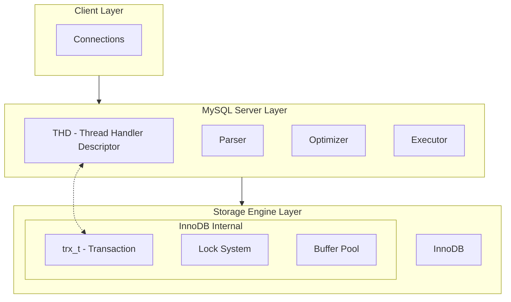
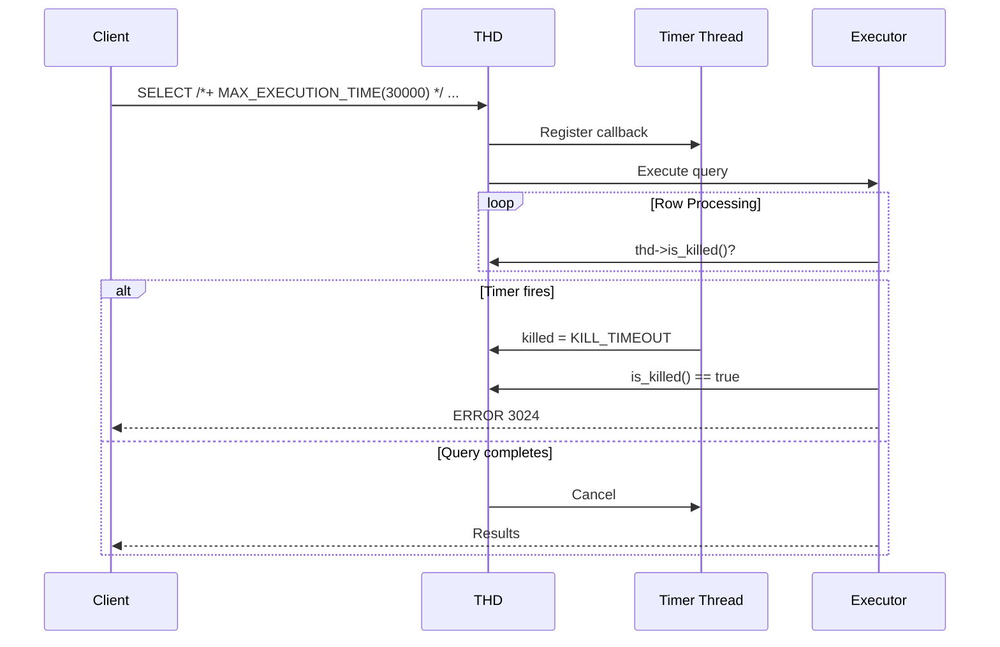
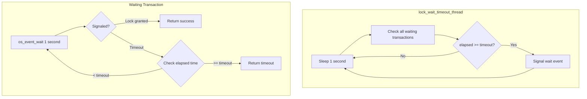
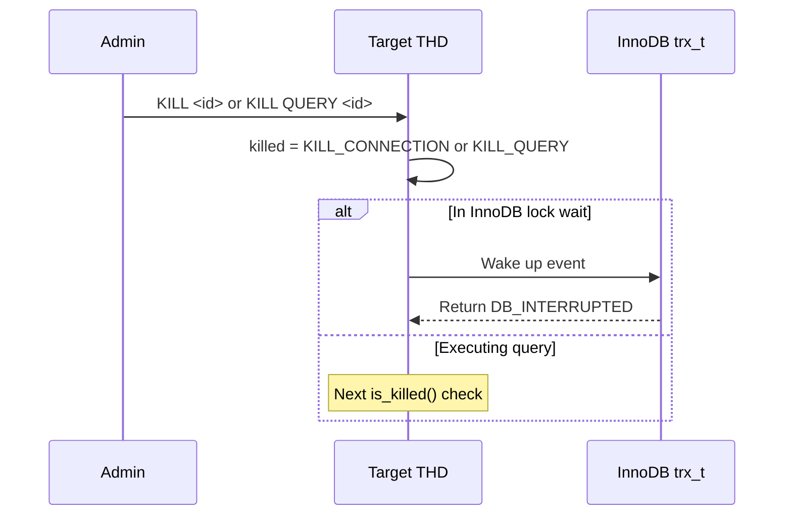
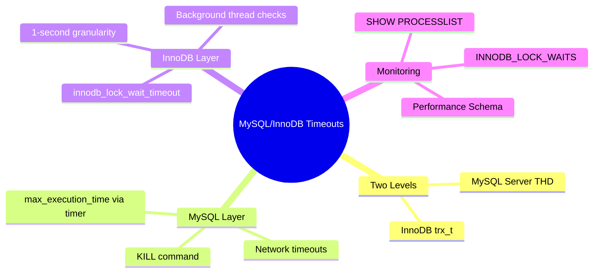

# Part 5: MySQL/InnoDB Internals

> **Series**: Database Engine Timeout Internals  
> **Document**: 5 of 7  
> **Focus**: MySQL's THD structure, InnoDB's trx_t, and the hybrid timeout architecture

---

## 5.1 MySQL Architecture Overview

### 5.1.1 Layered Architecture

MySQL has a unique **pluggable storage engine** architecture:



### 5.1.2 Two-Level Timeout Handling

| Level | Structure | Handles |
|-------|-----------|---------|
| **MySQL Server** | THD | `max_execution_time`, network timeouts, KILL |
| **InnoDB Engine** | trx_t | `innodb_lock_wait_timeout`, deadlock |

---

## 5.2 THD: Thread Handler Descriptor

```cpp
// Simplified from sql/sql_class.h
class THD
{
public:
    // Identity
    my_thread_id    m_thread_id;           // Connection ID
    ulonglong       query_id;              // Current query
    
    // Timeout settings
    ulong           variables.net_wait_timeout;
    ulong           variables.net_read_timeout;
    ulong           variables.net_write_timeout;
    ulong           variables.lock_wait_timeout;      // InnoDB lock timeout
    ulonglong       variables.max_execution_time;     // Query timeout (ms)
    
    // Kill state
    std::atomic<killed_state> killed;
    // Values: NOT_KILLED, KILL_CONNECTION, KILL_QUERY, KILL_TIMEOUT
    
    // Timer for max_execution_time
    THD_timer_info* m_timer;
    bool            m_timer_active;
    
    // State
    const char*     proc_info;             // For SHOW PROCESSLIST
    ulonglong       start_utime;           // Query start time
    
    // Methods
    bool is_killed() const;
    void awake(killed_state state);        // Set killed flag
};
```

---

## 5.3 max_execution_time Implementation



Timer callback sets the killed flag:
```cpp
void thd_timer_callback(my_timer_t* timer)
{
    THD_timer_info* info = (THD_timer_info*)timer->user_data;
    info->thd->awake(THD::KILL_TIMEOUT);
}
```

---

## 5.4 InnoDB Transaction Structure

```cpp
// Simplified from storage/innobase/include/trx0trx.h
struct trx_t
{
    // Identity
    trx_id_t        id;
    THD*            mysql_thd;             // Link to MySQL layer
    
    // State
    trx_state_t     state;                 // NOT_STARTED, ACTIVE, PREPARED
    
    // Lock wait
    lock_t*         wait_lock;             // Lock we're waiting for
    std::chrono::steady_clock::time_point wait_started;
    bool            in_innodb_lock_wait;
    os_event_t      lock_wait_event;       // Condition variable
};
```

---

## 5.5 InnoDB Lock Wait Timeout

InnoDB uses a **background thread** that checks all waiters every second:



Lock wait implementation:
```cpp
dberr_t lock_wait_suspend_thread(trx_t* trx)
{
    trx->wait_started = std::chrono::steady_clock::now();
    ulonglong timeout_sec = trx->mysql_thd->variables.lock_wait_timeout;
    
    while (true)
    {
        os_event_wait_time(trx->lock_wait_event, 1000000);  // 1 second
        os_event_reset(trx->lock_wait_event);
        
        if (trx_is_interrupted(trx))
            return DB_INTERRUPTED;
        
        if (trx->wait_lock == nullptr)
            return DB_SUCCESS;  // Lock granted
        
        auto elapsed = now() - trx->wait_started;
        if (elapsed >= std::chrono::seconds(timeout_sec))
            return DB_LOCK_WAIT_TIMEOUT;
    }
}
```

---

## 5.6 Deadlock Detection

InnoDB can detect deadlocks immediately (default) or rely on timeout:

| `innodb_deadlock_detect` | Behavior |
|--------------------------|----------|
| ON (default) | Immediate detection via wait-for graph |
| OFF | Rely on `innodb_lock_wait_timeout` |

Disable for high-contention workloads where detection overhead exceeds benefit.

---

## 5.7 MySQL KILL Command



| Command | Effect |
|---------|--------|
| `KILL <id>` | Terminates connection |
| `KILL QUERY <id>` | Cancels query, keeps connection |

---

## 5.8 Network Timeouts

| Setting | Default | Description |
|---------|---------|-------------|
| `connect_timeout` | 10s | Handshake timeout |
| `wait_timeout` | 28800s | Idle non-interactive |
| `interactive_timeout` | 28800s | Idle interactive |
| `net_read_timeout` | 30s | Reading from client |
| `net_write_timeout` | 60s | Writing to client |

---

## 5.9 Metadata Lock (MDL) Timeout

MySQL has **two lock systems**:

| Type | System | Timeout Setting |
|------|--------|-----------------|
| Row/table locks | InnoDB | `innodb_lock_wait_timeout` (50s) |
| DDL/metadata | MySQL Server | `lock_wait_timeout` (1 year!) |

---

## 5.10 Monitoring

```sql
-- Current processes
SHOW PROCESSLIST;
SELECT * FROM information_schema.PROCESSLIST;

-- InnoDB lock waits  
SELECT * FROM information_schema.INNODB_LOCK_WAITS;

-- Performance Schema (MySQL 8.0+)
SELECT * FROM performance_schema.data_lock_waits;
SELECT * FROM performance_schema.events_waits_current;
```

---

## 5.11 Configuration Summary

| Setting | Scope | Default | Description |
|---------|-------|---------|-------------|
| `innodb_lock_wait_timeout` | Session/Global | 50s | InnoDB lock wait |
| `lock_wait_timeout` | Session | 31536000s | MDL wait |
| `max_execution_time` | Session/Stmt | 0 | SELECT timeout (ms) |
| `wait_timeout` | Session | 28800s | Idle connection |
| `innodb_deadlock_detect` | Global | ON | Deadlock detection |

---

## 5.12 Key Takeaways



---

**Next**: [Part 6: Comparative Analysis](./06-comparative-analysis.md)
