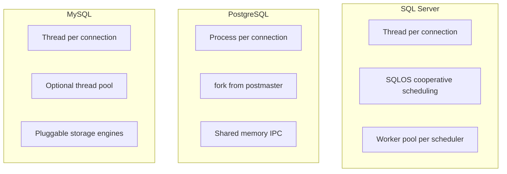
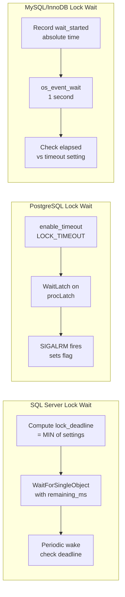
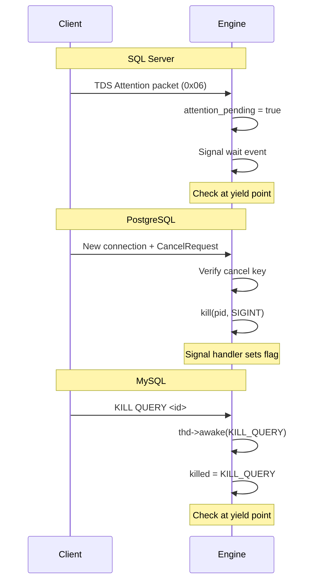
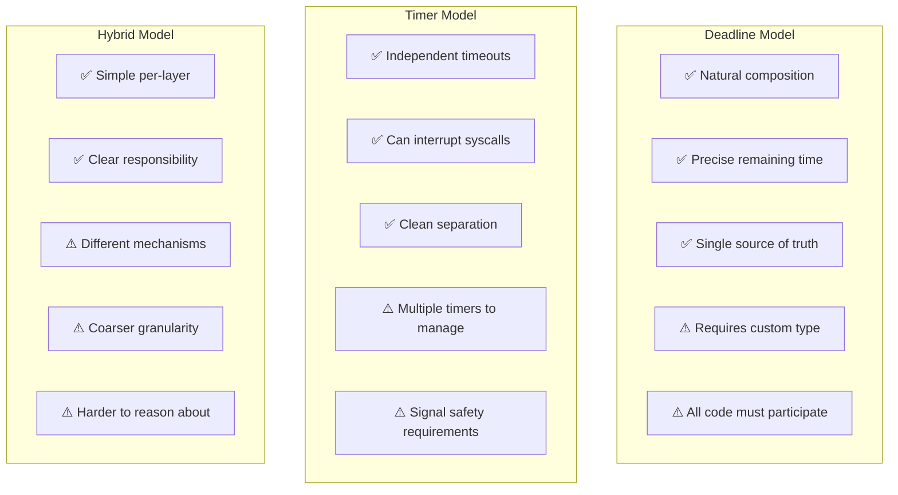
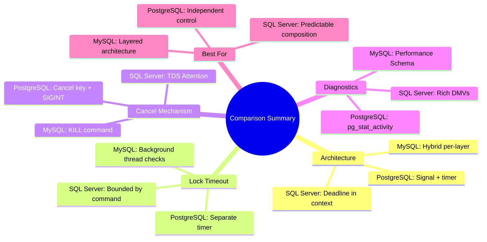

# Part 6: Comparative Analysis

> **Series**: Database Engine Timeout Internals  
> **Document**: 6 of 7  
> **Focus**: Side-by-side comparison of SQL Server, PostgreSQL, and MySQL/InnoDB timeout architectures

---

## 6.1 Architectural Comparison

### 6.1.1 Process/Thread Model



| Aspect | SQL Server | PostgreSQL | MySQL |
|--------|------------|------------|-------|
| **Model** | Thread-per-connection | Process-per-connection | Thread-per-connection |
| **Scheduling** | SQLOS cooperative | OS preemptive | OS preemptive |
| **Context** | SOS_Task (thread-local) | PGPROC (process-global) | THD (thread-local) |
| **Signal support** | Limited (Windows) | Full POSIX signals | Limited (cross-platform) |
| **Memory isolation** | Shared address space | Separate address spaces | Shared address space |

### 6.1.2 Timeout Propagation Architecture

```mermaid
flowchart TB
    subgraph SS["SQL Server: Absolute Deadline"]
        SS1[Client sends CommandTimeout]
        SS1 --> SS2[TDS converts to absolute ticks]
        SS2 --> SS3[Stored in SOS_Task.command_deadline_ticks]
        SS3 --> SS4[All operations check deadline]
        SS4 --> SS5[Remaining = deadline - now]
    end
    
    subgraph PG["PostgreSQL: Signal + Timer"]
        PG1[SET statement_timeout = '30s']
        PG1 --> PG2[enable_timeout sets SIGALRM]
        PG2 --> PG3[Timer fires after 30s]
        PG3 --> PG4[Signal handler sets QueryCancelPending]
        PG4 --> PG5[CHECK_FOR_INTERRUPTS sees flag]
    end
    
    subgraph MY["MySQL: Hybrid"]
        MY1[max_execution_time = 30000]
        MY1 --> MY2[Timer thread registered]
        MY2 --> MY3[Timer callback sets killed flag]
        
        MY4[innodb_lock_wait_timeout = 50]
        MY4 --> MY5[Record wait_started time]
        MY5 --> MY6[Background thread checks elapsed]
    end
```



---

## 6.2 Deadline vs Timer Comparison

### 6.2.1 How Each Engine Handles "30 Second Timeout"

**SQL Server (Deadline-based)**:
```
1. Client: CommandTimeout = 30s
2. TDS Layer: deadline = QueryPerformanceCounter() + 30s_in_ticks
3. Store: SOS_Task.command_deadline_ticks = deadline
4. Every operation: remaining = deadline - QPC()
5. Wait calls: WaitForSingleObject(event, remaining_ms)
```

**PostgreSQL (Timer-based)**:
```
1. Session: SET statement_timeout = '30s'
2. Query start: enable_timeout(STATEMENT_TIMEOUT, 30000)
3. Kernel: setitimer(ITIMER_REAL, 30s)
4. After 30s: SIGALRM delivered
5. Handler: QueryCancelPending = true; SetLatch()
6. Yield point: CHECK_FOR_INTERRUPTS() throws
```

**MySQL (Hybrid)**:
```
Query timeout (max_execution_time):
1. SET max_execution_time = 30000
2. Query start: register timer callback
3. Timer thread: callback sets killed = KILL_TIMEOUT
4. Yield point: thd->is_killed() returns true

Lock timeout (innodb_lock_wait_timeout):
1. Lock wait start: record wait_started = now()
2. Background thread: elapsed = now() - wait_started
3. If elapsed > timeout: signal wait event
4. Wait loop: check elapsed, return timeout error
```

### 6.2.2 Pros and Cons

| Approach | Pros | Cons |
|----------|------|------|
| **Deadline (SQL Server)** | Natural composition, precise remaining time, works across components | Requires deadline type, all code must understand it |
| **Timer (PostgreSQL)** | Clean separation, can interrupt syscalls, explicit per-timeout | Multiple timers to manage, signal complexity, cross-process harder |
| **Hybrid (MySQL)** | Simple per-component, clear separation | Different mechanisms at different layers, 1-second granularity for locks |

---

## 6.3 Lock Wait Timeout Comparison

### 6.3.1 Mechanism Comparison



### 6.3.2 Configuration Comparison

| Setting | SQL Server | PostgreSQL | MySQL |
|---------|------------|------------|-------|
| **Default lock timeout** | -1 (infinite) | 0 (disabled) | 50 seconds |
| **Setting scope** | Session (`SET LOCK_TIMEOUT`) | Session (`SET lock_timeout`) | Session/Global |
| **Granularity** | Milliseconds | Milliseconds | Seconds |
| **NOWAIT support** | `SET LOCK_TIMEOUT 0` | `NOWAIT` clause | `NOWAIT` clause |
| **Bounded by command timeout** | Yes | No (separate timer) | No |

### 6.3.3 Deadlock Detection

| Aspect | SQL Server | PostgreSQL | MySQL/InnoDB |
|--------|------------|------------|--------------|
| **Detection timing** | Continuous (~5s cycle) | After `deadlock_timeout` (1s) | Continuous or disabled |
| **Algorithm** | Wait-for graph | Wait-for graph | Wait-for graph |
| **Victim selection** | Lowest cost (log size) | Initiating transaction | Lowest weight |
| **Can disable?** | No | No | Yes (`innodb_deadlock_detect=OFF`) |
| **Trade-off** | Always runs | Delayed start saves CPU | Can rely on timeout instead |

---

## 6.4 Query Cancel Mechanism

### 6.4.1 Cancel Flow Comparison



### 6.4.2 Cancel Mechanism Properties

| Property | SQL Server | PostgreSQL | MySQL |
|----------|------------|------------|-------|
| **Signal type** | In-band (same connection) | Out-of-band (new connection) | Separate session |
| **Authentication** | Connection ownership | Cancel key | MySQL privileges |
| **Can interrupt blocked wait?** | Yes (via event) | Yes (via signal + latch) | Yes (via event + vio_cancel) |
| **Latency** | Sub-millisecond | ~milliseconds | ~milliseconds |

---

## 6.5 Yield Point / Cancellation Check

### 6.5.1 Where Checks Occur

| Location | SQL Server | PostgreSQL | MySQL |
|----------|------------|------------|-------|
| After N rows | ✅ (64-1000) | ✅ (varies) | ✅ (varies) |
| Before lock acquire | ✅ | ✅ | ✅ |
| During I/O wait | ✅ (timed wait) | ✅ (latch) | ✅ (timed wait) |
| Network I/O | ✅ | ✅ | ✅ |
| Between operators | ✅ | ✅ | ✅ |
| Scheduler yield | ✅ (cooperative) | N/A (preemptive) | N/A (preemptive) |

### 6.5.2 Check Implementation

| Engine | Check Mechanism | Cost |
|--------|-----------------|------|
| SQL Server | `SOS_Task::CheckAbort()` | Volatile read + optional clock read |
| PostgreSQL | `CHECK_FOR_INTERRUPTS()` macro | Volatile read, process if pending |
| MySQL | `thd->is_killed()` | Atomic load |

---

## 6.6 Wait State Visibility

### 6.6.1 Diagnostic Views

| Information | SQL Server | PostgreSQL | MySQL |
|-------------|------------|------------|-------|
| Current wait type | `sys.dm_exec_requests.wait_type` | `pg_stat_activity.wait_event_type` | `performance_schema.events_waits_current` |
| Wait resource | `sys.dm_exec_requests.wait_resource` | `pg_stat_activity.wait_event` | `SHOW ENGINE INNODB STATUS` |
| Wait duration | `sys.dm_exec_requests.wait_time` | Computed from query_start | `information_schema.INNODB_TRX` |
| Accumulated waits | `sys.dm_os_wait_stats` | `pg_stat_user_tables` (I/O only) | `performance_schema.events_waits_summary_*` |
| Blocking info | `sys.dm_exec_requests.blocking_session_id` | `pg_blocking_pids()` | `INNODB_LOCK_WAITS` |

### 6.6.2 Wait Type Granularity

| Engine | Number of Wait Types | Examples |
|--------|---------------------|----------|
| SQL Server | ~900 | `LCK_M_X`, `PAGEIOLATCH_SH`, `CXPACKET`, `ASYNC_NETWORK_IO` |
| PostgreSQL | ~200 | `Lock:relation`, `LWLock:buffer_content`, `IO:DataFileRead` |
| MySQL | ~400 | `wait/synch/mutex/innodb/buf_pool_mutex`, `wait/io/file/innodb/innodb_data_file` |

---

## 6.7 Configuration Defaults Comparison

| Timeout Type | SQL Server | PostgreSQL | MySQL |
|--------------|------------|------------|-------|
| **Command/Statement** | 30s (client) | 0 (disabled) | 0 (disabled) |
| **Lock wait** | -1 (infinite) | 0 (disabled) | 50s |
| **Connection** | 15s | OS default | 10s |
| **Idle** | None | 0 (disabled) | 28800s (8h) |
| **Deadlock detection** | ~5s interval | 1s delay | Immediate |
| **Network read** | OS | OS | 30s |
| **Network write** | OS | OS | 60s |

---

## 6.8 Decision Matrix: When to Use Each Pattern

### 6.8.1 Choosing a Timeout Architecture

| If you need... | Best Model | Why |
|----------------|------------|-----|
| Precise remaining time calculation | Deadline (SQL Server) | Single reference point |
| Simple per-timeout configuration | Timer (PostgreSQL) | Independent timers |
| Cross-component composition | Deadline (SQL Server) | Natural MIN semantics |
| Ability to interrupt syscalls | Timer/Signal (PostgreSQL) | POSIX signal delivery |
| Different timeouts per operation type | Timer (PostgreSQL) or Hybrid | Separate settings |
| Minimal clock reads | Deadline (SQL Server) | Computed once |
| Process isolation | Timer (PostgreSQL) | Signals cross processes |

### 6.8.2 Trade-offs Summary



---

## 6.9 Performance Implications

### 6.9.1 Overhead Comparison

| Operation | SQL Server | PostgreSQL | MySQL |
|-----------|------------|------------|-------|
| Timeout check | ~10ns (volatile + optional QPC) | ~5ns (volatile read) | ~5ns (atomic load) |
| Timer setup | N/A (deadline computed once) | ~1μs (setitimer syscall) | ~100ns (timer registration) |
| Wait with timeout | Windows event (efficient) | epoll/select (efficient) | Condition variable |
| Cancellation propagation | Immediate (shared memory) | ~100μs (signal delivery) | Immediate (shared memory) |

### 6.9.2 Scalability Considerations

| Aspect | SQL Server | PostgreSQL | MySQL |
|--------|------------|------------|-------|
| Many short queries | ✅ No per-query timer setup | ⚠️ setitimer per statement | ⚠️ Timer registration |
| Many concurrent sessions | ✅ SQLOS manages efficiently | ⚠️ Process per connection | ✅ Thread pool optional |
| High contention locks | ✅ Fine-grained checking | ✅ Signal-based wake | ⚠️ 1-second granularity |

---

## 6.10 Key Takeaways



---

**Next**: [Part 7: Design Guidelines](./07-design-guidelines.md) - Principles for designing your own timeout system
