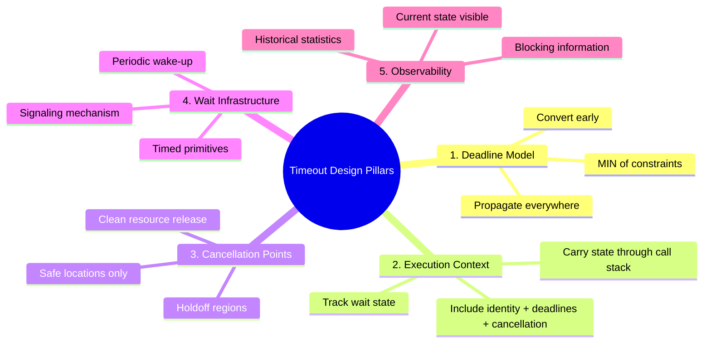
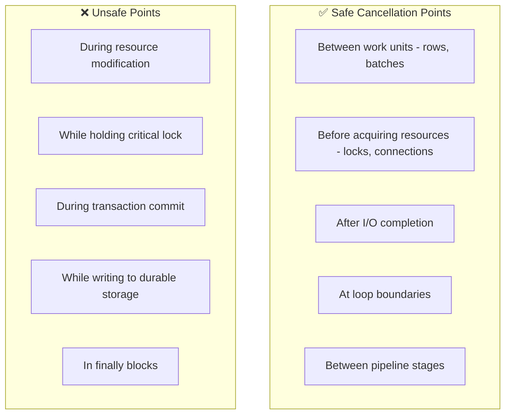
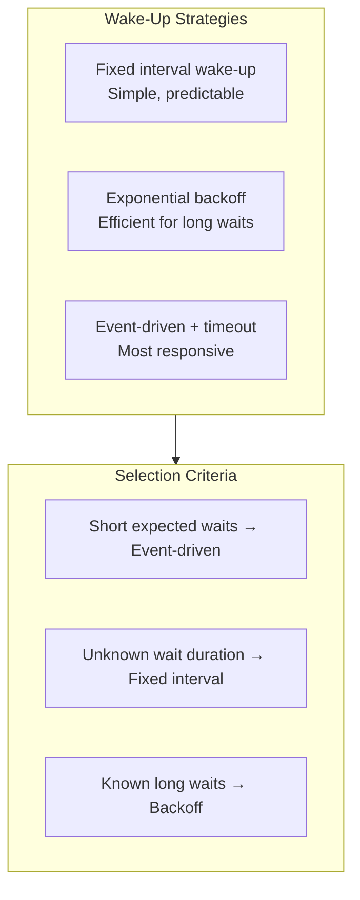
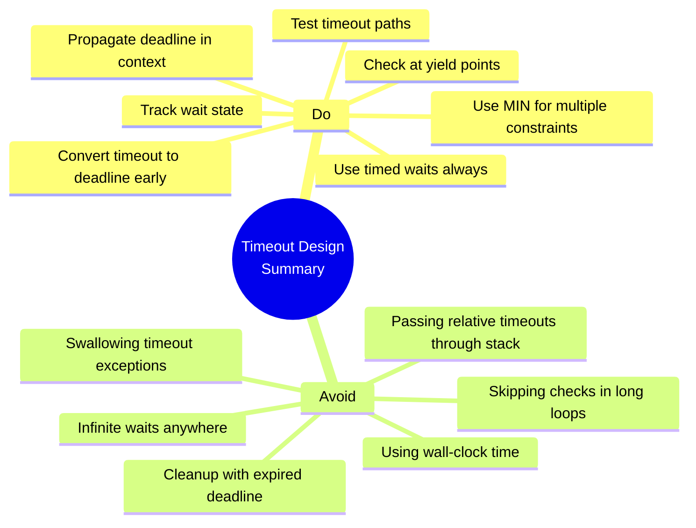

# Part 7: Design Guidelines

> **Series**: Database Engine Timeout Internals  
> **Document**: 7 of 7  
> **Focus**: Principles and guidelines for designing timeout systems in your own applications

---

## 7.1 Core Design Principles

### 7.1.1 The Five Pillars of Timeout Design



### 7.1.2 Fundamental Rules

| Rule | Description | Rationale |
|------|-------------|-----------|
| **Convert early** | Transform relative timeout to absolute deadline at entry point | Prevents accumulation |
| **Propagate always** | Pass deadline/context to all nested operations | Ensures global bound |
| **Use MIN** | Effective deadline = MIN of all constraints | Most restrictive wins |
| **Check periodically** | Insert cancellation checks at yield points | Balance responsiveness vs overhead |
| **Use timed waits** | Never use infinite waits in timeout-aware code | Always wake up to check |
| **Track state** | Record current wait type and resource | Enables diagnosis |
| **Clean up** | Ensure proper resource release on timeout | Prevent leaks |

---

## 7.2 Deadline Type Design

### 7.2.1 Essential Properties

A well-designed deadline type should have:

```csharp
// Essential deadline type interface
public readonly struct Deadline
{
    // Construction
    public static Deadline FromTimeout(TimeSpan timeout);
    public static Deadline FromMilliseconds(int ms);
    public static readonly Deadline Infinite;  // No timeout
    public static readonly Deadline Zero;       // Already expired
    
    // Queries
    public bool IsExpired { get; }
    public bool IsInfinite { get; }
    public TimeSpan Remaining { get; }
    public int RemainingMilliseconds { get; }  // For Wait APIs
    
    // Composition
    public static Deadline Min(Deadline a, Deadline b);
    
    // Convenience
    public void ThrowIfExpired(string operation);
    public CancellationToken ToCancellationToken();
}
```

### 7.2.2 Time Source Considerations

**Use monotonic time, not wall-clock time:**

| Time Source | Pros | Cons | Use For |
|-------------|------|------|---------|
| `DateTime.UtcNow` | Simple, cross-process | Can jump (NTP, DST) | Logging, display |
| `Stopwatch.GetTimestamp()` | Monotonic, high precision | Resets on reboot | **Timeouts** |
| `Environment.TickCount64` | Monotonic, fast | Lower precision | Coarse timeouts |

```csharp
// WRONG: Wall-clock time can jump
DateTime deadline = DateTime.UtcNow.AddSeconds(30);  // ❌

// CORRECT: Monotonic time only moves forward
long deadlineTicks = Stopwatch.GetTimestamp() + 
                     (long)(30.0 * Stopwatch.Frequency);  // ✅
```

### 7.2.3 Handling Overflow

```csharp
public static Deadline FromTimeout(TimeSpan timeout)
{
    if (timeout == Timeout.InfiniteTimeSpan || timeout.Ticks < 0)
        return Infinite;
    
    long now = Stopwatch.GetTimestamp();
    long duration = (long)(timeout.TotalSeconds * Stopwatch.Frequency);
    
    // Check for overflow
    if (now > long.MaxValue - duration)
        return Infinite;  // Would overflow, treat as infinite
    
    return new Deadline(now + duration);
}
```

---

## 7.3 Execution Context Design

### 7.3.1 What to Include in Context

```csharp
public class OperationContext
{
    // ═══════════════════════════════════════════════════════════════════════
    // IDENTITY (for logging, diagnostics)
    // ═══════════════════════════════════════════════════════════════════════
    public Guid OperationId { get; }
    public string OperationName { get; }
    public int SessionId { get; }
    
    // ═══════════════════════════════════════════════════════════════════════
    // DEADLINES (may have multiple)
    // ═══════════════════════════════════════════════════════════════════════
    public Deadline CommandDeadline { get; }
    public Deadline LockDeadline { get; private set; }
    public Deadline EffectiveDeadline => Deadline.Min(CommandDeadline, LockDeadline);
    
    // ═══════════════════════════════════════════════════════════════════════
    // CANCELLATION
    // ═══════════════════════════════════════════════════════════════════════
    public CancellationToken CancellationToken { get; }
    public bool IsCancellationRequested { get; }
    public CancellationReason? Reason { get; }
    
    // ═══════════════════════════════════════════════════════════════════════
    // WAIT STATE (for diagnostics)
    // ═══════════════════════════════════════════════════════════════════════
    public string CurrentWaitType { get; set; }
    public string CurrentWaitResource { get; set; }
    public DateTime? WaitStartTime { get; set; }
    
    // ═══════════════════════════════════════════════════════════════════════
    // METHODS
    // ═══════════════════════════════════════════════════════════════════════
    public void CheckCancellation();  // Throws if cancelled/expired
    public void SetLockDeadline(TimeSpan timeout);
    public void ClearLockDeadline();
}
```

### 7.3.2 Context Propagation Patterns

**Pattern 1: Explicit Parameter (Recommended for libraries)**
```csharp
public async Task<T> QueryAsync<T>(string sql, OperationContext ctx)
{
    ctx.CheckCancellation();
    await AcquireConnection(ctx);
    await AcquireLock(ctx);
    return await Execute(sql, ctx);
}
```

**Pattern 2: Ambient Context (Convenient for applications)**
```csharp
// Using AsyncLocal<T> for async flow
public static class OperationContext
{
    private static readonly AsyncLocal<OperationContext> _current = new();
    public static OperationContext Current => _current.Value;
    
    public static IDisposable Begin(TimeSpan timeout)
    {
        var previous = _current.Value;
        _current.Value = new OperationContext(timeout);
        return new ContextScope(previous);
    }
}

// Usage
using (OperationContext.Begin(TimeSpan.FromSeconds(30)))
{
    await QueryAsync("SELECT ...");  // Uses ambient context
}
```

**Pattern 3: Hybrid (Best of both)**
```csharp
// Public API accepts explicit context
public async Task<T> QueryAsync<T>(string sql, OperationContext ctx = null)
{
    // Fall back to ambient if not provided
    ctx ??= OperationContext.Current 
         ?? throw new InvalidOperationException("No operation context");
    
    return await ExecuteInternal(sql, ctx);
}
```

---

## 7.4 Cancellation Point Design

### 7.4.1 Where to Place Checks



### 7.4.2 Check Frequency Guidelines

| Operation Type | Check Frequency | Rationale |
|----------------|-----------------|-----------|
| CPU-bound loop | Every 64-1000 iterations | Balance responsiveness vs overhead |
| I/O operations | After each I/O | Natural yield point |
| Lock acquisition | Before waiting | Can abort cleanly |
| Network operations | After each packet/batch | Natural boundary |
| Batch processing | After each batch | Logical unit |

### 7.4.3 Holdoff Regions

```csharp
public class OperationContext
{
    private int _holdoffCount;
    
    public void BeginHoldoff()
    {
        Interlocked.Increment(ref _holdoffCount);
    }
    
    public void EndHoldoff()
    {
        Interlocked.Decrement(ref _holdoffCount);
    }
    
    public void CheckCancellation()
    {
        // Skip check if in holdoff region
        if (_holdoffCount > 0)
            return;
        
        // Perform actual check
        if (IsCancellationRequested || EffectiveDeadline.IsExpired)
            throw new OperationCanceledException();
    }
}

// Usage for critical sections
public void CriticalOperation(OperationContext ctx)
{
    ctx.BeginHoldoff();
    try
    {
        // Cancellation checks skipped here
        ModifyCriticalData();
        WriteToLog();
    }
    finally
    {
        ctx.EndHoldoff();
        // Next CheckCancellation() will process pending cancellation
    }
}
```

---

## 7.5 Wait Infrastructure Design

### 7.5.1 Timed Wait Pattern

**Never use infinite waits in timeout-aware code:**

```csharp
// ❌ WRONG: Can hang forever
await semaphore.WaitAsync();

// ✅ CORRECT: Timed wait with deadline check
async Task<bool> WaitWithDeadline(SemaphoreSlim semaphore, Deadline deadline)
{
    const int MaxWaitMs = 1000;  // Wake up at least every second
    
    while (true)
    {
        int remaining = deadline.RemainingMilliseconds;
        
        if (remaining == 0)
            return false;  // Deadline passed
        
        int waitMs = Math.Min(remaining, MaxWaitMs);
        
        if (await semaphore.WaitAsync(waitMs))
            return true;  // Acquired
        
        // Periodic wake-up: check for external cancellation
        // This allows responding to Cancel() even if deadline not reached
    }
}
```

### 7.5.2 Wake-Up Strategies



### 7.5.3 Signaling Mechanism

For cancellation to interrupt blocked threads:

```csharp
public class WaitableContext
{
    private readonly ManualResetEventSlim _cancelEvent = new();
    private readonly OperationContext _ctx;
    
    // Called by cancel initiator
    public void SignalCancellation()
    {
        _ctx.RequestCancellation();
        _cancelEvent.Set();  // Wake up blocked threads
    }
    
    // Called by waiting thread
    public WaitResult WaitWithCancellation(WaitHandle resourceEvent, Deadline deadline)
    {
        WaitHandle[] handles = { resourceEvent, _cancelEvent.WaitHandle };
        
        while (true)
        {
            int remaining = deadline.RemainingMilliseconds;
            if (remaining == 0)
                return WaitResult.Timeout;
            
            int index = WaitHandle.WaitAny(handles, Math.Min(remaining, 1000));
            
            switch (index)
            {
                case 0: return WaitResult.Signaled;      // Resource available
                case 1: return WaitResult.Cancelled;    // Cancellation requested
                case WaitHandle.WaitTimeout: continue;  // Check deadline, loop
            }
        }
    }
}
```

---

## 7.6 Lock Timeout Integration

### 7.6.1 Lock Deadline Computation

```csharp
public class LockManager
{
    public async Task<IDisposable> AcquireAsync(
        string resource, 
        OperationContext ctx,
        TimeSpan? lockTimeout = null)
    {
        // Compute lock deadline
        Deadline lockDeadline;
        
        if (lockTimeout == null || lockTimeout == Timeout.InfiniteTimeSpan)
        {
            // No specific lock timeout - use command deadline
            lockDeadline = ctx.CommandDeadline;
        }
        else if (lockTimeout == TimeSpan.Zero)
        {
            // NOWAIT semantics
            lockDeadline = Deadline.Zero;
        }
        else
        {
            // Specific timeout - bounded by command deadline
            lockDeadline = Deadline.Min(
                Deadline.FromTimeout(lockTimeout.Value),
                ctx.CommandDeadline);
        }
        
        ctx.SetLockDeadline(lockDeadline);
        
        try
        {
            return await AcquireInternal(resource, lockDeadline, ctx);
        }
        finally
        {
            ctx.ClearLockDeadline();
        }
    }
}
```

### 7.6.2 Lock Wait Implementation

```csharp
private async Task<IDisposable> AcquireInternal(
    string resource, 
    Deadline deadline,
    OperationContext ctx)
{
    var lockEntry = GetOrCreateLock(resource);
    
    // Try immediate acquisition
    if (lockEntry.TryAcquire(ctx.SessionId))
        return new LockHandle(lockEntry, ctx.SessionId);
    
    // Must wait
    ctx.CurrentWaitType = "Lock";
    ctx.CurrentWaitResource = resource;
    ctx.WaitStartTime = DateTime.UtcNow;
    
    try
    {
        var waiter = new LockWaiter(ctx.SessionId);
        lockEntry.EnqueueWaiter(waiter);
        
        while (true)
        {
            int remaining = deadline.RemainingMilliseconds;
            
            if (remaining == 0)
            {
                lockEntry.DequeueWaiter(waiter);
                throw new LockTimeoutException($"Timeout acquiring lock on {resource}");
            }
            
            // Wait on waiter's event
            bool signaled = await waiter.Event.WaitAsync(
                Math.Min(remaining, 1000),
                ctx.CancellationToken);
            
            if (signaled && waiter.IsGranted)
                return new LockHandle(lockEntry, ctx.SessionId);
            
            // Check external cancellation
            ctx.CheckCancellation();
        }
    }
    finally
    {
        ctx.CurrentWaitType = null;
        ctx.CurrentWaitResource = null;
        ctx.WaitStartTime = null;
    }
}
```

---

## 7.7 Observability Design

### 7.7.1 What to Track

```csharp
public class TimeoutMetrics
{
    // Current state (for "what's happening now" queries)
    public ConcurrentDictionary<Guid, OperationState> ActiveOperations { get; }
    
    // Historical statistics (for "what happened" analysis)
    public ConcurrentDictionary<string, WaitStatistics> WaitStats { get; }
    
    // Timeout events (for alerting)
    public IObservable<TimeoutEvent> TimeoutEvents { get; }
}

public class OperationState
{
    public Guid OperationId { get; }
    public string OperationName { get; }
    public DateTime StartTime { get; }
    public string CurrentWaitType { get; }
    public string CurrentWaitResource { get; }
    public DateTime? WaitStartTime { get; }
    public TimeSpan? WaitDuration => WaitStartTime.HasValue 
        ? DateTime.UtcNow - WaitStartTime.Value 
        : null;
    public Deadline Deadline { get; }
    public TimeSpan RemainingTime => Deadline.Remaining;
}

public class WaitStatistics
{
    public string WaitType { get; }
    public long WaitCount { get; }
    public TimeSpan TotalWaitTime { get; }
    public TimeSpan MaxWaitTime { get; }
    public TimeSpan AvgWaitTime => TotalWaitTime / WaitCount;
}
```

### 7.7.2 Recording Wait Statistics

```csharp
public class WaitTracker : IDisposable
{
    private readonly OperationContext _ctx;
    private readonly string _waitType;
    private readonly string _waitResource;
    private readonly long _startTicks;
    
    public WaitTracker(OperationContext ctx, string waitType, string waitResource)
    {
        _ctx = ctx;
        _waitType = waitType;
        _waitResource = waitResource;
        _startTicks = Stopwatch.GetTimestamp();
        
        ctx.CurrentWaitType = waitType;
        ctx.CurrentWaitResource = waitResource;
        ctx.WaitStartTime = DateTime.UtcNow;
    }
    
    public void Dispose()
    {
        long duration = Stopwatch.GetTimestamp() - _startTicks;
        
        // Record statistics
        TimeoutMetrics.Instance.RecordWait(_waitType, duration);
        
        // Clear state
        _ctx.CurrentWaitType = null;
        _ctx.CurrentWaitResource = null;
        _ctx.WaitStartTime = null;
    }
}

// Usage
using (new WaitTracker(ctx, "Lock", "users:123"))
{
    await AcquireLockAsync(...);
}
```

---

## 7.8 Testing Timeout Behavior

### 7.8.1 Test Scenarios

| Scenario | What to Test |
|----------|--------------|
| Normal completion | Timeout not triggered |
| Exact timeout | Fires at correct time (±tolerance) |
| Cascading timeouts | Inner operations respect outer deadline |
| Cancellation during wait | Clean abort, resources released |
| Cancellation during execution | Stops at next yield point |
| Multiple operations | Each respects remaining time |
| Zero timeout (NOWAIT) | Immediate failure if blocked |
| Infinite timeout | No timeout, can still cancel |

### 7.8.2 Time Control for Tests

```csharp
// Abstraction for testability
public interface ITimeProvider
{
    long GetTimestamp();
    long Frequency { get; }
}

public class SystemTimeProvider : ITimeProvider
{
    public long GetTimestamp() => Stopwatch.GetTimestamp();
    public long Frequency => Stopwatch.Frequency;
}

public class FakeTimeProvider : ITimeProvider
{
    private long _currentTicks;
    
    public long GetTimestamp() => _currentTicks;
    public long Frequency => 10_000_000;  // 100ns ticks
    
    public void Advance(TimeSpan duration)
    {
        _currentTicks += (long)(duration.TotalSeconds * Frequency);
    }
}

// Test example
[Test]
public async Task Lock_Timeout_After_Configured_Duration()
{
    var time = new FakeTimeProvider();
    var ctx = new OperationContext(TimeSpan.FromSeconds(30), time);
    var lockMgr = new LockManager(time);
    
    // Another session holds the lock
    var holder = await lockMgr.AcquireAsync("resource", otherCtx);
    
    // Start waiting
    var waitTask = lockMgr.AcquireAsync("resource", ctx);
    
    // Advance time past timeout
    time.Advance(TimeSpan.FromSeconds(31));
    
    // Should throw timeout
    await Assert.ThrowsAsync<LockTimeoutException>(() => waitTask);
}
```

---

## 7.9 Common Pitfalls and Solutions

### 7.9.1 Pitfalls to Avoid

| Pitfall | Problem | Solution |
|---------|---------|----------|
| **Relative timeout propagation** | Timeouts accumulate | Use absolute deadlines |
| **Infinite waits** | Can hang forever | Always use timed waits |
| **No yield points in loops** | Unresponsive to cancel | Add periodic checks |
| **Catching and swallowing timeout** | Hides problems | Let timeout propagate or handle explicitly |
| **Timeout in finally** | Cleanup can hang | Use short, separate timeout for cleanup |
| **Clock jumps** | Early/late timeout | Use monotonic time |
| **Race in cancellation** | Double-processing | Use interlocked operations |

### 7.9.2 Solutions

**Problem: Cleanup can timeout**
```csharp
// ❌ WRONG: Cleanup may hang
try
{
    await DoWork(ctx);
}
finally
{
    await Cleanup();  // Uses same deadline - might already be expired!
}

// ✅ CORRECT: Separate timeout for cleanup
try
{
    await DoWork(ctx);
}
finally
{
    // Cleanup gets its own reasonable timeout
    using var cleanupCtx = new OperationContext(TimeSpan.FromSeconds(5));
    try
    {
        await Cleanup(cleanupCtx);
    }
    catch (OperationCanceledException)
    {
        // Log warning but don't propagate - primary exception more important
        Log.Warning("Cleanup timed out");
    }
}
```

**Problem: Nested timeouts don't compose**
```csharp
// ❌ WRONG: Inner timeout ignores outer
async Task Process(TimeSpan timeout)
{
    await Step1(timeout);      // Full timeout
    await Step2(timeout);      // Another full timeout
    await Step3(timeout);      // Yet another!
}

// ✅ CORRECT: Pass deadline through
async Task Process(Deadline deadline)
{
    await Step1(deadline);     // Uses remaining time
    await Step2(deadline);     // Uses remaining time
    await Step3(deadline);     // Uses remaining time
}
```

---

## 7.10 Summary Checklist

### 7.10.1 Design Checklist

- [ ] **Deadline type** defined with proper semantics
- [ ] **Monotonic time source** used (not wall-clock)
- [ ] **Context structure** carries all timeout state
- [ ] **Context propagation** strategy chosen and consistent
- [ ] **Yield points** inserted at appropriate locations
- [ ] **Holdoff regions** protect critical sections
- [ ] **Timed waits** used everywhere (no infinite waits)
- [ ] **Wake-up interval** chosen for responsiveness
- [ ] **Signaling mechanism** can interrupt blocked threads
- [ ] **Lock timeout** integrates with command deadline
- [ ] **Observability** tracks current state and history
- [ ] **Tests** cover timeout scenarios
- [ ] **Cleanup** has separate timeout budget

### 7.10.2 Key Takeaways



---

## End of Series

This concludes the 7-part series on Database Engine Timeout Internals. The key insight from studying SQL Server, PostgreSQL, and MySQL is that despite their different architectures, they all converge on similar solutions:

1. **Absolute deadlines** (or equivalent timers) rather than relative timeouts
2. **Context structures** that carry timeout state
3. **Periodic checking** at safe yield points
4. **Signaling mechanisms** to interrupt blocked operations
5. **Rich observability** into wait states

Use these patterns to build robust timeout handling in your own systems.
