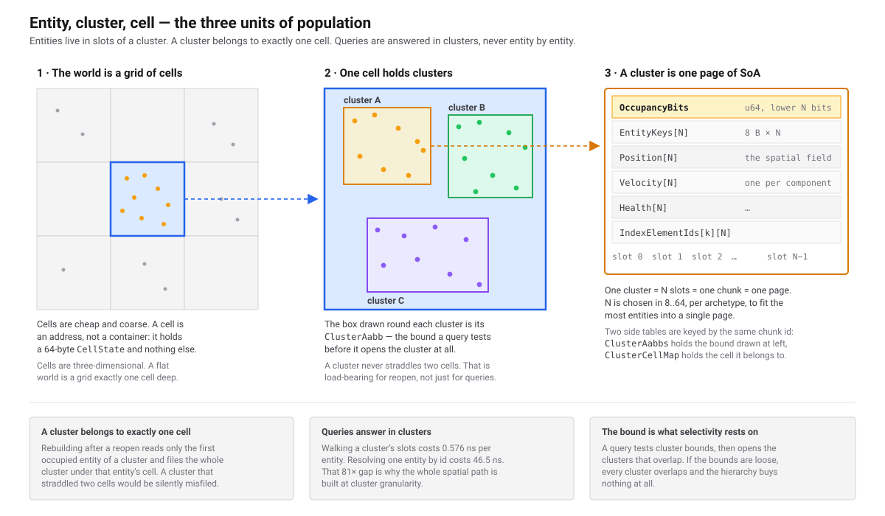
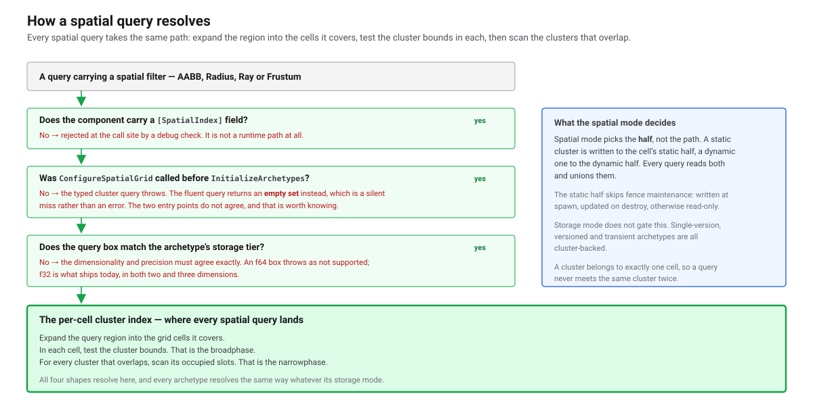
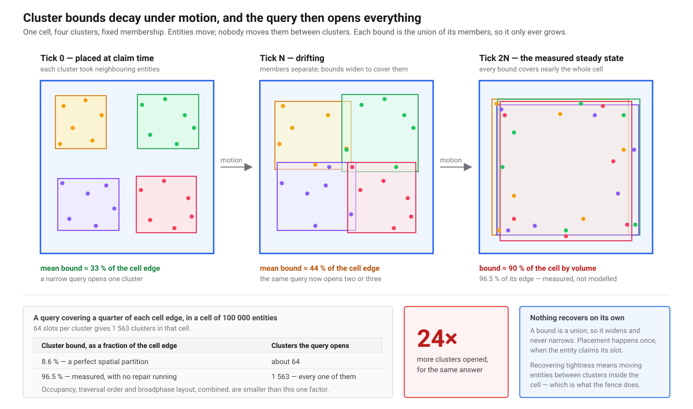
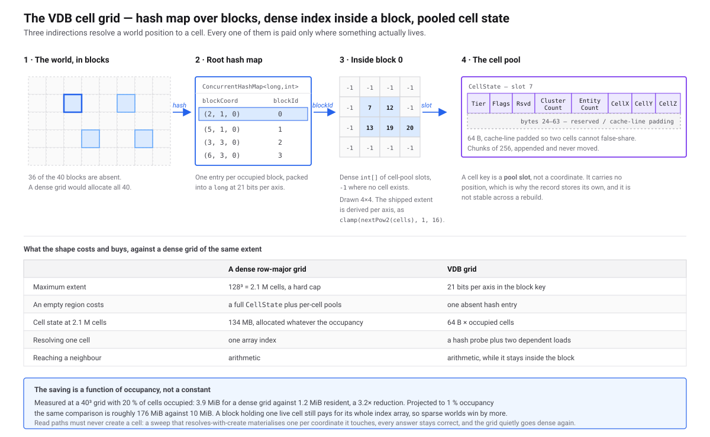

# What Spatial Costs You
> The four recurring costs a spatial archetype signs up for, why cluster tightness governs the query bill, and how to choose a cell size.

**Status:** ✅ Implemented · **Visibility:** Public · **Level:** 🟢 Start Here · **Category:** [Spatial](./README.md)

**Assumes:** [Entity Clusters](../Ecs/entity-clusters.md)

## 🎯 What it solves

Declaring a spatial field costs one attribute. What it buys is a per-cell broadphase that answers "what is near
this box" without touching most of the world. What it *costs* is work the engine does every tick whether you
query or not: keeping each cluster's bounding box current, moving entities whose position left their cell, and
re-packing clusters whose bounds have spread until they no longer prune anything.

That recurring bill is the subject of this page. It exists because the rest of the category teaches the surface
and then stops — and a reader who stops there meets the cost later, as an unexplained rise in tick time, with no
vocabulary for what moved. Read this before you read any API page. It names the four cost centres, states which
of them scale with what, and gives the one sizing decision that governs all four.

Nothing here is an API surface. `[SpatialIndex]` and its arguments live on
[Field Attribute & Schema Integration](./spatial-field-attribute/README.md), the parameters live on
[Tuning the Spatial Grid](./spatial-tuning.md), and the counters that tell you which cost centre is hurting live
on [Reading Spatial Telemetry](./spatial-telemetry.md).

## ⚙️ How it works (in brief)

Three words carry the whole model, and they nest.

<a href="assets/spatial-entity-cluster-cell.svg">
  
</a>
<br>
<sub>An <b>entity</b> has a position. A <b>cluster</b> is up to 64 entities of one archetype in one contiguous
chunk, carrying a single bounding box. A <b>cell</b> is a fixed-size box of world space holding the clusters whose
entities live in it. Every cost on this page is paid per cluster or per cell, never per entity — except repair,
which is the one that is paid per entity.</sub>

A cluster belongs to exactly one cell, and that is an invariant rather than a tendency: cell membership is decided
by an entity's centre, and an entity whose centre leaves the cell is moved to a cluster of the new cell. Because
of that, every cell-scoped operation — tier assignment, dormancy, broadphase — tests one bounding box per cluster
instead of one position per entity.

### One structure, and you do not choose it

<a href="assets/spatial-which-structure.svg">
  
</a>
<br>
<sub>Every spatial query resolves through the per-cell cluster broadphase. There is no second index and no
fallback path.</sub>

Three facts follow from that, and they matter more than any number on this page:

- **There is exactly one spatial index, and it is the per-cell cluster index.** Every query shape — box, radius,
  ray, frustum, k-nearest — resolves through the cell broadphase. A component carrying `[SpatialIndex]` allocates
  no spatial storage segment of its own. A reflection test walks the whole engine assembly to hold that true.
- **Storage mode does not select a path.** Every archetype is cluster-backed, whatever its components' storage
  modes, so storage mode decides only where component data sits inside the cluster, not which structure answers
  a query.
- **The grid is therefore mandatory, not optional.** An archetype that declares a spatial field and finds no
  configured grid throws `InvalidOperationException` at `InitializeArchetypes`, naming the archetype. It fails at
  startup deliberately, rather than at the first spawn.

The consequence for cost is simple. You cannot opt a spatial archetype out of the cell machinery, so the four
costs below are not optional either. What you control is their magnitude.

## The four cost centres

### 1. Query broadphase — paid per query

A query expands its box into the cells it overlaps, and in each cell scans a linear array of cluster bounding
boxes. Every cluster whose box overlaps is *opened*: its live entities are then tested individually. So the price
of a query is the number of clusters it opens, and opening a cluster is cheap only because iterating one is —
0.576 ns per entity, against 46.5 ns to resolve one entity by id, a factor of 81.

The broadphase is a linear scan until a cell gets dense enough to be worth a tree, at which point the engine
promotes that cell on its own — at 1024 clusters in one cell half by default, tunable through
`DatabaseEngineOptions.Spatial.CellTreePromoteThreshold`. The threshold is where it is because of this:

Query cost, tree against linear scan, by how selective the query is (`sel` is the query edge as a fraction of the
cell edge). Above 1.00× the tree wins:

| Clusters in one cell | sel 0.02 | sel 0.10 | sel 0.30 | sel 1.00 |
|---|---|---|---|---|
| 80 | 0.18× | 0.18× | 0.12× | 0.07× |
| 512 | — | 0.70× | 0.35× | 0.09× |
| 1 563 | **4.24×** | **2.03×** | 0.64× | 0.08× |
| 6 250 | **13.2×** | **3.80×** | 0.86× | 0.07× |
| 15 625 | **18.7×** | **4.50×** | 1.00× | 0.07× |

> **These ratios predate the September 2026 vectorisation of both structures and are kept as the calibration the default
> threshold was chosen from.** Vectorising the linear scan gained it 67–70 % on a selective query against the tree's
> 12–14 %, so every ratio in this table now understates the scan. Re-measured at the two points that matter: 512 clusters
> selective, 102 ns scanned against 247 ns through the tree; 2 048 selective, 403 ns against 246 ns. The tree's advantage
> at extreme density is real but arrives later than these rows suggest.

Two things fall out of that. The tree loses *every* column at 512 and first wins at 1 563, which is where the 1024
default sits — on the conservative side of the boundary. And the tree never wins a broad query at any density: a
query that returns most of the cell has nothing to prune, so it pays the descent for nothing. Promotion helps
selective queries against dense cells, which is the case it exists for.

The update side moves the other way — a tree update is **20.8× dearer** than six float stores at 512 clusters and
**29.9×** at 1 563. The motion hysteresis is what makes that affordable: at the shipped margin it absorbs ~97 % of
moves, bringing the real cost to 61 ns against 23 ns per moved cluster. A cell that is dense *and* rewrites every
cluster every tick while querying rarely is the one case where raising the threshold is the right call.

A real clumped population in the same sweep held **1.8 clusters per cell on average, 102 in its worst cell** —
an order of magnitude below where promotion begins, which is why most databases never build a tree.

### 2. Tick-fence maintenance — paid per tick, per written cluster

At the tick fence the engine recomputes the bounding box of every cluster that was written to, and clusters
nobody touched are skipped entirely. Positions written through the spatial write barrier are cheaper still: the
barrier grows the cluster box in place as it writes, flags the exact slot that crossed a cell boundary, and marks
the one cluster the fence must revisit — so the fence drains the work without searching for it.

Where the barrier is not used, the fence has to find the crossings itself, in its Prep phase. That phase is
already the largest of the fence: **52% of fence time at eight workers, rising to 64% at 128 000 entities**, and
it scales worst of the three phases (1.28× against 3.54× for migration and 4.45× for box refresh). Prep is the
part of the fence that does not get cheaper when you add cores.

### 3. Inter-cell migration — paid per entity that leaves its cell

An entity whose centre leaves its cell by more than a hysteresis margin is queued during Prep and moved during
the fence's Migrate phase: component data, secondary index entries and the spatial back-pointer move together.
Migration is systematic and never refused — it is what makes the cluster-cell invariant hold, so the engine will
always pay it.

Its rate is set by your world, not by a parameter: entity speed divided by cell size. Halving the cell size
doubles the boundary crossings. The hysteresis margin removes only the oscillation of entities loitering on a
boundary, not genuine traffic.

### 4. Intra-cell repair — paid per entity, and the dearest thing here

Nothing above fixes a cluster whose entities have drifted apart inside their cell. That is what relocation and
repair are for, and repair is the one cost on this page that is measured per entity and is large:

Order of magnitude: **roughly a microsecond per entity**, which puts a single 100 000-entity cell re-sorted in one
pass at **~130 ms**. That is enough to miss a frame on its own, and it is why `ReclusterBudgetMs` exists and why the
budget — not the queue — decides how much repair a tick actually gets.

| Quantity | Measured |
|---|---|
| Tick fence per repaired entity, warm | **~1 300 ns** (1 058 – 1 619 across ten warm rounds) |
| First repair in a process | 22 000 – 29 700 ns — JIT and first page touches, not signal |
| One 100 000-entity cell, projected | **~130 ms** |

**Read that first row for what it is.** It divides a whole `WriteTickFence` by the number of entities the repair
moved, so it also carries the AABB refresh, the WAL emit and the harness's own page writeback. It is the right
number for sizing a budget and the wrong number for costing the re-sort itself, which is nearer half of it.

Do not tune against this table. The engine measures your workload on your hardware and exposes it as
`MeasuredNsPerEntity`; `RepairNsPerEntity` only seeds that estimate for the first few ticks. What one pass buys is real: mean cluster extent fell from 87.0 to 23.0 against a theoretical
optimum of 15.6, and the cell's zone maps narrowed to 22% of their previous total width.

<a href="assets/spatial-escalation.svg">
  
</a>
<br>
<sub>The three responses to a cell losing tightness, in ascending cost. Hysteresis absorbs a jitter for free.
Relocation moves the individual entities that overshot a box around their cluster's centroid. Repair re-sorts a
whole cell in Morton order and is the only mechanism that ever narrows a zone map.</sub>

Repair is budgeted per tick per archetype and, crucially, **relocations that do not fit the budget are dropped,
not deferred**. Nothing remembers them; the next tick re-detects whatever still drifts. Repairs, by contrast, are
remembered in a per-cell queue ranked by degradation and age. A recent measurement of the detection stage found
**55 415 relocations nominated against 1 288 admitted, a ratio of 43 to 1** — detection is currently the largest
single term in two fence phases, and most of what it produces is discarded.

## Why tightness governs the bill

<a href="assets/spatial-bounds-decay.svg">
  
</a>
<br>
<sub>Placement happens once. Under motion a cluster's box only widens, until it covers most of its cell and stops
excluding anything.</sub>

An entity is placed at claim time, into the first cluster of its cell with a free slot. That choice is not
position-aware, and it is never revisited by the placement path. A cluster's bounding box therefore only ever
grows as its entities move — there is no force pulling it back in, which is precisely why relocation and repair
have to exist as separate mechanisms.

The effect on query cost is severe, and it is arithmetic rather than a subtlety. Take one cell holding 100 000
entities. At 64 slots per cluster that is about **1 563 clusters**:

- Under a perfect partition, each cluster's box spans about **8.6%** of the cell edge. A query box covering a
  quarter of that edge overlaps roughly **64** clusters.
- At the decayed extent, **96.5%** of the cell edge, the same query overlaps **all 1 563** of them.

That is a **24× swing in clusters opened, for one identical query**, decided entirely by how tight the clusters
are. The 90% mean coverage that motivates the figure is measured; the 24× itself is derived from it and has never
been measured end to end. Treat it as the shape of the problem rather than as a benchmark result.

## Choosing a cell size

<a href="assets/spatial-vdb-grid.svg">
  
</a>
<br>
<sub>The grid is sparse and three-level: a hashed root of blocks, a dense index inside each block, and a pool
holding only cells that are actually occupied. Empty space costs nothing to leave empty.</sub>

Cell size is the one number that moves all four cost centres at once, and it is the only one you must choose from
first principles rather than by watching a counter. Everything else in the category has a defensible default.

Size it by **occupancy** — the number of entities you expect in an average populated cell — and not by any
distance in your world:

| Entities per cell | Consequence |
|---|---|
| 4 | cells outnumber clusters; boundary crossings, and therefore migrations, are at their most frequent |
| **16 – 64** | **the measured basin** — around one cluster per cell, up to one full cluster |
| 256 | clusters per cell rise; the broadphase opens more of them per query |
| 1 024 and above | queries lose selectivity, and a repair unit becomes an expensive, indivisible piece of work |

The harness that produced this sweeps occupancy at 4, 16, 64, 256, 1 024 and 4 096 entities per cell, so the
basin is resolved to those grid points and no finer. The upper bound has an independent justification: a cluster
holds 64 slots, so beyond about 64 entities per cell you are guaranteeing multiple clusters per cell, and beyond a
few thousand you are building the ~130 ms repair unit measured above.

Sparsity is not a reason to hesitate over small cells. Only occupied cells are allocated: a 40³ world at 20%
occupancy resides in 1.2 MiB against 3.9 MiB dense, a factor of 3.2. The ratio tracks occupancy — it is not a
constant, and a denser world saves less.

## 💻 Usage

There is no call on this page. The sizing decision is arithmetic you do once, before configuring the grid on
[Spatial Grid Configuration & Tier Control](./spatial-grid-config.md):

```text
target occupancy      = 16 to 64 entities per populated cell
populated cells       = entity count / target occupancy
cell side             = (populated world volume / populated cells) ^ (1/dimensions)
```

Worked, for 100 000 entities spread over a 1 000 × 1 000 flat region at a target of 32 per cell: 3 125 populated
cells, 1 000 000 square units of world, 320 square units per cell, so a cell side of about 18 units. Round to
something legible — 16 or 20 — and confirm it against the occupancy counter rather than against the arithmetic.

Two sanity checks before you accept a number. Your typical **query box plus your largest entity extent should not
exceed one cell side**, or the query may miss an entity that overhangs its cell (see the limits below). And your
entity **speed per tick should be small against the cell side**, or every entity migrates most ticks.

## ⚠️ Guarantees & limits

- **A 3D world cannot use the spatial write barrier today** — `ClusterRef.WriteSpatial` supports `AABB2F` only and throws `NotSupportedException` for the other seven field shapes. Enabling the barrier on a 3D archetype succeeds at registration and fails at the first write. Measured over 32 000 entities at eight workers, the 2D arm reports 25 366 drifters and 4 725 migrations per tick while the 3D arm reports zero of each, because every write threw. This is the largest gap between the name "3D partitioning" and what currently runs.
- **Repair costs roughly a microsecond per entity** — about 1 300 ns of tick fence per repaired entity warm, projecting a 100 000-entity cell at ~130 ms for one full re-sort. It is the only cost on this page large enough to miss a frame by itself, so size `ReclusterBudgetMs` against it, and read `MeasuredNsPerEntity` for the live figure on your own workload rather than tuning against this one.
- **The world is bounded, and leaving it is silent** — a position outside the configured world bounds is *clamped* into the nearest edge cell rather than rejected, so an entity that escapes the world piles into the boundary cell and still answers queries there. `NaN` and infinite coordinates do throw. The block packing could support a far larger world; the clamp has not been lifted.
- **A box query can miss an entity that overhangs its cell** — membership is by centre, so a cluster's box can protrude past its cell by up to an entity's half-extent, and the query walks exactly the cells its box overlaps with no expansion. The precondition is *query extent + largest entity extent ≤ cell size*; it is documented but not asserted, and violating it produces silent false negatives. Only k-nearest consults the recorded maximum overhang.
- **Cells are never destroyed** — cell creation is lazy and concurrent, but nothing reclaims a cell. A world that sweeps a region and moves on retains every cell it ever touched, so cell count and resident bytes only grow within a session.
- **The promotion threshold is one number for the whole database** — there is no per-archetype or per-cell override, and it is read once while archetypes initialise, so it cannot be changed on a running engine. A world whose archetypes want different boundaries has to pick one.
- **The 24× is derived, the 90% is measured** — the cluster-coverage mean comes from a spatial lab measurement; the 24× swing in clusters opened is arithmetic on top of it and has never been measured end to end.
- **There is no budget-to-tightness curve** — neither achieved nanoseconds per entity for batched re-clustering nor achieved tightness under sustained motion is published. Choose a repair budget by watching telemetry, not by consulting a curve.
- **The cell layer is not rebuilt after a hard crash** — entity data and storage survive, but the per-cell state is derived and is reconstructed only on a clean reopen. A reopen after an unclean shutdown has been observed to leave the cell layer unallocated.

## 🧪 Tests

- [ClusterRepairTests](https://github.com/Log2n-io/Typhon/blob/main/test/Typhon.Engine.Tests/Data/ECS/ClusterRepairTests.cs) — `MeasureRepairCostPerEntity` (the ~1 300 ns fence-per-repaired-entity figure, Release, 2 000 entities in 41 clusters), `ARepairNarrowsTheZoneMapsOfTheCellItRepacks` (the 22% zone-map narrowing)
- [BroadphaseCrossoverSweepTests](https://github.com/Log2n-io/Typhon/blob/main/test/Typhon.Engine.Tests/Data/SpatialGrid/BroadphaseCrossoverSweepTests.cs) — the linear-versus-tree crossover table and the clumped-population figures; marked `[Explicit]` and `Manual`, so a normal run skips it
- [ClusterRelocationCostTests](https://github.com/Log2n-io/Typhon/blob/main/test/Typhon.Engine.Tests/Data/ECS/ClusterRelocationCostTests.cs) — relocation cost and the drift-detection nomination-to-admission ratio
- [SpatialPartitionMatrix](https://github.com/Log2n-io/Typhon/blob/main/test/Typhon.Benchmark/SpatialPartitionMatrix.cs) — the occupancy sweep at 4/16/64/256/1 024/4 096 entities per cell that the cell-sizing basin comes from

## 🔗 Related

- Next: [Spatial Architecture Overview](./spatial-architecture-overview.md) — what each piece is and which page answers which question
- Next: [Tuning the Spatial Grid](./spatial-tuning.md) — every parameter behind the four costs, with the symptom that says to change it
- Next: [Reading Spatial Telemetry](./spatial-telemetry.md) — the counters that say which cost centre is hurting
- Sibling: [Spatially-Coherent Entity Clustering](./spatial-coherent-clustering.md) — the cluster-cell invariant and how migration maintains it
- Sibling: [Spatial Grid Configuration & Tier Control](./spatial-grid-config.md) — where the cell size you chose here is set
- Sibling: [Entity Clusters](../Ecs/entity-clusters.md) — the batched storage every cost on this page is measured against
- Source: [src/Typhon.Engine/Spatial/public/SpatialGridConfig.cs](https://github.com/Log2n-io/Typhon/blob/main/src/Typhon.Engine/Spatial/public/SpatialGridConfig.cs)
- Source: [src/Typhon.Engine/Spatial/internals/SpatialGrid.cs](https://github.com/Log2n-io/Typhon/blob/main/src/Typhon.Engine/Spatial/internals/SpatialGrid.cs)
- Source: [src/Typhon.Engine/Ecs/public/ClusterRef.cs](https://github.com/Log2n-io/Typhon/blob/main/src/Typhon.Engine/Ecs/public/ClusterRef.cs) (`WriteSpatial`, the barrier)

<!-- Deep dive: claude/design/Spatial/vdb-cell-grid-and-migration.md (cell grid, migration, drift, repair, throttling) -->
<!-- Rules: rules/spatial.md (modules VG-01, VG-02, CR-01, TH-01, SQ-01, SH-01, C13, C15) -->
