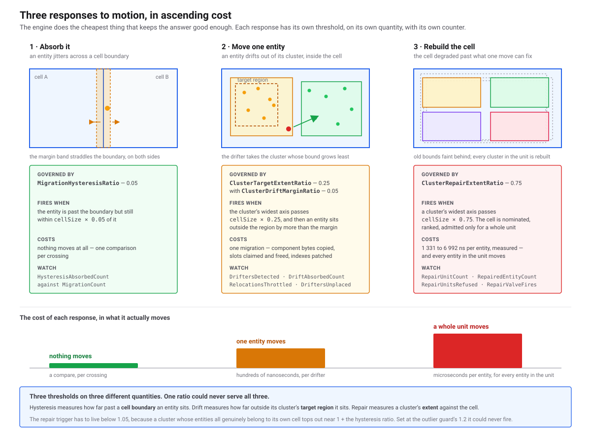
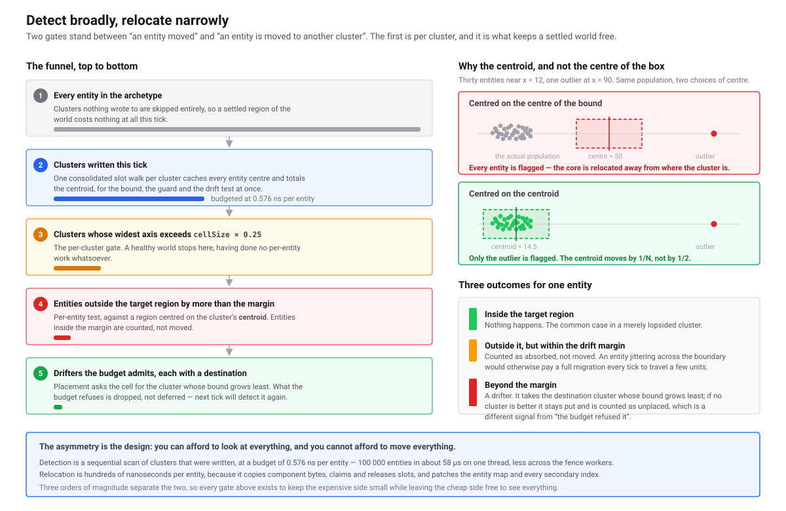
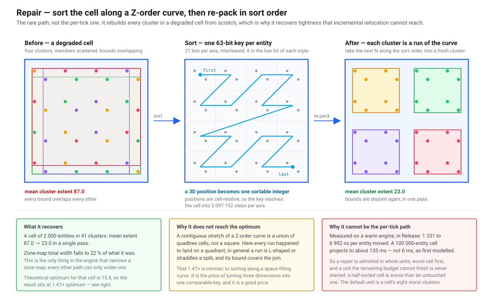
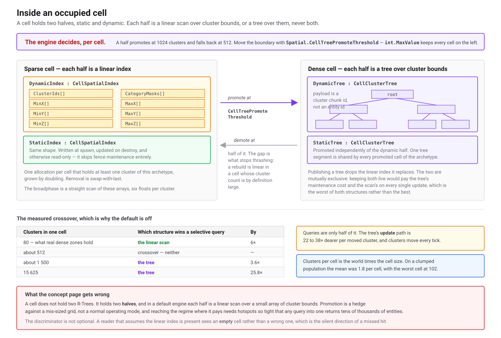

# Tuning the Spatial Grid
> The partition is not self-configuring. On a badly chosen cell size a world pays heavy migrations every tick and ends with looser clusters than it started with. Derive the settings from your world, then read the telemetry that names the wrong one.

**Status:** ✅ Implemented · **Visibility:** Public · **Level:** 🟣 Advanced · **Category:** [Spatial](./README.md)

## 🎯 What it solves

A cluster holds up to 64 entities of one archetype in one grid cell, and a query tests the cluster's bounding box before opening it — so query cost tracks how *tight* those boxes are, not how many entities exist. Motion loosens them. A slot is claimed at spawn by taking the first cluster in the cell with room, with no regard for position, so under sustained movement a cluster's box grows until it covers most of its cell. The measured mean is **90 % of the cell**, at which a narrow query opens all ~1 563 clusters of a 100 K-entity cell instead of the ~64 it needs. Three mechanisms push back, and every one of them is governed by a number you supply. This page is how you supply them.

**Two facts decide how you use this page, so they come first.**

**The configuration is set once and cannot be changed at runtime.** `ConfigureSpatialGrid` must be called before `InitializeArchetypes` and throws if called twice or afterwards. There is no live knob, no per-archetype override, and no way to sweep a value inside one process. Every tuning experiment is a rebuild and a rerun, which is why the parameter table below is organised around *the symptom that tells you which number to change* rather than around trial and error.

**`RepairNsPerEntity` is a seed for a runtime controller, not a cost constant.** Measurement (`ClusterRepairTests.MeasureRepairCostPerEntity`, Release, 2 000 entities in 41 clusters) puts a warm repair at roughly **a microsecond per entity** — ~1 300 ns of tick fence per repaired entity — which projects a 100 K-entity cell at ~130 ms for one full re-sort. The default of 1 500 seeds an EWMA (α = 0.25) of the measured migration and planner cost, clamped to `[seed / 10, seed × 20]`, so after the first few ticks the engine is spending against its own measurement. Read `MeasuredNsPerEntity` for the live value; change the seed only if the first ticks of a run behave badly.

## ⚙️ How it works (in brief)

Degradation is answered at three levels, cheapest first. Each has its own ratio, and they are separate numbers because they govern different events.

<a href="assets/spatial-escalation.svg">
  
</a>
<br>
<sub>One cell over time. Hysteresis absorbs a jitter across a cell boundary, relocation moves a single drifted entity into a better cluster, and repair re-sorts the whole cell in Morton order.</sub>

**Level 1 — hysteresis absorbs jitter.** `MigrationHysteresisRatio` × `CellSize` is a dead zone outside each cell face. An entity whose centre crosses a boundary but stays inside the margin is left where it is, so an entity walking along an edge does not migrate every tick. This is inter-cell only: both detectors emit only when the cell key actually changes, so hysteresis can absorb nothing for a move that stays inside one cell. **Cost:** six float compares per moved entity, and absorbing costs nothing beyond them.

**Level 2 — relocation moves an outlier.** Detection runs inside the AABB-refresh phase of the fence, over *written* clusters only; a cluster nobody touched is skipped entirely. It is two-level. Per cluster, the largest axis extent is compared against `CellSize` × `ClusterTargetExtentRatio` — three float compares, and a tight cluster is never entered, so a healthy world does no per-entity work at all. Only inside a cluster that fails that gate does the per-entity test run: an entity is a drifter when it overshoots a target-sized box around the cluster's **centroid** by more than `ClusterDriftMarginRatio` × `CellSize`. The centroid, not the box centre, is the behaviour that matters — a box centre sits halfway between the extremes, so thirty entities at x ≈ 12 and one at x = 90 put it at 50, in empty space, and the rule would then flag the *thirty* and relocate the majority away from where the cluster actually is. **Cost:** a relocation is a full intra-cell migration of one entity, priced by the same estimator repair uses.

<a href="assets/spatial-detect-relocate.svg">
  
</a>
<br>
<sub>The cluster gate is what makes broad detection affordable: a tight cluster costs three compares and its entities are never examined.</sub>

**Level 3 — repair re-sorts the cell.** A cell is nominated when a cluster's extent exceeds `CellSize` × `ClusterRepairExtentRatio`, which sits deliberately above the drift target: repair is for degradation relocation cannot undo. Candidates go into a persistent per-cell queue ranked by degradation, tier weight, cluster count and an age factor, and the planner admits what the budget affords. A repair unit is `RepairWorstClustersPerUnit` of the cell's worst clusters, re-sorted by 21-bit-per-axis Morton order into pinned destination slots. **Cost:** roughly a microsecond per entity, and one pass over 2 000 entities took mean cluster extent from 87.0 to 23.0 against a theoretical optimum of 15.6, narrowing the cell's total zone-map width to 22 % of what it was.

<a href="assets/spatial-morton-repair.svg">
  
</a>
<br>
<sub>Repair is the only mechanism that ever narrows a zone map, and the only one that can undo a cluster whose entities are genuinely scattered across its cell.</sub>

## 📐 Choosing the cell size

This is the one consequential decision. Derive it from density, not from intuition about the world:

```
cells    = population / targetEntitiesPerCell
side     = cbrt(cells)              // sqrt(cells) for a flat world
cellSize = worldSideLength / side
```

**Target 16 to 64 entities per cell.** The basin is measured, not asserted: `SpatialPartitionMatrix` Matrix C sweeps occupancy across 4, 16, 64, 256, 1 024 and 4 096 entities per cell, at 16 000 entities in a 1 000-unit 3D world, eight workers, cruise motion.

| entities/cell | cell size | fence | small AABB query | ray query |
|---|---|---|---|---|
| 4 | 63 | 2.67 ms | 1.7 µs | **58.4 µs** |
| **16** | **100** | **1.77 ms** | **1.3 µs** | 15.1 µs |
| **64** | **159** | 2.19 ms | 1.6 µs | **9.6 µs** |
| 256 | 252 | 2.26 ms | 3.3 µs | 13.9 µs |
| 1 024 | 400 | 2.62 ms | 7.5 µs | 23.3 µs |
| 4 096 | 635 | 3.59 ms | **19.2 µs** | 62.3 µs |

**Too large costs query time.** A small AABB query runs 19.2 µs at 4 096 entities per cell against 1.3 µs in the basin — **14.8×** — because every hit opens a box spanning most of a large cell. Frustum queries degrade about 12× over the same range.

**Too small costs cell-walk time.** The ray runs 58.4 µs at 4 entities per cell against 9.6 µs at 64 — **6.1×** — because the ray and frustum walks are cell-major and probe the grid once per coordinate swept. Finer is not safer.

**Worked example.** A volumetric world 4 000 units per side holding 250 000 entities, aimed at the middle of the basin at 32 per cell:

```
cells    = 250 000 / 32   = 7 813
side     = cbrt(7 813)    ≈ 19.8
cellSize = 4 000 / 19.8   ≈ 202       → round to 200
```

That gives a 20 × 20 × 20 grid, 8 000 cell slots, comfortably inside the 32-bit cell-key limit the constructor enforces. Size for *occupied* density and ignore empty volume: the grid is sparse and materialises a cell only once something occupies it, measured at 3.9 MiB dense against 1.2 MiB resident at 20 % occupancy. Matching cell size to your typical query radius is a plausible second rule and is **unmeasured**; where the two disagree, follow density.

One constraint that is not a tuning preference: cell membership is decided by an entity's **centre**, so a query box can miss an entity that overhangs its cell. Keep *query extent + largest entity extent ≤ cell size*. No assertion enforces this.

## 💻 Usage

```csharp
// Once, before InitializeArchetypes. Every value below is the default; name only what you change.
dbe.ConfigureSpatialGrid(new SpatialGridConfig(
    worldMin: new Vector3(0f, 0f, 0f),
    worldMax: new Vector3(4000f, 4000f, 4000f),
    cellSize: 200f,                             // derived above: 250 K entities at ~32 per cell

    migrationHysteresisRatio:         0.05f,    // inter-cell dead zone
    clusterTargetExtentRatio:         0.25f,    // drift gate
    clusterDriftMarginRatio:          0.05f,    // intra-cell dead zone
    clusterRepairExtentRatio:         0.75f,    // repair nomination
    reclusterBudgetMs:                1.0f,     // per tick, per archetype
    repairNsPerEntity:                1500f,    // EWMA seed, not a constant
    repairWorstClustersPerUnit:       8,        // 0 means the whole cell
    clusterRepairCriticalExtentRatio: 1.0f,     // safety valve; 0 disables it
    repairAgingRatePerTick:           0.05f,    // anti-starvation
    repairQueueMaxCells:              4096));

dbe.InitializeArchetypes();

// A flat world takes the same knobs; Z becomes one cell deep.
dbe.ConfigureSpatialGrid(SpatialGridConfig.Flat(
    worldMin: new Vector2(0f, 0f),
    worldMax: new Vector2(4000f, 4000f),
    cellSize: 100f,
    reclusterBudgetMs: 4f));
```

## 🎛️ Every parameter

All eighteen settings, in constructor order. **Cliff** marks a value where a small change flips behaviour or throws; the rest are dials that move a cost smoothly.

| Parameter | Default | Unit | Controls | Safe range | Symptom when wrong |
|---|---|---|---|---|---|
| `WorldMin` / `WorldMax` | required | world units | Grid extent; the max corner is **exclusive** | max strictly greater on all three axes | Throws at config time. An entity that leaves the world is clamped into the nearest edge cell, not rejected, so it silently piles up at the boundary |
| `CellSize` | required | world units | Clusters per cell, memory, query selectivity, migration rate — everything above | **cliff** · 16–64 entities/cell | Too large: query cost climbs 14.8× at 4 096 per cell. Too small: ray and frustum cost climbs 6.1× at 4 per cell. Cells × axes must fit a 32-bit key or the constructor throws |
| `MigrationHysteresisRatio` | `0.05` | fraction of cell | Dead zone past a cell face before a crossing migrates | dial · 0.02–0.15, unvalidated | Near-zero `HysteresisAbsorbedCount` against a high `MigrationCount` — entities oscillating on a boundary migrate every tick |
| `ClusterTargetExtentRatio` | `0.25` | fraction of cell | The box a cluster should stay inside; the gate that admits a cluster to per-entity drift testing | dial · 0.1–0.5, **cliff above ~1.05** | Too tight and every written cluster enters a per-entity walk, producing drifters the budget then drops — pure cost, no tightness. Above ~1.05 no cluster can exceed it and drift detection silently stops |
| `ClusterDriftMarginRatio` | `0.05` | fraction of cell | Dead zone around that target region | dial · 0.02–0.15 | Near-zero `DriftAbsorbedCount` — entities relocated every tick to move a few units |
| `ClusterRepairExtentRatio` | `0.75` | fraction of cell | Extent past which a cell is nominated for a full re-sort | **cliff** · above the drift target, below 1.2 | At or above 1.2 the constructor throws: a cluster holding only its own cell's entities tops out near 1.05, so the threshold could never fire |
| `ReclusterBudgetMs` | `1.0` | ms/tick/archetype | Admission threshold for relocations and repair units | **cliff** · see the budget table below | `0` disables repair **and** all throttle enforcement. Sustained `RelocationsThrottled > 0` means it sits under the cliff |
| `RepairNsPerEntity` | `1500` | ns | The exchange rate the budget is spent at; seed for the runtime EWMA | dial · 500–5 000 | Only the first ticks use it. Too low and those ticks admit units costing many times what was projected. Read `MeasuredNsPerEntity` for the live value |
| `RepairWorstClustersPerUnit` | `8` | clusters | Size of one indivisible repair unit; `0` means the whole cell | dial · 2–16 | Too large and no unit is affordable: `RepairUnitsRefused` climbs while `RepairUnitCount` stays at 0. A whole-cell unit on a 100 K-entity cell projects to ~130 ms |
| `ClusterRepairCriticalExtentRatio` | `1.0` | fraction of cell | Degradation at which a cell jumps the queue despite the budget | **cliff** · strictly between the repair ratio and 1.2, or `0` to disable | Outside that band the constructor throws. At or below the repair ratio every nominated cell is critical and the valve overshoots the budget on every tick, for ever |
| `RepairAgingRatePerTick` | `0.05` | rank growth/tick | How fast a waiting candidate's rank climbs | dial · 0.01–0.2 | `0` disables ageing, and a permanently outranked cell is then never repaired |
| `RepairQueueMaxCells` | `4096` | cells | Cap on queued repair candidates | dial · at or above the count of simultaneously degraded cells | `RepairQueueEvicted` growing while `RepairQueueDepth` sits at the cap — candidates are being forgotten |
| `ClusterTargetPackingSlack` | `1.5` | multiplier | Multiplier on the per-cell packing bound that derives the target extent from live density, instead of taking `ClusterTargetExtentRatio` as a constant | dial · 1.2–2.0 | `0` pins the target at `ClusterTargetExtentRatio` and also disables the throttle's drift boost and the repair-first exclusion |
| `LeastEnlargementPlacement` | `false` | flag | Place an arrival in the cluster whose bound grows least to admit it, rather than the first with a free slot | opt-in | Measured a wash where repair runs and a loss where it does not — leave off unless you have disabled repair |
| `GrowthCapPlacement` | `false` | flag | Open a fresh cluster when the best candidate would stretch past the target × `GrowthCapSlack`. Implies least-enlargement ranking | opt-in | The only write-path mechanism that *creates* tightness under motion (7–16 points), paid for in +4–29 % fence and −4 to −17 points of slot occupancy |
| `GrowthCapSlack` | `1.25` | multiplier | How far past the target a candidate may stretch before a fresh cluster is opened instead | dial · 1.1–1.5 | Too low and nearly every arrival opens a cluster, exhausting `MaxOpenClustersPerCell` and scattering entities across half-empty clusters |
| `MaxOpenClustersPerCell` | `4` | clusters | Open (non-full) clusters the growth cap may hold per cell before it falls back to least enlargement | dial · 2–8 | Constructor throws below 1. Too high and occupancy fragments without buying tightness |
| `BatchSpawnSortThreshold` | `128` | entities | A transaction spawning at least this many places them in per-cell Morton order, so a bulk load is born at the packing bound | dial; `0` disables | A large load is born at the full extent of every cell it touches, handing the repair queue work that placement could have avoided |

## 🔍 Diagnosing a misconfigured world

Read `GetSpatialTelemetry(archetypeId)` or `GetSpatialTelemetryTotal()` from the tick loop after the fence. Per-tick members reset at every fence, so a background scrape samples one arbitrary tick. Ten counters reach OpenTelemetry as `typhon.ecs.spatial.*`, but four of the ones that matter most here — `RelocationsThrottled`, `RepairUnitsRefused`, `RepairQueueDepth` and `MeasuredNsPerEntity` — are API-only. See [Reading Spatial Telemetry](./spatial-telemetry.md) for the full counter set.

**Migration storm.** `MigrationCount` is a large fraction of the population every tick. Check `HysteresisAbsorbedCount` first: near zero means the margin is too narrow, so raise `MigrationHysteresisRatio`. If absorption is healthy the world is genuinely crossing cells and the fix is a larger cell. A high migration rate is not by itself a fault — coherent swarms measured 7 090 migrations per tick at 32 000 entities and were the *best*-partitioned case in the whole matrix, at 63.0 % tightness.

**Budget starvation, the budget buying zero units.** `RelocationsThrottled` sustained above zero means the budget is below the world's drift rate. `RepairUnitsRefused` above zero while `RepairUnitCount` stays at zero means it cannot afford even the smallest unit on offer. The arithmetic is unforgiving: at ~1 500 ns per entity a 1 ms budget buys ~667 entities, and a default unit of eight clusters at ~49 occupied slots is 392 — so the planner admits one unit or none. Matrix B, 16 000 entities at 512 per cell, eight workers:

| `ReclusterBudgetMs` | relocations throttled/tick | tightness | active clusters |
|---|---|---|---|
| 0 | 0 | **102.2 %** | 363 |
| 0.25 | 11 513 | 88.8 % | 363 |
| 1 | 11 044 | 92.6 % | 378 |
| 4 | 6 215 | 97.2 % | 381 |
| **8** | **0** | **80.9 %** | **507** |
| 16 | 0 | 82.3 % | 518 |

Below the cliff, across a 16× range of budget, tightness moves from 89 % to 97 % — *worse* — and query cost with it. Between 4 and 8 ms everything moves at once: throttling stops, and cluster count jumps from 381 to 507 as cells genuinely subdivide instead of holding one loose box each. **Double the budget until `RelocationsThrottled` reaches zero, then stop.** Note the first row: `0` means "no throttle enforcement", not "no re-clustering", and it produced the worst tightness in the table.

**Clusters that never repair.** `RepairQueueDepth` grows while `RepairUnitCount` stays at zero. Rule out the budget, then three structural causes: the spatial field is not `SpatialMode.Dynamic`, so the planner exits early; nothing wrote to the archetype, and a still archetype is never planned; or `ClusterRepairExtentRatio` sits above the degradation this world actually reaches. Persistent `RepairValveFires` means degradation is outrunning the budget — raise the budget rather than treating the valve as a steady state.

**Cells holding too many clusters.** Divide `ActiveClusterCount` by `GetSpatialGridOccupancy().OccupiedCellCount`. A per-cell broadphase is a linear scan over the cell's clusters, and for ordinary densities that is the right structure: it beats a per-cell tree at every selectivity up to 512 clusters in a cell. Past that the engine promotes the cell to a tree on its own, at `Spatial.CellTreePromoteThreshold` (1024 by default), so a dense pocket does not become a scan that grows without bound.

Promotion is gated on **tightness as well as count**. `Spatial.CellTreePromoteTightness` (0.10 by default) is the mean cluster extent, as a fraction of the cell edge, at or below which a cell's clusters are far enough apart for a tree to prune between them; a promoted half falls back at twice that value. The count alone was not enough: the sweep that chose 1 024 laid its clusters at 3.8 % of the cell, while a cell under motion runs at 63–103 %, where every cluster is hit by every query and the tree returns all of them after paying for the traversal. Set it to `1` to restore count-only promotion.

That does **not** make a high mean per cell something to ignore. Promotion caps the query cost of a dense cell; it does not make the cell a good shape. If the *mean* is climbing, the grid is coarse for this world and `CellSize` is the fix — a tree per cell is a fallback for the pockets a correctly-sized grid still leaves dense, not a substitute for sizing it. Lower the threshold if your queries are far more frequent than your movement, raise it if the reverse; `int.MaxValue` keeps every cell on the scan. `DriftersUnplaced` climbing is the same fault seen from the cluster side: drifters detected, every cluster in the cell already full.

<a href="assets/spatial-cell-promotion.svg">
  
</a>
<br>
<sub>An occupied cell holds a static and a dynamic half, each a linear cluster array. Promotion to a per-cell tree is implemented but off by default, which is why cell population is a cell-size decision.</sub>

**A counter that looks alarming and is not.** `RelocationsSuperseded` counts relocations dropped because a cell crossing already claimed the entity, which is the common case on a moving world.

**Where the time goes, before you reach for more threads.** The fence's Prep phase is 52 % of fence time at eight workers and scales only 1.28× from one worker to eight, so the fence tops out near 2.1× and workers past eight buy nothing. Migration is about 10 %. Cell size and budget move the fence; thread count does not.

## 🚦 Starting recipes

**Dense 2D top-down** (RTS, MOBA). `SpatialGridConfig.Flat`, 32 entities per cell, everything else default. Watch `RelocationsThrottled` over the first few hundred ticks and double `ReclusterBudgetMs` until it reads zero.

**Sparse 3D volumetric** (space sim, voxel world, ray-heavy queries). Full constructor, 32–64 entities per cell. Resist going finer for precision: the ray walk is cell-major and cost 58.4 µs at 4 per cell against 9.6 µs at 64. Sparsity in the *world* is free, because empty cells are never materialised; sparsity in a *cell* is not.

**Mostly static with a moving minority.** Defaults throughout, 32 entities per cell. This shape is cheap by construction: at 1 % of entities moving, Prep costs 0.40 ms and the whole fence 1.46 ms, against 9.82 ms and 16.97 ms with everything moving at 64 000 entities. Clusters do amplify the minority — a quarter of entities moving dirties about nine tenths of the clusters, since a cluster is dirty if any one of its entities moved.

**High-churn spawn and destroy.** 32 entities per cell, `ReclusterBudgetMs` at 2–4 ms to start. Churn moves no entity but it frees slots, and a freed slot refills first-fit with no regard for position, so the drift path carries more load here than in a purely kinematic world. Watch `DriftersUnplaced` and `RepairQueueEvicted`. An aged world measured 30–35 % *faster* than a fresh one at equal migration count and tightness, which is **unexplained** — do not tune against a freshly spawned world and expect the numbers to hold.

Whatever the shape, the acceptance test is the same: run at the real population, read `RelocationsThrottled` and `RepairUnitsRefused` after a few hundred ticks, and do not ship until both are zero in the steady state.

## ⚠️ Guarantees & limits

- **Set once, immutable after** — `ConfigureSpatialGrid` throws `InvalidOperationException` if called twice or after `InitializeArchetypes`. There is no runtime knob and no per-archetype override, so a tuning cycle is rebuild-and-rerun.
- **Only cell identity is persisted** — the bootstrap record stores world bounds, cell size and `MigrationHysteresisRatio`, because those decide which cell a position maps to. The nine re-clustering knobs are deliberately absent, so a tool-only opener such as the Workbench or `typhon check` runs them at their defaults. An application calling `ConfigureSpatialGrid` always wins; a tuned value is never silently replaced by a stored one.
- **`ReclusterBudgetMs = 0` is overloaded** — it disables repair *and* disables relocation throttling, so every detected relocation then runs unbudgeted. It is not "switch the feature off".
- **The budget admits whole units, never a fraction of one** — a Morton sort cannot be halved, and a partly re-sorted cell is worse than an untouched one because the cost is paid and the benefit is not. A unit the remaining budget cannot finish is not begun.
- **Throttled relocations are dropped, not deferred** — the tick's migration array is fixed when the plan closes, so a deferred tail would re-execute against slots its entities have already left. Refused *repairs* are remembered, in the persistent per-cell queue.
- **The admission estimator runs ahead of reality** — the measured spend it learns from brackets the migrant loop only, and the secondary-index update alone is about 48 % of a migration, so the controller can over-admit. Treat `ReclusterBudgetUsedMs` as a lower bound on what a tick actually spent.
- **Three settings are validated at construction** — `ClusterRepairExtentRatio` must be below 1.2; `ClusterRepairCriticalExtentRatio` must be `0` or strictly inside `(ClusterRepairExtentRatio, 1.2)`; `CellSize` must be positive and the derived cell count must fit a 32-bit key. Each throws with its reason at config time rather than at the first fence.
- **A position outside the world is clamped, not rejected** — an out-of-world position folds into the nearest edge cell, so an escaping entity silently piles into the boundary cell. NaN and infinite coordinates throw.
- **Cells are never destroyed** — occupied-cell count and resident bytes only grow. A world that sweeps a large region and leaves keeps every cell it ever touched until the cell state is reset.
- **Promotion is observable only indirectly** — nothing reports how many cells are promoted or how dense the densest cell is, so the boundary has to be reasoned about from `ActiveClusterCount` over occupied cells rather than watched.
- **The fast spatial write barrier accepts `AABB2F` only today** — `ClusterRef.WriteSpatial` throws `NotSupportedException` for the other field shapes, so a volumetric archetype writes positions the ordinary way and pays a wider dirty-cluster scan in Prep. Budget for that when tuning a 3D world.
- **The safe ranges in the table are guidance, not measurement** — only the cell-size occupancy basin and `ReclusterBudgetMs` have measured curves behind them. The drift and repair ratios are marked provisional in the source, and matching cell size to query radius is unmeasured.

## 🧪 Tests

- [ClusterRepairTests](https://github.com/Log2n-io/Typhon/blob/main/test/Typhon.Engine.Tests/Data/ECS/ClusterRepairTests.cs) — `MeasureRepairCostPerEntity` (the ~1 300 ns fence-per-repaired-entity figure), `ARepairPassTightensADegradedCell`, `ARepairIsNeverBegunWithoutTheBudgetToFinishIt`, `ARepairNarrowsTheZoneMapsOfTheCellItRepacks`
- [ClusterThrottleBudgetTests](https://github.com/Log2n-io/Typhon/blob/main/test/Typhon.Engine.Tests/Data/ECS/ClusterThrottleBudgetTests.cs) — `NoTickAdmitsMoreRelocationsThanTheBudgetPaysFor`, `EveryDetectedDrifterIsAccountedForExactlyOnce`, `AZeroBudgetKeepsRelocatingAndKeepsEveryQueueBounded` (the `0` overload)
- [ClusterDriftDetectionTests](https://github.com/Log2n-io/Typhon/blob/main/test/Typhon.Engine.Tests/Data/ECS/ClusterDriftDetectionTests.cs) — `ATightClusterYieldsNoDrifters_EvenWhenEveryEntityMoves` (the cluster gate that keeps detection cheap), `SpreadClusters_DetectDriftersMatchingTheOracle`
- [ClusterRepairQueueTests](https://github.com/Log2n-io/Typhon/blob/main/test/Typhon.Engine.Tests/Data/ECS/ClusterRepairQueueTests.cs) — `AgeingCarriesEveryCandidateToTheHeadOfTheQueue`, `WithoutAgeingTheWorstCandidateStarvesEveryoneElse`, `ACriticalCellIsServicedEvenWhenTheBudgetCannotAffordIt`, `TheQueueStopsAtItsCapAndReportsTheEvictions`
- [ClusterRepairConvergenceTests](https://github.com/Log2n-io/Typhon/blob/main/test/Typhon.Engine.Tests/Data/ECS/ClusterRepairConvergenceTests.cs) — `ARepairedCellIsNotRepairedAgainWhileNothingMoves`, which is why the budget is a ceiling on a rare event rather than a per-tick tax

## 🔗 Related

- Source: [src/Typhon.Engine/Spatial/public/SpatialGridConfig.cs](https://github.com/Log2n-io/Typhon/blob/main/src/Typhon.Engine/Spatial/public/SpatialGridConfig.cs) — every default, with the rationale for each in its XML doc
- Source: [src/Typhon.Engine/Ecs/public/SpatialMigrationTelemetry.cs](https://github.com/Log2n-io/Typhon/blob/main/src/Typhon.Engine/Ecs/public/SpatialMigrationTelemetry.cs)
- Harness: [SpatialPartitionMatrix.cs](https://github.com/Log2n-io/Typhon/blob/main/test/Typhon.Benchmark/SpatialPartitionMatrix.cs) — the density, budget and worker sweeps quoted above
- Related catalog entry: [What Spatial Costs You](./spatial-cost-model.md) — why these costs exist, and which structure serves your query
- Related catalog entry: [Reading Spatial Telemetry](./spatial-telemetry.md) — every counter, paired with the parameter it tunes
- Related catalog entry: [Spatial Grid Configuration & Tier Control](./spatial-grid-config.md) — the configuration call itself, and per-cell tier assignment
- Related catalog entry: [Spatially-Coherent Entity Clustering](./spatial-coherent-clustering.md) — the cluster-cell invariant these thresholds defend

<!-- Deep dive: claude/design/Spatial/vdb-cell-grid-and-migration.md (§5.2 target region, §5.6 budget and repair units, §8.2 open parameters) -->
<!-- Rules: rules/spatial.md (modules CR-01, TH-01, RP-04) -->
