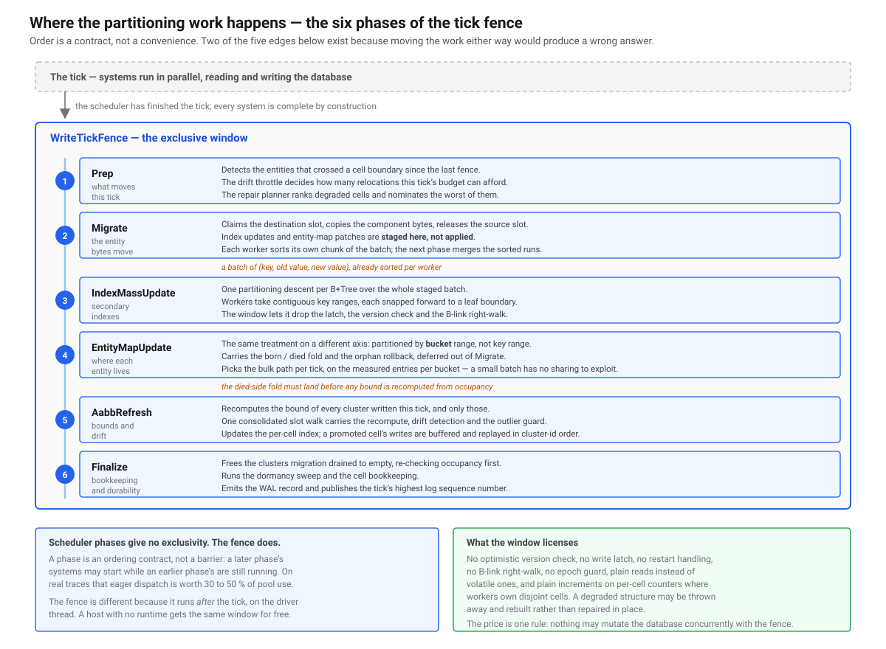

# 07 — Spatial

**Code:** [`src/Typhon.Engine/Spatial/`](https://github.com/Log2n-io/Typhon/tree/main/src/Typhon.Engine/Spatial) (+ geometric primitives in [`src/Typhon.Schema.Definition/SpatialTypes.cs`](https://github.com/Log2n-io/Typhon/blob/main/src/Typhon.Schema.Definition/SpatialTypes.cs))

Spatial indexing in Typhon answers "which entities are near this point / inside this box / hit by this ray?" — the kinds of queries games, simulations, and geospatial workloads run thousands of times per tick. There is exactly **one** spatial index, built from two levels of the same structure:

- A **shared coarse cell grid** — engine-wide, one cell size, three axes, sparse. Per-archetype cluster storage hangs off this grid so a cluster's entities can be located in O(1) from its `(x, y, z)` centre.
- A **per-cell cluster broadphase** — inside each occupied cell, one array of cluster bounding boxes per archetype, split into a static and a dynamic half. A query scans those boxes and opens only the clusters that overlap, then tests entities individually. A cell dense enough to make that scan the cost promotes its half to an R-Tree over the same boxes ([§3](#3-the-per-cell-cluster-index)).

That broadphase is the whole index. Every spatial query resolves through it, and it is held to one home — a second index anywhere is a violation with a test that fails on it, not a design choice left open.

Application code never instantiates any of it. You annotate a component field with `[SpatialIndex]` ([§5](#5-ecs-integration)) and use spatial operators on `EcsQuery` (`WhereInAABB`, `WhereNearby`, `WhereRay`, `WhereFrustum`) — the engine places the entity in a cluster, keeps that cluster's bounds current, and moves the entity when its position leaves its cell.

This doc covers what the index does, what guarantees it offers, and how it integrates with ECS — not every micro-optimisation in the code (split policy, OLC validation, back-pointer chase logic). For those, the source is well-commented.

---

## 1. Overview

Three structures, one index:

| Structure | Granularity | Use |
|---|---|---|
| **`SpatialGrid`** ([`Spatial/internals/SpatialGrid.cs`](https://github.com/Log2n-io/Typhon/blob/main/src/Typhon.Engine/Spatial/internals/SpatialGrid.cs)) | Coarse — world divided into cells of `CellSize` world units | Locate the handful of cells overlapping a query, and the cell an entity's position falls in |
| **`CellSpatialIndex`** ([`Spatial/internals/CellSpatialIndex.cs`](https://github.com/Log2n-io/Typhon/blob/main/src/Typhon.Engine/Spatial/internals/CellSpatialIndex.cs)) | One entry per cluster in one cell half | Broadphase: a linear SoA scan over cluster bounding boxes and category masks |
| **`CellClusterTree`** ([`Spatial/internals/CellClusterTree.cs`](https://github.com/Log2n-io/Typhon/blob/main/src/Typhon.Engine/Spatial/internals/CellClusterTree.cs)) | The same cluster boxes, as a `SpatialRTree<TStore>` | What a cell half is promoted to when the linear scan stops paying — `O(log C)` instead of `O(C)` |

The grid is **one per `DatabaseEngine`** — configured once at startup via `DatabaseEngine.ConfigureSpatialGrid(SpatialGridConfig)` before archetypes are initialized. All spatial archetypes share it. Per-archetype differences (tier filters, category masks) are layered above; the grid itself is uniform. It is required, not optional: an archetype that declares a `[SpatialIndex]` field and finds no configured grid throws at `InitializeArchetypes`, naming the archetype.

The per-cell index is **per archetype, per cell, per mode**. [`ArchetypeClusterState`](https://github.com/Log2n-io/Typhon/blob/main/src/Typhon.Engine/Ecs/internals/ArchetypeClusterState.cs) holds one [`PerCellSpatialSlot`](https://github.com/Log2n-io/Typhon/blob/main/src/Typhon.Engine/Spatial/internals/PerCellSpatialSlot.cs) per cell the archetype occupies, and each slot carries a static and a dynamic half — `SpatialMode` on the `[SpatialIndex]` field decides which one an archetype's clusters go into. A half is **either** a linear `CellSpatialIndex` **or** a promoted `CellClusterTree`, never both, and every reader must consult `HasDynamicTree`/`HasStaticTree` rather than assuming the array: a reader that assumes reads a promoted cell as *empty* — a silent false negative rather than an error. Which of the two a half holds is decided by the engine from that half's own cluster count, and changes as the count does.

[`SpatialIndexState`](https://github.com/Log2n-io/Typhon/blob/main/src/Typhon.Engine/Spatial/internals/SpatialIndexState.cs) hangs off a spatially-indexed `ComponentTable` and is what `ComponentTable.SpatialIndex` returns. It carries only **field metadata** — offset, shape, mode, category — plus the list of cluster archetypes a query fans out over. It holds no index. Everything in it derives from the schema attribute, so nothing about it is persisted and the load path builds it exactly as the create path does; a `[SpatialIndex]` component allocates no storage segment at all.

Cluster archetypes ([06-ecs §7](06-ecs.md)) plug into the grid through [`ArchetypeClusterState`](https://github.com/Log2n-io/Typhon/blob/main/src/Typhon.Engine/Ecs/internals/ArchetypeClusterState.cs): each cluster carries a `ClusterSpatialAabb` (six floats + category mask, [`ClusterSpatialAabb.cs`](https://github.com/Log2n-io/Typhon/blob/main/src/Typhon.Engine/Spatial/public/ClusterSpatialAabb.cs)) summarising every entity it holds, and the grid's [`CellState`](https://github.com/Log2n-io/Typhon/blob/main/src/Typhon.Engine/Spatial/internals/CellDescriptor.cs) tracks how many clusters and entities sit in each cell. That bookkeeping is what makes the grid useful as a broadphase: an AABB query maps to a small set of cells, each cell yields a small set of clusters, and only those clusters are visited at the entity level.

Every archetype is cluster-backed, so this is the path for all of them. Storage mode decides where component data sits inside a cluster, never which structure answers a query — choosing `SingleVersion` over `Versioned` changes what a read costs, not how the query finds it.

---

## 2. Spatial grid

The grid divides world space into fixed-size cubic cells on **all three axes** — `ComputeCellKey` takes `(cellX, cellY, cellZ)`, and a 3D archetype buckets on Z exactly as it does on X and Y.

A 2D archetype is not a separate code path. Its spatial field reports a Z centre of `0` (`ReadSpatialCenter3D`), so it buckets into the grid's first Z plane, and its queries pass ±infinity for the Z bounds, which the range mapping saturates to the grid's full depth — the only axis on which ±infinity is tolerated, and the reason a 2D archetype behaves as "every Z". A **flat world** is then just the 3D grid with `GridDepth == 1` (`SpatialGridConfig.Flat`), which is what lets one grid serve mixed 2D and 3D workloads through one cell layout rather than two parallel index types.

### `SpatialGridConfig`

[`Spatial/public/SpatialGridConfig.cs`](https://github.com/Log2n-io/Typhon/blob/main/src/Typhon.Engine/Spatial/public/SpatialGridConfig.cs)

Immutable, validated at construction:

| Field | Meaning |
|---|---|
| `WorldMin` / `WorldMax` | `Vector3` world-space bounds. Max strictly > Min on all three axes. |
| `CellSize` | World units per cell. Must be > 0. |
| `MigrationHysteresisRatio` | Fraction of cell size used as dead zone for cluster migration (default 0.05). |
| `GridWidth` / `GridHeight` / `GridDepth` | Derived per axis. `ceil((Max - Min) / CellSize)`. `GridDepth` is `1` for a flat world. |
| `CellCount` | Derived. `GridWidth × GridHeight × GridDepth`; must fit a 32-bit key. |
| `InverseCellSize` | Precomputed `1 / CellSize`. |

Cell keys are **pool slots** in a sparse structure: a root hash map from packed block coordinates to a block, a dense per-block `int[]` of cell-slot indices, and a chunked pool holding one 64-byte `CellState` per *occupied* cell. A cell exists only once something occupies it; an empty region costs one absent hash entry rather than a descriptor per cell. Keys are handed out in creation order, so they renumber across a rebuild and must not be cached across one.

The block extent is derived per axis as `clamp(nextPow2(extentInCells), 1, 16)`, so a flat world's blocks are `16 × 16 × 1` and a cubic world's are `16³`. Within a block a neighbour is index arithmetic; only a step across a block face costs a root lookup.

<a href="assets/spatial-vdb-grid.svg"></a>

<sub>The three levels — root hash map, dense per-block slot array, chunked `CellState` pool — against a dense grid covering the same extent.</sub>

**No level of the addressing uses a Morton (Z-order) code.** Within a block the local index is row-major, `(cellZ << logY+logX) | (cellY << logX) | cellX`, and above it a block is found by hashing its packed coordinates. A 32-bit **3D** Morton key would hold only 10 bits per axis — 1 024 cells, against the 32 768 two axes would allow — and the power-of-two key-space padding it needs would size the descriptor table as `KeySpaceDim³`, over a billion cells for a 1024 × 1024 × 1 world. Row-major indexing gives up Z-order locality and buys back both. A flat world's blocks are one cell deep, so the `cellZ` term folds away and the local index is exactly the 2D one.

### `SpatialGrid` and `CellState`

[`Spatial/internals/SpatialGrid.cs`](https://github.com/Log2n-io/Typhon/blob/main/src/Typhon.Engine/Spatial/internals/SpatialGrid.cs), [`Spatial/internals/CellDescriptor.cs`](https://github.com/Log2n-io/Typhon/blob/main/src/Typhon.Engine/Spatial/internals/CellDescriptor.cs)

The grid owns a **chunked pool** of `CellState`, one entry per *occupied* cell rather than a flat array of length `CellCount` (see the sparse structure described above). Each `CellState` is **64 bytes — one full cache line**, by `[StructLayout(LayoutKind.Explicit, Size = 64)]`:

| Offset | Field | Meaning |
|---|---|---|
| 0 | `byte Tier` | SimTier assignment (single-bit flag; multi-tier rejected). |
| 1 | `byte Flags` | Reserved. |
| 2 | `ushort Reserved` | Reserved. |
| 4 | `int ClusterCount` | Sum of clusters in this cell across **all** archetypes sharing the grid. `Interlocked` only. |
| 8 | `int EntityCount` | Sum of `PopCount(OccupancyBits)` across all clusters in this cell. `Interlocked` only. |
| 12–63 | — | Padding / future use. |

The cache-line padding is non-negotiable — fence workers concurrently mutate `EntityCount`/`ClusterCount` for *different* cells, and without padding adjacent cells would false-share.

Per-cell **cluster lists** (which clusters live in a cell, per archetype) don't live on `CellState` — they're per archetype, stored inside each `ArchetypeClusterState`'s own [`CellClusterPool`](https://github.com/Log2n-io/Typhon/blob/main/src/Typhon.Engine/Spatial/internals/CellClusterPool.cs) / [`CellSpatialIndex`](https://github.com/Log2n-io/Typhon/blob/main/src/Typhon.Engine/Spatial/internals/CellSpatialIndex.cs). The grid is the shared global counter; archetypes own their own per-cell linkage.

All grid state is **transient** — nothing in `CellState` is persisted. After a database reopen, `RebuildCellState` reconstructs it by replaying entity positions.

### Coordinate utilities

The grid is the place to convert between world space and cells — it's a pure stateless mapping over `Config`:

```csharp
int cellKey = grid.WorldToCellKey(worldX, worldY, worldZ);
grid.WorldToCellRange(minX, minY, minZ, maxX, maxY, maxZ,
    out int cellMinX, out int cellMinY, out int cellMinZ,
    out int cellMaxX, out int cellMaxY, out int cellMaxZ);
int cellKey2 = grid.ComputeCellKey(cellX, cellY, cellZ);
(int x, int y, int z) = grid.CellKeyToCoords(cellKey);
```

Out-of-bounds inputs are clamped to the grid extent. NaN **throws** on every axis — silently producing a meaningless cell would be a debugging nightmare — and infinity throws on X and Y. The single exception is ±infinity on **Z**, which `WorldToCellRange` accepts and saturates to the full depth range, because that is how a 2D archetype spells "every Z". The `ReadSpatialCenter3D(byte* fieldPtr, SpatialFieldType, out posX, out posY, out posZ)` static unpacks a center from any of the four supported field types (AABB2F/3F, BSphere2F/3F), returning `posZ = 0` for the 2D ones — used by both world-to-cell mapping and the cluster-migration cell-crossing detector.

### `SpatialGridAccessor`

[`Spatial/public/SpatialGridAccessor.cs`](https://github.com/Log2n-io/Typhon/blob/main/src/Typhon.Engine/Spatial/public/SpatialGridAccessor.cs)

8-byte `readonly struct` — the game-facing handle exposed on `TickContext.SpatialGrid`. Thin wrapper over `SpatialGrid` for tier assignment (`SetCellTier`, `SetCellTierMin`, `ResetAllTiers`, `SetTierInAABB`) and coordinate queries. `IsValid` is false when the engine has no configured grid (non-spatial games or shutdown).

---

## 3. The per-cell cluster index

Inside one cell, one archetype, one mode, the broadphase is a linear SoA scan: `CellSpatialIndex` holds six `float` arrays of cluster bounds plus a cluster id and a category mask per entry, and a query walks them end to end. That is the right shape for the cells a real world is mostly made of — measured on the clumped sweep behind this design, the mean cell holds 1.8 clusters. It is the wrong shape for the tail: the same sweep put the worst cell at 102 clusters for the same population, and a selective query there pays for every one of them.

So a cell half whose cluster count crosses `CellTreePromoteThreshold` swaps its array for a `CellClusterTree` — a `SpatialRTree<TransientStore>` over the same cluster boxes, giving `O(log C)` descent instead of `O(C)` scan. Demotion runs back at half that threshold, and the gap is what stops a cell oscillating. The engine drives both transitions itself, on insertion and on removal; the application chooses only where the boundary sits, through `DatabaseEngineOptions.Spatial.CellTreePromoteThreshold`, which defaults to 1024 clusters in one cell half. Demotion returns the tree's node chunks to the archetype's shared segment, so crossing the boundary repeatedly costs a rebuild each way and nothing else.

The rest of this section describes that tree. It is a `SpatialRTree<TStore>`, and its leaf entries name a **cluster chunk id** and carry the cluster's bounds in that cell's frame — never an entity. Bounds are stored tight; the hysteresis that keeps small moves off the index comes from the cluster bound covering up to 64 members and from shrink being deferred to the fence.

### Variants and layout

One implementation, four variants — selected by [`SpatialVariant`](https://github.com/Log2n-io/Typhon/blob/main/src/Typhon.Engine/Spatial/public/SpatialVariant.cs): `R2Df32`, `R3Df32`, `R2Df64`, `R3Df64`. The layout is described by a [`SpatialNodeDescriptor`](https://github.com/Log2n-io/Typhon/blob/main/src/Typhon.Engine/Spatial/internals/SpatialNodeDescriptor.cs) — a `readonly struct` of node-layout constants the JIT promotes to literal values, so generic code over `SpatialRTree<TStore>` doesn't pay polymorphism cost.

Every cell tree uses the **3D-f32** variant: `C16` makes 2D a degenerate Z axis rather than a separate code path, and f64 would more than halve fanout for a structure whose whole purpose is the `O(log C)`. The other three variants remain implemented and tested. Each node is one chunk of a [`ChunkBasedSegment<TStore>`](https://github.com/Log2n-io/Typhon/blob/main/src/Typhon.Engine/Storage/internals/ChunkBasedSegment.cs) — **512 B for every variant except 3D-f64, which is 768 B**. The layout is **SOA within the node** (separate arrays for coordinates / IDs / category masks rather than an array of entry structs), which keeps geometric scans dense. Header layout:

```
[ OlcVersion(4) | Control(4) | ParentChunkId(4) | NodeMBR(coords) | UnionCategoryMask(4) ]
```

…followed by the entry area. Leaf entries carry `[coords | PayloadId(8) | CategoryMask(4)]`; internal entries carry `[coords | ChildChunkId(4)]`. Leaf fanout is 17 / 13 / 10 / 11 entries per node for 2D-f32 / 3D-f32 / 2D-f64 / 3D-f64; internal fanout is 24 / 16 / 12 / 13, higher because internal entries are smaller. There is no `ComponentChunkId` column between the payload id and the mask. Naming the owning component's chunk so a compound query could skip an `EntityMap` lookup is a service only an entity-level tree could offer, and those 4 bytes buy more as leaf capacity — they are worth one extra entry per node in three of the four leaf variants.

Tree metadata (root chunk id, node count, entity count, depth, variant) *can* be mirrored into **chunk 0** of the segment, but cell trees switch that off. Every cell tree of one archetype shares a single segment, so one mirror could only ever hold one tree's values; `CellClusterTree` constructs with `mirrorMetadata: false`, which makes the sync a no-op and removes what would otherwise be a contended cache line per archetype. A tree that does not mirror also cannot be loaded back from its segment — consistent, since the segment is a `TransientStore` and nothing here reaches disk.

| Field | Meaning |
|---|---|
| `_rootChunkId` | Chunk id of the current root. |
| `_nodeCount` / `_entityCount` / `_depth` | Tree statistics. Here `_entityCount` counts indexed **clusters**. |
| `_mutationVersion` | Monotonic counter, bumped on every `Insert`/`Remove`. It fed the entity-level trigger system's cache invalidation and currently has no consumer. |
| `PayloadBackPointers` | An `int[]`, indexed by payload id, holding each entry's packed `(leafChunkId, slotIndex)`. For a cell tree this array **is** the archetype's `ClusterSpatialIndexSlot`, shared by every cell tree it owns. |

### Concurrency model — `SpinWriteLock` (its own variant)

Each R-Tree node has a 32-bit [`OlcLatch`](https://github.com/Log2n-io/Typhon/blob/main/src/Typhon.Engine/Foundation/Concurrency/internals/OlcLatch.cs) embedded in its header. Reads use optimistic concurrency control — capture the version before the read, do the work, validate after; restart if anything changed. Writes need exclusive access, and the R-Tree takes it through a **plain `SpinWait` loop**:

```csharp
private static void SpinWriteLock(byte* nodeBase, out OlcLatch latch)
{
    latch = GetLatch(nodeBase);
    SpinWait spin = default;
    while (!latch.TryWriteLock())
    {
        spin.SpinOnce();
    }
}
```

That's it — no deadline, no holdoff, no telemetry hooks, no two-phase progression. **This is different from the B+Tree's `SpinWriteLock`** ([03-indexing](03-indexing.md)), which runs a two-phase 64-iteration PAUSE → yield-capped escalation tuned to avoid `Sleep(1)`. The R-Tree variant is unconditional `SpinOnce` and accepts whatever progression .NET's `SpinWait` gives it (`Thread.SpinWait` for the first iterations, then `Thread.Yield()` / `Thread.Sleep(0/1)` after the threshold).

Why the simpler model? Two reasons:

1. **Lock-hold time is shorter.** A leaf write — append-or-swap, refit the leaf MBR — is ~tens of nanoseconds. A B+Tree node mutation in contrast can involve a split, key shuffling, and ancestor updates, so its lock-hold variance is much wider and the two-phase escalation pays for itself.
2. **OLC absorbs most contention.** Readers don't take the lock at all — they validate the version on the way out, and restart on conflict (`return default` from `TryInsert`, or `RestartFromRoot` in the query enumerators). Writers contend only with other writers on the same node; the spinner rarely runs for long.

The contrast matters: if you're hunting a "lock not advancing" symptom on the R-Tree, you're looking at `SpinWait.SpinOnce()` behavior; don't transplant your B+Tree mental model. If you're hunting it on the B+Tree, the two-phase escalation is the place to look.

Tree-level metadata writes (`SyncMetadata` on chunk 0) take a separate **plain `Lock`** to serialise concurrent root-pointer / depth updates — which a cell tree never pays, since it mirrors nothing.

### Operations

[`SpatialRTree.Insert.cs`](https://github.com/Log2n-io/Typhon/blob/main/src/Typhon.Engine/Spatial/internals/SpatialRTree.Insert.cs), [`SpatialRTree.Query.cs`](https://github.com/Log2n-io/Typhon/blob/main/src/Typhon.Engine/Spatial/internals/SpatialRTree.Query.cs), [`SpatialRTree.Remove.cs`](https://github.com/Log2n-io/Typhon/blob/main/src/Typhon.Engine/Spatial/internals/SpatialRTree.Remove.cs), [`SpatialRTree.Split.cs`](https://github.com/Log2n-io/Typhon/blob/main/src/Typhon.Engine/Spatial/internals/SpatialRTree.Split.cs), [`SpatialRTree.BulkLoad.cs`](https://github.com/Log2n-io/Typhon/blob/main/src/Typhon.Engine/Spatial/internals/SpatialRTree.BulkLoad.cs)

| Operation | Notes |
|---|---|
| **Insert** | OLC descent picks the best leaf (smallest MBR enlargement, tie-break smallest area). Write-locks the leaf, appends, refits MBR up the recorded descent path. Splits when the leaf is full ([Split.cs](https://github.com/Log2n-io/Typhon/blob/main/src/Typhon.Engine/Spatial/internals/SpatialRTree.Split.cs)). Restarts on OLC version mismatch — capped at 255 restart attempts before a hard fail. The handle it produces goes straight into `PayloadBackPointers`; no caller may keep a copy, because a split or a removal belonging to a *different* cluster relocates entries. |
| **TryUpdateLeafEntryInPlace** | The cluster-bound update path. Writes the new coordinates into the existing slot when the target is a live leaf slot, its payload id matches the caller's, and the new bounds are contained by the leaf's current MBR on every axis — then skips the ancestor refit entirely. That leaves the leaf a strict *superset* of the union of its entries until an end-of-pass `RefitLeafAndAncestors` closes the window. Anything else escapes to remove-plus-insert. |
| **Remove** | Reads the back-pointer to get `(leafChunkId, slotIndex)` directly — O(1), no descent. Swap-with-last in the leaf, refit MBR, walk ancestors bottom-up via `ParentChunkId`. When the last entry leaves a non-root leaf, the leaf chunk is recycled (`RemoveEmptyLeaf`). |
| **QueryAABB** | Stack-based DFS, OLC validate per node, leaf-level overlap test fully unrolled for 2D and 3D. Returns `AABBQueryEnumerator` (ref struct, zero allocation). |
| **QueryRadius** | Coarse filter — converts radius to enclosing AABB. At cluster level this is only the broadphase: `AabbClusterEnumerator` then measures the closest point on each *entity's* own bounds and rejects anything past the radius, so no caller-side post-filter is needed. |
| **QueryRay** | Min-heap priority queue — 64-entry inline buffer (zero allocation); spills to `ArrayPool`-rented arrays on overflow, up to 16 384 entries. Front-to-back order. Ray–AABB slab intersection (`SpatialGeometry.RayAABBIntersect`). |
| **QueryFrustum** | Half-space classification (`ClassifyAABBAgainstPlanes`). Inside / Outside / Intersecting — Inside subtrees skip per-entry plane tests entirely (the leaf scan still happens, just without geometry). |
| **QueryKNN** | Not used at cluster level. `ArchetypeClusterState.QueryNearest` replaces it with a shell walk over cells and a best-first open over clusters, terminating once the k-th distance is inside the region already swept — sound because a cluster box's distance is a lower bound on its entities'. Results come back with real squared distances, ascending. |
| **CountInAABB / CountInRadius** | Subtree counting shortcut: fully-contained subtrees count their entries without per-entry overlap tests. **No production path calls these** — counting a spatial query means materializing the set and taking its size. They stay covered by tests and benchmarks. |

Which of these the cell layer actually drives: `Insert`, `TryUpdateLeafEntryInPlace`, `RemoveChecked`, `RefitLeafAndAncestors`, `QueryAABB` (the AABB and radius broadphase) and, for a promoted cell, `QueryRay` and `QueryFrustum`. kNN and the count shortcut are reached by nothing.

Every operation emits a tier-2-gated `TyphonEvent` span (`Spatial:RTree:Insert`, `Spatial:Query:Aabb`, `Spatial:Query:Radius`, `Spatial:Query:Ray`, …) populated with result counts, nodes visited, leaves entered, and OLC restart counts. See [12-observability](12-observability.md).

### Category masks

Every leaf entry carries a 32-bit `CategoryMask` — for a cell tree, the OR of the masks of the entities in that cluster; every node carries a `UnionCategoryMask` = OR of all descendants' masks. Queries pass a `categoryMask` and entire subtrees whose union mask doesn't intersect are pruned (`(unionMask & queryMask) == 0`). At leaf level the tree's own test is AND-conjunctive: `(leafMask & queryMask) == queryMask`. A query mask of `0` is a sentinel that bypasses filtering — useful when you want every result.

**The two levels disagree on purpose, and the cluster level wins.** The cluster broadphase admits on *any* bit overlap, `(clusterMask & queryMask) != 0`, which is the semantic `[SpatialIndex(Category = …)]` documents. So `AabbClusterEnumerator` applies the category filter itself rather than handing the mask to a promoted cell's tree, which would apply the stricter rule and drop clusters the caller asked for.

Category masks are **archetype-level** in cluster archetypes (every entity in an archetype has the same value), so the per-cluster union is effectively a constant — incremental OR on spawn, no recompute on destroy.

---

## 4. Geometric predicates

The geometric primitives — `AABB2F/3F/2D/3D`, `BSphere2F/3F/2D/3D` — live in the sibling [`Typhon.Schema.Definition`](https://github.com/Log2n-io/Typhon/blob/main/src/Typhon.Schema.Definition/SpatialTypes.cs) project, not in `Typhon.Engine`. That's because schema-defined component fields need to reference them without dragging in the full engine. See [01-foundation §9](01-foundation.md#9-schema-definition-types-sibling-project) for why this split exists.

Helpers ([`Spatial/internals/SpatialGeometry.cs`](https://github.com/Log2n-io/Typhon/blob/main/src/Typhon.Engine/Spatial/internals/SpatialGeometry.cs)) — all `[MethodImpl(AggressiveInlining)]` and scalar-only for now (the SOA layout enables drop-in SIMD later):

| Predicate / op | Variants |
|---|---|
| `Overlaps(a, b)` | AABB×AABB, all 4 variants |
| `Contains(outer, inner)` | AABB×AABB, all 4 variants |
| `Union(a, b)` | All 4 variants |
| `Area(box)` / `Volume(box)` | 2D / 3D respectively |
| `Enclosing(BSphere)` | Sphere → enclosing AABB (used to convert radius queries to AABB queries) |
| `IsDegenerate(box)` | NaN / inverted-bounds check |
| `RayAABBIntersect(origin, invDir, coords, count)` | Slab method, ~6–8 float ops per box |
| `ClassifyAABBAgainstPlanes(coords, planes, planeCount, dim)` | Positive/negative vertex method — returns Inside / Intersecting / Outside |
| `SquaredDistanceToCenter(point, coords, count)` | For kNN ranking |

A `SpatialFieldType` enum maps the schema-side `FieldType` to a compact 0–7 byte: `AABB2F=0`, `AABB3F=1`, `BSphere2F=2`, `BSphere3F=3`, `AABB2D=4`, …. `SpatialFieldInfo.ToVariant()` then maps that to the right `SpatialVariant` for the tree.

Currently supported: **f32 only** (2D and 3D — Z is filtered at narrowphase). f64 variants are valid as field types and the `SpatialRTree` implementation handles them, but neither the grid bucketing nor the cluster bounds do, so no live query path reaches them. `SpatialGrid.ValidateSupportedFieldType` enforces this at `ConfigureSpatialGrid` time.

---

## 5. ECS integration

You mark a component field as spatially indexed with `[SpatialIndex(cellSize)]` from `Typhon.Schema.Definition`:

```csharp
[Component("Game.Position", 1)]
public struct Position
{
    [SpatialIndex(Mode = SpatialMode.Dynamic, Category = 1 << 0)]
    public AABB2F Bounds;
}
```

[`SpatialIndexAttribute`](https://github.com/Log2n-io/Typhon/blob/main/src/Typhon.Schema.Definition/Attributes.cs) carries:

| Property | Meaning |
|---|---|
| `CellSize` | A per-component cell size. Stored and **sizes nothing** — there is no per-component occupancy filter. The cell size that matters is the engine-wide `SpatialGridConfig.CellSize`. |
| `Mode` | `Dynamic` (default) or `Static`. Selects which half of every cell this archetype's clusters occupy, and whether the tick fence's bound-refresh, drift and repair passes visit them at all. |
| `Category` | Archetype-level 32-bit mask used by the cluster broadphase, admitting on any bit overlap. Defaults to `uint.MaxValue` (accept every query). |

At schema registration, the engine reads the attribute, infers the `SpatialFieldType` from the field's C# type (`AABB2F`, `BSphere3F`, …), builds a [`SpatialFieldInfo`](https://github.com/Log2n-io/Typhon/blob/main/src/Typhon.Engine/Spatial/public/SpatialFieldInfo.cs), resolves the matching `SpatialNodeDescriptor`, and stores that in a `SpatialIndexState` on the component table. It **allocates nothing**: `ComponentTable.BuildSpatialIndex` reserves no persisted `StorageSegmentKind.Spatial` segment at all, which is why the load path can call it with no arguments exactly as the create path does. Cluster archetypes containing a spatial component register on the state's `ClusterArchetypes` list, which is what a query fans out over.

### Query operators

`EcsQuery<TArchetype>` ([06-ecs §5](06-ecs.md), [09-querying](09-querying.md)) exposes four spatial filters — defined in [`Ecs/public/EcsQuery.cs`](https://github.com/Log2n-io/Typhon/blob/main/src/Typhon.Engine/Ecs/public/EcsQuery.cs):

```csharp
tx.Query<Ant>()
  .WhereInAABB<Position>(minX, minY, minZ, maxX, maxY, maxZ)
  .Execute();

tx.Query<Ant>()
  .WhereNearby<Position>(centerX, centerY, centerZ, radius)
  .Execute();

tx.Query<Ant>()
  .WhereRay<Position>(originX, originY, originZ, dirX, dirY, dirZ, maxDist)
  .Execute();

// Four doubles per plane for a 3D component, three for a 2D one; the bounding box of the region is the caller's to compute.
tx.Query<Ant>()
  .WhereFrustum<Position>(planes, planeCount, bMinX, bMinY, bMinZ, bMaxX, bMaxY, bMaxZ)
  .Execute();
```

Each operator records the query type and parameters on the `EcsQuery`; `Execute` then calls `ExecuteSpatial`, which fans out over `SpatialIndexState.ClusterArchetypes` and, for each one, runs the shape's cluster walk: cells from `SpatialGrid.WorldToCellRange`, broadphase over each cell half's cluster boxes, narrowphase over the entities of the clusters that survive. There is one path, not two: no tree is descended ahead of the cluster walk, and all four shapes — AABB, radius, ray and frustum — are served by it.

Code that wants the hits without materializing a `HashSet` calls `dbe.ClusterSpatialQuery<TArch>()` ([`Spatial/public/ClusterSpatialQuery.cs`](https://github.com/Log2n-io/Typhon/blob/main/src/Typhon.Engine/Spatial/public/ClusterSpatialQuery.cs)), which drives the same [`AabbClusterEnumerator`](https://github.com/Log2n-io/Typhon/blob/main/src/Typhon.Engine/Spatial/public/AabbClusterEnumerator.cs) state machine with compile-time tier checking. The type is public, but the enumerator documents a requirement to run inside an `EpochGuard` scope, and `EpochGuard` is engine-internal — so in practice this surface is reached from engine code, benchmarks and demos rather than from an ordinary application.

Both surfaces emit an `Ecs:Query:Spatial:Attach` instant event so traces show the bounding region the predicate is filtering on.

Each `Where*` method requires the component to carry `[SpatialIndex]`, checked through `CheckConfig.Require` — so calling `WhereNearby<NotSpatial>(…)` is a usage error caught whenever strict checks are enabled, and folded away when they are not.

---

## 6. Spawn / write / destroy flows

A spatially-indexed archetype has to keep three things agreed: each entity's own bounds in cluster storage, the bounding box of the cluster holding it, and the entry for that cluster in its cell's index. Storage mode changes *when* the work lands (see [05-revision](05-revision.md) / [06-ecs §8](06-ecs.md)), not what is touched.

Maintenance is per CLUSTER, never per entity: an entity write updates its own bounds and, at most, widens the bound of the cluster holding it. `SpatialMaintainer` is down to two things — the migration-storm warning, and `ReadAndValidateBoundsFromPtr`, the single decoder for all eight `SpatialFieldType` shapes, which the cluster path reaches from around eighteen call sites.

### Spawn

Placement picks a cell from the entity's position and then a cluster in that cell with a free slot. The entity's bounds are decoded through `SpatialMaintainer.ReadAndValidateBoundsFromPtr`; **degenerate bounds (NaN or inverted) are excluded** rather than failing the spawn — the entity exists in ECS and simply contributes nothing to its cluster's box. The cluster's `ClusterSpatialAabb` is unioned with the new entity's, in the cell-relative frame, and the cluster is added to the appropriate half of its cell's index if it was not already there. A cluster chunk id can be reused, so the first entity of a cluster resets the box to `Empty` rather than unioning into whatever a prior tenant left.

### Write

[`ClusterRef.WriteSpatial`](https://github.com/Log2n-io/Typhon/blob/main/src/Typhon.Engine/Ecs/public/ClusterRef.cs) is the write barrier for a spatial field and the canonical replacement for assigning through `GetSpan<T>()`. In order it reads the old field bytes, writes the new value, CAS-grows `ClusterAabbs` on any axis the entity pushed outward, flags `ClusterShrinkPendingAxes` on any axis where this slot *was* the extreme and moved inward, flags `ClusterMigrationPendingSlots` when the new position crossed the cell boundary plus hysteresis, and sets the cluster's bit in `ClusterProcessBitmap` so the fence visits it. All the bookkeeping writes are `Interlocked`, so workers may call it concurrently on different slots of the same cluster.

It deliberately does **not** mark the slot dirty. The dirty bitmap drives WAL serialization and change-filtered dispatch, and marking every mover dirty every tick floods the WAL writer into backpressure. Fence-time spatial maintenance does not need the dirty bit; it consumes `ClusterProcessBitmap` and `ClusterMigrationPendingSlots` directly. A workload that genuinely needs the spatial field persisted writes through the MVCC `OpenMut` path instead, or calls `SetDirty` explicitly afterwards.

A write that bypasses the barrier sets no process bit, and that is a real hole rather than a stylistic complaint: a cluster the fence is never told to recheck is invisible to drift detection on one of the two refresh branches ([§7](#7-intra-cell-drift-relocation-and-repair)). Analyzer rule **TYPHON009** flags mutable access to a spatial component through `GetSpan`/`Get` for exactly this reason.

### Fence

The tick fence turns those flags into index state: the `AabbRefresh` phase recomputes the bound of every flagged cluster by scanning its occupied slots through the occupancy word, and then writes the fresh box into the cell's index. The subtlety is that the fence may **not** decide whether to write the index by comparing `ClusterAabbs` against what it just computed. Write-time CAS has often already applied the grow, so that comparison answers "the fence learned nothing", which is true and not the question; the index would sit a tick behind while every containment check on `ClusterAabbs` passed. The signal is `ClusterProcessBitmap`, which `WriteSpatial` sets and the fence clears once per tick.

For a promoted cell there is a second constraint. The fence slices its refresh work by *cluster*, not by cell, so two workers routinely hold clusters of one cell — and `SpatialRTree` is single-writer by specification. Each worker therefore buffers its updates for promoted cells, the buffers are merged under one lock, and a single thread replays them in cluster-id order after the phase barrier. Replaying in arrival order instead would make every handle a function of the worker count.

### Destroy

`ReleaseSlot` clears the entity's bit in the cluster's occupancy word, and that bit is the authoritative act. A destroy sets **no dirty bit and no process bit** — and even a slot written earlier in the tick loses its dirty bit, because Prep ANDs the dirty word with occupancy before the refresh sees it. So nothing but this site knows the cluster's bound may now be too wide. Three things follow:

- **The cell's `EntityCount` decrements.** A serial release also resets that cell's scan cursor, so the freed slot is reused by the next `ClaimSlotInCell` rather than skipped.
- **A cluster that still holds entities gets its shrink mask set on all four axes** (`FlagClusterShrinkAxesOnly`). All four rather than a guessed one: the departing entity may have been the extreme on any axis or on several, the refresh only re-derives an axis whose bit is set, and the scan costs nothing extra on a cluster it is already walking. The **process** bit is deliberately left clear — it means "visit and republish", which for a cluster whose geometry can only have shrunk would push it through the overhang note, the outlier guard and drift detection and perturb relocation. The price of that choice is stated where it is made: the barrier-only fence arm iterates `ClusterProcessBitmap`, so a destroy is invisible to it.
- **A cluster that just lost its last entity is detached from its cell** by `FinaliseEmptyClusterCellState`: out of the archetype's per-cell claim list, `CellState.ClusterCount` decremented, out of the cell's index, `ClusterAabbs` reset to `Empty`, and `ClusterCellMap` cleared. A single-threaded destroy finalises inline and frees the chunk; the parallel migration path passes `deferFinalize` and records the drain for `FinalizeArchetypeFence`, because freeing here would race a `ClaimSlotInCell` that may have claimed a slot in this cluster since the last bit was cleared.

Removal from the cell index routes on the archetype's `SpatialMode` — static half or dynamic half — not on any per-entry selector. In the linear array it is a swap-with-last, after which the caller writes the displaced cluster's new slot into `ClusterSpatialIndexSlot` and clears the removed one to `-1`. In a promoted tree, `RemoveAt` retires the handle and repairs the swapped entry through that same array, so there is nothing left for the caller to fix; a tree that falls to the demote threshold is turned back into a linear array on the spot.

There is **no Layer-1 occupancy map to decrement and no back-pointer tree selector to route through**. Both belonged to the entity-level tree; a component carrying `[SpatialIndex]` allocates no occupancy hashmap at all.

### Cluster migration

When an entity moves into a different grid cell (with hysteresis around the boundary so jitter at the edge doesn't oscillate), the fence migrates it: it claims a slot in a cluster of the destination cell, copies the entity's components across, removes the source cell's contribution to `CellState.EntityCount` and adds the destination's, and updates both cells' cluster lists. This is the [`MigrationRequest`](https://github.com/Log2n-io/Typhon/blob/main/src/Typhon.Engine/Spatial/internals/MigrationRequest.cs) path, and it is the reason `CellState.EntityCount` exists. A migration storm (many migrations in one tick) emits a warning — usually a viewport warp, a teleport, or unphysical speed.

Migration is also the vehicle for the intra-cell repairs in [§7](#7-intra-cell-drift-relocation-and-repair): a relocation and a Morton re-pack both emit ordinary `MigrationRequest`s rather than duplicating entity-map keying, index element ids, zone maps and rollback for a rarer path.

### Trigger and interest systems

Two consumers sit on the same index, and both are reachable from application code. Each resolves entities only through the per-cell cluster index, neither acquires an entity-level index of its own, and each has a public entry point a test can drive rather than an internal factory.

- [`SpatialTriggerSystem`](https://github.com/Log2n-io/Typhon/blob/main/src/Typhon.Engine/Spatial/internals/SpatialTriggerSystem.cs) — volume occupancy ("which entities are inside this AABB?"), reached through `dbe.SpatialTriggers<T>()`. `CollectClusterOccupants` runs an AABB query through the per-cell index and the result is diffed as a **set of entity ids** against the previous evaluation. Not a bitmap over component chunk ids: cluster storage has its own chunk-id namespace, so such a bitmap would collide two entities onto one bit and report neither transition.
- [`SpatialInterestSystem`](https://github.com/Log2n-io/Typhon/blob/main/src/Typhon.Engine/Spatial/internals/SpatialInterestSystem.cs) — per-observer "what changed near me", reached through `dbe.SpatialObservers<T>()`. Its delta path reads each cluster archetype's dirty ring and the entity bounds in cluster storage; its full-sync fallback is an ordinary AABB query through the same per-cell index.

Both are lazily created on first use (`GetOrCreateTriggerSystem` / `GetOrCreateInterestSystem` on `SpatialIndexState`).

---

## 7. Intra-cell drift, relocation and repair

§6's cluster migration handles an entity that leaves its **cell**. This section covers the slower failure that happens when nothing leaves at all — an entity moves *within* its cell, and its cluster's bound grows to follow it.

**Why the layout decays.** Slot placement happens once, when the slot is claimed, and `ClaimSlotInCell` takes the first cluster with a free slot — with no AABB awareness at all. Under motion that decays until a cluster's bound covers most of its cell, at which point a narrow query opens every cluster in the cell instead of the two or three it geometrically overlaps. The write-time CAS in `ClusterRef.MaybeGrowAndFlagShrink` cannot detect this, because it *grows* the bound to contain every entity the cluster holds: "outside my own cluster's AABB" is never true of anything.

Detection therefore needs an independent, tighter box. That box is the **target region** — a cube of `ClusterTargetExtentRatio × cellSize` (default `0.25`) centred on the cluster's **centroid**, never on the midpoint of its bound.

<a href="assets/spatial-fence-phases.svg"></a>

<sub>Detection nominates in **AabbRefresh**, the planner runs at the tail of **Prep** on the following tick, and the moves it emits execute in that tick's **Migrate** phase.</sub>

### The escalation, gate by gate

These four ratios are not variations on one knob — they gate different mechanisms, and each sits by construction between its neighbours, so a cluster that reaches one has always passed the ones below it.

| Level | Gate | Default | What happens |
|---|---|---|---|
| **Absorb** | overshoot ≤ `ClusterDriftMarginRatio × cellSize` | `0.05` | Counted (`DriftAbsorbedCount`), not moved. The dead zone. |
| **Relocate** | cluster extent > `ClusterTargetExtentRatio × cellSize` | `0.25` | Per-entity test; each drifter moves to the candidate cluster whose bound grows least. |
| **Repair** | cluster extent > `ClusterRepairExtentRatio × cellSize` | `0.75` | The cell is nominated for a full Morton re-sort. |
| **Valve** | cluster extent > `ClusterRepairCriticalExtentRatio × cellSize` | `1.0` | The cell may jump the queue even when the budget cannot cover it. |

`ClusterDriftMarginRatio` is the intra-cell counterpart of `MigrationHysteresisRatio` and is deliberately a **separate number**: the migration hysteresis only emits when the cell key actually changes, so it can absorb nothing for a move that stays inside one cell. Without its own margin, an entity jittering across the target-region boundary would pay a full migration every tick to move a few units.

### Detection — cheap to look, expensive to move

The asymmetry is the whole shape of the design: you can afford to **look** at every entity that moved; you cannot afford to **move** them. Detection is budgeted at `0.576 ns/entity`, relocation at three orders of magnitude more.

That affordability comes from the two-level gate. A cluster whose largest axis extent is inside the target region is *tight enough* and **its entities are never examined** — a healthy world pays three float compares per written cluster and nothing per entity. Only inside a cluster that fails the extent test does the per-entity loop run, and it runs over a `ClusterCentres` gather ([`ArchetypeClusterState.Drift.cs`](https://github.com/Log2n-io/Typhon/blob/main/src/Typhon.Engine/Ecs/internals/ArchetypeClusterState.Drift.cs)) taken **once** and shared by every consumer that needs it — the bound recompute, the outlier guard's cell-escape test, the centroid, and the per-entity target-region test would otherwise walk the same cluster up to four times. The gather is SoA across 64 slots (768 bytes of stack) because the hot loops scan one axis at a time against a scalar.

Per entity, the loop computes the overshoot past the target region on each axis and takes the max:

- **`overshoot ≤ 0`** — inside the region. The common case in a cluster that is merely lopsided.
- **`overshoot ≤ margin`** — inside the dead zone. Counted as absorbed, left alone.
- **otherwise** — a **drifter**. Counted here, *before* placement is attempted, because "drifter" is a property of the entity against its target region, not an outcome of placement.

Placement is greedy and local: each drifter goes to whichever existing cluster in the cell grows least. A drifter with **nowhere better to go is left in place** and counted as *unplaced* rather than queued — relocating it into an equally bad cluster costs a full migration and buys no selectivity. That distinction is load-bearing for tuning: a tick that finds 99 drifters and places 79 is a cell that has run out of room, which is a different problem, with the opposite remedy, from a cell whose budget was exhausted. The three outcomes close an identity — `DriftersDetected = admitted + throttled + unplaced`.

### Repair — a Morton re-sort of a whole unit

Relocation is a per-tick **delta**: it moves what drifted and leaves the rest alone, and it converges only while the layout is nearly right. A cell whose clusters are *all* wrong offers no good destination, so the greedy step just shuffles entities between bad boxes — measured on a randomly laid-out cell, roughly 26 relocations per entity over 30 ticks, with the mean extent still rising.

Repair is the other mechanism. It discards a unit's layout entirely, sorts its entities by position and re-packs them in sort order ([`ArchetypeClusterState.Repair.cs`](https://github.com/Log2n-io/Typhon/blob/main/src/Typhon.Engine/Ecs/internals/ArchetypeClusterState.Repair.cs)). It is the only thing in the engine that **shrinks a zone map**.

- **The sort key is an intra-cell Morton code** — three axes at 21 bits, filling 63 of a `ulong`'s 64. It is not a cell key — no level of the grid addresses cells by Morton code (§2). This one orders entities *within* a single cell, where the coordinate range is one cell wide by construction, so the 10-bits-per-axis ceiling that rules a 32-bit 3D Morton key out for cell addressing does not apply. 21 bits resolves a cell into ~2.1 M steps per axis, far below the quantisation a float position could distinguish.
- **A unit is a cell's N worst clusters**, `RepairWorstClustersPerUnit` (default 8), where "worst" is the largest maximum axis extent. Finer than a whole cell, still internally coherent, and it targets the clusters actually costing selectivity rather than spending a whole cell's budget to fix eight bad bounds.
- **It reuses the ordinary migration pipeline.** A re-pack knows its own destinations, so it could write them directly and claim no slot; instead it emits normal `MigrationRequest`s carrying a pinned cluster *and* a pinned slot. The extra cost is one uncontended CAS on a cache line the copy is about to touch anyway; what it buys is that entity-map keying, cell-relative rebase, index element ids, zone maps, dirty-bit deltas and orphan rollback are not duplicated for a path that runs rarely.

### The budget is an admission threshold, not a stopping condition

A Morton sort cannot be halved — a partly re-sorted cell is *worse* than an untouched one, because the cost is paid and the benefit is not. So `ReclusterBudgetMs` (default `1.0`; `0` disables repair) gates whether a unit is **started**, and a unit the remaining budget cannot finish is never begun. This is the opposite of how the delta path spends: relocation is resumable per entity and is budgeted in **entities**, repair in **whole units**.

The decision has to precede the work, so cost is *projected* as `entities × RepairNsPerEntity` before anything moves. That exchange rate defaults to **1 500 ns**, and the number is measured rather than assumed: a warm repair costs **roughly a microsecond per entity** — ~1 300 ns of tick fence per repaired entity, which is the quantity the budget is charged in — projecting a 100 K-entity cell at **~130 ms**. Seeding the rate an order of magnitude low would admit units costing many times what the planner projected. The default budget of 1.0 ms admits ~670 entities, comfortably covering one default unit; at 0.25 ms it cannot afford a single unit, which leaves repair switched on and never running. The engine also tracks the real cost as an EWMA and clamps it to between 0.1× and 20× the configured seed, so one page-fault storm cannot poison the model.

Two properties keep the queue honest under a budget that cannot keep up:

- **Ageing prevents starvation.** A pure ranking never services a permanently outranked cell. `RepairAgingRatePerTick` (default `0.05`, doubling a candidate's score after 20 ticks) is unbounded in the tick count, so enough waiting carries any candidate to the head — no-starvation becomes a property of the arithmetic rather than a hope about the workload.
- **The valve bounds degradation.** Ranking decides who goes *first*, not who goes *at all*, so `ClusterRepairCriticalExtentRatio` lets a cell whose bound covers its entire cell jump the queue. The overshoot that permits is capped, and the cap is not optional: a valve admission forces the unit down to `RepairWorstClustersPerUnit` clusters and fires at most **once per tick per archetype**. Nothing else in the planner may exceed the budget at all.

The queue is persistent — that is what stops a refused nomination being forgotten — so it carries an explicit ceiling, `RepairQueueMaxCells` (default 4096), beyond which the worst-ranked candidate is evicted. Eviction is by score, so a full queue sheds the candidates whose repair would buy least.

Repair is self-limiting by construction: a cell that has been re-packed is refused on every later tick until its geometry actually changes. The budget is a ceiling on a rare event, not a per-tick tax.

> **Reading the loop from outside.** Every count named here is published on `SpatialMigrationTelemetry`. [Reading Spatial Telemetry](../feature-set/Spatial/spatial-telemetry.md) pairs each counter with the parameter it tunes; [Tuning the Spatial Grid](../feature-set/Spatial/spatial-tuning.md) is the parameter reference.

---

## See also

- [01-foundation](01-foundation.md) — `OlcLatch` (used in the node headers of a promoted cell's tree), epoch model (every spatial query and mutation enters `EpochGuard`), `SpatialTypes` live in the sibling `Typhon.Schema.Definition` project (§9)
- [03-indexing](03-indexing.md) — B+Tree contrast: same OLC philosophy, but B+Tree uses a two-phase `SpinWriteLock` tuned for longer lock holds (the R-Tree uses a plain `SpinWait` loop instead)
- [06-ecs](06-ecs.md) — cluster storage and `ArchetypeClusterState`, where per-archetype spatial bookkeeping (cluster AABBs, cell links, migration flags) lives
- [09-querying](09-querying.md) — `EcsQuery` and the dispatch from `WhereInAABB` / `WhereNearby` / `WhereRay` / `WhereFrustum` into the cluster walk
- [12-observability](12-observability.md) — spatial span families (`Spatial:RTree:*`, `Spatial:Query:*`). The `Spatial:Maintain:*` producers emit nothing, because there is no entity-level maintenance to instrument; their `TraceEventKind` numbers stay allocated and must never be reused, because the enum is a wire format and a reused number would make an existing trace decode as something it is not
