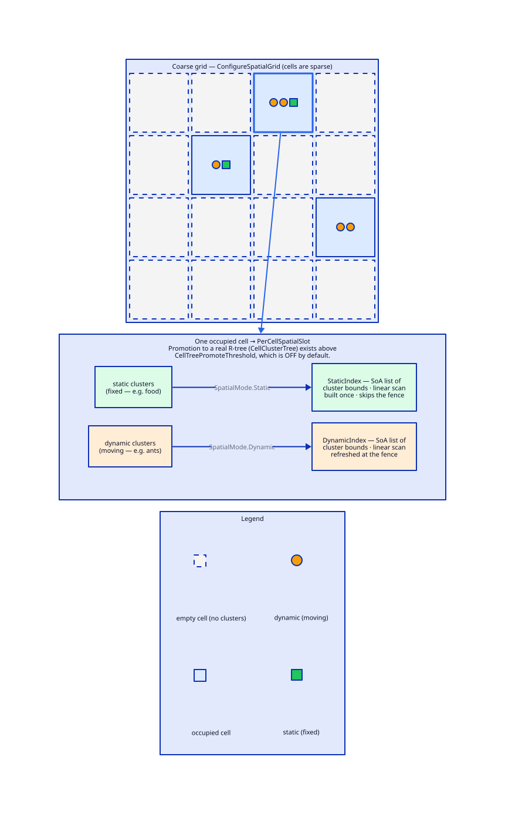

# Spatial index

> **In one line:** mark a 2D or 3D box field (`AABB2F` / `AABB3F`) `[SpatialIndex]` and Typhon answers **geometric** queries — nearby, in-box, along-a-ray — from a spatial structure instead of a scan.

A spatial index indexes an **axis-aligned box** — 2D (`AABB2F`) or 3D (`AABB3F`) — not a point, so a point entity carries a small `Bounds` component whose box collapses onto its position. The broadphase runs natively in 3D; a 2D field is simply queried with an infinite Z range, so 2D and 3D archetypes coexist through one code path. You size the coarse grid once (`ConfigureSpatialGrid` in the engine options — see *Structure* below), then query by geometry: `WhereNearby` / `WhereInAABB` / `WhereRay` (all take `x, y, z, …`).

> 📌 **Precision:** index with the `f32` variants (`AABB2F` / `AABB3F`). The double-precision boxes (`AABB2D` / `AABB3D`) are legal field types, and the R-Tree implementation carries f64 variants, but nothing on the live spatial path instantiates one: the grid buckets on `f32` only, and `ConfigureSpatialGrid` throws `NotSupportedException` for an archetype whose spatial field is `f64` — double-precision spatial indexing is deferred.

The index is maintained at the **[tick fence](xref:concept-tick-fence)** — automatically each tick under the runtime, or via `dbe.WriteTickFence(n)` from a bare transaction. Mutate a `[SpatialIndex]` field through the `WriteSpatial` barrier so the refresh isn't skipped: the barrier flags the move at the write site, which is how the fence knows to visit that cluster at all.

> ⚠️ The barrier is a **convention**, only partly enforced. `TYPHON009` warns on a `ClusterRef.GetSpan<T>` / `Get<T>` write to a spatial component, but it does **not** cover `EntityRef.Write` — a plain write through an `EntityRef` compiles, runs, and silently leaves the index stale. See [Guide ch.2 §5](xref:guide-modeling).

## Structure: sparse grid, per-cell static & dynamic cluster indexes

`ConfigureSpatialGrid` sizes a **coarse cell grid** (world bounds + cell size) — the first acceleration level, and *not* the index itself. The grid is **sparse**: a per-cell index is **lazily allocated only for cells that actually hold clusters**, so empty space costs nothing.

Each populated cell holds **two halves**, split by the field's `SpatialMode`:

- **`DynamicIndex`** — moving entities (the default). Refreshed at the [tick fence](xref:concept-tick-fence), and because the entry is a whole cluster's bound rather than one entity's, most moves land inside it and force no re-insert.
- **`StaticIndex`** — fixed entities, declared `[SpatialIndex(Mode = SpatialMode.Static)]`. Built once, **skips the fence**, and is touched only on create/destroy.

Each half is a **flat SoA array of cluster boxes**, not a tree — it indexes *clusters*, not entities. A query scans that array linearly to find the clusters overlapping the query volume (the **broadphase**), then scans the entities inside each surviving cluster (the **narrowphase**). Linear is the right shape at this scale: a cell typically holds a handful of clusters, and the scan beats a tree at every query selectivity up to 512 clusters per cell, while the tree's update path is far dearer per cluster that moves. A cell that keeps filling past that is a different problem, and the engine solves it itself: above `Spatial.CellTreePromoteThreshold` clusters — 1024 by default — the half is swapped for a real per-cell R-Tree, and it swaps back below half that. The two are mutually exclusive, never both. Most worlds never produce a cell that dense and never build a tree at all.

A query visits a cell's dynamic half, then its static half, then advances to the next cell.

Coarse grid → sparse occupied cells → per-cell static + dynamic cluster indexes. Source: `key-concepts/assets/spatial-grid.d2`.

## How it relates

- **[Component](xref:concept-component)** — declared on an `AABB2F` component field.
- **[Query](xref:concept-query)** — spatial predicates compose with field/`Where` filters (intersection).
- **[Tick fence](xref:concept-tick-fence)** — where the spatial index is refreshed.
- **[Index](xref:concept-index)** — the value-lookup sibling.

## In the API

- `[SpatialIndex]` — with `Mode = SpatialMode.Static` for fixed entities — on a float AABB field (`AABB2F` 2D / `AABB3F` 3D), plus `WhereNearby` / `WhereInAABB` / `WhereRay` on [`EcsQuery<T>`](xref:concept-query) (spatial attributes and geometry types aren't in the API reference).

## Learn & use

- **Narrative:** [Guide ch.2 §4 — spatial queries](xref:guide-modeling)
- **Feature detail:** [spatial](xref:feature-spatial-index) · [spatial query API](xref:feature-spatial-spatial-query-api) · [spatial grid config](xref:feature-spatial-spatial-grid-config)
